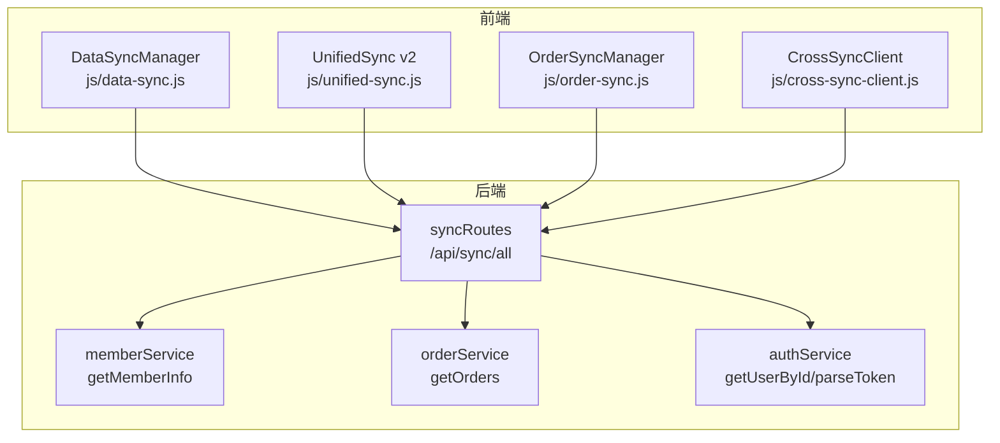
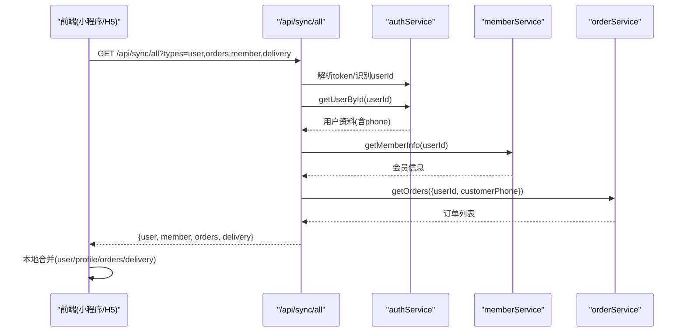
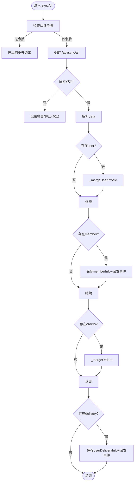
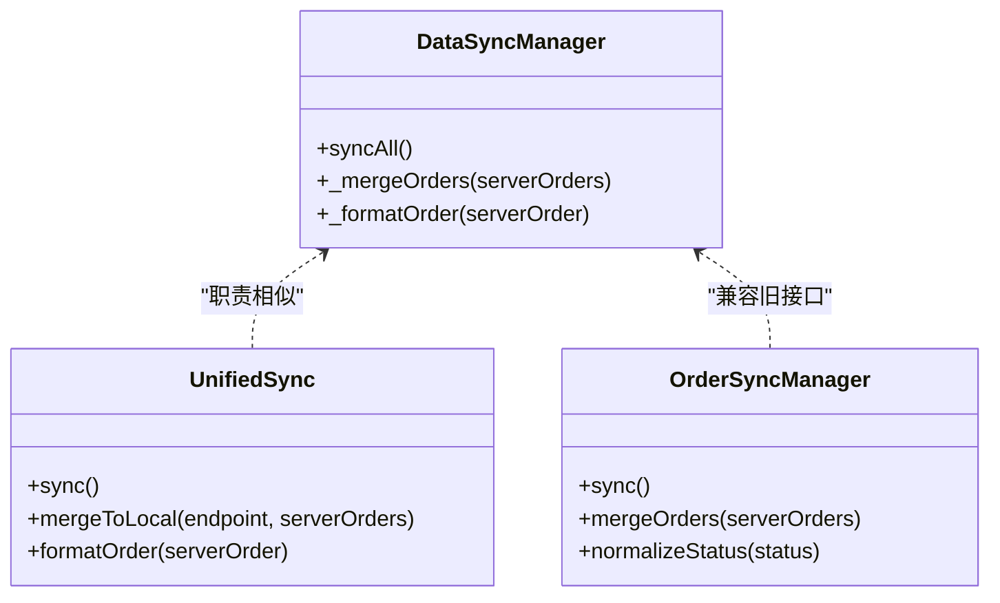
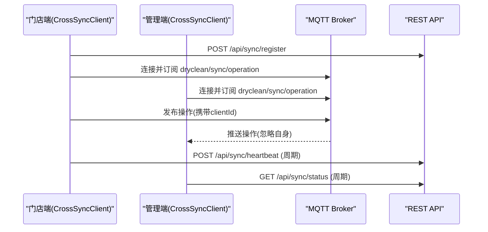
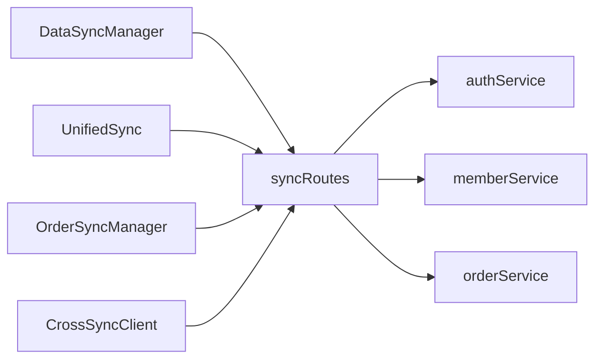

# 数据同步机制

<cite>
**本文引用的文件**   
- [js/data-sync.js](file://js/data-sync.js)
- [js/unified-sync.js](file://js/unified-sync.js)
- [js/order-sync.js](file://js/order-sync.js)
- [js/cross-sync-client.js](file://js/cross-sync-client.js)
- [backend/modules/common/routes/syncRoutes.js](file://backend/modules/common/routes/syncRoutes.js)
- [backend/modules/member/services/memberService.js](file://backend/modules/member/services/memberService.js)
- [backend/modules/cleaning/services/orderService.js](file://backend/modules/cleaning/services/orderService.js)
- [backend/modules/common/services/authService.js](file://backend/modules/common/services/authService.js)
- [wechat-mini-app/app.js](file://wechat-mini-app/app.js)
- [DATA-SYNC-GUIDE.md](file://DATA-SYNC-GUIDE.md)
- [DATA-SYNC-TROUBLESHOOTING.md](file://DATA-SYNC-TROUBLESHOOTING.md)
</cite>

## 目录
1. [引言](#引言)
2. [项目结构](#项目结构)
3. [核心组件](#核心组件)
4. [架构总览](#架构总览)
5. [详细组件分析](#详细组件分析)
6. [依赖关系分析](#依赖关系分析)
7. [性能与优化](#性能与优化)
8. [离线与断网重连](#离线与断网重连)
9. [监控与调试工具](#监控与调试工具)
10. [结论](#结论)

## 引言
本文件面向微信小程序与多端（C端、M端、管理端）的数据同步机制，重点解析统一拉取接口 /api/sync/all 的前后端实现，覆盖跨平台一致性、增量/全量策略、冲突解决、用户资料/订单/会员/配送信息同步逻辑，以及离线缓存、版本管理与断网重连方案。同时提供性能优化建议与监控调试方法，帮助读者快速定位问题并提升同步稳定性与效率。

## 项目结构
前端侧提供三类同步能力：
- 统一数据同步管理器：为 H5 与小程序提供一致的“全量拉取 + 本地合并”能力
- 统一同步 v2：针对 C/M/Admin 三端分别配置存储键与过滤规则
- 旧版订单同步器：兼容历史页面与场景
- 跨端同步客户端：基于 MQTT/REST 的跨端操作广播与状态轮询

后端侧提供：
- 统一同步路由：聚合用户、订单、会员、配送信息的单点拉取接口
- 会员服务：按 userId 返回会员等级/折扣等
- 订单服务：支持按 userId/customerPhone 查询订单
- 认证服务：支持 openid/手机号等多标识登录与账户合并

图表来源
- [js/data-sync.js:111-190](file://js/data-sync.js#L111-L190)
- [js/unified-sync.js:122-204](file://js/unified-sync.js#L122-L204)
- [js/order-sync.js:74-194](file://js/order-sync.js#L74-L194)
- [js/cross-sync-client.js:111-157](file://js/cross-sync-client.js#L111-L157)
- [backend/modules/common/routes/syncRoutes.js:26-186](file://backend/modules/common/routes/syncRoutes.js#L26-L186)
- [backend/modules/member/services/memberService.js:22-94](file://backend/modules/member/services/memberService.js#L22-L94)
- [backend/modules/cleaning/services/orderService.js:177-200](file://backend/modules/cleaning/services/orderService.js#L177-L200)
- [backend/modules/common/services/authService.js:130-198](file://backend/modules/common/services/authService.js#L130-L198)

章节来源
- [DATA-SYNC-GUIDE.md:1-200](file://DATA-SYNC-GUIDE.md#L1-L200)
- [DATA-SYNC-TROUBLESHOOTING.md:1-200](file://DATA-SYNC-TROUBLESHOOTING.md#L1-L200)

## 核心组件
- DataSyncManager（H5/小程序通用）
  - 负责调用 /api/sync/all，按 types=user,orders,member,delivery 拉取数据，并在本地进行字段映射与合并
  - 关键方法：start、stop、syncAll、_mergeUserProfile、_mergeOrders、_formatOrder
- UnifiedSync v2（C/M/Admin 三端）
  - 根据当前页面路径选择端类型，使用不同 storageKey 与 token 获取方式，拉取并合并订单
  - 关键方法：start、sync、fetchFromServer、mergeToLocal、formatOrder
- OrderSyncManager（旧版兼容）
  - 按页面类型选择 API 端点与认证头，拉取并合并订单到本地
  - 关键方法：start、sync、fetchServerOrders、mergeOrders、normalizeStatus
- CrossSyncClient（跨端实时）
  - 通过 REST 注册/心跳与 MQTT 订阅/发布，实现跨端操作广播与在线状态感知
  - 关键方法：start、notifyLocalOperation、_handleSyncOperation、_handleHeartbeat

章节来源
- [js/data-sync.js:18-304](file://js/data-sync.js#L18-L304)
- [js/unified-sync.js:13-393](file://js/unified-sync.js#L13-L393)
- [js/order-sync.js:11-336](file://js/order-sync.js#L11-L336)
- [js/cross-sync-client.js:23-396](file://js/cross-sync-client.js#L23-L396)

## 架构总览
统一数据同步采用“后端唯一权威源 + 前端定时拉取 + 本地合并”的模式。小程序与 H5 均通过 /api/sync/all 一次性拉取 user/orders/member/delivery，前端再按各自业务模型进行字段映射与合并。

图表来源
- [backend/modules/common/routes/syncRoutes.js:26-186](file://backend/modules/common/routes/syncRoutes.js#L26-L186)
- [backend/modules/common/services/authService.js:130-198](file://backend/modules/common/services/authService.js#L130-L198)
- [backend/modules/member/services/memberService.js:22-94](file://backend/modules/member/services/memberService.js#L22-L94)
- [backend/modules/cleaning/services/orderService.js:177-200](file://backend/modules/cleaning/services/orderService.js#L177-L200)
- [js/data-sync.js:111-190](file://js/data-sync.js#L111-L190)

## 详细组件分析

### 统一拉取接口 /api/sync/all 与 DataSyncManager
- 身份识别
  - 优先从 Authorization Bearer 解析 userId；开发环境支持 mock_token_ 前缀以 openid 作为用户标识
  - 若解析失败，回退到 query.userId/openid
- 跨平台手机号匹配
  - 优先使用 query.phone，其次使用用户资料中的 phone，用于订单跨平台匹配
- 并行加载
  - 并行请求会员、订单、配送信息，减少端到端延迟
- 返回结构
  - data.user / data.member / data.orders / data.delivery

DataSyncManager 处理流程
- 启动后先立即执行一次 syncAll，随后按间隔定时触发
- 收到响应后：
  - 用户资料：_mergeUserProfile 将服务端字段映射到本地 userInfo，保留未变更字段
  - 会员信息：直接写入 memberInfo 并派发事件
  - 订单：_mergeOrders 以后端为准去重合并，保留本地独有记录
  - 配送：写入 userDeliveryInfo 并派发事件
- 错误处理：超时/网络异常静默失败，避免阻塞 UI

图表来源
- [js/data-sync.js:111-190](file://js/data-sync.js#L111-L190)
- [js/data-sync.js:195-284](file://js/data-sync.js#L195-L284)
- [backend/modules/common/routes/syncRoutes.js:26-186](file://backend/modules/common/routes/syncRoutes.js#L26-L186)

章节来源
- [js/data-sync.js:18-304](file://js/data-sync.js#L18-L304)
- [backend/modules/common/routes/syncRoutes.js:26-186](file://backend/modules/common/routes/syncRoutes.js#L26-L186)

### 用户资料同步逻辑（字段映射、合并、优先级）
- 字段映射
  - name/avatar/phone/gender/birthday/_id/openid/creditScore/userNo 等字段由服务端覆盖或保留本地值
- 合并策略
  - 服务端字段优先；若服务端为空则保留本地已有值
- 优先级
  - 用户资料以服务端为权威，确保跨端一致
- 小程序侧
  - app.js 在登录后调用 /api/sync/all，并将结果合并到 wx.setStorageSync('userInfo') 与全局 globalData

章节来源
- [js/data-sync.js:195-213](file://js/data-sync.js#L195-L213)
- [wechat-mini-app/app.js:358-393](file://wechat-mini-app/app.js#L358-L393)

### 订单数据同步机制（列表获取、状态更新、历史保留）
- 列表获取
  - 后端通过 orderService.getOrders 支持按 userId 与 customerPhone 查询，保障跨平台订单可见性
- 状态更新
  - 前端 _mergeOrders 以后端为准进行去重合并，保留本地独有的订单（如纯本地创建尚未落库）
  - 旧版 OrderSyncManager.normalizeStatus 对多种状态名做标准化映射
- 历史保留
  - 本地仅追加新增订单，不删除历史；排序按 createdAt 降序展示最新在前
- 小程序侧
  - app.js 中拉取 orders 后写入本地并派发事件供页面刷新

图表来源
- [js/data-sync.js:218-284](file://js/data-sync.js#L218-L284)
- [js/unified-sync.js:207-328](file://js/unified-sync.js#L207-L328)
- [js/order-sync.js:196-320](file://js/order-sync.js#L196-L320)

章节来源
- [js/data-sync.js:218-284](file://js/data-sync.js#L218-L284)
- [js/unified-sync.js:207-328](file://js/unified-sync.js#L207-L328)
- [js/order-sync.js:196-320](file://js/order-sync.js#L196-L320)
- [backend/modules/cleaning/services/orderService.js:177-200](file://backend/modules/cleaning/services/orderService.js#L177-L200)

### 会员信息与配送信息同步策略
- 会员信息
  - 后端 memberService.getMemberInfo 根据 userId 计算等级与折扣，非 ObjectId 时返回模拟数据兜底
  - 前端直接持久化 memberInfo 并派发事件
- 配送信息
  - 后端从用户记录的 address/deliveryInfo 返回 defaultAddress/savedInfo
  - 前端优先使用 savedInfo，否则 fallback 到 defaultAddress，并持久化 userDeliveryInfo

章节来源
- [backend/modules/member/services/memberService.js:22-94](file://backend/modules/member/services/memberService.js#L22-L94)
- [backend/modules/common/routes/syncRoutes.js:157-174](file://backend/modules/common/routes/syncRoutes.js#L157-L174)
- [js/data-sync.js:157-177](file://js/data-sync.js#L157-L177)

### 跨端实时同步（MQTT/REST）
- 注册与心跳
  - 前端通过 REST 注册 clientId/clientType/storeId，并周期性心跳保持在线
- 消息通道
  - 订阅 dryclean/sync/operation 接收对端操作；dryclean/sync/heartbeat 感知对端在线状态
- 本地去重
  - 维护 localOperations 列表，避免重复处理自己发出的操作
- 状态轮询
  - 当 MQTT 不可用时，通过 /api/sync/status 轮询补充状态

图表来源
- [js/cross-sync-client.js:111-157](file://js/cross-sync-client.js#L111-L157)
- [js/cross-sync-client.js:160-232](file://js/cross-sync-client.js#L160-L232)
- [js/cross-sync-client.js:314-329](file://js/cross-sync-client.js#L314-L329)

章节来源
- [js/cross-sync-client.js:23-396](file://js/cross-sync-client.js#L23-L396)

## 依赖关系分析
- 前端模块耦合
  - DataSyncManager 与 UnifiedSync 职责相近但面向不同端；OrderSyncManager 为兼容层
  - CrossSyncClient 独立于数据拉取，专注跨端操作广播与状态
- 后端服务依赖
  - syncRoutes 依赖 authService/memberService/orderService
  - orderService 依赖数据库模型与支付/通知等服务（此处仅关注查询）
- 外部依赖
  - MQTT（可选）：用于跨端实时；不可用时降级为 REST 轮询

图表来源
- [js/data-sync.js:111-190](file://js/data-sync.js#L111-L190)
- [js/unified-sync.js:122-204](file://js/unified-sync.js#L122-L204)
- [js/order-sync.js:74-194](file://js/order-sync.js#L74-L194)
- [js/cross-sync-client.js:111-157](file://js/cross-sync-client.js#L111-L157)
- [backend/modules/common/routes/syncRoutes.js:26-186](file://backend/modules/common/routes/syncRoutes.js#L26-L186)

章节来源
- [js/data-sync.js:18-304](file://js/data-sync.js#L18-L304)
- [js/unified-sync.js:13-393](file://js/unified-sync.js#L13-L393)
- [js/order-sync.js:11-336](file://js/order-sync.js#L11-L336)
- [js/cross-sync-client.js:23-396](file://js/cross-sync-client.js#L23-L396)
- [backend/modules/common/routes/syncRoutes.js:26-186](file://backend/modules/common/routes/syncRoutes.js#L26-L186)

## 性能与优化
- 批量与分页
  - 后端 /api/sync/all 内部对订单查询使用 page/pageSize=100，适合中小规模数据一次性拉取
- 并发请求
  - 会员/订单/配送并行加载，降低端到端延迟
- 本地合并复杂度
  - 使用 Map/Set 去重合并，时间复杂度近似 O(n)，空间复杂度 O(n)
- 缓存策略
  - 前端 localStorage 持久化，页面恢复/切前台时主动触发同步
- 建议
  - 大数据量场景可引入增量同步（lastSyncTime/updatedAfter），减少带宽与CPU消耗
  - 对高频字段（如订单状态）考虑短轮询或 WebSocket/MQTT 推送替代长间隔定时

章节来源
- [backend/modules/common/routes/syncRoutes.js:120-154](file://backend/modules/common/routes/syncRoutes.js#L120-L154)
- [js/data-sync.js:218-251](file://js/data-sync.js#L218-L251)
- [js/unified-sync.js:207-264](file://js/unified-sync.js#L207-L264)

## 离线与断网重连
- 本地缓存
  - 所有关键数据（用户、订单、会员、配送）均持久化至 localStorage，离线可用
- 版本管理
  - 记录 lastSyncTime，便于判断数据新鲜度；UnifiedSync 额外维护备份键与更新时间
- 断网重连
  - 定时器自动重试；visibilitychange/pageshow/storage 事件触发手动同步
  - CrossSyncClient 在 MQTT 断开时降级为 REST 轮询
- 小程序侧
  - app.js 在登录后发起同步，失败不影响本地展示

章节来源
- [js/data-sync.js:309-337](file://js/data-sync.js#L309-L337)
- [js/unified-sync.js:395-412](file://js/unified-sync.js#L395-L412)
- [js/cross-sync-client.js:314-329](file://js/cross-sync-client.js#L314-L329)
- [DATA-SYNC-GUIDE.md:43-80](file://DATA-SYNC-GUIDE.md#L43-L80)

## 监控与调试工具
- 控制台日志
  - DataSyncManager/UnifiedSync/OrderSyncManager 均提供结构化日志，包含时间戳与级别
- 诊断页面
  - DATA-SYNC-GUIDE.md 提供了流程图与常用命令
  - DATA-SYNC-TROUBLESHOOTING.md 提供端口隔离、缓存清理、手动同步等排查步骤
- 建议
  - 开启 verbose/enableLog，结合浏览器 Network 面板观察 /api/sync/all 耗时
  - 使用 CrossSyncClient.getStatus 查看 MQTT 连接与对端在线状态

章节来源
- [DATA-SYNC-GUIDE.md:104-140](file://DATA-SYNC-GUIDE.md#L104-L140)
- [DATA-SYNC-TROUBLESHOOTING.md:182-195](file://DATA-SYNC-TROUBLESHOOTING.md#L182-L195)
- [js/cross-sync-client.js:387-395](file://js/cross-sync-client.js#L387-L395)

## 结论
本系统通过 /api/sync/all 统一入口，配合前端多套同步器与本地合并策略，实现了跨端一致性与离线可用性。对于大规模与高实时性需求，建议引入增量同步与更稳定的推送通道（MQTT/WebSocket），并对高频字段建立索引与缓存，进一步提升性能与体验。