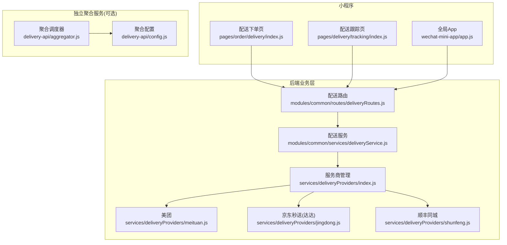
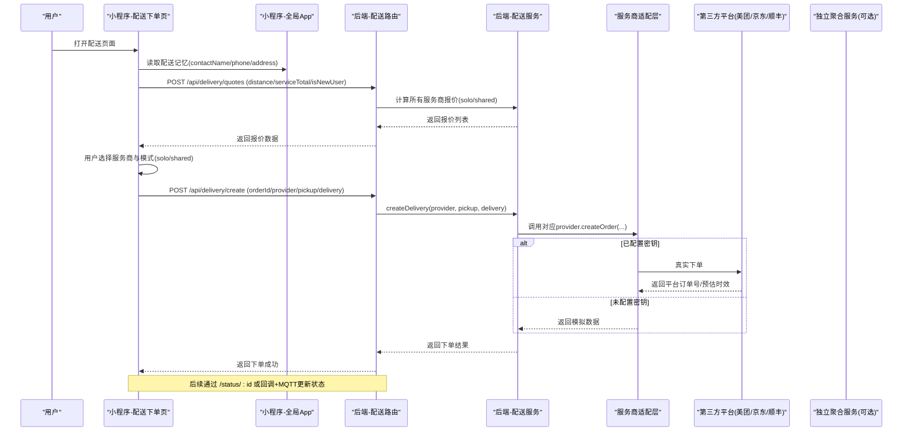
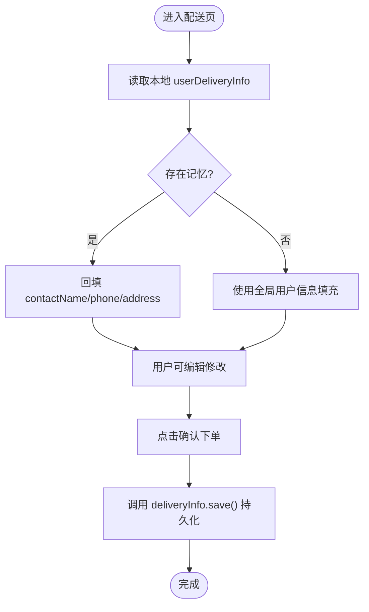
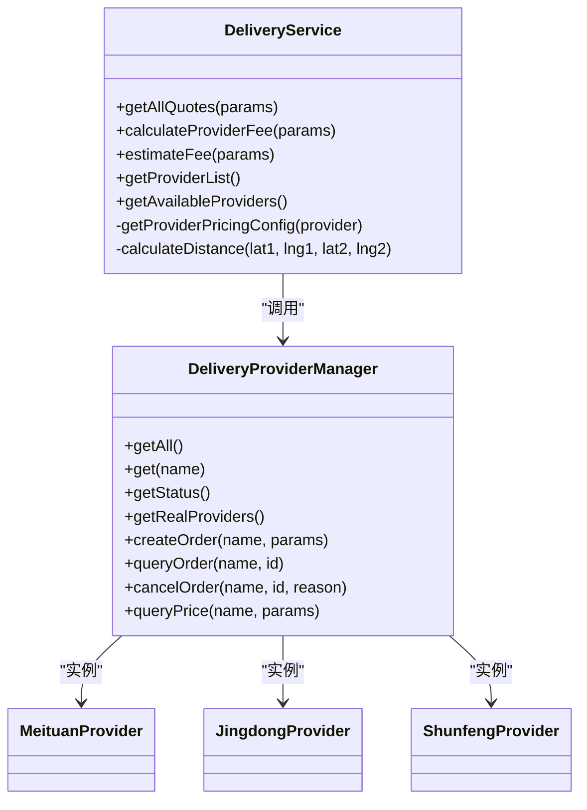
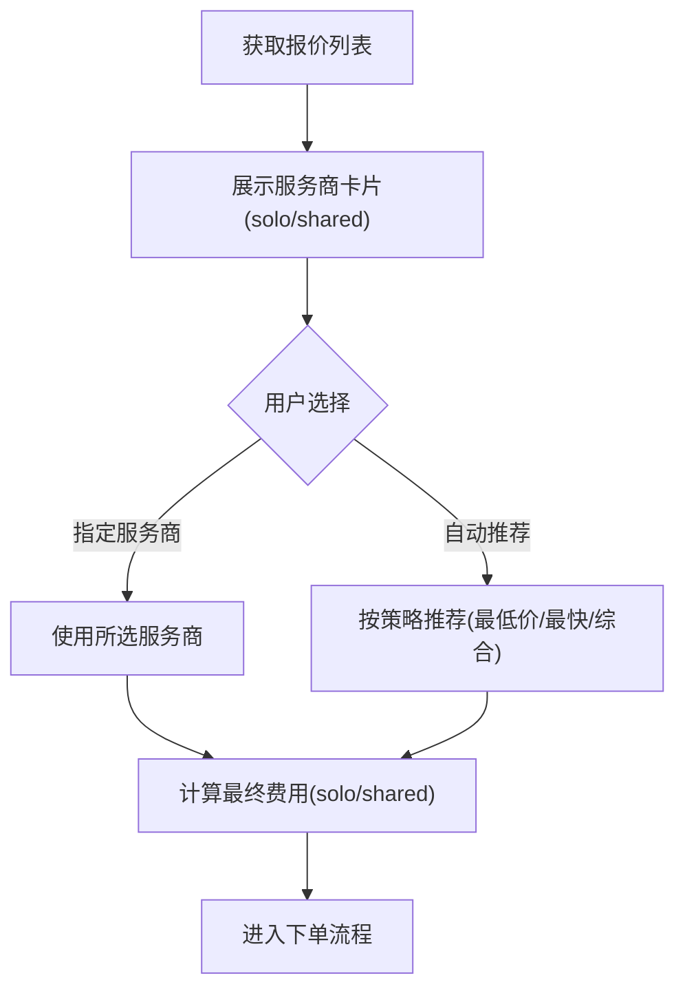
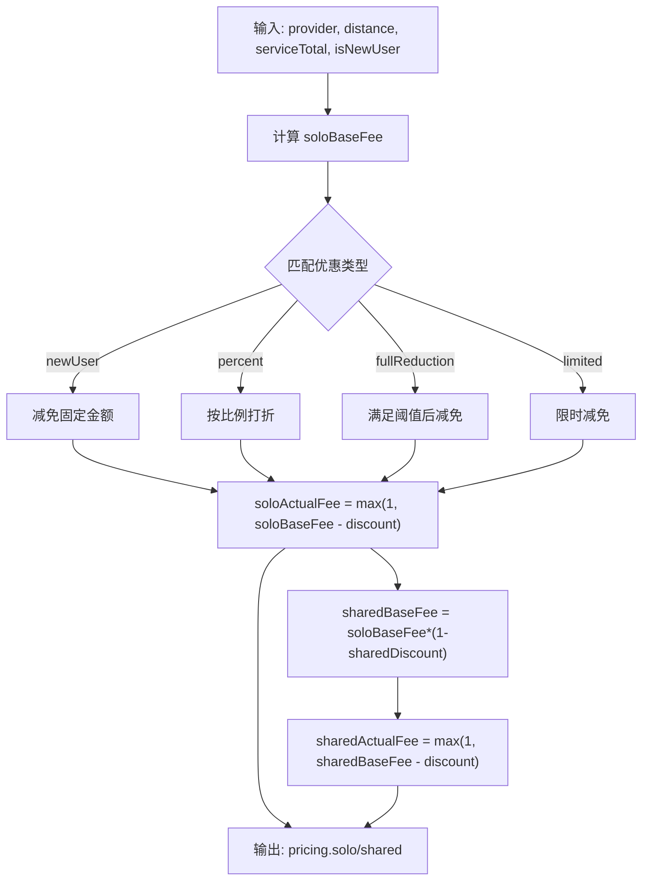
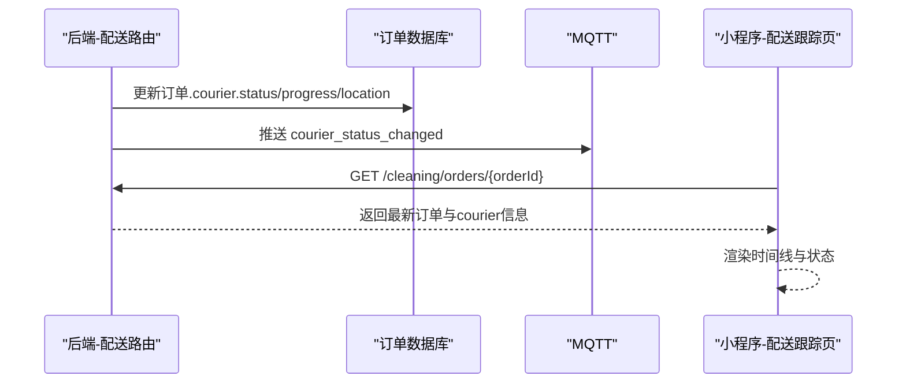
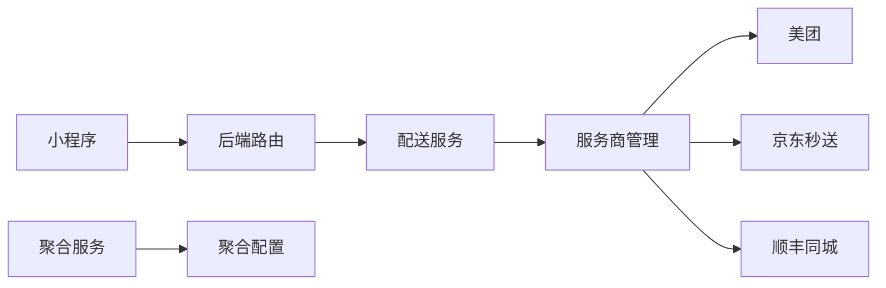

# 配送服务集成

<cite>
**本文引用的文件**   
- [delivery.js](file://api/delivery.js)
- [delivery-api.js](file://api/delivery-api.js)
- [aggregator.js](file://delivery-api/aggregator.js)
- [config.js](file://delivery-api/config.js)
- [index.js](file://backend/services/deliveryProviders/index.js)
- [meituan.js](file://backend/services/deliveryProviders/meituan.js)
- [jingdong.js](file://backend/services/deliveryProviders/jingdong.js)
- [shunfeng.js](file://backend/services/deliveryProviders/shunfeng.js)
- [deliveryService.js](file://backend/modules/common/services/deliveryService.js)
- [deliveryRoutes.js](file://backend/modules/common/routes/deliveryRoutes.js)
- [app.js](file://wechat-mini-app/app.js)
- [delivery/index.js](file://wechat-mini-app/pages/order/delivery/index.js)
- [tracking/index.js](file://wechat-mini-app/pages/delivery/tracking/index.js)
</cite>

## 目录
1. [简介](#简介)
2. [项目结构](#项目结构)
3. [核心组件](#核心组件)
4. [架构总览](#架构总览)
5. [详细组件分析](#详细组件分析)
6. [依赖关系分析](#依赖关系分析)
7. [性能与可用性](#性能与可用性)
8. [故障排查指南](#故障排查指南)
9. [结论](#结论)
10. [附录：API定义与数据模型](#附录api定义与数据模型)

## 简介
本文件面向微信小程序“干洗系统”的配送服务集成，覆盖以下关键能力：
- 配送信息记忆：contactName、contactPhone、pickupAddress 等字段的持久化存储与自动回填。
- 聚合配送报价：后端统一计算并返回多家服务商（美团跑腿、京东秒送、顺丰同城、淘宝闪送）的一对一/拼单两种模式报价。
- 服务商选择机制：前端展示多平台报价与优惠信息，支持用户选择或系统推荐最优方案。
- 费用计算规则：距离定价、新用户优惠、满减/折扣、拼单折扣等策略。
- 配送状态跟踪：订单创建后通过回调驱动状态流转，小程序端实时刷新物流信息与送达通知。
- 错误处理与降级：网络异常、第三方API失败时自动降级为模拟数据，保障用户体验。
- 体验优化建议：离线兜底、加载态、错误提示、价格透明、时间预估等。

## 项目结构
本项目在小程序端、后端业务层与独立聚合服务三个层面实现配送能力：
- 小程序端
  - 配送下单页：负责收集配送信息、加载报价、选择服务商、保存记忆信息并跳转支付。
  - 配送跟踪页：拉取订单详情，渲染配送进度、司机信息、时间线。
  - 全局应用：提供配送信息记忆模块、请求封装与Mock降级。
- 后端业务层
  - 配送路由：对外暴露报价、估算、下单、查询、取消、回调等接口。
  - 配送服务：定价计算、报价聚合、距离估算、状态标准化。
  - 服务商适配层：美团、京东秒送（达达）、顺丰同城、淘宝闪送的统一入口与具体实现。
- 独立聚合服务（可选微服务）
  - 聚合调度器：并行询价、排序与推荐；配置化管理各平台密钥与开关。

图表来源
- [delivery/index.js:1-402](file://wechat-mini-app/pages/order/delivery/index.js#L1-L402)
- [tracking/index.js:1-217](file://wechat-mini-app/pages/delivery/tracking/index.js#L1-L217)
- [app.js:711-800](file://wechat-mini-app/app.js#L711-L800)
- [deliveryRoutes.js:1-323](file://backend/modules/common/routes/deliveryRoutes.js#L1-L323)
- [deliveryService.js:1-322](file://backend/modules/common/services/deliveryService.js#L1-L322)
- [index.js:1-87](file://backend/services/deliveryProviders/index.js#L1-L87)
- [meituan.js:1-257](file://backend/services/deliveryProviders/meituan.js#L1-L257)
- [jingdong.js:1-278](file://backend/services/deliveryProviders/jingdong.js#L1-L278)
- [shunfeng.js:1-262](file://backend/services/deliveryProviders/shunfeng.js#L1-L262)
- [aggregator.js:1-237](file://delivery-api/aggregator.js#L1-L237)
- [config.js:1-93](file://delivery-api/config.js#L1-L93)

章节来源
- [delivery/index.js:1-402](file://wechat-mini-app/pages/order/delivery/index.js#L1-L402)
- [tracking/index.js:1-217](file://wechat-mini-app/pages/delivery/tracking/index.js#L1-L217)
- [app.js:711-800](file://wechat-mini-app/app.js#L711-L800)
- [deliveryRoutes.js:1-323](file://backend/modules/common/routes/deliveryRoutes.js#L1-L323)
- [deliveryService.js:1-322](file://backend/modules/common/services/deliveryService.js#L1-L322)
- [index.js:1-87](file://backend/services/deliveryProviders/index.js#L1-L87)
- [meituan.js:1-257](file://backend/services/deliveryProviders/meituan.js#L1-L257)
- [jingdong.js:1-278](file://backend/services/deliveryProviders/jingdong.js#L1-L278)
- [shunfeng.js:1-262](file://backend/services/deliveryProviders/shunfeng.js#L1-L262)
- [aggregator.js:1-237](file://delivery-api/aggregator.js#L1-L237)
- [config.js:1-93](file://delivery-api/config.js#L1-L93)

## 核心组件
- 配送信息记忆模块（小程序）
  - 提供 save/load/clear 方法，持久化 contactName、contactPhone、pickupAddress 等字段，并在下单页自动回填。
- 配送报价与服务商列表（后端）
  - 统一入口 deliveryService 提供 getAllQuotes/estimateFee，按距离、重量、新用户、拼单等策略计算一对一/拼单价格。
- 服务商适配层（后端）
  - index.js 作为统一入口，meituan/jingdong/shunfeng 分别对接各自开放平台，具备真实/模拟双模式。
- 聚合调度器（独立服务，可选）
  - aggregator.js 并行询价、排序与推荐，支持最低价格/最快/综合推荐策略。
- 配送路由（后端）
  - deliveryRoutes.js 暴露 /quotes、/estimate、/create、/status/:id、/cancel、/callback 等接口，并驱动状态同步与MQTT推送。
- 小程序全局工具
  - app.js 提供 request 封装、Mock降级、配送信息记忆、聚合配送 queryProviders 调用。

章节来源
- [app.js:711-800](file://wechat-mini-app/app.js#L711-L800)
- [delivery/index.js:137-184](file://wechat-mini-app/pages/order/delivery/index.js#L137-L184)
- [deliveryService.js:170-292](file://backend/modules/common/services/deliveryService.js#L170-L292)
- [index.js:1-87](file://backend/services/deliveryProviders/index.js#L1-L87)
- [meituan.js:1-257](file://backend/services/deliveryProviders/meituan.js#L1-L257)
- [jingdong.js:1-278](file://backend/services/deliveryProviders/jingdong.js#L1-L278)
- [shunfeng.js:1-262](file://backend/services/deliveryProviders/shunfeng.js#L1-L262)
- [aggregator.js:50-129](file://delivery-api/aggregator.js#L50-L129)
- [deliveryRoutes.js:28-170](file://backend/modules/common/routes/deliveryRoutes.js#L28-L170)

## 架构总览
下图展示了从小程序到后端再到第三方平台的完整链路，以及独立聚合服务的可选路径。

图表来源
- [delivery/index.js:137-184](file://wechat-mini-app/pages/order/delivery/index.js#L137-L184)
- [deliveryRoutes.js:86-133](file://backend/modules/common/routes/deliveryRoutes.js#L86-L133)
- [deliveryService.js:45-70](file://backend/modules/common/services/deliveryService.js#L45-L70)
- [index.js:57-62](file://backend/services/deliveryProviders/index.js#L57-L62)
- [meituan.js:41-93](file://backend/services/deliveryProviders/meituan.js#L41-L93)
- [jingdong.js:50-98](file://backend/services/deliveryProviders/jingdong.js#L50-L98)
- [shunfeng.js:45-95](file://backend/services/deliveryProviders/shunfeng.js#L45-L95)
- [aggregator.js:137-197](file://delivery-api/aggregator.js#L137-L197)

## 详细组件分析

### 配送信息记忆功能
- 存储键名：userDeliveryInfo
- 字段：contactName、contactPhone、pickupAddress、updateTime
- 生命周期
  - 保存：用户在配送页确认下单前调用 save()，写入本地缓存。
  - 加载：进入配送页 onLoad 时优先从缓存加载，若无则回退到全局用户信息。
  - 清除：提供 clear() 方法用于清空历史记忆。
- 与后端同步
  - 全局 syncAllData 会尝试从后端同步 savedInfo/defaultAddress，合并到本地 userDeliveryInfo。

图表来源
- [app.js:711-734](file://wechat-mini-app/app.js#L711-L734)
- [delivery/index.js:77-97](file://wechat-mini-app/pages/order/delivery/index.js#L77-L97)
- [delivery/index.js:333-339](file://wechat-mini-app/pages/order/delivery/index.js#L333-L339)

章节来源
- [app.js:711-734](file://wechat-mini-app/app.js#L711-L734)
- [delivery/index.js:77-97](file://wechat-mini-app/pages/order/delivery/index.js#L77-L97)
- [delivery/index.js:333-339](file://wechat-mini-app/pages/order/delivery/index.js#L333-L339)

### 聚合配送API集成与报价计算
- 小程序侧
  - 通过 app.delivery.queryProviders(params) 或页面直接调用 /api/delivery/quotes 获取报价。
  - 若后端不可用，使用 getMockProviders() 提供的本地默认数据兜底。
- 后端侧
  - deliveryRoutes.post('/quotes') 调用 deliveryService.getAllQuotes()。
  - deliveryService.calculateProviderFee() 计算每个服务商的 solo/shared 两种模式价格，包含：
    - 基础价 = max(minFee, base + distance * perKm)
    - 优惠：新用户立减、百分比折扣、满额减、限时优惠
    - 拼单价 = soloBaseFee * (1 - sharedDiscount)，再扣减相同优惠
    - 预计时长 = distance * 3 + 10（分钟）
- 独立聚合服务（可选）
  - aggregator.queryPrices() 并行调用各 provider.queryPrice()，按价格排序并给出推荐。

图表来源
- [deliveryService.js:117-303](file://backend/modules/common/services/deliveryService.js#L117-L303)
- [index.js:20-87](file://backend/services/deliveryProviders/index.js#L20-L87)
- [meituan.js:1-257](file://backend/services/deliveryProviders/meituan.js#L1-L257)
- [jingdong.js:1-278](file://backend/services/deliveryProviders/jingdong.js#L1-L278)
- [shunfeng.js:1-262](file://backend/services/deliveryProviders/shunfeng.js#L1-L262)

章节来源
- [deliveryRoutes.js:37-59](file://backend/modules/common/routes/deliveryRoutes.js#L37-L59)
- [deliveryService.js:170-292](file://backend/modules/common/services/deliveryService.js#L170-L292)
- [index.js:1-87](file://backend/services/deliveryProviders/index.js#L1-L87)
- [aggregator.js:50-95](file://delivery-api/aggregator.js#L50-L95)

### 配送服务商选择机制
- 前端展示
  - 从后端 /quotes 返回的 providers 列表中包含 icon、rating、estimatedTime、pricing.solo/shared、discountInfo 等。
  - 用户可选择“一对一”或“拼单”，页面根据 selectedProvider.pricing[deliveryType] 显示最终费用。
- 推荐策略（独立聚合服务）
  - 最低价、最快、综合评分（价格权重0.4、时效权重0.6）。
- 兼容旧接口
  - api/delivery-api.js 提供 queryProviders 的浏览器端示例（含默认providers），便于非Node环境演示。

图表来源
- [delivery/index.js:137-184](file://wechat-mini-app/pages/order/delivery/index.js#L137-L184)
- [delivery/index.js:259-301](file://wechat-mini-app/pages/order/delivery/index.js#L259-L301)
- [aggregator.js:102-129](file://delivery-api/aggregator.js#L102-L129)
- [delivery-api.js:65-94](file://api/delivery-api.js#L65-L94)

章节来源
- [delivery/index.js:137-184](file://wechat-mini-app/pages/order/delivery/index.js#L137-L184)
- [delivery/index.js:259-301](file://wechat-mini-app/pages/order/delivery/index.js#L259-L301)
- [aggregator.js:102-129](file://delivery-api/aggregator.js#L102-L129)
- [delivery-api.js:65-94](file://api/delivery-api.js#L65-L94)

### 配送费用计算规则
- 距离定价
  - 基础价 = max(minFee, base + distance * perKm)
  - 距离由 Haversine 公式估算（如未提供）。
- 新用户优惠
  - 当 isNewUser=true 且服务商 promo.type=newUser 时，减免固定金额。
- 满减/折扣
  - percent：按比例打折；fullReduction：满足 serviceTotal 阈值后减免固定金额；limited：限时固定减免。
- 拼单折扣
  - sharedBaseFee = soloBaseFee * (1 - sharedDiscount)
  - sharedActualFee = max(1, sharedBaseFee - discount)
- 最小费用保护
  - 最终费用不低于1元。

图表来源
- [deliveryService.js:186-259](file://backend/modules/common/services/deliveryService.js#L186-L259)
- [deliveryService.js:294-303](file://backend/modules/common/services/deliveryService.js#L294-L303)

章节来源
- [deliveryService.js:186-259](file://backend/modules/common/services/deliveryService.js#L186-L259)
- [deliveryService.js:294-303](file://backend/modules/common/services/deliveryService.js#L294-L303)

### 配送状态跟踪与通知
- 下单后
  - 后端路由在创建成功后尝试启动跟踪模拟（开发调试），并通过回调接口接收第三方平台状态。
- 回调处理
  - /api/delivery/callback 将平台状态映射为系统 courierStatus，并更新订单 couriers 字段与 deliveryStatus。
  - 通过 MQTT 推送给C端实时更新，同时发布事件通知M端/Admin。
- 小程序端
  - 配送跟踪页拉取订单详情，渲染状态文本、司机信息、时间线与ETA。

图表来源
- [deliveryRoutes.js:172-280](file://backend/modules/common/routes/deliveryRoutes.js#L172-L280)
- [tracking/index.js:37-71](file://wechat-mini-app/pages/delivery/tracking/index.js#L37-L71)

章节来源
- [deliveryRoutes.js:172-280](file://backend/modules/common/routes/deliveryRoutes.js#L172-L280)
- [tracking/index.js:37-71](file://wechat-mini-app/pages/delivery/tracking/index.js#L37-L71)

### 错误处理与降级方案
- 小程序端
  - request 封装内置硬超时与 fail 分支，自动回退到 getMockResponse 模拟数据。
  - 配送报价失败时，使用本地默认 providers 兜底。
- 后端服务商适配层
  - 各 provider 在 API 调用失败时自动降级为 _mock* 方法，保证可用性与一致性。
- 聚合服务
  - Promise.allSettled 收集错误，仍返回部分成功结果与 errors 列表，不影响整体可用性。

章节来源
- [app.js:438-497](file://wechat-mini-app/app.js#L438-L497)
- [delivery/index.js:167-184](file://wechat-mini-app/pages/order/delivery/index.js#L167-L184)
- [meituan.js:88-93](file://backend/services/deliveryProviders/meituan.js#L88-L93)
- [jingdong.js:94-98](file://backend/services/deliveryProviders/jingdong.js#L94-L98)
- [shunfeng.js:91-95](file://backend/services/deliveryProviders/shunfeng.js#L91-L95)
- [aggregator.js:84-95](file://delivery-api/aggregator.js#L84-L95)

### 用户体验优化建议
- 明确展示原价、折扣、实付与拼单节省金额，提升价格透明度。
- 在加载报价时显示骨架屏或占位图，减少等待焦虑。
- 对地址输入提供地图选点与常用地址快捷选择。
- 对电话格式进行即时校验，避免提交失败。
- 在配送跟踪页提供一键拨号联系骑手与门店。
- 对长时间无响应的状态轮询增加退避与上限。

## 依赖关系分析
- 小程序依赖后端 /api/delivery/* 接口；在不可用时回退到本地 Mock。
- 后端 deliveryRoutes 依赖 deliveryService 进行定价与报价聚合。
- deliveryService 依赖 services/deliveryProviders 统一入口，再分发至具体平台实现。
- 独立聚合服务 aggregator 与 config 解耦，便于独立部署与扩展新平台。

图表来源
- [deliveryRoutes.js:1-30](file://backend/modules/common/routes/deliveryRoutes.js#L1-L30)
- [deliveryService.js:1-35](file://backend/modules/common/services/deliveryService.js#L1-L35)
- [index.js:1-30](file://backend/services/deliveryProviders/index.js#L1-L30)
- [aggregator.js:1-36](file://delivery-api/aggregator.js#L1-L36)
- [config.js:1-30](file://delivery-api/config.js#L1-L30)

章节来源
- [deliveryRoutes.js:1-30](file://backend/modules/common/routes/deliveryRoutes.js#L1-L30)
- [deliveryService.js:1-35](file://backend/modules/common/services/deliveryService.js#L1-L35)
- [index.js:1-30](file://backend/services/deliveryProviders/index.js#L1-L30)
- [aggregator.js:1-36](file://delivery-api/aggregator.js#L1-L36)
- [config.js:1-30](file://delivery-api/config.js#L1-L30)

## 性能与可用性
- 并行询价：聚合服务使用 Promise.allSettled 并发调用各平台，降低端到端延迟。
- 超时控制：小程序 request 设置硬超时，防止阻塞；后端各 provider 设置 HTTP 超时。
- 降级策略：第三方API失败自动回退到模拟数据，确保主流程不中断。
- 缓存与记忆：配送信息本地持久化，减少重复输入与网络开销。
- 建议
  - 引入价格缓存与最近一次报价快照，缩短二次加载时间。
  - 对高频接口增加限流与熔断，避免雪崩。
  - 对长耗时操作采用分页与懒加载。

## 故障排查指南
- 小程序无法获取报价
  - 检查 /api/delivery/quotes 是否可达；查看 request 的 fail 分支是否触发 Mock。
  - 确认后端 deliveryService 是否正确初始化与返回 data 数组。
- 下单失败
  - 检查 provider 是否启用与密钥是否配置；查看对应 provider 的日志与降级行为。
  - 确认回调地址可被第三方平台访问。
- 状态不同步
  - 核对 /api/delivery/callback 的状态映射表是否覆盖平台返回码。
  - 检查 MQTT 推送是否正常，小程序是否能订阅到事件。
- 定位手段
  - 使用 /api/delivery/tracking/active 查看活跃跟踪任务。
  - 在 provider 实现中打印签名与请求体，验证参数正确性。

章节来源
- [deliveryRoutes.js:282-322](file://backend/modules/common/routes/deliveryRoutes.js#L282-L322)
- [meituan.js:88-93](file://backend/services/deliveryProviders/meituan.js#L88-L93)
- [jingdong.js:94-98](file://backend/services/deliveryProviders/jingdong.js#L94-L98)
- [shunfeng.js:91-95](file://backend/services/deliveryProviders/shunfeng.js#L91-L95)

## 结论
本集成以“统一入口 + 分层适配 + 强降级”为核心设计，既保证了多平台接入的可扩展性，又确保了弱网与第三方不稳定场景下的可用性。通过前后端协同的报价计算与状态回调机制，实现了透明的价格展示、灵活的下单选择与可靠的配送跟踪。建议在后续迭代中完善价格缓存、监控告警与更丰富的促销策略，进一步提升转化与体验。

## 附录：API定义与数据模型

### 后端配送接口
- GET /api/delivery/providers
  - 说明：获取支持的配送平台（含报价配置与接入模式）
  - 响应：{ success, data: [{ code, name, icon, rating, mode, enabled }] }
- POST /api/delivery/quotes
  - 入参：{ pickup?, delivery?, distance, serviceTotal, isNewUser }
  - 说明：一键获取所有服务商报价（含 solo/shared）
  - 响应：{ success, data: [{ id, name, icon, rating, distance, estimatedMinutes, estimatedTime, hasDiscount, discountInfo, pricing: { solo, shared } }] }
- POST /api/delivery/estimate
  - 入参：{ provider, pickup, delivery, deliveryType, serviceTotal, isNewUser }
  - 说明：估算单个服务商费用（兼容旧接口）
  - 响应：{ success, data: { provider, distance, fee, originalFee, discount, currency, estimatedMinutes, estimatedTime, hasDiscount, discountInfo, deliveryType } }
- POST /api/delivery/create
  - 鉴权：需要登录
  - 入参：{ orderId, provider, pickup, delivery }
  - 说明：创建配送订单（内部调用对应 provider）
  - 响应：{ success, platformOrderId, status, ... }
- GET /api/delivery/status/:deliveryId
  - 鉴权：需要登录
  - 说明：查询配送状态（内部调用对应 provider）
  - 响应：{ success, provider, data: { status, driverName, driverPhone, eta, distance, _mode } }
- POST /api/delivery/cancel
  - 鉴权：需要登录
  - 入参：{ deliveryId, provider, reason }
  - 说明：取消配送
  - 响应：{ success, message }
- POST /api/delivery/callback
  - 说明：第三方平台回调，驱动状态同步与MQTT推送
  - 入参：{ deliveryId, status, driverInfo?, location?, timestamp?, description? }
  - 响应：{ success, mappedStatus }

章节来源
- [deliveryRoutes.js:12-170](file://backend/modules/common/routes/deliveryRoutes.js#L12-L170)

### 小程序端相关
- 配送信息记忆
  - 存储键：userDeliveryInfo
  - 字段：contactName、contactPhone、pickupAddress、updateTime
- 配送报价查询
  - 方法：app.delivery.queryProviders({ distance, serviceTotal, isNewUser })
  - 失败回退：getMockProviders()

章节来源
- [app.js:711-800](file://wechat-mini-app/app.js#L711-L800)
- [delivery/index.js:137-184](file://wechat-mini-app/pages/order/delivery/index.js#L137-L184)