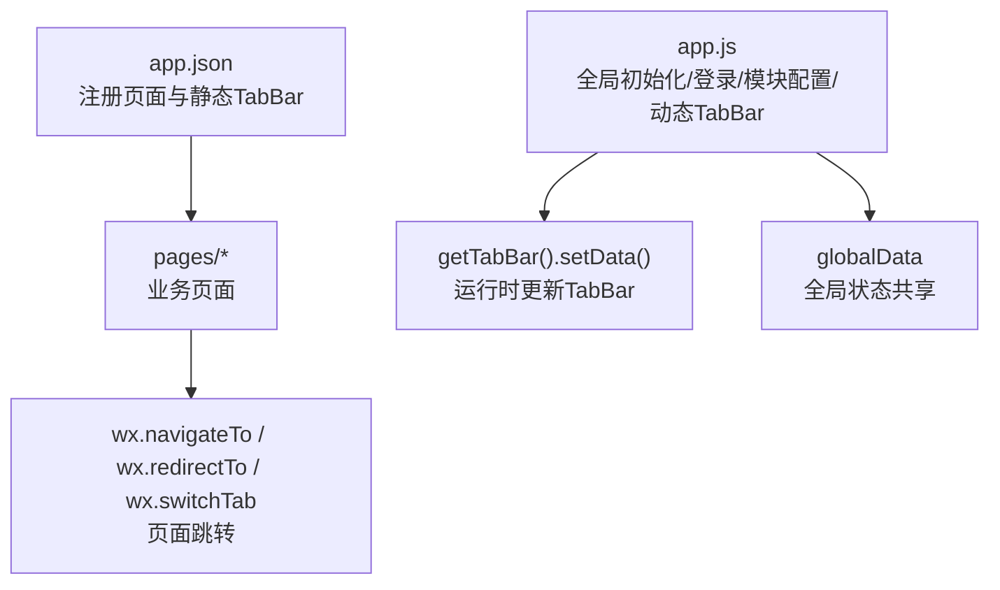
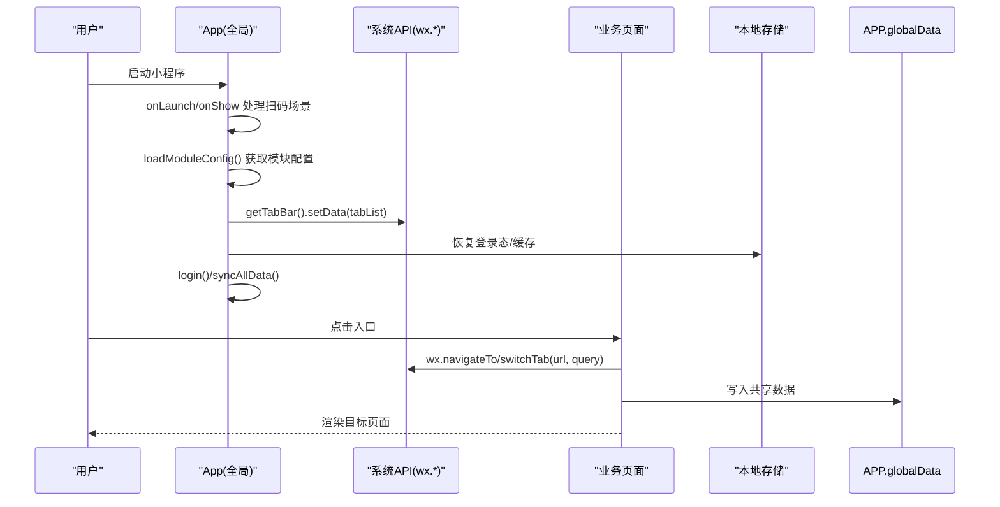
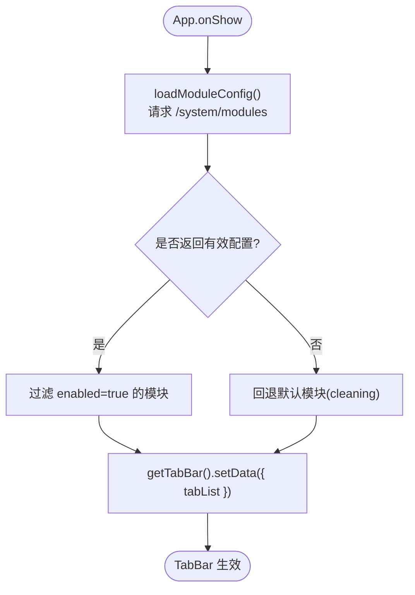
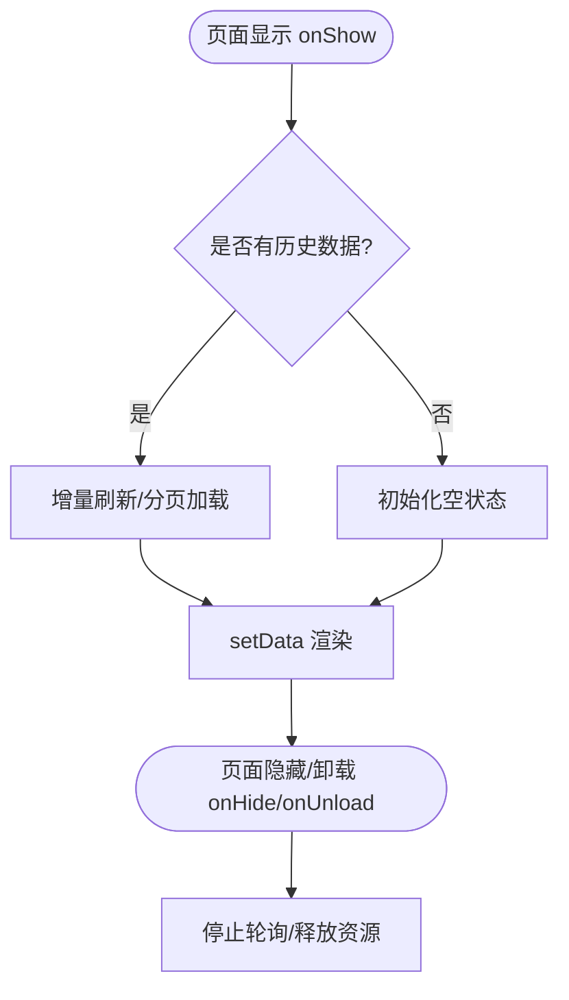
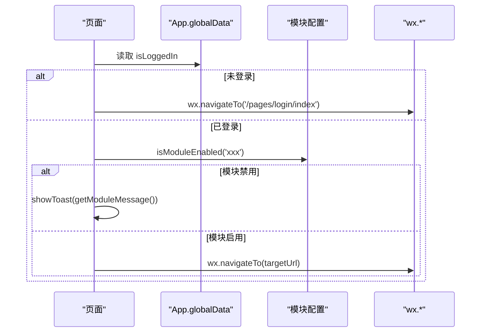
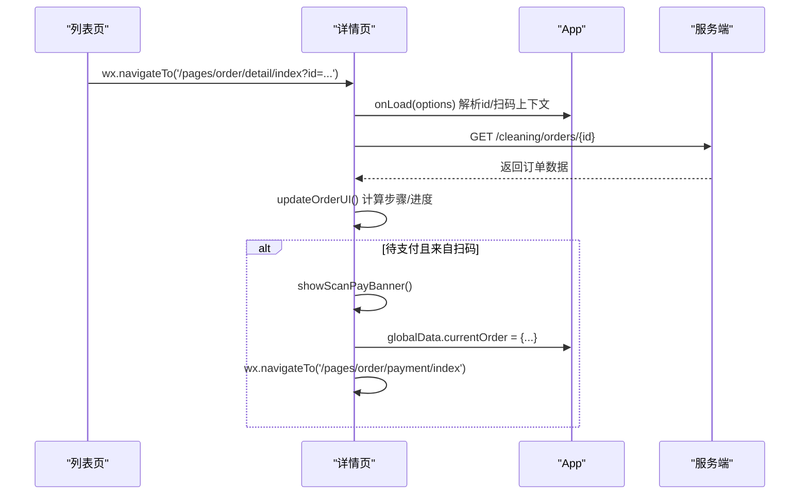
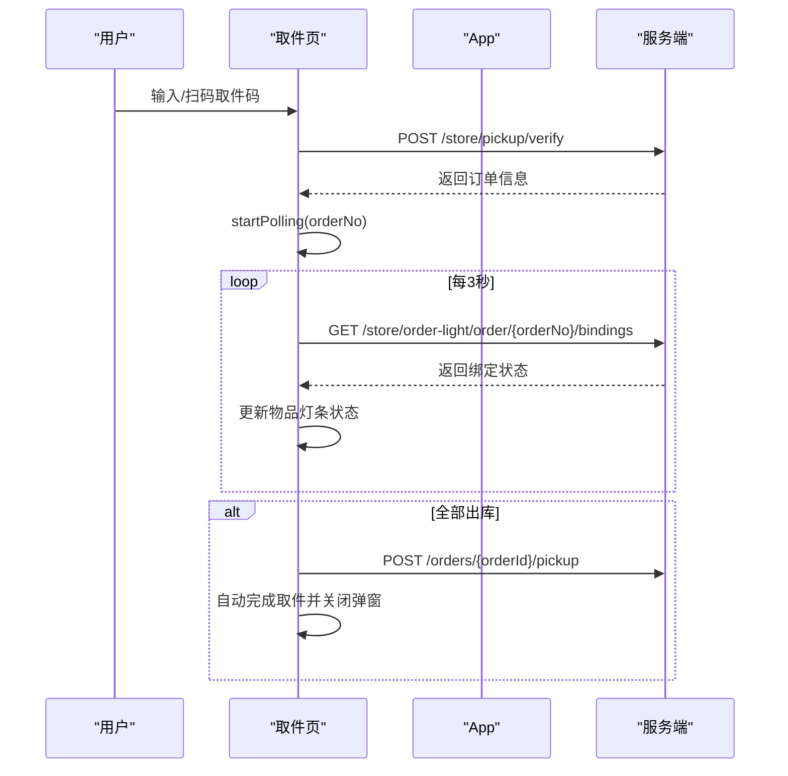
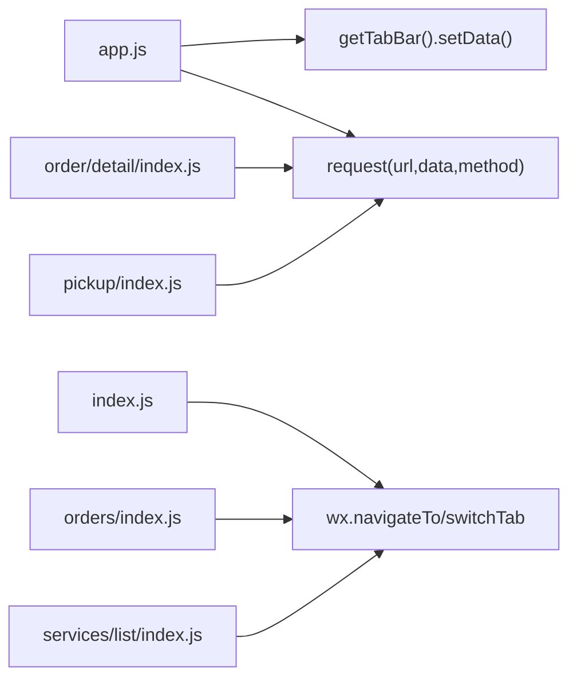

# 页面路由与导航

<cite>
**本文引用的文件**   
- [wechat-mini-app/app.js](file://wechat-mini-app/app.js)
- [wechat-mini-app/app.json](file://wechat-mini-app/app.json)
- [wechat-mini-app/pages/index/index.js](file://wechat-mini-app/pages/index/index.js)
- [wechat-mini-app/pages/orders/index.js](file://wechat-mini-app/pages/orders/index.js)
- [wechat-mini-app/pages/profile/index.js](file://wechat-mini-app/pages/profile/index.js)
- [wechat-mini-app/pages/pickup/index.js](file://wechat-mini-app/pages/pickup/index.js)
- [wechat-mini-app/pages/order/detail/index.js](file://wechat-mini-app/pages/order/detail/index.js)
- [wechat-mini-app/pages/services/list/index.js](file://wechat-mini-app/pages/services/list/index.js)
- [frontend/common/tabBar.js](file://frontend/common/tabBar.js)
</cite>

## 目录
1. [简介](#简介)
2. [项目结构](#项目结构)
3. [核心组件](#核心组件)
4. [架构总览](#架构总览)
5. [详细组件分析](#详细组件分析)
6. [依赖关系分析](#依赖关系分析)
7. [性能考虑](#性能考虑)
8. [故障排查指南](#故障排查指南)
9. [结论](#结论)
10. [附录](#附录)

## 简介
本文件面向微信小程序“干洗店”项目的页面路由与导航系统，系统性梳理原生路由 API 的使用、动态 TabBar 配置、页面间传参机制、页面栈管理与内存优化策略、导航守卫与权限控制实现，以及路由调试与性能监控方案。文档以仓库实际代码为依据，结合可视化图示帮助读者快速理解并落地实践。

## 项目结构
小程序前端位于 wechat-mini-app 目录，采用多页面组织方式；TabBar 静态声明在 app.json，运行时通过 App 实例更新 TabBar 列表，以实现基于模块配置的动态菜单。

图表来源
- [wechat-mini-app/app.json:1-53](file://wechat-mini-app/app.json#L1-L53)
- [wechat-mini-app/app.js:170-192](file://wechat-mini-app/app.js#L170-L192)

章节来源
- [wechat-mini-app/app.json:1-53](file://wechat-mini-app/app.json#L1-L53)
- [wechat-mini-app/app.js:118-192](file://wechat-mini-app/app.js#L118-L192)

## 核心组件
- 应用生命周期与全局初始化：负责扫码场景解析、延迟加载模块配置、登录态恢复与同步、动态 TabBar 更新。
- 页面层路由调用：各业务页面使用 wx.navigateTo、wx.redirectTo、wx.switchTab 完成页面跳转与参数传递。
- 动态 TabBar 配置：根据后端模块开关动态生成底部菜单项，并通过 getTabBar().setData() 实时生效。
- 全局状态与跨页通信：通过 globalData 与本地存储（StorageSync）进行数据共享与持久化。

章节来源
- [wechat-mini-app/app.js:1-192](file://wechat-mini-app/app.js#L1-L192)
- [wechat-mini-app/pages/index/index.js:144-217](file://wechat-mini-app/pages/index/index.js#L144-L217)
- [wechat-mini-app/pages/orders/index.js:218-242](file://wechat-mini-app/pages/orders/index.js#L218-L242)
- [wechat-mini-app/pages/profile/index.js:124-129](file://wechat-mini-app/pages/profile/index.js#L124-L129)

## 架构总览
下图展示小程序启动到页面导航的关键流程，包括扫码进入、模块配置加载、动态 TabBar 更新、页面跳转与全局状态共享。

图表来源
- [wechat-mini-app/app.js:1-192](file://wechat-mini-app/app.js#L1-L192)
- [wechat-mini-app/pages/index/index.js:144-217](file://wechat-mini-app/pages/index/index.js#L144-L217)
- [wechat-mini-app/pages/orders/index.js:218-242](file://wechat-mini-app/pages/orders/index.js#L218-L242)

## 详细组件分析

### 原生路由 API 使用与场景
- wx.navigateTo：用于非 TabBar 页面的入栈跳转，支持 URL 查询参数传递。常见于订单详情、服务列表等。
- wx.redirectTo：关闭当前页面并跳转到新页面，适用于需要替换当前栈顶的场景（如支付结果页）。
- wx.switchTab：仅可跳转至已注册的 TabBar 页面，常用于首页、订单、我的等主入口切换。

示例路径参考
- 首页跳转订单详情：[wechat-mini-app/pages/index/index.js:144-149](file://wechat-mini-app/pages/index/index.js#L144-L149)
- 订单列表跳转详情：[wechat-mini-app/pages/orders/index.js:218-225](file://wechat-mini-app/pages/orders/index.js#L218-L225)
- 取件页从订单列表 switchTab：[wechat-mini-app/pages/orders/index.js:227-234](file://wechat-mini-app/pages/orders/index.js#L227-L234)
- 我的页面切换到订单 Tab：[wechat-mini-app/pages/profile/index.js:124-129](file://wechat-mini-app/pages/profile/index.js#L124-L129)

章节来源
- [wechat-mini-app/pages/index/index.js:144-217](file://wechat-mini-app/pages/index/index.js#L144-L217)
- [wechat-mini-app/pages/orders/index.js:218-242](file://wechat-mini-app/pages/orders/index.js#L218-L242)
- [wechat-mini-app/pages/profile/index.js:124-129](file://wechat-mini-app/pages/profile/index.js#L124-L129)

### 动态 TabBar 配置系统
- 静态声明：app.json 中定义 pages 与 tabBar.list，作为基础能力与兜底。
- 动态生成：App.loadModuleConfig 拉取后端模块配置，过滤 enabled=true 的模块，构建 tabList，并通过 getTabBar().setData() 实时更新。
- 样式定制：tabBar.color、selectedColor、backgroundColor、borderStyle 等在 app.json 中统一配置。
- 图标资源管理：H5 侧提供默认图标路径与动态生成逻辑，小程序端可通过类似思路扩展（当前未直接引用 H5 的图标路径）。

图表来源
- [wechat-mini-app/app.js:118-192](file://wechat-mini-app/app.js#L118-L192)
- [wechat-mini-app/app.json:26-48](file://wechat-mini-app/app.json#L26-L48)
- [frontend/common/tabBar.js:1-137](file://frontend/common/tabBar.js#L1-137)

章节来源
- [wechat-mini-app/app.js:118-192](file://wechat-mini-app/app.js#L118-L192)
- [wechat-mini-app/app.json:26-48](file://wechat-mini-app/app.json#L26-L48)
- [frontend/common/tabBar.js:1-137](file://frontend/common/tabBar.js#L1-137)

### 页面间传参机制
- URL 参数传递：通过 navigateTo/redirectTo 的 url 拼接 query 参数，目标页面 onLoad(options) 读取。
  - 示例：首页查看订单详情时传入 id；服务列表选择服务时携带 category。
- 全局状态共享：通过 app.globalData 保存临时上下文（如 pendingServiceFromDetail、selectedStore、scanPayOrder 等），适合跨多个页面或复杂流程的数据传递。
- 事件通信：页面级通过 setData 驱动 UI；跨页面可使用全局回调（如 app.syncCallback）或本地存储（StorageSync）做轻量事件通知。

示例路径参考
- URL 参数：[wechat-mini-app/pages/index/index.js:144-157](file://wechat-mini-app/pages/index/index.js#L144-L157)
- 全局上下文：[wechat-mini-app/pages/index/index.js:167-184](file://wechat-mini-app/pages/index/index.js#L167-L184)
- 扫码订单上下文：[wechat-mini-app/app.js:44-109](file://wechat-mini-app/app.js#L44-L109)

章节来源
- [wechat-mini-app/pages/index/index.js:144-184](file://wechat-mini-app/pages/index/index.js#L144-L184)
- [wechat-mini-app/app.js:44-109](file://wechat-mini-app/app.js#L44-L109)

### 页面栈管理与内存优化
- 页面卸载清理：在 onUnload/onHide 中停止轮询定时器、释放资源，避免后台持续消耗 CPU/网络。
  - 取件页：onHide/onUnload 停止灯条轮询。
  - 订单详情页：onUnload 停止订单/配送/灯条相关轮询。
- 大数据量处理：列表页采用分页加载（page/pageSize）、按需刷新（onShow 增量刷新）、下拉刷新（onPullDownRefresh）与“加载更多”组合，降低首屏压力。
- 网络与超时保护：统一 request 封装内置硬超时与 mock 降级，防止阻塞页面渲染。

图表来源
- [wechat-mini-app/pages/orders/index.js:30-40](file://wechat-mini-app/pages/orders/index.js#L30-L40)
- [wechat-mini-app/pages/pickup/index.js:47-53](file://wechat-mini-app/pages/pickup/index.js#L47-L53)
- [wechat-mini-app/pages/order/detail/index.js:153-157](file://wechat-mini-app/pages/order/detail/index.js#L153-L157)
- [wechat-mini-app/app.js:439-497](file://wechat-mini-app/app.js#L439-L497)

章节来源
- [wechat-mini-app/pages/orders/index.js:30-40](file://wechat-mini-app/pages/orders/index.js#L30-L40)
- [wechat-mini-app/pages/pickup/index.js:47-53](file://wechat-mini-app/pages/pickup/index.js#L47-L53)
- [wechat-mini-app/pages/order/detail/index.js:153-157](file://wechat-mini-app/pages/order/detail/index.js#L153-L157)
- [wechat-mini-app/app.js:439-497](file://wechat-mini-app/app.js#L439-L497)

### 导航守卫与权限控制
- 登录态检查：App.login/_restoreCache 在启动时恢复登录态，必要时发起微信登录；若失败则使用模拟登录保证开发体验。
- 功能访问控制：isModuleEnabled/getModuleMessage 判断模块开关，可在导航前拦截并提示。
- 扫码进入引导：handleScanEntry 解析 scene/query，设置全局上下文供后续页面消费。

图表来源
- [wechat-mini-app/app.js:250-330](file://wechat-mini-app/app.js#L250-L330)
- [wechat-mini-app/app.js:194-204](file://wechat-mini-app/app.js#L194-L204)
- [wechat-mini-app/app.js:44-109](file://wechat-mini-app/app.js#L44-L109)

章节来源
- [wechat-mini-app/app.js:250-330](file://wechat-mini-app/app.js#L250-L330)
- [wechat-mini-app/app.js:194-204](file://wechat-mini-app/app.js#L194-L204)
- [wechat-mini-app/app.js:44-109](file://wechat-mini-app/app.js#L44-L109)

### 关键页面路由时序图

#### 订单详情加载与扫码支付引导

图表来源
- [wechat-mini-app/pages/order/detail/index.js:112-144](file://wechat-mini-app/pages/order/detail/index.js#L112-L144)
- [wechat-mini-app/pages/order/detail/index.js:190-235](file://wechat-mini-app/pages/order/detail/index.js#L190-L235)
- [wechat-mini-app/pages/order/detail/index.js:359-400](file://wechat-mini-app/pages/order/detail/index.js#L359-L400)

章节来源
- [wechat-mini-app/pages/order/detail/index.js:112-144](file://wechat-mini-app/pages/order/detail/index.js#L112-L144)
- [wechat-mini-app/pages/order/detail/index.js:190-235](file://wechat-mini-app/pages/order/detail/index.js#L190-L235)
- [wechat-mini-app/pages/order/detail/index.js:359-400](file://wechat-mini-app/pages/order/detail/index.js#L359-L400)

#### 取件页扫码与灯条联动

图表来源
- [wechat-mini-app/pages/pickup/index.js:358-451](file://wechat-mini-app/pages/pickup/index.js#L358-L451)
- [wechat-mini-app/pages/pickup/index.js:59-72](file://wechat-mini-app/pages/pickup/index.js#L59-L72)
- [wechat-mini-app/pages/pickup/index.js:74-129](file://wechat-mini-app/pages/pickup/index.js#L74-L129)

章节来源
- [wechat-mini-app/pages/pickup/index.js:358-451](file://wechat-mini-app/pages/pickup/index.js#L358-L451)
- [wechat-mini-app/pages/pickup/index.js:59-72](file://wechat-mini-app/pages/pickup/index.js#L59-L72)
- [wechat-mini-app/pages/pickup/index.js:74-129](file://wechat-mini-app/pages/pickup/index.js#L74-L129)

## 依赖关系分析
- 页面与 App 的耦合：多数页面通过 getApp() 访问全局方法与状态，形成松耦合的全局依赖。
- 路由与配置：app.json 声明页面与静态 TabBar；app.js 在运行时覆盖 TabBar 列表，实现动态菜单。
- 外部接口：统一通过 app.request 发起网络请求，具备超时保护与 Mock 降级。

图表来源
- [wechat-mini-app/app.js:439-497](file://wechat-mini-app/app.js#L439-L497)
- [wechat-mini-app/app.js:170-192](file://wechat-mini-app/app.js#L170-L192)
- [wechat-mini-app/pages/index/index.js:144-217](file://wechat-mini-app/pages/index/index.js#L144-L217)
- [wechat-mini-app/pages/orders/index.js:218-242](file://wechat-mini-app/pages/orders/index.js#L218-L242)
- [wechat-mini-app/pages/order/detail/index.js:190-235](file://wechat-mini-app/pages/order/detail/index.js#L190-L235)
- [wechat-mini-app/pages/pickup/index.js:74-129](file://wechat-mini-app/pages/pickup/index.js#L74-L129)
- [wechat-mini-app/pages/services/list/index.js:46-75](file://wechat-mini-app/pages/services/list/index.js#L46-L75)

章节来源
- [wechat-mini-app/app.js:170-192](file://wechat-mini-app/app.js#L170-L192)
- [wechat-mini-app/app.js:439-497](file://wechat-mini-app/app.js#L439-L497)
- [wechat-mini-app/pages/index/index.js:144-217](file://wechat-mini-app/pages/index/index.js#L144-L217)
- [wechat-mini-app/pages/orders/index.js:218-242](file://wechat-mini-app/pages/orders/index.js#L218-L242)
- [wechat-mini-app/pages/order/detail/index.js:190-235](file://wechat-mini-app/pages/order/detail/index.js#L190-L235)
- [wechat-mini-app/pages/pickup/index.js:74-129](file://wechat-mini-app/pages/pickup/index.js#L74-L129)
- [wechat-mini-app/pages/services/list/index.js:46-75](file://wechat-mini-app/pages/services/list/index.js#L46-L75)

## 性能考虑
- 首屏与懒加载：app.json 启用 lazyCodeLoading，减少初始包体积。
- 网络请求优化：统一 request 封装包含硬超时与 Mock 降级，避免长尾请求阻塞。
- 列表分页与增量刷新：订单列表按 page/pageSize 分页，onShow 增量刷新，避免全量重绘。
- 轮询节流：取件与订单详情中的轮询在 onUnload/onHide 及时停止，降低后台开销。
- 数据合并与去重：同步接口对本地数据进行合并更新，减少重复渲染。

章节来源
- [wechat-mini-app/app.json:52](file://wechat-mini-app/app.json#L52)
- [wechat-mini-app/app.js:439-497](file://wechat-mini-app/app.js#L439-L497)
- [wechat-mini-app/pages/orders/index.js:54-143](file://wechat-mini-app/pages/orders/index.js#L54-L143)
- [wechat-mini-app/pages/pickup/index.js:47-72](file://wechat-mini-app/pages/pickup/index.js#L47-L72)
- [wechat-mini-app/pages/order/detail/index.js:153-157](file://wechat-mini-app/pages/order/detail/index.js#L153-L157)

## 故障排查指南
- 登录态异常：检查 _restoreCache 与 login 分支，确认 token 与 userInfo 是否正确落盘；注意 401 响应会清除本地缓存。
- 动态 TabBar 不生效：确认 getTabBar 是否存在、updateTabBar 是否被调用、后端 /system/modules 是否返回 enabled 模块。
- 页面无法跳转：核对 app.json 是否注册对应页面路径；switchTab 只能跳转已注册 TabBar 页面。
- 轮询不停止：检查 onUnload/onHide 是否清理定时器；确保错误分支也清理。
- 网络超时/失败：观察 request 的硬超时与 fail 分支，确认 Mock 降级是否触发。

章节来源
- [wechat-mini-app/app.js:236-330](file://wechat-mini-app/app.js#L236-L330)
- [wechat-mini-app/app.js:439-497](file://wechat-mini-app/app.js#L439-L497)
- [wechat-mini-app/app.js:170-192](file://wechat-mini-app/app.js#L170-L192)
- [wechat-mini-app/pages/pickup/index.js:47-72](file://wechat-mini-app/pages/pickup/index.js#L47-L72)

## 结论
本项目在小程序原生路由基础上，结合全局初始化与动态 TabBar 配置，实现了灵活的导航体系。通过 URL 参数与 globalData 的组合，满足复杂业务流程的传参需求；在页面栈管理与内存优化方面，采用分页、增量刷新与轮询清理等手段保障性能。同时，登录态检查与模块开关为导航守卫提供了基础支撑。建议后续引入更完善的权限模型与路由埋点，进一步提升安全性与可观测性。

## 附录

### 常用路由 API 速查
- wx.navigateTo：入栈跳转，保留上一页，适合详情页、表单页。
- wx.redirectTo：替换当前页，适合结果页、支付页。
- wx.switchTab：跳转 TabBar 页，不可带复杂参数，适合主入口切换。
- wx.reLaunch：关闭所有页面并打开指定页面，适合强制重置导航栈。

章节来源
- [wechat-mini-app/pages/index/index.js:144-217](file://wechat-mini-app/pages/index/index.js#L144-L217)
- [wechat-mini-app/pages/orders/index.js:218-242](file://wechat-mini-app/pages/orders/index.js#L218-L242)
- [wechat-mini-app/pages/profile/index.js:124-129](file://wechat-mini-app/pages/profile/index.js#L124-L129)