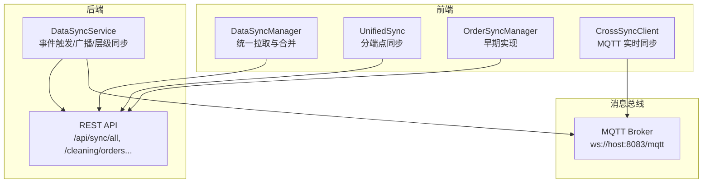
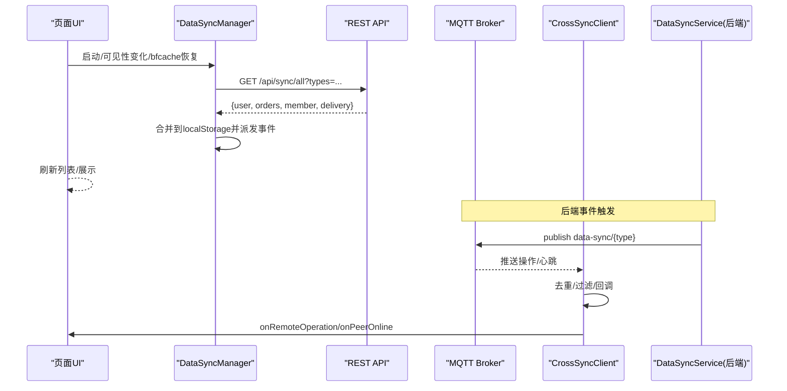
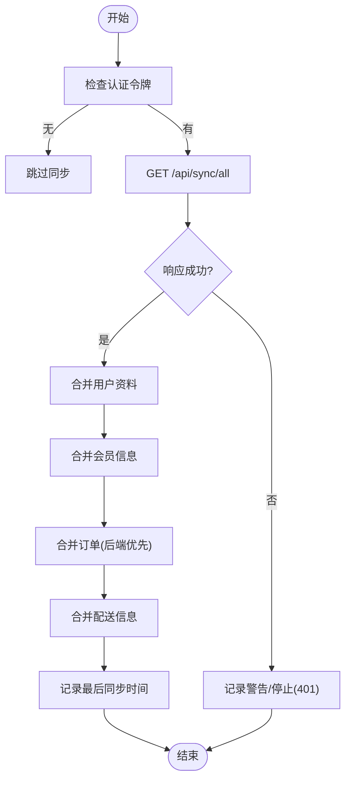
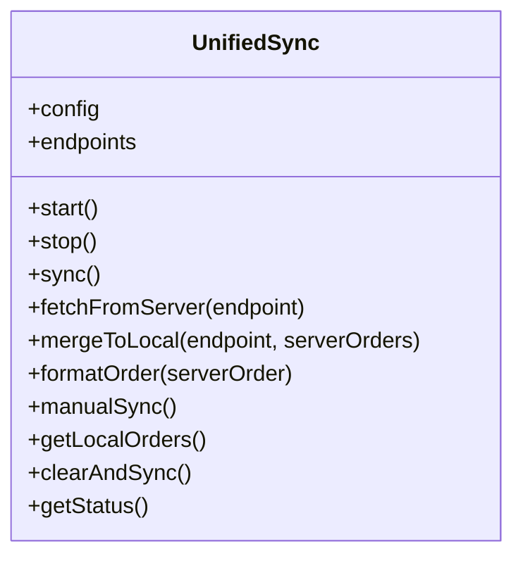
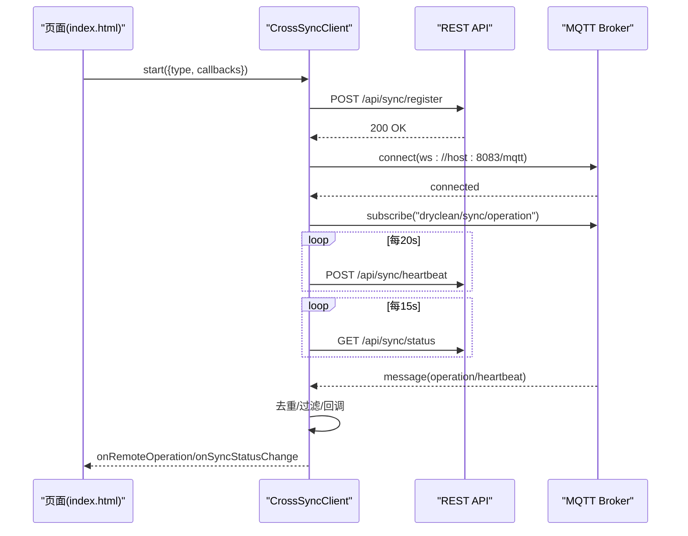
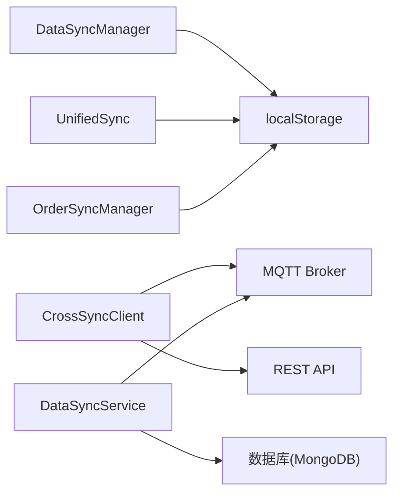

# 数据同步机制

<cite>
**本文引用的文件**   
- [js/data-sync.js](file://js/data-sync.js)
- [js/unified-sync.js](file://js/unified-sync.js)
- [js/order-sync.js](file://js/order-sync.js)
- [js/cross-sync-client.js](file://js/cross-sync-client.js)
- [backend/modules/common/services/dataHierarchyService.js](file://backend/modules/common/services/dataHierarchyService.js)
- [index.html](file://index.html)
- [DATA-SYNC-GUIDE.md](file://DATA-SYNC-GUIDE.md)
- [DATA-SYNC-TROUBLESHOOTING.md](file://DATA-SYNC-TROUBLESHOOTING.md)
</cite>

## 目录
1. [引言](#引言)
2. [项目结构](#项目结构)
3. [核心组件](#核心组件)
4. [架构总览](#架构总览)
5. [详细组件分析](#详细组件分析)
6. [依赖关系分析](#依赖关系分析)
7. [性能考虑](#性能考虑)
8. [故障排查指南](#故障排查指南)
9. [结论](#结论)
10. [附录](#附录)

## 引言
本文件面向前端与全栈开发者，系统化梳理并解释当前仓库中的“跨端数据同步”机制。内容覆盖：
- 同步策略选择（轮询、事件驱动、双向合并）
- 冲突解决算法（后端权威、本地保留字段、去重策略）
- 版本控制机制（时间戳/更新字段、增量与全量结合）
- 同步协议设计（REST 全量拉取、MQTT 实时广播、心跳与状态轮询）
- 本地数据存储策略（localStorage 为主，IndexedDB 未使用）
- 网络层处理（请求超时、失败静默重试、断网降级）
- 一致性保证（最终一致、乐观合并、无显式锁）
- 性能优化（批量写入、差异合并、缓存与备份）
- 错误处理与恢复（日志、诊断、修复流程）

## 项目结构
前端侧存在多套同步实现，逐步演进：
- 统一数据同步管理器 DataSyncManager：提供用户、订单、会员、配送的统一拉取与合并
- 统一同步 UnifiedSync：按端点区分 C/M/Admin 的存储键与过滤逻辑
- 订单同步 OrderSyncManager：早期实现，支持按页面类型自动选择 API 与本地键
- 跨端同步 CrossSyncClient：基于 MQTT 的实时操作广播与对端在线感知
- 后端数据层级与同步服务：DataSyncService 负责事件触发、MQTT 广播与层级统计更新

图表来源
- [js/data-sync.js:111-190](file://js/data-sync.js#L111-L190)
- [js/unified-sync.js:122-204](file://js/unified-sync.js#L122-L204)
- [js/order-sync.js:74-194](file://js/order-sync.js#L74-L194)
- [js/cross-sync-client.js:160-232](file://js/cross-sync-client.js#L160-L232)
- [backend/modules/common/services/dataHierarchyService.js:175-211](file://backend/modules/common/services/dataHierarchyService.js#L175-L211)

章节来源
- [js/data-sync.js:1-348](file://js/data-sync.js#L1-L348)
- [js/unified-sync.js:1-420](file://js/unified-sync.js#L1-L420)
- [js/order-sync.js:1-352](file://js/order-sync.js#L1-L352)
- [js/cross-sync-client.js:1-399](file://js/cross-sync-client.js#L1-L399)
- [backend/modules/common/services/dataHierarchyService.js:1-648](file://backend/modules/common/services/dataHierarchyService.js#L1-L648)

## 核心组件
- DataSyncManager
  - 职责：统一认证令牌获取、定时全量拉取、按数据类型合并到 localStorage、派发自定义事件
  - 关键能力：自动启动、bfcache/visibility 恢复后补同步、storage 跨标签变更联动
- UnifiedSync
  - 职责：按端点（C/M/Admin）配置不同存储键、过滤门店订单、格式化统一模型、维护备份
- OrderSyncManager
  - 职责：早期实现，按页面路径选择 API 与本地键，标准化状态映射
- CrossSyncClient
  - 职责：注册/心跳/注销、订阅 MQTT 操作与心跳主题、本地操作去重、状态轮询兜底
- DataSyncService（后端）
  - 职责：触发同步事件、通过 MQTT 广播、记录事件、按层级更新统计

章节来源
- [js/data-sync.js:18-106](file://js/data-sync.js#L18-L106)
- [js/unified-sync.js:13-119](file://js/unified-sync.js#L13-L119)
- [js/order-sync.js:11-93](file://js/order-sync.js#L11-L93)
- [js/cross-sync-client.js:23-96](file://js/cross-sync-client.js#L23-L96)
- [backend/modules/common/services/dataHierarchyService.js:139-211](file://backend/modules/common/services/dataHierarchyService.js#L139-L211)

## 架构总览
整体采用“REST 全量拉取 + MQTT 实时广播 + 本地合并”的混合模式：
- REST 全量：客户端定时或事件触发调用 /api/sync/all 或各业务接口，拉取最新数据
- MQTT 实时：跨端操作通过 MQTT 广播，客户端订阅并应用，减少轮询压力
- 本地合并：以服务器为权威源，结合本地特有字段进行智能 diff 合并
- 心跳与状态：客户端定期心跳与状态轮询，保障对端在线感知与连接健康

图表来源
- [js/data-sync.js:111-190](file://js/data-sync.js#L111-L190)
- [js/cross-sync-client.js:160-232](file://js/cross-sync-client.js#L160-L232)
- [backend/modules/common/services/dataHierarchyService.js:175-211](file://backend/modules/common/services/dataHierarchyService.js#L175-L211)

## 详细组件分析

### 组件A：DataSyncManager（统一数据同步）
- 同步策略
  - 定时全量：默认每15秒一次；支持手动触发
  - 事件驱动：页面可见性变化、bfcache恢复、storage 跨标签变更时触发
- 认证与范围
  - 兼容多种 token 键名；根据路径决定订单存储键（orders/store_orders/all_orders）
- 合并策略
  - 后端权威：先放后端数据，再补充本地独有项
  - 字段级合并：用户资料按字段优先级合并
- 错误处理
  - 401 停止同步；网络异常静默失败；Abort/Timeout 不告警

图表来源
- [js/data-sync.js:111-190](file://js/data-sync.js#L111-L190)
- [js/data-sync.js:195-251](file://js/data-sync.js#L195-L251)

章节来源
- [js/data-sync.js:18-106](file://js/data-sync.js#L18-L106)
- [js/data-sync.js:111-190](file://js/data-sync.js#L111-L190)
- [js/data-sync.js:195-251](file://js/data-sync.js#L195-L251)
- [js/data-sync.js:309-337](file://js/data-sync.js#L309-L337)

### 组件B：UnifiedSync（分端点同步）
- 端点配置
  - C端：c_orders，按用户ID过滤
  - M端：m_orders，按 storeId 过滤
  - Admin：admin_orders，全量
- 合并与备份
  - 合并时保留本地特有字段（如 _localUpdated），同时持久化备份对象（含 updatedAt）
- 状态与清理
  - 提供 clearAndSync 一键清理并重拉；getLocalOrders 返回同步状态提示

图表来源
- [js/unified-sync.js:13-119](file://js/unified-sync.js#L13-L119)
- [js/unified-sync.js:122-204](file://js/unified-sync.js#L122-L204)
- [js/unified-sync.js:207-264](file://js/unified-sync.js#L207-L264)
- [js/unified-sync.js:336-392](file://js/unified-sync.js#L336-L392)

章节来源
- [js/unified-sync.js:13-119](file://js/unified-sync.js#L13-L119)
- [js/unified-sync.js:122-204](file://js/unified-sync.js#L122-L204)
- [js/unified-sync.js:207-264](file://js/unified-sync.js#L207-L264)
- [js/unified-sync.js:336-392](file://js/unified-sync.js#L336-L392)

### 组件C：OrderSyncManager（早期实现）
- 特点
  - 按页面路径选择 API 与本地键
  - 提供 normalizeStatus 状态映射
  - 默认自动启动已注释，改为按需启用
- 适用场景
  - 需要快速接入旧页面的最小改动方案

章节来源
- [js/order-sync.js:11-93](file://js/order-sync.js#L11-L93)
- [js/order-sync.js:96-194](file://js/order-sync.js#L96-L194)
- [js/order-sync.js:296-320](file://js/order-sync.js#L296-L320)
- [js/order-sync.js:338-352](file://js/order-sync.js#L338-L352)

### 组件D：CrossSyncClient（跨端实时同步）
- 功能
  - 注册/心跳/注销：保持在线状态
  - MQTT 订阅：dryclean/sync/operation 与 heartbeat
  - 本地操作去重：避免回显与重复处理
  - 状态轮询：作为 MQTT 不可用时的兜底
- 集成
  - 在 index.html 中初始化并更新同步状态UI

图表来源
- [js/cross-sync-client.js:53-96](file://js/cross-sync-client.js#L53-L96)
- [js/cross-sync-client.js:111-157](file://js/cross-sync-client.js#L111-L157)
- [js/cross-sync-client.js:160-232](file://js/cross-sync-client.js#L160-L232)
- [js/cross-sync-client.js:313-340](file://js/cross-sync-client.js#L313-L340)
- [index.html:5205-5232](file://index.html#L5205-L5232)

章节来源
- [js/cross-sync-client.js:23-96](file://js/cross-sync-client.js#L23-L96)
- [js/cross-sync-client.js:160-232](file://js/cross-sync-client.js#L160-L232)
- [js/cross-sync-client.js:313-340](file://js/cross-sync-client.js#L313-L340)
- [index.html:5205-5232](file://index.html#L5205-L5232)

### 组件E：DataSyncService（后端事件与层级同步）
- 职责
  - 触发同步事件：生成唯一事件ID、记录元数据
  - 广播：通过 MQTT 发布 data-sync/{type}
  - 记录：落库 SyncEvent 便于审计与排障
  - 层级同步：按 user/order/store 事件更新门店/连锁统计
- 与前端协作
  - 前端通过 CrossSyncClient 订阅 operation/heartbeat 主题，实现低延迟协同

章节来源
- [backend/modules/common/services/dataHierarchyService.js:175-211](file://backend/modules/common/services/dataHierarchyService.js#L175-L211)
- [backend/modules/common/services/dataHierarchyService.js:243-393](file://backend/modules/common/services/dataHierarchyService.js#L243-L393)

## 依赖关系分析
- 前端模块耦合
  - DataSyncManager 与 UnifiedSync 均依赖 localStorage 与 fetch；前者更通用，后者更强调端点差异化
  - OrderSyncManager 为历史实现，仍被部分页面引用
  - CrossSyncClient 依赖 mqtt.js 与后端 /api/sync/* 接口
- 后端依赖
  - DataSyncService 依赖 MQTT 与数据库（MongoDB），用于事件广播与统计聚合
- 外部依赖
  - MQTT Broker（WebSocket 8083）
  - REST API（端口由环境决定，常见 3000/3002）

图表来源
- [js/data-sync.js:111-190](file://js/data-sync.js#L111-L190)
- [js/unified-sync.js:122-204](file://js/unified-sync.js#L122-L204)
- [js/order-sync.js:74-194](file://js/order-sync.js#L74-L194)
- [js/cross-sync-client.js:160-232](file://js/cross-sync-client.js#L160-L232)
- [backend/modules/common/services/dataHierarchyService.js:175-211](file://backend/modules/common/services/dataHierarchyService.js#L175-L211)

章节来源
- [js/data-sync.js:1-348](file://js/data-sync.js#L1-L348)
- [js/unified-sync.js:1-420](file://js/unified-sync.js#L1-L420)
- [js/order-sync.js:1-352](file://js/order-sync.js#L1-L352)
- [js/cross-sync-client.js:1-399](file://js/cross-sync-client.js#L1-L399)
- [backend/modules/common/services/dataHierarchyService.js:1-648](file://backend/modules/common/services/dataHierarchyService.js#L1-L648)

## 性能考虑
- 批量操作
  - 合并阶段一次性构建 Map 去重，随后整批写回 localStorage，降低多次 I/O
- 差异计算
  - 后端权威 + 本地特有字段保留，避免覆盖用户个性化状态
- 缓存策略
  - 本地持久化 + 备份键（updatedAt）辅助显示“最近同步”状态
- 并发与节流
  - 定时器间隔可配置；MQTT 实时通道减少频繁轮询
- 建议
  - 大数据集分页拉取（后端支持时）
  - 将高频小对象（如用户资料）与低频大对象（订单列表）拆分同步

[本节为通用指导，无需代码来源]

## 故障排查指南
- 常见问题
  - 端口不一致导致数据隔离：确保前后端与页面访问同一端口
  - 浏览器隔离：不同端口/域名的 localStorage 相互隔离
  - 认证过期：401 会停止同步，需重新登录
- 定位步骤
  - 查看控制台日志：DataSync/统一同步/跨端同步等前缀
  - 检查 API 连通性与返回码
  - 确认 MQTT 是否可用（WebSocket 8083）
- 快速命令
  - 手动触发同步：OrderSyncManager.manualSync() 或 DataSyncManager.manualSync()
  - 查看状态：OrderSyncManager.getStatus() / DataSyncManager.getStatus()
  - 清除本地数据并重新同步：UnifiedSync.clearAndSync()

章节来源
- [DATA-SYNC-GUIDE.md:104-140](file://DATA-SYNC-GUIDE.md#L104-L140)
- [DATA-SYNC-TROUBLESHOOTING.md:72-147](file://DATA-SYNC-TROUBLESHOOTING.md#L72-L147)
- [DATA-SYNC-TROUBLESHOOTING.md:198-246](file://DATA-SYNC-TROUBLESHOOTING.md#L198-L246)

## 结论
本项目的前端数据同步采用“REST 全量 + MQTT 实时 + 本地合并”的混合架构，具备以下特性：
- 以服务器为权威源，结合本地特有字段的智能合并，保证最终一致性
- 通过 MQTT 降低轮询开销，提升跨端协同体验
- 完善的容错与降级：401 停止、网络异常静默、心跳与状态轮询兜底
- 易于扩展：新增数据类型只需在统一入口增加分支与合并逻辑

[本节为总结，无需代码来源]

## 附录

### 同步协议与接口约定（摘要）
- 全量拉取
  - GET /api/sync/all?types=user,orders,member,delivery
  - 返回包含 user、orders、member、delivery 的对象
- 业务拉取
  - GET /cleaning/orders（Admin）
  - GET /cleaning/store/{storeId}/orders（Store）
  - GET /cleaning/orders?userId=...&phone=...（Customer）
- 跨端同步
  - POST /api/sync/register
  - POST /api/sync/heartbeat
  - POST /api/sync/unregister
  - GET /api/sync/status
  - MQTT 主题：dryclean/sync/operation、dryclean/sync/heartbeat

章节来源
- [js/data-sync.js:111-190](file://js/data-sync.js#L111-L190)
- [js/order-sync.js:96-194](file://js/order-sync.js#L96-L194)
- [js/cross-sync-client.js:111-157](file://js/cross-sync-client.js#L111-L157)
- [js/cross-sync-client.js:313-340](file://js/cross-sync-client.js#L313-L340)

### 本地数据存储策略
- 存储介质：localStorage（当前未使用 IndexedDB）
- 键命名规范
  - C端：orders、orders_backup
  - M端：store_orders、store_orders_backup
  - Admin：all_orders、all_orders_backup
  - 用户资料：userInfo
  - 配送信息：userDeliveryInfo
- 索引优化
  - 当前为数组存储，未建立索引；如需查询优化，建议迁移至 IndexedDB 并按 orderId/orderNo 建索引

章节来源
- [js/data-sync.js:218-251](file://js/data-sync.js#L218-L251)
- [js/unified-sync.js:207-264](file://js/unified-sync.js#L207-L264)
- [DATA-SYNC-GUIDE.md:213-222](file://DATA-SYNC-GUIDE.md#L213-L222)

### 一致性保证方案
- 策略：最终一致性
- 冲突解决：后端权威 + 本地特有字段保留
- 锁机制：无显式悲观锁；通过后端权威与去重 ID 避免重复处理
- 幂等性：通过 syncId/clientId 去重，避免重复应用

章节来源
- [js/data-sync.js:218-251](file://js/data-sync.js#L218-L251)
- [js/cross-sync-client.js:235-278](file://js/cross-sync-client.js#L235-L278)

### 错误处理与恢复机制
- 网络异常：静默失败，下次周期重试
- 认证失败：停止同步，提示重新登录
- 断网降级：读取本地备份，显示“最近同步”状态
- 日志与诊断：控制台分级日志，提供手动触发与状态查询

章节来源
- [js/data-sync.js:184-190](file://js/data-sync.js#L184-L190)
- [js/unified-sync.js:148-151](file://js/unified-sync.js#L148-L151)
- [DATA-SYNC-GUIDE.md:182-212](file://DATA-SYNC-GUIDE.md#L182-L212)