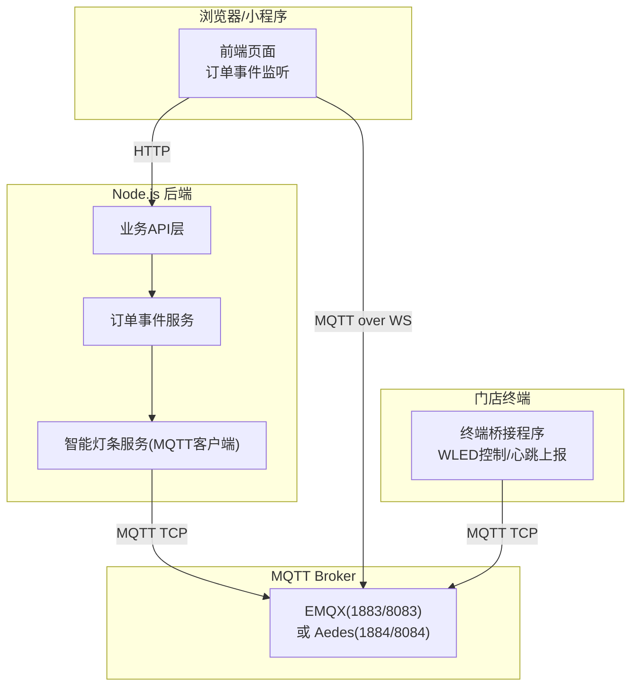
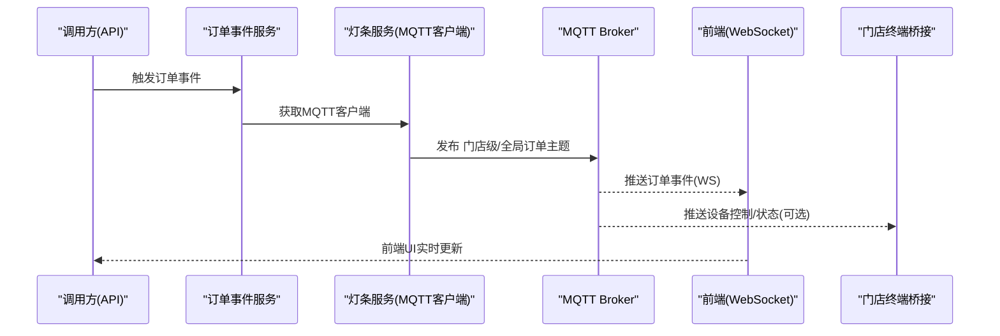
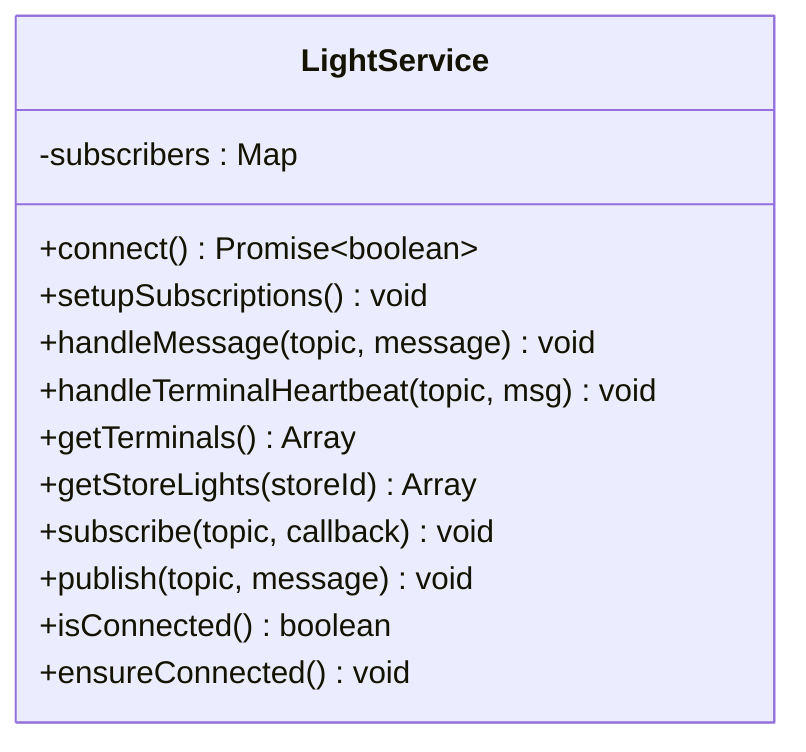
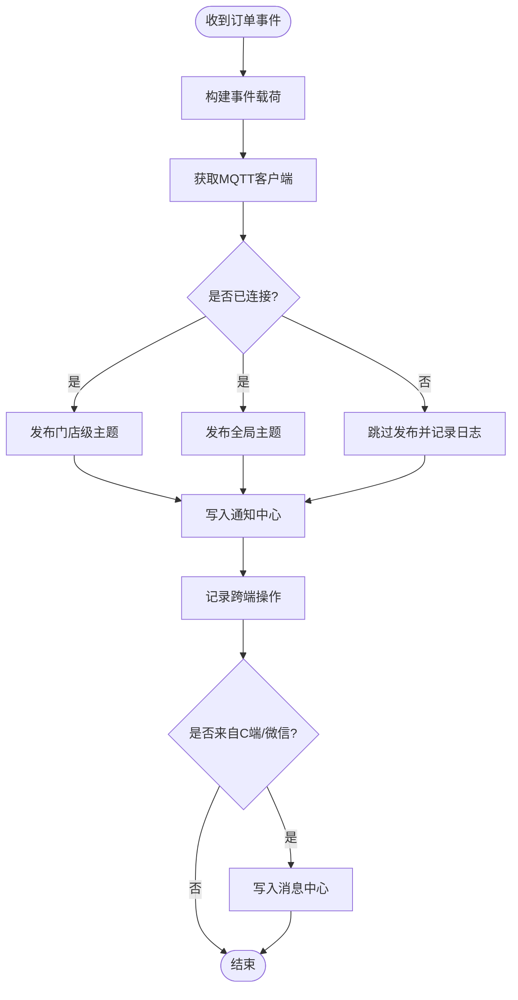
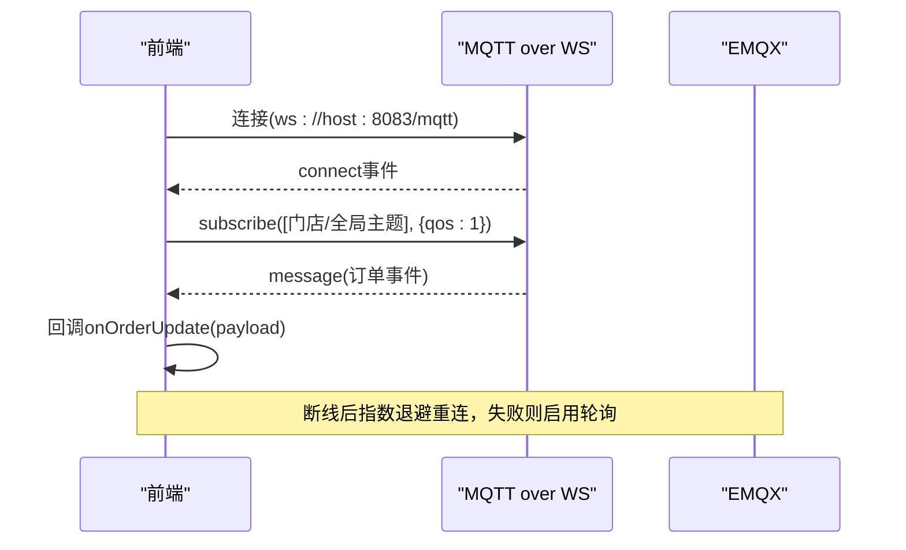
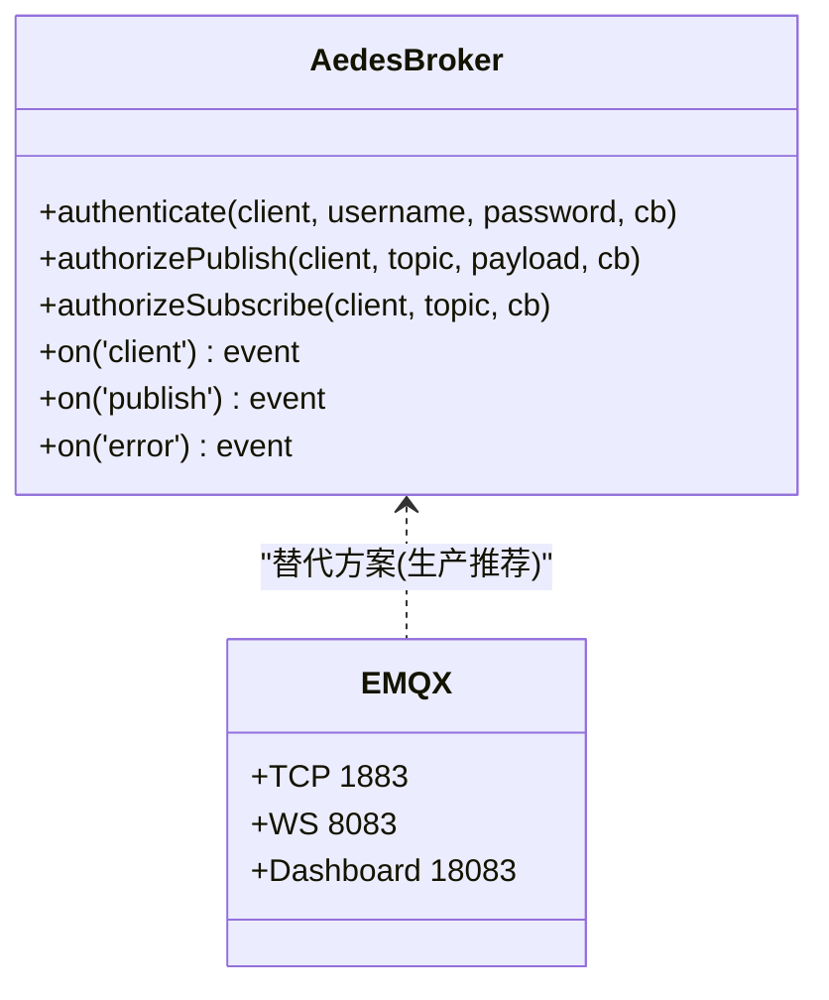
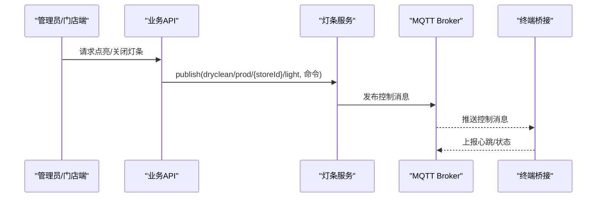
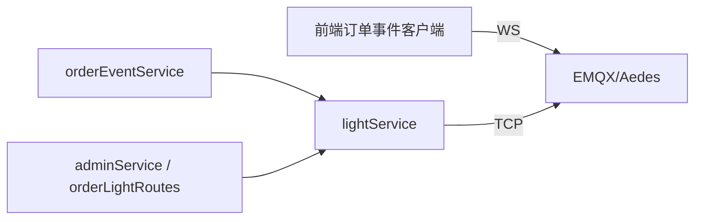

# MQTT架构设计

<cite>
**本文引用的文件**   
- [backend/services/lightService.js](file://backend/services/lightService.js)
- [backend/services/orderEventService.js](file://backend/services/orderEventService.js)
- [js/order-event-client.js](file://js/order-event-client.js)
- [backend/production-broker.js](file://backend/production-broker.js)
- [backend/start-mqtt-broker.js](file://backend/start-mqtt-broker.js)
- [backend/minimal-broker.js](file://backend/minimal-broker.js)
- [backend/mqtt-test.js](file://backend/mqtt-test.js)
- [backend/EMQX_MIGRATION.md](file://backend/EMQX_MIGRATION.md)
- [backend/MQTT_DEPLOYMENT.md](file://backend/MQTT_DEPLOYMENT.md)
- [backend/BROKER_README.md](file://backend/BROKER_README.md)
- [backend/docker-compose.yml](file://backend/docker-compose.yml)
- [backend/modules/store/routes/orderLightRoutes.js](file://backend/modules/store/routes/orderLightRoutes.js)
- [backend/modules/admin/services/adminService.js](file://backend/modules/admin/services/adminService.js)
- [index.html](file://index.html)
</cite>

## 目录
1. [引言](#引言)
2. [项目结构](#项目结构)
3. [核心组件](#核心组件)
4. [架构总览](#架构总览)
5. [详细组件分析](#详细组件分析)
6. [依赖关系分析](#依赖关系分析)
7. [性能与可靠性](#性能与可靠性)
8. [部署与配置](#部署与配置)
9. [故障排查指南](#故障排查指南)
10. [结论](#结论)

## 引言
本文件面向物联网与实时通信开发者，系统化阐述干洗店管理系统的MQTT消息推送架构。内容覆盖Broker选型（EMQX/Aedes）、客户端连接管理、主题命名规范、消息路由策略、发布订阅实现（含QoS、持久化与断线重连）、连接池与心跳检测机制，并结合干洗店场景给出订单状态同步、设备控制指令下发等落地案例。

## 项目结构
系统围绕“后端服务 + MQTT Broker + 前端/终端”的三层结构组织：
- 后端服务：提供业务API，封装MQTT客户端能力，负责事件编排与跨端同步
- MQTT Broker：EMQX（生产推荐）或Aedes（开发/测试），承载TCP与WebSocket接入
- 前端/终端：通过WebSocket订阅订单事件；门店终端桥接程序订阅灯条控制并上报心跳

图表来源
- [backend/services/orderEventService.js:1-48](file://backend/services/orderEventService.js#L1-L48)
- [backend/services/lightService.js:1-60](file://backend/services/lightService.js#L1-L60)
- [js/order-event-client.js:118-178](file://js/order-event-client.js#L118-L178)
- [backend/EMQX_MIGRATION.md:68-89](file://backend/EMQX_MIGRATION.md#L68-L89)

章节来源
- [backend/EMQX_MIGRATION.md:1-89](file://backend/EMQX_MIGRATION.md#L1-L89)
- [backend/MQTT_DEPLOYMENT.md:1-120](file://backend/MQTT_DEPLOYMENT.md#L1-L120)

## 核心组件
- 智能灯条服务(lightService.js)：后端MQTT客户端封装，负责连接、订阅、发布、心跳与终端注册表维护
- 订单事件服务(orderEventService.js)：将订单状态变更以MQTT事件形式广播到门店级与全局主题
- 前端订单事件客户端(js/order-event-client.js)：通过WebSocket连接EMQX，订阅订单更新主题，具备断线重连与轮询降级
- 生产级Broker示例(production-broker.js)：基于Aedes的生产级示例，支持认证与授权钩子、可选WebSocket
- 极简/启动脚本(minimal-broker.js, start-mqtt-broker.js)：用于快速验证与调试
- 迁移与部署文档(EMQX_MIGRATION.md, MQTT_DEPLOYMENT.md, BROKER_README.md)：从Aedes迁移至EMQX、Docker部署、端口与环境变量说明

章节来源
- [backend/services/lightService.js:1-90](file://backend/services/lightService.js#L1-L90)
- [backend/services/orderEventService.js:1-48](file://backend/services/orderEventService.js#L1-L48)
- [js/order-event-client.js:118-178](file://js/order-event-client.js#L118-L178)
- [backend/production-broker.js:1-128](file://backend/production-broker.js#L1-L128)
- [backend/minimal-broker.js:1-60](file://backend/minimal-broker.js#L1-L60)
- [backend/start-mqtt-broker.js:1-60](file://backend/start-mqtt-broker.js#L1-L60)
- [backend/EMQX_MIGRATION.md:1-89](file://backend/EMQX_MIGRATION.md#L1-L89)
- [backend/MQTT_DEPLOYMENT.md:1-120](file://backend/MQTT_DEPLOYMENT.md#L1-L120)
- [backend/BROKER_README.md:1-120](file://backend/BROKER_README.md#L1-L120)

## 架构总览
整体采用“后端统一发布 + 多端订阅”的发布订阅模式：
- 后端作为发布者，将订单事件与设备控制命令推送到MQTT
- 前端通过WebSocket订阅订单事件，实现实时刷新
- 门店终端桥接程序订阅设备控制主题，执行动作并上报心跳/状态

图表来源
- [backend/services/orderEventService.js:77-144](file://backend/services/orderEventService.js#L77-L144)
- [backend/services/lightService.js:197-205](file://backend/services/lightService.js#L197-L205)
- [js/order-event-client.js:118-178](file://js/order-event-client.js#L118-L178)

## 详细组件分析

### 组件一：智能灯条服务(lightService.js)
职责
- 建立与管理MQTT客户端连接（TCP）
- 订阅终端状态、心跳与主消息主题
- 维护终端注册表与心跳超时清理
- 对外暴露publish/subscribe/isConnected等方法

关键实现要点
- 连接参数：clientId、keepalive、reconnectPeriod、connectTimeout、用户名密码
- 订阅主题：使用通配符覆盖门店维度
- 心跳处理：按topic解析storeId/lightId，更新最后心跳时间，定时清理离线设备
- 健康检查：周期性ensureConnected保证Broker后启动也能恢复

复杂度与优化
- 终端注册表为Map嵌套Map，查询与更新均为O(1)
- 心跳清理周期可配置，避免频繁GC

错误处理
- 连接错误、离线、重连事件均有日志与兜底逻辑
- publish前判断connected，避免异常抛出

图表来源
- [backend/services/lightService.js:24-90](file://backend/services/lightService.js#L24-L90)
- [backend/services/lightService.js:92-140](file://backend/services/lightService.js#L92-L140)
- [backend/services/lightService.js:197-234](file://backend/services/lightService.js#L197-L234)

章节来源
- [backend/services/lightService.js:1-234](file://backend/services/lightService.js#L1-L234)

### 组件二：订单事件服务(orderEventService.js)
职责
- 将订单生命周期事件转换为MQTT消息
- 同时写入通知中心与跨端操作记录
- 对C端/微信侧操作生成消息中心条目

主题与路由
- 门店级主题：dryclean/orders/{storeId}/update
- 全局主题：dryclean/orders/all/update
- 消息体包含event、orderId、orderNo、storeId、status、_source等字段

图表来源
- [backend/services/orderEventService.js:77-144](file://backend/services/orderEventService.js#L77-L144)

章节来源
- [backend/services/orderEventService.js:1-168](file://backend/services/orderEventService.js#L1-L168)

### 组件三：前端订单事件客户端(js/order-event-client.js)
职责
- 通过WebSocket连接EMQX
- 根据模式订阅门店级/全局主题
- 实现指数退避重连与轮询降级

连接与订阅
- WebSocket地址：ws://{host}:8083/mqtt
- QoS=1，保持长连接，设置reconnectPeriod/connectTimeout
- 切换门店时动态取消旧订阅并重新订阅新主题

图表来源
- [js/order-event-client.js:118-178](file://js/order-event-client.js#L118-L178)
- [js/order-event-client.js:202-248](file://js/order-event-client.js#L202-L248)

章节来源
- [js/order-event-client.js:1-270](file://js/order-event-client.js#L1-L270)

### 组件四：Broker实现与示例(Aedes/EMQX)
- 生产级Aedes示例(production-broker.js)：支持用户认证、发布/订阅授权钩子、可选WebSocket
- 极简/启动脚本(minimal-broker.js, start-mqtt-broker.js)：无认证或基础功能，便于快速验证
- EMQX迁移与部署：默认端口1883(TCP)/8083(WS)，提供Docker与Windows本地部署指引

图表来源
- [backend/production-broker.js:53-111](file://backend/production-broker.js#L53-L111)
- [backend/EMQX_MIGRATION.md:68-89](file://backend/EMQX_MIGRATION.md#L68-L89)

章节来源
- [backend/production-broker.js:1-227](file://backend/production-broker.js#L1-L227)
- [backend/minimal-broker.js:1-60](file://backend/minimal-broker.js#L1-L60)
- [backend/start-mqtt-broker.js:1-60](file://backend/start-mqtt-broker.js#L1-L60)
- [backend/EMQX_MIGRATION.md:1-89](file://backend/EMQX_MIGRATION.md#L1-L89)
- [backend/MQTT_DEPLOYMENT.md:1-120](file://backend/MQTT_DEPLOYMENT.md#L1-L120)
- [backend/BROKER_README.md:1-120](file://backend/BROKER_README.md#L1-L120)

### 组件五：设备控制与灯条联动
- 管理员/门店端通过API触发灯条控制，后端调用lightService.publish发送命令
- 终端桥接程序订阅控制主题，驱动WLED设备并上报心跳/状态

图表来源
- [backend/modules/store/routes/orderLightRoutes.js:449-482](file://backend/modules/store/routes/orderLightRoutes.js#L449-L482)
- [backend/modules/admin/services/adminService.js:1102-1215](file://backend/modules/admin/services/adminService.js#L1102-L1215)
- [backend/services/lightService.js:197-205](file://backend/services/lightService.js#L197-L205)

章节来源
- [backend/modules/store/routes/orderLightRoutes.js:429-482](file://backend/modules/store/routes/orderLightRoutes.js#L429-L482)
- [backend/modules/admin/services/adminService.js:1079-1235](file://backend/modules/admin/services/adminService.js#L1079-L1235)
- [backend/services/lightService.js:197-234](file://backend/services/lightService.js#L197-L234)

## 依赖关系分析
- 后端模块间耦合
  - orderEventService依赖lightService获取MQTT客户端
  - adminService/orderLightRoutes通过lightService进行设备控制
- 前后端解耦
  - 前端仅依赖MQTT over WS，不感知后端实现细节
- Broker可替换
  - 代码中对EMQX/Aedes的适配通过环境变量与主题约定完成

图表来源
- [backend/services/orderEventService.js:22-31](file://backend/services/orderEventService.js#L22-L31)
- [backend/modules/admin/services/adminService.js:1102-1215](file://backend/modules/admin/services/adminService.js#L1102-L1215)
- [js/order-event-client.js:118-178](file://js/order-event-client.js#L118-L178)

章节来源
- [backend/services/orderEventService.js:1-168](file://backend/services/orderEventService.js#L1-L168)
- [backend/modules/admin/services/adminService.js:1079-1235](file://backend/modules/admin/services/adminService.js#L1079-L1235)
- [js/order-event-client.js:1-270](file://js/order-event-client.js#L1-L270)

## 性能与可靠性
- QoS选择
  - 订单事件与设备控制建议QoS=1，确保至少一次投递
- 断线重连
  - 前端采用指数退避重连，达到上限后自动降级为轮询
  - 后端lightService周期性ensureConnected，保障Broker重启后的自愈
- 心跳与在线判定
  - 终端每30秒上报心跳，服务端据此判定在线/离线
- 连接池
  - 当前后端为单例MQTT客户端；若需水平扩展，可在进程内复用客户端实例，或使用外部Broker集群
- 持久化
  - 当前未启用Broker侧持久化；如需离线消息，建议在EMQX中开启消息保留与离线队列

[本节为通用指导，无需源码引用]

## 部署与配置
- Broker选型
  - 生产推荐EMQX（稳定、生态完善），开发/测试可用Aedes
- 端口与环境变量
  - EMQX：TCP 1883，WS 8083，Dashboard 18083
  - Aedes示例：TCP 1884，WS 8084（可通过环境变量覆盖）
- Docker部署
  - 提供MongoDB/MySQL容器编排示例，可按需组合EMQX
- 认证与安全
  - 生产环境启用认证与TLS，限制IP访问，修改默认口令

章节来源
- [backend/EMQX_MIGRATION.md:1-89](file://backend/EMQX_MIGRATION.md#L1-L89)
- [backend/MQTT_DEPLOYMENT.md:120-340](file://backend/MQTT_DEPLOYMENT.md#L120-L340)
- [backend/BROKER_README.md:60-120](file://backend/BROKER_README.md#L60-L120)
- [backend/docker-compose.yml:1-34](file://backend/docker-compose.yml#L1-L34)

## 故障排查指南
- 连接问题
  - 确认Broker端口开放、防火墙放行、用户名密码正确
  - 使用mqtt-test.js进行连通性自检
- 认证失败
  - 检查Aedes认证配置或EMQX控制台用户列表
- 消息丢失
  - 检查QoS是否为1或以上；必要时在Broker侧开启持久化
- 性能瓶颈
  - 提升服务器资源，调整keepalive与重连间隔，观察Broker监控面板指标

章节来源
- [backend/mqtt-test.js:1-58](file://backend/mqtt-test.js#L1-L58)
- [backend/production-broker.js:128-156](file://backend/production-broker.js#L128-L156)
- [backend/MQTT_DEPLOYMENT.md:320-380](file://backend/MQTT_DEPLOYMENT.md#L320-L380)

## 结论
本架构以MQTT为核心，实现了干洗店场景下的订单实时同步与设备控制闭环。通过统一的主题命名与QoS策略，结合前端重连与后端心跳机制，系统在易用性与稳定性之间取得平衡。生产环境推荐使用EMQX，配合认证、TLS与必要的持久化策略，可满足高可靠与可扩展需求。