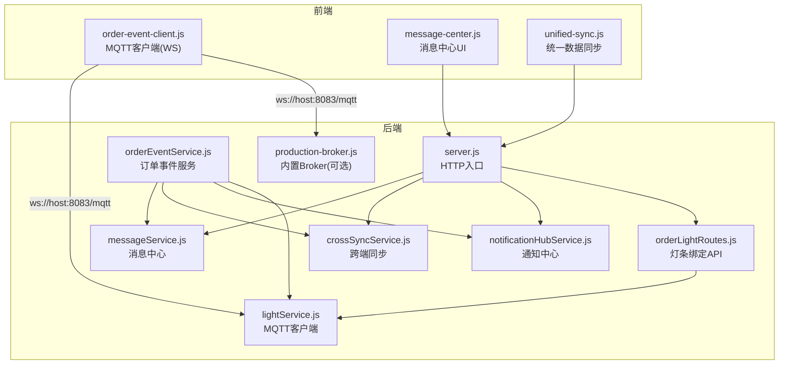
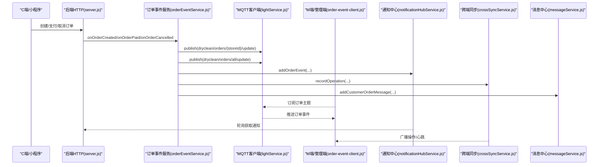
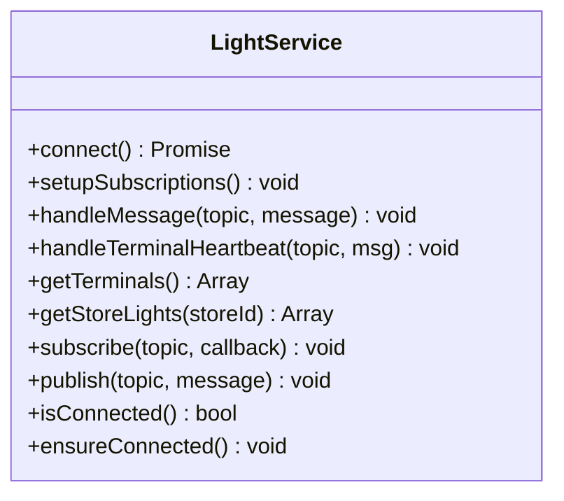
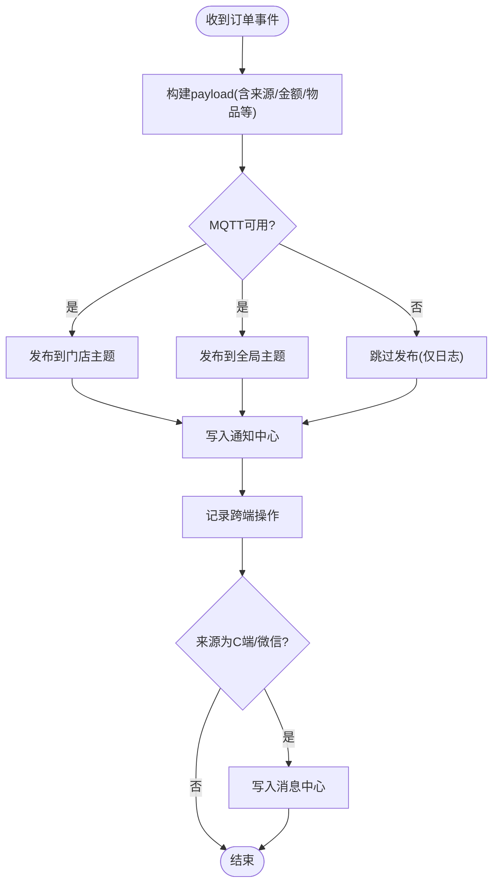
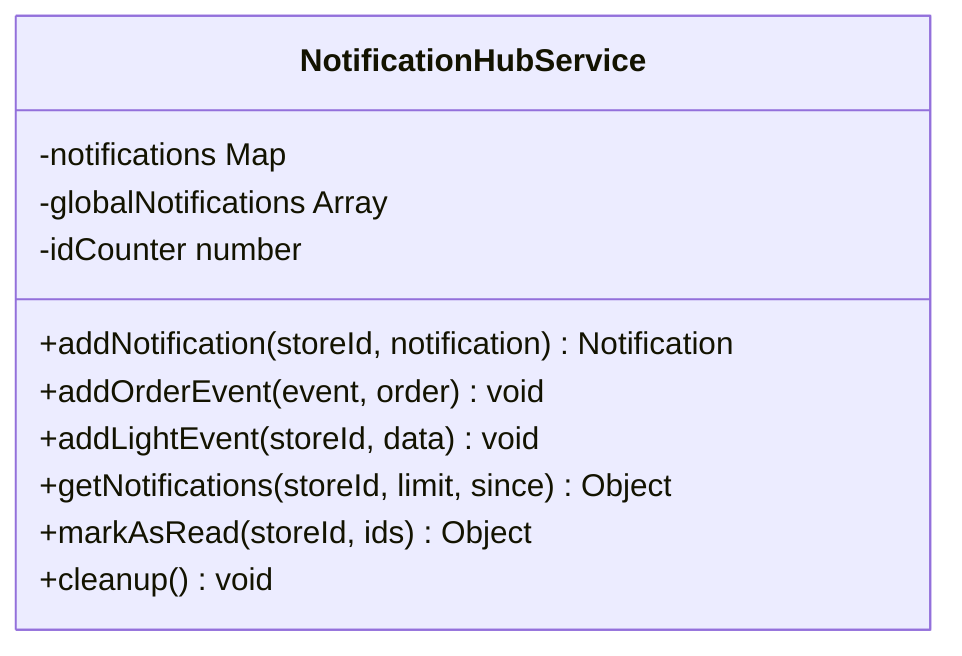
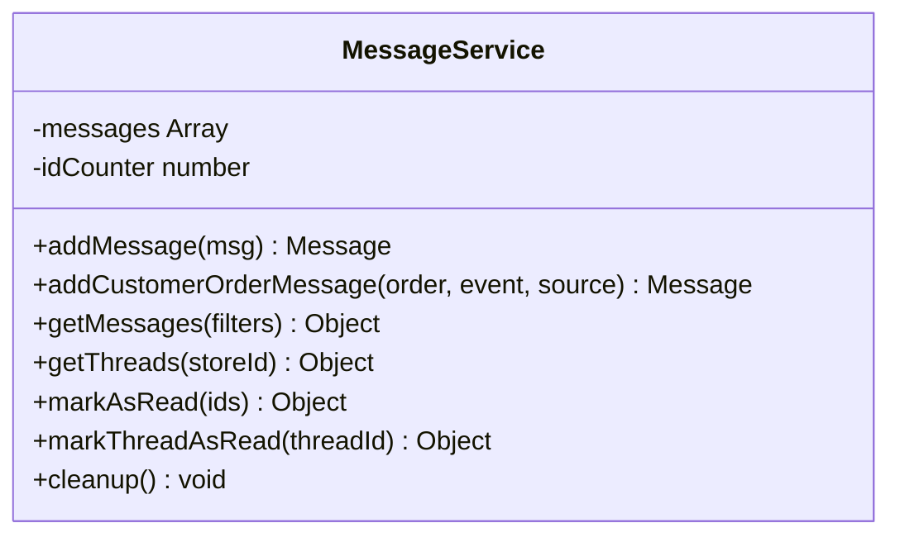
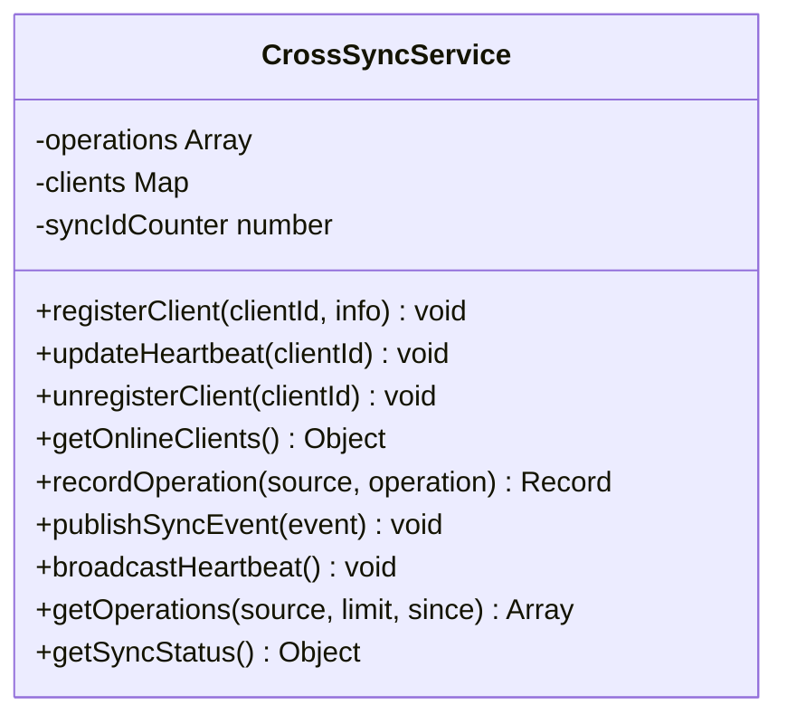
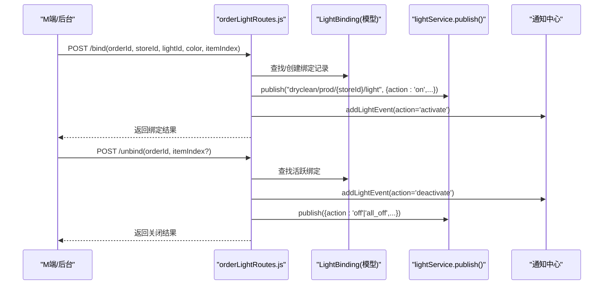
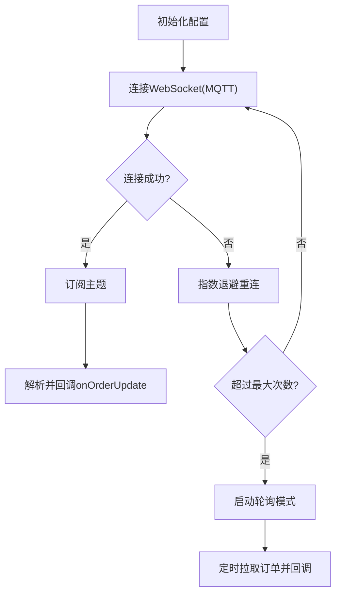
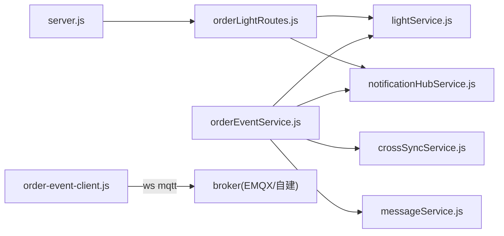

# 实时通信系统

<cite>
**本文引用的文件**   
- [backend/services/lightService.js](file://backend/services/lightService.js)
- [backend/services/orderEventService.js](file://backend/services/orderEventService.js)
- [backend/services/notificationHubService.js](file://backend/services/notificationHubService.js)
- [backend/services/messageService.js](file://backend/services/messageService.js)
- [backend/services/crossSyncService.js](file://backend/services/crossSyncService.js)
- [backend/modules/store/routes/orderLightRoutes.js](file://backend/modules/store/routes/orderLightRoutes.js)
- [backend/production-broker.js](file://backend/production-broker.js)
- [backend/minimal-broker.js](file://backend/minimal-broker.js)
- [js/order-event-client.js](file://js/order-event-client.js)
- [js/message-center.js](file://js/message-center.js)
- [js/unified-sync.js](file://js/unified-sync.js)
- [backend/server.js](file://backend/server.js)
- [backend/services/MQTT_DEPLOYMENT.md](file://backend/services/MQTT_DEPLOYMENT.md)
</cite>

## 目录
1. [引言](#引言)
2. [项目结构](#项目结构)
3. [核心组件](#核心组件)
4. [架构总览](#架构总览)
5. [详细组件分析](#详细组件分析)
6. [依赖关系分析](#依赖关系分析)
7. [性能与可靠性](#性能与可靠性)
8. [部署与运维](#部署与运维)
9. [故障排查指南](#故障排查指南)
10. [结论](#结论)

## 引言
本文件面向物联网与实时通信开发者，系统化梳理干洗店管理系统的实时通信方案。重点覆盖：
- 基于MQTT的消息推送架构（发布/订阅、主题命名规范、路由策略）
- 设备联动能力（灯条提示、扫码入库等IoT集成）
- 订单状态同步机制（多端一致性）
- 通知中心设计（站内消息、推送通知、短信提醒的统一入口）
- MQTT服务器部署配置、集群与调优建议
- 消息持久化、重试与断线重连等可靠性保障

## 项目结构
后端以Express为HTTP入口，结合自研服务模块完成事件分发、通知聚合与跨端同步；前端通过MQTT over WebSocket接收实时事件，并辅以轮询兜底。

图表来源
- [backend/server.js:1-200](file://backend/server.js#L1-L200)
- [backend/services/lightService.js:1-234](file://backend/services/lightService.js#L1-L234)
- [backend/services/orderEventService.js:1-168](file://backend/services/orderEventService.js#L1-L168)
- [backend/services/notificationHubService.js:1-264](file://backend/services/notificationHubService.js#L1-L264)
- [backend/services/messageService.js:1-247](file://backend/services/messageService.js#L1-L247)
- [backend/services/crossSyncService.js:1-336](file://backend/services/crossSyncService.js#L1-L336)
- [backend/modules/store/routes/orderLightRoutes.js:1-696](file://backend/modules/store/routes/orderLightRoutes.js#L1-L696)
- [backend/production-broker.js:1-227](file://backend/production-broker.js#L1-L227)
- [js/order-event-client.js:1-270](file://js/order-event-client.js#L1-L270)
- [js/message-center.js:1-352](file://js/message-center.js#L1-L352)
- [js/unified-sync.js:1-420](file://js/unified-sync.js#L1-L420)

章节来源
- [backend/server.js:1-200](file://backend/server.js#L1-L200)

## 核心组件
- 智能灯条MQTT服务：封装连接、订阅、心跳处理、终端注册与状态维护，提供发布接口供业务调用。
- 订单事件服务：将订单变更事件通过MQTT广播到门店级与全局主题，并同步写入通知中心、跨端同步与消息中心。
- 通知中心：集中存储与聚合各类通知（订单、灯条、操作），支持按门店或全局查询与已读标记。
- 消息中心：面向客户与账户间通讯的站内消息，支持线程聚合、未读数统计与定时清理。
- 跨端同步：记录操作来源、在线客户端心跳、广播同步事件，避免本地回显与重复更新。
- 前端订单事件客户端：通过WebSocket接入MQTT，自动重连与轮询降级。
- 前端消息中心：轮询拉取消息线程与详情，支持快捷回复与已读标记。
- 统一数据同步：在C/M/Admin三端进行本地缓存与增量合并，保证页面展示一致。

章节来源
- [backend/services/lightService.js:1-234](file://backend/services/lightService.js#L1-L234)
- [backend/services/orderEventService.js:1-168](file://backend/services/orderEventService.js#L1-L168)
- [backend/services/notificationHubService.js:1-264](file://backend/services/notificationHubService.js#L1-L264)
- [backend/services/messageService.js:1-247](file://backend/services/messageService.js#L1-L247)
- [backend/services/crossSyncService.js:1-336](file://backend/services/crossSyncService.js#L1-L336)
- [js/order-event-client.js:1-270](file://js/order-event-client.js#L1-L270)
- [js/message-center.js:1-352](file://js/message-center.js#L1-L352)
- [js/unified-sync.js:1-420](file://js/unified-sync.js#L1-L420)

## 架构总览
系统采用“HTTP + MQTT”的双通道架构：
- HTTP用于业务CRUD、认证、配置与轮询兜底
- MQTT用于实时事件分发（订单状态、设备控制、跨端同步）

图表来源
- [backend/server.js:1-200](file://backend/server.js#L1-L200)
- [backend/services/orderEventService.js:1-168](file://backend/services/orderEventService.js#L1-L168)
- [backend/services/lightService.js:1-234](file://backend/services/lightService.js#L1-L234)
- [backend/services/notificationHubService.js:1-264](file://backend/services/notificationHubService.js#L1-L264)
- [backend/services/crossSyncService.js:1-336](file://backend/services/crossSyncService.js#L1-L336)
- [backend/services/messageService.js:1-247](file://backend/services/messageService.js#L1-L247)
- [js/order-event-client.js:1-270](file://js/order-event-client.js#L1-L270)

## 详细组件分析

### MQTT客户端与服务（lightService.js）
- 连接与重连：支持keepalive、reconnectPeriod、connectTimeout；提供ensureConnected周期性健康检查。
- 订阅策略：订阅终端心跳与状态主题，解析storeId与lightId，维护终端注册表与心跳超时清理。
- 发布接口：publish(topic, message)，QoS=1，确保至少一次投递。
- 终端状态：getTerminals/getStoreLights返回活跃灯条列表，剔除超时无心跳的设备。

图表来源
- [backend/services/lightService.js:1-234](file://backend/services/lightService.js#L1-L234)

章节来源
- [backend/services/lightService.js:1-234](file://backend/services/lightService.js#L1-L234)

### 订单事件服务（orderEventService.js）
- 主题设计：
  - 门店级：dryclean/orders/{storeId}/update
  - 全局级：dryclean/orders/all/update
- 事件类型：order_created、order_paid、order_cancelled、order_status_changed
- 副作用：
  - 写入通知中心（addOrderEvent）
  - 记录跨端操作（recordOperation）
  - 对C端/微信来源写入消息中心（addCustomerOrderMessage）

图表来源
- [backend/services/orderEventService.js:1-168](file://backend/services/orderEventService.js#L1-L168)
- [backend/services/notificationHubService.js:1-264](file://backend/services/notificationHubService.js#L1-L264)
- [backend/services/crossSyncService.js:1-336](file://backend/services/crossSyncService.js#L1-L336)
- [backend/services/messageService.js:1-247](file://backend/services/messageService.js#L1-L247)

章节来源
- [backend/services/orderEventService.js:1-168](file://backend/services/orderEventService.js#L1-L168)

### 通知中心（notificationHubService.js）
- 存储模型：按门店Map存储通知数组，另维护全局通知数组
- 生命周期：TTL=1小时，定时清理过期项
- 查询接口：支持since过滤、限制数量、未读数统计
- 典型事件：订单事件、灯条激活/关闭、跨端操作

图表来源
- [backend/services/notificationHubService.js:1-264](file://backend/services/notificationHubService.js#L1-L264)

章节来源
- [backend/services/notificationHubService.js:1-264](file://backend/services/notificationHubService.js#L1-L264)

### 消息中心（messageService.js）
- 用途：客户消息（下单/支付/咨询）与账户间通讯
- 数据结构：threadId聚合、read标记、TTL=7天、最大保留数
- 查询：按门店/类型/线程/时间过滤，返回未读数与分页信息

图表来源
- [backend/services/messageService.js:1-247](file://backend/services/messageService.js#L1-L247)

章节来源
- [backend/services/messageService.js:1-247](file://backend/services/messageService.js#L1-L247)

### 跨端同步（crossSyncService.js）
- 功能：记录操作来源、在线客户端心跳、广播同步事件
- 防回显：携带clientId与syncId，客户端可过滤自身操作
- 通知联动：操作写入通知中心，便于Admin端轮询

图表来源
- [backend/services/crossSyncService.js:1-336](file://backend/services/crossSyncService.js#L1-L336)

章节来源
- [backend/services/crossSyncService.js:1-336](file://backend/services/crossSyncService.js#L1-L336)

### 订单-灯条绑定API（orderLightRoutes.js）
- 绑定/解绑：幂等创建或更新绑定记录，发布MQTT点亮/关闭命令
- 批量与紧急：批量顺序点亮、紧急闪烁后自动关闭
- 通知：写入M端待处理通知缓存与通知中心
- 查询：按门店/订单/物品维度查询绑定状态

图表来源
- [backend/modules/store/routes/orderLightRoutes.js:1-696](file://backend/modules/store/routes/orderLightRoutes.js#L1-L696)
- [backend/services/lightService.js:1-234](file://backend/services/lightService.js#L1-L234)
- [backend/services/notificationHubService.js:1-264](file://backend/services/notificationHubService.js#L1-L264)

章节来源
- [backend/modules/store/routes/orderLightRoutes.js:1-696](file://backend/modules/store/routes/orderLightRoutes.js#L1-L696)

### 前端订单事件客户端（order-event-client.js）
- 连接：ws://{host}:8083/mqtt，用户名密码鉴权
- 订阅：根据模式选择门店级或全局主题
- 重连：指数退避，达到上限切换轮询模式
- 轮询：当MQTT不可用时，定时拉取订单列表作为降级

图表来源
- [js/order-event-client.js:1-270](file://js/order-event-client.js#L1-L270)

章节来源
- [js/order-event-client.js:1-270](file://js/order-event-client.js#L1-L270)

### 前端消息中心（message-center.js）
- 线程列表：按threadId聚合，显示未读数与最后时间
- 聊天详情：加载历史消息，自动标记已读
- 发送消息：乐观更新UI，失败回滚提示
- 轮询：每15秒刷新线程与当前对话

章节来源
- [js/message-center.js:1-352](file://js/message-center.js#L1-L352)

### 统一数据同步（unified-sync.js）
- 端点识别：根据URL路径判断C/M/Admin端
- 同步策略：定时拉取+可见性恢复触发，localStorage缓存与备份
- 合并规则：服务器优先，保留本地特有字段，去重排序

章节来源
- [js/unified-sync.js:1-420](file://js/unified-sync.js#L1-L420)

## 依赖关系分析
- 低耦合高内聚：各服务通过延迟加载避免循环依赖
- 关键依赖链：
  - server.js 挂载路由与通知/同步/消息API
  - orderLightRoutes.js 依赖 lightService 与 notificationHubService
  - orderEventService.js 依赖 lightService、notificationHubService、crossSyncService、messageService
  - 前端 order-event-client.js 依赖浏览器mqtt库与WebSocket

图表来源
- [backend/server.js:1-200](file://backend/server.js#L1-L200)
- [backend/modules/store/routes/orderLightRoutes.js:1-696](file://backend/modules/store/routes/orderLightRoutes.js#L1-L696)
- [backend/services/lightService.js:1-234](file://backend/services/lightService.js#L1-L234)
- [backend/services/orderEventService.js:1-168](file://backend/services/orderEventService.js#L1-L168)
- [backend/services/notificationHubService.js:1-264](file://backend/services/notificationHubService.js#L1-L264)
- [backend/services/crossSyncService.js:1-336](file://backend/services/crossSyncService.js#L1-L336)
- [backend/services/messageService.js:1-247](file://backend/services/messageService.js#L1-L247)
- [js/order-event-client.js:1-270](file://js/order-event-client.js#L1-L270)

章节来源
- [backend/server.js:1-200](file://backend/server.js#L1-L200)

## 性能与可靠性
- 发布/订阅
  - QoS=1：保证至少一次送达，适合订单状态与设备控制
  - 主题粒度：按门店隔离，降低无关订阅者负载
- 连接与重连
  - 客户端：指数退避重连，达到上限降级轮询
  - 服务端：定期ensureConnected检测并重连
- 心跳与离线
  - 终端心跳：30秒无心跳视为离线，自动清理
  - 跨端心跳：30秒广播在线客户端列表
- 内存与清理
  - 通知中心：1小时TTL，单门店最多100条
  - 消息中心：7天TTL，最多200条
  - 跨端操作：30分钟TTL，最多200条
- 幂等与去重
  - 灯条绑定：同订单+物品索引的活跃绑定幂等
  - 跨端操作：携带clientId/syncId，客户端过滤自身操作

[本节为通用指导，不直接分析具体文件]

## 部署与运维

### MQTT服务器部署
- EMQX（推荐生产）
  - Docker一键启动，暴露TCP 1883与WebSocket 8083
  - 控制台默认端口18083，启用管理插件
  - 环境变量设置用户名/密码
- 自建Aedes Broker（开发/轻量）
  - production-broker.js：支持用户认证、可选WebSocket
  - minimal-broker.js：极简无认证，快速验证

章节来源
- [backend/services/MQTT_DEPLOYMENT.md:1-410](file://backend/services/MQTT_DEPLOYMENT.md#L1-L410)
- [backend/production-broker.js:1-227](file://backend/production-broker.js#L1-L227)
- [backend/minimal-broker.js:1-60](file://backend/minimal-broker.js#L1-L60)

### 集群与扩展
- 使用EMQX集群：多节点共享会话与消息转发，配合外部存储（如Redis/数据库）实现持久化与会话恢复
- 反向代理：Nginx/Traefik统一入口，负载均衡与TLS终止
- 水平扩展：按门店或区域划分Broker集群，前端按租户动态选择连接地址

[本节为通用指导，不直接分析具体文件]

### 性能调优
- Broker侧
  - 调整并发连接数、消息队列长度、磁盘/内存阈值
  - 开启持久化与ACL，限制主题权限
- 应用侧
  - 合理设置keepalive与reconnectPeriod
  - 控制订阅范围，避免通配符滥用
  - 前端轮询间隔与MQTT降级策略平衡

[本节为通用指导，不直接分析具体文件]

## 故障排查指南
- 连接问题
  - 检查端口是否开放、防火墙与安全组
  - 确认用户名/密码与环境变量配置
- 消息丢失
  - 确认QoS设置与Broker持久化
  - 检查订阅者是否在线与主题匹配
- 性能瓶颈
  - 查看Broker监控面板的连接数与吞吐
  - 评估前端轮询频率与MQTT可用性
- 常见错误
  - 端口占用：停止冲突进程或修改端口
  - 认证失败：核对凭据与授权策略

章节来源
- [backend/services/MQTT_DEPLOYMENT.md:342-379](file://backend/services/MQTT_DEPLOYMENT.md#L342-L379)
- [backend/production-broker.js:149-156](file://backend/production-broker.js#L149-L156)

## 结论
本系统以MQTT为核心，构建了从订单事件到设备联动的完整实时链路，并通过通知中心与消息中心统一对外暴露。前端具备MQTT直连与轮询降级的双保险，后端提供跨端同步与终端状态管理，整体满足干洗门店多端协同与IoT设备联动的实时性与可靠性要求。生产环境建议使用EMQX集群并结合反向代理与TLS，以获得更高的可用性与安全性。