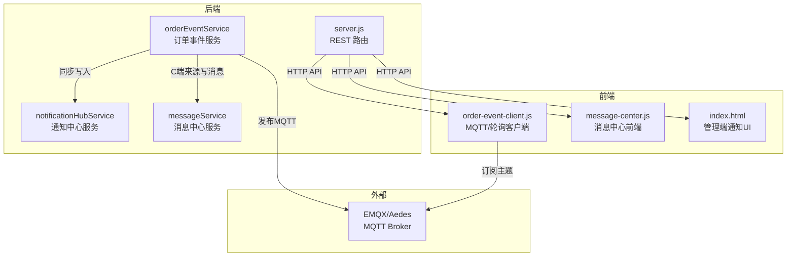
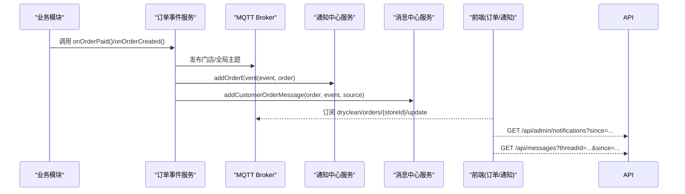
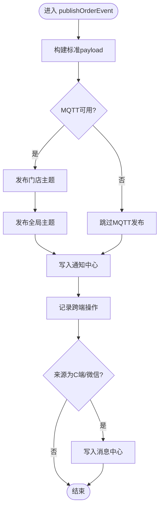
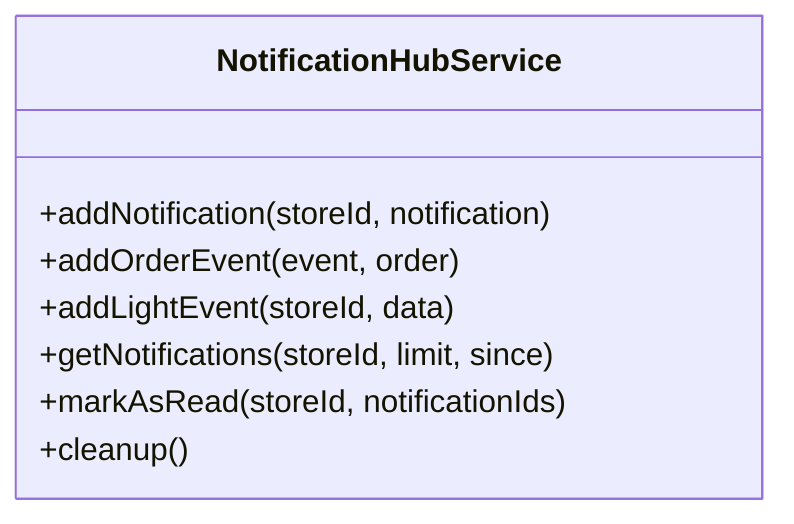
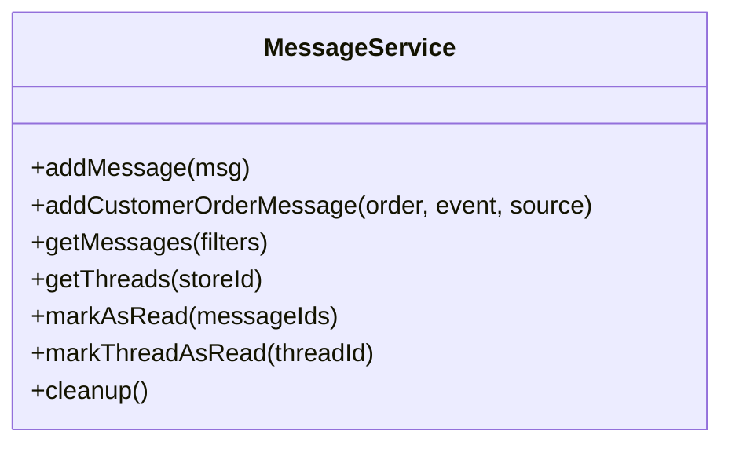
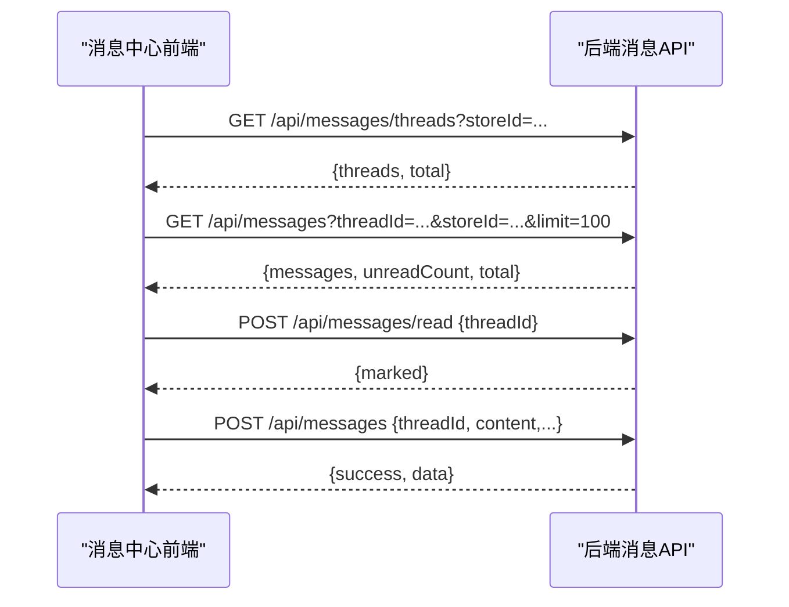
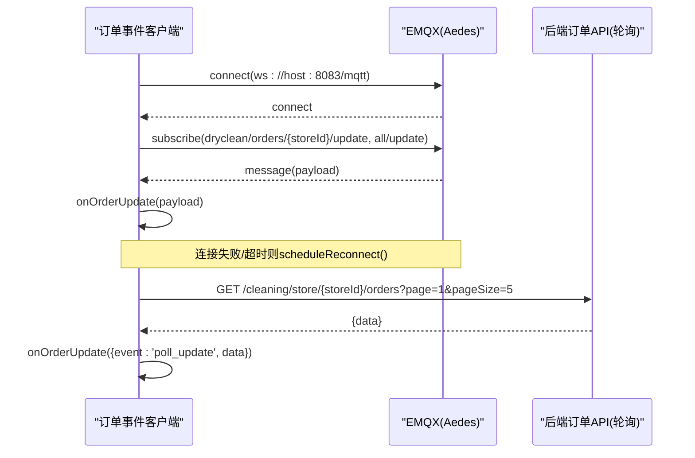
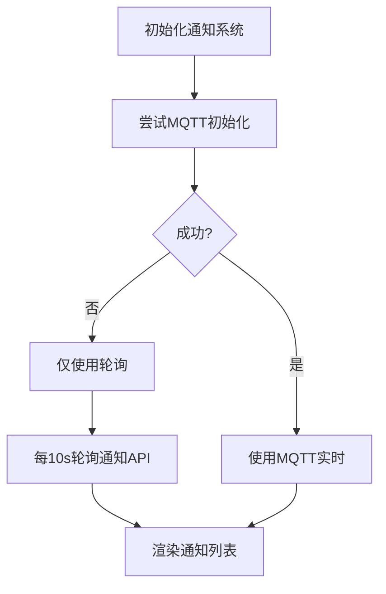
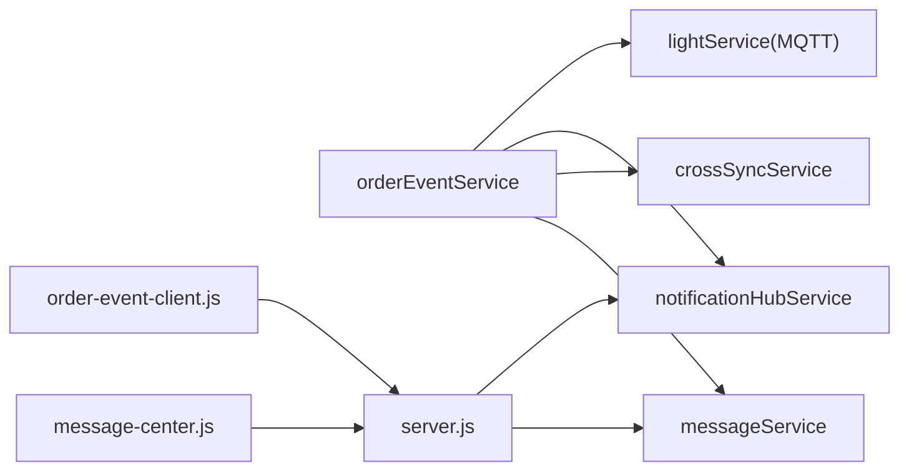

# 消息推送机制

<cite>
**本文引用的文件**   
- [backend/services/messageService.js](file://backend/services/messageService.js)
- [backend/services/notificationHubService.js](file://backend/services/notificationHubService.js)
- [backend/services/orderEventService.js](file://backend/services/orderEventService.js)
- [backend/server.js](file://backend/server.js)
- [js/message-center.js](file://js/message-center.js)
- [js/order-event-client.js](file://js/order-event-client.js)
- [index.html](file://index.html)
- [backend/modules/common/services/notificationService.js](file://backend/modules/common/services/notificationService.js)
</cite>

## 目录
1. [简介](#简介)
2. [项目结构](#项目结构)
3. [核心组件](#核心组件)
4. [架构总览](#架构总览)
5. [详细组件分析](#详细组件分析)
6. [依赖关系分析](#依赖关系分析)
7. [性能考虑](#性能考虑)
8. [故障排查指南](#故障排查指南)
9. [结论](#结论)
10. [附录](#附录)

## 简介
本文件面向干洗店管理系统的“消息推送机制”，覆盖站内消息、通知中心、订单事件推送、前端集成与轮询/实时通道，以及可扩展的消息队列方案。系统采用“双通道”策略：
- 实时通道：基于 MQTT（WebSocket）的订单事件广播，用于订单状态变更、灯条联动等实时场景。
- 持久化通道：REST API + 内存存储的通知与消息中心，提供历史查询、已读标记、线程聚合等能力。

该设计将“业务通知（铃铛）”和“客户/账户消息（聊天式）”解耦，分别由通知中心与消息中心服务负责，避免相互干扰。

## 项目结构
与消息推送相关的关键位置如下：
- 后端服务
  - 订单事件服务：统一发布订单事件到 MQTT，并同步写入通知中心与跨端同步记录。
  - 通知中心服务：按门店/全局维度维护通知列表，支持过期清理与已读标记。
  - 消息中心服务：维护客户消息与账户通讯消息，支持线程聚合、未读数统计、已读批量操作。
  - 路由层：暴露 REST API 供前端拉取通知、消息、标记已读等。
- 前端
  - 订单事件客户端：通过 MQTT over WebSocket 订阅主题，失败时自动降级为 HTTP 轮询。
  - 消息中心前端：轮询获取线程列表与消息详情，支持发送与管理员快捷回复。
  - 管理端页面：同时使用 MQTT 与轮询获取通知，保障可用性。

图表来源
- [backend/services/orderEventService.js:77-144](file://backend/services/orderEventService.js#L77-L144)
- [backend/services/notificationHubService.js:44-82](file://backend/services/notificationHubService.js#L44-L82)
- [backend/services/messageService.js:29-55](file://backend/services/messageService.js#L29-L55)
- [backend/server.js:304-392](file://backend/server.js#L304-L392)
- [js/order-event-client.js:118-178](file://js/order-event-client.js#L118-L178)
- [js/message-center.js:58-71](file://js/message-center.js#L58-L71)
- [index.html:5447-5472](file://index.html#L5447-L5472)

章节来源
- [backend/services/orderEventService.js:1-168](file://backend/services/orderEventService.js#L1-L168)
- [backend/services/notificationHubService.js:1-264](file://backend/services/notificationHubService.js#L1-L264)
- [backend/services/messageService.js:1-247](file://backend/services/messageService.js#L1-L247)
- [backend/server.js:300-399](file://backend/server.js#L300-L399)
- [js/order-event-client.js:1-270](file://js/order-event-client.js#L1-L270)
- [js/message-center.js:1-352](file://js/message-center.js#L1-L352)
- [index.html:5441-5472](file://index.html#L5441-L5472)

## 核心组件
- 订单事件服务
  - 职责：封装订单事件发布逻辑，向 MQTT 发布门店级与全局主题；同步写入通知中心；对 C 端/微信来源的事件写入消息中心。
  - 关键点：延迟加载依赖以避免循环引用；统一 payload 结构；记录操作来源以便追踪。
- 通知中心服务
  - 职责：维护门店与全局通知列表，支持过期清理、未读计数、按时间戳增量拉取。
  - 关键点：每个门店独立列表；全局通知与门店通知合并去重；TTL 控制有效期。
- 消息中心服务
  - 职责：维护客户消息与账户通讯消息，提供线程聚合视图、未读统计、已读批量/整线程标记。
  - 关键点：固定最大保留数与 TTL；按 threadId 聚合；过滤过期数据。
- 前端消息中心
  - 职责：轮询获取线程列表与消息详情，展示气泡对话，支持管理员发送消息与快捷回复。
  - 关键点：定时刷新；打开线程自动标记已读；乐观更新 UI。
- 前端订单事件客户端
  - 职责：连接 EMQX 订阅订单主题；失败时回退为 HTTP 轮询；切换门店时重新订阅。
  - 关键点：指数退避重连；QoS=1；状态指示与降级提示。

章节来源
- [backend/services/orderEventService.js:77-144](file://backend/services/orderEventService.js#L77-L144)
- [backend/services/notificationHubService.js:44-82](file://backend/services/notificationHubService.js#L44-L82)
- [backend/services/messageService.js:29-55](file://backend/services/messageService.js#L29-L55)
- [js/message-center.js:58-71](file://js/message-center.js#L58-L71)
- [js/order-event-client.js:118-178](file://js/order-event-client.js#L118-L178)

## 架构总览
系统以“订单事件”为核心触发点，驱动两条并行路径：
- 实时路径：MQTT 广播 → 前端订阅 → 即时渲染
- 持久化路径：通知中心/消息中心 → REST API → 前端轮询/增量拉取

图表来源
- [backend/services/orderEventService.js:77-144](file://backend/services/orderEventService.js#L77-L144)
- [backend/services/notificationHubService.js:88-127](file://backend/services/notificationHubService.js#L88-L127)
- [backend/services/messageService.js:61-103](file://backend/services/messageService.js#L61-L103)
- [js/order-event-client.js:103-113](file://js/order-event-client.js#L103-L113)
- [backend/server.js:160-191](file://backend/server.js#L160-L191)
- [backend/server.js:316-332](file://backend/server.js#L316-L332)

## 详细组件分析

### 订单事件服务（发布与同步）
- 发布流程
  - 构造标准化 payload（包含 orderId、orderNo、storeId、status、_source 等）。
  - 若 MQTT 可用，则发布至门店级与全局主题；否则记录日志跳过。
  - 同步写入通知中心，便于 Admin 端轮询。
  - 记录跨端操作来源，便于审计与排障。
  - 当来源为 C 端或微信小程序时，写入消息中心，形成可追溯的客户消息。
- 关键方法
  - publishOrderEvent：统一入口，协调各子系统。
  - onOrderCreated/onOrderPaid/onOrderCancelled/onOrderStatusChanged：便捷封装。

图表来源
- [backend/services/orderEventService.js:77-144](file://backend/services/orderEventService.js#L77-L144)

章节来源
- [backend/services/orderEventService.js:1-168](file://backend/services/orderEventService.js#L1-L168)

### 通知中心服务（门店/全局通知）
- 数据结构
  - per-store Map<storeId, Notification[]>
  - globalNotifications[]
  - 自增ID、TTL、未读计数
- 核心能力
  - addNotification：插入通知，限制数量上限，避免重复插入全局列表。
  - addOrderEvent/addLightEvent：根据事件类型生成标题与内容。
  - getNotifications：支持 since 增量拉取、过期过滤、排序与限流。
  - markAsRead：支持单门店或全量标记已读。
  - cleanup：定时清理过期通知。

图表来源
- [backend/services/notificationHubService.js:44-82](file://backend/services/notificationHubService.js#L44-L82)
- [backend/services/notificationHubService.js:88-127](file://backend/services/notificationHubService.js#L88-L127)
- [backend/services/notificationHubService.js:163-200](file://backend/services/notificationHubService.js#L163-L200)
- [backend/services/notificationHubService.js:205-230](file://backend/services/notificationHubService.js#L205-L230)
- [backend/services/notificationHubService.js:235-249](file://backend/services/notificationHubService.js#L235-L249)

章节来源
- [backend/services/notificationHubService.js:1-264](file://backend/services/notificationHubService.js#L1-L264)

### 消息中心服务（客户消息与账户通讯）
- 数据结构
  - messages[]：每条消息含 id、threadId、fromType/fromId/fromName、toType/toId、type、subject、content、orderNo、storeId、read、createdAt。
  - 常量：MAX_MESSAGES、TTL_MS。
- 核心能力
  - addMessage：追加消息，限制长度，输出日志。
  - addCustomerOrderMessage：根据订单事件生成客户可见消息。
  - getMessages/getThreads：过滤、分页、聚合线程、未读计数。
  - markAsRead/markThreadAsRead：批量或整线程已读。
  - cleanup：定时清理过期消息。

图表来源
- [backend/services/messageService.js:29-55](file://backend/services/messageService.js#L29-L55)
- [backend/services/messageService.js:61-103](file://backend/services/messageService.js#L61-L103)
- [backend/services/messageService.js:114-150](file://backend/services/messageService.js#L114-L150)
- [backend/services/messageService.js:155-192](file://backend/services/messageService.js#L155-L192)
- [backend/services/messageService.js:197-221](file://backend/services/messageService.js#L197-L221)
- [backend/services/messageService.js:226-233](file://backend/services/messageService.js#L226-L233)

章节来源
- [backend/services/messageService.js:1-247](file://backend/services/messageService.js#L1-L247)

### 前端消息中心（列表、详情、已读）
- 功能要点
  - 初始化后加载线程列表并启动轮询。
  - 点击线程加载详情，自动请求标记已读。
  - 发送消息走 POST /api/messages，乐观更新 UI。
  - 每 15 秒刷新线程与当前线程详情。
- 交互序列

图表来源
- [js/message-center.js:58-71](file://js/message-center.js#L58-L71)
- [js/message-center.js:129-154](file://js/message-center.js#L129-L154)
- [js/message-center.js:280-329](file://js/message-center.js#L280-L329)
- [backend/server.js:304-392](file://backend/server.js#L304-L392)

章节来源
- [js/message-center.js:1-352](file://js/message-center.js#L1-L352)
- [backend/server.js:300-399](file://backend/server.js#L300-L399)

### 前端订单事件客户端（MQTT/轮询）
- 功能要点
  - 默认通过 ws://host:8083/mqtt 连接 EMQX，订阅门店与全局主题。
  - 连接失败或达到最大重连次数后，切换到 HTTP 轮询模式。
  - 切换门店时取消旧订阅并重新订阅新门店主题。
- 连接与订阅时序

图表来源
- [js/order-event-client.js:118-178](file://js/order-event-client.js#L118-L178)
- [js/order-event-client.js:202-248](file://js/order-event-client.js#L202-L248)

章节来源
- [js/order-event-client.js:1-270](file://js/order-event-client.js#L1-L270)

### 管理端通知 UI（MQTT+轮询）
- 行为说明
  - 优先尝试 MQTT 初始化，失败则仅使用轮询。
  - 每 10 秒轮询 /api/admin/notifications?limit=10&since=...，去重后渲染。
  - 提供销毁方法清理定时器与连接。

图表来源
- [index.html:5441-5472](file://index.html#L5441-L5472)

章节来源
- [index.html:5441-5472](file://index.html#L5441-L5472)

### 多渠道通知模板（扩展参考）
- 说明
  - 定义了清洗、回收、租赁、系统等模块的多渠道模板（微信、短信、App推送、电话），并提供模板渲染与渠道分发接口占位。
  - 可作为后续接入第三方推送网关的扩展基座。

章节来源
- [backend/modules/common/services/notificationService.js:1-281](file://backend/modules/common/services/notificationService.js#L1-L281)

## 依赖关系分析
- 耦合关系
  - orderEventService 依赖 lightService（MQTT）、notificationHubService、crossSyncService、messageService，采用延迟加载避免循环依赖。
  - server.js 作为路由层，组合上述服务对外暴露 REST API。
  - 前端通过 js/order-event-client.js 与 js/message-center.js 分别消费实时与持久化通道。
- 潜在风险
  - 强依赖内存存储：服务重启后通知与消息丢失。生产环境建议引入持久化（数据库/Redis/MQTT持久化插件）。
  - 并发与一致性：多实例部署下需共享存储或引入分布式消息总线。

图表来源
- [backend/services/orderEventService.js:22-67](file://backend/services/orderEventService.js#L22-L67)
- [backend/server.js:300-399](file://backend/server.js#L300-L399)

章节来源
- [backend/services/orderEventService.js:1-168](file://backend/services/orderEventService.js#L1-L168)
- [backend/server.js:300-399](file://backend/server.js#L300-L399)

## 性能考虑
- 批量与分页
  - 通知与消息均支持 limit/since 增量拉取，减少无效传输。
- 压缩传输
  - 可在网关或反向代理开启 gzip/br，降低 JSON 体积。
- 缓存机制
  - 前端可对最近一次拉取结果做短时缓存，结合 since 字段实现增量更新。
- 连接与重连
  - 订单事件客户端采用指数退避重连，避免雪崩。
- 资源限制
  - 通知与消息设置最大保留数与 TTL，防止内存膨胀。
- 异步与批处理（扩展）
  - 在写入通知/消息前增加本地批处理缓冲，周期性落库，降低 I/O 压力。

[本节为通用优化建议，不直接分析具体文件]

## 故障排查指南
- MQTT 不可用
  - 现象：前端显示离线，自动切换轮询。
  - 排查：检查 ws://host:8083/mqtt 可达性；确认 broker 端口与鉴权配置。
- 通知未更新
  - 现象：Admin 端无新通知。
  - 排查：查看 /api/admin/notifications?since=... 返回；确认 orderEventService 是否调用 addOrderEvent。
- 消息未显示
  - 现象：消息中心无新消息。
  - 排查：确认 C 端/微信来源事件是否触发 addCustomerOrderMessage；检查 /api/messages/threads 与 /api/messages 返回。
- 已读不同步
  - 现象：打开线程后未读角标未清零。
  - 排查：确认前端是否调用 /api/messages/read；后端是否执行 markThreadAsRead。

章节来源
- [js/order-event-client.js:202-248](file://js/order-event-client.js#L202-L248)
- [backend/server.js:160-191](file://backend/server.js#L160-L191)
- [backend/server.js:316-332](file://backend/server.js#L316-L332)
- [backend/server.js:375-392](file://backend/server.js#L375-L392)

## 结论
本方案以订单事件为中心，通过“MQTT 实时 + REST 持久化”的双通道，兼顾了低延迟与可回溯能力。通知中心与消息中心职责清晰，前端具备完善的降级与轮询策略。为进一步提升可靠性与可扩展性，建议在生产环境中引入持久化存储与消息队列（如 Redis/RabbitMQ/Kafka），并完善重试与死信队列机制。

[本节为总结性内容，不直接分析具体文件]

## 附录

### API 定义（消息与通知）
- 通知
  - GET /api/admin/notifications/:storeId
    - 参数：limit, since
    - 返回：{ notifications, unreadCount, total }
  - GET /api/admin/notifications
    - 参数：limit, since
    - 返回：同上（汇总所有门店）
  - POST /api/admin/notifications/:storeId/mark-read
    - 请求体：{ notificationIds: number[] }
    - 返回：{ marked: number }
- 消息中心
  - GET /api/messages/threads
    - 参数：storeId
    - 返回：{ threads, total }
  - GET /api/messages
    - 参数：storeId, type, threadId, limit, since
    - 返回：{ messages, unreadCount, total, hasMore }
  - GET /api/messages/unread-count
    - 参数：storeId
    - 返回：{ count }
  - POST /api/messages
    - 请求体：{ threadId, fromType, fromId, fromName, toType, toId, type, subject, content, orderNo, storeId }
    - 返回：{ success, data: message }
  - POST /api/messages/read
    - 请求体：{ messageIds?: number[], threadId?: string }
    - 返回：{ marked: number }

章节来源
- [backend/server.js:160-191](file://backend/server.js#L160-L191)
- [backend/server.js:304-392](file://backend/server.js#L304-L392)

### 消息类型与存储结构（摘要）
- 通知（通知中心）
  - 字段：id, storeId, type, title, message, orderId, orderNo, priority, data, read, createdAt
  - 生命周期：TTL 1 小时，超过自动清理
- 消息（消息中心）
  - 字段：id, threadId, fromType, fromId, fromName, toType, toId, type, subject, content, orderNo, storeId, read, createdAt
  - 生命周期：TTL 7 天，最多保留 200 条

章节来源
- [backend/services/notificationHubService.js:44-82](file://backend/services/notificationHubService.js#L44-L82)
- [backend/services/messageService.js:29-55](file://backend/services/messageService.js#L29-L55)

### 消息队列实现方案（扩展建议）
- 目标
  - 保证消息可靠投递、支持重试与死信队列、水平扩展。
- 推荐方案
  - 使用 RabbitMQ/Redis Streams/Kafka 作为消息中间件。
  - 生产者：orderEventService 将事件入队（持久化），消费者：通知中心/消息中心从队列消费并落库。
  - 重试与死信：对失败消息进行指数退避重试，超过阈值转入死信队列人工干预。
  - 幂等：为每条消息分配唯一 messageId，消费者侧去重。
  - 监控：暴露队列深度、消费速率、错误率等指标。

[本节为概念性方案，不直接分析具体文件]