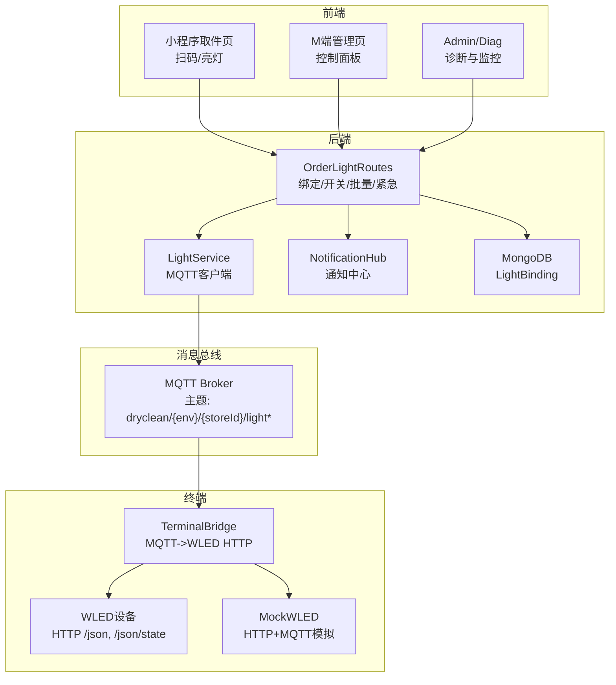
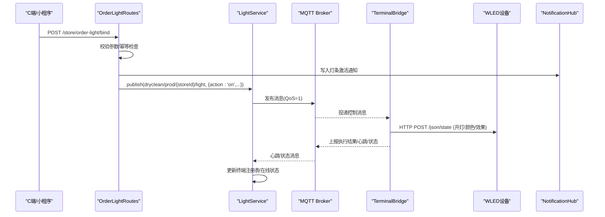
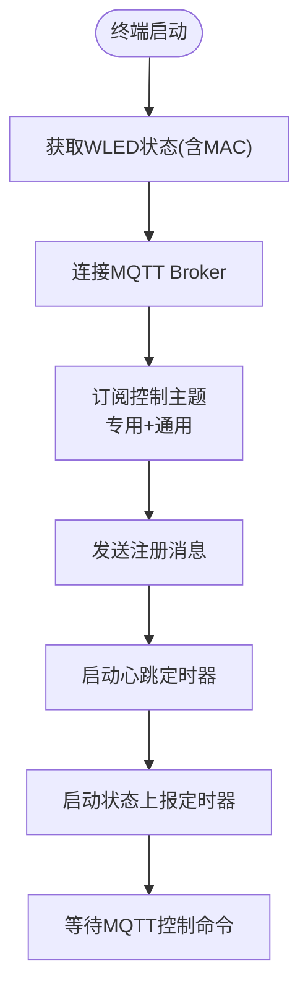
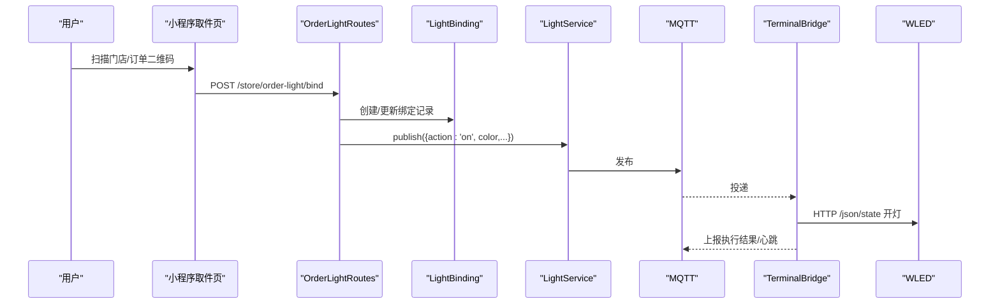
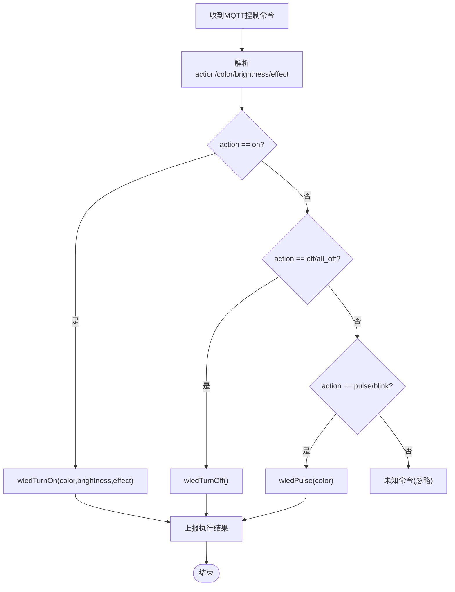
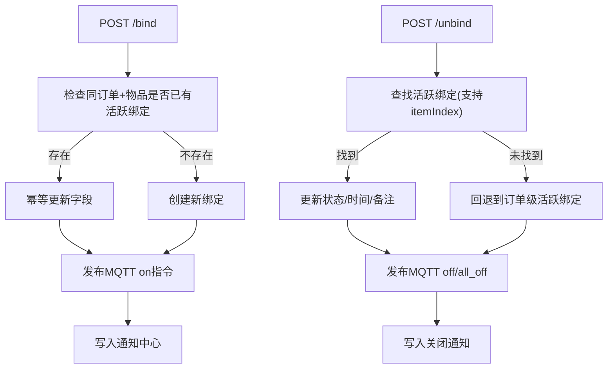
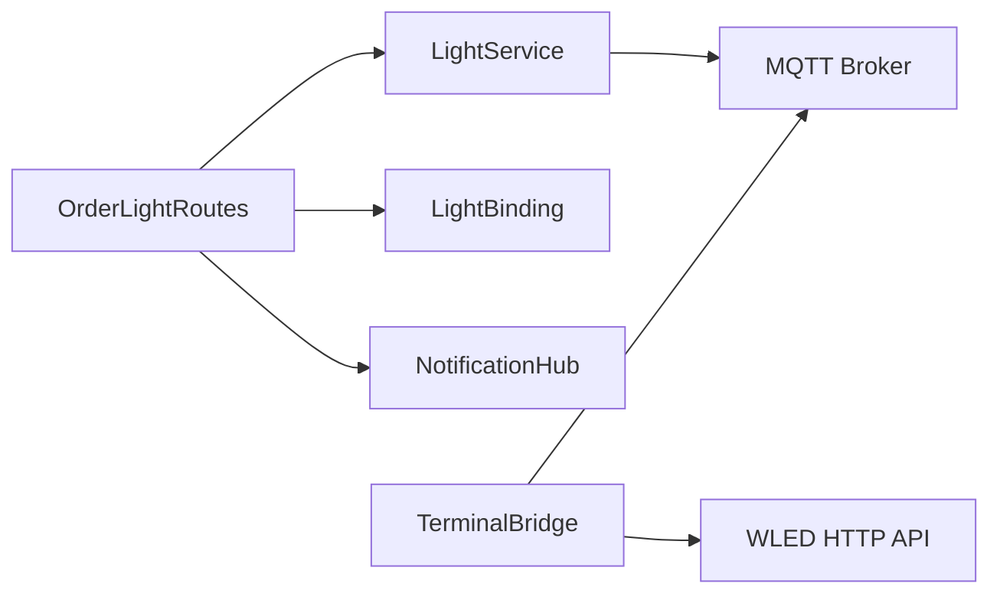
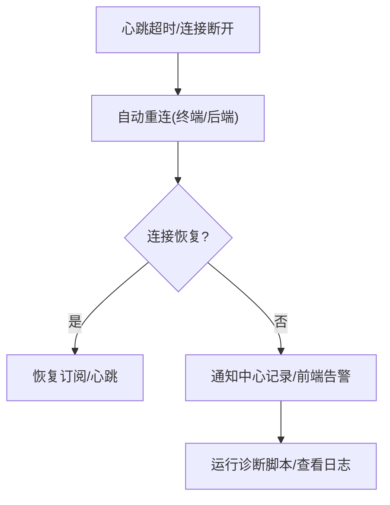
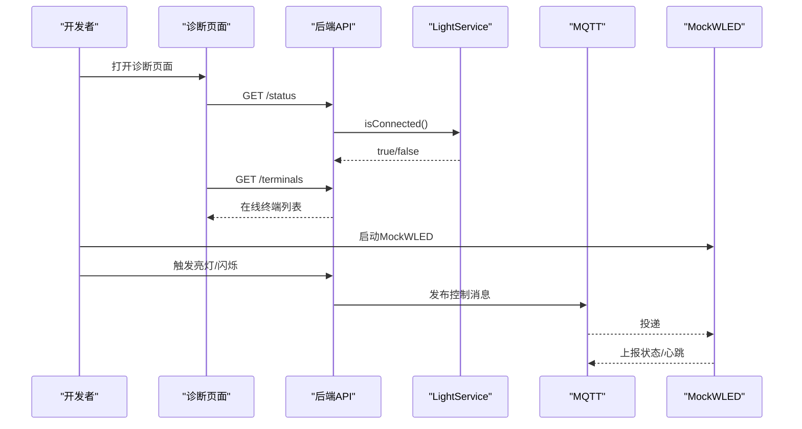

# 设备联动方案

<cite>
**本文引用的文件列表**
- [lightService.js](file://backend/services/lightService.js)
- [terminal-bridge.js](file://terminal-bridge/terminal-bridge.js)
- [LightBinding.js](file://backend/models/LightBinding.js)
- [orderLightRoutes.js](file://backend/modules/store/routes/orderLightRoutes.js)
- [notificationHubService.js](file://backend/services/notificationHubService.js)
- [mock-wled.js](file://terminal-bridge/mock-wled.js)
- [mqtt-diagnostic.js](file://backend/mqtt-diagnostic.js)
- [index.html](file://index.html)
- [m-index-offline.html](file://m-index-offline.html)
- [pickup/index.js](file://wechat-mini-app/pages/pickup/index.js)
- [production-broker.js](file://backend/production-broker.js)
</cite>

## 目录
1. [引言](#引言)
2. [项目结构](#项目结构)
3. [核心组件](#核心组件)
4. [架构总览](#架构总览)
5. [详细组件分析](#详细组件分析)
6. [依赖关系分析](#依赖关系分析)
7. [性能与可靠性](#性能与可靠性)
8. [故障处理与告警](#故障处理与告警)
9. [测试方法与调试工具](#测试方法与调试工具)
10. [结论](#结论)

## 引言
本方案面向干洗店门店场景，提供“订单取件—灯条点亮—终端执行—状态上报”的完整设备联动闭环。系统通过MQTT消息总线实现后端服务、终端桥接与物理灯条（WLED）之间的解耦通信；以订单为驱动，将取件动作映射到具体物品与灯条绑定，支持颜色控制、闪烁模式、亮度调节等指令下发；同时提供心跳检测、离线重连、通知中心与诊断工具，保障高可用与可观测性。

## 项目结构
围绕设备联动的关键代码分布在以下模块：
- 后端服务层：MQTT连接管理、终端注册与心跳维护、订单-灯条绑定API
- 终端桥接层：MQTT-WLED协议转换、命令解析与状态上报
- 数据模型层：订单-灯条绑定记录持久化
- 通知中心：统一事件收集与查询
- 前端与管理端：扫码入库、M端控制面板、诊断页面
- 模拟与诊断：Mock WLED设备、MQTT诊断脚本



图表来源
- [lightService.js:1-234](file://backend/services/lightService.js#L1-L234)
- [orderLightRoutes.js:1-696](file://backend/modules/store/routes/orderLightRoutes.js#L1-L696)
- [terminal-bridge.js:1-480](file://terminal-bridge/terminal-bridge.js#L1-L480)
- [LightBinding.js:1-124](file://backend/models/LightBinding.js#L1-L124)
- [notificationHubService.js:1-264](file://backend/services/notificationHubService.js#L1-L264)
- [mock-wled.js:1-312](file://terminal-bridge/mock-wled.js#L1-L312)
- [index.html:3604-3654](file://index.html#L3604-L3654)
- [m-index-offline.html:527-1056](file://m-index-offline.html#L527-L1056)

章节来源
- [lightService.js:1-234](file://backend/services/lightService.js#L1-L234)
- [orderLightRoutes.js:1-696](file://backend/modules/store/routes/orderLightRoutes.js#L1-L696)
- [terminal-bridge.js:1-480](file://terminal-bridge/terminal-bridge.js#L1-L480)
- [LightBinding.js:1-124](file://backend/models/LightBinding.js#L1-L124)
- [notificationHubService.js:1-264](file://backend/services/notificationHubService.js#L1-L264)
- [mock-wled.js:1-312](file://terminal-bridge/mock-wled.js#L1-L312)
- [index.html:3604-3654](file://index.html#L3604-L3654)
- [m-index-offline.html:527-1056](file://m-index-offline.html#L527-L1056)

## 核心组件
- LightService：封装MQTT连接、订阅、发布、终端注册与心跳维护、在线状态统计与健康检查。
- TerminalBridge：终端侧桥接服务，订阅MQTT控制主题，调用WLED HTTP API执行开/关/闪烁/亮度等指令，并定时上报心跳与状态。
- OrderLightRoutes：订单-灯条绑定的REST接口，负责创建/关闭绑定、批量操作、紧急闪烁、通知写入与MQTT指令下发。
- LightBinding：MongoDB模型，记录订单与灯条的绑定关系、状态、颜色、时间戳等。
- NotificationHub：内存通知中心，聚合订单与灯条事件，供管理端轮询或展示。
- MockWLED：用于本地联调的HTTP+MQTT模拟设备，复现WLED行为。
- 诊断工具：MQTT连通性诊断脚本与前端诊断页面，辅助定位问题。

章节来源
- [lightService.js:1-234](file://backend/services/lightService.js#L1-L234)
- [terminal-bridge.js:1-480](file://terminal-bridge/terminal-bridge.js#L1-L480)
- [orderLightRoutes.js:1-696](file://backend/modules/store/routes/orderLightRoutes.js#L1-L696)
- [LightBinding.js:1-124](file://backend/models/LightBinding.js#L1-L124)
- [notificationHubService.js:1-264](file://backend/services/notificationHubService.js#L1-L264)
- [mock-wled.js:1-312](file://terminal-bridge/mock-wled.js#L1-L312)
- [mqtt-diagnostic.js:1-104](file://backend/mqtt-diagnostic.js#L1-L104)

## 架构总览
系统采用“后端服务 + MQTT + 终端桥接 + 物理设备”的分层架构。后端通过LightService统一管理MQTT连接与终端状态；业务路由OrderLightRoutes在订单取件时创建绑定并下发MQTT指令；终端桥接TerminalBridge将MQTT命令转换为WLED HTTP请求，完成实际灯光控制，并回传心跳与状态；NotificationHub集中记录事件，便于管理与排障。



图表来源
- [orderLightRoutes.js:28-136](file://backend/modules/store/routes/orderLightRoutes.js#L28-L136)
- [lightService.js:197-205](file://backend/services/lightService.js#L197-L205)
- [terminal-bridge.js:260-337](file://terminal-bridge/terminal-bridge.js#L260-L337)
- [notificationHubService.js:133-155](file://backend/services/notificationHubService.js#L133-L155)

## 详细组件分析

### 智能灯条控制系统设计与实现
- 灯条注册机制
  - 终端启动后向MQTT发送注册消息，包含终端ID、门店ID、WLED MAC、能力集等。
  - 后端接收注册消息后，初始化门店级终端注册表，按门店维度维护灯条集合与最后更新时间。
- 心跳检测与状态监控
  - 终端周期性上报心跳，携带lightId与状态；后端根据心跳时间戳判断在线/离线。
  - 后端提供获取所有终端与指定门店灯条状态的接口，内部会清理超时条目。
- 终端状态存储
  - 使用内存Map按门店组织灯条信息，键为storeId，值为{lights: Map, lastUpdate}。
  - 心跳超时阈值固定，超过阈值的灯条将被清理。

```mermaid
classDiagram
class LightService {
+connect() Promise
+setupSubscriptions() void
+handleMessage(topic, message) void
+handleTerminalHeartbeat(topic, msg) void
+getTerminals() Array
+getStoreLights(storeId) Array
+subscribe(topic, callback) void
+publish(topic, message) void
+isConnected() bool
+ensureConnected() void
}
class TerminalRegistry {
+Map storeId -> { lights : Map, lastUpdate }
+HEARTBEAT_TIMEOUT number
}
LightService --> TerminalRegistry : "维护"
```

图表来源
- [lightService.js:24-234](file://backend/services/lightService.js#L24-L234)

章节来源
- [lightService.js:78-140](file://backend/services/lightService.js#L78-L140)
- [lightService.js:142-187](file://backend/services/lightService.js#L142-L187)
- [lightService.js:225-231](file://backend/services/lightService.js#L225-L231)

### 终端设备接入流程（发现、认证、通道建立）
- 设备发现
  - 终端通过命令行参数或环境变量配置门店ID与WLED IP，启动后自动获取WLED初始状态并提取MAC。
- 身份认证
  - 终端连接MQTT时可配置用户名密码（可选），Broker侧进行鉴权。
- 消息通道建立
  - 终端订阅门店专属与通用控制主题，发送注册消息，随后进入心跳与状态上报循环。
  - 后端订阅终端心跳与状态主题，维护终端注册表。



图表来源
- [terminal-bridge.js:409-459](file://terminal-bridge/terminal-bridge.js#L409-L459)
- [terminal-bridge.js:192-257](file://terminal-bridge/terminal-bridge.js#L192-L257)
- [terminal-bridge.js:339-371](file://terminal-bridge/terminal-bridge.js#L339-L371)

章节来源
- [terminal-bridge.js:192-257](file://terminal-bridge/terminal-bridge.js#L192-L257)
- [terminal-bridge.js:339-371](file://terminal-bridge/terminal-bridge.js#L339-L371)
- [terminal-bridge.js:409-459](file://terminal-bridge/terminal-bridge.js#L409-L459)

### 扫码入库功能实现原理
- 二维码解析
  - 小程序扫码进入时，从query或scene中解析订单ID、门店ID、金额等参数，设置全局上下文。
- 设备触发
  - 用户选择待取物品后，调用后端绑定接口，传入orderId、storeId、itemIndex、颜色、类型等信息。
- 订单关联逻辑
  - 后端创建或更新LightBinding记录，确保同一订单+物品索引的幂等性；同时写入通知中心并下发MQTT指令点亮对应灯条。



图表来源
- [pickup/index.js:210-246](file://wechat-mini-app/pages/pickup/index.js#L210-L246)
- [orderLightRoutes.js:28-136](file://backend/modules/store/routes/orderLightRoutes.js#L28-L136)
- [LightBinding.js:1-124](file://backend/models/LightBinding.js#L1-L124)

章节来源
- [pickup/index.js:210-246](file://wechat-mini-app/pages/pickup/index.js#L210-L246)
- [orderLightRoutes.js:28-136](file://backend/modules/store/routes/orderLightRoutes.js#L28-L136)
- [LightBinding.js:1-124](file://backend/models/LightBinding.js#L1-L124)

### 设备指令下发机制（颜色、闪烁、亮度）
- 颜色控制
  - 支持颜色名称到Hex的映射，终端将Hex转为RGB数组后下发至WLED。
- 闪烁模式
  - 支持pulse/blink动作，终端调用WLED呼吸或闪烁效果。
- 亮度调节
  - 支持bri字段设置亮度，终端在开灯时应用亮度值。
- 全关与单灯关
  - 支持all_off与off动作，按lightIds精确控制或全部关闭。



图表来源
- [terminal-bridge.js:260-337](file://terminal-bridge/terminal-bridge.js#L260-L337)
- [terminal-bridge.js:156-187](file://terminal-bridge/terminal-bridge.js#L156-L187)
- [terminal-bridge.js:112-153](file://terminal-bridge/terminal-bridge.js#L112-L153)

章节来源
- [terminal-bridge.js:260-337](file://terminal-bridge/terminal-bridge.js#L260-L337)
- [terminal-bridge.js:156-187](file://terminal-bridge/terminal-bridge.js#L156-L187)
- [terminal-bridge.js:112-153](file://terminal-bridge/terminal-bridge.js#L112-L153)

### 订单-灯条绑定与生命周期
- 绑定创建
  - 支持按订单+物品索引精确定位，避免重复绑定；若已存在则幂等更新。
- 绑定关闭
  - 支持按订单+物品索引关闭，未命中时回退到订单级活跃绑定；更新状态并写入通知中心。
- 批量与紧急
  - 批量点亮多个订单，间隔下发避免瞬时压力；紧急闪烁先点亮再定时关闭。
- 清空门店
  - 一键关闭门店所有活跃绑定，并广播全关指令。



图表来源
- [orderLightRoutes.js:28-136](file://backend/modules/store/routes/orderLightRoutes.js#L28-L136)
- [orderLightRoutes.js:142-262](file://backend/modules/store/routes/orderLightRoutes.js#L142-L262)
- [orderLightRoutes.js:364-443](file://backend/modules/store/routes/orderLightRoutes.js#L364-L443)
- [orderLightRoutes.js:449-509](file://backend/modules/store/routes/orderLightRoutes.js#L449-L509)
- [orderLightRoutes.js:515-560](file://backend/modules/store/routes/orderLightRoutes.js#L515-L560)

章节来源
- [orderLightRoutes.js:28-136](file://backend/modules/store/routes/orderLightRoutes.js#L28-L136)
- [orderLightRoutes.js:142-262](file://backend/modules/store/routes/orderLightRoutes.js#L142-L262)
- [orderLightRoutes.js:364-443](file://backend/modules/store/routes/orderLightRoutes.js#L364-L443)
- [orderLightRoutes.js:449-509](file://backend/modules/store/routes/orderLightRoutes.js#L449-L509)
- [orderLightRoutes.js:515-560](file://backend/modules/store/routes/orderLightRoutes.js#L515-L560)

### 通知中心与M端交互
- 事件聚合
  - 订单事件与灯条事件统一写入通知中心，支持按门店或全局查询。
- 缓存与过期
  - 通知中心有最大数量限制与TTL清理策略，避免内存无限增长。
- M端轮询
  - M端通过REST接口轮询待处理灯条通知，支持标记已读与按订单清除。

章节来源
- [notificationHubService.js:1-264](file://backend/services/notificationHubService.js#L1-L264)
- [orderLightRoutes.js:565-693](file://backend/modules/store/routes/orderLightRoutes.js#L565-L693)

## 依赖关系分析
- 后端服务依赖
  - LightService依赖MQTT库与进程环境变量（Broker地址、端口、Keepalive、重连周期等）。
  - OrderLightRoutes依赖LightBinding模型、LightService与NotificationHub。
- 终端桥接依赖
  - TerminalBridge依赖MQTT库与Node http模块，调用WLED HTTP API。
- 主题命名约定
  - 主题前缀为dryclean，环境与环境变量相关，门店ID作为路径段，如dryclean/prod/{storeId}/light。
- 外部集成点
  - WLED设备HTTP API：/json（状态）、/json/state（控制）。
  - MQTT Broker：TCP或WebSocket连接，支持QoS=1。



图表来源
- [orderLightRoutes.js:1-20](file://backend/modules/store/routes/orderLightRoutes.js#L1-L20)
- [lightService.js:1-20](file://backend/services/lightService.js#L1-L20)
- [terminal-bridge.js:1-40](file://terminal-bridge/terminal-bridge.js#L1-L40)

章节来源
- [orderLightRoutes.js:1-20](file://backend/modules/store/routes/orderLightRoutes.js#L1-L20)
- [lightService.js:1-20](file://backend/services/lightService.js#L1-L20)
- [terminal-bridge.js:1-40](file://terminal-bridge/terminal-bridge.js#L1-L40)

## 性能与可靠性
- 连接健康检查
  - 后端每30秒检查MQTT连接，若断开则尝试重建连接，保证Broker后启动也能恢复。
- 心跳与超时
  - 终端心跳间隔与后端超时阈值配合，及时剔除离线灯条，保持终端列表准确。
- QoS与幂等
  - 控制消息使用QoS=1，确保至少一次投递；绑定接口对同一订单+物品索引做幂等处理。
- 批量与限流
  - 批量点亮顺序下发，间隔500ms，避免瞬时压力过大。
- 资源清理
  - 通知中心与灯条绑定缓存均具备TTL与上限清理策略，防止内存泄漏。

章节来源
- [lightService.js:225-231](file://backend/services/lightService.js#L225-L231)
- [lightService.js:142-187](file://backend/services/lightService.js#L142-L187)
- [orderLightRoutes.js:364-443](file://backend/modules/store/routes/orderLightRoutes.js#L364-L443)
- [notificationHubService.js:14-30](file://backend/services/notificationHubService.js#L14-L30)

## 故障处理与告警
- 离线检测
  - 基于心跳时间戳判定灯条在线/离线；后端定期清理超时条目。
- 自动重连
  - 后端与终端均实现MQTT自动重连；后端额外提供ensureConnected定时任务。
- 告警通知
  - 灯条激活/关闭事件写入通知中心，管理端可实时查看；诊断页面显示在线终端数量与MQTT连接状态。
- 诊断工具
  - 提供MQTT诊断脚本，快速验证Broker连通性与权限；前端诊断页面导出诊断报告。



图表来源
- [lightService.js:211-222](file://backend/services/lightService.js#L211-L222)
- [terminal-bridge.js:249-256](file://terminal-bridge/terminal-bridge.js#L249-L256)
- [index.html:3630-3654](file://index.html#L3630-L3654)
- [mqtt-diagnostic.js:1-104](file://backend/mqtt-diagnostic.js#L1-L104)

章节来源
- [lightService.js:211-222](file://backend/services/lightService.js#L211-L222)
- [terminal-bridge.js:249-256](file://terminal-bridge/terminal-bridge.js#L249-L256)
- [index.html:3630-3654](file://index.html#L3630-L3654)
- [mqtt-diagnostic.js:1-104](file://backend/mqtt-diagnostic.js#L1-L104)

## 测试方法与调试工具
- 端到端联调
  - 使用MockWLED模拟设备，监听MQTT主题并响应HTTP状态查询，验证整条链路。
- 控制面板
  - M端管理页提供颜色、效果、亮度调节与开/关按钮，便于现场调试。
- 诊断脚本
  - 运行MQTT诊断脚本，检查Broker连通性、订阅与发布是否正常。
- 前端诊断
  - 打开诊断页面，自动检查MQTT连接与终端在线数，支持导出诊断报告。



图表来源
- [mock-wled.js:1-312](file://terminal-bridge/mock-wled.js#L1-L312)
- [m-index-offline.html:527-1056](file://m-index-offline.html#L527-L1056)
- [index.html:3604-3654](file://index.html#L3604-L3654)
- [mqtt-diagnostic.js:1-104](file://backend/mqtt-diagnostic.js#L1-L104)

章节来源
- [mock-wled.js:1-312](file://terminal-bridge/mock-wled.js#L1-L312)
- [m-index-offline.html:527-1056](file://m-index-offline.html#L527-L1056)
- [index.html:3604-3654](file://index.html#L3604-L3654)
- [mqtt-diagnostic.js:1-104](file://backend/mqtt-diagnostic.js#L1-L104)

## 结论
本方案通过MQTT消息总线将订单取件流程与物理灯条控制解耦，实现了可靠的设备联动闭环。系统具备完善的终端注册、心跳检测、状态监控、指令下发与通知中心能力，并提供丰富的调试与诊断工具，适合IoT设备开发者与系统集成商快速接入与落地。建议在生产环境中结合Broker的高可用部署与网络隔离策略，进一步提升稳定性与安全性。