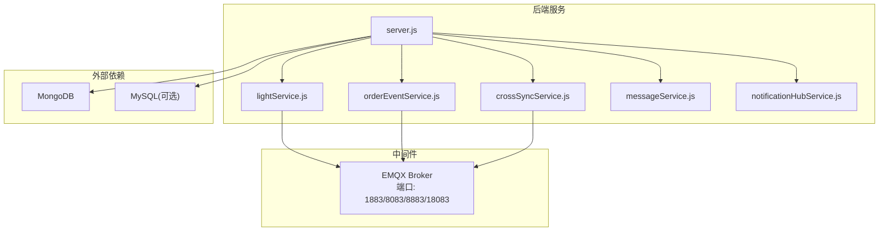
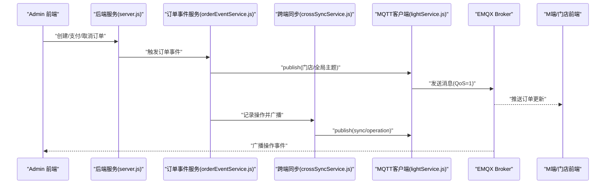
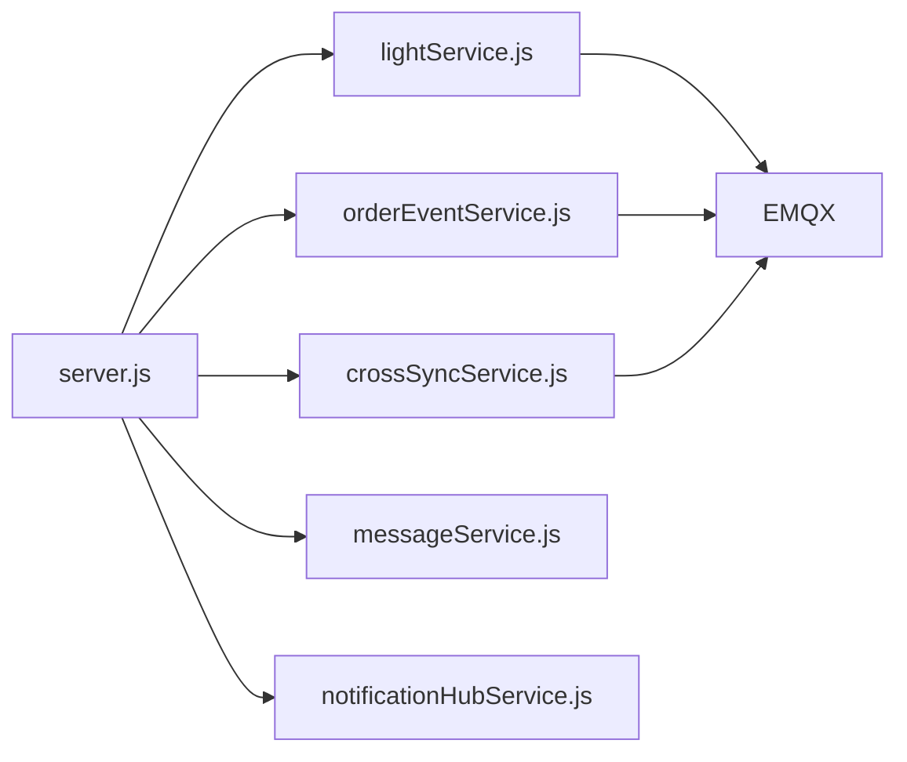

# 部署运维指南

<cite>
**本文引用的文件**   
- [backend/services/MQTT_DEPLOYMENT.md](file://backend/services/MQTT_DEPLOYMENT.md)
- [backend/EMQX_MIGRATION.md](file://backend/EMQX_MIGRATION.md)
- [backend/docker-compose.yml](file://backend/docker-compose.yml)
- [backend/server.js](file://backend/server.js)
- [backend/services/lightService.js](file://backend/services/lightService.js)
- [backend/services/orderEventService.js](file://backend/services/orderEventService.js)
- [backend/services/crossSyncService.js](file://backend/services/crossSyncService.js)
- [backend/services/messageService.js](file://backend/services/messageService.js)
- [backend/services/notificationHubService.js](file://backend/services/notificationHubService.js)
- [backend/start-mqtt.sh](file://backend/services/start-mqtt.sh)
- [backend/tcp-mqtt-test.js](file://backend/tcp-mqtt-test.js)
- [诊断工具.html](file://诊断工具.html)
</cite>

## 目录
1. [简介](#简介)
2. [项目结构](#项目结构)
3. [核心组件](#核心组件)
4. [架构总览](#架构总览)
5. [详细组件分析](#详细组件分析)
6. [依赖关系分析](#依赖关系分析)
7. [性能与容量规划](#性能与容量规划)
8. [故障排查指南](#故障排查指南)
9. [备份与恢复策略](#备份与恢复策略)
10. [扩容与升级流程](#扩容与升级流程)
11. [日常运维手册](#日常运维手册)
12. [结论](#结论)

## 简介
本指南面向运维工程师与系统管理员，提供干洗店管理系统实时通信系统的生产环境部署与运维参考。内容覆盖：
- MQTT 服务器（EMQX）的生产部署、SSL/TLS 与安全加固
- 实时监控体系搭建（连接数、消息吞吐、关键指标）
- 故障排查方法（连接问题、消息丢失、性能瓶颈）
- 备份恢复策略（配置、数据迁移、灾难恢复）
- 扩容与升级（水平扩展、版本升级、滚动更新）
- 日常运维操作（服务启停、日志查看、配置更新）

## 项目结构
本项目在 backend 目录下包含 EMQX 部署文档、Docker Compose 模板、MQTT 客户端与服务化模块；根目录提供诊断工具与脚本，便于快速验证与排障。

图表来源
- [backend/server.js:1-702](file://backend/server.js#L1-L702)
- [backend/services/lightService.js:1-234](file://backend/services/lightService.js#L1-L234)
- [backend/services/orderEventService.js:1-168](file://backend/services/orderEventService.js#L1-L168)
- [backend/services/crossSyncService.js:1-336](file://backend/services/crossSyncService.js#L1-L336)
- [backend/services/messageService.js:1-247](file://backend/services/messageService.js#L1-L247)
- [backend/services/notificationHubService.js:1-264](file://backend/services/notificationHubService.js#L1-L264)
- [backend/docker-compose.yml:1-34](file://backend/docker-compose.yml#L1-L34)

章节来源
- [backend/server.js:1-702](file://backend/server.js#L1-L702)
- [backend/docker-compose.yml:1-34](file://backend/docker-compose.yml#L1-L34)

## 核心组件
- EMQX 部署与配置：提供 Docker 与 Windows 本地部署方式、环境变量、控制台访问、安全建议与常见问题。
- 后端 MQTT 客户端：负责连接 Broker、订阅终端心跳与状态主题、发布控制指令、健康检查与自动重连。
- 订单事件服务：将业务事件通过 MQTT 广播到门店级与全局主题，并同步写入通知中心与跨端同步服务。
- 跨端同步服务：维护在线客户端、记录操作历史、广播心跳与操作事件，避免本地回显。
- 消息中心与通知中心：分别处理客户消息与系统通知，供前端轮询或 WebSocket 获取。

章节来源
- [backend/services/MQTT_DEPLOYMENT.md:1-410](file://backend/services/MQTT_DEPLOYMENT.md#L1-L410)
- [backend/services/lightService.js:1-234](file://backend/services/lightService.js#L1-L234)
- [backend/services/orderEventService.js:1-168](file://backend/services/orderEventService.js#L1-L168)
- [backend/services/crossSyncService.js:1-336](file://backend/services/crossSyncService.js#L1-L336)
- [backend/services/messageService.js:1-247](file://backend/services/messageService.js#L1-L247)
- [backend/services/notificationHubService.js:1-264](file://backend/services/notificationHubService.js#L1-L264)

## 架构总览
后端服务启动时初始化数据库与 MQTT 客户端，并通过 Express 暴露 REST API。MQTT 作为实时通道承载订单事件、跨端同步与灯条控制等消息。

图表来源
- [backend/server.js:615-697](file://backend/server.js#L615-L697)
- [backend/services/orderEventService.js:77-144](file://backend/services/orderEventService.js#L77-L144)
- [backend/services/crossSyncService.js:143-197](file://backend/services/crossSyncService.js#L143-L197)
- [backend/services/lightService.js:29-76](file://backend/services/lightService.js#L29-L76)

## 详细组件分析

### EMQX 生产部署与安全加固
- 安装与启动
  - Docker 一键启动，映射 MQTT、WebSocket、SSL、Dashboard 端口，加载管理插件。
  - Windows 本地下载解压后通过命令行启动，默认控制台地址与账号密码。
- 环境变量与连接
  - 后端通过 .env 配置 MQTT_BROKER、MQTT_WS_PORT 等参数。
- SSL/TLS 配置
  - 启用 listener.ssl.external，设置 keyfile/certfile/cafile。
- 安全加固
  - 修改默认密码、仅开放必要端口、限制管理界面访问 IP、定期导出配置备份。
- 监控与维护
  - 使用控制台查看连接数、吞吐量、订阅与日志；Docker 日志跟踪。

章节来源
- [backend/services/MQTT_DEPLOYMENT.md:32-111](file://backend/services/MQTT_DEPLOYMENT.md#L32-L111)
- [backend/services/MQTT_DEPLOYMENT.md:115-177](file://backend/services/MQTT_DEPLOYMENT.md#L115-L177)
- [backend/services/MQTT_DEPLOYMENT.md:226-379](file://backend/services/MQTT_DEPLOYMENT.md#L226-L379)
- [backend/services/start-mqtt.sh:35-80](file://backend/services/start-mqtt.sh#L35-L80)

### 实时监控体系搭建
- 连接数监控
  - EMQX 控制台提供实时连接数；后端可通过跨端同步服务的在线客户端列表进行补充观测。
- 消息吞吐量统计
  - EMQX 控制台展示各主题的消息速率；后端可结合日志与错误计数评估吞吐与失败率。
- 性能指标收集
  - 后端健康检查接口 /api/health；跨端同步状态接口 /api/sync/status；EMQX 健康检查接口 /api/v4/health/check。
- 可视化与告警
  - 基于控制台与后端接口聚合指标，接入监控系统（如 Prometheus/Grafana）实现阈值告警。

章节来源
- [backend/services/MQTT_DEPLOYMENT.md:319-340](file://backend/services/MQTT_DEPLOYMENT.md#L319-L340)
- [backend/server.js:88-90](file://backend/server.js#L88-L90)
- [backend/services/crossSyncService.js:290-305](file://backend/services/crossSyncService.js#L290-L305)
- [诊断工具.html:496-514](file://诊断工具.html#L496-L514)

### 故障排查方法
- 连接问题诊断
  - TCP 直连测试脚本用于判断 Broker 是否响应；检查防火墙与端口映射；确认用户名密码与环境变量。
- 消息丢失检测
  - 检查 QoS 设置（后端 publish 使用 QoS=1），核对订阅主题与过滤条件；观察 EMQX 控制台丢弃与重试计数。
- 性能瓶颈分析
  - 关注 CPU/内存/磁盘 IO；调整 EMQX 资源与内核参数；减少高频心跳或批量上报；优化网络带宽与延迟。

章节来源
- [backend/tcp-mqtt-test.js:41-60](file://backend/tcp-mqtt-test.js#L41-L60)
- [backend/services/lightService.js:197-205](file://backend/services/lightService.js#L197-L205)
- [backend/services/MQTT_DEPLOYMENT.md:342-350](file://backend/services/MQTT_DEPLOYMENT.md#L342-L350)

### 备份恢复策略
- 配置备份
  - 使用 EMQX 命令导出配置文件至宿主机目录，纳入版本管理与异地备份。
- 数据迁移
  - MongoDB 数据卷持久化；迁移时停止服务、拷贝数据卷、校验一致性后重启。
- 灾难恢复
  - 先恢复数据库与配置，再启动 EMQX，最后启动后端服务；通过健康检查与诊断工具验证链路。

章节来源
- [backend/services/MQTT_DEPLOYMENT.md:374-378](file://backend/services/MQTT_DEPLOYMENT.md#L374-L378)
- [backend/docker-compose.yml:1-34](file://backend/docker-compose.yml#L1-L34)

### 扩容与升级流程
- 水平扩展
  - 多实例后端服务共享同一 EMQX；通过负载均衡分发 HTTP 请求；确保会话无状态或采用外部存储。
- 版本升级
  - 拉取新镜像、替换容器、保留数据卷；逐步灰度切换流量，观察错误率与延迟。
- 滚动更新
  - 分批重启后端实例；每次只更新一个节点，等待健康检查通过后继续下一批。

章节来源
- [backend/docker-compose.yml:1-34](file://backend/docker-compose.yml#L1-L34)
- [backend/services/MQTT_DEPLOYMENT.md:238-315](file://backend/services/MQTT_DEPLOYMENT.md#L238-L315)

### 日常运维手册
- 服务启停
  - 使用脚本一键启动 EMQX；Docker Compose 管理多服务；PM2 管理 Node 进程（项目内提供相关脚本）。
- 日志查看
  - Docker logs 跟踪 EMQX；后端服务输出连接与事件日志；诊断工具页面辅助定位。
- 配置更新
  - 更新 .env 或 docker-compose.yml 后重启对应服务；EMQX 配置变更后需重载或重启容器。

章节来源
- [backend/services/start-mqtt.sh:35-80](file://backend/services/start-mqtt.sh#L35-L80)
- [backend/services/MQTT_DEPLOYMENT.md:332-340](file://backend/services/MQTT_DEPLOYMENT.md#L332-L340)
- [诊断工具.html:496-514](file://诊断工具.html#L496-L514)

## 依赖关系分析
- 后端服务依赖：
  - Express 路由与中间件
  - 数据库（MongoDB/MySQL）
  - MQTT 客户端库（mqtt）
- 运行时依赖：
  - EMQX Broker（端口 1883/8083/8883/18083）
  - 环境变量（MQTT_BROKER、MQTT_WS_PORT 等）

图表来源
- [backend/server.js:1-702](file://backend/server.js#L1-L702)
- [backend/services/lightService.js:1-234](file://backend/services/lightService.js#L1-L234)
- [backend/services/orderEventService.js:1-168](file://backend/services/orderEventService.js#L1-L168)
- [backend/services/crossSyncService.js:1-336](file://backend/services/crossSyncService.js#L1-L336)

章节来源
- [backend/server.js:1-702](file://backend/server.js#L1-L702)
- [backend/services/lightService.js:1-234](file://backend/services/lightService.js#L1-L234)
- [backend/services/orderEventService.js:1-168](file://backend/services/orderEventService.js#L1-L168)
- [backend/services/crossSyncService.js:1-336](file://backend/services/crossSyncService.js#L1-L336)

## 性能与容量规划
- 硬件与资源
  - 推荐 CPU 4+ 核、内存 8GB+、SSD 50GB+、公网 IP 与域名；根据并发连接与消息量调优。
- 网络与端口
  - 仅开放必要端口（1883/8083/8883/18083），管理界面限制 IP 访问。
- 队列与吞吐
  - 合理设置 QoS；对高频心跳进行节流或合并；避免大消息体频繁传输。
- 监控与告警
  - 基于 EMQX 控制台与后端接口采集指标，设定连接数、错误率、延迟阈值告警。

章节来源
- [backend/services/MQTT_DEPLOYMENT.md:226-379](file://backend/services/MQTT_DEPLOYMENT.md#L226-L379)

## 故障排查指南
- 连接被拒绝
  - 检查防火墙与端口映射；确认用户名密码与环境变量一致。
- 认证失败
  - 登录 EMQX 控制台检查认证规则；确认客户端 clientId 唯一性。
- 消息丢失
  - 提升 QoS 至 1 或 2；检查订阅主题匹配；查看 EMQX 丢弃计数与重试日志。
- 性能问题
  - 增加服务器资源；调整 EMQX 配置；优化客户端心跳频率与消息体积。

章节来源
- [backend/services/MQTT_DEPLOYMENT.md:342-350](file://backend/services/MQTT_DEPLOYMENT.md#L342-L350)
- [backend/tcp-mqtt-test.js:41-60](file://backend/tcp-mqtt-test.js#L41-L60)

## 备份与恢复策略
- 配置备份
  - 定期导出 EMQX 配置到宿主机目录，纳入版本控制与异地备份。
- 数据迁移
  - 停止服务，拷贝 MongoDB 数据卷，校验一致性后重启；必要时执行数据校验脚本。
- 灾难恢复
  - 按顺序恢复数据库、EMQX、后端服务；通过健康检查与诊断工具验证端到端连通性。

章节来源
- [backend/services/MQTT_DEPLOYMENT.md:374-378](file://backend/services/MQTT_DEPLOYMENT.md#L374-L378)
- [backend/docker-compose.yml:1-34](file://backend/docker-compose.yml#L1-L34)

## 扩容与升级流程
- 水平扩展
  - 多实例后端共享 EMQX；通过负载均衡分发请求；保持会话无状态或使用外部存储。
- 版本升级
  - 拉取新镜像、替换容器、保留数据卷；灰度切换流量，观察错误率与延迟。
- 滚动更新
  - 分批重启后端实例，每批等待健康检查通过后继续下一批。

章节来源
- [backend/docker-compose.yml:1-34](file://backend/docker-compose.yml#L1-L34)
- [backend/services/MQTT_DEPLOYMENT.md:238-315](file://backend/services/MQTT_DEPLOYMENT.md#L238-L315)

## 日常运维手册
- 服务启停
  - 使用脚本一键启动 EMQX；Docker Compose 管理多服务；PM2 管理 Node 进程。
- 日志查看
  - Docker logs 跟踪 EMQX；后端服务输出连接与事件日志；诊断工具页面辅助定位。
- 配置更新
  - 更新 .env 或 docker-compose.yml 后重启对应服务；EMQX 配置变更后需重载或重启容器。

章节来源
- [backend/services/start-mqtt.sh:35-80](file://backend/services/start-mqtt.sh#L35-L80)
- [backend/services/MQTT_DEPLOYMENT.md:332-340](file://backend/services/MQTT_DEPLOYMENT.md#L332-L340)
- [诊断工具.html:496-514](file://诊断工具.html#L496-L514)

## 结论
通过规范的 EMQX 生产部署、完善的监控与告警、严格的故障排查与备份恢复流程，以及稳健的扩容与升级策略，可保障干洗店管理系统实时通信的高可用与高性能。建议在生产环境中持续优化资源配置与消息模型，并结合监控平台实现自动化运维。