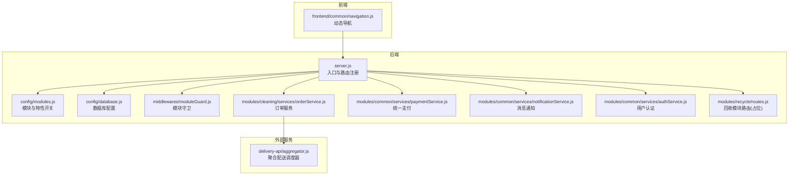
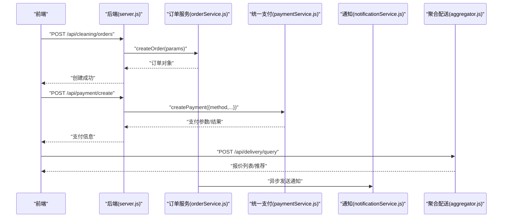
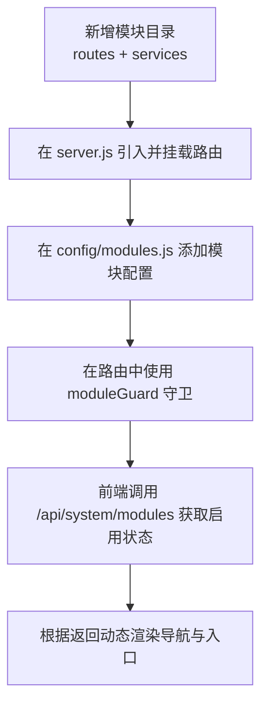
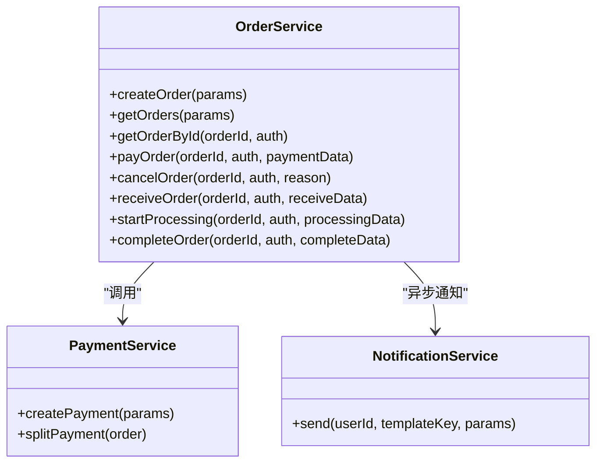
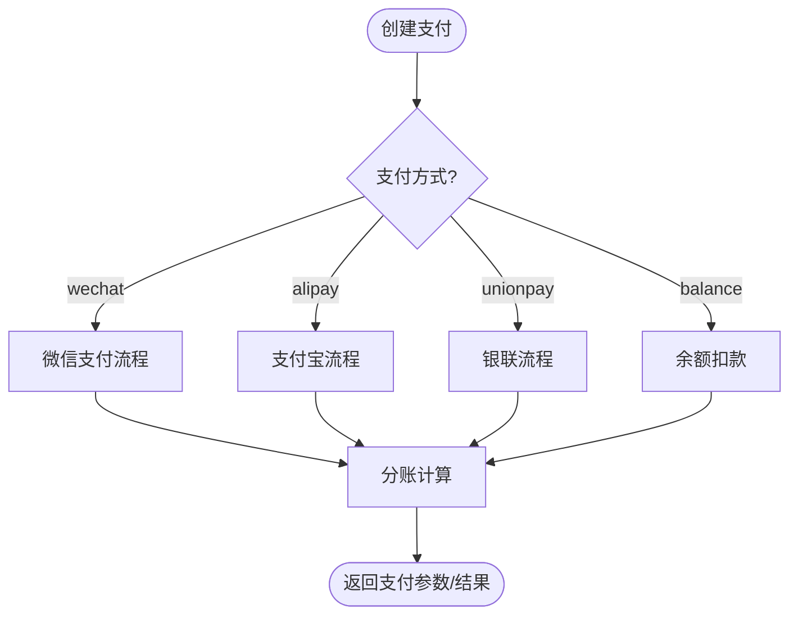
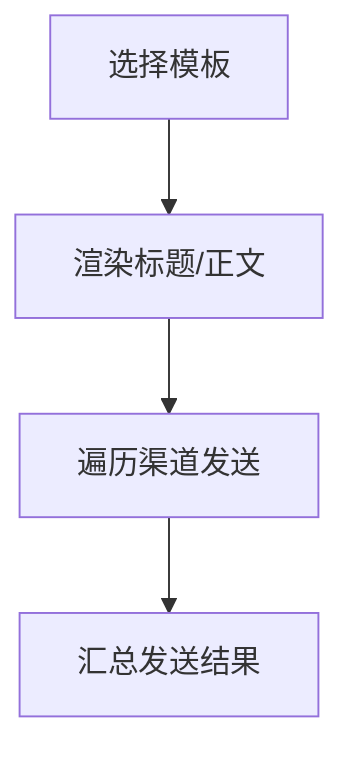
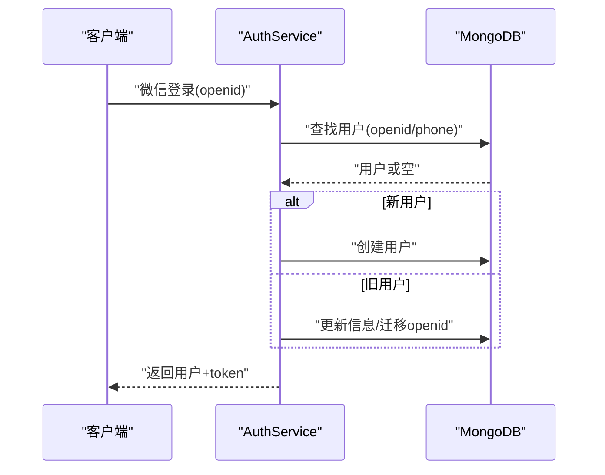
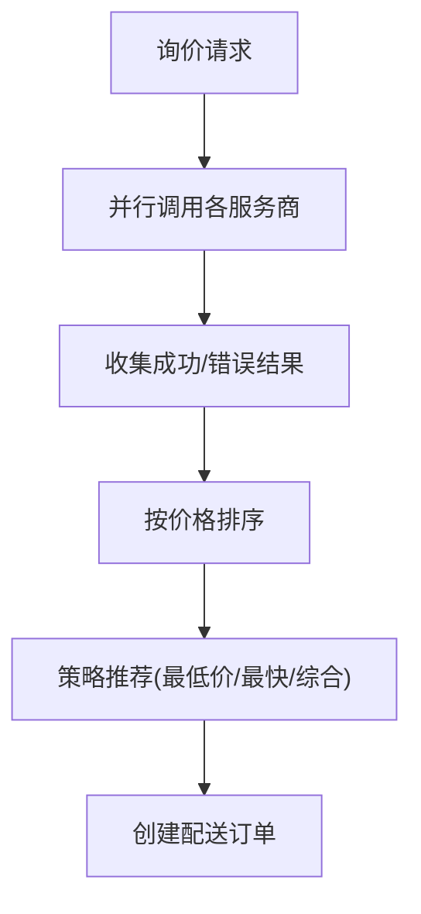
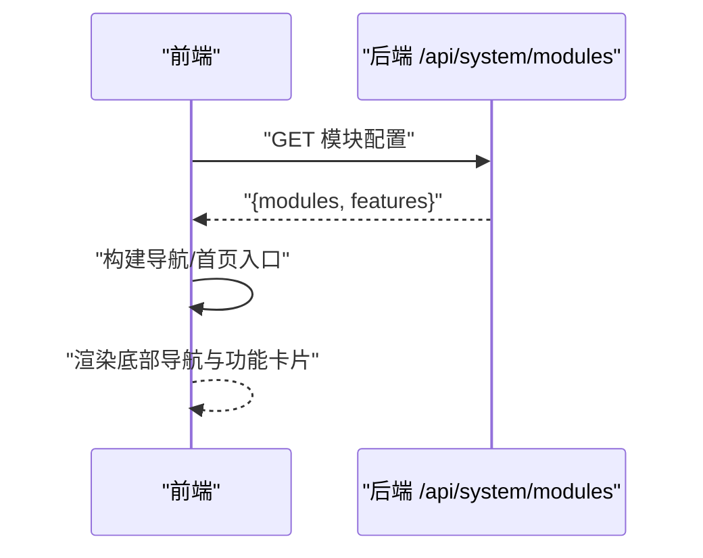
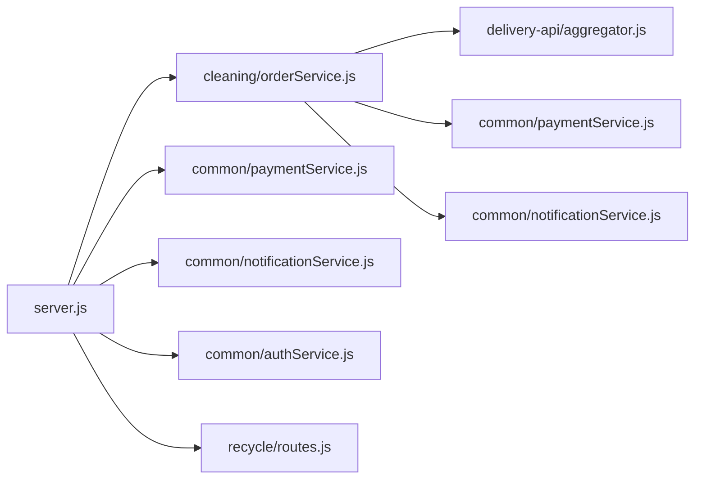

# 开发指南

<cite>
**本文引用的文件**
- [backend/server.js](file://backend/server.js)
- [backend/config/modules.js](file://backend/config/modules.js)
- [backend/config/database.js](file://backend/config/database.js)
- [backend/README.md](file://backend/README.md)
- [backend/QUICKSTART.md](file://backend/QUICKSTART.md)
- [backend/modules/common/middlewares/moduleGuard.js](file://backend/modules/common/middlewares/moduleGuard.js)
- [backend/modules/cleaning/services/orderService.js](file://backend/modules/cleaning/services/orderService.js)
- [backend/modules/common/services/paymentService.js](file://backend/modules/common/services/paymentService.js)
- [backend/modules/common/services/notificationService.js](file://backend/modules/common/services/notificationService.js)
- [backend/modules/common/services/authService.js](file://backend/modules/common/services/authService.js)
- [backend/modules/recycle/routes.js](file://backend/modules/recycle/routes.js)
- [api/API_DOCUMENTATION.md](file://api/API_DOCUMENTATION.md)
- [api/payment-api.js](file://api/payment-api.js)
- [delivery-api/aggregator.js](file://delivery-api/aggregator.js)
- [frontend/common/navigation.js](file://frontend/common/navigation.js)
</cite>

## 目录
1. [引言](#引言)
2. [项目结构](#项目结构)
3. [核心组件](#核心组件)
4. [架构总览](#架构总览)
5. [详细组件分析](#详细组件分析)
6. [依赖分析](#依赖分析)
7. [性能考虑](#性能考虑)
8. [故障排查指南](#故障排查指南)
9. [结论](#结论)
10. [附录](#附录)

## 引言
本指南面向干洗店管理系统的开发与维护团队，覆盖新功能开发流程、模块化开发模式、第三方服务集成、代码重构与版本管理策略、工具链配置、团队协作规范以及新成员快速上手路径。文档基于仓库现有实现进行系统化梳理，确保读者既能理解整体架构，也能按步骤落地具体功能。

## 项目结构
系统采用“后端 Express + 多模块路由 + 统一配置”的渐进式架构：
- 后端入口负责加载中间件、注册路由、启动服务与健康检查
- 业务模块以 features 形式组织（如 cleaning、recycle、rental），通过配置开关控制启用状态
- 公共能力（认证、支付、通知、配送）集中在 common 层
- 前端动态导航根据后端模块配置渲染菜单与入口
- 聚合配送服务独立为 delivery-api，提供多服务商询价与下单

图表来源
- [backend/server.js:1-152](file://backend/server.js#L1-L152)
- [backend/config/modules.js:1-203](file://backend/config/modules.js#L1-L203)
- [backend/config/database.js:1-65](file://backend/config/database.js#L1-L65)
- [backend/modules/common/middlewares/moduleGuard.js:1-84](file://backend/modules/common/middlewares/moduleGuard.js#L1-L84)
- [backend/modules/cleaning/services/orderService.js:1-120](file://backend/modules/cleaning/services/orderService.js#L1-L120)
- [backend/modules/common/services/paymentService.js:1-185](file://backend/modules/common/services/paymentService.js#L1-L185)
- [backend/modules/common/services/notificationService.js:1-120](file://backend/modules/common/services/notificationService.js#L1-L120)
- [backend/modules/common/services/authService.js:1-120](file://backend/modules/common/services/authService.js#L1-L120)
- [backend/modules/recycle/routes.js:1-39](file://backend/modules/recycle/routes.js#L1-L39)
- [frontend/common/navigation.js:1-120](file://frontend/common/navigation.js#L1-L120)
- [delivery-api/aggregator.js:1-120](file://delivery-api/aggregator.js#L1-L120)

章节来源
- [backend/README.md:1-120](file://backend/README.md#L1-L120)
- [backend/QUICKSTART.md:1-120](file://backend/QUICKSTART.md#L1-L120)

## 核心组件
- 后端入口与路由注册：统一挂载各业务模块路由、系统接口、支付回调、跨端同步与消息中心
- 模块开关与特性开关：集中管理模块启用状态、分账比例、功能开关与消息模板
- 模块守卫中间件：对未启用模块返回友好提示，避免暴露未开放能力
- 订单服务：涵盖创建、查询、支付、取消、收件、处理、完成等全生命周期
- 统一支付服务：抽象微信/支付宝/银联/余额等多渠道，支持分账计算
- 消息通知服务：按业务域定义模板，支持多渠道发送
- 用户认证服务：手机号/微信登录、角色权限、跨平台身份合并
- 聚合配送调度器：并行询价、推荐策略、下单与状态查询

章节来源
- [backend/server.js:1-152](file://backend/server.js#L1-L152)
- [backend/config/modules.js:1-203](file://backend/config/modules.js#L1-L203)
- [backend/modules/common/middlewares/moduleGuard.js:1-84](file://backend/modules/common/middlewares/moduleGuard.js#L1-L84)
- [backend/modules/cleaning/services/orderService.js:1-200](file://backend/modules/cleaning/services/orderService.js#L1-L200)
- [backend/modules/common/services/paymentService.js:1-185](file://backend/modules/common/services/paymentService.js#L1-L185)
- [backend/modules/common/services/notificationService.js:1-120](file://backend/modules/common/services/notificationService.js#L1-L120)
- [backend/modules/common/services/authService.js:1-120](file://backend/modules/common/services/authService.js#L1-L120)
- [delivery-api/aggregator.js:1-120](file://delivery-api/aggregator.js#L1-L120)

## 架构总览
系统遵循“模块化隔离 + 配置驱动 + 事件驱动”的设计原则：
- 配置驱动：通过 modules.js 控制模块与特性开关，前端据此动态渲染
- 模块化隔离：各业务模块独立路由与服务，便于灰度与回滚
- 事件驱动：订单关键节点发布事件，供实时同步与通知使用

图表来源
- [backend/server.js:100-152](file://backend/server.js#L100-L152)
- [backend/modules/cleaning/services/orderService.js:180-291](file://backend/modules/cleaning/services/orderService.js#L180-L291)
- [backend/modules/common/services/paymentService.js:24-47](file://backend/modules/common/services/paymentService.js#L24-L47)
- [backend/modules/common/services/notificationService.js:188-211](file://backend/modules/common/services/notificationService.js#L188-L211)
- [delivery-api/aggregator.js:54-95](file://delivery-api/aggregator.js#L54-L95)

## 详细组件分析

### 模块化开发模式
- 模块创建
  - 在 backend/modules 下新建业务目录，包含 routes 与 services
  - 在 server.js 中引入并挂载路由前缀
  - 在 config/modules.js 中声明模块元信息与 enabled 开关
- 模块注册与配置
  - 使用 moduleGuard 中间件保护路由，未启用时返回友好提示
  - 通过 getEnabledModules/getModuleConfig 对外暴露模块状态
- 示例参考
  - 回收模块占位路由与守卫用法
  - 干洗模块完整实现（订单服务）

图表来源
- [backend/server.js:96-152](file://backend/server.js#L96-L152)
- [backend/config/modules.js:11-97](file://backend/config/modules.js#L11-L97)
- [backend/modules/common/middlewares/moduleGuard.js:13-42](file://backend/modules/common/middlewares/moduleGuard.js#L13-L42)
- [backend/modules/recycle/routes.js:1-39](file://backend/modules/recycle/routes.js#L1-L39)
- [frontend/common/navigation.js:16-39](file://frontend/common/navigation.js#L16-L39)

章节来源
- [backend/modules/recycle/routes.js:1-39](file://backend/modules/recycle/routes.js#L1-L39)
- [backend/modules/common/middlewares/moduleGuard.js:1-84](file://backend/modules/common/middlewares/moduleGuard.js#L1-L84)
- [backend/config/modules.js:1-203](file://backend/config/modules.js#L1-L203)
- [frontend/common/navigation.js:1-120](file://frontend/common/navigation.js#L1-L120)

### 订单服务（清洗业务）
- 数据模型：订单、门店、用户物品等 Schema 定义与索引
- 核心流程：创建订单 → 支付 → 收件 → 处理 → 完成 → 取件/退回
- 权限与跨平台兼容：支持 userId/openid/phone 多种标识；默认排除软删除记录
- 事件与通知：关键状态变更触发通知与事件广播

图表来源
- [backend/modules/cleaning/services/orderService.js:177-800](file://backend/modules/cleaning/services/orderService.js#L177-L800)
- [backend/modules/common/services/paymentService.js:1-185](file://backend/modules/common/services/paymentService.js#L1-L185)
- [backend/modules/common/services/notificationService.js:1-281](file://backend/modules/common/services/notificationService.js#L1-L281)

章节来源
- [backend/modules/cleaning/services/orderService.js:1-800](file://backend/modules/cleaning/services/orderService.js#L1-L800)

### 统一支付服务
- 支付方式抽象：微信/支付宝/银联/余额
- 分账策略：按订单类型计算平台/门店/品牌/所有者分配比例
- 扩展点：新增支付方式仅需在 createPayment 分支中添加实现

图表来源
- [backend/modules/common/services/paymentService.js:24-117](file://backend/modules/common/services/paymentService.js#L24-L117)

章节来源
- [backend/modules/common/services/paymentService.js:1-185](file://backend/modules/common/services/paymentService.js#L1-L185)

### 消息通知服务
- 模板体系：按业务域（cleaning/recycle/rental/system）定义标题与正文模板
- 多渠道发送：微信/短信/Push/电话，失败不影响主流程
- 变量渲染：支持 {key} 占位符替换

图表来源
- [backend/modules/common/services/notificationService.js:9-175](file://backend/modules/common/services/notificationService.js#L9-L175)
- [backend/modules/common/services/notificationService.js:188-211](file://backend/modules/common/services/notificationService.js#L188-L211)

章节来源
- [backend/modules/common/services/notificationService.js:1-281](file://backend/modules/common/services/notificationService.js#L1-L281)

### 用户认证服务
- 登录方式：手机号密码、微信登录（自动注册/合并）
- 跨平台身份合并：小程序填写手机号时自动绑定已有C端账户
- Token 生成与解析：简化版 Base64 令牌（生产建议替换为 JWT）

图表来源
- [backend/modules/common/services/authService.js:130-198](file://backend/modules/common/services/authService.js#L130-L198)
- [backend/modules/common/services/authService.js:222-310](file://backend/modules/common/services/authService.js#L222-L310)

章节来源
- [backend/modules/common/services/authService.js:1-496](file://backend/modules/common/services/authService.js#L1-L496)

### 聚合配送服务
- 多服务商接入：美团、达达、顺丰
- 并行询价：Promise.allSettled 收集结果并按策略推荐
- 下单与查询：支持指定优先服务商或自动选择最优

图表来源
- [delivery-api/aggregator.js:54-129](file://delivery-api/aggregator.js#L54-L129)
- [delivery-api/aggregator.js:137-197](file://delivery-api/aggregator.js#L137-L197)

章节来源
- [delivery-api/aggregator.js:1-237](file://delivery-api/aggregator.js#L1-L237)

### 前端动态导航
- 拉取后端模块配置，缓存 TTL 控制
- 根据 enabled 字段显示/隐藏导航项与首页入口
- 未启用模块点击给出友好提示

图表来源
- [frontend/common/navigation.js:16-39](file://frontend/common/navigation.js#L16-L39)
- [frontend/common/navigation.js:44-118](file://frontend/common/navigation.js#L44-L118)

章节来源
- [frontend/common/navigation.js:1-317](file://frontend/common/navigation.js#L1-L317)

## 依赖分析
- 模块耦合
  - server.js 作为装配层，低耦合地引入各模块路由
  - orderService 依赖 paymentService 与 notificationService，体现职责分离
  - moduleGuard 仅依赖配置，无副作用
- 外部依赖
  - 数据库：MongoDB/MySQL 通过 database.js 配置
  - 配送：delivery-api 聚合多家服务商
  - 支付：统一支付服务封装多渠道

图表来源
- [backend/server.js:96-152](file://backend/server.js#L96-L152)
- [backend/modules/cleaning/services/orderService.js:1-120](file://backend/modules/cleaning/services/orderService.js#L1-L120)
- [backend/modules/common/services/paymentService.js:1-185](file://backend/modules/common/services/paymentService.js#L1-L185)
- [backend/modules/common/services/notificationService.js:1-120](file://backend/modules/common/services/notificationService.js#L1-L120)
- [backend/modules/common/services/authService.js:1-120](file://backend/modules/common/services/authService.js#L1-L120)
- [backend/modules/recycle/routes.js:1-39](file://backend/modules/recycle/routes.js#L1-L39)
- [delivery-api/aggregator.js:1-120](file://delivery-api/aggregator.js#L1-L120)

章节来源
- [backend/server.js:1-152](file://backend/server.js#L1-L152)

## 性能考虑
- 数据库连接池与超时：MongoDB/MySQL 均配置了连接池与超时参数，避免资源耗尽
- 并发查询：配送询价使用 Promise.allSettled 并行调用，降低端到端延迟
- 分页与索引：订单与用户查询使用分页与索引优化
- 降级与兜底：会员信息、通知发送等具备模拟数据或失败不阻塞主流程的策略
- 健康检查：提供 /api/health 用于负载均衡与健康探测

[本节为通用指导，无需特定文件引用]

## 故障排查指南
- 端口占用
  - 现象：启动时报端口被占用
  - 处理：修改 .env 中的 PORT 或关闭占用进程
- 数据库连接失败
  - MongoDB：确认服务已启动、URI 正确、Atlas IP 白名单
  - MySQL：确认服务已启动、用户名密码正确、数据库存在
- 模块未启用
  - 现象：访问回收/租赁接口返回“服务暂未开放”
  - 处理：在 config/modules.js 中启用对应模块
- 支付回调未生效
  - 现象：回调日志为空或返回失败
  - 处理：检查回调路由与签名校验逻辑

章节来源
- [backend/QUICKSTART.md:120-161](file://backend/QUICKSTART.md#L120-L161)
- [backend/modules/recycle/routes.js:1-39](file://backend/modules/recycle/routes.js#L1-L39)
- [backend/server.js:498-502](file://backend/server.js#L498-L502)

## 结论
本项目以模块化与配置驱动为核心，结合统一支付、通知与聚合配送能力，形成了可扩展、可观测、易维护的干洗店管理系统。通过严格的模块守卫与前后端联动，实现了平滑的功能上线与灰度发布。建议在后续迭代中持续完善鉴权与审计、监控告警与压测体系，进一步提升稳定性与可运维性。

[本节为总结性内容，无需特定文件引用]

## 附录

### 新功能开发流程
- 需求分析
  - 明确业务边界与数据流向，评估是否复用现有模块或新增模块
- 设计评审
  - 输出接口契约（请求/响应）、数据模型变更、权限与分账策略
- 编码规范
  - 分层清晰：routes → services → models
  - 错误处理：统一返回格式，异常捕获与日志记录
  - 可配置化：敏感配置走环境变量
- 代码审查标准
  - 安全性：输入校验、越权防护、敏感信息脱敏
  - 可测试性：服务方法可单测，外部依赖可 Mock
  - 可观测性：关键路径埋点与结构化日志

[本节为通用指导，无需特定文件引用]

### 第三方服务集成指南（API 封装、错误处理、重试机制）
- API 封装
  - 统一基础地址、超时、重试次数配置
  - 按支付方式或服务商拆分模块，保持单一职责
- 错误处理
  - 区分网络错误、业务错误与第三方错误码
  - 统一错误映射与用户可读提示
- 重试机制
  - 幂等接口支持指数退避重试
  - 限流与熔断保护下游服务

章节来源
- [api/payment-api.js:1-120](file://api/payment-api.js#L1-L120)
- [api/API_DOCUMENTATION.md:1-120](file://api/API_DOCUMENTATION.md#L1-L120)

### 代码重构与版本管理策略
- 向后兼容性保证
  - 接口版本化：/v1、/v2 路由前缀
  - 字段兼容：服务端保留旧字段并做映射
- 渐进式升级方案
  - 通过模块开关逐步放开新功能
  - 灰度发布：按门店/区域/用户维度切流

章节来源
- [backend/config/modules.js:11-97](file://backend/config/modules.js#L11-L97)
- [backend/modules/common/middlewares/moduleGuard.js:13-42](file://backend/modules/common/middlewares/moduleGuard.js#L13-L42)

### 开发工具链配置
- IDE 设置
  - Node.js >= 16.x，npm >= 8.x
  - 安装 ESLint/Prettier，统一代码风格
- 调试技巧
  - 使用 nodemon 开发热重载
  - 利用 console.log 与结构化日志定位问题
- 性能分析
  - 使用 Node 内置 profiler 或 APM 工具采集慢查询与热点

章节来源
- [backend/QUICKSTART.md:1-40](file://backend/QUICKSTART.md#L1-L40)

### 团队协作规范
- Git 工作流
  - 主干保护：main 分支受保护，PR 合并需至少一人审核
  - 分支命名：feature/xxx、fix/xxx、hotfix/xxx
- 分支管理
  - 功能分支从 develop 拉取，完成后合入 develop
  - 紧急修复走 hotfix 分支，直接合入 main 并打标签
- 发布流程
  - 预发验证通过后打 tag，发布到生产环境
  - 发布说明包含变更清单与回滚方案

[本节为通用指导，无需特定文件引用]

### 新成员快速上手指南
- 环境准备
  - 安装 Node.js、MongoDB 或 MySQL
  - 复制 .env.example 为 .env 并填写数据库连接
- 本地启动
  - npm install → npm run db:init → npm start
- 验证服务
  - 访问 /api/health 与 /api/system/modules
- 贡献规范
  - 提交前运行 lint/test，编写必要注释与用例
  - PR 描述包含背景、改动点与影响范围

章节来源
- [backend/QUICKSTART.md:1-120](file://backend/QUICKSTART.md#L1-L120)
- [backend/README.md:60-120](file://backend/README.md#L60-L120)