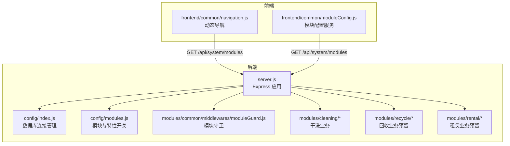
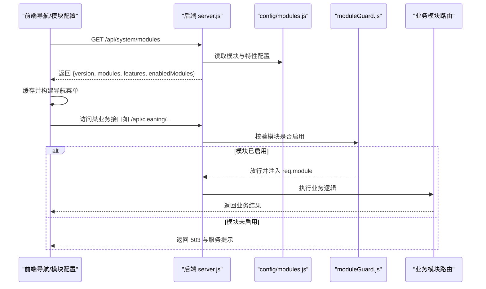
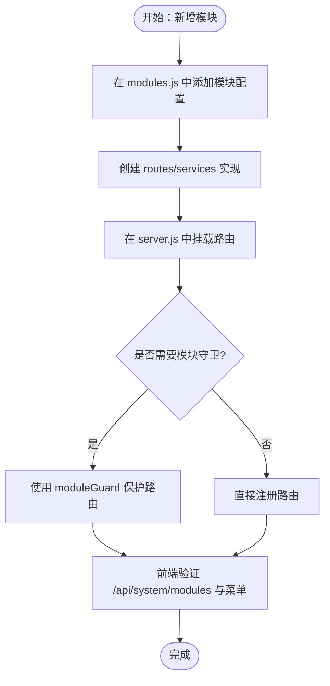
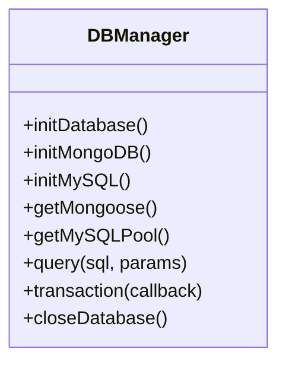
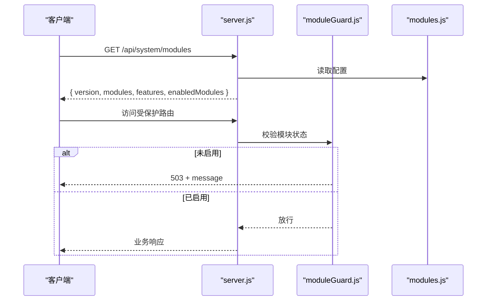
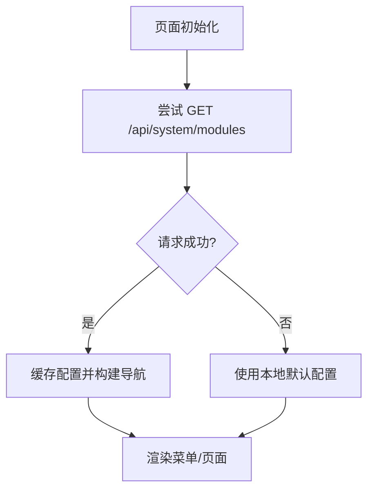
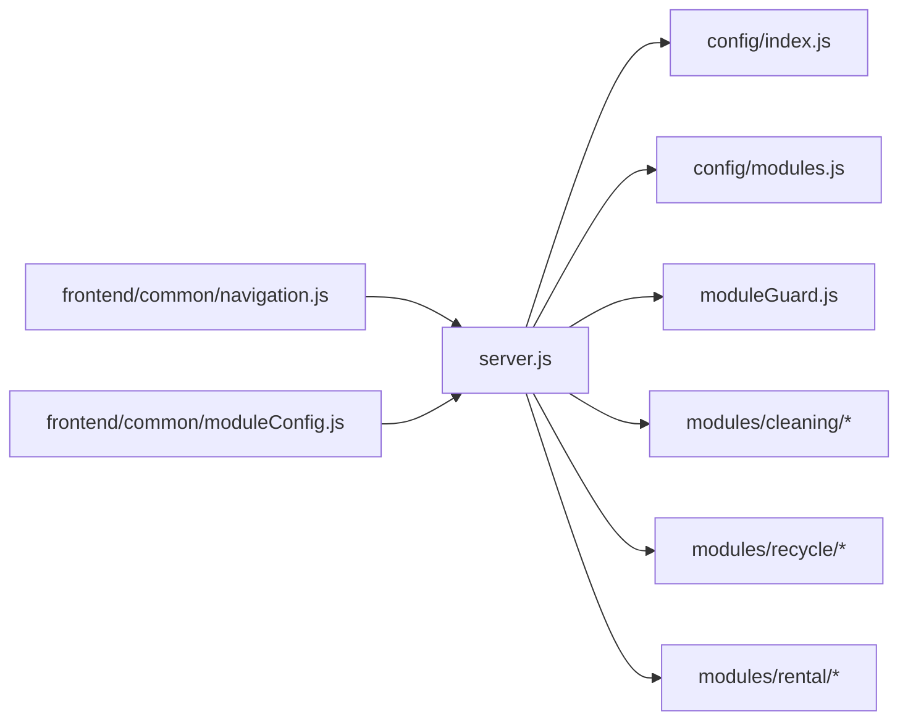

# 开发流程规范

<cite>
**本文引用的文件**   
- [backend/server.js](file://backend/server.js)
- [backend/config/modules.js](file://backend/config/modules.js)
- [backend/config/index.js](file://backend/config/index.js)
- [backend/modules/common/middlewares/moduleGuard.js](file://backend/modules/common/middlewares/moduleGuard.js)
- [frontend/common/navigation.js](file://frontend/common/navigation.js)
- [frontend/common/moduleConfig.js](file://frontend/common/moduleConfig.js)
- [.codebuddy/rules/tcb/rules/spec-workflow/rule.md](file://.codebuddy/rules/tcb/rules/spec-workflow/rule.md)
- [Git快速提交.ps1](file://Git快速提交.ps1)
- [Git快速提交.bat](file://Git快速提交.bat)
</cite>

## 目录
1. [引言](#引言)
2. [项目结构](#项目结构)
3. [核心组件](#核心组件)
4. [架构总览](#架构总览)
5. [详细组件分析](#详细组件分析)
6. [依赖分析](#依赖分析)
7. [性能考虑](#性能考虑)
8. [故障排查指南](#故障排查指南)
9. [结论](#结论)
10. [附录](#附录)

## 引言
本规范面向干洗店管理系统的后端与前端协作，定义新功能从需求到上线的完整流程、模块化开发模式、Git工作流、代码质量标准、版本管理与兼容性策略，以及新成员快速上手指南。目标是在保证质量与可维护性的前提下，提升交付效率与团队协作一致性。

## 项目结构
系统采用“后端 Express + 多业务模块 + 前端动态菜单”的分层与模块化架构：
- 后端入口负责加载配置、初始化数据库、注册路由与中间件、统一错误处理与优雅关闭。
- 模块通过配置中心控制启用/禁用，并通过守卫中间件进行运行时保护。
- 前端根据后端模块状态动态生成导航菜单，实现前后端一致的“功能开关”。

图表来源
- [backend/server.js:1-152](file://backend/server.js#L1-L152)
- [backend/config/index.js:1-167](file://backend/config/index.js#L1-L167)
- [backend/config/modules.js:1-203](file://backend/config/modules.js#L1-L203)
- [backend/modules/common/middlewares/moduleGuard.js:1-84](file://backend/modules/common/middlewares/moduleGuard.js#L1-L84)
- [frontend/common/navigation.js:1-64](file://frontend/common/navigation.js#L1-L64)
- [frontend/common/moduleConfig.js:1-57](file://frontend/common/moduleConfig.js#L1-L57)

章节来源
- [backend/server.js:1-152](file://backend/server.js#L1-L152)
- [backend/config/index.js:1-167](file://backend/config/index.js#L1-L167)
- [backend/config/modules.js:1-203](file://backend/config/modules.js#L1-L203)
- [backend/modules/common/middlewares/moduleGuard.js:1-84](file://backend/modules/common/middlewares/moduleGuard.js#L1-L84)
- [frontend/common/navigation.js:1-64](file://frontend/common/navigation.js#L1-L64)
- [frontend/common/moduleConfig.js:1-57](file://frontend/common/moduleConfig.js#L1-L57)

## 核心组件
- 后端入口 server.js
  - 加载环境变量、初始化数据库、挂载静态资源与健康检查接口。
  - 按前缀注册各业务模块路由与公共能力路由。
  - 提供系统模块状态查询接口，供前端动态渲染菜单。
  - 统一错误处理、进程信号与未捕获异常处理、优雅关闭。
- 模块配置 modules.js
  - 集中管理模块开关、版本、名称、分类、图标、消息等元数据。
  - 统一管理特性开关（配送、会员、积分、优惠券、押金、信用）。
  - 支付分账比例与通知模板按品类配置。
- 数据库连接 index.js
  - 单例式初始化 MongoDB 或 MySQL 连接池。
  - 提供便捷查询与事务封装，支持优雅关闭。
- 模块守卫 moduleGuard.js
  - 基于 modules.js 的 enabled 字段在请求阶段拦截未启用模块。
  - 暴露 getEnabledModules/getModuleConfig/isFeatureEnabled 等工具函数。
- 前端模块配置与导航
  - navigation.js 与 moduleConfig.js 均调用 /api/system/modules 获取模块状态并缓存，用于构建导航与页面可见性。

章节来源
- [backend/server.js:55-152](file://backend/server.js#L55-L152)
- [backend/config/modules.js:1-203](file://backend/config/modules.js#L1-L203)
- [backend/config/index.js:1-167](file://backend/config/index.js#L1-L167)
- [backend/modules/common/middlewares/moduleGuard.js:1-84](file://backend/modules/common/middlewares/moduleGuard.js#L1-L84)
- [frontend/common/navigation.js:1-64](file://frontend/common/navigation.js#L1-L64)
- [frontend/common/moduleConfig.js:1-57](file://frontend/common/moduleConfig.js#L1-L57)

## 架构总览
下图展示“前端动态菜单 -> 后端模块状态 -> 模块守卫 -> 业务路由”的端到端交互。

图表来源
- [backend/server.js:55-152](file://backend/server.js#L55-L152)
- [backend/config/modules.js:1-203](file://backend/config/modules.js#L1-L203)
- [backend/modules/common/middlewares/moduleGuard.js:1-84](file://backend/modules/common/middlewares/moduleGuard.js#L1-L84)
- [frontend/common/navigation.js:1-64](file://frontend/common/navigation.js#L1-L64)
- [frontend/common/moduleConfig.js:1-57](file://frontend/common/moduleConfig.js#L1-L57)

## 详细组件分析

### 模块开发与注册流程
- 新增业务模块步骤
  1) 在 backend/modules 下创建模块目录，包含 routes 与 services。
  2) 在 config/modules.js 中为该模块添加配置项（enabled、version、name、category、icon、message 等）。
  3) 在 server.js 中引入并挂载路由（app.use('/api/<prefix>', router)）。
  4) 如需权限控制，使用 moduleGuard 对路由进行保护。
  5) 前端无需改动即可自动识别该模块（通过 /api/system/modules）。
- 模块开关与特性开关
  - modules.enabled 控制模块可用性；features.*.enabled 控制通用能力。
  - 未启用时，模块守卫返回 503 并附带 message 与 launchDate 等信息。
- 前端联动
  - navigation.js 与 moduleConfig.js 会拉取 /api/system/modules 并缓存，据此显示/隐藏菜单与功能入口。

图表来源
- [backend/config/modules.js:1-203](file://backend/config/modules.js#L1-L203)
- [backend/server.js:96-152](file://backend/server.js#L96-L152)
- [backend/modules/common/middlewares/moduleGuard.js:1-84](file://backend/modules/common/middlewares/moduleGuard.js#L1-L84)
- [frontend/common/navigation.js:1-64](file://frontend/common/navigation.js#L1-L64)
- [frontend/common/moduleConfig.js:1-57](file://frontend/common/moduleConfig.js#L1-L57)

章节来源
- [backend/config/modules.js:1-203](file://backend/config/modules.js#L1-L203)
- [backend/server.js:96-152](file://backend/server.js#L96-L152)
- [backend/modules/common/middlewares/moduleGuard.js:1-84](file://backend/modules/common/middlewares/moduleGuard.js#L1-L84)
- [frontend/common/navigation.js:1-64](file://frontend/common/navigation.js#L1-L64)
- [frontend/common/moduleConfig.js:1-57](file://frontend/common/moduleConfig.js#L1-L57)

### 数据库连接与事务
- 单例初始化：initDatabase 根据配置选择 MongoDB 或 MySQL。
- 连接健康：监听断开/错误事件，便于监控。
- 事务封装：transaction 回调内执行 SQL，失败回滚，成功提交。
- 优雅关闭：closeDatabase 安全释放连接池与连接。

图表来源
- [backend/config/index.js:1-167](file://backend/config/index.js#L1-L167)

章节来源
- [backend/config/index.js:1-167](file://backend/config/index.js#L1-L167)

### 模块守卫与系统接口
- 模块守卫
  - 当模块不存在或未启用时，返回 404/503 及友好提示。
  - 启用时将 req.module 与 req.moduleConfig 注入后续处理器。
- 系统接口
  - /api/system/modules 返回版本、模块、特性与已启用列表。
  - /api/system/modules/:name 返回单个模块配置。
  - /api/health 健康检查。

图表来源
- [backend/server.js:55-152](file://backend/server.js#L55-L152)
- [backend/modules/common/middlewares/moduleGuard.js:1-84](file://backend/modules/common/middlewares/moduleGuard.js#L1-L84)
- [backend/config/modules.js:1-203](file://backend/config/modules.js#L1-L203)

章节来源
- [backend/server.js:55-152](file://backend/server.js#L55-L152)
- [backend/modules/common/middlewares/moduleGuard.js:1-84](file://backend/modules/common/middlewares/moduleGuard.js#L1-L84)
- [backend/config/modules.js:1-203](file://backend/config/modules.js#L1-L203)

### 前端动态菜单与降级
- 首次加载调用 /api/system/modules，缓存 5 分钟。
- 若后端不可用，回退到本地默认配置，保证基本可用。
- 根据 modules.cleaning.enabled 等字段控制菜单可见性。

图表来源
- [frontend/common/navigation.js:1-64](file://frontend/common/navigation.js#L1-L64)
- [frontend/common/moduleConfig.js:1-57](file://frontend/common/moduleConfig.js#L1-L57)

章节来源
- [frontend/common/navigation.js:1-64](file://frontend/common/navigation.js#L1-L64)
- [frontend/common/moduleConfig.js:1-57](file://frontend/common/moduleConfig.js#L1-L57)

## 依赖分析
- 低耦合高内聚
  - server.js 仅负责装配与路由分发，业务逻辑下沉至 modules/*。
  - moduleGuard 与 modules.js 解耦，便于扩展更多模块与特性。
- 外部依赖
  - 数据库：MongoDB 或 MySQL（通过 config/index.js 切换）。
  - HTTP：Express、CORS、body-parser。
- 潜在风险
  - 路由挂载顺序影响中间件生效范围，需保持统一规范。
  - 模块配置变更需同步更新前端缓存策略与文档。

图表来源
- [backend/server.js:1-152](file://backend/server.js#L1-L152)
- [backend/config/index.js:1-167](file://backend/config/index.js#L1-L167)
- [backend/config/modules.js:1-203](file://backend/config/modules.js#L1-L203)
- [backend/modules/common/middlewares/moduleGuard.js:1-84](file://backend/modules/common/middlewares/moduleGuard.js#L1-L84)
- [frontend/common/navigation.js:1-64](file://frontend/common/navigation.js#L1-L64)
- [frontend/common/moduleConfig.js:1-57](file://frontend/common/moduleConfig.js#L1-L57)

章节来源
- [backend/server.js:1-152](file://backend/server.js#L1-L152)
- [backend/config/index.js:1-167](file://backend/config/index.js#L1-L167)
- [backend/config/modules.js:1-203](file://backend/config/modules.js#L1-L203)
- [backend/modules/common/middlewares/moduleGuard.js:1-84](file://backend/modules/common/middlewares/moduleGuard.js#L1-L84)
- [frontend/common/navigation.js:1-64](file://frontend/common/navigation.js#L1-L64)
- [frontend/common/moduleConfig.js:1-57](file://frontend/common/moduleConfig.js#L1-L57)

## 性能考虑
- 数据库连接复用：MySQL 连接池与 MongoDB 单例连接减少握手开销。
- 前端配置缓存：模块配置缓存 5 分钟，降低频繁请求。
- 路由分层：将系统接口与业务接口分离，避免不必要的守卫与鉴权。
- 优雅关闭：进程退出前关闭数据库连接，避免资源泄漏。

[本节为通用指导，不直接分析具体文件]

## 故障排查指南
- 启动问题
  - 端口占用：server.js 监听端口冲突时会输出明确错误并退出。
  - 数据库连接失败：index.js 会打印错误并抛出异常，检查 .env 与网络连通性。
- 模块不可用
  - 访问未启用模块会返回 503，携带 message 与 launchDate，确认 modules.js 中 enabled 与 message。
- 前端菜单不更新
  - 检查 /api/system/modules 是否可达，确认前端缓存 TTL 与网络环境。
- 统一错误处理
  - server.js 全局错误中间件返回标准 JSON 格式，便于前端统一处理。

章节来源
- [backend/server.js:602-702](file://backend/server.js#L602-L702)
- [backend/config/index.js:1-167](file://backend/config/index.js#L1-L167)
- [backend/modules/common/middlewares/moduleGuard.js:1-84](file://backend/modules/common/middlewares/moduleGuard.js#L1-L84)
- [frontend/common/navigation.js:1-64](file://frontend/common/navigation.js#L1-L64)

## 结论
本规范以“配置驱动 + 模块守卫 + 前端动态菜单”为核心，确保新功能可插拔、可灰度、可观测。配合规范的 Git 工作流与代码质量标准，可在保障稳定性的同时持续提升迭代效率。

## 附录

### 新功能开发全流程规范
- 需求分析
  - 产出 requirements.md：问题背景、范围、用户故事、EARS 验收标准、约束与非目标。
  - 参考规范：.codebuddy/rules/tcb/rules/spec-workflow/rule.md
- 技术设计
  - 产出 design.md：架构与模块边界、数据模型、API 契约、安全与测试策略。
- 任务拆解
  - 产出 tasks.md：可执行任务清单，逐条关联需求，持续更新状态。
- 编码实现
  - 遵循模块化与命名约定，新增模块后在 modules.js 注册，并在 server.js 挂载路由。
  - 使用 moduleGuard 保护敏感路由，统一错误处理与日志。
- 代码审查
  - 关注：模块隔离、配置一致性、错误处理、性能与安全。
- 测试验证
  - 单元测试/集成测试覆盖关键路径；浏览器冒烟测试验证前端菜单与交互。
- 发布上线
  - 语义化版本升级，记录向后兼容性与破坏性变更。

章节来源
- [.codebuddy/rules/tcb/rules/spec-workflow/rule.md:84-165](file://.codebuddy/rules/tcb/rules/spec-workflow/rule.md#L84-L165)

### Git 工作流规范
- 分支策略
  - main：生产分支，保持稳定。
  - develop：集成分支，日常合并。
  - feature/*：功能分支，完成后发起合并请求。
  - hotfix/*：紧急修复，直合 main 后同步 develop。
- 提交信息规范
  - 建议格式：<type>(<scope>): <subject>
  - type：feat/fix/docs/style/refactor/test/chore
  - scope：模块名或子系统
  - subject：简明扼要，动词开头
- 合并请求流程
  - 分支对比与 CI 通过后，至少一名同行评审。
  - 合并后删除源分支，保留历史清晰。
- 快速提交脚本
  - Windows PowerShell/Batch 脚本辅助 add/commit/push，便于快速本地提交流程。

章节来源
- [Git快速提交.ps1:40-99](file://Git快速提交.ps1#L40-L99)
- [Git快速提交.bat:54-92](file://Git快速提交.bat#L54-L92)

### 代码质量标准
- 命名约定
  - 变量/函数：camelCase；常量：UPPER_SNAKE_CASE；模块名：kebab-case。
  - 路由前缀与模块名保持一致，便于检索与维护。
- 注释规范
  - 对外暴露的函数/类需 JSDoc 风格说明参数、返回值与异常。
  - 复杂逻辑处补充行级注释，解释“为什么”而非“是什么”。
- 错误处理最佳实践
  - 所有异步操作 try/catch 包裹，返回统一 JSON 结构。
  - 区分业务错误与系统错误，避免泄露内部细节。
  - 使用 moduleGuard 与统一错误中间件收敛错误出口。

[本节为通用指导，不直接分析具体文件]

### 版本管理与向后兼容
- 语义化版本
  - MAJOR：破坏性变更（如移除 API、改变数据结构）。
  - MINOR：新增功能（向后兼容）。
  - PATCH：缺陷修复（向后兼容）。
- 向后兼容保证
  - 新增字段默认值与可选参数；废弃字段保留过渡期。
  - 通过 modules.js 的 VERSION 与模块 version 标识能力演进。
- 发布节奏
  - 特性分支合并至 develop 后打标签，再合并至 main 发布。

章节来源
- [backend/config/modules.js:11-20](file://backend/config/modules.js#L11-L20)

### 新成员快速上手指南
- 环境准备
  - Node.js 与包管理器安装，复制 .env.example 为 .env 并填写数据库配置。
- 启动后端
  - 进入 backend 目录，安装依赖后运行 node server.js。
  - 访问 /api/health 与 /api/system/modules 验证服务。
- 启动前端
  - 打开前端页面，确认导航根据后端模块状态动态渲染。
- 贡献规范
  - 遵循 Git 工作流与提交信息规范，提交前自测关键路径。
  - 新功能需在 modules.js 注册，并在 server.js 挂载路由。

章节来源
- [backend/server.js:615-702](file://backend/server.js#L615-L702)
- [backend/config/index.js:1-167](file://backend/config/index.js#L1-L167)
- [backend/config/modules.js:1-203](file://backend/config/modules.js#L1-L203)
- [frontend/common/navigation.js:1-64](file://frontend/common/navigation.js#L1-L64)