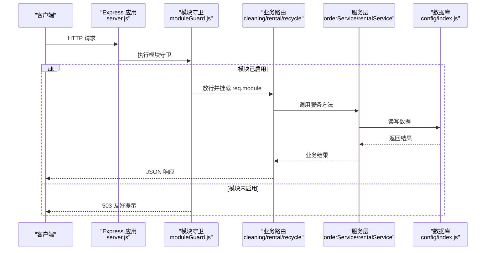
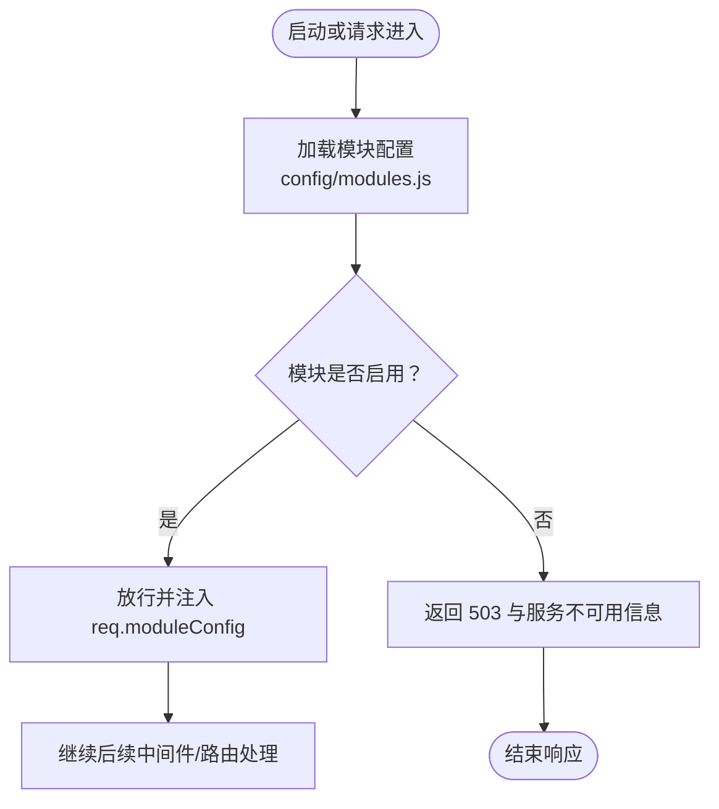
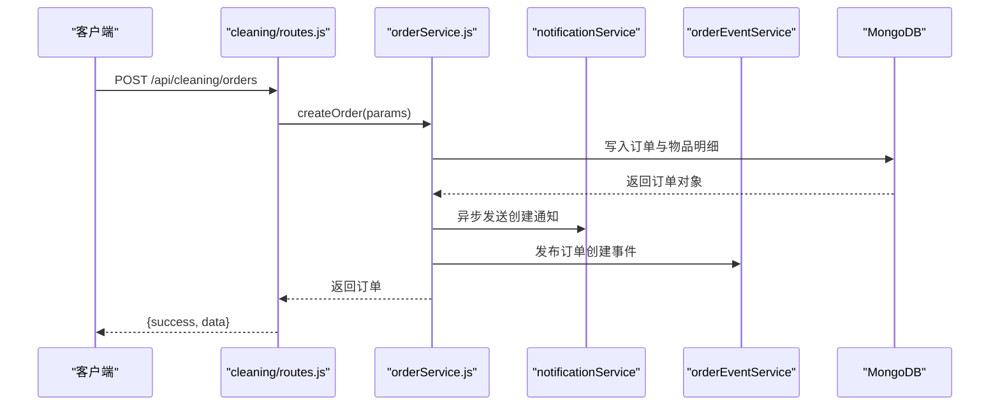
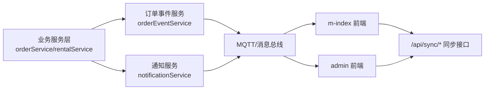
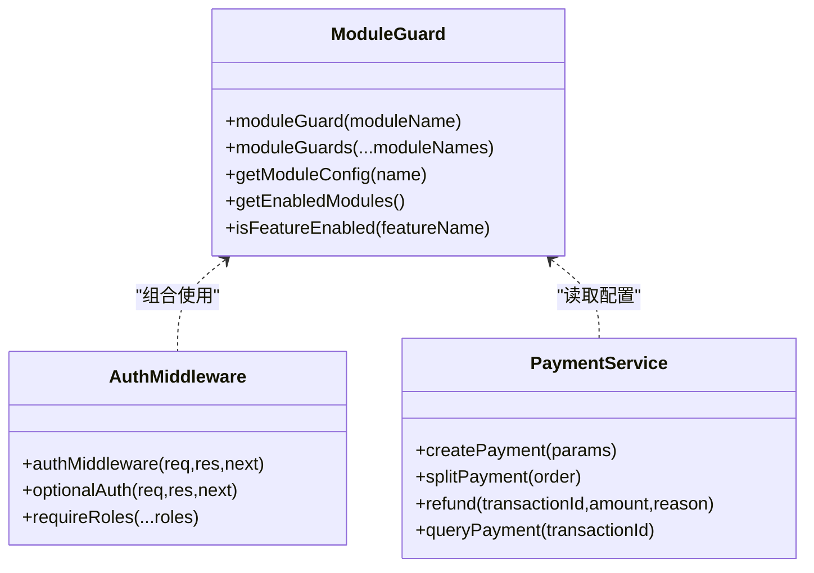
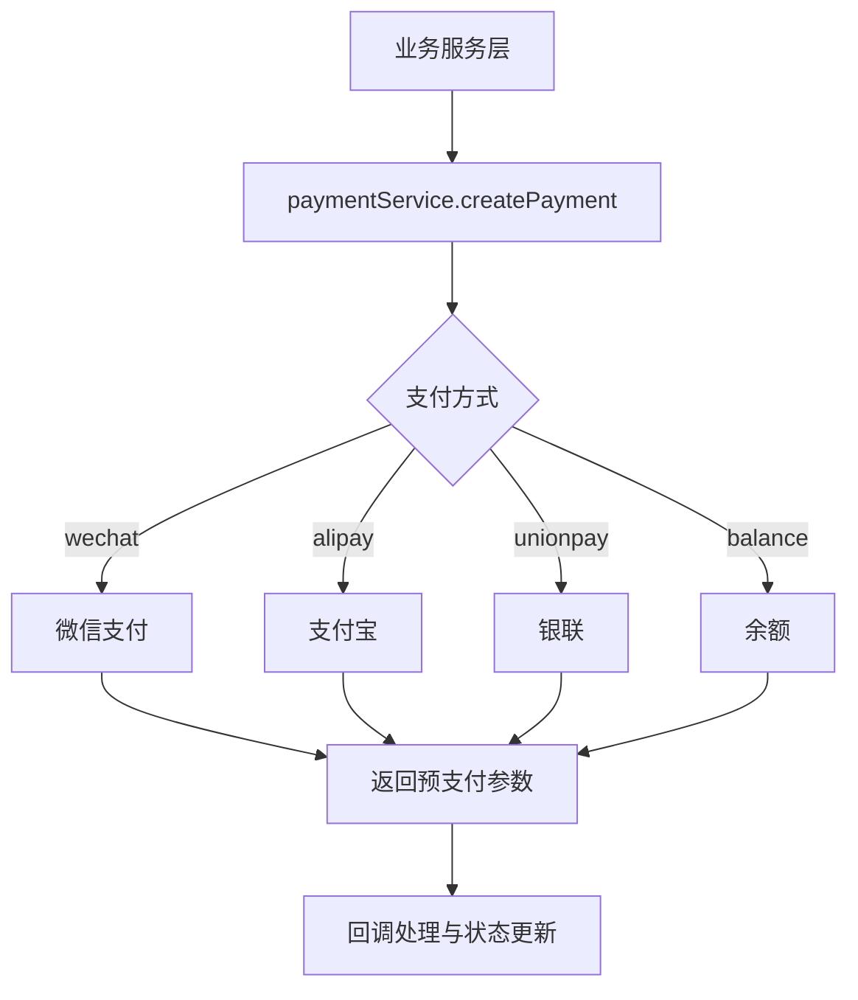
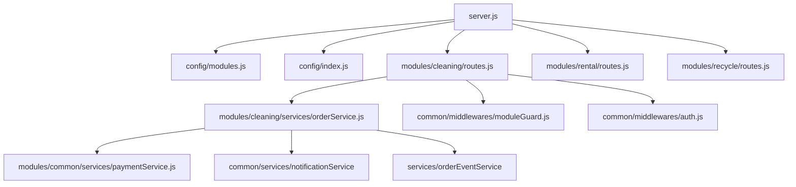

# 模块开发指南

<cite>
**本文引用的文件列表**   
- [backend/server.js](file://backend/server.js)
- [backend/config/modules.js](file://backend/config/modules.js)
- [backend/config/index.js](file://backend/config/index.js)
- [backend/modules/common/middlewares/moduleGuard.js](file://backend/modules/common/middlewares/moduleGuard.js)
- [backend/modules/common/middlewares/auth.js](file://backend/modules/common/middlewares/auth.js)
- [backend/modules/cleaning/routes.js](file://backend/modules/cleaning/routes.js)
- [backend/modules/cleaning/services/orderService.js](file://backend/modules/cleaning/services/orderService.js)
- [backend/modules/rental/routes.js](file://backend/modules/rental/routes.js)
- [backend/modules/recycle/routes.js](file://backend/modules/recycle/routes.js)
- [backend/modules/common/services/paymentService.js](file://backend/modules/common/services/paymentService.js)
</cite>

## 目录
1. [简介](#简介)
2. [项目结构](#项目结构)
3. [核心组件](#核心组件)
4. [架构总览](#架构总览)
5. [详细组件分析](#详细组件分析)
6. [依赖关系分析](#依赖关系分析)
7. [性能考虑](#性能考虑)
8. [故障排查指南](#故障排查指南)
9. [结论](#结论)
10. [附录](#附录)

## 简介
本指南面向干洗店管理系统的后端模块开发者，围绕模块化与插件化机制，系统阐述如何基于现有架构创建新的业务模块。内容涵盖：
- 模块配置与动态启用/禁用
- 标准目录结构与职责划分（routes、services、models）
- 路由到服务层的端到端实现流程
- 模块间通信与数据共享方案
- 中间件开发与集成方法（参考 moduleGuard 模式）
- 测试策略与调试技巧
- 性能优化建议与常见问题解决方案

## 项目结构
后端采用 Express 应用作为入口，通过集中注册各业务模块路由的方式实现“插件式”扩展。模块按业务域拆分在 backend/modules 下，每个模块包含 routes、services、middlewares、models 等子目录，遵循清晰的分层职责。

```mermaid
graph TB
A["Express 应用<br/>backend/server.js"] --> B["认证路由<br/>modules/common/routes/authRoutes"]
A --> C["干洗模块路由<br/>modules/cleaning/routes.js"]
A --> D["租赁模块路由<br/>modules/rental/routes.js"]
A --> E["回收模块路由<br/>modules/recycle/routes.js"]
A --> F["公共支付路由<br/>modules/common/routes/paymentRoutes"]
A --> G["门店相关路由<br/>modules/store/routes/*"]
A --> H["管理员路由<br/>modules/admin/routes/*"]
A --> I["配送路由<br/>modules/common/routes/deliveryRoutes"]
A --> J["分类路由<br/>modules/common/routes/categoryRoutes"]
A --> K["同步路由<br/>modules/common/routes/syncRoutes"]
A --> L["小程序码路由<br/>modules/common/routes/miniQRRoutes"]
A --> M["POS/会员卡路由<br../api/payment-server/*"]
A --> N["统一支付接口<br/>server.js 内 /api/payment/*"]
```

图表来源
- [backend/server.js:96-151](file://backend/server.js#L96-L151)
- [backend/server.js:398-502](file://backend/server.js#L398-L502)

章节来源
- [backend/server.js:1-151](file://backend/server.js#L1-L151)

## 核心组件
- 模块开关与功能特性配置：位于 backend/config/modules.js，提供模块启用状态、版本、名称、图标、消息提示、功能开关、支付分账比例、通知模板等。
- 模块守卫中间件：位于 backend/modules/common/middlewares/moduleGuard.js，用于检查模块是否启用，未启用的模块返回友好提示。
- 认证中间件：位于 backend/modules/common/middlewares/auth.js，支持可选认证与角色校验。
- 数据库连接管理：位于 backend/config/index.js，封装 MongoDB/MySQL 初始化、事务与便捷查询。
- 统一支付服务：位于 backend/modules/common/services/paymentService.js，抽象多支付方式与分账逻辑。

章节来源
- [backend/config/modules.js:1-203](file://backend/config/modules.js#L1-L203)
- [backend/modules/common/middlewares/moduleGuard.js:1-84](file://backend/modules/common/middlewares/moduleGuard.js#L1-L84)
- [backend/modules/common/middlewares/auth.js:1-207](file://backend/modules/common/middlewares/auth.js#L1-L207)
- [backend/config/index.js:1-167](file://backend/config/index.js#L1-L167)
- [backend/modules/common/services/paymentService.js:1-185](file://backend/modules/common/services/paymentService.js#L1-L185)

## 架构总览
整体采用“入口集中注册 + 模块独立路由 + 中间件控制 + 服务层实现”的架构。模块通过配置开关动态启用，路由层使用模块守卫中间件进行访问控制，服务层负责业务逻辑与持久化，公共能力（如支付、通知、认证）以共享服务形式复用。

图表来源
- [backend/server.js:96-151](file://backend/server.js#L96-L151)
- [backend/modules/common/middlewares/moduleGuard.js:13-42](file://backend/modules/common/middlewares/moduleGuard.js#L13-L42)
- [backend/modules/cleaning/routes.js:1-20](file://backend/modules/cleaning/routes.js#L1-L20)
- [backend/modules/cleaning/services/orderService.js:177-291](file://backend/modules/cleaning/services/orderService.js#L177-L291)
- [backend/config/index.js:19-88](file://backend/config/index.js#L19-L88)

## 详细组件分析

### 模块配置与动态启用/禁用
- 模块定义：在 modules.js 中为每个业务模块声明 enabled、version、name、category、icon、message 等字段。
- 运行时读取：moduleGuard 从配置中读取模块状态；server.js 暴露系统接口获取已启用模块列表与单个模块配置。
- 动态控制：修改 enabled 即可在不重启代码的情况下控制模块可用性（需重启进程加载新配置）。

图表来源
- [backend/config/modules.js:11-97](file://backend/config/modules.js#L11-L97)
- [backend/modules/common/middlewares/moduleGuard.js:13-42](file://backend/modules/common/middlewares/moduleGuard.js#L13-L42)
- [backend/server.js:59-82](file://backend/server.js#L59-L82)

章节来源
- [backend/config/modules.js:1-203](file://backend/config/modules.js#L1-L203)
- [backend/modules/common/middlewares/moduleGuard.js:1-84](file://backend/modules/common/middlewares/moduleGuard.js#L1-L84)
- [backend/server.js:59-82](file://backend/server.js#L59-L82)

### 模块目录结构规范
推荐的标准目录组织方式（以 cleaning 为例）：
- routes：HTTP 路由定义，负责参数校验、权限控制、调用服务层。
- services：业务逻辑实现，封装领域规则、事务、事件发布、通知发送等。
- models：数据模型定义（MongoDB Schema 或 ORM 模型），可放在 services 内部或单独目录。
- middlewares：模块专属中间件（如有），通用中间件放 common。
- tests：单元测试与集成测试用例。

示例路径参考：
- 路由：[backend/modules/cleaning/routes.js](file://backend/modules/cleaning/routes.js)
- 服务：[backend/modules/cleaning/services/orderService.js](file://backend/modules/cleaning/services/orderService.js)
- 其他模块路由：
  - [backend/modules/rental/routes.js](file://backend/modules/rental/routes.js)
  - [backend/modules/recycle/routes.js](file://backend/modules/recycle/routes.js)

章节来源
- [backend/modules/cleaning/routes.js:1-20](file://backend/modules/cleaning/routes.js#L1-L20)
- [backend/modules/cleaning/services/orderService.js:1-176](file://backend/modules/cleaning/services/orderService.js#L1-L176)
- [backend/modules/rental/routes.js:1-156](file://backend/modules/rental/routes.js#L1-L156)
- [backend/modules/recycle/routes.js:1-39](file://backend/modules/recycle/routes.js#L1-L39)

### 路由到服务层的端到端实现（以干洗订单为例）
- 路由层：在 cleaning/routes.js 中定义 RESTful 接口，统一使用 moduleGuard('cleaning') 保护所有清洗相关路由。
- 服务层：在 orderService.js 中实现订单生命周期（创建、查询、支付、取消、收件、处理、完成、取件等），并与通知、事件中心集成。
- 数据库：使用 MongoDB（Mongoose）存储订单与门店信息，支持软删除与状态历史。

图表来源
- [backend/modules/cleaning/routes.js:24-42](file://backend/modules/cleaning/routes.js#L24-L42)
- [backend/modules/cleaning/services/orderService.js:177-291](file://backend/modules/cleaning/services/orderService.js#L177-L291)

章节来源
- [backend/modules/cleaning/routes.js:1-800](file://backend/modules/cleaning/routes.js#L1-L800)
- [backend/modules/cleaning/services/orderService.js:1-800](file://backend/modules/cleaning/services/orderService.js#L1-L800)

### 模块间通信机制与数据共享
- 事件驱动：服务层通过 orderEventService 发布订单事件（创建、支付、状态变更、取消等），供 m-index、admin 等多端实时同步。
- 通知中心：通过 notificationService 向用户推送站内信或消息。
- 跨平台同步：server.js 提供 /api/sync/* 接口，维护客户端在线状态、心跳、操作记录与广播。
- 消息中心：/api/messages/* 提供线程与消息收发能力，支撑客服与运营沟通。

图表来源
- [backend/modules/cleaning/services/orderService.js:276-288](file://backend/modules/cleaning/services/orderService.js#L276-L288)
- [backend/server.js:214-298](file://backend/server.js#L214-L298)
- [backend/server.js:305-392](file://backend/server.js#L305-L392)

章节来源
- [backend/modules/cleaning/services/orderService.js:276-288](file://backend/modules/cleaning/services/orderService.js#L276-L288)
- [backend/server.js:214-298](file://backend/server.js#L214-L298)
- [backend/server.js:305-392](file://backend/server.js#L305-L392)

### 中间件开发与集成方法（参考 moduleGuard）
- 模块守卫：moduleGuard(moduleName) 根据配置判断模块是否启用，未启用返回 503 并携带友好提示与上线时间。
- 认证中间件：authMiddleware 与 optionalAuth 支持 Bearer Token、开发模式 mock token、角色校验。
- 组合使用：在模块路由顶部统一使用 router.use(moduleGuard('xxx'))，再按需叠加 auth 中间件。

图表来源
- [backend/modules/common/middlewares/moduleGuard.js:13-84](file://backend/modules/common/middlewares/moduleGuard.js#L13-L84)
- [backend/modules/common/middlewares/auth.js:10-207](file://backend/modules/common/middlewares/auth.js#L10-L207)
- [backend/modules/common/services/paymentService.js:9-185](file://backend/modules/common/services/paymentService.js#L9-L185)

章节来源
- [backend/modules/common/middlewares/moduleGuard.js:1-84](file://backend/modules/common/middlewares/moduleGuard.js#L1-L84)
- [backend/modules/common/middlewares/auth.js:1-207](file://backend/modules/common/middlewares/auth.js#L1-L207)
- [backend/modules/common/services/paymentService.js:1-185](file://backend/modules/common/services/paymentService.js#L1-L185)

### 完整模块开发示例（从零到一）
以下以新增一个“鞋类洗护”模块为例，说明端到端步骤（不直接粘贴代码，仅给出路径与要点）：
- 配置模块
  - 在 modules.js 中添加 shoe_care 模块配置，设置 enabled、version、name、category、icon、message 等。
  - 参考路径：[backend/config/modules.js](file://backend/config/modules.js)
- 创建目录结构
  - 新建 backend/modules/shoe_care/routes.js、services/shoeCareService.js、models/ShoeItem.js（可选）。
- 编写路由
  - 在 routes.js 中使用 moduleGuard('shoe_care') 保护所有路由，定义 CRUD 与业务流程接口。
  - 参考路径：[backend/modules/cleaning/routes.js](file://backend/modules/cleaning/routes.js)
- 实现服务
  - 在 shoeCareService.js 中实现业务逻辑，包括数据校验、状态机、通知与事件发布。
  - 参考路径：[backend/modules/cleaning/services/orderService.js](file://backend/modules/cleaning/services/orderService.js)
- 注册路由
  - 在 server.js 中引入并 app.use('/api/shoe-care', shoeCareRouter)。
  - 参考路径：[backend/server.js:96-151](file://backend/server.js#L96-L151)
- 测试与调试
  - 使用 Postman 或前端联调，验证模块启用状态、路由可达性、服务逻辑正确性与事件/通知触发。
  - 参考健康检查与系统模块接口：[backend/server.js:59-90](file://backend/server.js#L59-L90)

章节来源
- [backend/config/modules.js:1-203](file://backend/config/modules.js#L1-L203)
- [backend/modules/cleaning/routes.js:1-800](file://backend/modules/cleaning/routes.js#L1-L800)
- [backend/modules/cleaning/services/orderService.js:1-800](file://backend/modules/cleaning/services/orderService.js#L1-L800)
- [backend/server.js:96-151](file://backend/server.js#L96-L151)

### 支付与分账集成
- 统一支付服务：paymentService.js 抽象微信、支付宝、银联、余额支付，并提供分账计算（干洗、回收、租赁）。
- 服务器侧统一支付接口：server.js 提供 /api/payment/create、/api/payment/query/:orderId、/api/payment/callback 等。
- 模块内调用：在各模块服务层通过 paymentService.createPayment 发起支付，并在成功后更新订单状态与分账记录。

图表来源
- [backend/modules/common/services/paymentService.js:24-91](file://backend/modules/common/services/paymentService.js#L24-L91)
- [backend/server.js:411-502](file://backend/server.js#L411-L502)

章节来源
- [backend/modules/common/services/paymentService.js:1-185](file://backend/modules/common/services/paymentService.js#L1-L185)
- [backend/server.js:411-502](file://backend/server.js#L411-L502)

## 依赖关系分析
- 入口依赖：server.js 依赖 config/index.js（数据库）、config/modules.js（模块配置）、各模块路由与公共中间件。
- 模块内依赖：routes 依赖 services；services 依赖 database、paymentService、notificationService、orderEventService。
- 中间件依赖：moduleGuard 依赖 modules.js；auth 依赖 authService。

图表来源
- [backend/server.js:1-151](file://backend/server.js#L1-L151)
- [backend/modules/cleaning/routes.js:1-20](file://backend/modules/cleaning/routes.js#L1-L20)
- [backend/modules/cleaning/services/orderService.js:1-176](file://backend/modules/cleaning/services/orderService.js#L1-L176)
- [backend/modules/common/services/paymentService.js:1-185](file://backend/modules/common/services/paymentService.js#L1-L185)
- [backend/modules/common/middlewares/moduleGuard.js:1-84](file://backend/modules/common/middlewares/moduleGuard.js#L1-L84)
- [backend/modules/common/middlewares/auth.js:1-207](file://backend/modules/common/middlewares/auth.js#L1-L207)

章节来源
- [backend/server.js:1-151](file://backend/server.js#L1-L151)
- [backend/modules/cleaning/routes.js:1-20](file://backend/modules/cleaning/routes.js#L1-L20)
- [backend/modules/cleaning/services/orderService.js:1-176](file://backend/modules/cleaning/services/orderService.js#L1-L176)
- [backend/modules/common/services/paymentService.js:1-185](file://backend/modules/common/services/paymentService.js#L1-L185)
- [backend/modules/common/middlewares/moduleGuard.js:1-84](file://backend/modules/common/middlewares/moduleGuard.js#L1-L84)
- [backend/modules/common/middlewares/auth.js:1-207](file://backend/modules/common/middlewares/auth.js#L1-L207)

## 性能考虑
- 路由与中间件顺序：将高频且无鉴权的路由前置，减少不必要的中间件开销。
- 数据库索引：对 userId、storeId、status、customerPhone 等常用查询字段建立索引，提升查询效率。
- 分页与限流：列表接口默认分页，避免一次性返回大量数据；必要时增加速率限制。
- 异步非阻塞：通知与事件发布采用异步，避免阻塞主响应链路。
- 缓存策略：对静态配置（如价格表、促销规则）可加内存缓存，注意失效与一致性。
- 错误处理：统一错误处理中间件，避免异常导致进程崩溃。

[本节为通用指导，无需特定文件引用]

## 故障排查指南
- 模块未启用
  - 现象：请求返回 503 与服务不可用信息。
  - 排查：检查 modules.js 中对应模块 enabled 字段；确认 server.js 是否正确注册路由。
  - 参考：[backend/modules/common/middlewares/moduleGuard.js:25-35](file://backend/modules/common/middlewares/moduleGuard.js#L25-L35)、[backend/server.js:96-151](file://backend/server.js#L96-L151)
- 认证失败
  - 现象：401 未登录或登录过期。
  - 排查：检查 Authorization 头格式；确认开发模式 mock token 是否生效；核对用户角色。
  - 参考：[backend/modules/common/middlewares/auth.js:10-137](file://backend/modules/common/middlewares/auth.js#L10-L137)
- 数据库连接问题
  - 现象：启动时报错无法连接数据库。
  - 排查：检查 config/index.js 中的数据库配置与环境变量；确认服务可用。
  - 参考：[backend/config/index.js:19-88](file://backend/config/index.js#L19-L88)
- 支付回调未触发
  - 现象：支付成功但订单状态未更新。
  - 排查：检查 /api/payment/callback 路由与日志；确认第三方回调地址与签名校验。
  - 参考：[backend/server.js:498-502](file://backend/server.js#L498-L502)
- 事件/通知未送达
  - 现象：订单状态变更后前端未收到实时更新。
  - 排查：检查 orderEventService 与 MQTT 连接；查看通知中心 API 是否正常。
  - 参考：[backend/modules/cleaning/services/orderService.js:276-288](file://backend/modules/cleaning/services/orderService.js#L276-L288)、[backend/server.js:305-392](file://backend/server.js#L305-L392)

章节来源
- [backend/modules/common/middlewares/moduleGuard.js:25-35](file://backend/modules/common/middlewares/moduleGuard.js#L25-L35)
- [backend/server.js:96-151](file://backend/server.js#L96-L151)
- [backend/modules/common/middlewares/auth.js:10-137](file://backend/modules/common/middlewares/auth.js#L10-L137)
- [backend/config/index.js:19-88](file://backend/config/index.js#L19-L88)
- [backend/server.js:498-502](file://backend/server.js#L498-L502)
- [backend/modules/cleaning/services/orderService.js:276-288](file://backend/modules/cleaning/services/orderService.js#L276-L288)
- [backend/server.js:305-392](file://backend/server.js#L305-L392)

## 结论
本指南基于现有代码库梳理了干洗店管理系统的模块化与插件化设计，提供了从配置、目录结构、路由到服务层的完整开发范式，并结合中间件、支付、事件与通知等关键能力，帮助开发者快速构建高质量的业务模块。遵循本文规范，可实现模块的高内聚低耦合、易扩展与易维护。

[本节为总结性内容，无需特定文件引用]

## 附录
- 模块配置字段说明（节选）
  - enabled：布尔值，控制模块启用/禁用
  - version：模块版本号
  - name/nameEn：中英文模块名
  - category：模块类别（service/rental/recycle）
  - icon：展示图标
  - message：未启用时的提示信息
  - launchDate：预计上线时间
  - features：功能开关（delivery、membership、points、coupon、deposit、credit）
  - payment：分账接收方与比例
  - notifications：各品类通知模板集合
- 参考路径
  - [backend/config/modules.js](file://backend/config/modules.js)

章节来源
- [backend/config/modules.js:1-203](file://backend/config/modules.js#L1-L203)