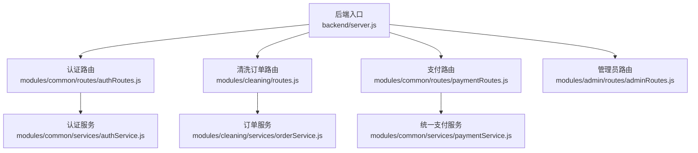
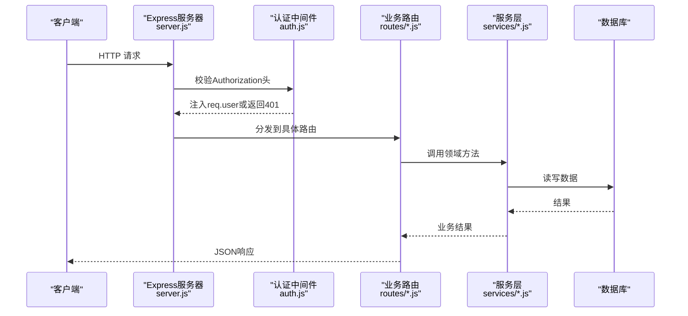
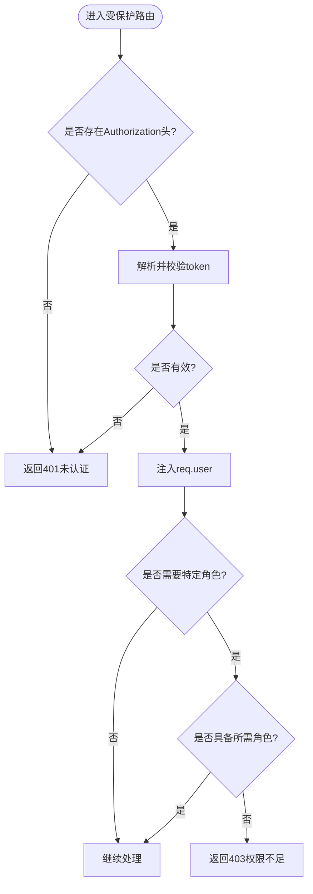
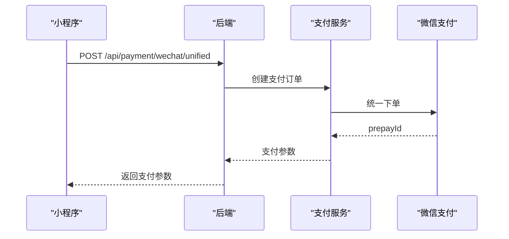
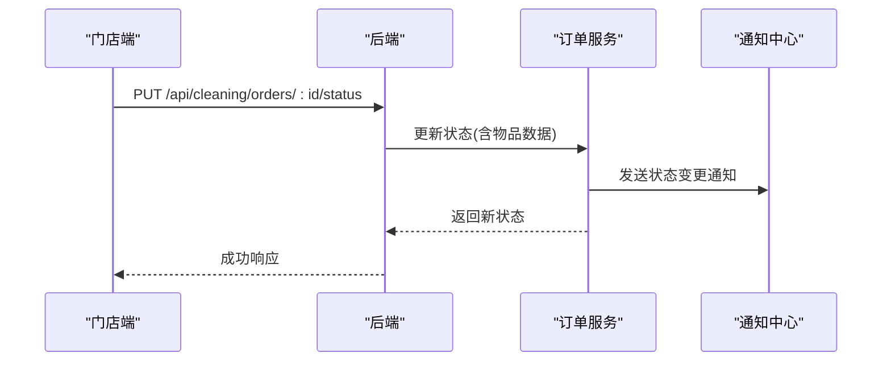
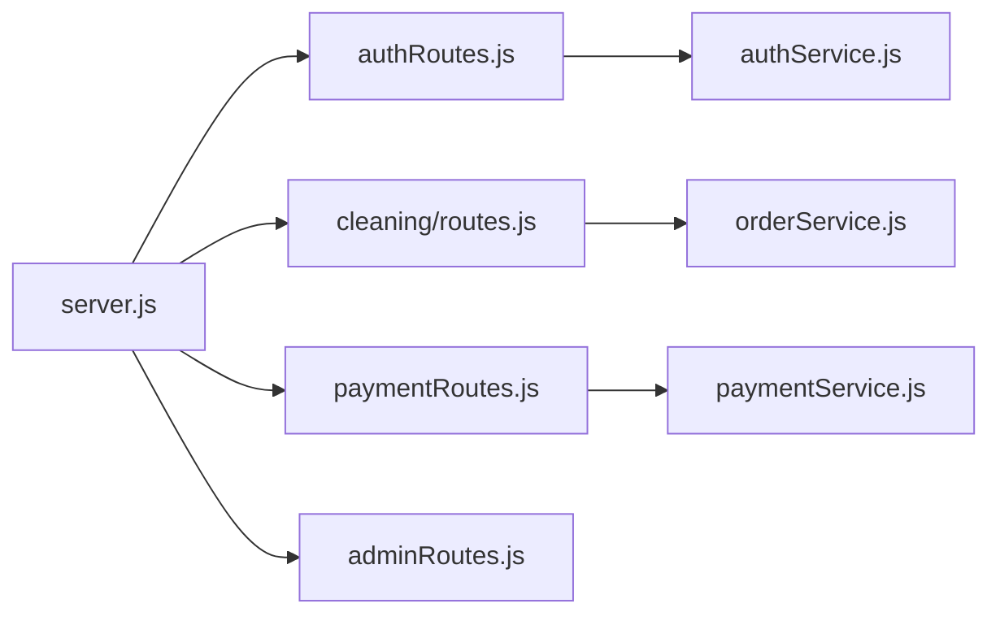

# API设计规范

<cite>
**本文引用的文件**   
- [backend/server.js](file://backend/server.js)
- [backend/modules/common/middlewares/auth.js](file://backend/modules/common/middlewares/auth.js)
- [backend/modules/common/routes/authRoutes.js](file://backend/modules/common/routes/authRoutes.js)
- [backend/modules/cleaning/routes.js](file://backend/modules/cleaning/routes.js)
- [backend/modules/admin/routes/adminRoutes.js](file://backend/modules/admin/routes/adminRoutes.js)
- [backend/modules/common/routes/paymentRoutes.js](file://backend/modules/common/routes/paymentRoutes.js)
- [backend/modules/common/services/authService.js](file://backend/modules/common/services/authService.js)
- [backend/modules/cleaning/services/orderService.js](file://backend/modules/cleaning/services/orderService.js)
- [backend/modules/common/services/paymentService.js](file://backend/modules/common/services/paymentService.js)
- [api/API_DOCUMENTATION.md](file://api/API_DOCUMENTATION.md)
</cite>

## 目录
1. [引言](#引言)
2. [项目结构](#项目结构)
3. [核心组件](#核心组件)
4. [架构总览](#架构总览)
5. [详细组件分析](#详细组件分析)
6. [依赖分析](#依赖分析)
7. [性能考虑](#性能考虑)
8. [故障排查指南](#故障排查指南)
9. [结论](#结论)
10. [附录](#附录)

## 引言
本规范面向干洗店管理系统的RESTful API，统一约定URL路径设计、请求/响应格式、认证与授权、数据校验规则、文档生成与测试规范。目标是让前后端协作高效、接口稳定可演进、错误可观测、安全可控。

## 项目结构
后端采用Express模块化路由组织，按业务域划分模块：认证、清洗订单、支付、管理员后台、品类等。入口文件负责挂载各模块路由、全局中间件与系统级接口。

图示来源
- [backend/server.js:1-150](file://backend/server.js#L1-L150)
- [backend/modules/common/routes/authRoutes.js:1-120](file://backend/modules/common/routes/authRoutes.js#L1-L120)
- [backend/modules/cleaning/routes.js:1-120](file://backend/modules/cleaning/routes.js#L1-L120)
- [backend/modules/common/routes/paymentRoutes.js:1-60](file://backend/modules/common/routes/paymentRoutes.js#L1-L60)
- [backend/modules/admin/routes/adminRoutes.js:1-60](file://backend/modules/admin/routes/adminRoutes.js#L1-L60)
- [backend/modules/cleaning/services/orderService.js:1-60](file://backend/modules/cleaning/services/orderService.js#L1-L60)
- [backend/modules/common/services/paymentService.js:1-60](file://backend/modules/common/services/paymentService.js#L1-L60)
- [backend/modules/common/services/authService.js:1-60](file://backend/modules/common/services/authService.js#L1-L60)

章节来源
- [backend/server.js:1-150](file://backend/server.js#L1-L150)

## 核心组件
- 认证与授权
  - JWT令牌在Authorization头中传递，格式为Bearer <token>；支持可选认证与角色校验中间件。
  - 提供手机号+密码登录、验证码登录、微信网页授权、微信小程序登录、员工账号登录等。
- 清洗订单
  - 覆盖下单、查询、状态流转（待支付/已支付/配送中/已入库/处理中/清洗完成/待取件/已完成/已取消）、支付、取件方式选择、跑腿服务商选择、扫码取件、一键取货、智能灯条控制等。
- 支付
  - 统一创建支付、查询、回调、退款；支持微信JSAPI/App/H5、支付宝、银联、余额。
- 管理员后台
  - 仪表盘、用户/门店/订单管理、模块开关、灯条控制、配送管理等。

章节来源
- [backend/modules/common/middlewares/auth.js:1-209](file://backend/modules/common/middlewares/auth.js#L1-L209)
- [backend/modules/common/routes/authRoutes.js:1-120](file://backend/modules/common/routes/authRoutes.js#L1-L120)
- [backend/modules/cleaning/routes.js:1-120](file://backend/modules/cleaning/routes.js#L1-L120)
- [backend/modules/common/routes/paymentRoutes.js:1-120](file://backend/modules/common/routes/paymentRoutes.js#L1-L120)
- [backend/modules/admin/routes/adminRoutes.js:1-120](file://backend/modules/admin/routes/adminRoutes.js#L1-L120)

## 架构总览
整体采用“入口挂载 + 模块路由 + 服务层”的分层架构。中间件统一鉴权与权限控制，服务层封装领域逻辑与持久化，路由仅做参数解析与响应包装。

图示来源
- [backend/server.js:1-150](file://backend/server.js#L1-L150)
- [backend/modules/common/middlewares/auth.js:1-120](file://backend/modules/common/middlewares/auth.js#L1-L120)
- [backend/modules/cleaning/routes.js:1-120](file://backend/modules/cleaning/routes.js#L1-L120)
- [backend/modules/cleaning/services/orderService.js:1-120](file://backend/modules/cleaning/services/orderService.js#L1-L120)

## 详细组件分析

### URL路径设计原则
- 资源命名
  - 使用复数名词表示集合，单数表示资源实例，如 /api/cleaning/orders、/api/cleaning/orders/:id。
  - 动词用于动作型子资源，如 /api/cleaning/orders/:id/pay、/api/cleaning/orders/:id/pickup。
- 版本控制
  - 当前未显式包含v前缀，建议未来通过路径前缀 /api/v1/... 进行版本演进。
- 层次结构
  - 以业务域为一级路径：/api/auth、/api/cleaning、/api/payments、/api/admin、/api/categories、/api/store 等。
  - 二级及以下体现资源关系，如 /api/cleaning/orders/:id/status。

章节来源
- [backend/server.js:90-150](file://backend/server.js#L90-L150)
- [backend/modules/cleaning/routes.js:1-120](file://backend/modules/cleaning/routes.js#L1-L120)

### 统一的请求参数格式
- 路径参数
  - 使用 :param 形式，如 :id、:storeId、:orderId。
- 查询参数
  - 列表分页：page、pageSize；过滤：status、keyword、dateRange等；排序：sortBy、order。
- 请求体
  - 统一JSON对象，字段名使用小驼峰，金额单位为元（浮点数），时间使用ISO字符串。
  - 必填字段需在路由或服务层校验并返回明确错误信息。

章节来源
- [backend/modules/cleaning/routes.js:45-120](file://backend/modules/cleaning/routes.js#L45-L120)
- [backend/modules/common/routes/paymentRoutes.js:1-120](file://backend/modules/common/routes/paymentRoutes.js#L1-L120)

### 统一的响应数据格式
- 成功响应
  - { success: true, data: ... }
- 失败响应
  - { success: false, error: '错误码', message: '人类可读描述' }
- 分页响应
  - { list: [...], total: number, page: number, pageSize: number, totalPages: number }
- 状态码
  - 200：成功
  - 400：参数错误
  - 401：未认证
  - 403：无权限
  - 404：资源不存在
  - 500：服务器内部错误

章节来源
- [backend/modules/common/routes/authRoutes.js:1-120](file://backend/modules/common/routes/authRoutes.js#L1-L120)
- [backend/modules/cleaning/routes.js:1-120](file://backend/modules/cleaning/routes.js#L1-L120)
- [backend/modules/admin/routes/adminRoutes.js:1-120](file://backend/modules/admin/routes/adminRoutes.js#L1-L120)

### 身份认证与授权机制
- 令牌传递
  - Authorization: Bearer <token>
- 认证流程
  - 登录成功后返回token；后续请求携带token，中间件解析并注入req.user。
- 可选认证
  - optionalAuth：允许匿名访问，但若有token则解析用户上下文。
- 角色验证
  - requireRoles(...)：基于用户roles进行细粒度权限控制。
- 会话管理
  - 无状态JWT；服务端不维护会话，前端负责存储与刷新策略。

图示来源
- [backend/modules/common/middlewares/auth.js:1-209](file://backend/modules/common/middlewares/auth.js#L1-L209)

章节来源
- [backend/modules/common/middlewares/auth.js:1-209](file://backend/modules/common/middlewares/auth.js#L1-L209)
- [backend/modules/common/routes/authRoutes.js:1-120](file://backend/modules/common/routes/authRoutes.js#L1-L120)

### 数据验证规则
- 必填字段
  - 登录：phone/password或code；下单：items、storeId等。
- 数据类型
  - 金额：number；ID：string；布尔：boolean；枚举：限定值。
- 业务规则
  - 订单状态机约束（如仅pending可支付）；取件方式仅限store_pickup/home_delivery；支付方法需合法。
- 校验位置
  - 路由层快速校验，服务层执行完整业务校验。

章节来源
- [backend/modules/cleaning/routes.js:1-120](file://backend/modules/cleaning/routes.js#L1-L120)
- [backend/modules/cleaning/services/orderService.js:1-120](file://backend/modules/cleaning/services/orderService.js#L1-L120)

### 关键业务流程时序

#### 微信支付统一下单（小程序）

图示来源
- [backend/server.js:520-600](file://backend/server.js#L520-L600)
- [backend/modules/common/services/paymentService.js:1-120](file://backend/modules/common/services/paymentService.js#L1-L120)

章节来源
- [backend/server.js:520-600](file://backend/server.js#L520-L600)
- [api/API_DOCUMENTATION.md:1-120](file://api/API_DOCUMENTATION.md#L1-L120)

#### 订单状态更新（门店端）

图示来源
- [backend/modules/cleaning/routes.js:560-600](file://backend/modules/cleaning/routes.js#L560-L600)
- [backend/modules/cleaning/services/orderService.js:700-820](file://backend/modules/cleaning/services/orderService.js#L700-L820)

章节来源
- [backend/modules/cleaning/routes.js:560-600](file://backend/modules/cleaning/routes.js#L560-L600)
- [backend/modules/cleaning/services/orderService.js:700-820](file://backend/modules/cleaning/services/orderService.js#L700-L820)

### 认证相关接口定义（节选）
- 发送验证码
  - POST /api/auth/send-code
- 验证验证码
  - POST /api/auth/verify-code
- 用户注册
  - POST /api/auth/register
- 用户登录
  - POST /api/auth/login
- 微信网页授权
  - GET /api/auth/wechat/authorize
  - GET /api/auth/wechat/callback
- 微信小程序登录
  - POST /api/auth/wxmini-login
- 获取/更新个人资料
  - GET /api/auth/profile
  - PUT /api/auth/profile
- 修改密码
  - POST /api/auth/change-password
- 退出登录
  - POST /api/auth/logout

章节来源
- [backend/modules/common/routes/authRoutes.js:1-586](file://backend/modules/common/routes/authRoutes.js#L1-L586)

### 清洗订单接口定义（节选）
- 创建订单
  - POST /api/cleaning/orders
- 订单列表
  - GET /api/cleaning/orders?page=&pageSize=&status=
- 订单详情
  - GET /api/cleaning/orders/:id
- 取消订单
  - POST /api/cleaning/orders/:id/cancel
- 删除订单（软删）
  - POST /api/cleaning/orders/:id/delete
- 门店收件
  - POST /api/cleaning/orders/:id/receive
- 开始处理
  - POST /api/cleaning/orders/:id/processing
- 完成清洗
  - POST /api/cleaning/orders/:id/complete
- 设置配送中
  - POST /api/cleaning/orders/:id/delivering
- 用户取件确认
  - POST /api/cleaning/orders/:id/pickup
- 选择取件方式
  - POST /api/cleaning/orders/:id/pickup-method
- 支付配送费
  - POST /api/cleaning/orders/:id/pay-delivery-fee
- 选择跑腿服务商
  - POST /api/cleaning/orders/:id/select-provider
- 扫码取件
  - POST /api/cleaning/orders/:id/scan-pickup
- 一键取货
  - POST /api/cleaning/orders/batch-pickup
- 实时状态轮询
  - GET /api/cleaning/orders/:id/status
- 更新订单状态（门店）
  - PUT /api/cleaning/orders/:id/status

章节来源
- [backend/modules/cleaning/routes.js:1-800](file://backend/modules/cleaning/routes.js#L1-L800)

### 支付接口定义（节选）
- 创建支付
  - POST /api/payments/create
- 查询支付
  - GET /api/payments/query/:orderId
- 微信支付回调
  - POST /api/payments/wechat/callback
- 申请退款
  - POST /api/payments/refund

章节来源
- [backend/modules/common/routes/paymentRoutes.js:1-215](file://backend/modules/common/routes/paymentRoutes.js#L1-L215)

### 管理员接口定义（节选）
- 仪表盘
  - GET /api/admin/dashboard
- 用户管理
  - GET /api/admin/users
  - GET /api/admin/users/:id
  - PUT /api/admin/users/:id/status
- 门店管理
  - GET /api/admin/stores
  - POST /api/admin/stores
  - PUT /api/admin/stores/:id
  - GET /api/admin/stores/:id
- 订单管理
  - GET /api/admin/orders
  - GET /api/admin/orders/:id
- 模块管理
  - GET /api/admin/modules
  - PUT /api/admin/modules/:name
- 系统设置
  - GET /api/admin/settings
  - PUT /api/admin/settings
- 灯条控制
  - GET /api/admin/store/:storeId/light-status
  - POST /api/admin/store/:storeId/light-up
  - POST /api/admin/store/:storeId/light-off
  - POST /api/admin/store/:storeId/light-all-off

章节来源
- [backend/modules/admin/routes/adminRoutes.js:1-800](file://backend/modules/admin/routes/adminRoutes.js#L1-L800)

## 依赖分析
- 模块耦合
  - server.js集中挂载路由，低耦合高内聚；路由与服务分离，便于扩展与维护。
- 外部依赖
  - Express、CORS、body-parser、MongoDB驱动、第三方支付SDK（按需）。
- 潜在循环依赖
  - 路由→服务→模型，避免服务反向引入路由。

图示来源
- [backend/server.js:1-150](file://backend/server.js#L1-L150)
- [backend/modules/cleaning/routes.js:1-120](file://backend/modules/cleaning/routes.js#L1-L120)
- [backend/modules/common/routes/paymentRoutes.js:1-120](file://backend/modules/common/routes/paymentRoutes.js#L1-L120)
- [backend/modules/admin/routes/adminRoutes.js:1-120](file://backend/modules/admin/routes/adminRoutes.js#L1-L120)
- [backend/modules/cleaning/services/orderService.js:1-120](file://backend/modules/cleaning/services/orderService.js#L1-L120)
- [backend/modules/common/services/paymentService.js:1-120](file://backend/modules/common/services/paymentService.js#L1-L120)
- [backend/modules/common/services/authService.js:1-120](file://backend/modules/common/services/authService.js#L1-L120)

章节来源
- [backend/server.js:1-150](file://backend/server.js#L1-L150)

## 性能考虑
- 分页与索引
  - 列表接口强制分页；对userId、storeId、status、createdAt建立索引。
- 缓存策略
  - 状态轮询接口禁用缓存；静态配置类接口可启用短期缓存。
- 批量操作
  - 一键取货等批量接口在服务层使用事务与批量更新。
- 异步事件
  - 通知与事件发布异步执行，避免阻塞主流程。

[本节为通用指导，无需源码引用]

## 故障排查指南
- 常见错误码
  - 400：参数缺失或非法
  - 401：未认证或token无效
  - 403：权限不足
  - 404：资源不存在
  - 500：服务器异常
- 定位步骤
  - 检查Authorization头与token有效性
  - 核对请求体字段类型与必填项
  - 查看服务层日志与数据库记录
  - 支付回调需验签与解密正确性

章节来源
- [backend/modules/common/middlewares/auth.js:1-209](file://backend/modules/common/middlewares/auth.js#L1-L209)
- [backend/modules/cleaning/routes.js:1-120](file://backend/modules/cleaning/routes.js#L1-L120)
- [backend/modules/common/routes/paymentRoutes.js:1-120](file://backend/modules/common/routes/paymentRoutes.js#L1-L120)

## 结论
本规范明确了干洗店管理系统API的路径、参数、响应、认证授权、校验与排障标准。建议在后续迭代中引入OpenAPI/Swagger自动文档与契约测试，进一步提升一致性与可维护性。

[本节为总结，无需源码引用]

## 附录

### 文档生成工具集成方案
- Swagger/OpenAPI
  - 使用swagger-jsdoc注解路由与服务层，构建openapi.json，配合swagger-ui展示。
  - 在server.js中挂载/swagger与/openapi.json。
- JSDoc
  - 为路由与服务函数添加JSDoc注释，生成HTML文档供团队查阅。
- 自动化
  - 在CI中校验openapi.json与契约测试用例一致性。

[本节为通用指导，无需源码引用]

### API测试规范与Mock数据
- 测试分层
  - 单元测试：服务层输入输出与边界条件
  - 集成测试：路由→服务→数据库
  - 契约测试：请求/响应结构与状态码
- Mock策略
  - 使用nock或supertest拦截外部支付与短信服务
  - 预置门店、用户、订单等基础数据
- 断言要点
  - 状态码、success标志、data结构、分页字段、错误码与消息

[本节为通用指导，无需源码引用]