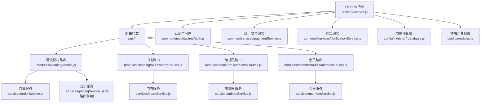
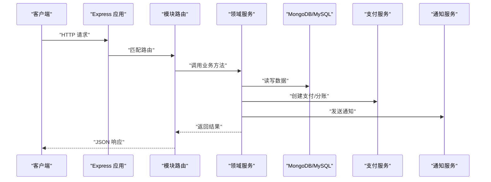
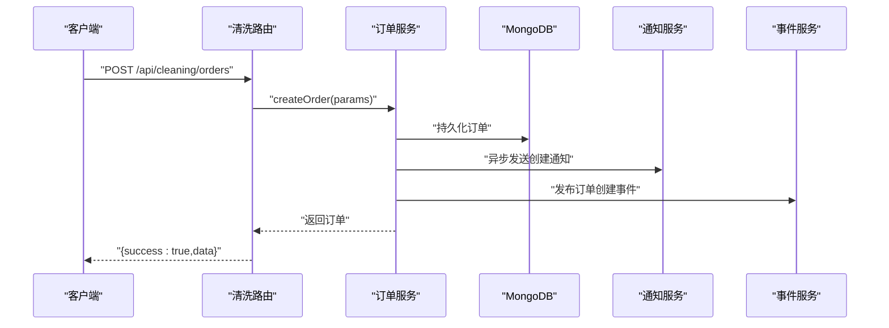
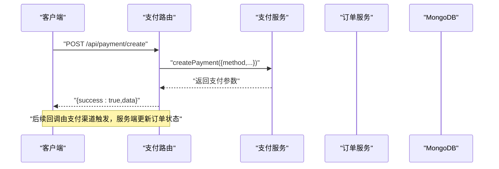
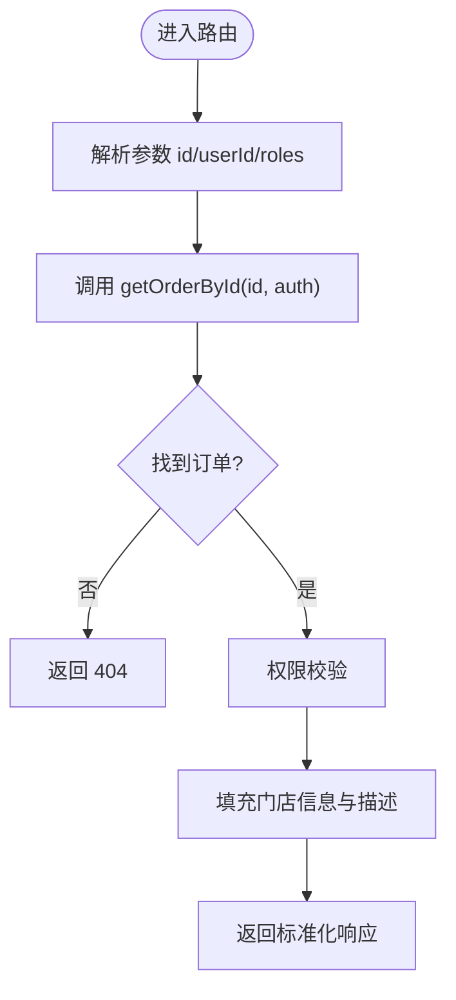
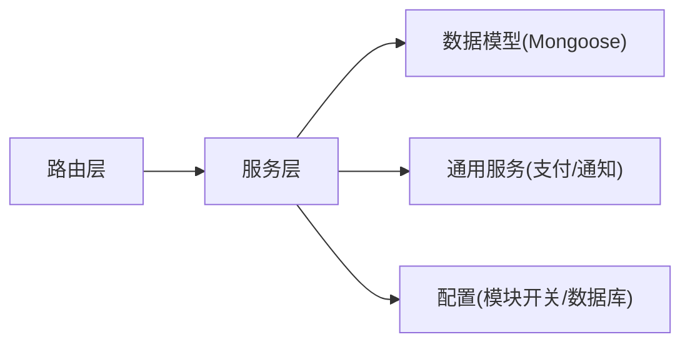

# 模块开发规范

<cite>
**本文引用的文件**   
- [backend/server.js](file://backend/server.js)
- [backend/config/index.js](file://backend/config/index.js)
- [backend/config/database.js](file://backend/config/database.js)
- [backend/config/modules.js](file://backend/config/modules.js)
- [backend/modules/common/middlewares/auth.js](file://backend/modules/common/middlewares/auth.js)
- [backend/modules/common/services/authService.js](file://backend/modules/common/services/authService.js)
- [backend/modules/cleaning/routes.js](file://backend/modules/cleaning/routes.js)
- [backend/modules/cleaning/routes/storeRoutes.js](file://backend/modules/cleaning/routes/storeRoutes.js)
- [backend/modules/cleaning/services/orderService.js](file://backend/modules/cleaning/services/orderService.js)
- [backend/modules/cleaning/services/storeService.js](file://backend/modules/cleaning/services/storeService.js)
- [backend/modules/admin/routes/adminRoutes.js](file://backend/modules/admin/routes/adminRoutes.js)
- [backend/modules/admin/services/adminService.js](file://backend/modules/admin/services/adminService.js)
- [backend/modules/member/routes/memberRoutes.js](file://backend/modules/member/routes/memberRoutes.js)
- [backend/modules/common/services/paymentService.js](file://backend/modules/common/services/paymentService.js)
- [backend/modules/common/services/notificationService.js](file://backend/modules/common/services/notificationService.js)
</cite>

## 目录
1. [引言](#引言)
2. [项目结构](#项目结构)
3. [核心组件](#核心组件)
4. [架构总览](#架构总览)
5. [详细组件分析](#详细组件分析)
6. [依赖关系分析](#依赖关系分析)
7. [性能与可观测性](#性能与可观测性)
8. [代码质量与测试指南](#代码质量与测试指南)
9. [故障排查与调试](#故障排查与调试)
10. [结论](#结论)
11. [附录：模块脚手架模板](#附录模块脚手架模板)

## 引言
本规范面向干洗店管理系统的后端模块开发，目标是建立统一的目录组织、命名约定、API 设计、服务层模式、数据模型最佳实践以及质量保障流程。文档基于现有代码库的实际实现进行提炼，确保可直接落地执行。

## 项目结构
系统采用 Express 模块化架构，按业务域划分模块（如 cleaning、admin、member、common），每个模块内部遵循 routes/services/models 分层；公共能力（认证、支付、通知等）集中在 common 下复用。

图示来源
- [backend/server.js:1-152](file://backend/server.js#L1-L152)
- [backend/modules/cleaning/routes.js:1-120](file://backend/modules/cleaning/routes.js#L1-L120)
- [backend/modules/cleaning/routes/storeRoutes.js:1-60](file://backend/modules/cleaning/routes/storeRoutes.js#L1-L60)
- [backend/modules/admin/routes/adminRoutes.js:1-40](file://backend/modules/admin/routes/adminRoutes.js#L1-L40)
- [backend/modules/member/routes/memberRoutes.js:1-20](file://backend/modules/member/routes/memberRoutes.js#L1-L20)
- [backend/modules/cleaning/services/orderService.js:1-40](file://backend/modules/cleaning/services/orderService.js#L1-L40)
- [backend/modules/cleaning/services/storeService.js:1-40](file://backend/modules/cleaning/services/storeService.js#L1-L40)
- [backend/modules/admin/services/adminService.js:1-40](file://backend/modules/admin/services/adminService.js#L1-L40)
- [backend/modules/common/middlewares/auth.js:1-40](file://backend/modules/common/middlewares/auth.js#L1-L40)
- [backend/modules/common/services/paymentService.js:1-40](file://backend/modules/common/services/paymentService.js#L1-L40)
- [backend/modules/common/services/notificationService.js:1-40](file://backend/modules/common/services/notificationService.js#L1-L40)
- [backend/config/index.js:1-40](file://backend/config/index.js#L1-L40)
- [backend/config/database.js:1-40](file://backend/config/database.js#L1-L40)
- [backend/config/modules.js:1-40](file://backend/config/modules.js#L1-L40)

章节来源
- [backend/server.js:1-152](file://backend/server.js#L1-L152)
- [backend/config/index.js:1-40](file://backend/config/index.js#L1-L40)
- [backend/config/database.js:1-40](file://backend/config/database.js#L1-L40)
- [backend/config/modules.js:1-40](file://backend/config/modules.js#L1-L40)

## 核心组件
- 路由层（routes）
  - 负责 HTTP 接口定义、参数解析、权限校验、错误包装与响应标准化。
  - 示例：清洗订单路由、门店路由、管理员路由、会员路由。
- 服务层（services）
  - 封装业务逻辑、事务边界、外部依赖（支付、通知）、事件发布。
  - 示例：订单服务、门店服务、管理员服务、支付服务、通知服务。
- 数据模型层（models/schema）
  - 使用 Mongoose Schema 定义集合结构与索引，集中维护字段约束与默认值。
  - 示例：Order、Store、User、StorePrice 等。

章节来源
- [backend/modules/cleaning/routes.js:1-120](file://backend/modules/cleaning/routes.js#L1-L120)
- [backend/modules/cleaning/services/orderService.js:1-120](file://backend/modules/cleaning/services/orderService.js#L1-L120)
- [backend/modules/cleaning/services/storeService.js:1-120](file://backend/modules/cleaning/services/storeService.js#L1-L120)
- [backend/modules/admin/services/adminService.js:1-120](file://backend/modules/admin/services/adminService.js#L1-L120)
- [backend/modules/common/services/paymentService.js:1-120](file://backend/modules/common/services/paymentService.js#L1-L120)
- [backend/modules/common/services/notificationService.js:1-120](file://backend/modules/common/services/notificationService.js#L1-L120)

## 架构总览
整体为“Express 入口 → 模块路由 → 领域服务 → 数据模型”的分层架构，配合认证中间件与统一支付/通知能力。

图示来源
- [backend/server.js:1-152](file://backend/server.js#L1-L152)
- [backend/modules/cleaning/routes.js:1-120](file://backend/modules/cleaning/routes.js#L1-L120)
- [backend/modules/cleaning/services/orderService.js:1-120](file://backend/modules/cleaning/services/orderService.js#L1-L120)
- [backend/modules/common/services/paymentService.js:1-120](file://backend/modules/common/services/paymentService.js#L1-L120)
- [backend/modules/common/services/notificationService.js:1-120](file://backend/modules/common/services/notificationService.js#L1-L120)

## 详细组件分析

### 路由设计规范
- RESTful 原则
  - 资源名词复数形式，动词用 HTTP 方法表达：GET/POST/PUT/DELETE。
  - 路径层级体现资源关系，如 /api/cleaning/orders/:id/status。
- 请求参数验证
  - 在路由层做基础必填校验与类型转换，复杂规则下沉到服务层或专用校验器。
  - 对敏感字段（手机号、金额、ID）进行格式校验与范围检查。
- 响应格式标准化
  - 成功：{ success: true, data }
  - 失败：{ success: false, error, message? }
  - 分页：{ list, total, page, pageSize, totalPages }
- 权限控制
  - 通过认证中间件鉴权，结合角色中间件限制访问。
  - 可选认证用于兼容匿名场景（如会员信息）。

章节来源
- [backend/modules/cleaning/routes.js:1-120](file://backend/modules/cleaning/routes.js#L1-L120)
- [backend/modules/cleaning/routes/storeRoutes.js:1-120](file://backend/modules/cleaning/routes/storeRoutes.js#L1-L120)
- [backend/modules/admin/routes/adminRoutes.js:1-120](file://backend/modules/admin/routes/adminRoutes.js#L1-L120)
- [backend/modules/member/routes/memberRoutes.js:1-48](file://backend/modules/member/routes/memberRoutes.js#L1-L48)
- [backend/modules/common/middlewares/auth.js:1-120](file://backend/modules/common/middlewares/auth.js#L1-L120)

### 服务层开发模式
- 职责边界
  - 仅包含业务编排、状态机流转、跨服务调用与事件发布；不直接处理 HTTP。
- 错误处理策略
  - 抛出领域异常（含明确错误码/消息），由路由层捕获并转换为标准 JSON。
  - 对外部依赖失败进行降级与重试（必要时）。
- 日志记录规范
  - 关键路径打点：入参摘要、关键分支、异常堆栈、耗时统计。
  - 避免输出敏感信息（密码、token、完整地址）。
- 事务与一致性
  - 多写操作使用事务或补偿机制；异步通知与事件解耦。
- 幂等与防重
  - 对支付回调、批量操作提供幂等键或去重策略。

章节来源
- [backend/modules/cleaning/services/orderService.js:1-200](file://backend/modules/cleaning/services/orderService.js#L1-L200)
- [backend/modules/cleaning/services/storeService.js:1-120](file://backend/modules/cleaning/services/storeService.js#L1-L120)
- [backend/modules/admin/services/adminService.js:1-120](file://backend/modules/admin/services/adminService.js#L1-L120)
- [backend/modules/common/services/paymentService.js:1-120](file://backend/modules/common/services/paymentService.js#L1-L120)
- [backend/modules/common/services/notificationService.js:1-120](file://backend/modules/common/services/notificationService.js#L1-L120)

### 数据模型设计最佳实践
- Schema 定义
  - 字段类型明确、必填项标注、枚举约束、默认值与时间戳。
  - 嵌套对象与数组需考虑查询与更新复杂度。
- 索引优化
  - 高频查询字段建索引；复合索引覆盖常见过滤条件；地理空间索引按需启用。
- 关联关系处理
  - 优先使用外键引用（storeNo 等稳定标识）减少迁移成本；必要时 populate 或二次查询填充。
- 软删除与审计
  - isDeleted/deletedAt 标记软删；statusHistory 记录状态变更轨迹。

章节来源
- [backend/modules/cleaning/services/orderService.js:30-175](file://backend/modules/cleaning/services/orderService.js#L30-L175)
- [backend/modules/cleaning/services/storeService.js:8-48](file://backend/modules/cleaning/services/storeService.js#L8-L48)
- [backend/modules/admin/services/adminService.js:18-126](file://backend/modules/admin/services/adminService.js#L18-L126)
- [backend/modules/common/services/authService.js:10-60](file://backend/modules/common/services/authService.js#L10-L60)

### 认证与授权
- Token 生成与解析
  - 简化 Base64 编码 token，支持开发与生产环境差异。
- 用户身份合并
  - 支持 openid 与 phone 的跨平台识别与合并策略。
- 角色与权限
  - 基于角色的访问控制（RBAC），区分 admin、store_owner、store_staff、customer。

章节来源
- [backend/modules/common/middlewares/auth.js:1-209](file://backend/modules/common/middlewares/auth.js#L1-L209)
- [backend/modules/common/services/authService.js:1-200](file://backend/modules/common/services/authService.js#L1-L200)

### 支付与通知集成
- 统一支付服务
  - 抽象支付方式（微信/支付宝/银联/余额），统一分账策略。
- 通知服务
  - 模板化消息，多渠道发送（微信/短信/Push/电话），失败隔离。

章节来源
- [backend/modules/common/services/paymentService.js:1-185](file://backend/modules/common/services/paymentService.js#L1-L185)
- [backend/modules/common/services/notificationService.js:1-281](file://backend/modules/common/services/notificationService.js#L1-L281)

### 关键流程时序图

#### 创建订单流程

图示来源
- [backend/modules/cleaning/routes.js:20-45](file://backend/modules/cleaning/routes.js#L20-L45)
- [backend/modules/cleaning/services/orderService.js:177-291](file://backend/modules/cleaning/services/orderService.js#L177-L291)
- [backend/modules/common/services/notificationService.js:180-212](file://backend/modules/common/services/notificationService.js#L180-L212)

#### 支付下单流程

图示来源
- [backend/server.js:410-485](file://backend/server.js#L410-L485)
- [backend/modules/common/services/paymentService.js:24-47](file://backend/modules/common/services/paymentService.js#L24-L47)

#### 获取订单详情流程

图示来源
- [backend/modules/cleaning/routes.js:146-156](file://backend/modules/cleaning/routes.js#L146-L156)
- [backend/modules/cleaning/services/orderService.js:395-516](file://backend/modules/cleaning/services/orderService.js#L395-L516)

## 依赖关系分析
- 模块内耦合
  - 路由层仅依赖服务层与中间件，保持薄控制器。
  - 服务层依赖数据模型与通用服务（支付、通知、事件）。
- 外部依赖
  - 数据库：MongoDB（主）+ MySQL（可选），通过配置中心切换。
  - 第三方：微信支付/支付宝/银联（占位实现可扩展）。
- 潜在循环依赖
  - 避免服务间互相 require；通过事件总线或消息队列解耦。

图示来源
- [backend/server.js:1-152](file://backend/server.js#L1-L152)
- [backend/config/index.js:1-40](file://backend/config/index.js#L1-L40)
- [backend/config/modules.js:1-40](file://backend/config/modules.js#L1-L40)

章节来源
- [backend/server.js:1-152](file://backend/server.js#L1-L152)
- [backend/config/index.js:1-40](file://backend/config/index.js#L1-L40)
- [backend/config/modules.js:1-40](file://backend/config/modules.js#L1-L40)

## 性能与可观测性
- 查询优化
  - 合理使用 lean() 与 select() 减少对象开销；分页 skip/limit 控制。
  - 复合索引覆盖常用过滤组合（userId+createdAt、storeId+status）。
- 缓存策略
  - 热点配置（模块开关、价格模板）短期缓存；注意失效与回源。
- 异步与批处理
  - 通知与事件异步发送；批量操作分批提交。
- 监控指标
  - 接口耗时、错误率、数据库慢查询、支付成功率、通知投递成功率。

[本节为通用指导，无需特定文件来源]

## 代码质量与测试指南
- 代码质量检查清单
  - 命名：路由/服务/模型文件使用小驼峰或语义化名称；常量与枚举使用大写。
  - 分层：路由不写业务逻辑；服务不含 HTTP 细节；模型只定义结构与索引。
  - 错误：统一错误码与消息；禁止吞异常；关键路径有日志。
  - 安全：输入校验、最小权限、敏感信息脱敏。
  - 可维护：函数单一职责、注释清晰、依赖注入或单例合理。
- 单元测试编写指南
  - 用例覆盖：正常路径、边界条件、异常分支、权限拒绝。
  - 断言要点：返回值结构、状态变更、副作用（通知/事件）是否触发。
  - 模拟外部依赖：支付、通知、数据库连接。
  - 工具建议：Jest/Mocha + Supertest；Mock 数据库与服务。

[本节为通用指导，无需特定文件来源]

## 故障排查与调试
- 常见问题定位
  - 端口占用：启动时检测并提示解决方案。
  - 数据库连接：初始化失败打印详细错误；优雅关闭释放连接。
  - 未捕获异常：全局处理器记录堆栈并安全退出。
- 调试技巧
  - 环境变量：NODE_ENV、DB_TYPE、MONGODB_URI 等。
  - 日志分级：开发环境更详细，生产环境精简敏感信息。
  - 健康检查：/api/health 快速判断服务可用性。

章节来源
- [backend/server.js:602-702](file://backend/server.js#L602-L702)
- [backend/config/index.js:108-167](file://backend/config/index.js#L108-L167)

## 结论
本规范以现有代码为基础，明确了模块目录与命名约定、RESTful API 设计、服务层模式、数据模型最佳实践、质量与测试要求，以及性能与排障方法。遵循该规范可提升系统可维护性与扩展性，支撑多品类与连锁化管理演进。

[本节为总结，无需特定文件来源]

## 附录：模块脚手架模板
以下为新增模块的标准目录与文件清单，便于快速搭建新业务能力。

- 目录结构
  - modules/<module_name>/
    - routes/
      - index.js          # 模块路由入口，注册所有接口
      - publicRoutes.js   # 公开接口（无需认证）
      - protectedRoutes.js# 需要认证的接口
    - services/
      - <entity>Service.js # 实体服务（CRUD、状态机、外部调用）
      - helper.js          # 模块内辅助函数
    - models/
      - schema.js          # Mongoose Schema 与索引
      - index.js           # 模型导出
    - middlewares/
      - guard.js           # 模块级守卫（如功能开关）
    - tests/
      - unit.test.js       # 单元测试
      - e2e.test.js        # 端到端测试
    - README.md            # 模块说明与接口清单

- 路由层模板要点
  - 使用 express.Router 组织；统一错误处理与响应格式。
  - 使用 optionalAuth/authMiddleware/requireRoles 控制权限。
  - 参数校验前置，复杂校验下沉至服务层。

- 服务层模板要点
  - 类封装方法，单一职责；抛出自定义错误。
  - 外部依赖通过构造函数或模块导入注入。
  - 关键路径记录结构化日志。

- 数据模型模板要点
  - 字段类型与约束明确；必要索引声明。
  - 软删除与审计字段预留。
  - 避免过度嵌套，平衡查询与更新复杂度。

- 单元测试模板要点
  - 针对服务方法编写用例；Mock 数据库与外部服务。
  - 断言返回值结构与副作用。

[本节为模板说明，无需特定文件来源]