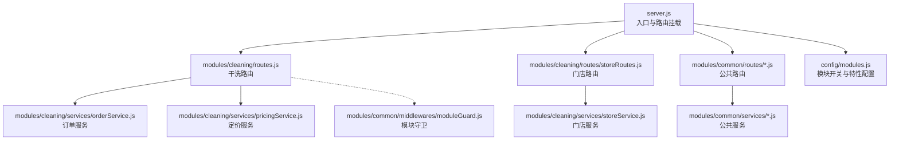
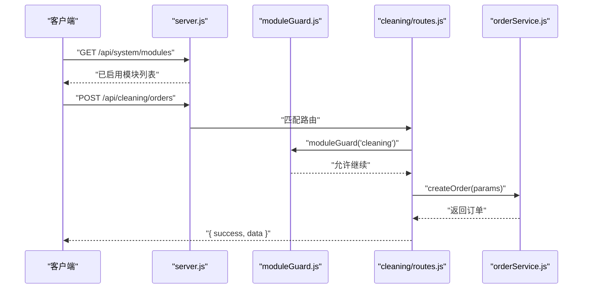
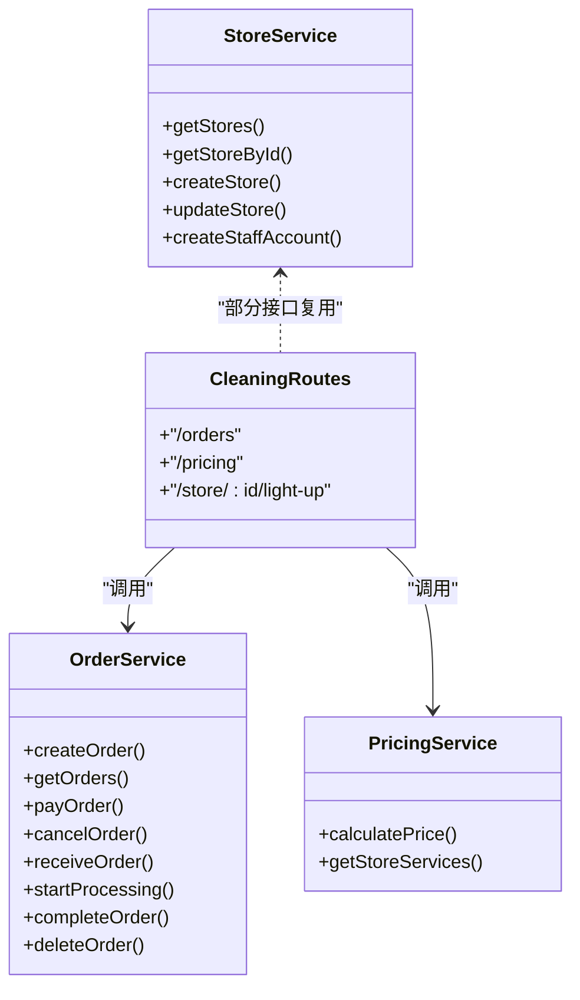
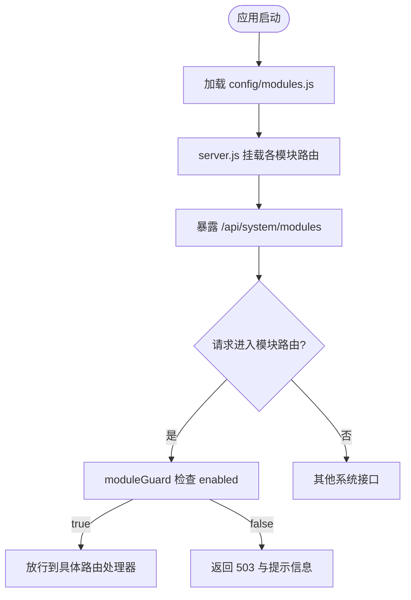
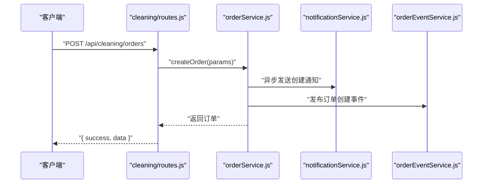
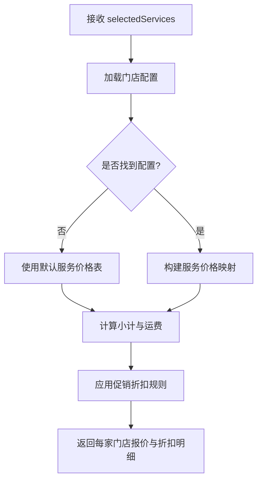
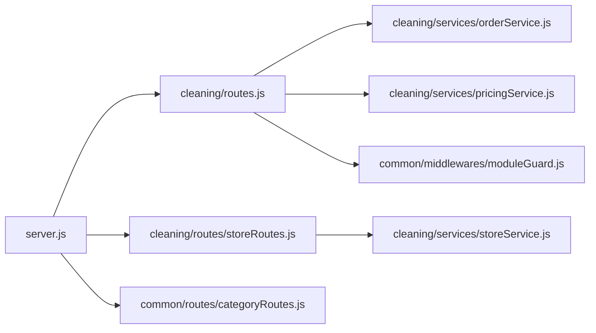

# 模块目录结构规范

<cite>
**本文引用的文件**   
- [backend/server.js](file://backend/server.js)
- [backend/config/modules.js](file://backend/config/modules.js)
- [backend/modules/common/middlewares/moduleGuard.js](file://backend/modules/common/middlewares/moduleGuard.js)
- [backend/modules/cleaning/routes.js](file://backend/modules/cleaning/routes.js)
- [backend/modules/cleaning/services/orderService.js](file://backend/modules/cleaning/services/orderService.js)
- [backend/modules/cleaning/services/pricingService.js](file://backend/modules/cleaning/services/pricingService.js)
- [backend/modules/cleaning/services/storeService.js](file://backend/modules/cleaning/services/storeService.js)
- [backend/modules/cleaning/routes/storeRoutes.js](file://backend/modules/cleaning/routes/storeRoutes.js)
- [backend/modules/common/routes/categoryRoutes.js](file://backend/modules/common/routes/categoryRoutes.js)
</cite>

## 目录
1. [引言](#引言)
2. [项目结构](#项目结构)
3. [核心组件](#核心组件)
4. [架构总览](#架构总览)
5. [详细组件分析](#详细组件分析)
6. [依赖关系分析](#依赖关系分析)
7. [性能与扩展性考虑](#性能与扩展性考虑)
8. [故障排查指南](#故障排查指南)
9. [结论](#结论)
10. [附录：新模块创建清单与模板](#附录新模块创建清单与模板)

## 引言
本规范面向干洗店管理系统的后端模块化开发，明确标准业务模块的目录组织方式、职责划分与命名约定。重点说明路由层（routes）、服务层（services）、模型层（models）的职责边界与最佳实践，并以 cleaning 模块为例提供完整模板。同时解释模块配置 modules.js 的作用与动态加载机制，以及中间件、工具函数等辅助文件的组织规范，最后给出新模块创建的步骤与检查清单。

## 项目结构
后端采用“按功能域分模块”的组织方式，每个业务模块遵循 routes / services / models 分层；公共能力沉淀在 common 中，由 server.js 统一挂载路由。

图示来源
- [backend/server.js:1-150](file://backend/server.js#L1-L150)
- [backend/modules/cleaning/routes.js:1-50](file://backend/modules/cleaning/routes.js#L1-L50)
- [backend/modules/cleaning/routes/storeRoutes.js:1-50](file://backend/modules/cleaning/routes/storeRoutes.js#L1-L50)
- [backend/modules/common/routes/categoryRoutes.js:1-45](file://backend/modules/common/routes/categoryRoutes.js#L1-L45)
- [backend/modules/cleaning/services/orderService.js:1-120](file://backend/modules/cleaning/services/orderService.js#L1-L120)
- [backend/modules/cleaning/services/pricingService.js:1-60](file://backend/modules/cleaning/services/pricingService.js#L1-L60)
- [backend/modules/cleaning/services/storeService.js:1-60](file://backend/modules/cleaning/services/storeService.js#L1-L60)
- [backend/config/modules.js:1-120](file://backend/config/modules.js#L1-L120)
- [backend/modules/common/middlewares/moduleGuard.js:1-40](file://backend/modules/common/middlewares/moduleGuard.js#L1-L40)

章节来源
- [backend/README.md:18-60](file://backend/README.md#L18-L60)

## 核心组件
- 路由层（routes）
  - 职责：定义 HTTP 接口路径、方法、参数校验与响应格式；调用服务层完成业务处理；组合中间件实现鉴权、模块守卫等横切逻辑。
  - 命名约定：以领域名词复数或单数保持一致，如 orders、stores；子路由按资源维度拆分，如 storeRoutes.js。
- 服务层（services）
  - 职责：封装核心业务逻辑、事务编排、跨服务调用、事件发布；不直接操作请求/响应对象。
  - 命名约定：以领域+Service 命名，如 orderService.js、storeService.js。
- 模型层（models）
  - 职责：定义数据模型、字段约束、索引与关联；在清洗模块中，模型定义内聚于服务文件中（如 orderService.js），便于快速迭代。
  - 命名约定：Schema 类名与文件名一致，如 Store、Order。
- 中间件（middlewares）
  - 职责：模块启用检查、认证授权、RBAC、日志、限流等横切关注点。
  - 命名约定：以功能命名，如 moduleGuard.js、auth.js、rbac.js。
- 公共能力（common）
  - 职责：多品类通用 API、支付、通知、信用、配送等共享服务与路由。
  - 命名约定：按能力域组织，如 paymentService.js、notificationService.js。

章节来源
- [backend/modules/cleaning/routes.js:1-120](file://backend/modules/cleaning/routes.js#L1-L120)
- [backend/modules/cleaning/services/orderService.js:1-120](file://backend/modules/cleaning/services/orderService.js#L1-L120)
- [backend/modules/cleaning/services/storeService.js:1-120](file://backend/modules/cleaning/services/storeService.js#L1-L120)
- [backend/modules/common/middlewares/moduleGuard.js:1-84](file://backend/modules/common/middlewares/moduleGuard.js#L1-L84)

## 架构总览
系统启动时，server.js 初始化数据库并挂载各模块路由；模块通过 config/modules.js 控制启用状态，moduleGuard 中间件对未启用的模块返回友好提示。

图示来源
- [backend/server.js:55-110](file://backend/server.js#L55-L110)
- [backend/modules/common/middlewares/moduleGuard.js:1-40](file://backend/modules/common/middlewares/moduleGuard.js#L1-L40)
- [backend/modules/cleaning/routes.js:1-40](file://backend/modules/cleaning/routes.js#L1-L40)
- [backend/modules/cleaning/services/orderService.js:177-291](file://backend/modules/cleaning/services/orderService.js#L177-L291)

## 详细组件分析

### 干洗模块（cleaning）标准结构
- 目录组织
  - routes：HTTP 接口定义，包含订单、定价、门店子路由等
  - services：订单、定价、门店等业务服务
  - models：当前实现将 Schema 内聚在服务文件中（如 orderService.js、storeService.js）
- 关键文件与职责
  - routes.js：订单生命周期、定价计算、智能灯条控制、取件方式选择等
  - orderService.js：订单创建、查询、支付、取消、收件、处理、完成、删除等
  - pricingService.js：价格计算与服务项组装（含促销折扣）
  - storeService.js：门店 CRUD、员工管理、默认服务集
  - routes/storeRoutes.js：门店公开与管理接口

图示来源
- [backend/modules/cleaning/routes.js:1-120](file://backend/modules/cleaning/routes.js#L1-L120)
- [backend/modules/cleaning/services/orderService.js:177-291](file://backend/modules/cleaning/services/orderService.js#L177-L291)
- [backend/modules/cleaning/services/pricingService.js:1-158](file://backend/modules/cleaning/services/pricingService.js#L1-L158)
- [backend/modules/cleaning/services/storeService.js:51-144](file://backend/modules/cleaning/services/storeService.js#L51-L144)

章节来源
- [backend/modules/cleaning/routes.js:1-120](file://backend/modules/cleaning/routes.js#L1-L120)
- [backend/modules/cleaning/services/orderService.js:177-291](file://backend/modules/cleaning/services/orderService.js#L177-L291)
- [backend/modules/cleaning/services/pricingService.js:1-158](file://backend/modules/cleaning/services/pricingService.js#L1-L158)
- [backend/modules/cleaning/services/storeService.js:1-144](file://backend/modules/cleaning/services/storeService.js#L1-L144)
- [backend/modules/cleaning/routes/storeRoutes.js:1-120](file://backend/modules/cleaning/routes/storeRoutes.js#L1-L120)

### 模块配置与动态加载机制
- modules.js 作用
  - 集中管理各业务模块的启用/禁用、版本、名称、图标、消息、功能开关、支付分账比例、通知模板等
  - 为前端展示“已启用/待开放模块”提供数据源
- 动态加载机制
  - server.js 通过 getEnabledModules()/getModuleConfig() 读取配置，并在 /api/system/modules 暴露
  - 模块路由入口处使用 moduleGuard('xxx') 进行运行时启用检查，未启用返回 503 友好提示

图示来源
- [backend/config/modules.js:1-120](file://backend/config/modules.js#L1-L120)
- [backend/server.js:55-110](file://backend/server.js#L55-L110)
- [backend/modules/common/middlewares/moduleGuard.js:1-40](file://backend/modules/common/middlewares/moduleGuard.js#L1-L40)

章节来源
- [backend/config/modules.js:1-203](file://backend/config/modules.js#L1-L203)
- [backend/server.js:55-110](file://backend/server.js#L55-L110)
- [backend/modules/common/middlewares/moduleGuard.js:1-84](file://backend/modules/common/middlewares/moduleGuard.js#L1-L84)

### 订单创建流程（示例时序）

图示来源
- [backend/modules/cleaning/routes.js:24-42](file://backend/modules/cleaning/routes.js#L24-L42)
- [backend/modules/cleaning/services/orderService.js:177-291](file://backend/modules/cleaning/services/orderService.js#L177-L291)

章节来源
- [backend/modules/cleaning/routes.js:24-42](file://backend/modules/cleaning/routes.js#L24-L42)
- [backend/modules/cleaning/services/orderService.js:177-291](file://backend/modules/cleaning/services/orderService.js#L177-L291)

### 定价计算流程（示例流程图）

图示来源
- [backend/modules/cleaning/routes.js:730-800](file://backend/modules/cleaning/routes.js#L730-L800)

章节来源
- [backend/modules/cleaning/routes.js:730-800](file://backend/modules/cleaning/routes.js#L730-L800)

## 依赖关系分析
- 入口依赖
  - server.js 导入并挂载 cleaning、recycle、rental、common、admin、member、store 等路由
- 模块内部依赖
  - cleaning/routes.js 依赖 orderService、pricingService、moduleGuard、auth 中间件
  - storeRoutes.js 依赖 storeService、auth 中间件
- 公共能力依赖
  - categoryRoutes.js 依赖 categoryService（公共品类服务）

图示来源
- [backend/server.js:20-150](file://backend/server.js#L20-L150)
- [backend/modules/cleaning/routes.js:1-20](file://backend/modules/cleaning/routes.js#L1-L20)
- [backend/modules/cleaning/routes/storeRoutes.js:1-20](file://backend/modules/cleaning/routes/storeRoutes.js#L1-L20)
- [backend/modules/common/routes/categoryRoutes.js:1-20](file://backend/modules/common/routes/categoryRoutes.js#L1-L20)

章节来源
- [backend/server.js:20-150](file://backend/server.js#L20-L150)

## 性能与扩展性考虑
- 路由层保持轻量，仅做参数解析与转发，避免复杂逻辑
- 服务层可引入缓存、批量查询、分页与投影以减少数据库压力
- 模型层合理设置索引（如 userId、storeId、status、customerPhone）提升查询性能
- 模块间通过中间件与配置解耦，新增模块无需改动已有代码
- 异步通知与事件发布不应阻塞主流程

[本节为通用建议，不直接分析具体文件]

## 故障排查指南
- 模块未启用导致 503
  - 现象：访问 /api/cleaning/* 返回 503 且 message 为“服务暂未开放”
  - 排查：确认 config/modules.js 中 cleaning.enabled 是否为 true；查看 moduleGuard 返回体
- 路由冲突或未命中
  - 现象：搜索接口 /orders/search/:keyword 被 /orders/:id 捕获
  - 排查：确保更具体的路由定义在通配符之前
- 权限错误
  - 现象：无权查看此订单/无权取消
  - 排查：检查 authMiddleware 注入的 roles、userId、storeId 是否正确

章节来源
- [backend/modules/common/middlewares/moduleGuard.js:25-40](file://backend/modules/common/middlewares/moduleGuard.js#L25-L40)
- [backend/modules/cleaning/routes.js:88-140](file://backend/modules/cleaning/routes.js#L88-L140)
- [backend/modules/cleaning/services/orderService.js:434-443](file://backend/modules/cleaning/services/orderService.js#L434-L443)

## 结论
本规范明确了干洗店管理系统后端的标准模块目录结构与职责边界，结合 cleaning 模块的实际实现给出了可操作的模板与最佳实践。通过 modules.js 与 moduleGuard 的组合，实现了模块的动态启用与优雅降级；通过清晰的三层分层与中间件体系，提升了可维护性与可扩展性。

[本节为总结性内容，不直接分析具体文件]

## 附录：新模块创建清单与模板

- 目录模板
  - backend/modules/<module>/
    - routes/
      - index.js（或 mainRoutes.js）
      - subRoutes.js（可选，按子资源拆分）
    - services/
      - xxxService.js
    - models/
      - xxxModel.js（可选，若模型独立）
    - middlewares/
      - xxxGuard.js（可选，模块级中间件）
    - utils/
      - helper.js（可选，工具函数）
    - README.md（可选，模块说明）

- 必要步骤
  1) 在 config/modules.js 中添加模块配置（enabled、name、version、icon、message 等）
  2) 在 modules/<module>/routes/index.js 中定义路由，并在顶部使用 moduleGuard('<module>')
  3) 在 services/ 中实现业务逻辑，保持无副作用与幂等设计
  4) 如需模型，可在 models/ 中定义或在 services 中内聚 Schema
  5) 在 server.js 中挂载模块路由（app.use('/api/<module>', router)）
  6) 编写单元测试与集成测试用例，覆盖正常与异常分支
  7) 更新文档与变更日志

- 检查清单
  - 模块已在 modules.js 中声明并正确设置 enabled
  - 路由入口已使用 moduleGuard 保护
  - 路由命名符合 RESTful 风格，避免与现有路由冲突
  - 服务层不包含请求/响应对象，仅处理业务
  - 模型层具备必要索引与约束
  - 错误处理统一返回 { success, error/message }
  - 敏感信息不落盘，日志脱敏
  - 对外部依赖（支付、通知、MQTT）失败有降级策略
  - 接口具备幂等性与防重放措施（必要时）
  - 文档与示例请求已更新

章节来源
- [backend/config/modules.js:1-120](file://backend/config/modules.js#L1-L120)
- [backend/modules/cleaning/routes.js:1-20](file://backend/modules/cleaning/routes.js#L1-L20)
- [backend/server.js:96-150](file://backend/server.js#L96-L150)