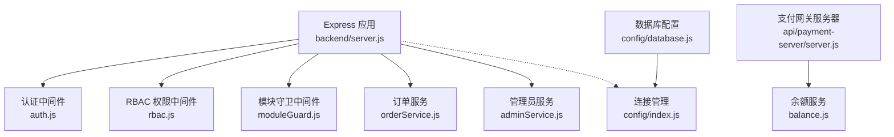
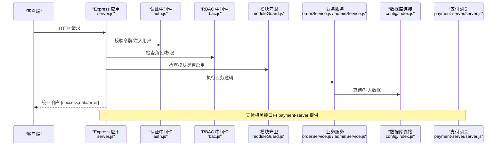
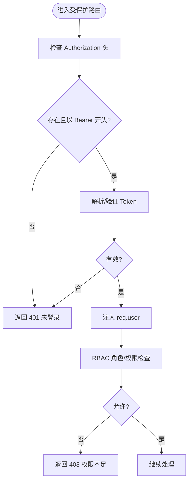
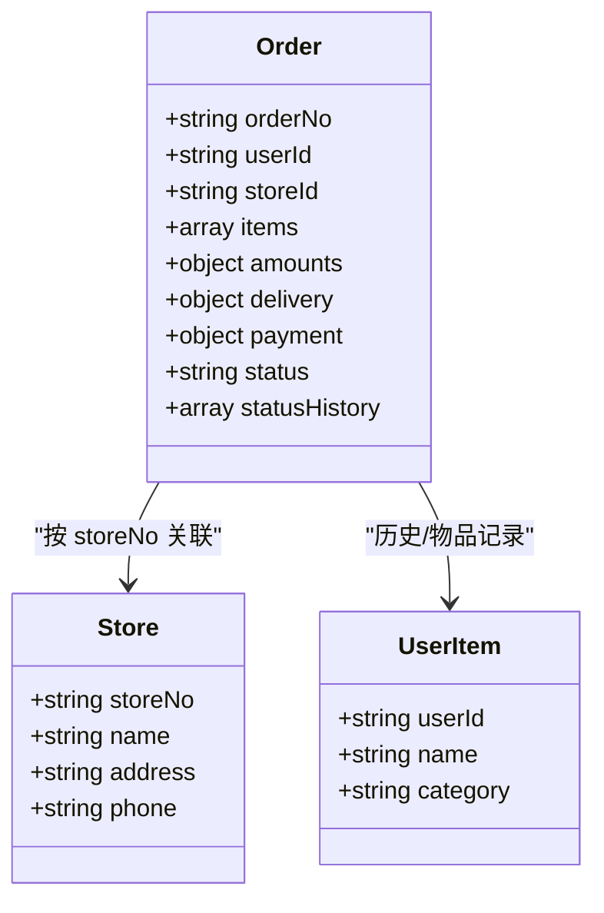
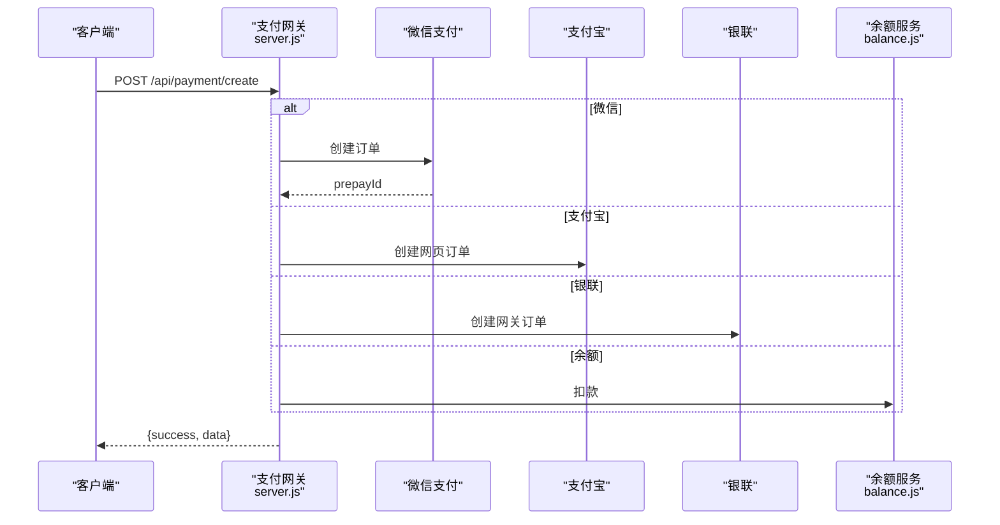
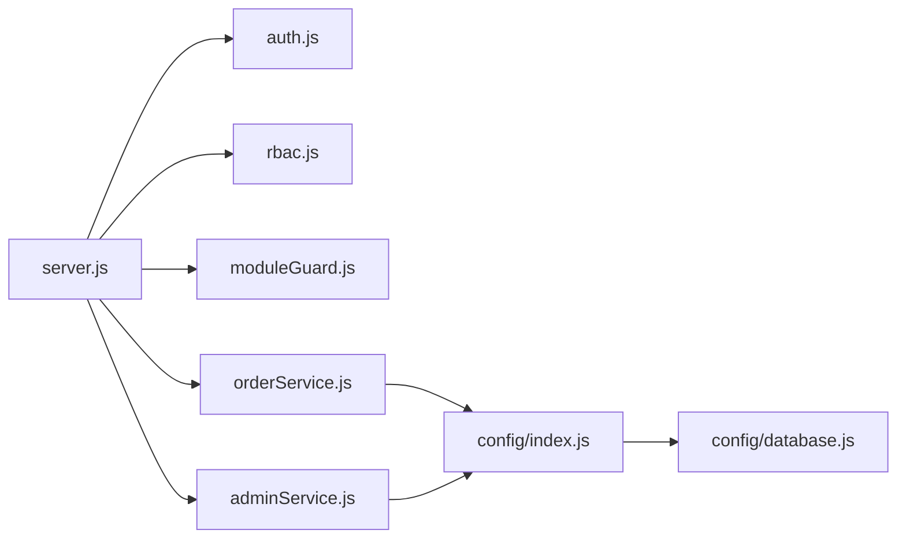

# 编码规范

<cite>
**本文引用的文件**   
- [backend/server.js](file://backend/server.js)
- [backend/config/index.js](file://backend/config/index.js)
- [backend/config/database.js](file://backend/config/database.js)
- [backend/modules/common/middlewares/auth.js](file://backend/modules/common/middlewares/auth.js)
- [backend/modules/common/middlewares/rbac.js](file://backend/modules/common/middlewares/rbac.js)
- [backend/modules/common/middlewares/moduleGuard.js](file://backend/modules/common/middlewares/moduleGuard.js)
- [backend/modules/cleaning/services/orderService.js](file://backend/modules/cleaning/services/orderService.js)
- [backend/modules/admin/services/adminService.js](file://backend/modules/admin/services/adminService.js)
- [api/payment-server/server.js](file://api/payment-server/server.js)
- [api/payment-server/balance.js](file://api/payment-server/balance.js)
</cite>

## 目录
1. [引言](#引言)
2. [项目结构](#项目结构)
3. [核心组件](#核心组件)
4. [架构总览](#架构总览)
5. [详细组件分析](#详细组件分析)
6. [依赖分析](#依赖分析)
7. [性能考虑](#性能考虑)
8. [故障排查指南](#故障排查指南)
9. [结论](#结论)
10. [附录](#附录)

## 引言
本规范面向干洗店管理系统的后端与前端 JavaScript/Node.js 代码，统一约定代码风格、错误处理策略、API 响应格式、数据库操作最佳实践、异步编程模式、安全检查要点以及 ESLint 配置建议。目标是在现有模块化架构基础上，提升一致性、可维护性与安全性。

## 项目结构
系统采用 Express 模块化路由与服务分层：
- 入口与全局中间件：server.js
- 配置与连接管理：config/index.js、config/database.js
- 通用中间件：认证、RBAC、模块守卫
- 业务服务层：订单、管理员等
- 支付子系统：独立 server.js 聚合多种支付方式

图表来源
- [backend/server.js:34-151](file://backend/server.js#L34-L151)
- [backend/modules/common/middlewares/auth.js:10-138](file://backend/modules/common/middlewares/auth.js#L10-L138)
- [backend/modules/common/middlewares/rbac.js:34-92](file://backend/modules/common/middlewares/rbac.js#L34-L92)
- [backend/modules/common/middlewares/moduleGuard.js:13-42](file://backend/modules/common/middlewares/moduleGuard.js#L13-L42)
- [backend/modules/cleaning/services/orderService.js:177-291](file://backend/modules/cleaning/services/orderService.js#L177-L291)
- [backend/modules/admin/services/adminService.js:9-169](file://backend/modules/admin/services/adminService.js#L9-L169)
- [api/payment-server/server.js:18-31](file://api/payment-server/server.js#L18-L31)
- [api/payment-server/balance.js:184-218](file://api/payment-server/balance.js#L184-L218)
- [backend/config/database.js:6-64](file://backend/config/database.js#L6-L64)
- [backend/config/index.js:19-88](file://backend/config/index.js#L19-L88)

章节来源
- [backend/server.js:34-151](file://backend/server.js#L34-L151)
- [backend/config/index.js:19-88](file://backend/config/index.js#L19-L88)
- [backend/config/database.js:6-64](file://backend/config/database.js#L6-L64)

## 核心组件
- 认证与授权
  - 认证中间件：解析 Authorization 头，支持开发模式 mock token，注入 req.user。
  - RBAC 中间件：基于角色与权限表进行访问控制。
  - 模块守卫：按模块开关返回友好提示或继续处理。
- 数据访问
  - Mongoose Schema 定义在 orderService.js、adminService.js 中，集中建模用户、订单、门店等实体。
  - 连接管理提供 MongoDB/MySQL 双栈初始化与事务封装（MySQL）。
- API 响应
  - 统一成功/失败结构，包含 success、data/error/message 字段；分页包含 page/pageSize/total/totalPages。
- 异步与错误
  - 广泛使用 async/await；全局错误处理器捕获未处理异常并返回标准化错误。

章节来源
- [backend/modules/common/middlewares/auth.js:10-138](file://backend/modules/common/middlewares/auth.js#L10-L138)
- [backend/modules/common/middlewares/rbac.js:34-92](file://backend/modules/common/middlewares/rbac.js#L34-L92)
- [backend/modules/common/middlewares/moduleGuard.js:13-42](file://backend/modules/common/middlewares/moduleGuard.js#L13-L42)
- [backend/modules/cleaning/services/orderService.js:177-291](file://backend/modules/cleaning/services/orderService.js#L177-L291)
- [backend/modules/admin/services/adminService.js:9-169](file://backend/modules/admin/services/adminService.js#L9-L169)
- [backend/config/index.js:140-155](file://backend/config/index.js#L140-L155)
- [backend/server.js:602-609](file://backend/server.js#L602-L609)

## 架构总览
下图展示请求从 Express 到中间件、服务层、数据库的调用链，以及支付子系统的集成点。

图表来源
- [backend/server.js:34-151](file://backend/server.js#L34-L151)
- [backend/modules/common/middlewares/auth.js:10-138](file://backend/modules/common/middlewares/auth.js#L10-L138)
- [backend/modules/common/middlewares/rbac.js:34-92](file://backend/modules/common/middlewares/rbac.js#L34-L92)
- [backend/modules/common/middlewares/moduleGuard.js:13-42](file://backend/modules/common/middlewares/moduleGuard.js#L13-L42)
- [backend/modules/cleaning/services/orderService.js:177-291](file://backend/modules/cleaning/services/orderService.js#L177-L291)
- [backend/modules/admin/services/adminService.js:9-169](file://backend/modules/admin/services/adminService.js#L9-L169)
- [backend/config/index.js:19-88](file://backend/config/index.js#L19-L88)
- [api/payment-server/server.js:18-31](file://api/payment-server/server.js#L18-L31)

## 详细组件分析

### 组件A：认证与授权（auth + rbac）
- 职责
  - auth：解析 Bearer Token，支持开发模式 mock，填充 req.user。
  - rbac：基于角色与权限配置进行细粒度访问控制。
- 关键流程
  - 提取 Authorization → 解析/验证 → 注入用户信息 → 可选角色/权限校验。
- 错误处理
  - 未登录/过期返回 401，权限不足返回 403，均遵循统一响应格式。

图表来源
- [backend/modules/common/middlewares/auth.js:10-138](file://backend/modules/common/middlewares/auth.js#L10-L138)
- [backend/modules/common/middlewares/rbac.js:34-92](file://backend/modules/common/middlewares/rbac.js#L34-L92)

章节来源
- [backend/modules/common/middlewares/auth.js:10-138](file://backend/modules/common/middlewares/auth.js#L10-L138)
- [backend/modules/common/middlewares/rbac.js:34-92](file://backend/modules/common/middlewares/rbac.js#L34-L92)

### 组件B：订单服务（orderService）
- 职责
  - 订单创建、查询、支付、取消、删除、状态流转等。
  - 定义 Order、Store、UserItem 的 Mongoose Schema。
- 数据模型关系
  - Order 关联 Store（通过 storeNo），含 items、amounts、delivery、payment、statusHistory 等。
- 查询优化
  - 使用 lean()、索引字段（orderNo、userId、storeId、status）、并行 countDocuments 与 find。
- 事务与一致性
  - 当前实现多为单文档更新；跨集合事务需结合业务扩展。

图表来源
- [backend/modules/cleaning/services/orderService.js:13-175](file://backend/modules/cleaning/services/orderService.js#L13-L175)

章节来源
- [backend/modules/cleaning/services/orderService.js:177-291](file://backend/modules/cleaning/services/orderService.js#L177-L291)
- [backend/modules/cleaning/services/orderService.js:296-389](file://backend/modules/cleaning/services/orderService.js#L296-L389)
- [backend/modules/cleaning/services/orderService.js:395-516](file://backend/modules/cleaning/services/orderService.js#L395-L516)

### 组件C：管理员服务（adminService）
- 职责
  - 仪表盘统计、用户/门店/连锁管理、申请审批等。
- 数据模型
  - User、Order、Store、Chain 的 Schema 定义与索引策略。
- 统计与聚合
  - 使用 aggregate 计算趋势、分布、来源统计等。

章节来源
- [backend/modules/admin/services/adminService.js:9-169](file://backend/modules/admin/services/adminService.js#L9-L169)
- [backend/modules/admin/services/adminService.js:174-322](file://backend/modules/admin/services/adminService.js#L174-L322)

### 组件D：支付网关（payment-server）
- 职责
  - 统一支付入口、查询、关闭、回调处理、余额与结算。
- 响应格式
  - 统一 {success, data/error}，错误包含 message。
- 事务与幂等
  - 回调处理需保证幂等与签名校验；余额扣减需原子性保障。

图表来源
- [api/payment-server/server.js:42-174](file://api/payment-server/server.js#L42-L174)
- [api/payment-server/balance.js:184-218](file://api/payment-server/balance.js#L184-L218)

章节来源
- [api/payment-server/server.js:42-174](file://api/payment-server/server.js#L42-L174)
- [api/payment-server/server.js:180-240](file://api/payment-server/server.js#L180-L240)
- [api/payment-server/server.js:312-350](file://api/payment-server/server.js#L312-L350)
- [api/payment-server/balance.js:184-218](file://api/payment-server/balance.js#L184-L218)

## 依赖分析
- 模块耦合
  - server.js 作为装配中心，依赖各模块路由与中间件。
  - 服务层依赖 config 提供的数据库连接能力。
- 外部依赖
  - Express、Mongoose、mysql2、bcryptjs、uuid、dotenv 等。
- 潜在循环
  - 避免在服务层反向 require 路由；保持“路由→服务→数据”单向依赖。

图表来源
- [backend/server.js:34-151](file://backend/server.js#L34-L151)
- [backend/modules/cleaning/services/orderService.js:177-291](file://backend/modules/cleaning/services/orderService.js#L177-L291)
- [backend/modules/admin/services/adminService.js:9-169](file://backend/modules/admin/services/adminService.js#L9-L169)
- [backend/config/index.js:19-88](file://backend/config/index.js#L19-L88)
- [backend/config/database.js:6-64](file://backend/config/database.js#L6-L64)

章节来源
- [backend/server.js:34-151](file://backend/server.js#L34-L151)
- [backend/config/index.js:19-88](file://backend/config/index.js#L19-L88)
- [backend/config/database.js:6-64](file://backend/config/database.js#L6-L64)

## 性能考虑
- 查询优化
  - 为高频过滤字段建立索引（如 orderNo、userId、storeId、status）。
  - 使用 lean() 减少对象开销；并行执行 countDocuments 与 find。
- 连接池与超时
  - MySQL 连接池大小、获取超时、空闲回收；MongoDB 最大连接数与选择超时。
- 缓存与降级
  - 对热点配置（模块开关、门店列表）引入缓存；第三方支付失败时降级为模拟支付（仅开发环境）。
- 事件与通知
  - 通知发送与事件发布采用异步非阻塞，避免影响主链路延迟。

章节来源
- [backend/modules/cleaning/services/orderService.js:296-389](file://backend/modules/cleaning/services/orderService.js#L296-L389)
- [backend/config/database.js:11-48](file://backend/config/database.js#L11-L48)
- [backend/server.js:543-596](file://backend/server.js#L543-L596)

## 故障排查指南
- 全局错误处理
  - Express 错误中间件统一返回 {success:false,error,message}。
  - 进程级 uncaughtException/unhandledRejection 记录日志并优雅退出或保持运行。
- 常见错误码
  - 401 未登录/过期；403 权限不足；404 资源不存在；500 内部错误。
- 定位步骤
  - 查看控制台日志前缀（如 [订单]、[支付]、[通知中心]）。
  - 核对请求参数与鉴权头；确认模块是否启用。
  - 检查数据库连接状态与索引命中情况。

章节来源
- [backend/server.js:602-609](file://backend/server.js#L602-L609)
- [backend/server.js:680-691](file://backend/server.js#L680-L691)
- [backend/modules/common/middlewares/auth.js:131-137](file://backend/modules/common/middlewares/auth.js#L131-L137)
- [backend/modules/common/middlewares/rbac.js:34-92](file://backend/modules/common/middlewares/rbac.js#L34-L92)

## 结论
本规范围绕现有代码结构与实现，给出统一的编码风格、错误处理、API 响应、数据库与异步编程、安全与质量工具建议。建议在团队内推广并纳入 CI 检查，持续收敛差异，提升稳定性与可维护性。

## 附录

### 一、JavaScript 代码风格约定
- 命名
  - 变量/函数：小驼峰 camelCase；常量：全大写 SNAKE_CASE；类名：大驼峰 PascalCase。
  - 文件名：小写短横线 kebab-case；模块导出使用具名导出为主。
- 函数定义
  - 优先使用 async function；避免深层嵌套回调；将副作用与纯逻辑分离。
- 注释
  - 公共 API 与服务方法使用 JSDoc 风格注释，说明参数、返回值与异常。
- 导入与组织
  - 分组导入：第三方库、内部模块、相对路径模块分块；避免循环依赖。
- 字符串与模板
  - 使用模板字符串拼接；禁止直接拼接 SQL；敏感信息不打印。
- 数组与对象
  - 使用解构赋值；避免修改入参；必要时深拷贝复杂对象。
- 错误与日志
  - 抛出具体 Error 实例；统一错误码与消息；日志带上下文标识。

### 二、错误处理策略
- 异常抛出
  - 业务异常使用 new Error('明确原因')；区分参数错误、权限错误、资源不存在。
- 错误日志
  - 结构化日志：时间戳、模块前缀、请求ID、关键参数摘要。
- 用户友好响应
  - 统一格式：{ success, data?, error?, message? }；HTTP 状态码与语义一致。
- 全局兜底
  - Express 错误中间件捕获未处理异常；进程级异常处理器防止崩溃。

章节来源
- [backend/server.js:602-609](file://backend/server.js#L602-L609)
- [backend/server.js:680-691](file://backend/server.js#L680-L691)

### 三、API 响应标准化格式
- 成功响应
  - { success: true, data: ... }
- 错误响应
  - { success: false, error: '错误码', message: '人类可读描述' }
- 分页结构
  - { list/data: [...], total: number, page: number, pageSize: number, totalPages: number }
- 示例参考
  - 订单列表返回包含 page/pageSize/total/totalPages。
  - 余额交易记录返回 page/limit/totalPages。

章节来源
- [backend/modules/cleaning/services/orderService.js:388-389](file://backend/modules/cleaning/services/orderService.js#L388-L389)
- [api/payment-server/balance.js:208-218](file://api/payment-server/balance.js#L208-L218)

### 四、数据库操作最佳实践（Mongoose/MySQL）
- Schema 设计
  - 明确类型与默认值；常用查询字段加索引；枚举字段使用 enum。
- 查询优化
  - 使用 lean()；避免 N+1 查询；批量填充；合理 skip/limit。
- 事务处理
  - MySQL 使用 transaction 封装；MongoDB 多文档事务按需开启。
- 软删除与审计
  - isDeleted/deletedAt 标记；statusHistory 记录变更轨迹。

章节来源
- [backend/modules/cleaning/services/orderService.js:13-175](file://backend/modules/cleaning/services/orderService.js#L13-L175)
- [backend/modules/admin/services/adminService.js:17-169](file://backend/modules/admin/services/adminService.js#L17-L169)
- [backend/config/index.js:140-155](file://backend/config/index.js#L140-L155)

### 五、异步编程模式（Promise/async-await）
- 推荐
  - 全部使用 async/await；错误用 try/catch 包裹；并发用 Promise.all。
- 防抖与限流
  - 对外部依赖调用增加重试与超时；避免长尾请求阻塞。
- 事件与回调
  - 第三方回调需幂等校验与签名验证；结果落库后返回统一响应。

章节来源
- [api/payment-server/server.js:42-174](file://api/payment-server/server.js#L42-L174)
- [api/payment-server/server.js:312-350](file://api/payment-server/server.js#L312-L350)

### 六、代码安全检查要点
- SQL 注入防护
  - 禁止字符串拼接 SQL；使用参数化查询或 ORM 查询构建器。
- XSS 防范
  - 服务端输出转义；前端渲染使用安全库；限制富文本输入。
- 身份与权限
  - 强制鉴权中间件；最小权限原则；敏感接口二次校验。
- 敏感信息
  - 不在日志中打印密码、token、手机号等；环境变量管理密钥。
- 输入校验
  - 白名单校验；长度/格式/范围限制；拒绝非法类型。

### 七、ESLint 配置建议与质量工具集成
- 基础规则
  - 严格模式、禁止 with、强制分号、缩进 2 空格、单引号、行宽 120。
- Node/Express 专项
  - 强制 await 处理 Promise；禁止 console.log 在生产；错误必须被捕获。
- 插件推荐
  - eslint-plugin-node、eslint-plugin-security、eslint-plugin-import。
- 集成方案
  - package.json scripts 添加 lint 命令；Git Hooks 或 CI 阶段执行；IDE 实时提示。