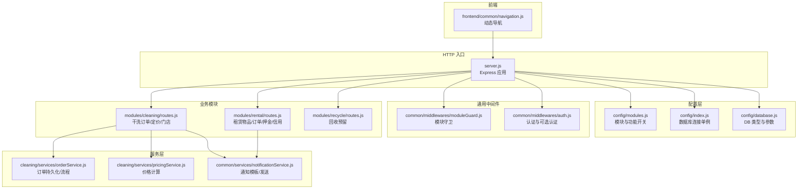
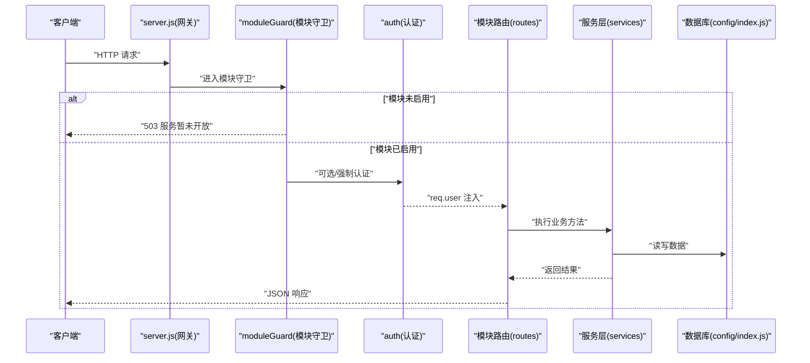
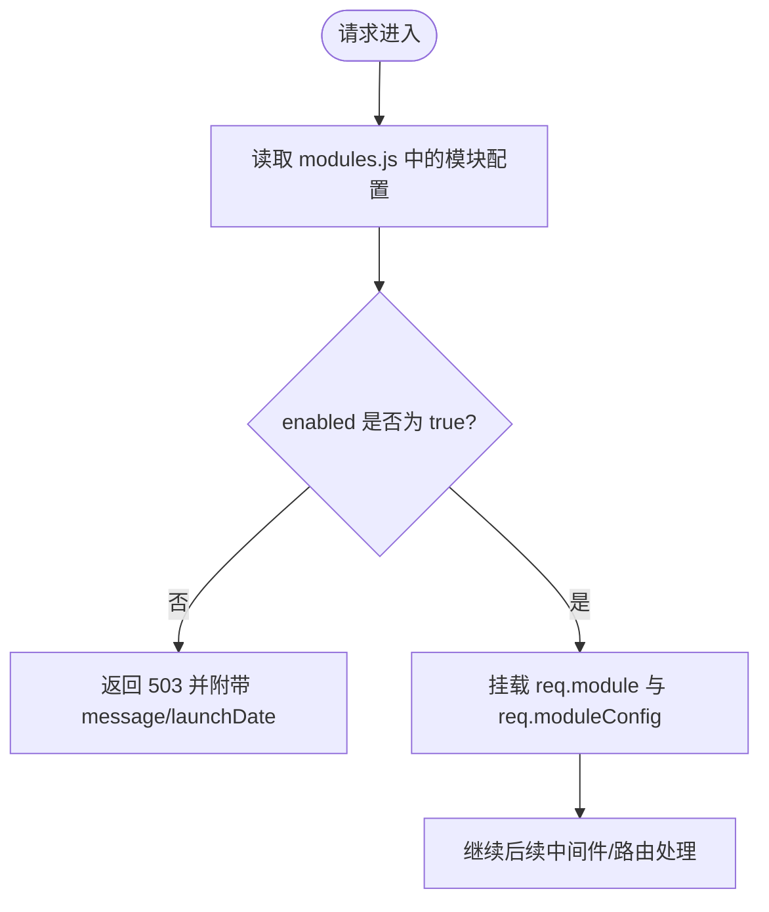
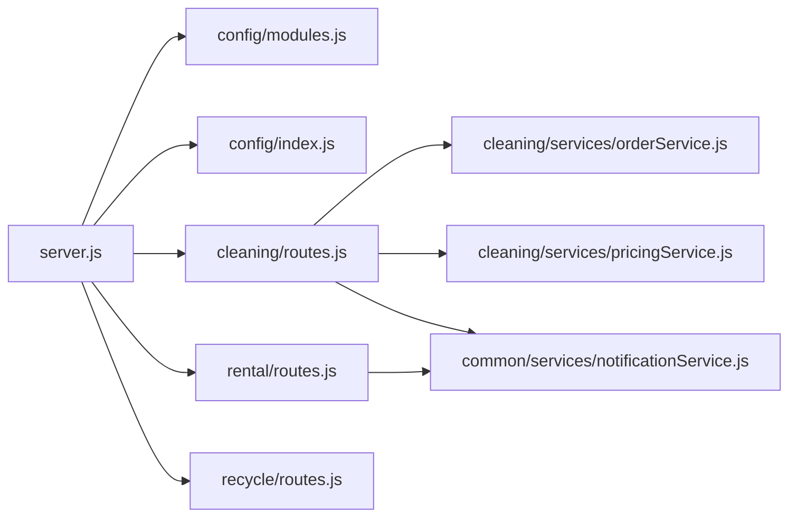

# 模块架构设计

<cite>
**本文引用的文件**   
- [backend/server.js](file://backend/server.js)
- [backend/config/modules.js](file://backend/config/modules.js)
- [backend/config/index.js](file://backend/config/index.js)
- [backend/config/database.js](file://backend/config/database.js)
- [backend/modules/common/middlewares/moduleGuard.js](file://backend/modules/common/middlewares/moduleGuard.js)
- [backend/modules/common/middlewares/auth.js](file://backend/modules/common/middlewares/auth.js)
- [backend/modules/cleaning/routes.js](file://backend/modules/cleaning/routes.js)
- [backend/modules/rental/routes.js](file://backend/modules/rental/routes.js)
- [backend/modules/recycle/routes.js](file://backend/modules/recycle/routes.js)
- [backend/modules/cleaning/services/orderService.js](file://backend/modules/cleaning/services/orderService.js)
- [backend/modules/cleaning/services/pricingService.js](file://backend/modules/cleaning/services/pricingService.js)
- [backend/modules/common/services/notificationService.js](file://backend/modules/common/services/notificationService.js)
- [frontend/common/navigation.js](file://frontend/common/navigation.js)
</cite>

## 目录
1. [引言](#引言)
2. [项目结构](#项目结构)
3. [核心组件](#核心组件)
4. [架构总览](#架构总览)
5. [详细组件分析](#详细组件分析)
6. [依赖关系分析](#依赖关系分析)
7. [性能与可扩展性](#性能与可扩展性)
8. [故障排查指南](#故障排查指南)
9. [结论](#结论)
10. [附录](#附录)

## 引言
本文件面向干洗店管理系统的“模块化架构”进行系统化说明，重点覆盖以下目标：
- 插件化机制、动态加载系统与模块隔离策略
- modules.js 配置文件的结构与语义（模块元数据、功能开关、依赖与支付分账）
- 模块生命周期管理（启动发现、运行时启用/禁用）
- 模块间通信协议与数据共享方案（事件总线模式、API 网关集成）
- 中间件架构（基于 moduleGuard.js 的权限控制与服务路由）
- 架构图与组件关系图（展示依赖与数据流向）
- 模块版本管理与兼容性处理策略

## 项目结构
系统采用 Express 作为 HTTP 入口，业务按品类划分为多个模块（cleaning、recycle、rental 等），并通过统一的模块守卫中间件进行能力开关与访问控制。前端通过系统接口获取模块状态，动态渲染导航与页面能力。



图示来源
- [backend/server.js:1-150](file://backend/server.js#L1-L150)
- [backend/config/modules.js:1-203](file://backend/config/modules.js#L1-L203)
- [backend/config/index.js:1-167](file://backend/config/index.js#L1-L167)
- [backend/config/database.js:1-65](file://backend/config/database.js#L1-L65)
- [backend/modules/common/middlewares/moduleGuard.js:1-84](file://backend/modules/common/middlewares/moduleGuard.js#L1-L84)
- [backend/modules/common/middlewares/auth.js:1-209](file://backend/modules/common/middlewares/auth.js#L1-L209)
- [backend/modules/cleaning/routes.js:1-120](file://backend/modules/cleaning/routes.js#L1-L120)
- [backend/modules/rental/routes.js:1-156](file://backend/modules/rental/routes.js#L1-L156)
- [backend/modules/recycle/routes.js:1-39](file://backend/modules/recycle/routes.js#L1-L39)
- [backend/modules/cleaning/services/orderService.js:1-200](file://backend/modules/cleaning/services/orderService.js#L1-L200)
- [backend/modules/cleaning/services/pricingService.js:1-158](file://backend/modules/cleaning/services/pricingService.js#L1-L158)
- [backend/modules/common/services/notificationService.js:1-200](file://backend/modules/common/services/notificationService.js#L1-L200)
- [frontend/common/navigation.js:1-64](file://frontend/common/navigation.js#L1-L64)

章节来源
- [backend/server.js:1-150](file://backend/server.js#L1-L150)
- [backend/config/modules.js:1-203](file://backend/config/modules.js#L1-L203)
- [backend/config/index.js:1-167](file://backend/config/index.js#L1-L167)
- [backend/config/database.js:1-65](file://backend/config/database.js#L1-L65)
- [backend/modules/common/middlewares/moduleGuard.js:1-84](file://backend/modules/common/middlewares/moduleGuard.js#L1-L84)
- [backend/modules/common/middlewares/auth.js:1-209](file://backend/modules/common/middlewares/auth.js#L1-L209)
- [backend/modules/cleaning/routes.js:1-120](file://backend/modules/cleaning/routes.js#L1-L120)
- [backend/modules/rental/routes.js:1-156](file://backend/modules/rental/routes.js#L1-L156)
- [backend/modules/recycle/routes.js:1-39](file://backend/modules/recycle/routes.js#L1-L39)
- [backend/modules/cleaning/services/orderService.js:1-200](file://backend/modules/cleaning/services/orderService.js#L1-L200)
- [backend/modules/cleaning/services/pricingService.js:1-158](file://backend/modules/cleaning/services/pricingService.js#L1-L158)
- [backend/modules/common/services/notificationService.js:1-200](file://backend/modules/common/services/notificationService.js#L1-L200)
- [frontend/common/navigation.js:1-64](file://frontend/common/navigation.js#L1-L64)

## 核心组件
- 模块配置中心（modules.js）
  - 定义模块元数据（名称、版本、图标、分类）、功能开关（配送、会员、积分、优惠券、押金、信用）、支付分账规则与消息模板集合。
- 模块守卫中间件（moduleGuard.js）
  - 提供模块级访问控制：未启用返回 503 并附带提示与上线时间；已启用将模块信息挂载到请求上下文。
- 认证中间件（auth.js）
  - 支持 Bearer Token 解析、开发环境 mock 用户、可选认证（optionalAuth）与角色校验工厂。
- 业务模块路由
  - cleaning：订单全生命周期、定价、门店配置同步、智能灯条控制等。
  - rental：租赁物品、订单、发货/归还、押金与信用评估。
  - recycle：回收能力预留，当前统一返回“即将上线”。
- 服务层
  - orderService：订单模型、状态机、支付/通知联动、取件码与物流字段。
  - pricingService：价格计算与促销折扣（在清洗模块中复用）。
  - notificationService：多业务模板、多渠道发送。
- 前端动态导航（navigation.js）
  - 调用 /api/system/modules 拉取模块状态，动态构建菜单可见性与路径。

章节来源
- [backend/config/modules.js:1-203](file://backend/config/modules.js#L1-L203)
- [backend/modules/common/middlewares/moduleGuard.js:1-84](file://backend/modules/common/middlewares/moduleGuard.js#L1-L84)
- [backend/modules/common/middlewares/auth.js:1-209](file://backend/modules/common/middlewares/auth.js#L1-L209)
- [backend/modules/cleaning/routes.js:1-120](file://backend/modules/cleaning/routes.js#L1-L120)
- [backend/modules/rental/routes.js:1-156](file://backend/modules/rental/routes.js#L1-L156)
- [backend/modules/recycle/routes.js:1-39](file://backend/modules/recycle/routes.js#L1-L39)
- [backend/modules/cleaning/services/orderService.js:1-200](file://backend/modules/cleaning/services/orderService.js#L1-L200)
- [backend/modules/cleaning/services/pricingService.js:1-158](file://backend/modules/cleaning/services/pricingService.js#L1-L158)
- [backend/modules/common/services/notificationService.js:1-200](file://backend/modules/common/services/notificationService.js#L1-L200)
- [frontend/common/navigation.js:1-64](file://frontend/common/navigation.js#L1-L64)

## 架构总览
系统以 Express 为 API 网关，集中注册各模块路由；模块能力由 modules.js 驱动，moduleGuard 在路由层做拦截；业务逻辑下沉至 services；通知与支付等横切能力通过 common 服务暴露。



图示来源
- [backend/server.js:1-150](file://backend/server.js#L1-L150)
- [backend/modules/common/middlewares/moduleGuard.js:1-84](file://backend/modules/common/middlewares/moduleGuard.js#L1-L84)
- [backend/modules/common/middlewares/auth.js:1-209](file://backend/modules/common/middlewares/auth.js#L1-L209)
- [backend/config/index.js:1-167](file://backend/config/index.js#L1-L167)

## 详细组件分析

### 模块配置与元数据（modules.js）
- 模块元数据
  - 每个模块包含 enabled、version、name、nameEn、category、icon、message、launchDate 等字段，用于前端展示与后端控制。
- 功能开关
  - delivery、membership、points、coupon、deposit、credit 等特性可独立开启/关闭，部分特性含默认值或阈值。
- 支付分账
  - 平台/门店/用户/品牌等多方分账比例，支持不同业务线（回收、租赁）差异化分账。
- 消息模板
  - 按业务域组织模板键名，便于通知服务渲染与渠道分发。

章节来源
- [backend/config/modules.js:1-203](file://backend/config/modules.js#L1-L203)

### 模块守卫与路由（moduleGuard.js + routes）
- 模块守卫
  - 对指定模块进行启用检查，未启用返回 503 并携带友好文案与上线日期；已启用则将模块信息挂载到 req.module 与 req.moduleConfig。
- 路由装配
  - server.js 将各模块路由挂载到统一前缀（如 /api/cleaning、/api/rental、/api/recycle），并在系统接口 /api/system/modules 暴露模块清单与功能开关。



图示来源
- [backend/modules/common/middlewares/moduleGuard.js:1-84](file://backend/modules/common/middlewares/moduleGuard.js#L1-L84)
- [backend/server.js:1-150](file://backend/server.js#L1-L150)
- [backend/config/modules.js:1-203](file://backend/config/modules.js#L1-L203)

章节来源
- [backend/modules/common/middlewares/moduleGuard.js:1-84](file://backend/modules/common/middlewares/moduleGuard.js#L1-L84)
- [backend/server.js:1-150](file://backend/server.js#L1-L150)

### 认证与授权（auth.js）
- 支持 Bearer Token 解析与开发环境 mock 用户（dev-admin、dev-chain、mock_token）。
- optionalAuth 允许匿名访问但尽量注入用户上下文，便于跨平台识别（openid）。
- requireRoles 工厂用于按角色限制访问。

章节来源
- [backend/modules/common/middlewares/auth.js:1-209](file://backend/modules/common/middlewares/auth.js#L1-L209)

### 干洗模块（cleaning）
- 路由职责
  - 订单创建/查询/取消/删除、状态流转（收件/处理/完成/取件/配送）、取件方式选择、跑腿服务商选择、支付配送费、扫码取件、批量取货、智能灯条控制、定价与门店配置同步等。
- 服务层
  - orderService 维护订单模型与状态机，集成支付与通知；pricingService 提供价格计算与促销折扣。
- 模块守卫
  - 所有清洗相关路由均受 moduleGuard('cleaning') 保护。

```mermaid
classDiagram
class CleaningRoutes {
"+POST /orders"
"+GET /orders"
"+PUT /orders/ : id/status"
"+POST /orders/ : id/pay"
"+POST /store/ : storeId/light-up"
}
class OrderService {
"+createOrder()"
"+getOrders()"
"+updateOrderStatus()"
"+processPayment()"
}
class PricingService {
"+calculatePrice()"
"+getStoreServices()"
}
CleaningRoutes --> OrderService : "调用"
CleaningRoutes --> PricingService : "调用"
```

图示来源
- [backend/modules/cleaning/routes.js:1-120](file://backend/modules/cleaning/routes.js#L1-L120)
- [backend/modules/cleaning/services/orderService.js:1-200](file://backend/modules/cleaning/services/orderService.js#L1-L200)
- [backend/modules/cleaning/services/pricingService.js:1-158](file://backend/modules/cleaning/services/pricingService.js#L1-L158)

章节来源
- [backend/modules/cleaning/routes.js:1-120](file://backend/modules/cleaning/routes.js#L1-L120)
- [backend/modules/cleaning/services/orderService.js:1-200](file://backend/modules/cleaning/services/orderService.js#L1-L200)
- [backend/modules/cleaning/services/pricingService.js:1-158](file://backend/modules/cleaning/services/pricingService.js#L1-L158)

### 租赁模块（rental）
- 路由职责
  - 租赁物品列表/详情、订单创建/查询/详情、发货/确认收货/发起归还/确认归还、押金支付/退款、信用评估。
- 双向跑腿模型
  - 第一程：门店→用户；第二程：用户→门店。
- 模块守卫
  - 所有租赁路由受 moduleGuard('rental') 保护。

章节来源
- [backend/modules/rental/routes.js:1-156](file://backend/modules/rental/routes.js#L1-L156)

### 回收模块（recycle）
- 当前为预留实现，所有接口返回“即将上线”，受 moduleGuard('recycle') 保护。

章节来源
- [backend/modules/recycle/routes.js:1-39](file://backend/modules/recycle/routes.js#L1-L39)

### 通知服务（notificationService.js）
- 模板体系
  - 按业务域组织模板键名（如 cleaning.order_completed），支持多渠道（微信、短信、推送、电话）。
- 使用方式
  - 服务层在关键状态变更时调用 send(userId, templateKey, params) 触发通知。

章节来源
- [backend/modules/common/services/notificationService.js:1-200](file://backend/modules/common/services/notificationService.js#L1-L200)

### 前端动态导航（navigation.js）
- 行为
  - 调用 /api/system/modules 获取模块状态，缓存后构建主导航与子项可见性，失败降级到默认配置。
- 与后端联动
  - 通过 system.modules 接口统一获取 enabledModules、modules、features 与版本号。

章节来源
- [frontend/common/navigation.js:1-64](file://frontend/common/navigation.js#L1-L64)
- [backend/server.js:55-82](file://backend/server.js#L55-L82)

## 依赖关系分析
- 入口依赖
  - server.js 依赖 config/modules.js、config/index.js、各模块路由与中间件。
- 模块内依赖
  - cleaning.routes → orderService/pricingService → notificationService/paymentService。
  - rental.routes → rentalService（内部）→ notificationService。
- 配置依赖
  - database.js 提供 MySQL/MongoDB 双引擎配置；config/index.js 封装连接池与事务。



图示来源
- [backend/server.js:1-150](file://backend/server.js#L1-L150)
- [backend/config/modules.js:1-203](file://backend/config/modules.js#L1-L203)
- [backend/config/index.js:1-167](file://backend/config/index.js#L1-L167)
- [backend/modules/cleaning/routes.js:1-120](file://backend/modules/cleaning/routes.js#L1-L120)
- [backend/modules/rental/routes.js:1-156](file://backend/modules/rental/routes.js#L1-L156)
- [backend/modules/recycle/routes.js:1-39](file://backend/modules/recycle/routes.js#L1-L39)
- [backend/modules/cleaning/services/orderService.js:1-200](file://backend/modules/cleaning/services/orderService.js#L1-L200)
- [backend/modules/cleaning/services/pricingService.js:1-158](file://backend/modules/cleaning/services/pricingService.js#L1-L158)
- [backend/modules/common/services/notificationService.js:1-200](file://backend/modules/common/services/notificationService.js#L1-L200)

章节来源
- [backend/server.js:1-150](file://backend/server.js#L1-L150)
- [backend/config/modules.js:1-203](file://backend/config/modules.js#L1-L203)
- [backend/config/index.js:1-167](file://backend/config/index.js#L1-L167)
- [backend/modules/cleaning/routes.js:1-120](file://backend/modules/cleaning/routes.js#L1-L120)
- [backend/modules/rental/routes.js:1-156](file://backend/modules/rental/routes.js#L1-L156)
- [backend/modules/recycle/routes.js:1-39](file://backend/modules/recycle/routes.js#L1-L39)
- [backend/modules/cleaning/services/orderService.js:1-200](file://backend/modules/cleaning/services/orderService.js#L1-L200)
- [backend/modules/cleaning/services/pricingService.js:1-158](file://backend/modules/cleaning/services/pricingService.js#L1-L158)
- [backend/modules/common/services/notificationService.js:1-200](file://backend/modules/common/services/notificationService.js#L1-L200)

## 性能与可扩展性
- 模块发现与动态加载
  - 当前采用静态导入与显式挂载路由的方式，配合 modules.js 的 enabled 开关实现“软隔离”。如需热插拔，可在 server.js 中引入动态 require 与路由注册器，结合模块目录扫描与版本校验。
- 中间件链优化
  - 将高频鉴权与模块守卫前置，减少无效路由匹配成本；对只读接口启用缓存头（如 status 轮询接口已在清洗模块设置 no-store）。
- 数据库连接
  - config/index.js 提供连接池与事务封装，建议在高并发场景下根据负载调整 pool.max 与超时参数。
- 通知与异步任务
  - 通知发送应解耦为异步队列（如 Redis/RabbitMQ），避免阻塞主请求链路。

[本节为通用指导，不直接分析具体文件]

## 故障排查指南
- 模块不可用
  - 现象：请求返回 503，错误码 MODULE_NOT_ENABLED，附带 message 与 launchDate。
  - 排查：检查 modules.js 对应模块 enabled 字段与 message/launchDate。
- 认证失败
  - 现象：401 需要登录或登录过期。
  - 排查：确认 Authorization 头格式、Token 是否有效、开发环境 mock 标记是否正确。
- 端口冲突/进程异常
  - 现象：EADDRINUSE 或未捕获异常导致退出。
  - 排查：查看 server.js 的错误处理器日志，释放占用端口或修复异常。
- 数据库连接失败
  - 现象：初始化阶段报错。
  - 排查：核对 database.js 与 .env 环境变量，确认 MongoDB/MySQL 可达。

章节来源
- [backend/modules/common/middlewares/moduleGuard.js:1-84](file://backend/modules/common/middlewares/moduleGuard.js#L1-L84)
- [backend/modules/common/middlewares/auth.js:1-209](file://backend/modules/common/middlewares/auth.js#L1-L209)
- [backend/server.js:600-702](file://backend/server.js#L600-L702)
- [backend/config/index.js:1-167](file://backend/config/index.js#L1-L167)
- [backend/config/database.js:1-65](file://backend/config/database.js#L1-L65)

## 结论
本系统通过 modules.js 集中管控模块能力，借助 moduleGuard 实现模块级隔离与可控发布；Express 作为 API 网关聚合各模块路由，服务层承载核心业务逻辑，通知与支付等横切能力通过 common 服务复用。前端通过系统接口动态适配能力，形成“配置驱动 + 中间件治理 + 服务分层”的模块化架构。未来可在保持现有契约的前提下，演进为更完善的插件化与动态加载体系。

[本节为总结性内容，不直接分析具体文件]

## 附录

### 模块生命周期管理（从启动到运行）
- 启动期
  - server.js 初始化数据库、加载模块路由、打印已启用/待开放模块清单。
- 运行期
  - 请求进入 → moduleGuard 校验模块启用 → auth 注入用户上下文 → 路由 → 服务层 → 数据库/外部服务 → 响应。
- 动态启用/禁用
  - 修改 modules.js 中对应模块 enabled 字段，重启服务即可生效；前端通过 /api/system/modules 实时感知变化。

章节来源
- [backend/server.js:1-150](file://backend/server.js#L1-L150)
- [backend/config/modules.js:1-203](file://backend/config/modules.js#L1-L203)
- [frontend/common/navigation.js:1-64](file://frontend/common/navigation.js#L1-L64)

### 模块间通信与数据共享
- 事件总线模式
  - 当前通过通知服务（notificationService）在各业务节点广播事件，可按需扩展为内存事件总线或消息队列。
- API 网关集成
  - server.js 作为统一入口，对外暴露 /api/* 路由；系统接口 /api/system/modules 提供模块能力清单供前端消费。

章节来源
- [backend/modules/common/services/notificationService.js:1-200](file://backend/modules/common/services/notificationService.js#L1-L200)
- [backend/server.js:55-82](file://backend/server.js#L55-L82)

### 中间件架构（moduleGuard + auth）
- moduleGuard
  - 负责模块启用检查与上下文挂载。
- auth
  - 负责身份验证、可选认证与角色校验。
- 组合使用
  - 路由层按需组合 moduleGuard 与 auth，确保访问安全与能力可控。

章节来源
- [backend/modules/common/middlewares/moduleGuard.js:1-84](file://backend/modules/common/middlewares/moduleGuard.js#L1-L84)
- [backend/modules/common/middlewares/auth.js:1-209](file://backend/modules/common/middlewares/auth.js#L1-L209)

### 模块版本管理与兼容性策略
- 版本字段
  - modules.js 中每个模块具备 version 字段，server.js 在 /api/system/modules 返回 VERSION 与 modules.version，便于前端兼容判断。
- 兼容性处理
  - 前端可根据模块版本与 enabled 状态决定 UI 展示与 API 调用；后端可通过 message/launchDate 引导用户预期。
- 升级建议
  - 新增模块或大版本变更时，优先以 enabled=false 灰度发布，逐步打开流量；同时保留旧版 API 兼容层直至下线。

章节来源
- [backend/config/modules.js:1-203](file://backend/config/modules.js#L1-L203)
- [backend/server.js:55-82](file://backend/server.js#L55-L82)