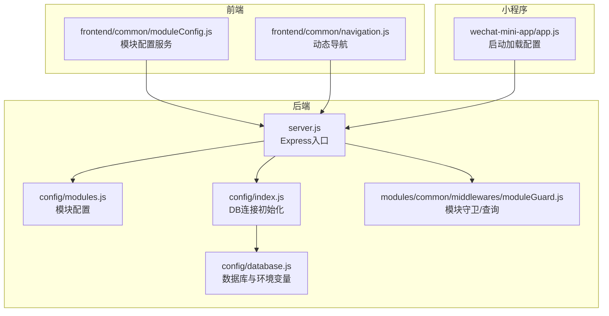
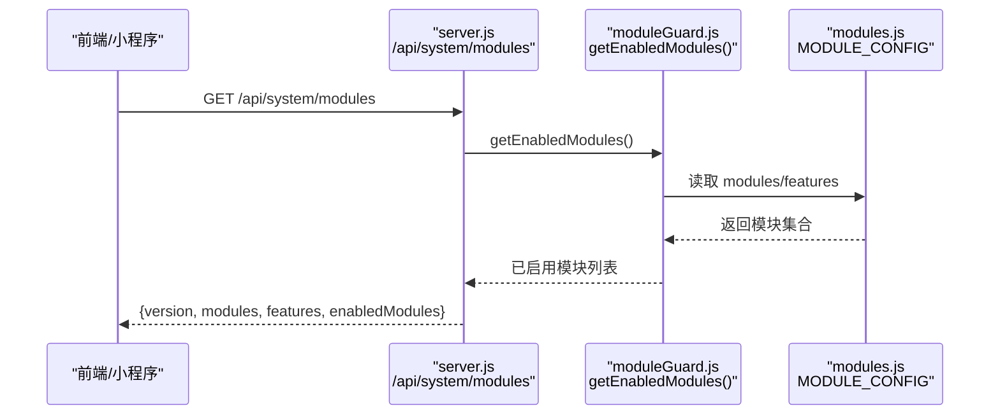
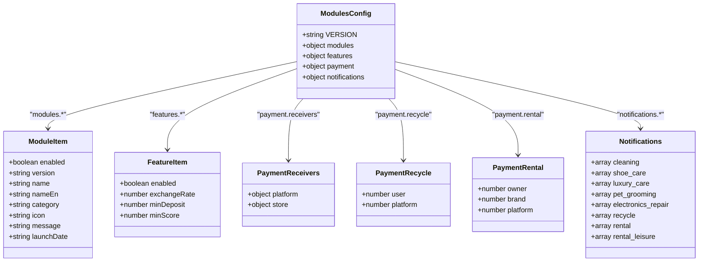
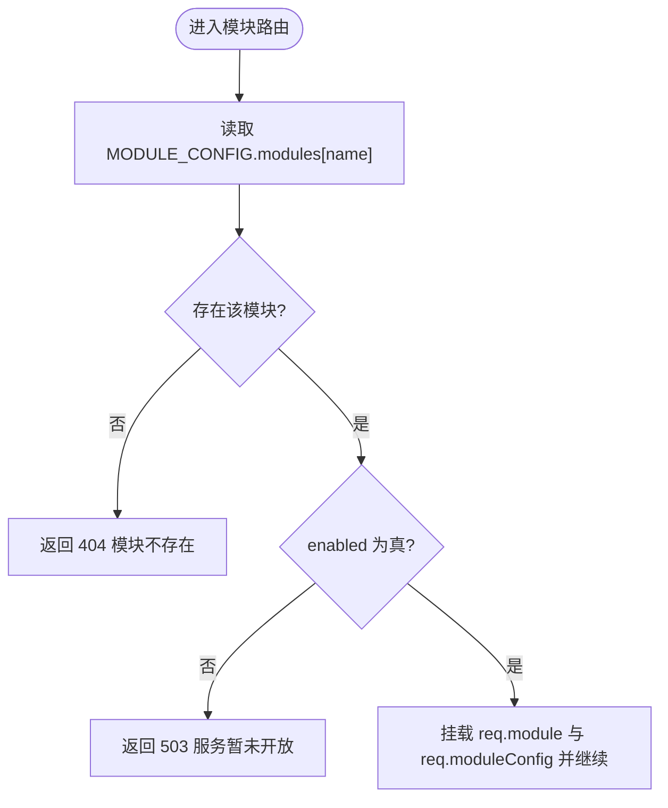
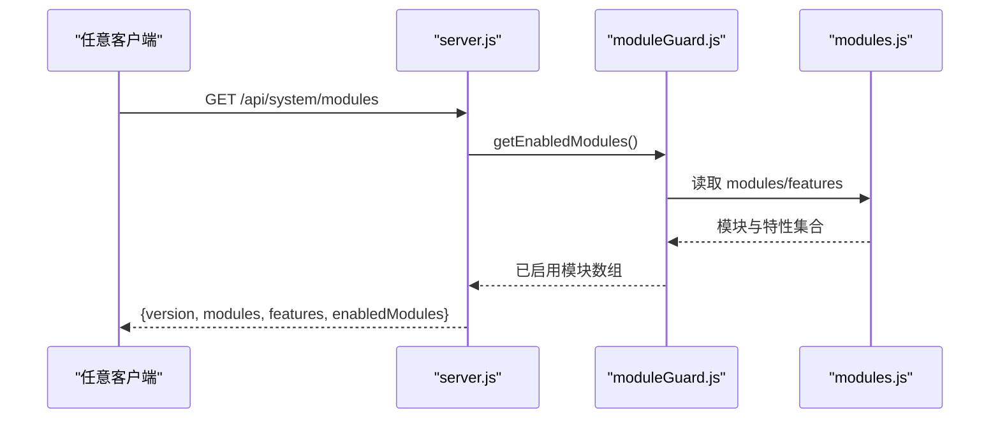
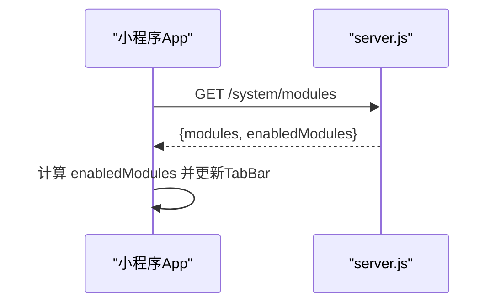
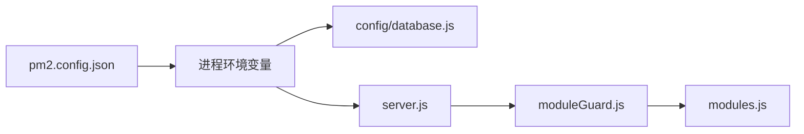

# 模块配置管理

<cite>
**本文引用的文件**   
- [backend/config/modules.js](file://backend/config/modules.js)
- [backend/config/database.js](file://backend/config/database.js)
- [backend/config/index.js](file://backend/config/index.js)
- [backend/server.js](file://backend/server.js)
- [backend/modules/common/middlewares/moduleGuard.js](file://backend/modules/common/middlewares/moduleGuard.js)
- [frontend/common/moduleConfig.js](file://frontend/common/moduleConfig.js)
- [frontend/common/navigation.js](file://frontend/common/navigation.js)
- [wechat-mini-app/app.js](file://wechat-mini-app/app.js)
- [pm2.config.json](file://pm2.config.json)
</cite>

## 目录
1. [简介](#简介)
2. [项目结构](#项目结构)
3. [核心组件](#核心组件)
4. [架构总览](#架构总览)
5. [详细组件分析](#详细组件分析)
6. [依赖关系分析](#依赖关系分析)
7. [性能与缓存](#性能与缓存)
8. [故障排查指南](#故障排查指南)
9. [结论](#结论)
10. [附录](#附录)

## 简介
本文件围绕干洗店管理系统的“模块配置管理”进行系统化说明，重点覆盖：
- 配置分层架构与优先级合并策略（全局、模块、环境）
- modules.js 的完整结构与字段语义（模块元数据、功能开关、支付分账、消息模板）
- 配置热重载机制与运行时更新方法
- 环境变量管理与多环境部署策略
- 配置校验与默认值处理逻辑
- 配置迁移工具与版本升级指南
- 配置安全与敏感信息加密存储方案
- 配置监控与审计日志记录机制

## 项目结构
后端通过 Express 启动，统一暴露系统配置接口；前端与小程序在启动时拉取并缓存模块配置，用于动态导航与功能可见性控制。

图示来源
- [backend/server.js:59-82](file://backend/server.js#L59-L82)
- [backend/config/modules.js:11-202](file://backend/config/modules.js#L11-L202)
- [backend/config/database.js:6-64](file://backend/config/database.js#L6-L64)
- [backend/config/index.js:19-88](file://backend/config/index.js#L19-L88)
- [backend/modules/common/middlewares/moduleGuard.js:1-83](file://backend/modules/common/middlewares/moduleGuard.js#L1-L83)
- [frontend/common/moduleConfig.js:1-57](file://frontend/common/moduleConfig.js#L1-L57)
- [frontend/common/navigation.js:1-64](file://frontend/common/navigation.js#L1-L64)
- [wechat-mini-app/app.js:123-164](file://wechat-mini-app/app.js#L123-L164)

章节来源
- [backend/server.js:59-82](file://backend/server.js#L59-L82)
- [backend/config/modules.js:11-202](file://backend/config/modules.js#L11-L202)
- [backend/config/database.js:6-64](file://backend/config/database.js#L6-L64)
- [backend/config/index.js:19-88](file://backend/config/index.js#L19-L88)
- [backend/modules/common/middlewares/moduleGuard.js:1-83](file://backend/modules/common/middlewares/moduleGuard.js#L1-L83)
- [frontend/common/moduleConfig.js:1-57](file://frontend/common/moduleConfig.js#L1-L57)
- [frontend/common/navigation.js:1-64](file://frontend/common/navigation.js#L1-L64)
- [wechat-mini-app/app.js:123-164](file://wechat-mini-app/app.js#L123-L164)

## 核心组件
- 模块配置中心：backend/config/modules.js，集中定义模块元数据、功能开关、支付分账规则与消息模板。
- 模块守卫与查询：backend/modules/common/middlewares/moduleGuard.js，提供启用检查、获取已启用模块列表、按名称查询模块配置等能力。
- 系统接口：backend/server.js 暴露 /api/system/modules 与 /api/system/modules/:name，供前端与小程序读取。
- 前端与小程序：分别通过 moduleConfig.js、navigation.js 与 app.js 拉取并缓存配置，驱动 UI 动态渲染。

章节来源
- [backend/config/modules.js:11-202](file://backend/config/modules.js#L11-L202)
- [backend/modules/common/middlewares/moduleGuard.js:1-83](file://backend/modules/common/middlewares/moduleGuard.js#L1-L83)
- [backend/server.js:59-82](file://backend/server.js#L59-L82)
- [frontend/common/moduleConfig.js:1-57](file://frontend/common/moduleConfig.js#L1-L57)
- [frontend/common/navigation.js:1-64](file://frontend/common/navigation.js#L1-L64)
- [wechat-mini-app/app.js:123-164](file://wechat-mini-app/app.js#L123-L164)

## 架构总览
配置体系采用“代码内嵌 + 环境变量 + 运行时接口”的分层模式：
- 全局配置：modules.js 作为单一事实源，定义所有模块与特性。
- 环境配置：database.js 使用 process.env 注入数据库、Redis 等外部依赖参数。
- 运行时配置：server.js 将 modules.js 内容通过 REST API 暴露给客户端，实现前端/小程序的动态适配。

图示来源
- [backend/server.js:59-70](file://backend/server.js#L59-L70)
- [backend/modules/common/middlewares/moduleGuard.js:62-66](file://backend/modules/common/middlewares/moduleGuard.js#L62-L66)
- [backend/config/modules.js:11-202](file://backend/config/modules.js#L11-L202)

## 详细组件分析

### 模块配置中心（modules.js）
- 版本与模块清单
  - VERSION：系统配置版本号，便于前后端对齐。
  - modules：各业务模块的元数据与开关，包含 name、nameEn、category、icon、message、launchDate 等字段，以及 enabled/version 控制启停与子版本。
- 功能特性开关（features）
  - delivery、membership、points、coupon、deposit、credit 等，统一以 enabled 布尔值控制，部分附带数值型默认值（如积分兑换率）。
- 支付分账规则（payment）
  - receivers：平台与门店分账比例。
  - recycle：回收业务的用户/平台分账比例。
  - rental：租赁业务的 owner/brand/platform 三方分账比例。
- 消息模板（notifications）
  - 针对 cleaning/shoe_care/luxury_care/pet_grooming/electronics_repair/recycle/rental/rental_leisure 等品类，声明其生命周期事件名，便于消息中心与通知渠道复用。

图示来源
- [backend/config/modules.js:11-202](file://backend/config/modules.js#L11-L202)

章节来源
- [backend/config/modules.js:11-202](file://backend/config/modules.js#L11-L202)

### 模块守卫与查询（moduleGuard.js）
- 模块守卫中间件：对指定模块路径进行启用检查，未启用返回 503 友好提示，启用则将 req.module 与 req.moduleConfig 挂载到请求上下文。
- 查询能力：
  - getModuleConfig(name)：按名称返回模块配置对象。
  - getEnabledModules()：过滤出所有 enabled=true 的模块，供系统接口返回。
  - isFeatureEnabled(featureName)：判断某功能是否开启。

图示来源
- [backend/modules/common/middlewares/moduleGuard.js:13-42](file://backend/modules/common/middlewares/moduleGuard.js#L13-L42)

章节来源
- [backend/modules/common/middlewares/moduleGuard.js:1-83](file://backend/modules/common/middlewares/moduleGuard.js#L1-L83)

### 系统接口（server.js）
- GET /api/system/modules：返回系统版本、全部模块、功能开关与已启用模块列表。
- GET /api/system/modules/:name：返回单个模块的配置详情。
- 健康检查：GET /api/health。

图示来源
- [backend/server.js:59-70](file://backend/server.js#L59-L70)
- [backend/modules/common/middlewares/moduleGuard.js:62-66](file://backend/modules/common/middlewares/moduleGuard.js#L62-L66)
- [backend/config/modules.js:11-202](file://backend/config/modules.js#L11-L202)

章节来源
- [backend/server.js:59-82](file://backend/server.js#L59-L82)

### 前端与小程序集成
- 前端模块配置服务（frontend/common/moduleConfig.js）
  - 从 /api/system/modules 拉取配置，本地缓存 TTL=5 分钟，失败降级到本地默认配置。
- 前端动态导航（frontend/common/navigation.js）
  - 基于模块配置构建主导航项，根据 modules.cleaning.enabled 等字段控制可见性。
- 小程序（wechat-mini-app/app.js）
  - 应用启动时调用 /system/modules，解析 enabledModules 并更新 TabBar。

图示来源
- [wechat-mini-app/app.js:123-164](file://wechat-mini-app/app.js#L123-L164)
- [backend/server.js:59-70](file://backend/server.js#L59-L70)

章节来源
- [frontend/common/moduleConfig.js:1-57](file://frontend/common/moduleConfig.js#L1-L57)
- [frontend/common/navigation.js:1-64](file://frontend/common/navigation.js#L1-L64)
- [wechat-mini-app/app.js:123-164](file://wechat-mini-app/app.js#L123-L164)

## 依赖关系分析
- server.js 依赖 moduleGuard.js 提供的查询能力，间接依赖 modules.js。
- database.js 通过 process.env 注入数据库与 Redis 参数，由 config/index.js 负责连接初始化。
- pm2.config.json 设置运行环境与端口，影响 server.js 的 PORT 取值。

图示来源
- [pm2.config.json:1-20](file://pm2.config.json#L1-L20)
- [backend/config/database.js:6-64](file://backend/config/database.js#L6-L64)
- [backend/server.js:34-36](file://backend/server.js#L34-L36)

章节来源
- [pm2.config.json:1-20](file://pm2.config.json#L1-L20)
- [backend/config/database.js:6-64](file://backend/config/database.js#L6-L64)
- [backend/server.js:34-36](file://backend/server.js#L34-L36)

## 性能与缓存
- 前端侧缓存：moduleConfig.js 与 navigation.js 均内置 5 分钟 TTL 的内存缓存，降低频繁请求压力。
- 服务端无状态：系统接口直接读取内存中的 modules.js，无需额外缓存层。
- 建议：
  - 若 QPS 较高，可在网关或反向代理层增加短 TTL 缓存。
  - 前端可结合浏览器缓存（如 Service Worker）进一步减少网络开销。

[本节为通用性能建议，不直接分析具体文件]

## 故障排查指南
- 模块不可用
  - 现象：访问模块路由返回 503，携带 message 与 launchDate。
  - 排查：确认 modules.js 中对应模块 enabled 是否为 true。
- 前端菜单不显示
  - 现象：C端或小程序缺少某入口。
  - 排查：检查 /api/system/modules 响应中对应模块 enabled 字段；确认前端缓存是否过期。
- 环境变量未生效
  - 现象：数据库连接失败或支付回调地址错误。
  - 排查：确认 .env 或 PM2 环境变量是否正确注入；查看 server.js 启动日志。

章节来源
- [backend/modules/common/middlewares/moduleGuard.js:25-35](file://backend/modules/common/middlewares/moduleGuard.js#L25-L35)
- [frontend/common/moduleConfig.js:17-40](file://frontend/common/moduleConfig.js#L17-L40)
- [backend/server.js:34-36](file://backend/server.js#L34-L36)

## 结论
本系统通过“集中式模块配置 + 运行时接口 + 前端缓存”的组合，实现了灵活的功能开关与多端一致体验。配合环境变量与数据库配置，可满足多环境部署需求。后续可在配置变更时引入热重载与审计日志，进一步提升运维可控性与安全性。

[本节为总结性内容，不直接分析具体文件]

## 附录

### 配置分层与合并策略
- 层级
  - 全局配置：modules.js 作为唯一事实源。
  - 环境配置：database.js 通过 process.env 注入外部依赖参数。
  - 运行时配置：server.js 将 modules.js 暴露为 REST API，供前端/小程序消费。
- 优先级与合并
  - 当前实现为“静态优先”，即 modules.js 为最终权威来源；前端/小程序在本地做短期缓存。
  - 若需支持运行时覆盖，建议在 server.js 中引入“运行时覆盖层”（例如内存 Map），并在重启前持久化至数据库或配置中心，再合并回 modules.js 的默认值。

[本节为概念性说明，不直接分析具体文件]

### modules.js 字段规范速查
- 模块元数据：enabled、version、name、nameEn、category、icon、message、launchDate
- 功能开关：delivery、membership、points、coupon、deposit、credit（含 enabled 及可选数值）
- 支付分账：receivers（platform/store）、recycle（user/platform）、rental（owner/brand/platform）
- 消息模板：按品类列出事件名数组

章节来源
- [backend/config/modules.js:11-202](file://backend/config/modules.js#L11-L202)

### 配置热重载与运行时更新
- 现状
  - 前端/小程序通过 /api/system/modules 拉取最新配置，具备本地缓存与降级策略。
  - 服务端未实现热重载，修改 modules.js 需重启服务。
- 推荐方案
  - 在 server.js 中增加“运行时配置管理器”，监听文件系统变化或接收管理端 PUT 请求，更新内存配置并广播失效事件。
  - 前端/小程序在收到失效事件后主动刷新缓存。

[本节为概念性说明，不直接分析具体文件]

### 环境变量管理与多环境部署
- 关键变量
  - 数据库类型与连接：DB_TYPE、MYSQL_*、MONGODB_URI、REDIS_*
  - 服务端口：PORT（受 pm2.config.json 影响）
- 多环境策略
  - 开发/测试/生产通过不同 .env 或 PM2 环境变量区分。
  - 支付相关密钥建议放入环境变量或专用密钥管理服务，避免硬编码。

章节来源
- [backend/config/database.js:6-64](file://backend/config/database.js#L6-L64)
- [pm2.config.json:12-15](file://pm2.config.json#L12-L15)
- [backend/server.js:34-36](file://backend/server.js#L34-L36)

### 配置验证与默认值处理
- 默认值
  - database.js 对 host/port/user/password/database 等提供合理默认值。
  - modules.js 对功能开关提供 enabled=false 的保守默认。
- 验证建议
  - 在服务启动阶段对必要环境变量进行校验（如支付密钥、数据库 URI）。
  - 对 modules.js 的结构进行轻量 Schema 校验，防止新增字段缺失导致运行时异常。

章节来源
- [backend/config/database.js:11-48](file://backend/config/database.js#L11-L48)
- [backend/config/modules.js:99-135](file://backend/config/modules.js#L99-L135)

### 配置迁移与版本升级
- 版本标识
  - modules.js 顶层 VERSION 用于前后端对齐。
- 迁移建议
  - 新增模块或特性时，保持向后兼容：新字段带默认值，旧流程不受影响。
  - 发布前执行“配置一致性检查脚本”，对比线上与仓库配置差异。

章节来源
- [backend/config/modules.js:12-13](file://backend/config/modules.js#L12-L13)

### 配置安全与敏感信息加密
- 原则
  - 敏感信息（支付密钥、证书路径、密码等）仅通过环境变量或密钥管理服务注入，不写入代码与配置文件。
- 实践
  - 支付服务器配置位于 api/payment-server/config.js，应通过环境变量注入。
  - 生产环境建议使用云厂商密钥服务或 KMS，运行时解密注入。

章节来源
- [api/payment-server/config.js:7-60](file://api/payment-server/config.js#L7-L60)

### 配置监控与审计日志
- 监控
  - 利用 /api/health 进行存活探测。
  - 在网关或 APM 层采集 /api/system/modules 的 QPS 与延迟。
- 审计
  - 对配置变更（未来实现的运行时更新）记录操作人、时间、变更摘要。
  - 将关键告警接入统一日志平台（如 CLS），便于检索与回溯。

[本节为通用运维建议，不直接分析具体文件]