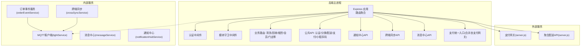
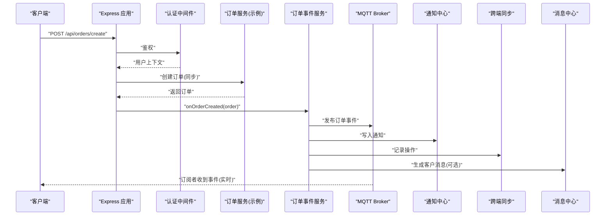
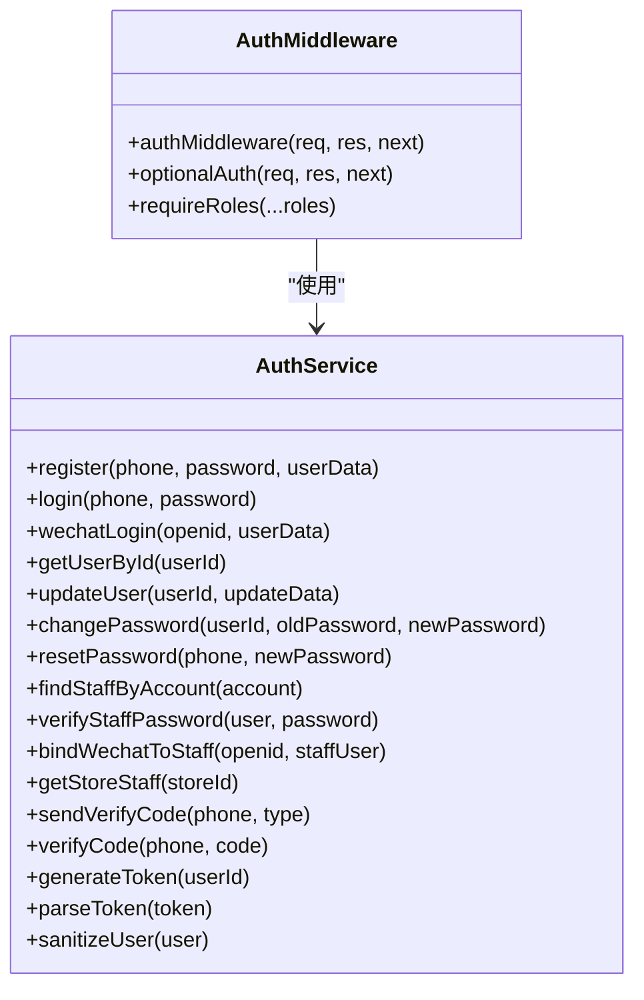
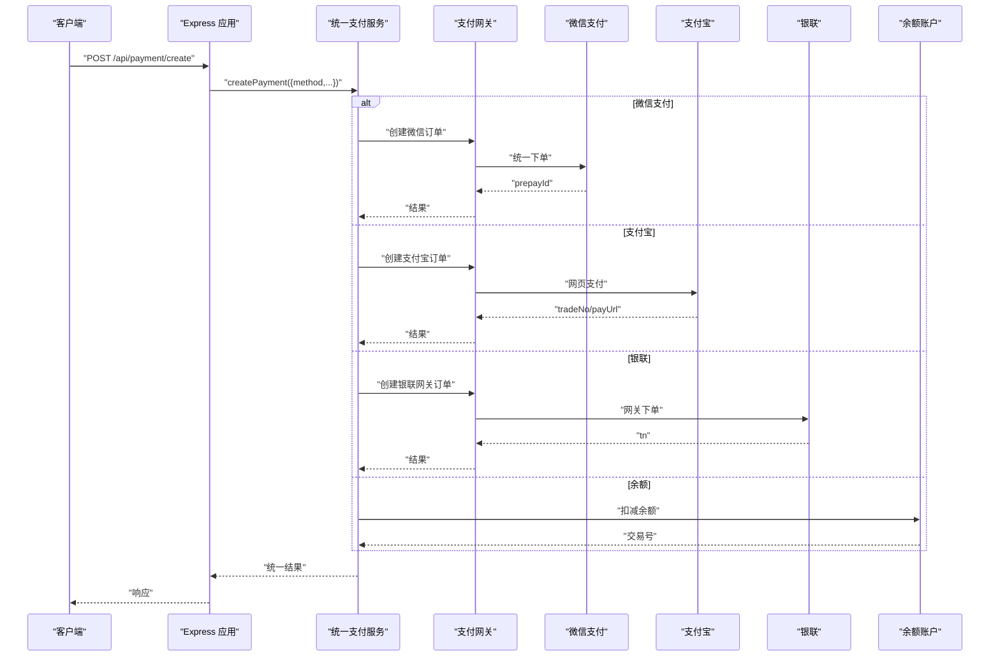
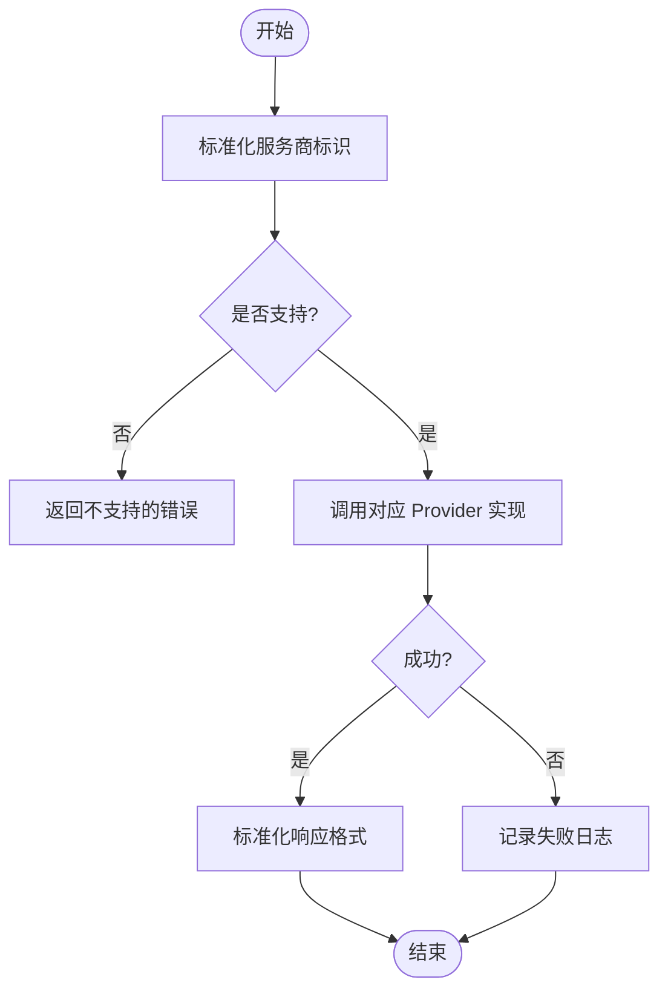
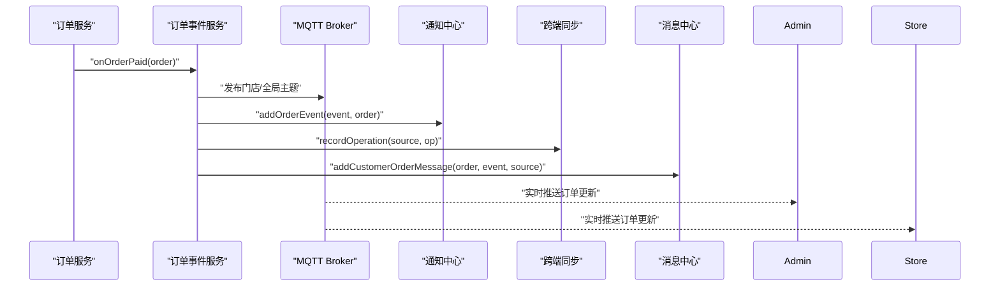
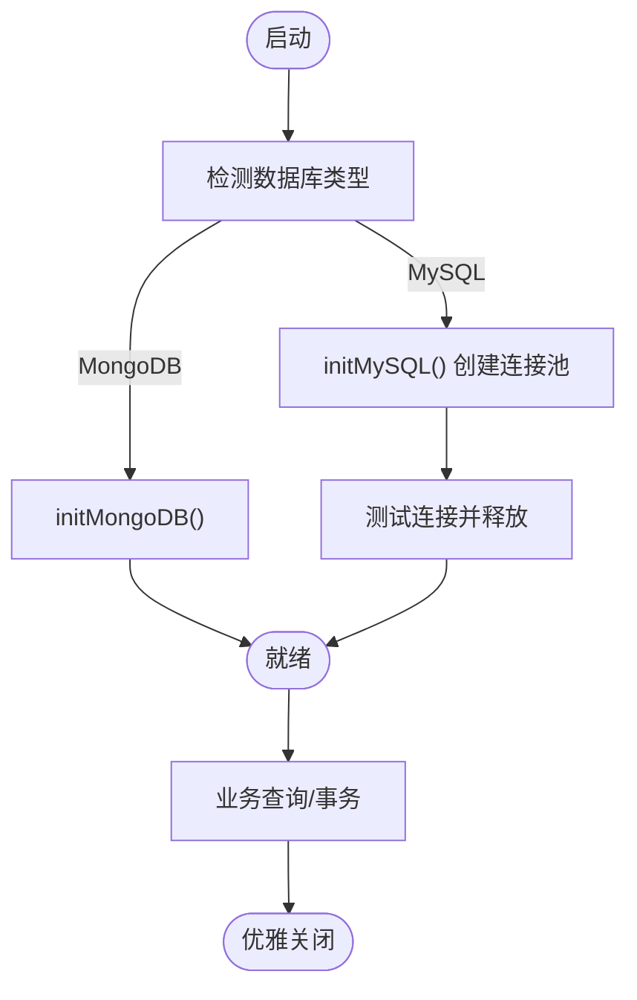
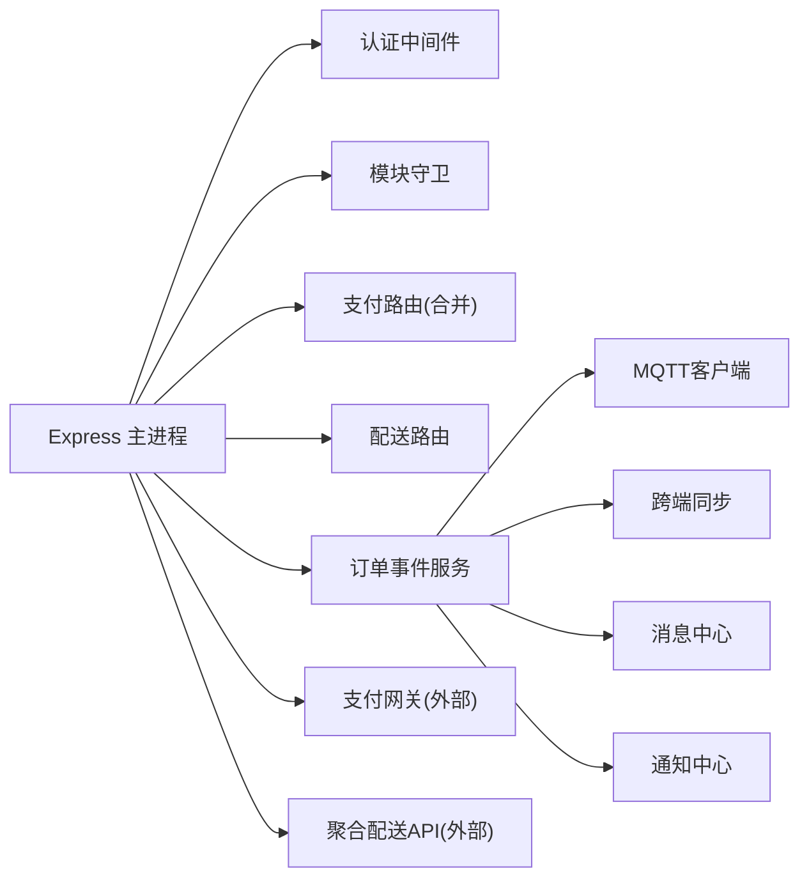

# 模块集成与通信

<cite>
**本文引用的文件**   
- [backend/server.js](file://backend/server.js)
- [backend/config/index.js](file://backend/config/index.js)
- [backend/config/modules.js](file://backend/config/modules.js)
- [backend/modules/common/services/authService.js](file://backend/modules/common/services/authService.js)
- [backend/modules/common/middlewares/auth.js](file://backend/modules/common/middlewares/auth.js)
- [backend/modules/common/middlewares/moduleGuard.js](file://backend/modules/common/middlewares/moduleGuard.js)
- [backend/modules/common/services/paymentService.js](file://backend/modules/common/services/paymentService.js)
- [backend/modules/common/services/deliveryService.js](file://backend/modules/common/services/deliveryService.js)
- [backend/services/orderEventService.js](file://backend/services/orderEventService.js)
- [backend/services/lightService.js](file://backend/services/lightService.js)
- [backend/services/crossSyncService.js](file://backend/services/crossSyncService.js)
- [backend/services/messageService.js](file://backend/services/messageService.js)
- [api/payment-server/server.js](file://api/payment-server/server.js)
- [delivery-api/server.js](file://delivery-api/server.js)
</cite>

## 目录
1. [引言](#引言)
2. [项目结构](#项目结构)
3. [核心组件](#核心组件)
4. [架构总览](#架构总览)
5. [详细组件分析](#详细组件分析)
6. [依赖关系分析](#依赖关系分析)
7. [性能考虑](#性能考虑)
8. [故障排查指南](#故障排查指南)
9. [结论](#结论)
10. [附录](#附录)

## 引言
本指南面向干洗店管理系统的“模块集成与通信”，聚焦以下目标：
- 阐明模块间通信机制：同步调用、异步消息传递、事件驱动模式
- 统一公共服务接口：认证、支付、配送的统一接入方式
- 数据共享与缓存策略：Redis 使用建议与数据库连接池管理
- 跨模块事务与一致性保证：分布式/跨服务事务思路
- 依赖注入与服务发现：在现有 Express 模块化基础上的演进建议
- 错误处理与重试最佳实践
- 模块边界与 API 契约管理
- 模块集成测试策略与模拟服务搭建方法

## 项目结构
系统采用“Express 主进程 + 多业务模块路由 + 独立子服务”的混合架构：
- 后端主进程（Express）负责路由聚合、中间件装配、健康检查、系统能力暴露
- 业务模块按领域划分，提供路由与服务层
- 外部子系统以独立服务形式运行：支付网关、聚合配送 API
- 事件总线基于 MQTT（EMQX），用于订单状态变更、跨端同步、通知中心联动

图表来源
- [backend/server.js:1-200](file://backend/server.js#L1-L200)
- [backend/services/lightService.js:1-120](file://backend/services/lightService.js#L1-L120)
- [backend/services/orderEventService.js:1-120](file://backend/services/orderEventService.js#L1-L120)
- [backend/services/crossSyncService.js:1-120](file://backend/services/crossSyncService.js#L1-L120)
- [backend/services/messageService.js:1-120](file://backend/services/messageService.js#L1-L120)
- [api/payment-server/server.js:1-120](file://api/payment-server/server.js#L1-L120)
- [delivery-api/server.js:1-120](file://delivery-api/server.js#L1-L120)

章节来源
- [backend/server.js:1-200](file://backend/server.js#L1-L200)

## 核心组件
- 认证服务与中间件：提供用户注册/登录、微信登录、角色校验、开发模式 mock 支持
- 支付统一服务：对外暴露统一创建/查询/退款/分账接口，内部适配多种支付方式
- 配送服务：统一封装多家配送商，提供报价计算、下单、查询、取消；真实/模拟双模式
- 事件与同步：基于 MQTT 的事件发布、跨端操作记录与广播、通知中心写入
- 数据库连接管理：MongoDB/MySQL 双引擎，连接池与事务封装
- 模块开关与功能特性：通过配置控制模块启用/禁用与功能开关

章节来源
- [backend/modules/common/services/authService.js:1-120](file://backend/modules/common/services/authService.js#L1-L120)
- [backend/modules/common/middlewares/auth.js:1-120](file://backend/modules/common/middlewares/auth.js#L1-L120)
- [backend/modules/common/services/paymentService.js:1-120](file://backend/modules/common/services/paymentService.js#L1-L120)
- [backend/modules/common/services/deliveryService.js:1-120](file://backend/modules/common/services/deliveryService.js#L1-L120)
- [backend/services/orderEventService.js:1-120](file://backend/services/orderEventService.js#L1-L120)
- [backend/services/crossSyncService.js:1-120](file://backend/services/crossSyncService.js#L1-L120)
- [backend/config/index.js:1-120](file://backend/config/index.js#L1-L120)
- [backend/config/modules.js:1-120](file://backend/config/modules.js#L1-L120)

## 架构总览
系统采用“同步 HTTP + 异步 MQTT”的双通道通信模型：
- 同步：Express 路由直接调用各模块服务或外部服务（如支付网关、配送聚合）
- 异步：订单事件通过 MQTT 广播，跨端同步服务记录并广播，通知中心持久化

图表来源
- [backend/server.js:1-200](file://backend/server.js#L1-L200)
- [backend/modules/common/middlewares/auth.js:1-120](file://backend/modules/common/middlewares/auth.js#L1-L120)
- [backend/services/orderEventService.js:1-168](file://backend/services/orderEventService.js#L1-L168)
- [backend/services/lightService.js:1-120](file://backend/services/lightService.js#L1-L120)
- [backend/services/crossSyncService.js:1-120](file://backend/services/crossSyncService.js#L1-L120)
- [backend/services/messageService.js:1-120](file://backend/services/messageService.js#L1-L120)

## 详细组件分析

### 认证与授权模块
- 职责
  - 用户注册/登录、微信登录、密码修改、验证码发送/校验
  - 中间件实现 Bearer Token 解析、开发模式 mock 支持、角色校验
- 关键流程
  - 登录成功后签发 token，后续请求由中间件解析并挂载用户上下文
  - 支持可选认证（optionalAuth）与角色强制（requireRoles）
- 设计要点
  - 用户模型包含 openid、roles、storeId、chainId 等字段，支撑跨平台识别与权限控制
  - 开发环境兼容 dev-admin/dev-chain/mock_token 等便捷模式

图表来源
- [backend/modules/common/services/authService.js:1-200](file://backend/modules/common/services/authService.js#L1-L200)
- [backend/modules/common/middlewares/auth.js:1-209](file://backend/modules/common/middlewares/auth.js#L1-L209)

章节来源
- [backend/modules/common/services/authService.js:1-200](file://backend/modules/common/services/authService.js#L1-L200)
- [backend/modules/common/middlewares/auth.js:1-209](file://backend/modules/common/middlewares/auth.js#L1-L209)

### 支付统一服务与支付网关集成
- 统一服务（PaymentService）
  - 对外提供 createPayment/splitPayment/refund/queryPayment 等接口
  - 内部根据 method 分发至微信/支付宝/银联/余额
- 支付网关（独立服务）
  - 提供统一支付入口、查询、关闭、回调处理、余额充值、结算报表等
  - 与主进程通过 REST 集成（主进程也内联了部分路由以简化部署）
- 分账策略
  - 干洗：平台抽佣比例 + 门店剩余
  - 回收：用户货款 - 平台服务费
  - 租赁：所有者/品牌方/平台按比例分账，押金托管

图表来源
- [backend/modules/common/services/paymentService.js:1-185](file://backend/modules/common/services/paymentService.js#L1-L185)
- [api/payment-server/server.js:1-200](file://api/payment-server/server.js#L1-L200)

章节来源
- [backend/modules/common/services/paymentService.js:1-185](file://backend/modules/common/services/paymentService.js#L1-L185)
- [api/payment-server/server.js:1-200](file://api/payment-server/server.js#L1-L200)

### 配送服务与聚合配送 API
- 配送服务（DeliveryService）
  - 定价计算与报价排序（纯业务逻辑）
  - 调用 deliveryProviders 进行真实/模拟下单、查询、取消
  - 支持一对一/拼单两种计费模式
- 聚合配送 API（独立服务）
  - 提供服务商列表、询价、下单、查询、取消等 REST 接口
  - 内部聚合多家第三方跑腿/同城快递

图表来源
- [backend/modules/common/services/deliveryService.js:1-120](file://backend/modules/common/services/deliveryService.js#L1-L120)
- [delivery-api/server.js:1-120](file://delivery-api/server.js#L1-L120)

章节来源
- [backend/modules/common/services/deliveryService.js:1-120](file://backend/modules/common/services/deliveryService.js#L1-L120)
- [delivery-api/server.js:1-120](file://delivery-api/server.js#L1-L120)

### 事件驱动与跨端同步
- 订单事件服务
  - 将订单状态变更事件通过 MQTT 发布到门店级与全局主题
  - 同时写入通知中心、跨端同步记录、消息中心（C端/微信侧）
- 跨端同步服务
  - 维护在线客户端、心跳、操作历史
  - 通过 MQTT 广播操作事件，避免本地回显
- 通知中心
  - 聚合各类事件（订单、灯条等），供 Admin 轮询获取

图表来源
- [backend/services/orderEventService.js:1-168](file://backend/services/orderEventService.js#L1-L168)
- [backend/services/crossSyncService.js:1-120](file://backend/services/crossSyncService.js#L1-L120)
- [backend/services/notificationHubService.js:1-120](file://backend/services/notificationHubService.js#L1-L120)
- [backend/services/messageService.js:1-120](file://backend/services/messageService.js#L1-L120)

章节来源
- [backend/services/orderEventService.js:1-168](file://backend/services/orderEventService.js#L1-L168)
- [backend/services/crossSyncService.js:1-120](file://backend/services/crossSyncService.js#L1-L120)
- [backend/services/notificationHubService.js:1-120](file://backend/services/notificationHubService.js#L1-L120)
- [backend/services/messageService.js:1-120](file://backend/services/messageService.js#L1-L120)

### 数据库连接池与事务
- 连接管理
  - MongoDB：单例连接，监听 error/disconnected 事件
  - MySQL：连接池初始化、测试连接、释放连接
- 事务封装
  - 提供 transaction(callback) 包装 begin/commit/rollback/release
- 建议
  - 生产环境引入 Redis 作为验证码、会话、限流、热点读缓存
  - 对写路径增加幂等键与去重表，结合事务保证一致性

图表来源
- [backend/config/index.js:1-167](file://backend/config/index.js#L1-L167)

章节来源
- [backend/config/index.js:1-167](file://backend/config/index.js#L1-L167)

### 模块开关与功能特性
- 模块开关
  - modules.enabled 控制各业务模块启停
  - moduleGuard 中间件在未启用时返回友好提示
- 功能特性
  - features.delivery/features.membership/features.points 等开关
- 建议
  - 新增模块需在 config/modules.js 中声明，并在 server.js 中注册路由

章节来源
- [backend/config/modules.js:1-203](file://backend/config/modules.js#L1-L203)
- [backend/modules/common/middlewares/moduleGuard.js:1-84](file://backend/modules/common/middlewares/moduleGuard.js#L1-L84)
- [backend/server.js:1-200](file://backend/server.js#L1-L200)

## 依赖关系分析
- 耦合与内聚
  - Express 主进程仅做路由聚合与中间件编排，业务逻辑下沉至 services
  - 事件相关服务通过延迟加载避免循环依赖
- 外部依赖
  - MQTT Broker（EMQX）：事件总线
  - 支付网关：REST 集成
  - 聚合配送 API：REST 集成
- 潜在循环依赖
  - 通过 require 延迟加载与 try/catch 规避

图表来源
- [backend/server.js:1-200](file://backend/server.js#L1-L200)
- [backend/services/orderEventService.js:1-120](file://backend/services/orderEventService.js#L1-L120)
- [backend/services/lightService.js:1-120](file://backend/services/lightService.js#L1-L120)
- [backend/services/crossSyncService.js:1-120](file://backend/services/crossSyncService.js#L1-L120)
- [backend/services/messageService.js:1-120](file://backend/services/messageService.js#L1-L120)
- [backend/services/notificationHubService.js:1-120](file://backend/services/notificationHubService.js#L1-L120)
- [api/payment-server/server.js:1-120](file://api/payment-server/server.js#L1-L120)
- [delivery-api/server.js:1-120](file://delivery-api/server.js#L1-L120)

章节来源
- [backend/server.js:1-200](file://backend/server.js#L1-L200)

## 性能考虑
- 连接池与并发
  - MySQL 连接池大小需根据 QPS 与 DB 资源调优
  - MongoDB 连接数与超时参数按场景调整
- 事件与消息
  - MQTT QoS=1 保证至少一次投递，注意幂等处理
  - 跨端同步操作记录限制数量与 TTL，避免内存膨胀
- 缓存策略（建议）
  - Redis 用于：验证码、会话、热点配置、限流计数、短时效消息
  - 读写分离：读多写少场景优先走缓存，写后失效或延迟双写
- 支付与配送
  - 外部调用增加超时与熔断，避免雪崩
  - 价格计算与报价缓存，减少重复计算

[本节为通用指导，不直接分析具体文件]

## 故障排查指南
- 常见问题定位
  - 端口占用：查看 EADDRINUSE 错误并释放端口
  - 未捕获异常：uncaughtException/unhandledRejection 日志
  - 数据库连接失败：initDatabase 抛出错误，检查配置与网络
  - MQTT 连接失败：检查 broker 地址、端口、认证信息
- 建议工具
  - 健康检查接口：/api/health
  - 模块状态接口：/api/system/modules
  - 跨端同步状态：/api/sync/status
  - 通知中心：/api/admin/notifications/:storeId

章节来源
- [backend/server.js:599-702](file://backend/server.js#L599-L702)
- [backend/server.js:55-90](file://backend/server.js#L55-L90)
- [backend/server.js:214-280](file://backend/server.js#L214-L280)
- [backend/server.js:160-207](file://backend/server.js#L160-L207)

## 结论
本系统通过“Express 路由聚合 + 领域服务 + MQTT 事件总线 + 外部服务 REST 集成”的方式实现了清晰的模块边界与灵活的通信机制。认证、支付、配送三大公共服务均提供了统一接口，便于前端与多端复用。建议在后续演进中引入 Redis 缓存、完善分布式事务方案、补充服务发现与依赖注入框架，以提升可观测性与扩展性。

[本节为总结，不直接分析具体文件]

## 附录

### 模块间通信机制清单
- 同步调用
  - Express 路由 → 业务服务 → 数据库/外部服务
  - 典型：创建订单、查询余额、创建支付
- 异步消息传递
  - MQTT 发布/订阅：订单事件、跨端同步、通知中心
- 事件驱动模式
  - 订单生命周期事件驱动通知、消息、跨端同步

章节来源
- [backend/services/orderEventService.js:1-168](file://backend/services/orderEventService.js#L1-L168)
- [backend/services/crossSyncService.js:1-120](file://backend/services/crossSyncService.js#L1-L120)
- [backend/services/notificationHubService.js:1-120](file://backend/services/notificationHubService.js#L1-L120)

### 统一接口设计要点
- 认证
  - 登录/注册/微信登录/验证码/角色校验
- 支付
  - 统一创建/查询/退款/分账，内部适配多支付渠道
- 配送
  - 统一报价/下单/查询/取消，真实/模拟双模式

章节来源
- [backend/modules/common/services/authService.js:1-200](file://backend/modules/common/services/authService.js#L1-L200)
- [backend/modules/common/services/paymentService.js:1-185](file://backend/modules/common/services/paymentService.js#L1-L185)
- [backend/modules/common/services/deliveryService.js:1-120](file://backend/modules/common/services/deliveryService.js#L1-L120)

### 数据共享与缓存策略（建议）
- Redis 用途
  - 验证码、会话、限流、热点配置、短时效消息
- 数据库连接池
  - MySQL 连接池大小、超时、SSL 配置
  - MongoDB 连接选项与错误监听

章节来源
- [backend/config/index.js:1-167](file://backend/config/index.js#L1-L167)

### 跨模块事务与一致性（建议）
- 本地事务
  - 使用 transaction(callback) 包裹多表写
- 跨服务一致性
  - 补偿事务（Saga）、幂等键、最终一致性
  - 事件溯源 + 重试队列

[本节为通用指导，不直接分析具体文件]

### 依赖注入与服务发现（建议）
- 依赖注入
  - 使用轻量 DI 容器（如 Awilix）注入服务实例
- 服务发现
  - 微服务化后可引入 Consul/Nacos/Eureka
  - 当前阶段可通过配置中心 + 健康检查替代

[本节为通用指导，不直接分析具体文件]

### 错误处理与重试（建议）
- 统一错误码与消息体
- 指数退避重试、死信队列
- 外部调用熔断与降级

[本节为通用指导，不直接分析具体文件]

### 模块边界与 API 契约管理
- 模块边界
  - 每个模块拥有独立路由与服务层，通过中间件统一鉴权与开关
- API 契约
  - 统一响应结构 { success, data, error }
  - 版本化路由前缀与模块开关配合灰度发布

章节来源
- [backend/modules/common/middlewares/moduleGuard.js:1-84](file://backend/modules/common/middlewares/moduleGuard.js#L1-L84)
- [backend/server.js:1-200](file://backend/server.js#L1-L200)

### 集成测试与模拟服务搭建
- 集成测试策略
  - 单元测试：服务层纯函数与算法（如配送报价）
  - 接口测试：Express 路由 + 内存数据库/Mock 外部服务
  - 端到端：启动完整服务链（含 MQTT Broker）
- 模拟服务
  - 支付网关：mock 支付/回调/查询
  - 配送聚合：mock 下单/查询/取消
  - MQTT：本地 EMQX 或最小化 broker

章节来源
- [api/payment-server/server.js:1-200](file://api/payment-server/server.js#L1-L200)
- [delivery-api/server.js:1-120](file://delivery-api/server.js#L1-L120)
- [backend/services/lightService.js:1-120](file://backend/services/lightService.js#L1-L120)