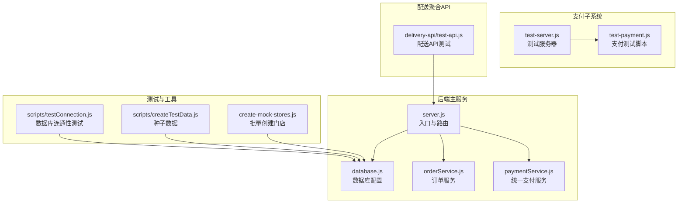
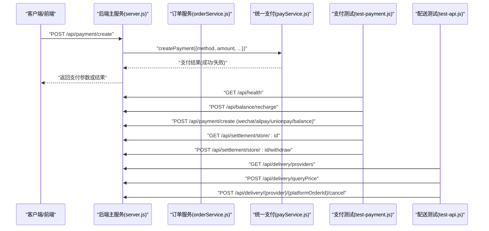
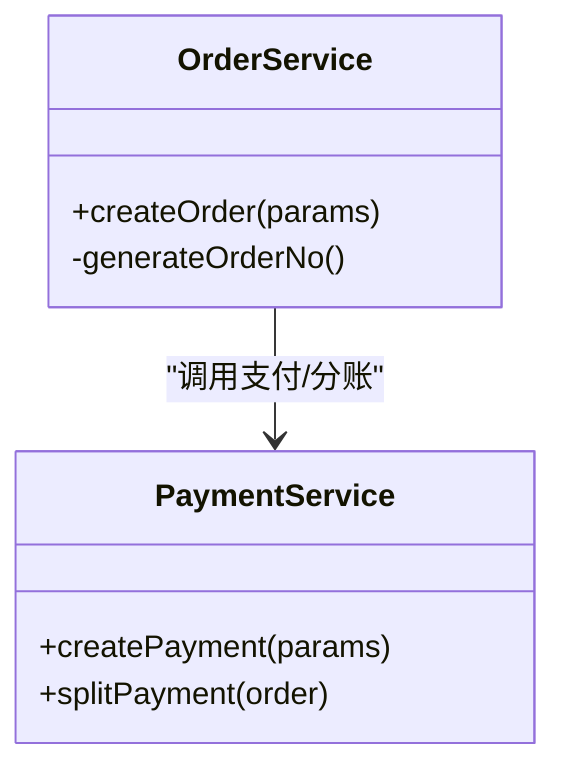
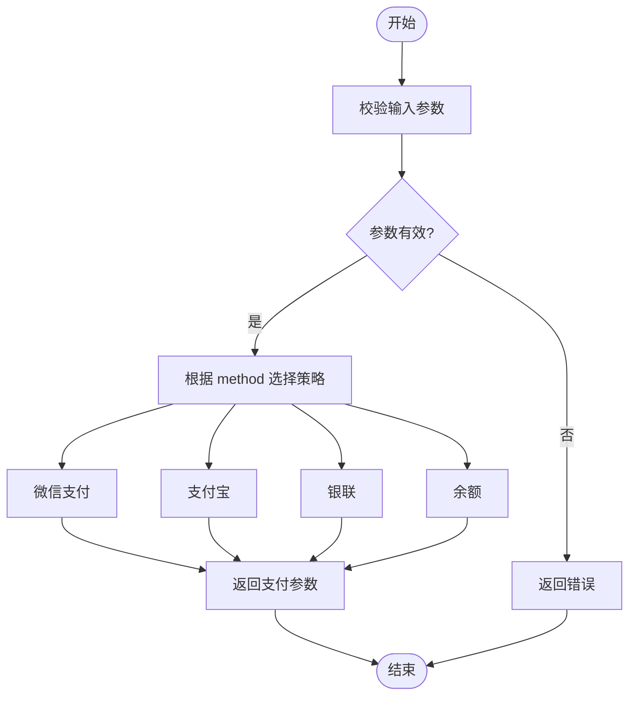
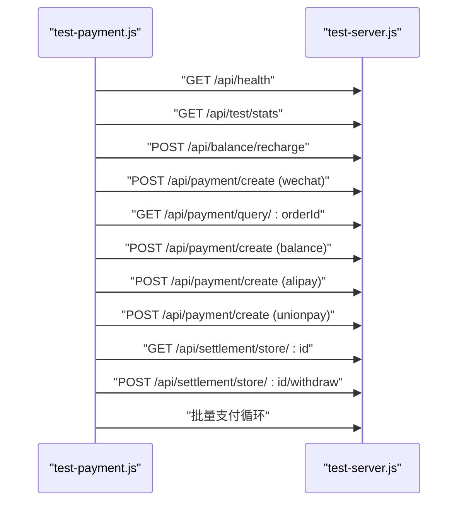
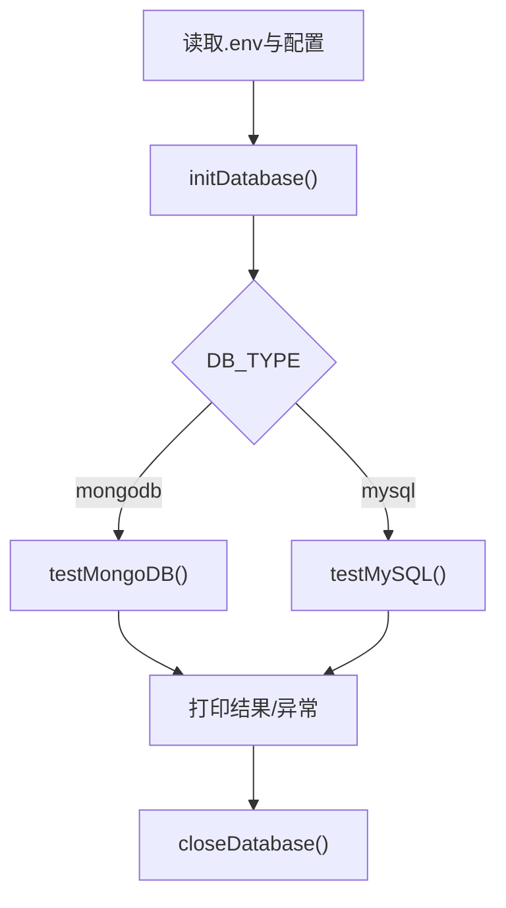
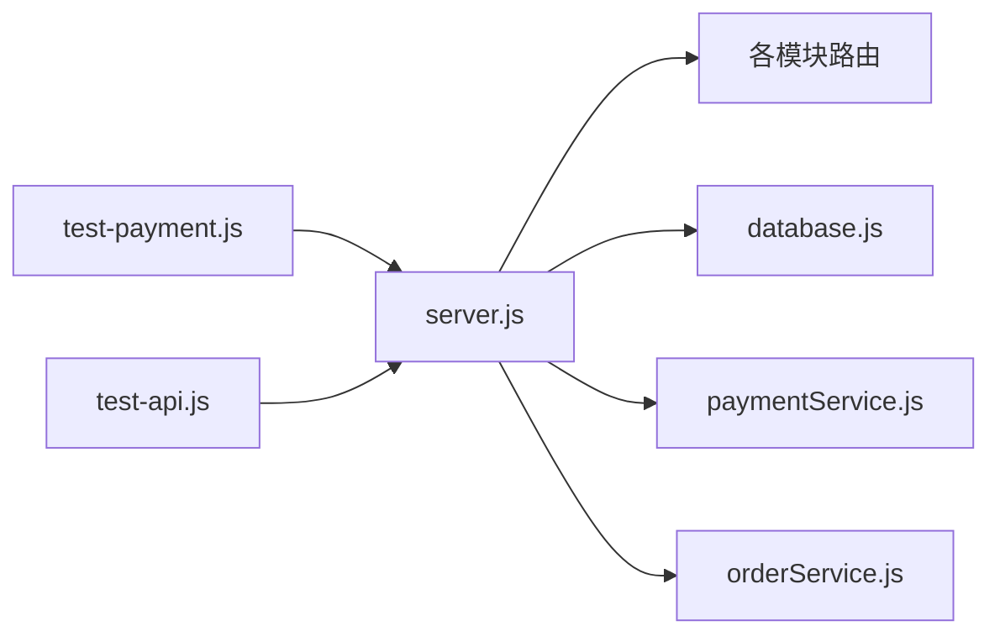

# 测试策略与规范

<cite>
**本文引用的文件**   
- [backend/server.js](file://backend/server.js)
- [backend/config/database.js](file://backend/config/database.js)
- [backend/modules/cleaning/services/orderService.js](file://backend/modules/cleaning/services/orderService.js)
- [backend/modules/common/services/paymentService.js](file://backend/modules/common/services/paymentService.js)
- [api/payment-server/test-payment.js](file://api/payment-server/test-payment.js)
- [api/payment-server/test-server.js](file://api/payment-server/test-server.js)
- [api/payment-server/START_TEST.md](file://api/payment-server/START_TEST.md)
- [delivery-api/test-api.js](file://delivery-api/test-api.js)
- [backend/scripts/testConnection.js](file://backend/scripts/testConnection.js)
- [backend/scripts/createTestData.js](file://backend/scripts/createTestData.js)
- [backend/create-mock-stores.js](file://backend/create-mock-stores.js)
- [.gitignore](file://.gitignore)
</cite>

## 目录
1. [引言](#引言)
2. [项目结构](#项目结构)
3. [核心组件](#核心组件)
4. [架构总览](#架构总览)
5. [详细组件分析](#详细组件分析)
6. [依赖分析](#依赖分析)
7. [性能考虑](#性能考虑)
8. [故障排查指南](#故障排查指南)
9. [结论](#结论)
10. [附录](#附录)

## 引言
本文件面向干洗店管理系统的测试团队与开发者，提供覆盖单元测试、集成测试、端到端测试、环境搭建、性能测试与持续集成的完整策略与规范。文档基于仓库现有代码与脚本进行提炼，确保可落地执行，并给出可视化图示帮助理解系统交互与数据流。

## 项目结构
本项目采用多服务模块化架构：
- 后端主服务（Express）：统一路由聚合、业务模块挂载、支付接口合并、消息与同步API等
- 支付子系统：独立测试服务器与测试脚本，模拟微信/支付宝/银联/余额支付与结算
- 配送聚合API：聚合多家配送服务商的查询、下单、取消等能力
- 数据库配置：支持 MySQL/MongoDB 双引擎，含连接池与选项
- 测试与工具脚本：数据库连通性检测、种子数据生成、门店批量创建等

**图表来源**
- [backend/server.js:1-150](file://backend/server.js#L1-L150)
- [backend/config/database.js:1-65](file://backend/config/database.js#L1-L65)
- [backend/modules/cleaning/services/orderService.js:1-200](file://backend/modules/cleaning/services/orderService.js#L1-L200)
- [backend/modules/common/services/paymentService.js:1-185](file://backend/modules/common/services/paymentService.js#L1-L185)
- [api/payment-server/test-server.js:414-448](file://api/payment-server/test-server.js#L414-L448)
- [api/payment-server/test-payment.js:1-120](file://api/payment-server/test-payment.js#L1-L120)
- [delivery-api/test-api.js:1-59](file://delivery-api/test-api.js#L1-L59)
- [backend/scripts/testConnection.js:1-49](file://backend/scripts/testConnection.js#L1-L49)
- [backend/scripts/createTestData.js:1-120](file://backend/scripts/createTestData.js#L1-L120)
- [backend/create-mock-stores.js:1-48](file://backend/create-mock-stores.js#L1-L48)

**章节来源**
- [backend/server.js:1-150](file://backend/server.js#L1-L150)
- [backend/config/database.js:1-65](file://backend/config/database.js#L1-L65)

## 核心组件
- 后端主服务
  - 负责加载环境变量、注册中间件、挂载各业务模块路由、健康检查、错误处理与优雅关闭
  - 关键路径：健康检查、支付统一接口、小程序微信支付统一下单、跨端同步与消息中心
- 订单服务
  - 定义订单与用户物品模型、订单状态机、创建订单流程、金额计算与配送信息处理
- 统一支付服务
  - 抽象多种支付方式（微信/支付宝/银联/余额），并提供分账与退款/查询占位实现
- 支付子系统测试
  - 提供内存态测试服务器与自动化测试脚本，覆盖健康检查、余额充值、多支付方式、结算与提现、批量支付
- 配送聚合API测试
  - 通过HTTP请求对可用服务商列表、价格查询、下单、取件、取消等流程进行验证
- 数据库与测试工具
  - 数据库连通性测试、种子数据生成、门店批量创建脚本，支撑本地与CI环境快速准备数据

**章节来源**
- [backend/server.js:85-120](file://backend/server.js#L85-L120)
- [backend/modules/cleaning/services/orderService.js:177-200](file://backend/modules/cleaning/services/orderService.js#L177-L200)
- [backend/modules/common/services/paymentService.js:24-47](file://backend/modules/common/services/paymentService.js#L24-L47)
- [api/payment-server/test-payment.js:96-120](file://api/payment-server/test-payment.js#L96-L120)
- [delivery-api/test-api.js:34-59](file://delivery-api/test-api.js#L34-L59)
- [backend/scripts/testConnection.js:8-39](file://backend/scripts/testConnection.js#L8-L39)
- [backend/scripts/createTestData.js:11-120](file://backend/scripts/createTestData.js#L11-L120)
- [backend/create-mock-stores.js:1-48](file://backend/create-mock-stores.js#L1-L48)

## 架构总览
下图展示从客户端到后端主服务、再到支付与配送子系统的调用关系，以及测试脚本如何驱动这些服务完成端到端验证。

**图表来源**
- [backend/server.js:410-502](file://backend/server.js#L410-L502)
- [backend/modules/common/services/paymentService.js:24-91](file://backend/modules/common/services/paymentService.js#L24-L91)
- [api/payment-server/test-payment.js:96-464](file://api/payment-server/test-payment.js#L96-L464)
- [delivery-api/test-api.js:34-174](file://delivery-api/test-api.js#L34-L174)

## 详细组件分析

### 订单服务（OrderService）
- 职责
  - 订单建模与校验、订单号生成、配送方式标准化、金额汇总、状态流转记录
- 复杂度与优化点
  - 创建订单涉及数组映射与字段规范化，建议为高频字段建立索引（如 orderNo、userId、storeId）
  - 状态历史追加应使用原子更新避免并发写冲突
- 错误处理
  - 必填字段缺失抛出明确错误；建议在路由层捕获并返回标准错误体

**图表来源**
- [backend/modules/cleaning/services/orderService.js:177-200](file://backend/modules/cleaning/services/orderService.js#L177-L200)
- [backend/modules/common/services/paymentService.js:96-173](file://backend/modules/common/services/paymentService.js#L96-L173)

**章节来源**
- [backend/modules/cleaning/services/orderService.js:177-200](file://backend/modules/cleaning/services/orderService.js#L177-L200)

### 统一支付服务（PaymentService）
- 职责
  - 统一封装多支付方式创建、分账逻辑、退款与查询占位实现
- 设计要点
  - 以策略模式扩展新支付方式；分账按订单类型差异化处理
- 测试建议
  - 针对每种支付方式构造最小用例，断言返回结构与关键字段
  - 分账边界值（零元、负数、精度舍入）需覆盖

**图表来源**
- [backend/modules/common/services/paymentService.js:24-91](file://backend/modules/common/services/paymentService.js#L24-L91)

**章节来源**
- [backend/modules/common/services/paymentService.js:24-91](file://backend/modules/common/services/paymentService.js#L24-L91)

### 支付子系统测试（test-payment.js）
- 覆盖范围
  - 健康检查、查看测试数据、余额充值、微信支付、余额支付、支付宝、银联、门店结算查询、门店提现、批量支付
- 执行方式
  - 先启动测试服务器，再运行测试脚本；输出通过率与明细
- 注意事项
  - 端口占用、网络连通、顺序依赖（充值后再扣款）

**图表来源**
- [api/payment-server/test-payment.js:96-464](file://api/payment-server/test-payment.js#L96-L464)
- [api/payment-server/test-server.js:414-448](file://api/payment-server/test-server.js#L414-L448)

**章节来源**
- [api/payment-server/test-payment.js:96-464](file://api/payment-server/test-payment.js#L96-L464)
- [api/payment-server/START_TEST.md:120-167](file://api/payment-server/START_TEST.md#L120-L167)

### 配送聚合API测试（test-api.js）
- 覆盖范围
  - 健康检查、获取服务商列表、价格查询、下单、取件、取消
- 执行方式
  - 直接运行脚本，自动发起HTTP请求并打印结果

**章节来源**
- [delivery-api/test-api.js:34-174](file://delivery-api/test-api.js#L34-L174)

### 数据库连通性与种子数据
- 连通性测试
  - 自动识别数据库类型（MongoDB/MySQL），初始化连接后执行基础查询，最后关闭连接
- 种子数据
  - 创建门店、店员与用户账号、典型订单，便于联调与演示
- 门店批量创建
  - 基于Schema批量插入门店，便于压力与功能测试

**图表来源**
- [backend/scripts/testConnection.js:8-39](file://backend/scripts/testConnection.js#L8-L39)
- [backend/config/database.js:1-65](file://backend/config/database.js#L1-L65)

**章节来源**
- [backend/scripts/testConnection.js:8-39](file://backend/scripts/testConnection.js#L8-L39)
- [backend/scripts/createTestData.js:11-120](file://backend/scripts/createTestData.js#L11-L120)
- [backend/create-mock-stores.js:1-48](file://backend/create-mock-stores.js#L1-L48)

## 依赖分析
- 后端主服务依赖
  - Express/CORS/body-parser 中间件
  - 数据库配置（MySQL/MongoDB）
  - 业务模块路由（清洗、回收、租赁、认证、支付、分类、配送、会员、管理员、连锁后台、公共门店API、同步、消息中心）
- 支付子系统
  - 独立测试服务器与测试脚本，不依赖真实第三方密钥（测试模式）
- 配送聚合API
  - 对外暴露统一接口，内部聚合多家服务商

**图表来源**
- [backend/server.js:1-150](file://backend/server.js#L1-L150)
- [backend/config/database.js:1-65](file://backend/config/database.js#L1-L65)
- [backend/modules/common/services/paymentService.js:1-91](file://backend/modules/common/services/paymentService.js#L1-L91)
- [backend/modules/cleaning/services/orderService.js:1-200](file://backend/modules/cleaning/services/orderService.js#L1-L200)
- [api/payment-server/test-payment.js:1-120](file://api/payment-server/test-payment.js#L1-L120)
- [delivery-api/test-api.js:1-59](file://delivery-api/test-api.js#L1-L59)

**章节来源**
- [backend/server.js:1-150](file://backend/server.js#L1-L150)

## 性能考虑
- 数据库连接池
  - MySQL 连接池大小与超时、MongoDB 最大连接数与服务选择超时需在测试环境中合理设置，避免连接耗尽
- 支付与配送外部调用
  - 在测试中尽量使用Mock/内存态，避免真实网络抖动影响稳定性
- 压测建议
  - 使用轻量HTTP压测工具（如 autocannon/wrk）对健康检查与核心接口进行基准测试
  - 关注P95/P99延迟与错误率，结合日志定位瓶颈

[本节为通用指导，无需特定文件引用]

## 故障排查指南
- 端口占用
  - 支付测试服务器默认端口可能被占用，参考测试文档中的解决方案
- 数据库连接失败
  - 检查 .env 配置、服务是否启动、远程网络连通性
- 测试脚本报错
  - 确认服务已启动、等待足够时间、检查防火墙与代理设置

**章节来源**
- [api/payment-server/START_TEST.md:213-252](file://api/payment-server/START_TEST.md#L213-L252)
- [backend/scripts/testConnection.js:29-39](file://backend/scripts/testConnection.js#L29-L39)

## 结论
本策略将现有脚本与模块作为基线，形成“单元—集成—端到端—性能—CI”的闭环。建议逐步引入结构化测试框架（如 Jest/Mocha）、覆盖率统计与质量门禁，提升回归效率与交付质量。

[本节为总结性内容，无需特定文件引用]

## 附录

### 单元测试编写规范（服务层与业务逻辑）
- 目标
  - 覆盖核心服务方法的关键分支与边界条件
- 建议用例
  - 订单服务：创建订单参数校验、配送方式标准化、金额汇总、状态历史追加
  - 支付服务：各支付方式创建、分账比例计算、退款与查询占位
- 断言要点
  - 返回值结构、关键字段、异常信息与错误码
- 隔离与Mock
  - 外部依赖（数据库、第三方SDK）使用Mock或内存态替代

[本节为通用规范，无需特定文件引用]

### 集成测试方法
- 数据库测试
  - 使用 testConnection.js 验证连接与读写能力；使用 createTestData.js 准备种子数据
- API接口测试
  - 使用 test-payment.js 与 test-api.js 对支付与配送聚合接口进行端到端验证
- 第三方服务模拟
  - 支付子系统测试服务器提供内存态模拟，无需真实密钥

**章节来源**
- [backend/scripts/testConnection.js:8-39](file://backend/scripts/testConnection.js#L8-L39)
- [backend/scripts/createTestData.js:11-120](file://backend/scripts/createTestData.js#L11-L120)
- [api/payment-server/test-payment.js:96-464](file://api/payment-server/test-payment.js#L96-L464)
- [delivery-api/test-api.js:34-174](file://delivery-api/test-api.js#L34-L174)

### 端到端测试策略（用户业务流程）
- 场景示例
  - 用户登录 → 浏览门店 → 创建订单 → 选择支付方式 → 支付成功 → 查看订单详情 → 取件/配送
- 执行方式
  - 通过浏览器自动化或前端诊断页面触发后端API，串联多个接口完成流程验证

[本节为通用策略，无需特定文件引用]

### 测试环境搭建指南
- 测试数据库配置
  - 通过 database.js 的 DB_TYPE 切换 MySQL/MongoDB，并在 .env 中填写对应连接参数
- Mock服务设置
  - 支付子系统：启动 test-server.js，使用 test-payment.js 执行全套用例
  - 配送聚合：启动 delivery-api 服务，使用 test-api.js 验证

**章节来源**
- [backend/config/database.js:1-65](file://backend/config/database.js#L1-L65)
- [api/payment-server/test-server.js:414-448](file://api/payment-server/test-server.js#L414-L448)
- [api/payment-server/test-payment.js:1-120](file://api/payment-server/test-payment.js#L1-L120)
- [delivery-api/test-api.js:1-59](file://delivery-api/test-api.js#L1-L59)

### 性能测试方法
- 工具建议
  - autocannon/wrk 对核心接口进行并发压测
- 指标
  - QPS、P95/P99延迟、错误率、资源使用率（CPU/内存）
- 注意
  - 压测前清理缓存与预热连接，避免冷启动干扰

[本节为通用指导，无需特定文件引用]

### 自动化测试流水线与持续集成
- 建议步骤
  - 安装依赖 → 启动数据库 → 运行连通性测试 → 运行集成测试 → 生成覆盖率报告 → 上传报告
- 并行化
  - 支付与配送测试可并行执行，缩短整体时长
- 失败重试
  - 对偶发网络问题增加有限次重试

[本节为通用指导，无需特定文件引用]

### 测试覆盖率要求与代码质量检查
- 覆盖率阈值
  - 建议行覆盖率≥80%，分支覆盖率≥70%（可按模块调整）
- 忽略目录
  - coverage/ 与 .nyc_output/ 已在 .gitignore 中排除，避免污染仓库
- 质量检查
  - 建议引入静态检查与格式化规则（ESLint/Prettier），在提交前执行

**章节来源**
- [.gitignore:44-46](file://.gitignore#L44-L46)