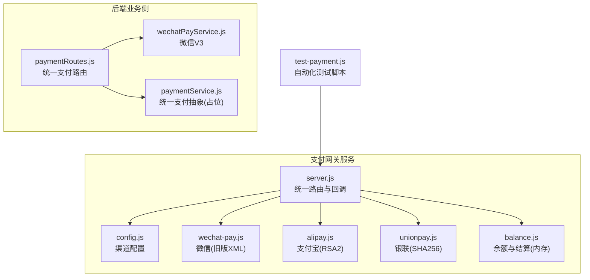
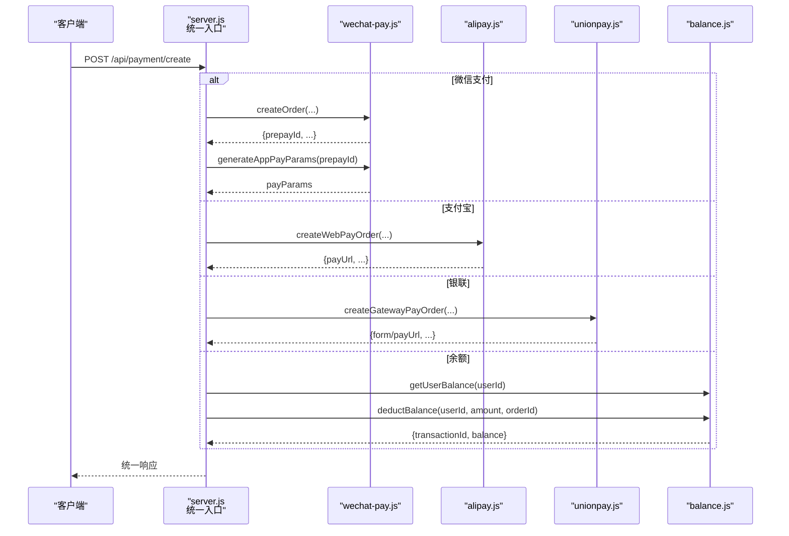
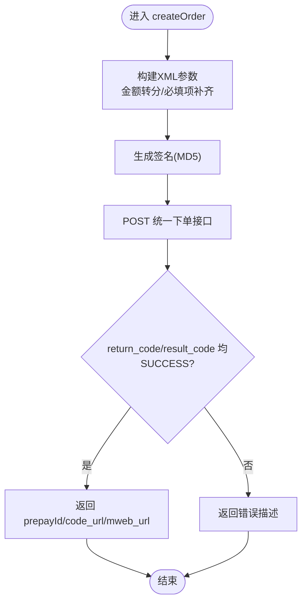
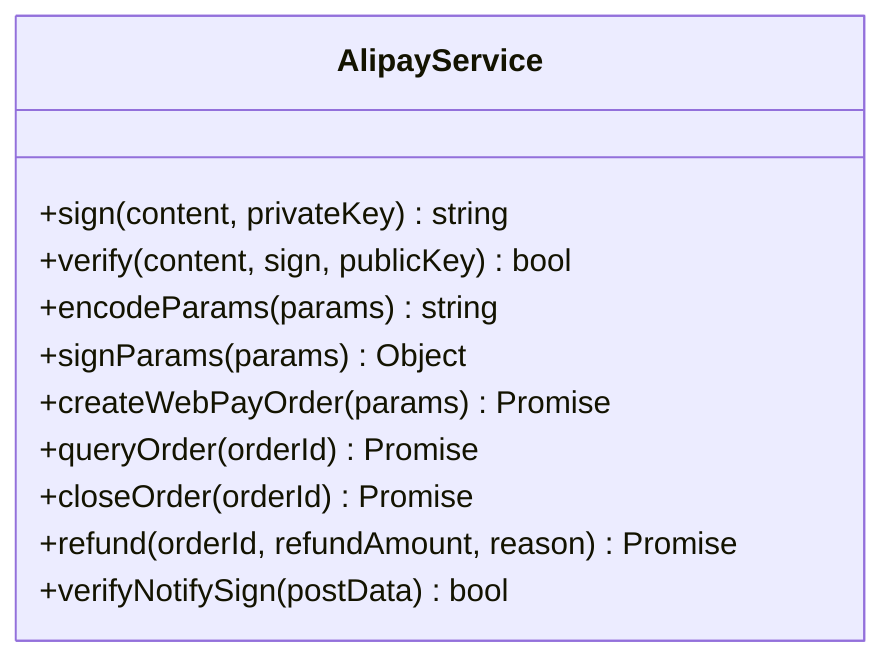
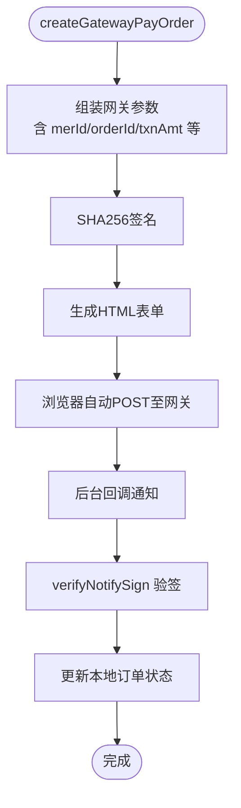
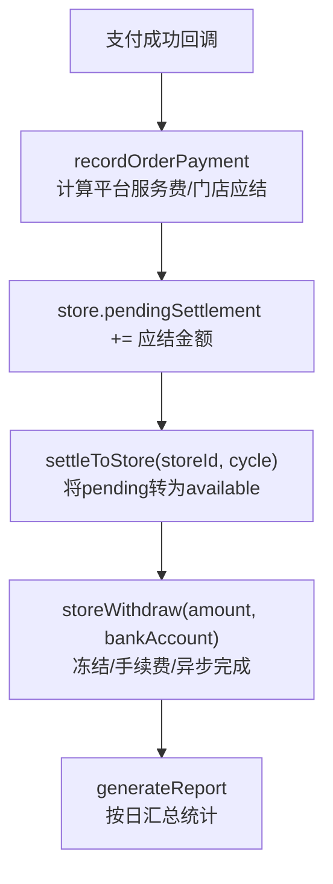
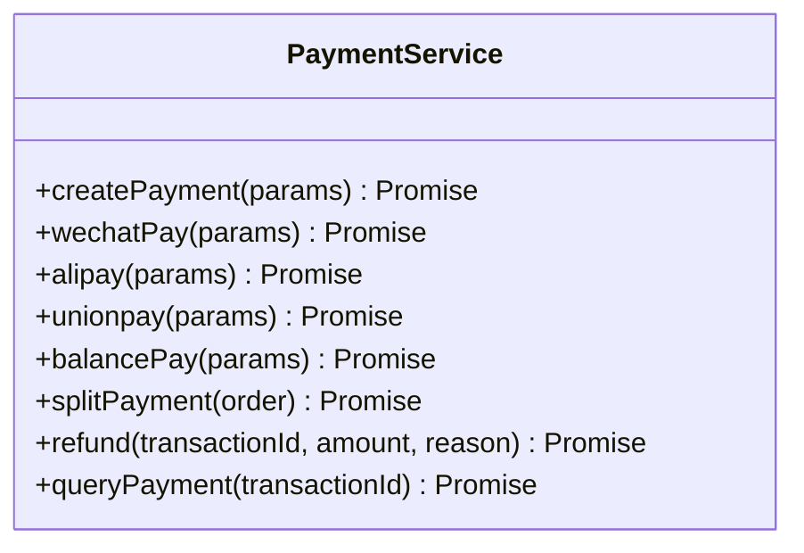
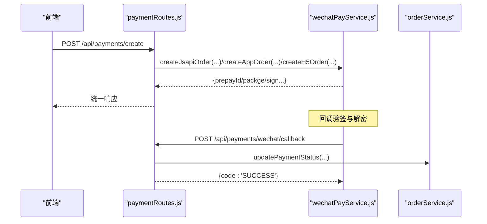
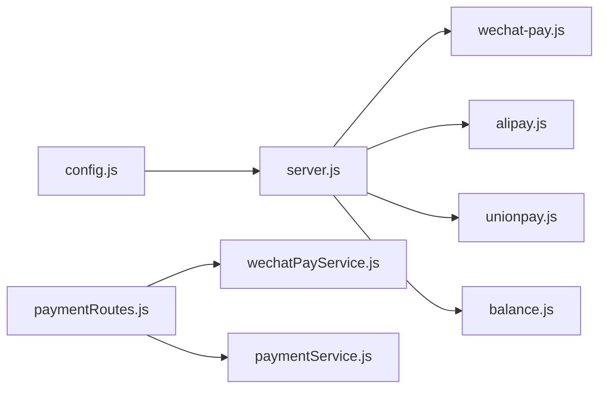

# 支付渠道集成

<cite>
**本文引用的文件**
- [server.js](file://api/payment-server/server.js)
- [config.js](file://api/payment-server/config.js)
- [wechat-pay.js](file://api/payment-server/wechat-pay.js)
- [alipay.js](file://api/payment-server/alipay.js)
- [unionpay.js](file://api/payment-server/unionpay.js)
- [balance.js](file://api/payment-server/balance.js)
- [paymentRoutes.js](file://backend/modules/common/routes/paymentRoutes.js)
- [paymentService.js](file://backend/modules/common/services/paymentService.js)
- [wechatPayService.js](file://backend/modules/common/services/wechatPayService.js)
- [test-payment.js](file://api/payment-server/test-payment.js)
- [QUICK_START.md](file://api/payment-server/QUICK_START.md)
- [TEST_GUIDE.md](file://api/payment-server/TEST_GUIDE.md)
</cite>

## 目录
1. [简介](#简介)
2. [项目结构](#项目结构)
3. [核心组件](#核心组件)
4. [架构总览](#架构总览)
5. [详细组件分析](#详细组件分析)
6. [依赖关系分析](#依赖关系分析)
7. [性能与可靠性](#性能与可靠性)
8. [故障排查指南](#故障排查指南)
9. [结论](#结论)
10. [附录](#附录)

## 简介
本指南面向需要接入微信支付、支付宝、银联支付的开发者，系统梳理现有代码中的支付渠道封装、统一支付抽象层、安全配置管理、回调处理与幂等策略、错误处理与重试降级方案，以及测试与沙箱环境搭建方法。文档以仓库中实际实现为依据，提供可落地的开发参考与扩展建议。

## 项目结构
支付相关代码主要分布在两个位置：
- api/payment-server：独立的支付网关服务，提供统一支付入口与各渠道封装、回调路由、余额与结算模拟服务。
- backend/modules/common：后端业务侧的支付路由与服务（当前以微信V3为主，其他渠道为占位）。

图表来源
- [server.js:1-624](file://api/payment-server/server.js#L1-L624)
- [config.js:1-80](file://api/payment-server/config.js#L1-L80)
- [wechat-pay.js:1-314](file://api/payment-server/wechat-pay.js#L1-L314)
- [alipay.js:1-336](file://api/payment-server/alipay.js#L1-L336)
- [unionpay.js:1-501](file://api/payment-server/unionpay.js#L1-L501)
- [balance.js:1-524](file://api/payment-server/balance.js#L1-L524)
- [paymentRoutes.js:1-215](file://backend/modules/common/routes/paymentRoutes.js#L1-L215)
- [paymentService.js:1-185](file://backend/modules/common/services/paymentService.js#L1-L185)
- [wechatPayService.js:1-396](file://backend/modules/common/services/wechatPayService.js#L1-L396)
- [test-payment.js:1-554](file://api/payment-server/test-payment.js#L1-L554)

章节来源
- [server.js:1-624](file://api/payment-server/server.js#L1-L624)
- [config.js:1-80](file://api/payment-server/config.js#L1-L80)

## 核心组件
- 统一支付入口（支付网关）
  - POST /api/payment/create：根据 paymentMethod 分发到具体渠道；返回前端调起参数或跳转链接。
  - GET /api/payment/query/:orderId：按渠道查询订单状态并更新本地订单记录。
  - POST /api/payment/close/:orderId：关闭未支付订单。
- 渠道封装
  - 微信支付（旧版XML）：统一下单、查询、关闭、退款、签名与验签、小程序调起参数生成。
  - 支付宝：网页/手机网站支付、查询、关闭、退款、RSA2签名与验签。
  - 银联：网关支付、手机网页支付、银行卡直付、查询、撤销、退款、SHA256签名与验签。
- 余额与结算（内存模拟）
  - 用户余额充值/扣减、交易流水、门店待结算/可用余额、提现、报表。
- 后端统一路由（业务侧）
  - 基于微信V3的JSAPI/APP/H5下单、回调验签解密、退款接口。
  - 统一支付抽象层（占位），便于后续扩展更多渠道。

章节来源
- [server.js:36-304](file://api/payment-server/server.js#L36-L304)
- [wechat-pay.js:56-310](file://api/payment-server/wechat-pay.js#L56-L310)
- [alipay.js:68-307](file://api/payment-server/alipay.js#L68-L307)
- [unionpay.js:78-472](file://api/payment-server/unionpay.js#L78-L472)
- [balance.js:244-520](file://api/payment-server/balance.js#L244-L520)
- [paymentRoutes.js:13-212](file://backend/modules/common/routes/paymentRoutes.js#L13-L212)
- [paymentService.js:24-181](file://backend/modules/common/services/paymentService.js#L24-L181)
- [wechatPayService.js:101-392](file://backend/modules/common/services/wechatPayService.js#L101-L392)

## 架构总览
支付网关作为“对外统一入口”，屏蔽各渠道差异，向上提供一致的创建/查询/关闭/退款能力，向下对接各渠道SDK或HTTP API。

图表来源
- [server.js:42-174](file://api/payment-server/server.js#L42-L174)
- [wechat-pay.js:56-127](file://api/payment-server/wechat-pay.js#L56-L127)
- [alipay.js:68-104](file://api/payment-server/alipay.js#L68-L104)
- [unionpay.js:78-123](file://api/payment-server/unionpay.js#L78-L123)
- [balance.js:91-139](file://api/payment-server/balance.js#L91-L139)

## 详细组件分析

### 微信支付（旧版XML）
- 签名算法
  - 请求签名：字典序拼接 key=value&key=apiKey，MD5大写。
  - 小程序调起签名：使用相同规则对 appId/timeStamp/nonceStr/package 进行签名。
- 请求格式
  - XML 文本，Content-Type: text/xml。
  - 统一下单字段包含 appid/mch_id/total_fee/out_trade_no/spbill_create_ip/notify_url/trade_type/openid 等。
- 响应处理
  - return_code/result_code 均为 SUCCESS 视为成功；解析 prepay_id/code_url/mweb_url 等。
- 回调验签
  - 移除 sign 后重新计算签名比对。

图表来源
- [wechat-pay.js:56-127](file://api/payment-server/wechat-pay.js#L56-L127)
- [wechat-pay.js:285-290](file://api/payment-server/wechat-pay.js#L285-L290)
- [wechat-pay.js:295-310](file://api/payment-server/wechat-pay.js#L295-L310)

章节来源
- [wechat-pay.js:1-314](file://api/payment-server/wechat-pay.js#L1-L314)

### 支付宝（RSA2）
- 签名算法
  - RSA-SHA256 私钥签名，公钥验签。
- 请求格式
  - application/x-www-form-urlencoded，字段排序+URL编码后拼接。
- 响应处理
  - alipay.trade.page.pay/wap.pay 返回支付链接；trade.query/close/refund 返回结构化JSON。
- 回调验签
  - 去除 sign 后按相同规则拼接内容，使用支付宝公钥验证。

图表来源
- [alipay.js:9-307](file://api/payment-server/alipay.js#L9-L307)

章节来源
- [alipay.js:1-336](file://api/payment-server/alipay.js#L1-L336)

### 银联支付（SHA256）
- 签名算法
  - SHA256 HMAC，按字典序拼接 key=value 后签名。
- 请求格式
  - 表单提交 application/x-www-form-urlencoded；PC网关返回HTML自动提交表单。
- 响应处理
  - backTrans.do 返回键值对字符串，需自行解析；状态码映射为 success/processing/failed。
- 回调验签
  - 移除 signature/signMethod 后重算签名比对。

图表来源
- [unionpay.js:78-123](file://api/payment-server/unionpay.js#L78-L123)
- [unionpay.js:406-413](file://api/payment-server/unionpay.js#L406-L413)
- [unionpay.js:467-472](file://api/payment-server/unionpay.js#L467-L472)

章节来源
- [unionpay.js:1-501](file://api/payment-server/unionpay.js#L1-L501)

### 余额与结算（内存模拟）
- 功能要点
  - 用户余额：充值、消费、冻结、流水分页。
  - 门店账户：待结算/可用余额、结算周期、提现（手续费模拟）、报表统计。
- 关键流程
  - 订单完成后调用 recordOrderPayment 增加门店待结算金额；定时任务触发 settleToStore 转入可用余额。

图表来源
- [balance.js:244-337](file://api/payment-server/balance.js#L244-L337)
- [balance.js:345-409](file://api/payment-server/balance.js#L345-L409)
- [balance.js:459-520](file://api/payment-server/balance.js#L459-L520)

章节来源
- [balance.js:1-524](file://api/payment-server/balance.js#L1-L524)

### 统一支付抽象层（后端业务侧）
- 设计思路
  - PaymentService 提供 createPayment/refund/queryPayment 等统一方法，内部按 method 分发到 wechat/alipay/unionpay/balance。
  - 当前各渠道方法为占位实现，便于后续替换为真实通道。
- 扩展新支付方式
  - 在 switch(method) 分支新增 case，实现对应 channel.createPayment() 即可。

图表来源
- [paymentService.js:9-181](file://backend/modules/common/services/paymentService.js#L9-L181)

章节来源
- [paymentService.js:1-185](file://backend/modules/common/services/paymentService.js#L1-L185)

### 后端统一路由（微信V3示例）
- 下单
  - JSAPI/APP/H5 三种场景分别调用对应接口，返回前端所需签名参数。
- 回调
  - 校验签名头，解密通知体，更新订单状态并发送通知。
- 退款
  - 调用退款接口并更新订单状态。

图表来源
- [paymentRoutes.js:13-171](file://backend/modules/common/routes/paymentRoutes.js#L13-L171)
- [wechatPayService.js:101-164](file://backend/modules/common/services/wechatPayService.js#L101-L164)
- [wechatPayService.js:339-375](file://backend/modules/common/services/wechatPayService.js#L339-L375)

章节来源
- [paymentRoutes.js:1-215](file://backend/modules/common/routes/paymentRoutes.js#L1-L215)
- [wechatPayService.js:1-396](file://backend/modules/common/services/wechatPayService.js#L1-L396)

## 依赖关系分析
- server.js 作为统一入口，依赖各渠道服务与余额服务，并通过 config.js 读取环境变量。
- 各渠道服务独立实现签名、请求与响应解析，耦合度低，便于替换与扩展。
- 后端 paymentRoutes.js 仅依赖微信V3服务与订单服务，体现“先落地微信，再扩展”的策略。

图表来源
- [server.js:1-35](file://api/payment-server/server.js#L1-L35)
- [config.js:1-80](file://api/payment-server/config.js#L1-L80)
- [paymentRoutes.js:1-12](file://backend/modules/common/routes/paymentRoutes.js#L1-L12)

章节来源
- [server.js:1-624](file://api/payment-server/server.js#L1-L624)
- [config.js:1-80](file://api/payment-server/config.js#L1-L80)
- [paymentRoutes.js:1-215](file://backend/modules/common/routes/paymentRoutes.js#L1-L215)

## 性能与可靠性
- 网络与I/O
  - 各渠道均以异步HTTP请求为主，注意设置合理的超时与重试上限。
- 幂等性
  - 建议以 out_trade_no 作为幂等键，在回调处理前检查本地是否已处理成功，避免重复入账。
- 重试与退避
  - 对第三方不稳定接口（如查询）采用指数退避重试；失败时写入死信队列以便人工干预。
- 降级方案
  - 当某渠道不可用时，通过配置开关快速禁用，并引导用户使用备用支付方式。
- 资源隔离
  - 不同渠道的请求池与证书/密钥加载应隔离，避免相互影响。

[本节为通用指导，不直接分析具体文件]

## 故障排查指南
- 常见错误定位
  - 签名失败：核对参与签名字段顺序、大小写、空值过滤与密钥版本（MD5/RSA2/HMAC-SHA256）。
  - 回调失败：确认回调URL公网可达、HTTPS、签名头/报文格式符合规范。
  - 订单状态不一致：优先以渠道官方查询为准，结合本地幂等表修正。
- 日志与监控
  - 记录每次请求的入参摘要、签名串、响应码与耗时；对异常堆栈集中采集。
- 回滚与补偿
  - 对部分成功的长事务，提供对账任务与手工补偿接口。

章节来源
- [server.js:306-451](file://api/payment-server/server.js#L306-L451)
- [wechat-pay.js:285-290](file://api/payment-server/wechat-pay.js#L285-L290)
- [alipay.js:303-307](file://api/payment-server/alipay.js#L303-L307)
- [unionpay.js:467-472](file://api/payment-server/unionpay.js#L467-L472)

## 结论
本项目已实现多支付渠道的统一接入与基础闭环，具备清晰的职责划分与可扩展的抽象层。建议在以下方面持续完善：
- 将后端 paymentService 的各渠道占位实现替换为真实通道。
- 引入分布式锁与幂等表，强化回调处理的幂等性与一致性。
- 建立完善的对账、重试与降级机制，提升生产稳定性。

[本节为总结性内容，不直接分析具体文件]

## 附录

### 安全配置管理
- 密钥与证书
  - 通过环境变量注入各渠道密钥与证书路径，避免硬编码。
  - 生产环境强制HTTPS，妥善保管私钥与证书权限。
- 签名与验签
  - 严格遵循各渠道签名规范，确保时间戳、随机串、字段排序一致。
  - 回调验签失败一律拒绝并记录告警。

章节来源
- [config.js:12-62](file://api/payment-server/config.js#L12-L62)
- [QUICK_START.md:255-311](file://api/payment-server/QUICK_START.md#L255-L311)

### 支付状态同步与回调处理
- 统一入口在收到渠道回调后，执行验签→幂等检查→状态更新→结算记账。
- 对于延迟到账或处理中状态，提供轮询查询与最终一致性保障。

章节来源
- [server.js:306-451](file://api/payment-server/server.js#L306-L451)
- [balance.js:244-337](file://api/payment-server/balance.js#L244-L337)

### 错误处理策略、重试与降级
- 错误分类：参数错误、签名错误、网络超时、渠道限流、业务拒绝。
- 重试策略：对瞬时错误采用指数退避；对业务拒绝直接失败。
- 降级策略：按渠道开关动态切换，必要时走余额兜底。

章节来源
- [server.js:167-174](file://api/payment-server/server.js#L167-L174)
- [server.js:234-240](file://api/payment-server/server.js#L234-L240)

### 测试方法与模拟环境搭建
- 启动测试服务器
  - 安装依赖后运行测试模式，无需真实密钥。
- 运行自动化测试
  - 执行 test-payment.js 覆盖健康检查、余额充值、各渠道创建订单、结算查询与提现。
- 手动API测试
  - 参考 TEST_GUIDE.md 提供的 curl 示例，逐项验证接口行为。

章节来源
- [TEST_GUIDE.md:1-457](file://api/payment-server/TEST_GUIDE.md#L1-L457)
- [test-payment.js:1-554](file://api/payment-server/test-payment.js#L1-L554)
- [QUICK_START.md:18-44](file://api/payment-server/QUICK_START.md#L18-L44)