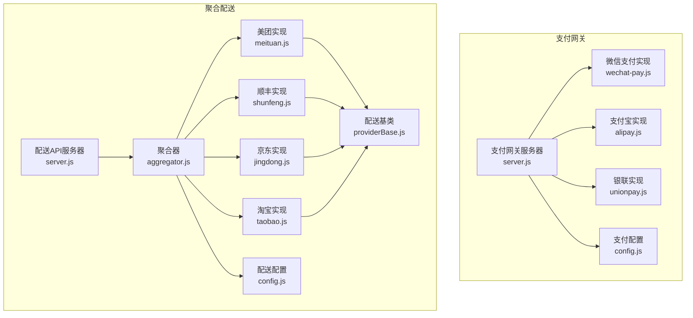
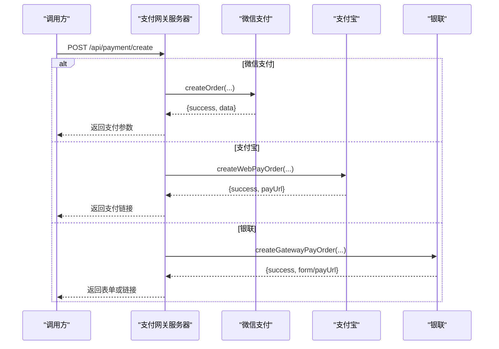
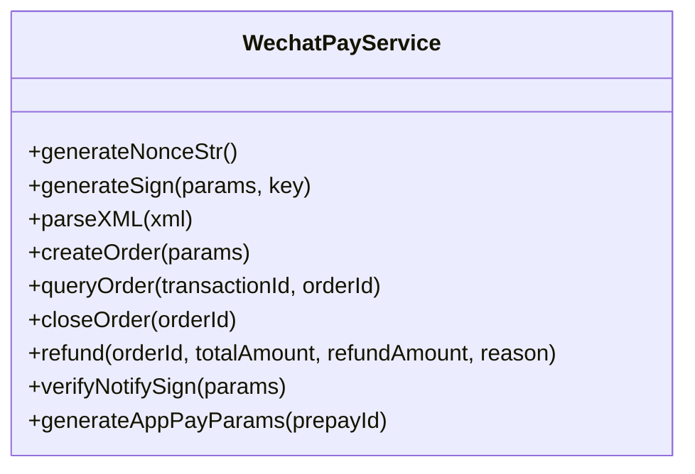
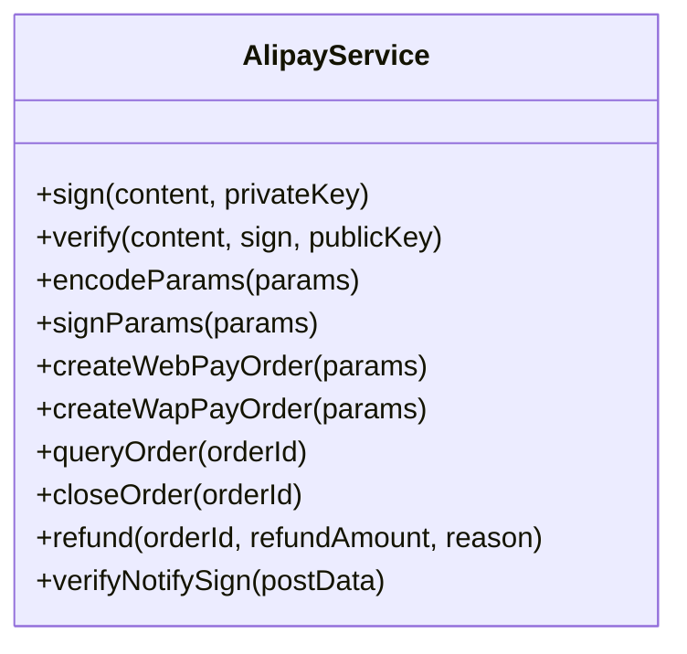
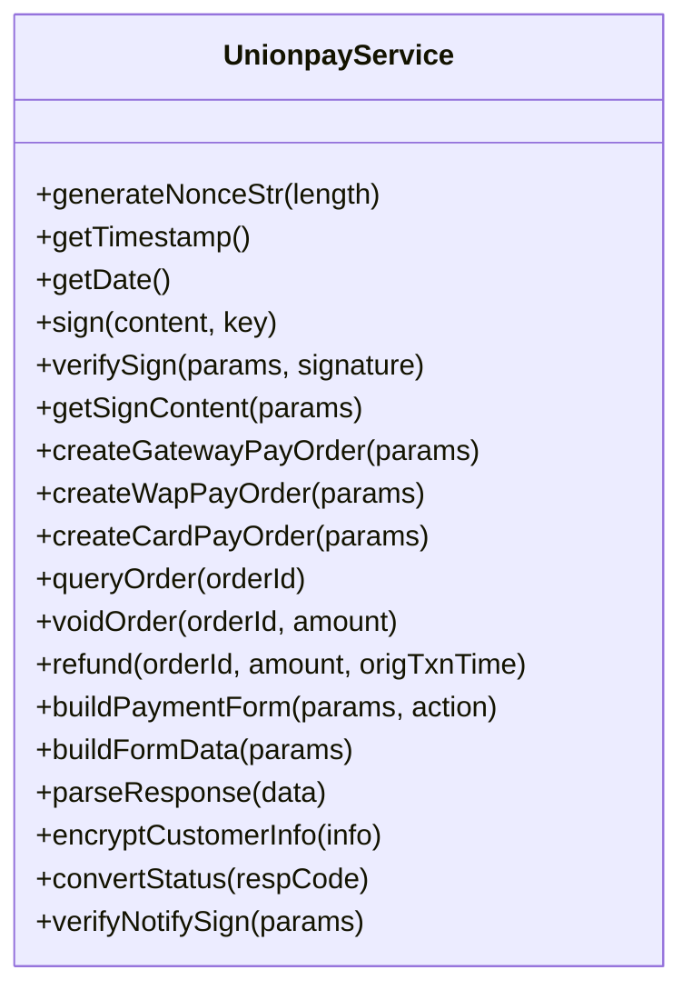
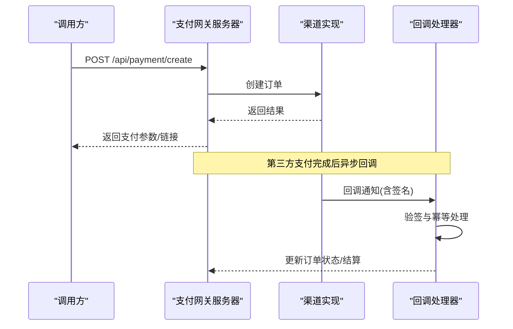
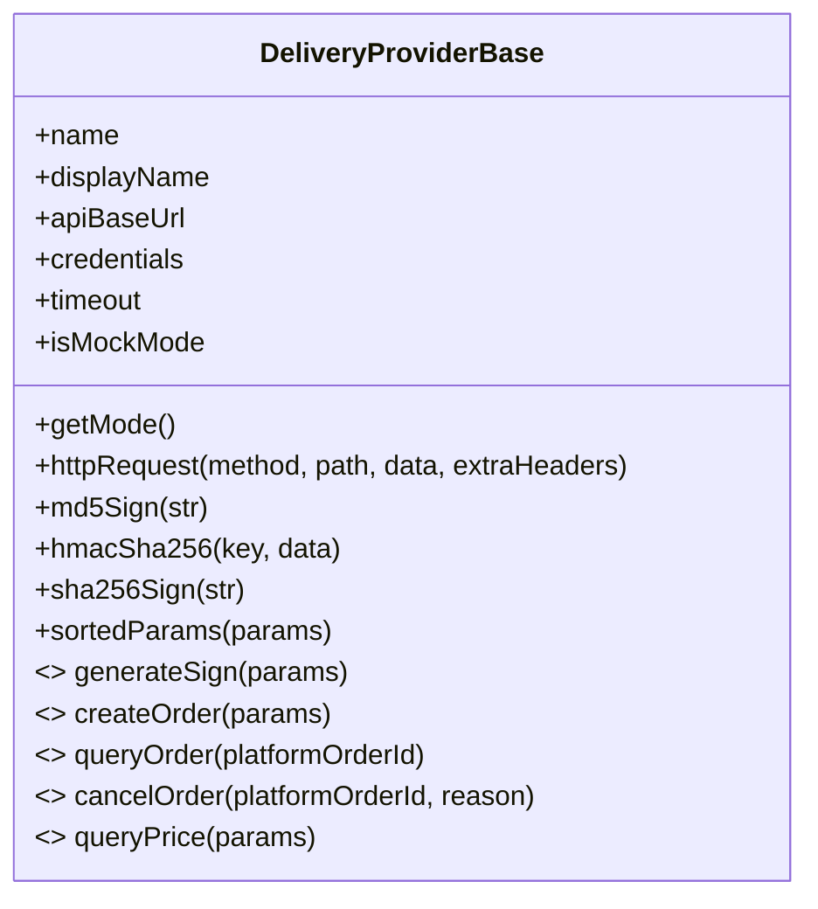
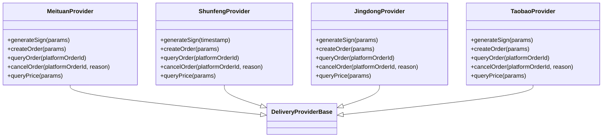
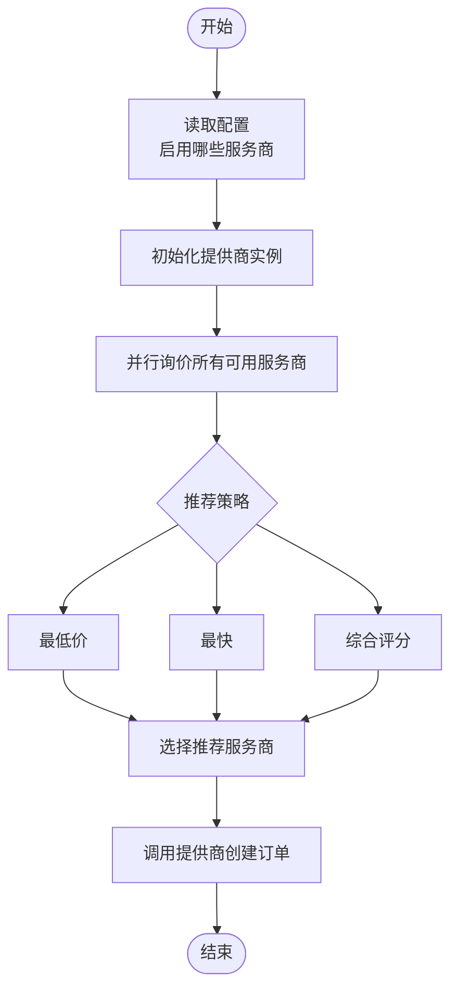
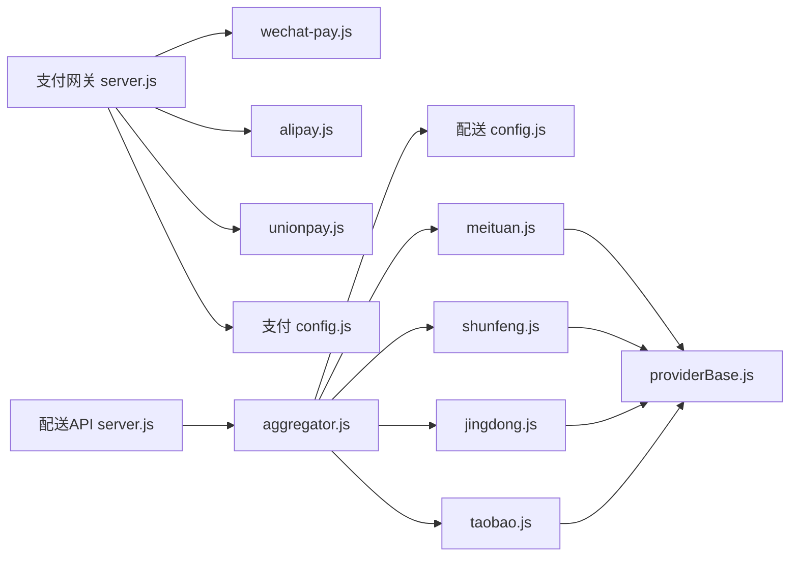

# 第三方服务集成

<cite>
**本文引用的文件**   
- [server.js](file://api/payment-server/server.js)
- [wechat-pay.js](file://api/payment-server/wechat-pay.js)
- [alipay.js](file://api/payment-server/alipay.js)
- [unionpay.js](file://api/payment-server/unionpay.js)
- [config.js](file://api/payment-server/config.js)
- [aggregator.js](file://delivery-api/aggregator.js)
- [config.js](file://delivery-api/config.js)
- [server.js](file://delivery-api/server.js)
- [providerBase.js](file://backend/services/deliveryProviders/providerBase.js)
- [meituan.js](file://backend/services/deliveryProviders/meituan.js)
- [shunfeng.js](file://backend/services/deliveryProviders/shunfeng.js)
- [jingdong.js](file://backend/services/deliveryProviders/jingdong.js)
- [taobao.js](file://backend/services/deliveryProviders/taobao.js)
- [index.js](file://backend/services/deliveryProviders/index.js)
- [payment-api.js](file://api/payment-api.js)
- [delivery-api.js](file://api/delivery-api.js)
</cite>

## 目录
1. [引言](#引言)
2. [项目结构](#项目结构)
3. [核心组件](#核心组件)
4. [架构总览](#架构总览)
5. [详细组件分析](#详细组件分析)
6. [依赖关系分析](#依赖关系分析)
7. [性能与可靠性](#性能与可靠性)
8. [故障排查指南](#故障排查指南)
9. [结论](#结论)
10. [附录](#附录)

## 引言
本指南面向干洗店管理系统的第三方服务集成开发，聚焦支付渠道（微信支付、支付宝、银联）与配送服务商（美团、顺丰、京东等）的对接方法。文档基于仓库中已实现的支付网关与聚合配送系统，说明统一接口抽象层设计、错误处理机制、安全配置管理、监控与故障转移策略，并提供集成测试与模拟服务搭建建议，帮助开发者快速扩展新的服务提供商。

## 项目结构
本项目包含两个关键子系统：
- 支付网关服务：提供统一的支付创建、查询、关闭与回调处理，封装微信、支付宝、银联等渠道。
- 聚合配送服务：通过聚合器模式统一调度多家配送服务商，支持询价、下单、状态查询与取消。

**图表来源**
- [server.js:1-624](file://api/payment-server/server.js#L1-L624)
- [wechat-pay.js:1-314](file://api/payment-server/wechat-pay.js#L1-L314)
- [alipay.js:1-336](file://api/payment-server/alipay.js#L1-L336)
- [unionpay.js:1-501](file://api/payment-server/unionpay.js#L1-L501)
- [config.js:1-80](file://api/payment-server/config.js#L1-L80)
- [server.js:1-377](file://delivery-api/server.js#L1-L377)
- [aggregator.js:1-237](file://delivery-api/aggregator.js#L1-L237)
- [config.js:1-93](file://delivery-api/config.js#L1-L93)
- [providerBase.js:1-124](file://backend/services/deliveryProviders/providerBase.js#L1-L124)
- [meituan.js:1-257](file://backend/services/deliveryProviders/meituan.js#L1-L257)
- [shunfeng.js:1-262](file://backend/services/deliveryProviders/shunfeng.js#L1-L262)
- [jingdong.js:1-278](file://backend/services/deliveryProviders/jingdong.js#L1-L278)
- [taobao.js:1-263](file://backend/services/deliveryProviders/taobao.js#L1-L263)

**章节来源**
- [server.js:1-624](file://api/payment-server/server.js#L1-L624)
- [server.js:1-377](file://delivery-api/server.js#L1-L377)

## 核心组件
- 支付网关统一入口：对外暴露统一支付、查询、关闭与回调路由，内部按支付方式分发到对应渠道实现。
- 渠道实现：
  - 微信支付：统一下单、订单查询、关闭、退款、签名生成与验签、小程序调起参数生成。
  - 支付宝：网页/手机网站支付、交易查询、关闭、退款、RSA2签名与验签。
  - 银联：网关支付、手机网页支付、银行卡直付、查询、撤销、退款、表单构建与签名验证。
- 聚合配送：
  - 聚合器：并行询价、推荐策略、自动选择最优服务商、统一下单/查询/取消。
  - 配送提供商：各平台具体实现，继承统一基类，具备Mock模式与真实API切换能力。

**章节来源**
- [server.js:36-174](file://api/payment-server/server.js#L36-L174)
- [wechat-pay.js:1-314](file://api/payment-server/wechat-pay.js#L1-L314)
- [alipay.js:1-336](file://api/payment-server/alipay.js#L1-L336)
- [unionpay.js:1-501](file://api/payment-server/unionpay.js#L1-L501)
- [aggregator.js:1-237](file://delivery-api/aggregator.js#L1-L237)
- [providerBase.js:1-124](file://backend/services/deliveryProviders/providerBase.js#L1-L124)

## 架构总览
支付与配送两条主线在系统中解耦，分别由独立服务承载，并通过统一接口对外暴露。

**图表来源**
- [server.js:36-174](file://api/payment-server/server.js#L36-L174)
- [wechat-pay.js:56-127](file://api/payment-server/wechat-pay.js#L56-L127)
- [alipay.js:68-104](file://api/payment-server/alipay.js#L68-L104)
- [unionpay.js:78-123](file://api/payment-server/unionpay.js#L78-L123)

## 详细组件分析

### 支付渠道集成

#### 微信支付
- 功能要点
  - 统一下单：构造XML请求、MD5签名、发送HTTPS请求、解析XML响应。
  - 订单查询/关闭/退款：参数组装、签名、异常捕获与错误信息标准化。
  - 回调验签：去除sign后重算签名并比对。
  - 小程序调起参数：生成timeStamp、nonceStr、package、paySign。
- 错误处理
  - 网络异常与业务错误均返回{success:false, error,...}，便于上层统一处理。
- 安全配置
  - 从配置加载appId、mchId、apiKey、notifyUrl等敏感信息。

**图表来源**
- [wechat-pay.js:1-314](file://api/payment-server/wechat-pay.js#L1-L314)

**章节来源**
- [wechat-pay.js:1-314](file://api/payment-server/wechat-pay.js#L1-L314)
- [config.js:12-33](file://api/payment-server/config.js#L12-L33)

#### 支付宝
- 功能要点
  - RSA2签名与验签：使用私钥签名、公钥验签。
  - 网页/手机网站支付：生成支付URL，支持return_url与notify_url。
  - 交易查询/关闭/退款：统一参数编码与签名流程。
- 错误处理
  - 对非成功码进行错误映射，统一返回格式。
- 安全配置
  - 从配置加载appId、privateKey、alipayPublicKey、gateway、notifyUrl。

**图表来源**
- [alipay.js:1-336](file://api/payment-server/alipay.js#L1-L336)

**章节来源**
- [alipay.js:1-336](file://api/payment-server/alipay.js#L1-L336)
- [config.js:35-47](file://api/payment-server/config.js#L35-L47)

#### 银联支付
- 功能要点
  - 网关支付/手机网页支付：构建表单或参数，生成SHA256签名。
  - 银行卡直付：加密客户信息，直接发起扣款请求。
  - 查询/撤销/退款：标准字段拼装与签名。
  - 回调验签：移除signature/signMethod后重算签名比对。
- 错误处理
  - 将上游响应码转换为统一错误对象。
- 安全配置
  - 从配置加载merchantId、signCertPath、signCertPwd、notifyUrl、apiUrl。

**图表来源**
- [unionpay.js:1-501](file://api/payment-server/unionpay.js#L1-L501)

**章节来源**
- [unionpay.js:1-501](file://api/payment-server/unionpay.js#L1-L501)
- [config.js:49-62](file://api/payment-server/config.js#L49-L62)

#### 支付网关统一入口与回调
- 统一支付入口：根据paymentMethod路由到对应渠道；记录本地订单以便后续查询与关闭。
- 统一查询/关闭：按支付方式调用对应渠道接口，更新本地订单状态。
- 回调处理：
  - 微信：XML回调，验签成功后更新订单状态并记录结算。
  - 支付宝：JSON回调，验签成功后更新订单状态并记录结算。
  - 银联：表单回调，验签成功后更新订单状态并记录结算。

**图表来源**
- [server.js:36-174](file://api/payment-server/server.js#L36-L174)
- [server.js:306-451](file://api/payment-server/server.js#L306-L451)

**章节来源**
- [server.js:36-174](file://api/payment-server/server.js#L36-L174)
- [server.js:306-451](file://api/payment-server/server.js#L306-L451)

### 配送服务商对接模式

#### 统一抽象与基类
- 基类职责
  - HTTPS请求封装、超时控制、通用签名工具（MD5/HMAC-SHA256/SHA256）、参数排序拼接。
  - 抽象接口：generateSign、createOrder、queryOrder、cancelOrder、queryPrice。
  - Mock模式：未配置密钥自动降级为模拟数据，保障开发与联调。
- 运行模式
  - getMode()返回mock或real，getStatus()可获取各提供商状态。

**图表来源**
- [providerBase.js:1-124](file://backend/services/deliveryProviders/providerBase.js#L1-L124)

**章节来源**
- [providerBase.js:1-124](file://backend/services/deliveryProviders/providerBase.js#L1-L124)

#### 具体提供商实现
- 美团跑腿
  - 签名算法：appId+timestamp+secret的MD5。
  - 接口：创建订单、查询状态、取消、询价；失败时回退至Mock。
- 顺丰同城
  - 签名算法：timestamp+checkWord的MD5。
  - 接口：创建订单、查询状态、取消、询价；失败时回退至Mock。
- 京东秒送（达达开放平台）
  - 签名算法：参数排序拼接末尾加secret取MD5大写。
  - 接口：创建订单、查询状态、取消、询价；失败时回退至Mock。
- 淘宝闪送（蜂鸟即配）
  - 签名算法：参数排序拼接secret取MD5。
  - 接口：创建订单、查询状态、取消、询价；失败时回退至Mock。

**图表来源**
- [meituan.js:1-257](file://backend/services/deliveryProviders/meituan.js#L1-L257)
- [shunfeng.js:1-262](file://backend/services/deliveryProviders/shunfeng.js#L1-L262)
- [jingdong.js:1-278](file://backend/services/deliveryProviders/jingdong.js#L1-L278)
- [taobao.js:1-263](file://backend/services/deliveryProviders/taobao.js#L1-L263)
- [providerBase.js:1-124](file://backend/services/deliveryProviders/providerBase.js#L1-L124)

**章节来源**
- [meituan.js:1-257](file://backend/services/deliveryProviders/meituan.js#L1-L257)
- [shunfeng.js:1-262](file://backend/services/deliveryProviders/shunfeng.js#L1-L262)
- [jingdong.js:1-278](file://backend/services/deliveryProviders/jingdong.js#L1-L278)
- [taobao.js:1-263](file://backend/services/deliveryProviders/taobao.js#L1-L263)

#### 聚合器与统一入口
- 聚合器职责
  - 初始化可用提供商（按配置开关）。
  - 并行询价并收集结果，按策略推荐最优服务商。
  - 指定或自动选择服务商创建订单、查询状态、取消订单。
- 统一API
  - 提供健康检查、服务商列表、询价、下单、查询、取消等REST接口。

**图表来源**
- [aggregator.js:1-237](file://delivery-api/aggregator.js#L1-L237)
- [config.js:80-93](file://delivery-api/config.js#L80-L93)

**章节来源**
- [aggregator.js:1-237](file://delivery-api/aggregator.js#L1-L237)
- [server.js:1-377](file://delivery-api/server.js#L1-L377)
- [config.js:1-93](file://delivery-api/config.js#L1-L93)

### API封装最佳实践
- 请求重试
  - 建议在聚合器或HTTP客户端层增加指数退避重试，针对瞬时网络抖动与限流场景。
- 超时处理
  - 基类已提供超时控制，建议为不同渠道设置差异化超时阈值，并在异常时快速失败或降级。
- 日志记录
  - 关键路径（创建、查询、回调）需记录请求ID、时间戳、上游响应码与耗时，便于追踪与审计。
- 幂等与去重
  - 回调处理应基于订单号与流水号做幂等校验，避免重复入账。
- 错误分类
  - 区分网络错误、业务错误、签名错误，分别采取重试、告警或人工介入策略。

[本节为通用指导，不直接分析具体文件]

### 安全配置管理
- 密钥管理
  - 通过环境变量注入敏感配置（如微信apiKey、支付宝公私钥、银联证书密码），避免硬编码。
- 签名与验签
  - 严格遵循各平台签名规范，确保参数排序、编码一致；回调验签必须执行。
- 传输安全
  - 生产环境强制HTTPS，必要时启用双向SSL（如银联退款）。
- 最小权限
  - 仅授予必要权限与回调域名白名单，定期轮换密钥。

**章节来源**
- [config.js:1-80](file://api/payment-server/config.js#L1-L80)
- [config.js:1-93](file://delivery-api/config.js#L1-L93)

### 监控与故障转移
- 监控指标
  - 成功率、延迟分布、错误码分布、回调处理时长、重试次数。
- 熔断与降级
  - 当某渠道连续失败超过阈值，临时熔断并切换到备选渠道或进入Mock模式。
- 健康检查
  - 提供健康检查接口，暴露各服务可用性状态。

**章节来源**
- [server.js:580-592](file://api/payment-server/server.js#L580-L592)
- [server.js:205-212](file://delivery-api/server.js#L205-L212)

### 集成测试与模拟服务
- 单元测试
  - 对签名、验签、参数编码、状态映射编写用例，覆盖边界条件。
- 集成测试
  - 使用沙箱环境验证端到端流程（下单、回调、查询、关闭、退款）。
- 模拟服务
  - 利用各提供商的Mock模式快速验证业务流程，无需真实密钥。
- 压测与稳定性
  - 对聚合器并发询价与下单进行压测，评估超时与重试策略效果。

**章节来源**
- [meituan.js:211-253](file://backend/services/deliveryProviders/meituan.js#L211-L253)
- [shunfeng.js:217-258](file://backend/services/deliveryProviders/shunfeng.js#L217-L258)
- [jingdong.js:233-274](file://backend/services/deliveryProviders/jingdong.js#L233-L274)
- [taobao.js:218-259](file://backend/services/deliveryProviders/taobao.js#L218-L259)

## 依赖关系分析

**图表来源**
- [server.js:1-624](file://api/payment-server/server.js#L1-L624)
- [wechat-pay.js:1-314](file://api/payment-server/wechat-pay.js#L1-L314)
- [alipay.js:1-336](file://api/payment-server/alipay.js#L1-L336)
- [unionpay.js:1-501](file://api/payment-server/unionpay.js#L1-L501)
- [config.js:1-80](file://api/payment-server/config.js#L1-L80)
- [server.js:1-377](file://delivery-api/server.js#L1-L377)
- [aggregator.js:1-237](file://delivery-api/aggregator.js#L1-L237)
- [config.js:1-93](file://delivery-api/config.js#L1-L93)
- [providerBase.js:1-124](file://backend/services/deliveryProviders/providerBase.js#L1-L124)
- [meituan.js:1-257](file://backend/services/deliveryProviders/meituan.js#L1-L257)
- [shunfeng.js:1-262](file://backend/services/deliveryProviders/shunfeng.js#L1-L262)
- [jingdong.js:1-278](file://backend/services/deliveryProviders/jingdong.js#L1-L278)
- [taobao.js:1-263](file://backend/services/deliveryProviders/taobao.js#L1-L263)

**章节来源**
- [server.js:1-624](file://api/payment-server/server.js#L1-L624)
- [server.js:1-377](file://delivery-api/server.js#L1-L377)

## 性能与可靠性
- 并发与并行
  - 聚合器并行询价，降低整体延迟；注意上游限流与配额。
- 超时与重试
  - 合理设置超时阈值，结合指数退避重试，避免雪崩。
- 资源隔离
  - 支付与配送服务独立部署，避免相互影响。
- 容量规划
  - 关注回调峰值与数据库写入压力，必要时引入消息队列削峰。

[本节为通用指导，不直接分析具体文件]

## 故障排查指南
- 常见问题定位
  - 签名错误：核对参数排序、编码与密钥版本。
  - 回调丢失：检查公网可达性与防火墙策略。
  - 超时失败：提升超时阈值或优化上游接口。
  - 状态不一致：核对幂等逻辑与本地状态机。
- 诊断手段
  - 开启详细日志，记录请求ID与上游响应。
  - 使用健康检查接口确认服务可用性。
  - 借助Mock模式隔离问题域。

**章节来源**
- [server.js:580-592](file://api/payment-server/server.js#L580-L592)
- [server.js:205-212](file://delivery-api/server.js#L205-L212)

## 结论
通过支付网关与聚合配送的统一抽象，系统实现了多渠道接入与灵活扩展。基类与聚合器模式降低了新增服务商的成本，配合完善的错误处理、安全配置与监控策略，可有效提升系统的稳定性与可维护性。建议在生产环境中完善重试、熔断与监控告警，持续优化用户体验与运营效率。

[本节为总结性内容，不直接分析具体文件]

## 附录
- 前端预留API封装
  - 支付API封装：定义支付方式、创建订单、查询状态、退款、余额操作等接口（当前为预留/模拟实现）。
  - 配送API封装：定义服务商列表、询价、下单、取消、状态查询等接口（当前为预留/模拟实现）。

**章节来源**
- [payment-api.js:1-427](file://api/payment-api.js#L1-L427)
- [delivery-api.js:1-283](file://api/delivery-api.js#L1-L283)