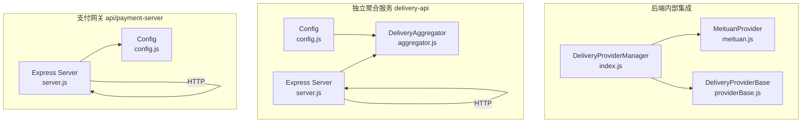
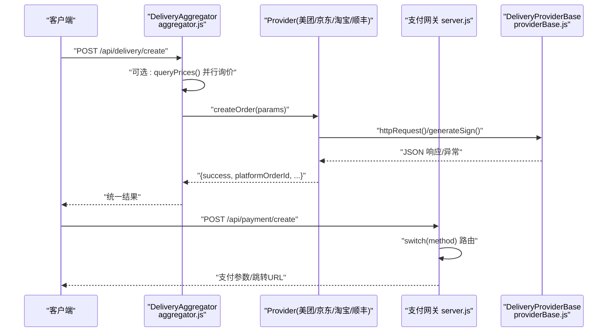
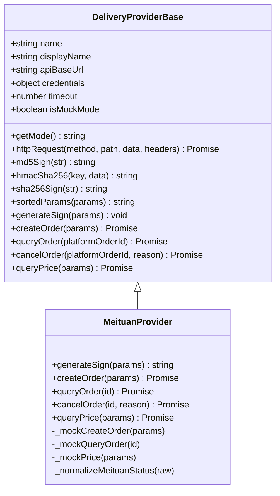
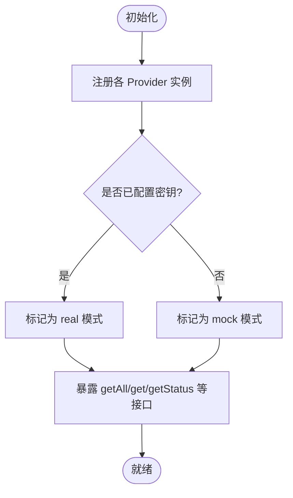
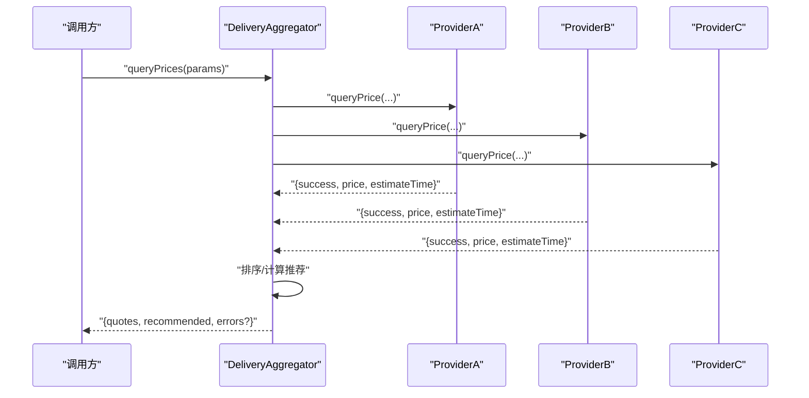
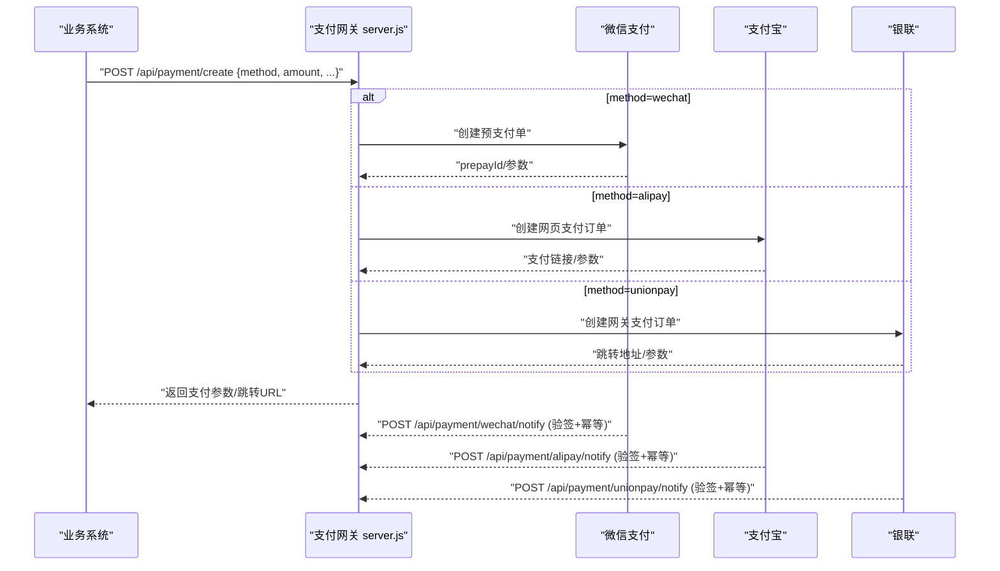
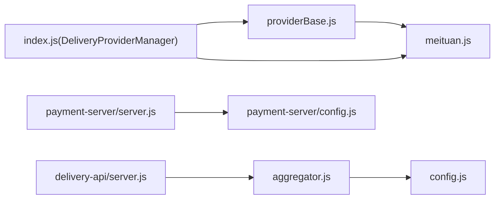

# 通用集成模式

<cite>
**本文引用的文件**   
- [backend/services/deliveryProviders/providerBase.js](file://backend/services/deliveryProviders/providerBase.js)
- [backend/services/deliveryProviders/index.js](file://backend/services/deliveryProviders/index.js)
- [backend/services/deliveryProviders/meituan.js](file://backend/services/deliveryProviders/meituan.js)
- [delivery-api/aggregator.js](file://delivery-api/aggregator.js)
- [delivery-api/config.js](file://delivery-api/config.js)
- [delivery-api/server.js](file://delivery-api/server.js)
- [api/payment-server/config.js](file://api/payment-server/config.js)
- [api/payment-server/server.js](file://api/payment-server/server.js)
- [backend/modules/common/services/paymentService.js](file://backend/modules/common/services/paymentService.js)
- [backend/modules/common/middlewares/auth.js](file://backend/modules/common/middlewares/auth.js)
</cite>

## 目录
1. [引言](#引言)
2. [项目结构](#项目结构)
3. [核心组件](#核心组件)
4. [架构总览](#架构总览)
5. [详细组件分析](#详细组件分析)
6. [依赖关系分析](#依赖关系分析)
7. [性能与可靠性](#性能与可靠性)
8. [故障排查指南](#故障排查指南)
9. [结论](#结论)
10. [附录](#附录)

## 引言
本指南围绕“第三方服务集成的通用模式和最佳实践”，结合仓库中配送聚合与支付网关的实现，系统化阐述统一接口抽象层、服务发现与注册、动态加载与管理、错误处理策略（分类/重试/降级）、配置管理（环境变量/热更新/敏感信息加密）、日志监控（请求追踪/指标/告警）、测试框架（契约/端到端）与安全考虑（密钥管理/签名验证/网络安全）。目标是帮助团队构建可扩展、可观测、高可用的第三方服务集成框架。

## 项目结构
本项目在两个层面实现了第三方服务集成：
- 后端内部集成：通过 providerBase 基类与各 Provider 实现，配合 DeliveryProviderManager 完成统一调度与状态查询。
- 独立聚合服务 delivery-api：对外暴露统一的配送 API，内部聚合多家服务商，提供询价、下单、查询、取消等能力。
- 支付网关 api/payment-server：统一接入微信/支付宝/银联/余额，提供创建/查询/关闭订单及回调处理。

图表来源
- [backend/services/deliveryProviders/index.js:1-87](file://backend/services/deliveryProviders/index.js#L1-L87)
- [backend/services/deliveryProviders/providerBase.js:1-124](file://backend/services/deliveryProviders/providerBase.js#L1-L124)
- [backend/services/deliveryProviders/meituan.js:1-257](file://backend/services/deliveryProviders/meituan.js#L1-L257)
- [delivery-api/aggregator.js:1-237](file://delivery-api/aggregator.js#L1-L237)
- [delivery-api/config.js:1-93](file://delivery-api/config.js#L1-L93)
- [delivery-api/server.js:1-377](file://delivery-api/server.js#L1-L377)
- [api/payment-server/config.js:1-80](file://api/payment-server/config.js#L1-L80)
- [api/payment-server/server.js:1-624](file://api/payment-server/server.js#L1-L624)

章节来源
- [backend/services/deliveryProviders/index.js:1-87](file://backend/services/deliveryProviders/index.js#L1-L87)
- [backend/services/deliveryProviders/providerBase.js:1-124](file://backend/services/deliveryProviders/providerBase.js#L1-L124)
- [backend/services/deliveryProviders/meituan.js:1-257](file://backend/services/deliveryProviders/meituan.js#L1-L257)
- [delivery-api/aggregator.js:1-237](file://delivery-api/aggregator.js#L1-L237)
- [delivery-api/config.js:1-93](file://delivery-api/config.js#L1-L93)
- [delivery-api/server.js:1-377](file://delivery-api/server.js#L1-L377)
- [api/payment-server/config.js:1-80](file://api/payment-server/config.js#L1-L80)
- [api/payment-server/server.js:1-624](file://api/payment-server/server.js#L1-L624)

## 核心组件
- 统一抽象基类：封装 HTTPS 请求、签名算法、超时控制、Mock 模式判断与响应标准化，要求子类实现 createOrder/queryOrder/cancelOrder/queryPrice/generateSign。
- 提供商管理器：集中注册各 Provider，提供 get/getAll/getStatus/getRealProviders 以及统一方法转发。
- 聚合调度器：对外暴露统一 API，支持并行询价、推荐策略（最低价/最快/综合评分），并自动选择最优 Provider 下单。
- 支付网关：统一入口按支付方式路由到具体实现，支持创建/查询/关闭订单与多渠道回调验签与落库。
- 认证中间件：解析 Bearer Token，注入用户上下文，支持开发模式下的多种模拟身份。

章节来源
- [backend/services/deliveryProviders/providerBase.js:1-124](file://backend/services/deliveryProviders/providerBase.js#L1-L124)
- [backend/services/deliveryProviders/index.js:1-87](file://backend/services/deliveryProviders/index.js#L1-L87)
- [delivery-api/aggregator.js:1-237](file://delivery-api/aggregator.js#L1-L237)
- [api/payment-server/server.js:1-624](file://api/payment-server/server.js#L1-L624)
- [backend/modules/common/middlewares/auth.js:1-209](file://backend/modules/common/middlewares/auth.js#L1-L209)

## 架构总览
下图展示了从外部请求到具体第三方服务的调用链路，包括聚合层、提供商层与支付网关的交互。

图表来源
- [delivery-api/aggregator.js:1-237](file://delivery-api/aggregator.js#L1-L237)
- [backend/services/deliveryProviders/providerBase.js:1-124](file://backend/services/deliveryProviders/providerBase.js#L1-L124)
- [api/payment-server/server.js:1-624](file://api/payment-server/server.js#L1-L624)

## 详细组件分析

### 统一接口抽象层（基于 providerBase.js）
- 设计要点
  - 构造期注入 name/displayName/apiBaseUrl/credentials/timeout，并自动判定 isMockMode。
  - 统一 httpRequest 封装：HTTPS 请求、Content-Type、超时、错误抛出。
  - 内置签名工具：md5/hmac-sha256/sha256/sortedParams，适配不同平台签名风格。
  - 抽象方法强制子类实现：generateSign/createOrder/queryOrder/cancelOrder/queryPrice。
- 扩展建议
  - 新增 Provider 仅需继承基类并实现抽象方法；在 index.js 中注册即可被 Manager 发现。
  - 为每个 Provider 定义清晰的输入输出契约，便于上层聚合与测试。

图表来源
- [backend/services/deliveryProviders/providerBase.js:1-124](file://backend/services/deliveryProviders/providerBase.js#L1-L124)
- [backend/services/deliveryProviders/meituan.js:1-257](file://backend/services/deliveryProviders/meituan.js#L1-L257)

章节来源
- [backend/services/deliveryProviders/providerBase.js:1-124](file://backend/services/deliveryProviders/providerBase.js#L1-L124)
- [backend/services/deliveryProviders/meituan.js:1-257](file://backend/services/deliveryProviders/meituan.js#L1-L257)

### 服务发现与注册（DeliveryProviderManager）
- 职责
  - 集中维护 providers 映射，提供 getAll/get/getStatus/getRealProviders。
  - 统一转发 createOrder/queryOrder/cancelOrder/queryPrice，并对未知 Provider 返回明确错误。
- 动态加载与管理
  - 当前为静态注册；可按需改为扫描目录或读取配置表进行动态加载。
  - getStatus 可暴露健康检查接口，供上游编排系统探测可用 Provider。

图表来源
- [backend/services/deliveryProviders/index.js:1-87](file://backend/services/deliveryProviders/index.js#L1-L87)

章节来源
- [backend/services/deliveryProviders/index.js:1-87](file://backend/services/deliveryProviders/index.js#L1-L87)

### 聚合调度器（DeliveryAggregator）
- 功能
  - initProviders 根据配置启用各 Provider。
  - queryPrices 并行询价，收集成功与失败结果，按价格排序并给出推荐。
  - createOrder 支持指定 Provider 或自动选择最优 Provider。
  - queryOrder/cancelOrder 透传到具体 Provider。
- 推荐策略
  - lowest_price/fastest/recommended（综合评分）。

图表来源
- [delivery-api/aggregator.js:1-237](file://delivery-api/aggregator.js#L1-L237)

章节来源
- [delivery-api/aggregator.js:1-237](file://delivery-api/aggregator.js#L1-L237)

### 支付网关（api/payment-server）
- 统一入口
  - POST /api/payment/create 按 paymentMethod 路由到微信/支付宝/银联/余额。
  - GET /api/payment/query/:orderId 查询支付状态。
  - POST /api/payment/close/:orderId 关闭订单。
- 回调处理
  - 微信/支付宝/银联回调均包含签名校验与幂等处理逻辑，成功后更新本地订单状态并记录结算。
- 配置
  - config.js 集中管理各渠道 appId/key/notifyUrl 等，支持多环境切换。

图表来源
- [api/payment-server/server.js:1-624](file://api/payment-server/server.js#L1-L624)
- [api/payment-server/config.js:1-80](file://api/payment-server/config.js#L1-L80)

章节来源
- [api/payment-server/server.js:1-624](file://api/payment-server/server.js#L1-L624)
- [api/payment-server/config.js:1-80](file://api/payment-server/config.js#L1-L80)

### 认证与鉴权中间件
- 功能
  - 解析 Authorization: Bearer <token>，支持开发模式下的 dev-admin/dev-chain/mock_token。
  - 将用户上下文挂载至 req.user，供后续路由使用。
  - 提供 requireRoles 工厂用于角色校验。
- 安全建议
  - 生产环境禁用开发模式分支；严格校验 token 有效期与签名。
  - 对敏感接口增加 IP 白名单与速率限制。

章节来源
- [backend/modules/common/middlewares/auth.js:1-209](file://backend/modules/common/middlewares/auth.js#L1-L209)

## 依赖关系分析
- 耦合与内聚
  - Provider 与基类强内聚，对外仅暴露统一接口，降低上层耦合。
  - Aggregator 与 Provider 弱耦合，通过配置开关控制启用。
  - 支付网关与渠道实现解耦，通过 switch 路由，易于扩展新渠道。
- 外部依赖
  - HTTPS 原生模块、crypto 签名、Express 路由与中间件。
- 潜在循环依赖
  - 当前未发现循环引用；建议在新增 Provider 时保持单向依赖。

图表来源
- [backend/services/deliveryProviders/providerBase.js:1-124](file://backend/services/deliveryProviders/providerBase.js#L1-L124)
- [backend/services/deliveryProviders/meituan.js:1-257](file://backend/services/deliveryProviders/meituan.js#L1-L257)
- [backend/services/deliveryProviders/index.js:1-87](file://backend/services/deliveryProviders/index.js#L1-L87)
- [delivery-api/aggregator.js:1-237](file://delivery-api/aggregator.js#L1-L237)
- [delivery-api/config.js:1-93](file://delivery-api/config.js#L1-L93)
- [delivery-api/server.js:1-377](file://delivery-api/server.js#L1-L377)
- [api/payment-server/server.js:1-624](file://api/payment-server/server.js#L1-L624)
- [api/payment-server/config.js:1-80](file://api/payment-server/config.js#L1-L80)

章节来源
- [backend/services/deliveryProviders/index.js:1-87](file://backend/services/deliveryProviders/index.js#L1-L87)
- [delivery-api/aggregator.js:1-237](file://delivery-api/aggregator.js#L1-L237)
- [delivery-api/server.js:1-377](file://delivery-api/server.js#L1-L377)
- [api/payment-server/server.js:1-624](file://api/payment-server/server.js#L1-L624)

## 性能与可靠性
- 并发与吞吐
  - 聚合询价采用并行请求，显著降低整体延迟；建议使用 Promise.allSettled 保证部分失败不影响整体。
- 超时与限流
  - 基类 httpRequest 支持超时；建议在网关层增加全局超时与熔断。
- 重试与降级
  - 建议引入指数退避重试（网络抖动/限流）；当第三方不可用时自动降级到 Mock 或缓存数据。
- 容量规划
  - 针对高频渠道（如微信/支付宝）设置连接池与并发上限，避免雪崩。

[本节为通用指导，不直接分析具体文件]

## 故障排查指南
- 常见问题定位
  - 签名失败：核对签名算法、参数排序与密钥版本；查看 Provider 日志中的 sign 生成过程。
  - 回调未触发：确认公网可达性与回调 URL 配置；检查防火墙与反向代理规则。
  - 重复回调：确保幂等处理（以 out_trade_no/transaction_id 去重）。
  - 超时/连接失败：检查目标域名 DNS、证书与端口连通性；提升超时阈值或启用重试。
- 快速自检
  - 健康检查：/api/health 返回服务状态与可用 Provider。
  - 状态查询：/api/payment/query/:orderId 与 /api/delivery/:provider/:id 验证链路。
  - 日志采集：统一结构化日志，附带 requestId、userId、provider、cost 等维度。

章节来源
- [delivery-api/server.js:1-377](file://delivery-api/server.js#L1-L377)
- [api/payment-server/server.js:1-624](file://api/payment-server/server.js#L1-L624)

## 结论
通过统一的抽象基类、集中的服务注册与聚合调度、标准化的支付网关与认证中间件，本项目形成了可扩展、可观测、高可用的第三方服务集成框架。在此基础上，建议进一步完善配置热更新、全链路追踪、指标与告警体系，并完善契约测试与端到端自动化，持续提升交付质量与稳定性。

[本节为总结，不直接分析具体文件]

## 附录

### 配置管理最佳实践
- 环境变量管理
  - 将密钥、URL、开关等放入环境变量，避免硬编码；区分 test/prod 两套配置。
- 配置热更新
  - 建议引入配置中心或监听配置文件变更事件，重启最小化影响范围的服务。
- 敏感信息加密
  - 使用密钥管理服务（KMS）或加密存储；运行时解密注入进程内存，不落盘明文。

章节来源
- [delivery-api/config.js:1-93](file://delivery-api/config.js#L1-L93)
- [api/payment-server/config.js:1-80](file://api/payment-server/config.js#L1-L80)

### 日志记录与监控集成
- 请求追踪
  - 为每次请求分配唯一 requestId，贯穿路由、服务与第三方调用。
- 指标收集
  - 统计请求量、成功率、P95/P99 耗时、第三方错误率、重试次数等。
- 告警通知
  - 设定阈值（错误率、延迟、资源使用），对接企业微信/邮件/短信。

[本节为通用指导，不直接分析具体文件]

### 集成测试与 Mock 服务搭建
- 契约测试
  - 基于 Provider 契约定义 JSON Schema，校验入参与出参结构一致性。
- 端到端测试
  - 使用 delivery-api/test-api.js 与 api/payment-server/test-server.js 模拟完整流程。
- Mock 策略
  - 无密钥时自动进入 mock 模式；测试阶段固定随机种子，保证结果可重现。

章节来源
- [delivery-api/test-api.js:147-174](file://delivery-api/test-api.js#L147-L174)
- [api/payment-server/server.js:1-624](file://api/payment-server/server.js#L1-L624)

### 安全考虑事项
- API 密钥管理
  - 使用环境变量/KMS；禁止提交到代码库；定期轮换。
- 请求签名验证
  - 服务端严格校验签名与时间戳，拒绝过期请求；防止重放攻击。
- 网络安全防护
  - 启用 HTTPS、HSTS；对回调接口做来源白名单与速率限制；最小权限原则。

章节来源
- [backend/modules/common/middlewares/auth.js:1-209](file://backend/modules/common/middlewares/auth.js#L1-L209)
- [api/payment-server/server.js:1-624](file://api/payment-server/server.js#L1-L624)