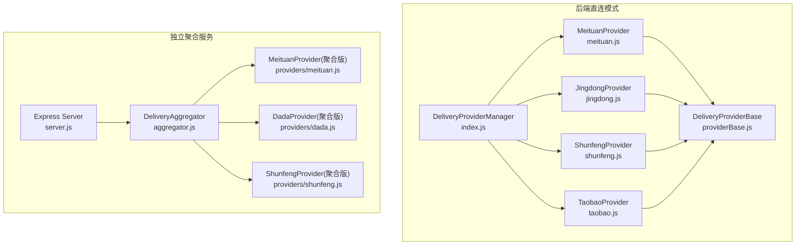
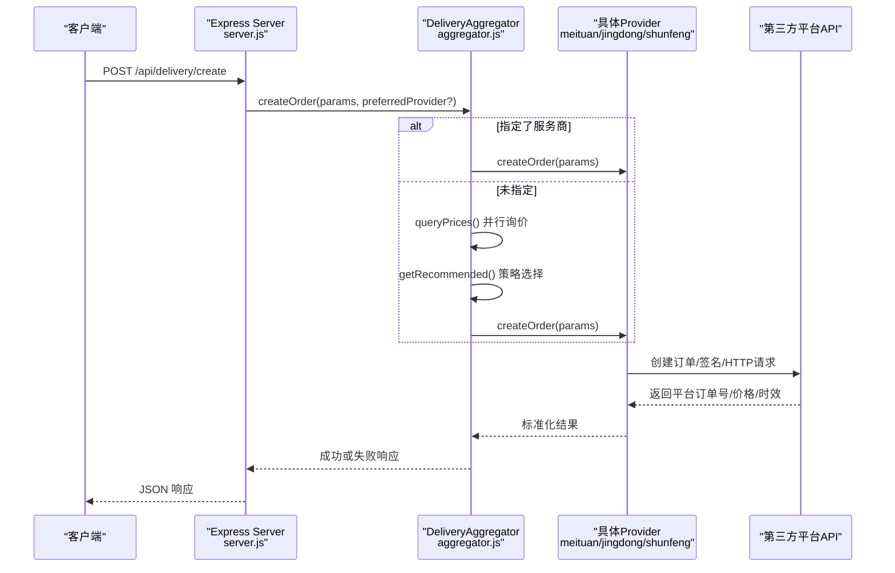
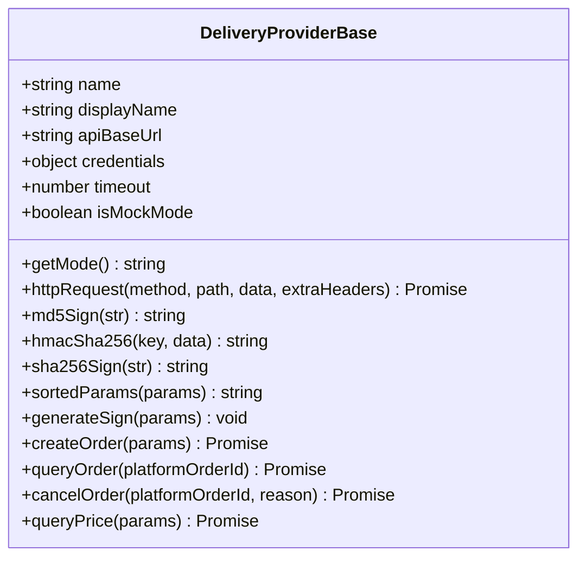
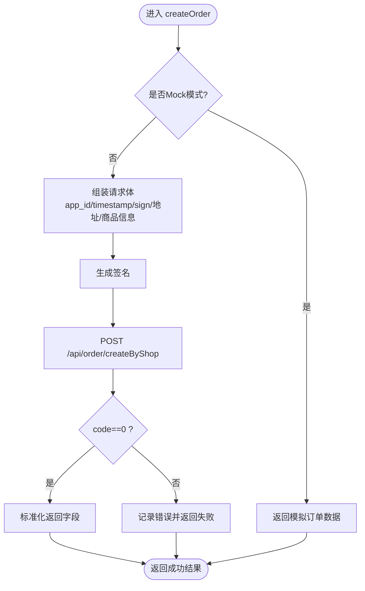
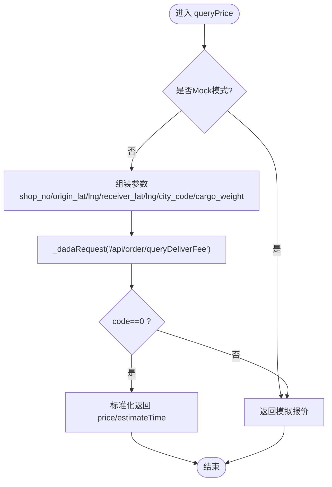
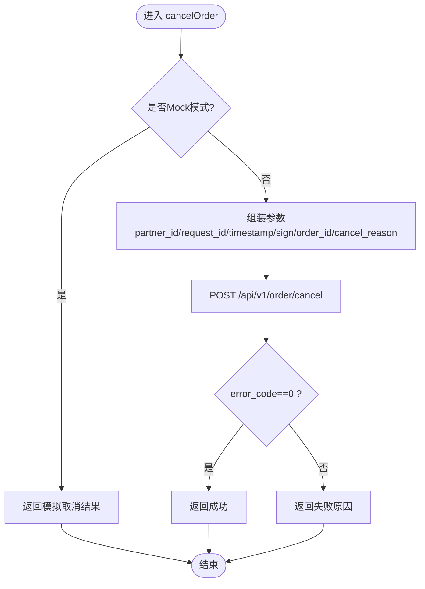
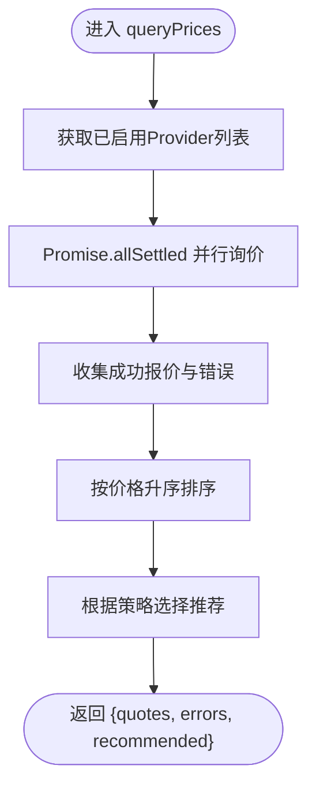
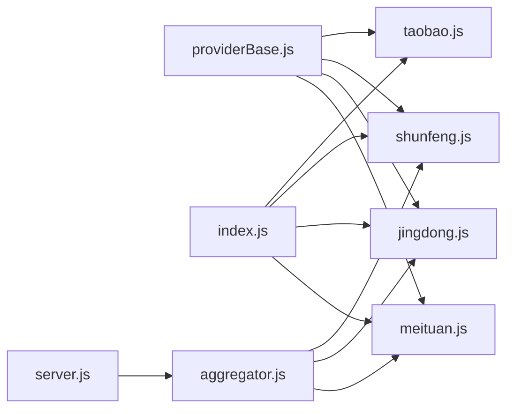

# 配送服务商集成

<cite>
**本文引用的文件列表**
- [providerBase.js](file://backend/services/deliveryProviders/providerBase.js)
- [meituan.js](file://backend/services/deliveryProviders/meituan.js)
- [jingdong.js](file://backend/services/deliveryProviders/jingdong.js)
- [shunfeng.js](file://backend/services/deliveryProviders/shunfeng.js)
- [taobao.js](file://backend/services/deliveryProviders/taobao.js)
- [index.js](file://backend/services/deliveryProviders/index.js)
- [aggregator.js](file://delivery-api/aggregator.js)
- [config.js](file://delivery-api/config.js)
- [server.js](file://delivery-api/server.js)
- [test-api.js](file://delivery-api/test-api.js)
</cite>

## 目录
1. [简介](#简介)
2. [项目结构](#项目结构)
3. [核心组件](#核心组件)
4. [架构总览](#架构总览)
5. [详细组件分析](#详细组件分析)
6. [依赖关系分析](#依赖关系分析)
7. [性能与可用性](#性能与可用性)
8. [故障排查指南](#故障排查指南)
9. [结论](#结论)
10. [附录：测试与模拟数据](#附录测试与模拟数据)

## 简介
本指南面向需要接入多家配送平台（美团跑腿、京东秒送、顺丰同城等）的开发者，提供从统一接口抽象、具体服务商实现、聚合调度到配置管理、状态同步、异常处理、监控告警与故障转移的全链路开发说明。文档基于仓库中已实现的基类、各平台 Provider 以及聚合器服务进行系统化梳理，帮助快速扩展新的配送服务商并稳定运行于生产环境。

## 项目结构
本项目包含两套与配送相关的代码：
- 后端直连模式：在 backend/services/deliveryProviders 下以 providerBase 为基类，分别实现各平台 Provider，并通过 index.js 统一管理。
- 独立聚合服务：在 delivery-api 目录下提供 Express 服务，通过 aggregator.js 聚合多家服务商，对外暴露 REST API。

图表来源
- [index.js:1-87](file://backend/services/deliveryProviders/index.js#L1-L87)
- [providerBase.js:1-124](file://backend/services/deliveryProviders/providerBase.js#L1-L124)
- [meituan.js:1-257](file://backend/services/deliveryProviders/meituan.js#L1-L257)
- [jingdong.js:1-278](file://backend/services/deliveryProviders/jingdong.js#L1-L278)
- [shunfeng.js:1-262](file://backend/services/deliveryProviders/shunfeng.js#L1-L262)
- [taobao.js:1-263](file://backend/services/deliveryProviders/taobao.js#L1-L263)
- [server.js:1-377](file://delivery-api/server.js#L1-L377)
- [aggregator.js:1-237](file://delivery-api/aggregator.js#L1-L237)

章节来源
- [index.js:1-87](file://backend/services/deliveryProviders/index.js#L1-L87)
- [server.js:1-377](file://delivery-api/server.js#L1-L377)
- [aggregator.js:1-237](file://delivery-api/aggregator.js#L1-L237)

## 核心组件
- 统一抽象层 DeliveryProviderBase：封装 HTTPS 请求、签名算法、参数排序、超时控制、Mock 模式判断等通用能力，定义 createOrder/queryOrder/cancelOrder/queryPrice 等抽象方法，要求子类必须实现。
- 各平台 Provider：继承基类，实现各自签名、下单、查询、取消、询价逻辑，并提供 Mock 实现用于无密钥时的开发与联调。
- 后端管理器 DeliveryProviderManager：集中注册与管理所有 Provider，提供按名称路由的创建、查询、取消、询价方法，同时支持获取真实可用 Provider 列表。
- 聚合器 DeliveryAggregator：对外提供统一的“询价-推荐-下单-查询-取消”流程，支持并行询价、策略推荐、指定优先服务商、错误收集与降级。
- 配置 config：集中管理多环境（测试/生产）API 地址、密钥、回调地址、默认策略、重试次数与超时等。

章节来源
- [providerBase.js:1-124](file://backend/services/deliveryProviders/providerBase.js#L1-L124)
- [index.js:1-87](file://backend/services/deliveryProviders/index.js#L1-L87)
- [aggregator.js:1-237](file://delivery-api/aggregator.js#L1-L237)
- [config.js:1-93](file://delivery-api/config.js#L1-L93)

## 架构总览
下图展示了从 HTTP 请求进入，到聚合器选择最优服务商，再到具体 Provider 调用第三方平台的完整流程。

图表来源
- [server.js:89-154](file://delivery-api/server.js#L89-L154)
- [aggregator.js:137-197](file://delivery-api/aggregator.js#L137-L197)
- [meituan.js:41-93](file://backend/services/deliveryProviders/meituan.js#L41-L93)
- [jingdong.js:50-98](file://backend/services/deliveryProviders/jingdong.js#L50-L98)
- [shunfeng.js:45-95](file://backend/services/deliveryProviders/shunfeng.js#L45-L95)

## 详细组件分析

### 统一接口抽象层：DeliveryProviderBase
- 职责
  - 提供统一的 HTTPS 请求封装，含超时、错误处理、JSON 解析容错。
  - 提供常用签名工具：MD5、HMAC-SHA256、SHA256、参数排序拼接。
  - 自动识别是否处于 Mock 模式（未配置有效凭证时）。
  - 定义抽象方法：generateSign、createOrder、queryOrder、cancelOrder、queryPrice。
- 设计要点
  - 通过构造函数注入 name、displayName、apiBaseUrl、credentials、timeout。
  - 所有 Provider 共享网络与签名能力，降低重复实现成本。
  - 对第三方返回非标准 JSON 做兜底处理，避免崩溃。

图表来源
- [providerBase.js:10-121](file://backend/services/deliveryProviders/providerBase.js#L10-L121)

章节来源
- [providerBase.js:1-124](file://backend/services/deliveryProviders/providerBase.js#L1-L124)

### 美团跑腿 Provider
- 关键特性
  - 签名：appId + timestamp + secret 的 MD5。
  - 下单：POST /api/order/createByShop，构造取件/收件信息、商品描述、重量等。
  - 状态查询：POST /api/order/status/query，内部将平台状态映射为标准状态。
  - 取消：POST /api/order/delete。
  - 询价：POST /api/order/deliveryFee。
  - Mock：当未配置 appId/appSecret 时，返回合理随机数据，便于前端联调。
- 状态映射
  - 将平台数字状态码映射为 pending/accepted/picking_up/delivering/delivered/cancelled/exception 等。

图表来源
- [meituan.js:41-93](file://backend/services/deliveryProviders/meituan.js#L41-L93)
- [meituan.js:185-209](file://backend/services/deliveryProviders/meituan.js#L185-L209)
- [meituan.js:212-253](file://backend/services/deliveryProviders/meituan.js#L212-L253)

章节来源
- [meituan.js:1-257](file://backend/services/deliveryProviders/meituan.js#L1-L257)

### 京东秒送 Provider（底层达达开放平台）
- 关键特性
  - 签名：参数按 key 排序后拼接，末尾追加 appSecret，再取 MD5 大写。
  - 下单：POST /api/order/addOrder，需 sourceId、shop_no、receiver/sender 信息、cargo_weight 等。
  - 状态查询：POST /api/order/status/query。
  - 取消：POST /api/order/formalCancel。
  - 询价：POST /api/order/queryDeliverFee。
  - 自定义 _dadaRequest：针对达达格式封装 HTTPS 请求。
  - Mock：未配置 appKey/appSecret/sourceId 时使用模拟数据。
- 状态映射
  - 将 order_status 映射为标准状态集合。

图表来源
- [jingdong.js:151-174](file://backend/services/deliveryProviders/jingdong.js#L151-L174)
- [jingdong.js:177-205](file://backend/services/deliveryProviders/jingdong.js#L177-L205)
- [jingdong.js:208-231](file://backend/services/deliveryProviders/jingdong.js#L208-L231)
- [jingdong.js:234-274](file://backend/services/deliveryProviders/jingdong.js#L234-L274)

章节来源
- [jingdong.js:1-278](file://backend/services/deliveryProviders/jingdong.js#L1-L278)

### 顺丰同城 Provider
- 关键特性
  - 签名：timestamp + checkWord 的 MD5。
  - 下单：POST /api/v1/order/create，包含 shop/user 信息、product_type/product_weight 等。
  - 状态查询：POST /api/v1/order/query。
  - 取消：POST /api/v1/order/cancel。
  - 询价：POST /api/v1/order/preCreate。
  - Mock：未配置 partnerId/checkWord 时使用模拟数据。
- 状态映射
  - 将 order_status 映射为标准状态集合。

图表来源
- [shunfeng.js:131-155](file://backend/services/deliveryProviders/shunfeng.js#L131-L155)
- [shunfeng.js:187-215](file://backend/services/deliveryProviders/shunfeng.js#L187-L215)
- [shunfeng.js:218-258](file://backend/services/deliveryProviders/shunfeng.js#L218-L258)

章节来源
- [shunfeng.js:1-262](file://backend/services/deliveryProviders/shunfeng.js#L1-L262)

### 淘宝闪送 Provider（蜂鸟即配）
- 关键特性
  - 签名：参数按 key 排序拼接后追加 secret，再取 MD5。
  - 下单：POST /anmp/api/v2/order/create，sender/receiver 信息、goods_weight（单位克）、notify_url 等。
  - 状态查询：POST /anmp/api/v2/order/query。
  - 取消：POST /anmp/api/v2/order/cancel。
  - 询价：POST /anmp/api/v2/order/queryFee。
  - Mock：未配置 appId/secret/merchantId 时使用模拟数据。
- 状态映射
  - 将 ORDER_* 字符串状态映射为标准状态集合。

章节来源
- [taobao.js:1-263](file://backend/services/deliveryProviders/taobao.js#L1-L263)

### 后端配送管理器：DeliveryProviderManager
- 职责
  - 集中注册 meituan/jingdong/taobao/shunfeng 四个 Provider。
  - 提供 get/getAll/getStatus/getRealProviders 等管理能力。
  - 提供 createOrder/queryOrder/cancelOrder/queryPrice 的统一入口。
- 使用建议
  - 在业务服务中直接引入该管理器，按 providerName 路由到对应 Provider。
  - 通过 getStatus 可快速查看哪些 Provider 处于 real 模式（已配置密钥）。

章节来源
- [index.js:1-87](file://backend/services/deliveryProviders/index.js#L1-L87)

### 聚合器：DeliveryAggregator
- 职责
  - 初始化并维护多个 Provider 实例（受 config.enabled 控制）。
  - 并行询价 queryPrices，收集成功与错误结果，并按策略推荐最佳 Provider。
  - 支持指定 preferredProvider 直接下单；否则先询价再下单。
  - 提供 queryOrder/cancelOrder 的转发能力。
- 推荐策略
  - lowest_price：最低价优先。
  - fastest：预计时效最短优先。
  - recommended：综合价格与时效加权评分。

图表来源
- [aggregator.js:54-95](file://delivery-api/aggregator.js#L54-L95)
- [aggregator.js:102-129](file://delivery-api/aggregator.js#L102-L129)

章节来源
- [aggregator.js:1-237](file://delivery-api/aggregator.js#L1-L237)

### 聚合服务 API：Express Server
- 主要接口
  - GET /api/health：健康检查，返回可用服务商列表。
  - GET /api/delivery/providers：获取可用服务商。
  - GET /api/delivery/query：询价接口，支持 pickupAddress/dropoffAddress/weight/cityName/distance。
  - POST /api/delivery/create：创建配送订单，支持可选 provider 指定。
  - GET /api/delivery/:provider/:orderId：查询订单状态。
  - POST /api/delivery/:provider/:orderId/cancel：取消订单。
- 兼容接口
  - 保留旧版 /api/deliveries 系列接口，内部委托给 aggregator。

章节来源
- [server.js:1-377](file://delivery-api/server.js#L1-L377)

## 依赖关系分析
- 模块耦合
  - Provider 均依赖 DeliveryProviderBase，形成松耦合的插件式架构。
  - aggregator 仅依赖 providers 的公开方法，屏蔽平台差异。
  - server 仅依赖 aggregator，保持对外接口稳定。
- 外部依赖
  - Node.js https/crypto 原生模块用于网络与签名。
  - Express/CORS/body-parser 用于聚合服务。
- 潜在循环依赖
  - 当前结构清晰，未见循环引用。

图表来源
- [providerBase.js:1-124](file://backend/services/deliveryProviders/providerBase.js#L1-L124)
- [index.js:1-87](file://backend/services/deliveryProviders/index.js#L1-L87)
- [aggregator.js:1-237](file://delivery-api/aggregator.js#L1-L237)
- [server.js:1-377](file://delivery-api/server.js#L1-L377)

章节来源
- [providerBase.js:1-124](file://backend/services/deliveryProviders/providerBase.js#L1-L124)
- [index.js:1-87](file://backend/services/deliveryProviders/index.js#L1-L87)
- [aggregator.js:1-237](file://delivery-api/aggregator.js#L1-L237)
- [server.js:1-377](file://delivery-api/server.js#L1-L377)

## 性能与可用性
- 并发询价
  - aggregator.queryPrices 使用 Promise.allSettled 并行调用多家 Provider，显著降低整体延迟。
- 超时与降级
  - 每个 Provider 内置 http 请求超时；当真实 API 失败时，自动回退至 Mock 模式，保证系统可用性。
- 推荐策略
  - 支持最低价格、最快时效、综合评分三种策略，可按业务需求切换。
- 可扩展性
  - 新增 Provider 仅需继承基类并实现抽象方法，无需改动上层聚合与服务端。

[本节为通用指导，不直接分析具体文件]

## 故障排查指南
- 常见问题定位
  - 无可用服务商：检查 config 中 enabled 开关与各 Provider 的密钥环境变量。
  - 询价为空：确认地址、城市、重量等参数齐全；查看错误数组中的 provider 与 error 信息。
  - 回调通知收不到：确保 CALLBACK_BASE_URL 公网可达且防火墙放行。
- 日志与诊断
  - 各 Provider 在 API 调用失败时会打印错误日志，便于定位签名、网络或平台侧问题。
- 恢复策略
  - 若某 Provider 持续失败，可在配置中临时关闭其 enabled，由聚合器自动选择其他可用 Provider。

章节来源
- [config.js:1-93](file://delivery-api/config.js#L1-L93)
- [aggregator.js:54-95](file://delivery-api/aggregator.js#L54-L95)
- [server.js:56-83](file://delivery-api/server.js#L56-L83)

## 结论
通过统一的 DeliveryProviderBase 抽象层与 Provider 插件化实现，结合聚合器的并行询价与策略推荐，系统实现了跨平台配送能力的解耦与弹性扩展。配合完善的配置管理与 Mock 模式，既满足开发联调效率，也具备生产可用性与可观测性。

[本节为总结性内容，不直接分析具体文件]

## 附录：测试与模拟数据
- 启动聚合服务
  - 参考 delivery-api/server.js 启动端口与路由。
- 运行测试脚本
  - 使用 delivery-api/test-api.js 执行健康检查、获取服务商、询价、创建订单、查询状态、取消订单等端到端用例。
- 模拟数据
  - 当未配置各 Provider 的密钥时，系统将自动进入 Mock 模式，返回合理的随机数据，可用于前端页面与自动化测试。

章节来源
- [server.js:352-377](file://delivery-api/server.js#L352-L377)
- [test-api.js:1-175](file://delivery-api/test-api.js#L1-L175)
- [meituan.js:212-253](file://backend/services/deliveryProviders/meituan.js#L212-L253)
- [jingdong.js:234-274](file://backend/services/deliveryProviders/jingdong.js#L234-L274)
- [shunfeng.js:218-258](file://backend/services/deliveryProviders/shunfeng.js#L218-L258)
- [taobao.js:219-259](file://backend/services/deliveryProviders/taobao.js#L219-L259)