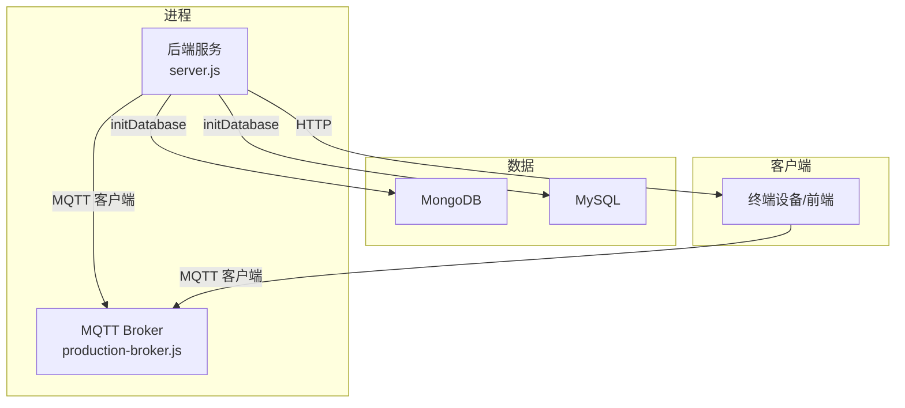
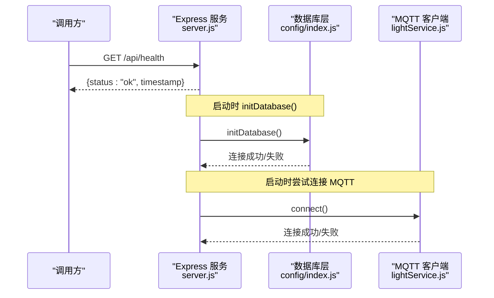
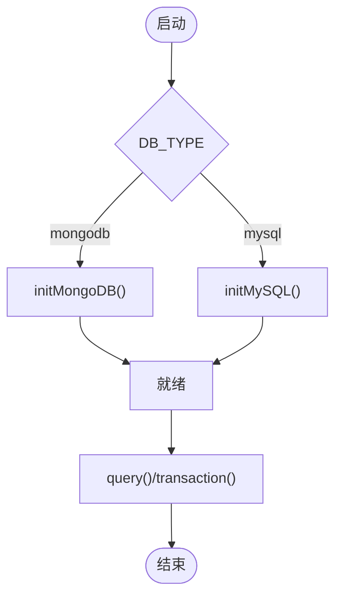
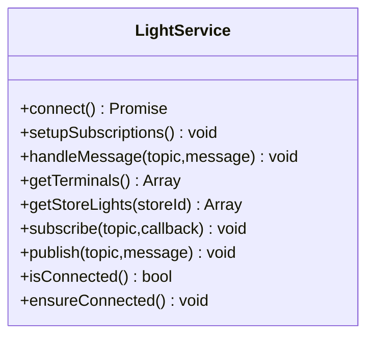
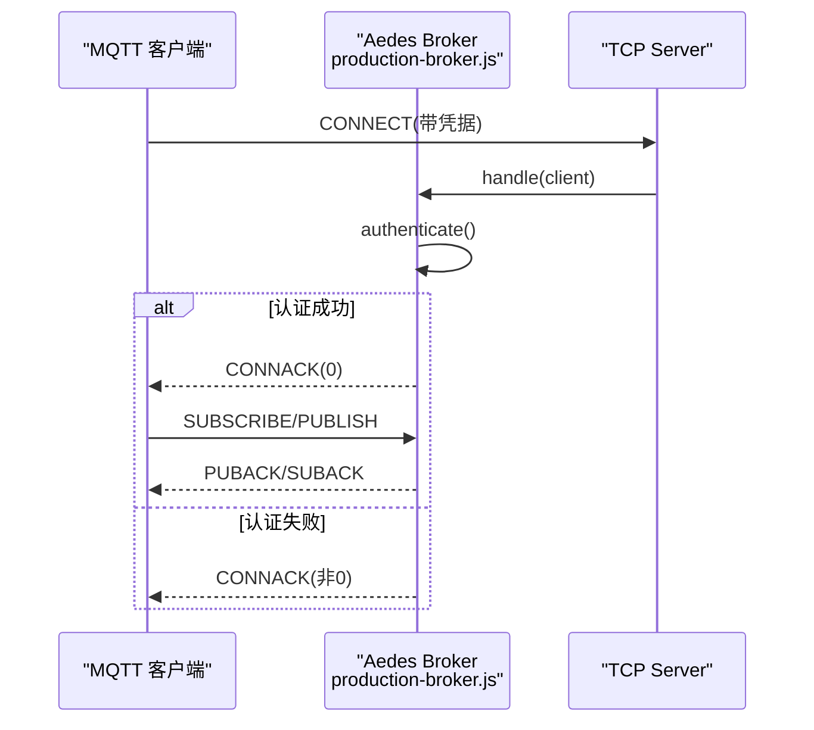
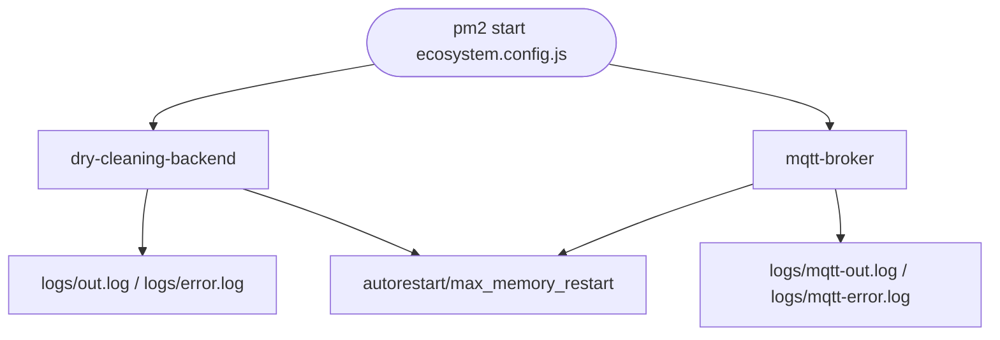
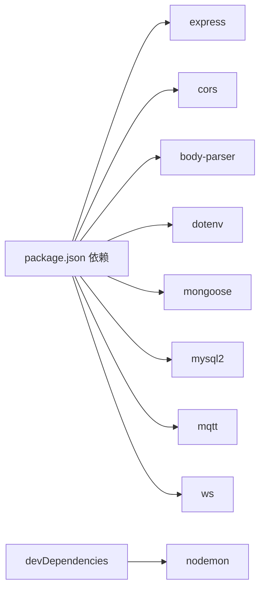

# 调试与故障排查

<cite>
**本文引用的文件**   
- [backend/server.js](file://backend/server.js)
- [backend/config/index.js](file://backend/config/index.js)
- [backend/config/database.js](file://backend/config/database.js)
- [backend/package.json](file://backend/package.json)
- [ecosystem.config.js](file://ecosystem.config.js)
- [backend/services/lightService.js](file://backend/services/lightService.js)
- [backend/production-broker.js](file://backend/production-broker.js)
- [backend/mqtt-diagnostic.js](file://backend/mqtt-diagnostic.js)
- [backend/debug-test.js](file://backend/debug-test.js)
- [backend/scripts/testConnection.js](file://backend/scripts/testConnection.js)
- [backend/quick-test.js](file://backend/quick-test.js)
- [backend/services/notificationHubService.js](file://backend/services/notificationHubService.js)
- [backend/services/messageService.js](file://backend/services/messageService.js)
</cite>

## 目录
1. [简介](#简介)
2. [项目结构](#项目结构)
3. [核心组件](#核心组件)
4. [架构总览](#架构总览)
5. [详细组件分析](#详细组件分析)
6. [依赖分析](#依赖分析)
7. [性能考虑](#性能考虑)
8. [故障排查指南](#故障排查指南)
9. [结论](#结论)
10. [附录](#附录)

## 简介
本指南面向干洗店管理系统的开发与运维人员，聚焦于：
- 开发环境调试配置（IDE、断点、日志）
- 生产环境问题诊断（性能、内存泄漏、错误追踪）
- 常见问题排查流程（数据库连接、MQTT通信、API调用失败）
- 调试工具使用（内置诊断脚本与外部工具）
- 日志分析与监控告警配置
- 系统健康检查与自动恢复机制
- 故障应急响应与回滚策略

## 项目结构
后端采用模块化 Express 应用，统一入口为 server.js；数据库抽象在 config/index.js；MQTT 客户端与服务分别在 services/lightService.js 与 production-broker.js；PM2 部署与进程管理通过 ecosystem.config.js 管理。

```mermaid
graph TB
A["Express 主服务<br/>backend/server.js"] --> B["数据库初始化<br/>backend/config/index.js"]
A --> C["模块路由注册<br/>backend/server.js"]
A --> D["通知中心 API<br/>backend/server.js"]
A --> E["消息中心 API<br/>backend/server.js"]
B --> F["MySQL/MongoDB 配置<br/>backend/config/database.js"]
A --> G["MQTT 客户端(灯条)<br/>backend/services/lightService.js"]
H["MQTT Broker(生产级)<br/>backend/production-broker.js"] < --> G
I["PM2 配置<br/>ecosystem.config.js"] --> A
I --> H
```

图表来源
- [backend/server.js:1-120](file://backend/server.js#L1-L120)
- [backend/config/index.js:1-120](file://backend/config/index.js#L1-L120)
- [backend/config/database.js:1-65](file://backend/config/database.js#L1-L65)
- [backend/services/lightService.js:1-120](file://backend/services/lightService.js#L1-L120)
- [backend/production-broker.js:1-120](file://backend/production-broker.js#L1-L120)
- [ecosystem.config.js:1-100](file://ecosystem.config.js#L1-L100)

章节来源
- [backend/server.js:1-120](file://backend/server.js#L1-L120)
- [backend/config/index.js:1-120](file://backend/config/index.js#L1-L120)
- [backend/config/database.js:1-65](file://backend/config/database.js#L1-L65)
- [ecosystem.config.js:1-100](file://ecosystem.config.js#L1-L100)

## 核心组件
- 后端主服务：加载环境变量、注册中间件与路由、暴露健康检查接口、全局错误处理、优雅关闭与未捕获异常处理。
- 数据库层：支持 MySQL 与 MongoDB，提供连接池/连接管理、事务封装、便捷查询方法。
- MQTT 客户端：智能灯条状态订阅与心跳维护，具备重连与健康检查。
- MQTT Broker：生产级实现，支持认证、发布/订阅授权、WebSocket 可选。
- PM2 进程管理：双应用（后端与 Broker）的启动、日志、重启与内存保护。
- 诊断脚本：MQTT 连通性测试、数据库连通性测试、快速连接验证等。

章节来源
- [backend/server.js:1-120](file://backend/server.js#L1-L120)
- [backend/config/index.js:1-120](file://backend/config/index.js#L1-L120)
- [backend/services/lightService.js:1-120](file://backend/services/lightService.js#L1-L120)
- [backend/production-broker.js:1-120](file://backend/production-broker.js#L1-L120)
- [ecosystem.config.js:1-100](file://ecosystem.config.js#L1-L100)

## 架构总览
下图展示后端服务、数据库、MQTT 客户端/Broker 以及 PM2 的关系。



图表来源
- [backend/server.js:615-702](file://backend/server.js#L615-L702)
- [backend/config/index.js:19-88](file://backend/config/index.js#L19-L88)
- [backend/services/lightService.js:29-76](file://backend/services/lightService.js#L29-L76)
- [backend/production-broker.js:147-193](file://backend/production-broker.js#L147-L193)

## 详细组件分析

### 后端服务与健康检查
- 健康检查接口：GET /api/health，返回服务状态与时间戳，便于负载均衡探针与监控系统探测。
- 全局错误处理：捕获未处理的异常并返回标准错误响应。
- 优雅关闭：监听 SIGTERM/SIGINT，关闭 HTTP 服务后关闭数据库连接。
- 未捕获异常与 Promise 拒绝：记录堆栈或原因，避免进程崩溃。



图表来源
- [backend/server.js:86-90](file://backend/server.js#L86-L90)
- [backend/server.js:602-609](file://backend/server.js#L602-L609)
- [backend/server.js:666-696](file://backend/server.js#L666-L696)
- [backend/config/index.js:19-53](file://backend/config/index.js#L19-L53)
- [backend/services/lightService.js:29-76](file://backend/services/lightService.js#L29-L76)

章节来源
- [backend/server.js:86-90](file://backend/server.js#L86-L90)
- [backend/server.js:602-609](file://backend/server.js#L602-L609)
- [backend/server.js:666-696](file://backend/server.js#L666-L696)

### 数据库连接与事务
- 连接初始化：根据环境变量选择 MongoDB 或 MySQL，分别建立连接/连接池。
- 连接池参数：可配置最大连接数、超时、时区、SSL 等。
- 事务封装：提供 transaction 回调式事务，自动提交/回滚与资源释放。
- 便捷查询：query(sql, params) 简化常用 SQL 执行。



图表来源
- [backend/config/index.js:19-88](file://backend/config/index.js#L19-L88)
- [backend/config/database.js:6-48](file://backend/config/database.js#L6-L48)
- [backend/config/index.js:131-155](file://backend/config/index.js#L131-L155)

章节来源
- [backend/config/index.js:19-88](file://backend/config/index.js#L19-L88)
- [backend/config/database.js:6-48](file://backend/config/database.js#L6-L48)
- [backend/config/index.js:131-155](file://backend/config/index.js#L131-L155)

### MQTT 客户端（智能灯条）
- 连接与订阅：动态读取配置，连接 Broker，订阅终端状态与心跳主题。
- 心跳与在线检测：维护门店与灯条的心跳时间，定期清理离线节点。
- 自动重连：定时任务检测连接状态，断开则尝试重建连接。



图表来源
- [backend/services/lightService.js:24-108](file://backend/services/lightService.js#L24-L108)
- [backend/services/lightService.js:142-205](file://backend/services/lightService.js#L142-L205)
- [backend/services/lightService.js:211-231](file://backend/services/lightService.js#L211-L231)

章节来源
- [backend/services/lightService.js:24-108](file://backend/services/lightService.js#L24-L108)
- [backend/services/lightService.js:142-205](file://backend/services/lightService.js#L142-L205)
- [backend/services/lightService.js:211-231](file://backend/services/lightService.js#L211-L231)

### MQTT Broker（生产级）
- 认证与授权：支持用户名/密码认证，可扩展发布/订阅权限控制。
- 事件日志：连接、断开、订阅、发布、错误等关键事件输出。
- WebSocket 支持：可选启用 WS 端口，供浏览器端直连。



图表来源
- [backend/production-broker.js:53-111](file://backend/production-broker.js#L53-L111)
- [backend/production-broker.js:147-193](file://backend/production-broker.js#L147-L193)

章节来源
- [backend/production-broker.js:53-111](file://backend/production-broker.js#L53-L111)
- [backend/production-broker.js:147-193](file://backend/production-broker.js#L147-L193)

### PM2 进程管理与日志
- 应用定义：后端服务与 MQTT Broker 两个应用，独立实例、内存限制、自动重启。
- 日志输出：合并日志、标准输出与错误日志分离，时间格式统一。
- 故障恢复：最小运行时间、最大重启次数、指数退避延迟。



图表来源
- [ecosystem.config.js:17-56](file://ecosystem.config.js#L17-L56)
- [ecosystem.config.js:57-97](file://ecosystem.config.js#L57-L97)

章节来源
- [ecosystem.config.js:17-56](file://ecosystem.config.js#L17-L56)
- [ecosystem.config.js:57-97](file://ecosystem.config.js#L57-L97)

### 通知与消息中心（辅助诊断）
- 通知中心：聚合订单与灯条事件，提供轮询接口，便于 Admin 端查看实时状态。
- 消息中心：客户消息与账户通讯，按线程聚合，支持已读标记与过期清理。

章节来源
- [backend/services/notificationHubService.js:17-82](file://backend/services/notificationHubService.js#L17-L82)
- [backend/services/messageService.js:15-55](file://backend/services/messageService.js#L15-55)

## 依赖分析
- 运行时依赖：Express、CORS、Body Parser、dotenv、mongoose、mysql2、mqtt、ws 等。
- 开发依赖：nodemon 用于热重载。
- 脚本命令：start、dev、db:init、db:seed、migrate:mysql、mqtt:setup 等。



图表来源
- [backend/package.json:25-41](file://backend/package.json#L25-L41)

章节来源
- [backend/package.json:1-43](file://backend/package.json#L1-L43)

## 性能考虑
- 数据库连接池：合理设置 max/min、超时与空闲回收，避免连接耗尽。
- MQTT 心跳与重连：保持 keepalive 与重连周期，降低频繁重连风暴。
- PM2 内存保护：max_memory_restart 防止内存泄漏导致进程无限增长。
- 日志级别：生产环境建议减少冗余日志，仅保留必要信息。

[本节为通用指导，不直接分析具体文件]

## 故障排查指南

### 开发环境调试配置
- IDE 设置
  - Node.js 调试器：将工作目录指向 backend，启动脚本为 server.js，环境变量从 .env 加载。
  - 断点位置建议：
    - 路由入口：各模块路由注册处
    - 业务逻辑：services 层关键函数
    - 数据库访问：config/index.js 的连接与事务
    - MQTT 事件：lightService.js 的消息处理
- 日志输出
  - 控制台日志：服务启动、连接状态、错误堆栈均输出到控制台。
  - PM2 日志：生产环境使用 out.log 与 error.log 分离，便于检索。
- 热重载
  - 使用 npm run dev 启动 nodemon，修改代码自动重启。

章节来源
- [backend/server.js:1-40](file://backend/server.js#L1-L40)
- [backend/package.json:6-14](file://backend/package.json#L6-L14)
- [ecosystem.config.js:38-43](file://ecosystem.config.js#L38-L43)

### 生产环境问题诊断
- 性能分析
  - 使用 Node.js 内置 Profiler 或外部工具（如 Clinic.js）采集 CPU/内存快照。
  - 关注数据库慢查询与 MQTT 高吞吐场景。
- 内存泄漏检测
  - 观察 PM2 的 max_memory_restart 触发频率与日志。
  - 定位长时间持有引用对象（Map/Set）是否及时清理。
- 错误追踪
  - 全局错误处理器与未捕获异常日志是首要线索。
  - 结合 PM2 日志与外部日志平台进行关联分析。

[本节为通用指导，不直接分析具体文件]

### 常见问题排查流程

#### 数据库连接问题
- 现象：服务启动时报连接失败或查询超时。
- 步骤：
  1. 确认 DB_TYPE 与对应连接参数（host/port/user/password/uri）。
  2. 运行数据库连接测试脚本，验证连通性与读写能力。
  3. 检查防火墙与网络可达性（本地或远程）。
  4. 查看数据库服务端日志与连接数限制。

章节来源
- [backend/config/database.js:6-48](file://backend/config/database.js#L6-L48)
- [backend/scripts/testConnection.js:1-88](file://backend/scripts/testConnection.js#L1-L88)

#### MQTT 通信异常
- 现象：终端无法上线、灯条无响应、订阅失败。
- 步骤：
  1. 确认 Broker 已启动且端口可用（默认 TCP 1884，WS 8084）。
  2. 使用 mqtt-diagnostic.js 或 quick-test.js 进行连通性测试。
  3. 检查认证配置（用户名/密码）与主题权限。
  4. 查看 Broker 日志中的连接、订阅与错误事件。
  5. 若后端先启动，确保 lightService.ensureConnected 能自动重连。

章节来源
- [backend/mqtt-diagnostic.js:1-104](file://backend/mqtt-diagnostic.js#L1-L104)
- [backend/quick-test.js:1-30](file://backend/quick-test.js#L1-L30)
- [backend/production-broker.js:147-193](file://backend/production-broker.js#L147-L193)
- [backend/services/lightService.js:211-231](file://backend/services/lightService.js#L211-L231)

#### API 调用失败
- 现象：请求返回 500 或业务错误。
- 步骤：
  1. 检查 /api/health 是否返回 ok。
  2. 查看全局错误处理日志与堆栈。
  3. 核对请求参数与路由路径。
  4. 检查模块守卫是否启用目标模块。

章节来源
- [backend/server.js:86-90](file://backend/server.js#L86-L90)
- [backend/server.js:602-609](file://backend/server.js#L602-L609)
- [backend/modules/common/middlewares/moduleGuard.js:1-55](file://backend/modules/common/middlewares/moduleGuard.js#L1-L55)

### 调试工具使用指南
- 内置诊断脚本
  - MQTT 诊断：mqtt-diagnostic.js（连接、订阅、发布全流程）
  - 快速连接：quick-test.js（快速验证 Broker 可用性）
  - 数据库测试：scripts/testConnection.js（MongoDB/MySQL 连通与读写）
  - 基础调试：debug-test.js（简单连接示例）
- 外部工具
  - MQTT：MQTT Explorer、Mosquitto clients、Postman（REST）
  - 数据库：MongoDB Compass、MySQL Workbench
  - 进程与日志：PM2 CLI（list/logs/restart）、系统日志查看器

章节来源
- [backend/mqtt-diagnostic.js:1-104](file://backend/mqtt-diagnostic.js#L1-L104)
- [backend/quick-test.js:1-30](file://backend/quick-test.js#L1-L30)
- [backend/scripts/testConnection.js:1-88](file://backend/scripts/testConnection.js#L1-L88)
- [backend/debug-test.js:1-37](file://backend/debug-test.js#L1-L37)

### 日志分析与监控告警配置
- 日志分类
  - 后端：combined.log、out.log、error.log
  - MQTT：mqtt-combined.log、mqtt-out.log、mqtt-error.log
- 关键字检索
  - 错误：ERROR、Exception、Failed、Timeout
  - 连接：CONNECT、CONNACK、SUBSCRIBE、PUBLISH
  - 数据库：DB、Connecting、connected、connection failed
- 监控告警
  - 健康检查：对 /api/health 进行周期性探测，失败即告警。
  - 进程存活：PM2 列表与重启次数阈值告警。
  - 数据库与 MQTT：连接失败与重连风暴告警。

章节来源
- [ecosystem.config.js:38-43](file://ecosystem.config.js#L38-L43)
- [ecosystem.config.js:79-84](file://ecosystem.config.js#L79-L84)
- [backend/server.js:86-90](file://backend/server.js#L86-L90)

### 系统健康检查与自动恢复机制
- 健康检查接口：/api/health 返回服务状态。
- 自动恢复
  - PM2 autorestart 与 max_memory_restart
  - MQTT 客户端 ensureConnected 定时重连
  - 全局未捕获异常与 Promise 拒绝处理，避免进程崩溃

章节来源
- [backend/server.js:86-90](file://backend/server.js#L86-L90)
- [backend/server.js:680-691](file://backend/server.js#L680-L691)
- [ecosystem.config.js:26-28](file://ecosystem.config.js#L26-L28)
- [backend/services/lightService.js:211-231](file://backend/services/lightService.js#L211-L231)

### 故障应急响应流程与回滚策略
- 应急响应
  1. 确认影响范围（单门店/全链路）
  2. 快速止血：重启受影响服务或降级功能（如禁用某模块）
  3. 收集证据：PM2 日志、错误堆栈、数据库与 MQTT 日志
  4. 根因定位：变更引入、配置错误、资源不足
  5. 修复与验证：小步快跑，灰度验证
- 回滚策略
  - 版本回滚：优先回滚至上一稳定版本
  - 配置回滚：恢复 .env 与 PM2 配置
  - 数据回滚：谨慎操作，必要时从备份恢复

[本节为通用指导，不直接分析具体文件]

## 结论
通过统一的入口服务、健壮的数据库抽象、可靠的 MQTT 客户端与生产级 Broker，配合 PM2 进程管理与完善的诊断脚本，系统具备良好的可观测性与可恢复性。遵循本指南的调试与排查流程，可快速定位并解决常见问题，保障系统稳定运行。

## 附录
- 常用命令
  - 启动后端：npm start 或 pm2 start ecosystem.config.js
  - 开发模式：npm run dev
  - 数据库初始化：npm run db:init
  - 数据库种子：npm run db:seed
  - 迁移脚本：npm run migrate:mysql
- 关键端口
  - HTTP：3000（可通过环境变量 PORT 覆盖）
  - MQTT：1884（TCP），8084（WebSocket，可选）

章节来源
- [backend/package.json:6-14](file://backend/package.json#L6-L14)
- [ecosystem.config.js:29-37](file://ecosystem.config.js#L29-L37)
- [backend/production-broker.js:23-31](file://backend/production-broker.js#L23-L31)