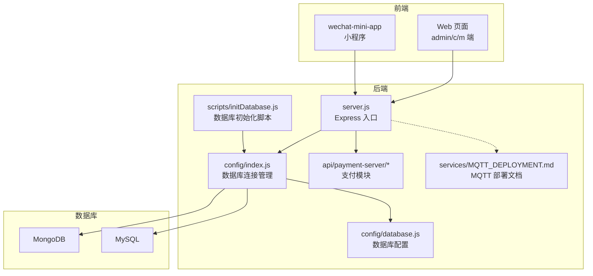
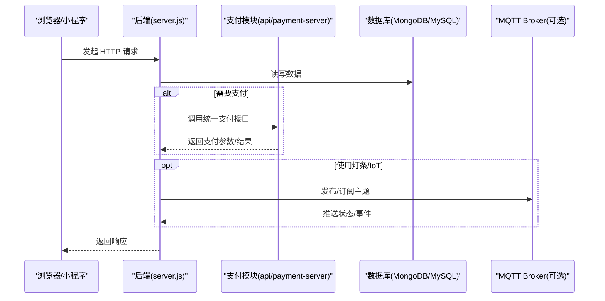
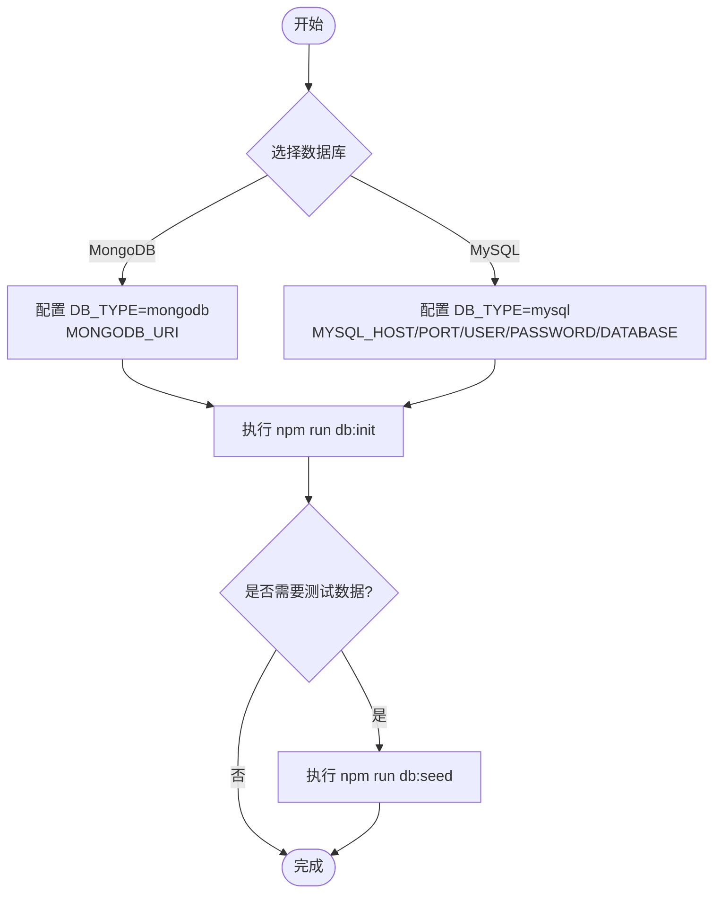
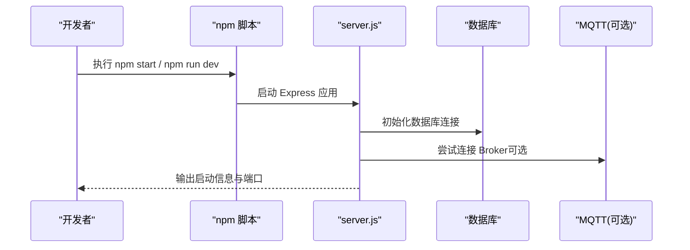
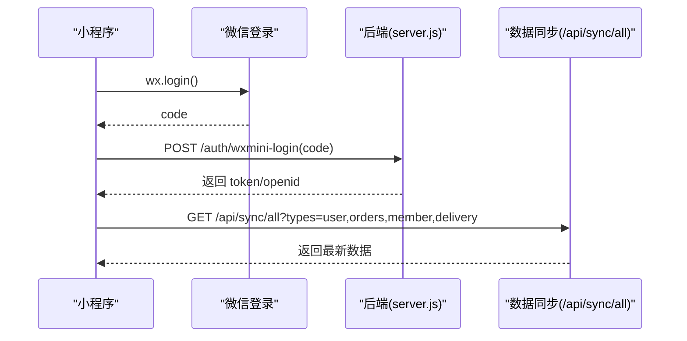
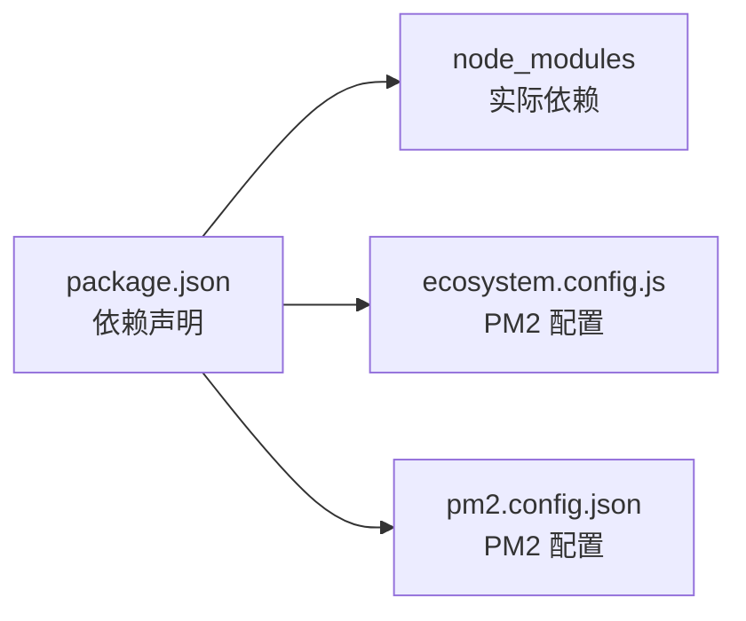

# 快速开始

<cite>
**本文引用的文件**   
- [backend/package.json](file://backend/package.json)
- [backend/QUICKSTART.md](file://backend/QUICKSTART.md)
- [backend/config/index.js](file://backend/config/index.js)
- [backend/config/database.js](file://backend/config/database.js)
- [backend/server.js](file://backend/server.js)
- [backend/scripts/initDatabase.js](file://backend/scripts/initDatabase.js)
- [backend/docker-compose.yml](file://backend/docker-compose.yml)
- [backend/services/MQTT_DEPLOYMENT.md](file://backend/services/MQTT_DEPLOYMENT.md)
- [api/payment-server/config.js](file://api/payment-server/config.js)
- [wechat-mini-app/app.js](file://wechat-mini-app/app.js)
- [wechat-mini-app/project.config.json](file://wechat-mini-app/project.config.json)
- [ecosystem.config.js](file://ecosystem.config.js)
- [pm2.config.json](file://pm2.config.json)
- [一键启动.bat](file://一键启动.bat)
- [QUICK-TEST-GUIDE.md](file://QUICK-TEST-GUIDE.md)
</cite>

## 目录
1. [简介](#简介)
2. [项目结构](#项目结构)
3. [核心组件](#核心组件)
4. [架构总览](#架构总览)
5. [详细组件分析](#详细组件分析)
6. [依赖分析](#依赖分析)
7. [性能考虑](#性能考虑)
8. [故障排查指南](#故障排查指南)
9. [结论](#结论)
10. [附录](#附录)

## 简介
本指南面向首次接触干洗店管理系统的开发者与运维人员，提供从零到一的环境搭建、配置、启动与验证流程。系统后端基于 Node.js + Express，支持 MongoDB 或 MySQL 两种数据库方案；内置统一支付接口（微信/支付宝/银联/余额），可选 MQTT 消息队列用于灯条等 IoT 设备通信；配套微信小程序端与多端 Web 前端。通过本指南，你将完成：
- 环境准备（Node.js、npm）
- 依赖安装与数据库初始化（MongoDB 或 MySQL）
- 环境变量配置（数据库、第三方服务 API 密钥等）
- 启动后端服务与可选的 MQTT Broker
- 配置并运行小程序开发环境
- 创建第一个订单并完成端到端验证
- 常见问题定位与排障

## 项目结构
本项目采用模块化后端 + 多端前端的组合：
- 后端：Express 应用，模块化路由与服务，统一入口 server.js
- 数据库：MongoDB 或 MySQL（二选一）
- 支付：统一支付接口，内部集成微信/支付宝/银联/余额
- 消息：MQTT（可选，用于灯条/IoT）
- 小程序：微信小程序工程
- 脚本与部署：一键启动、PM2 配置、Docker Compose

图表来源
- [backend/server.js:1-702](file://backend/server.js#L1-L702)
- [backend/config/index.js:1-167](file://backend/config/index.js#L1-L167)
- [backend/config/database.js:1-65](file://backend/config/database.js#L1-L65)
- [backend/scripts/initDatabase.js:1-148](file://backend/scripts/initDatabase.js#L1-L148)
- [api/payment-server/config.js:1-80](file://api/payment-server/config.js#L1-L80)
- [backend/services/MQTT_DEPLOYMENT.md:1-410](file://backend/services/MQTT_DEPLOYMENT.md#L1-L410)

章节来源
- [backend/package.json:1-43](file://backend/package.json#L1-L43)
- [backend/QUICKSTART.md:1-161](file://backend/QUICKSTART.md#L1-L161)

## 核心组件
- 后端入口与路由挂载：Express 应用加载各业务模块路由，暴露健康检查与系统信息接口，集成支付、同步、消息中心等功能。
- 数据库连接管理：单例模式统一管理 MongoDB 与 MySQL 连接池，提供查询与事务便捷方法。
- 数据库初始化脚本：根据 DB_TYPE 自动选择 MongoDB 或 MySQL 初始化逻辑。
- 支付系统：统一支付接口聚合多种支付方式，支持模拟支付降级。
- MQTT 部署文档：提供 EMQX 本地与生产部署指南及测试方法。
- 小程序端：登录、数据同步、配送服务商查询、Mock 降级等能力。

章节来源
- [backend/server.js:1-702](file://backend/server.js#L1-L702)
- [backend/config/index.js:1-167](file://backend/config/index.js#L1-L167)
- [backend/config/database.js:1-65](file://backend/config/database.js#L1-L65)
- [backend/scripts/initDatabase.js:1-148](file://backend/scripts/initDatabase.js#L1-L148)
- [api/payment-server/config.js:1-80](file://api/payment-server/config.js#L1-L80)
- [backend/services/MQTT_DEPLOYMENT.md:1-410](file://backend/services/MQTT_DEPLOYMENT.md#L1-L410)
- [wechat-mini-app/app.js:1-800](file://wechat-mini-app/app.js#L1-L800)

## 架构总览
下图展示从客户端到后端、数据库与可选 MQTT 的整体交互关系。

图表来源
- [backend/server.js:1-702](file://backend/server.js#L1-L702)
- [api/payment-server/config.js:1-80](file://api/payment-server/config.js#L1-L80)
- [backend/services/MQTT_DEPLOYMENT.md:1-410](file://backend/services/MQTT_DEPLOYMENT.md#L1-L410)

## 详细组件分析

### 环境与依赖准备
- Node.js 版本要求：>= 16.x；npm >= 8.x
- 安装后端依赖：进入 backend 目录执行 npm install
- 可选：安装 PM2 进行进程守护（见附录）

章节来源
- [backend/QUICKSTART.md:1-161](file://backend/QUICKSTART.md#L1-L161)
- [backend/package.json:1-43](file://backend/package.json#L1-L43)

### 数据库配置（MongoDB 或 MySQL）
- 在 backend/.env 中设置数据库类型与连接信息
  - MongoDB 方案：设置 DB_TYPE=mongodb 与 MONGODB_URI
  - MySQL 方案：设置 DB_TYPE=mysql 与 MYSQL_* 相关变量
- 数据库初始化：
  - 执行 npm run db:init 创建集合/表与索引
  - 可选：npm run db:seed 生成测试数据
- Docker Compose 一键拉起数据库（可选）

图表来源
- [backend/config/database.js:1-65](file://backend/config/database.js#L1-L65)
- [backend/scripts/initDatabase.js:1-148](file://backend/scripts/initDatabase.js#L1-L148)
- [backend/docker-compose.yml:1-34](file://backend/docker-compose.yml#L1-L34)

章节来源
- [backend/QUICKSTART.md:1-161](file://backend/QUICKSTART.md#L1-L161)
- [backend/config/database.js:1-65](file://backend/config/database.js#L1-L65)
- [backend/scripts/initDatabase.js:1-148](file://backend/scripts/initDatabase.js#L1-L148)
- [backend/docker-compose.yml:1-34](file://backend/docker-compose.yml#L1-L34)

### 环境变量配置清单
- 通用
  - PORT：后端端口（默认 3000）
  - NODE_ENV：运行环境（development/production）
- 数据库
  - DB_TYPE：mongodb 或 mysql
  - MongoDB：MONGODB_URI
  - MySQL：MYSQL_HOST、MYSQL_PORT、MYSQL_USER、MYSQL_PASSWORD、MYSQL_DATABASE
- 支付（可选）
  - 微信支付：WECHAT_MINIAPP_APPID、WECHAT_MINIAPP_SECRET、WECHAT_MCH_ID、WECHAT_API_KEY、WECHAT_NOTIFY_URL、WECHAT_H5_*、WECHAT_API_URL
  - 支付宝：ALIPAY_APP_ID、ALIPAY_PRIVATE_KEY、ALIPAY_PUBLIC_KEY、ALIPAY_GATEWAY、ALIPAY_NOTIFY_URL
  - 银联：UNIONPAY_MERCHANT_ID、UNIONPAY_SIGN_CERT_PATH、UNIONPAY_SIGN_CERT_PWD、UNIONPAY_NOTIFY_URL、UNIONPAY_API_URL
- MQTT（可选）
  - MQTT_BROKER、MQTT_USERNAME、MQTT_PASSWORD、MQTT_WS_PORT

章节来源
- [backend/config/database.js:1-65](file://backend/config/database.js#L1-L65)
- [api/payment-server/config.js:1-80](file://api/payment-server/config.js#L1-L80)
- [backend/services/MQTT_DEPLOYMENT.md:1-410](file://backend/services/MQTT_DEPLOYMENT.md#L1-L410)

### 启动后端服务
- 开发模式：npm run dev（自动重启）
- 生产模式：npm start
- 健康检查：访问 /api/health
- 模块状态：访问 /api/system/modules
- 一键启动：双击根目录“一键启动.bat”

图表来源
- [backend/server.js:1-702](file://backend/server.js#L1-L702)
- [backend/package.json:1-43](file://backend/package.json#L1-L43)
- [一键启动.bat:1-59](file://一键启动.bat#L1-L59)

章节来源
- [backend/QUICKSTART.md:1-161](file://backend/QUICKSTART.md#L1-L161)
- [backend/server.js:1-702](file://backend/server.js#L1-L702)
- [backend/package.json:1-43](file://backend/package.json#L1-L43)
- [一键启动.bat:1-59](file://一键启动.bat#L1-L59)

### MQTT 消息队列配置（可选）
- 本地部署 EMQX（推荐 Docker）
- 配置 .env 中的 MQTT_BROKER、用户名密码等
- 启动后端后观察日志是否成功连接
- 可使用 MQTTX 或示例脚本进行连通性测试

章节来源
- [backend/services/MQTT_DEPLOYMENT.md:1-410](file://backend/services/MQTT_DEPLOYMENT.md#L1-L410)

### 小程序开发环境设置
- 使用微信开发者工具打开 wechat-mini-app 目录
- project.config.json 已包含基础配置与调试场景
- 小程序默认 API 基地址指向 http://localhost:3000/api
- 登录流程：wx.login -> 后端认证 -> 缓存 token
- 数据同步：onShow 触发全量同步（用户、会员、订单、配送信息）

图表来源
- [wechat-mini-app/app.js:1-800](file://wechat-mini-app/app.js#L1-L800)
- [wechat-mini-app/project.config.json:1-98](file://wechat-mini-app/project.config.json#L1-L98)
- [backend/server.js:1-702](file://backend/server.js#L1-L702)

章节来源
- [wechat-mini-app/app.js:1-800](file://wechat-mini-app/app.js#L1-L800)
- [wechat-mini-app/project.config.json:1-98](file://wechat-mini-app/project.config.json#L1-L98)

### 支付系统配置（可选）
- 统一支付接口：POST /api/payment/create
- 支持的支付方式：微信、支付宝、银联、余额
- 未配置真实密钥时，后端会走模拟支付路径（开发环境友好）
- 回调接口：/api/payment/callback（需按平台要求配置公网可达地址）

章节来源
- [api/payment-server/config.js:1-80](file://api/payment-server/config.js#L1-L80)
- [backend/server.js:1-702](file://backend/server.js#L1-L702)

## 依赖分析
- 运行时依赖：express、cors、body-parser、dotenv、mongoose、mysql2、mqtt、ws 等
- 开发依赖：nodemon（热重载）
- 进程守护：PM2（ecosystem.config.js 与 pm2.config.json）

图表来源
- [backend/package.json:1-43](file://backend/package.json#L1-L43)
- [ecosystem.config.js:1-61](file://ecosystem.config.js#L1-L61)
- [pm2.config.json:1-20](file://pm2.config.json#L1-L20)

章节来源
- [backend/package.json:1-43](file://backend/package.json#L1-L43)
- [ecosystem.config.js:1-61](file://ecosystem.config.js#L1-L61)
- [pm2.config.json:1-20](file://pm2.config.json#L1-L20)

## 性能考虑
- 数据库连接池：MySQL 使用连接池，合理设置 max/min 与超时
- 错误处理：全局异常捕获与优雅关闭，避免端口冲突导致崩溃
- 进程守护：PM2 自动重启与内存上限保护
- 静态资源：Express 直接托管静态文件，便于本地调试

[本节为通用建议，不直接分析具体文件]

## 故障排查指南
- 端口被占用
  - 现象：启动时报 EADDRINUSE
  - 解决：修改 .env 中的 PORT 或释放占用端口
- 数据库连接失败
  - MongoDB：确认服务已启动、URI 正确、Atlas IP 白名单
  - MySQL：确认服务已启动、账号密码正确、数据库存在
- 支付回调不可达
  - 确保回调 URL 可公网访问，或使用内网穿透工具
- 小程序无法连接后端
  - 检查 apiBaseUrl 是否为 http://localhost:3000/api
  - 确认后端已启动且 CORS 允许
- 查看日志
  - 后端控制台输出
  - PM2 日志：pm2 logs
  - 浏览器开发者工具 Network/Console

章节来源
- [backend/QUICKSTART.md:1-161](file://backend/QUICKSTART.md#L1-L161)
- [backend/server.js:1-702](file://backend/server.js#L1-L702)

## 结论
通过以上步骤，你已完成环境准备、数据库初始化、后端与小程序启动，并具备创建订单与体验基本功能的能力。后续可按需接入真实支付与 MQTT 设备，逐步完善系统能力。

[本节为总结，不直接分析具体文件]

## 附录

### 常用命令速查
- 安装依赖：cd backend && npm install
- 初始化数据库：npm run db:init
- 填充测试数据：npm run db:seed
- 启动后端：npm start / npm run dev
- 一键启动：双击“一键启动.bat”
- PM2 启动：pm2 start ecosystem.config.js

章节来源
- [backend/package.json:1-43](file://backend/package.json#L1-L43)
- [backend/QUICKSTART.md:1-161](file://backend/QUICKSTART.md#L1-L161)
- [一键启动.bat:1-59](file://一键启动.bat#L1-L59)
- [ecosystem.config.js:1-61](file://ecosystem.config.js#L1-L61)

### 端到端验证：创建第一个订单
- 使用测试工具创建订单：参考 QUICK-TEST-GUIDE.md
- 在 m-index.html 或小程序中查看订单列表与详情
- 若启用支付，可在未配置真实密钥时使用模拟支付路径完成下单

章节来源
- [QUICK-TEST-GUIDE.md:1-242](file://QUICK-TEST-GUIDE.md#L1-L242)
- [backend/server.js:1-702](file://backend/server.js#L1-L702)