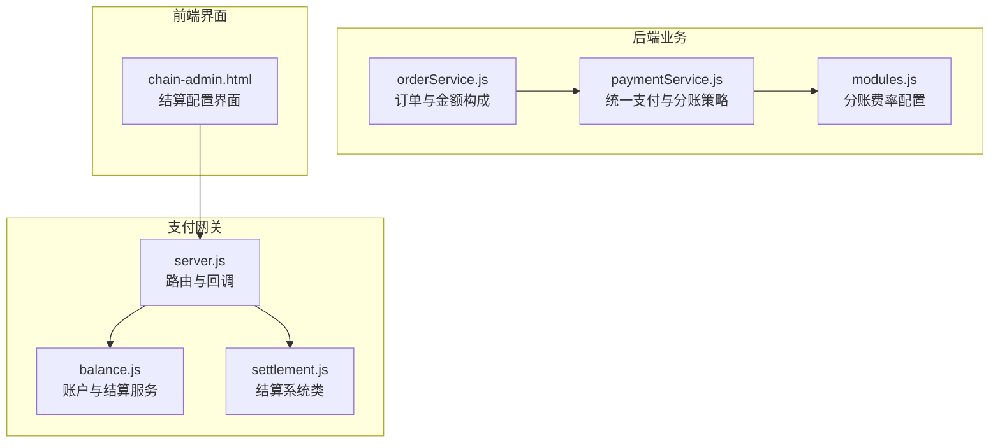
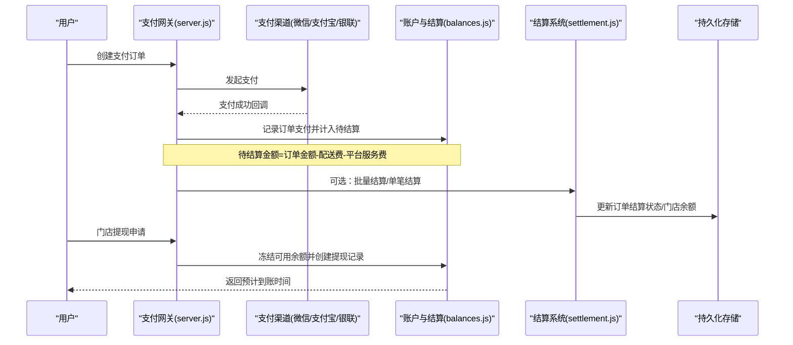
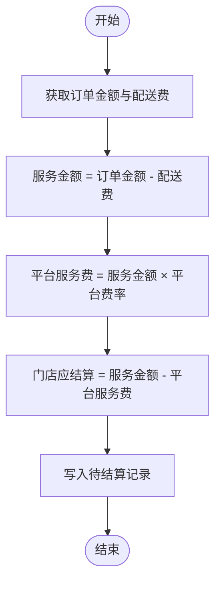
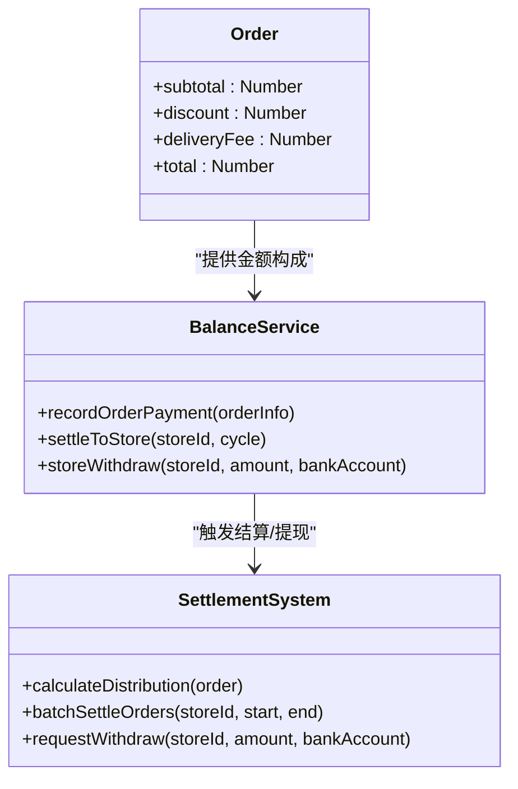
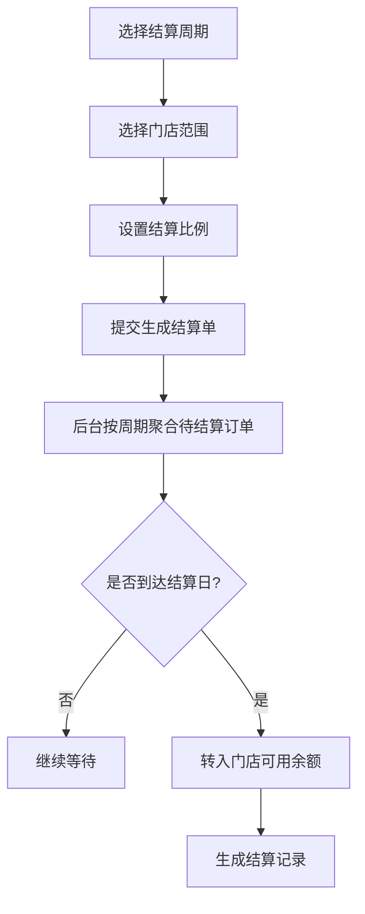
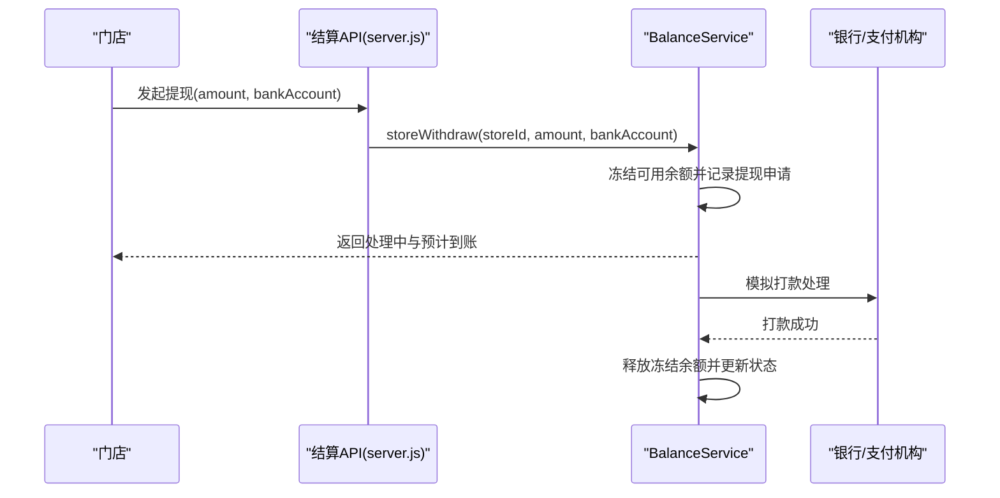
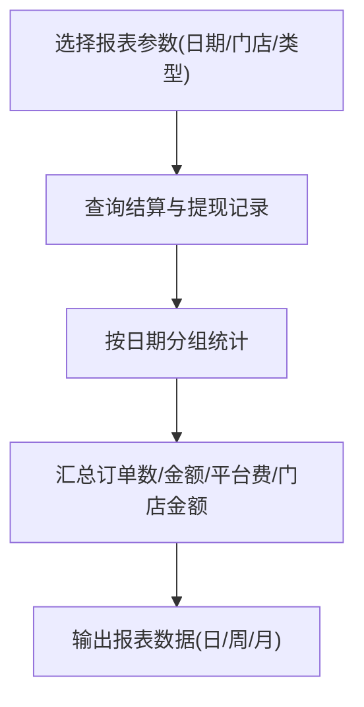
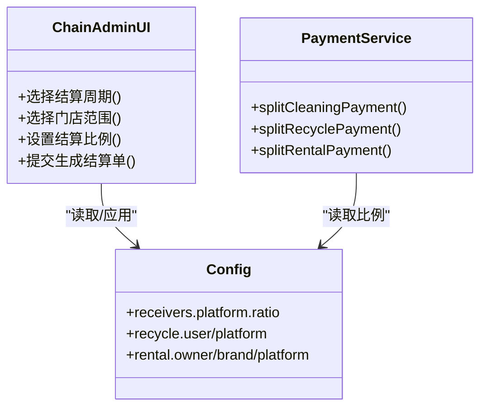
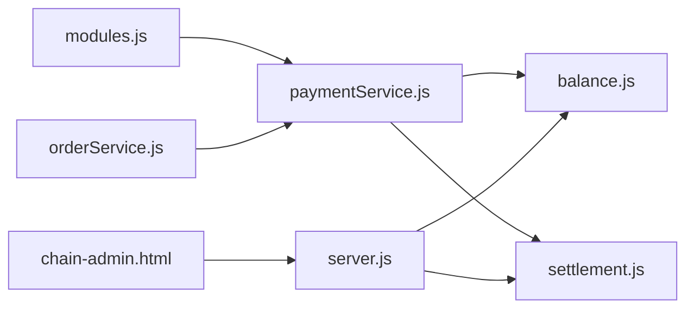

# 分账结算逻辑

<cite>
**本文引用的文件列表**
- [settlement.js](file://api/payment-server/settlement.js)
- [balance.js](file://api/payment-server/balance.js)
- [server.js](file://api/payment-server/server.js)
- [modules.js](file://backend/config/modules.js)
- [paymentService.js](file://backend/modules/common/services/paymentService.js)
- [orderService.js](file://backend/modules/cleaning/services/orderService.js)
- [chain-admin.html](file://chain-admin.html)
</cite>

## 目录
1. [引言](#引言)
2. [项目结构](#项目结构)
3. [核心组件](#核心组件)
4. [架构总览](#架构总览)
5. [详细组件分析](#详细组件分析)
6. [依赖关系分析](#依赖关系分析)
7. [性能与一致性考量](#性能与一致性考量)
8. [故障排查指南](#故障排查指南)
9. [结论](#结论)
10. [附录：操作指南与配置说明](#附录操作指南与配置说明)

## 引言
本文件面向财务人员和系统管理员，系统化阐述干洗店管理系统的“支付分账与结算”实现。内容覆盖：
- 平台抽成比例计算、门店收益分配规则与多方结算的数学模型
- 订单金额分摊（服务费、配送费、商品费用）独立核算方法
- 结算周期配置与管理（T+1、周结、月结等）
- 待结算资金管理（冻结资金、可用余额、提现申请流程）
- 财务报表自动生成（日结单、月报表、税务发票数据基础）
- 分账规则的配置界面与动态调整机制
- 结算异常处理方案与人工干预流程
- 结算操作SOP（财务人员/系统管理员）

## 项目结构
与分账结算直接相关的代码主要分布在以下位置：
- 支付网关与结算服务：api/payment-server 下的 server.js、balance.js、settlement.js
- 统一支付与分账策略：backend/modules/common/services/paymentService.js
- 业务订单与金额构成：backend/modules/cleaning/services/orderService.js
- 分账费率配置：backend/config/modules.js
- 连锁端结算配置界面：chain-admin.html

图表来源
- [server.js:1-120](file://api/payment-server/server.js#L1-L120)
- [balance.js:1-120](file://api/payment-server/balance.js#L1-L120)
- [settlement.js:1-60](file://api/payment-server/settlement.js#L1-L60)
- [paymentService.js:1-60](file://backend/modules/common/services/paymentService.js#L1-L60)
- [orderService.js:1-120](file://backend/modules/cleaning/services/orderService.js#L1-L120)
- [modules.js:130-170](file://backend/config/modules.js#L130-L170)
- [chain-admin.html:1600-1755](file://chain-admin.html#L1600-L1755)

章节来源
- [server.js:1-120](file://api/payment-server/server.js#L1-L120)
- [balance.js:1-120](file://api/payment-server/balance.js#L1-L120)
- [settlement.js:1-60](file://api/payment-server/settlement.js#L1-L60)
- [paymentService.js:1-60](file://backend/modules/common/services/paymentService.js#L1-L60)
- [orderService.js:1-120](file://backend/modules/cleaning/services/orderService.js#L1-L120)
- [modules.js:130-170](file://backend/config/modules.js#L130-L170)
- [chain-admin.html:1600-1755](file://chain-admin.html#L1600-L1755)

## 核心组件
- 支付网关服务器（server.js）：统一创建支付订单、查询状态、关闭订单；接收微信/支付宝/银联回调，并触发结算记录写入。
- 账户与结算服务（balance.js）：用户余额、交易流水、门店待结算与可用余额、定期结算到门店、提现、报表生成。
- 结算系统类（settlement.js）：订单分账计算、批量结算、提现申请、财务报告汇总。
- 统一支付与分账策略（paymentService.js）：按订单类型（干洗、回收、租赁）执行不同分账策略，读取配置中的平台/门店/品牌方比例。
- 订单服务（orderService.js）：订单金额构成（商品小计、折扣、配送费、总计），为分账提供输入。
- 分账费率配置（modules.js）：平台抽成比例、回收与租赁分账比例等。
- 结算配置界面（chain-admin.html）：支持选择结算周期（日结/周结/月结/自定义）、门店范围、结算比例，提交后台生成结算单。

章节来源
- [server.js:42-174](file://api/payment-server/server.js#L42-L174)
- [balance.js:240-337](file://api/payment-server/balance.js#L240-L337)
- [settlement.js:23-92](file://api/payment-server/settlement.js#L23-L92)
- [paymentService.js:94-173](file://backend/modules/common/services/paymentService.js#L94-L173)
- [orderService.js:54-110](file://backend/modules/cleaning/services/orderService.js#L54-L110)
- [modules.js:137-163](file://backend/config/modules.js#L137-L163)
- [chain-admin.html:1700-1747](file://chain-admin.html#L1700-L1747)

## 架构总览
支付与结算的整体流程如下：
- 用户下单后，通过统一支付接口创建支付订单，选择支付方式（微信/支付宝/银联/余额）。
- 支付成功后，各渠道回调通知网关，网关将订单金额与配送费等关键信息写入结算记录（进入待结算池）。
- 根据结算周期（如T+7或可配置周期），将待结算金额转入门店可用余额。
- 门店发起提现，系统冻结可用余额并调用银行/支付机构完成打款，释放冻结额度。
- 财务报表基于结算与提现记录聚合生成，支持日/周/月维度统计。

图表来源
- [server.js:306-451](file://api/payment-server/server.js#L306-L451)
- [balance.js:244-337](file://api/payment-server/balance.js#L244-L337)
- [settlement.js:50-174](file://api/payment-server/settlement.js#L50-L174)

## 详细组件分析

### 1) 平台抽成与门店收益分配算法
- 平台服务费比例来源于配置模块（modules.js），默认平台抽成约6%（可按业务调整）。
- 在支付网关回调中，balance.js 对订单进行分账计算：
  - 先扣除配送费（若存在），剩余作为“服务金额”。
  - 平台服务费 = 服务金额 × 平台费率。
  - 门店应结算金额 = 服务金额 - 平台服务费。
- paymentService.js 提供多品类分账策略（干洗、回收、租赁），按配置比例拆分至平台、门店、品牌方、所有者等。

图表来源
- [balance.js:244-283](file://api/payment-server/balance.js#L244-L283)
- [modules.js:137-163](file://backend/config/modules.js#L137-L163)
- [paymentService.js:122-173](file://backend/modules/common/services/paymentService.js#L122-L173)

章节来源
- [balance.js:244-283](file://api/payment-server/balance.js#L244-L283)
- [modules.js:137-163](file://backend/config/modules.js#L137-L163)
- [paymentService.js:122-173](file://backend/modules/common/services/paymentService.js#L122-L173)

### 2) 订单金额分摊逻辑（服务费、配送费、商品费用）
- orderService.js 定义了订单金额字段：subtotal（商品小计）、discount（优惠）、deliveryFee（配送费）、total（合计）。
- balance.js 在记录支付时，使用 totalAmount 与 deliveryFee 计算服务金额，再按平台费率拆分。
- settlement.js 的 calculateDistribution 以 totalAmount 为基础计算平台服务费与门店金额，便于统一口径。

图表来源
- [orderService.js:54-110](file://backend/modules/cleaning/services/orderService.js#L54-L110)
- [balance.js:244-337](file://api/payment-server/balance.js#L244-L337)
- [settlement.js:23-92](file://api/payment-server/settlement.js#L23-L92)

章节来源
- [orderService.js:54-110](file://backend/modules/cleaning/services/orderService.js#L54-L110)
- [balance.js:244-337](file://api/payment-server/balance.js#L244-L337)
- [settlement.js:23-92](file://api/payment-server/settlement.js#L23-L92)

### 3) 结算周期配置与管理（T+1、周结、月结）
- chain-admin.html 提供结算周期选择（日结/周结/月结/自定义），并可指定门店范围与结算比例。
- balance.js 的 settleToStore 支持传入结算周期（天），用于控制何时将待结算金额转入可用余额。
- settlement.js 内置 T+7 示例（可调整为 T+1 或周/月），并提供批量结算接口。

图表来源
- [chain-admin.html:1700-1747](file://chain-admin.html#L1700-L1747)
- [balance.js:290-337](file://api/payment-server/balance.js#L290-L337)
- [settlement.js:9-21](file://api/payment-server/settlement.js#L9-L21)

章节来源
- [chain-admin.html:1700-1747](file://chain-admin.html#L1700-L1747)
- [balance.js:290-337](file://api/payment-server/balance.js#L290-L337)
- [settlement.js:9-21](file://api/payment-server/settlement.js#L9-L21)

### 4) 待结算资金管理（冻结资金、可用余额、提现流程）
- balance.js 维护门店可用余额与冻结余额：
  - 提现时从可用余额扣减并增加冻结余额，同时创建提现记录。
  - 提现完成后释放冻结余额。
- settlement.js 的 requestWithdraw 同样实现冻结与预估到账时间。

图表来源
- [server.js:550-563](file://api/payment-server/server.js#L550-L563)
- [balance.js:345-409](file://api/payment-server/balance.js#L345-L409)
- [settlement.js:183-235](file://api/payment-server/settlement.js#L183-L235)

章节来源
- [server.js:550-563](file://api/payment-server/server.js#L550-L563)
- [balance.js:345-409](file://api/payment-server/balance.js#L345-L409)
- [settlement.js:183-235](file://api/payment-server/settlement.js#L183-L235)

### 5) 财务报表自动生成（日结单、月报表、税务发票数据基础）
- balance.js 的 generateReport 支持按日期范围与门店维度聚合结算数据，输出每日统计与汇总。
- settlement.js 的 getStoreFinancialReport 汇总结算与提现记录，并计算当前余额、冻结余额与可用余额。

图表来源
- [balance.js:459-520](file://api/payment-server/balance.js#L459-L520)
- [settlement.js:244-293](file://api/payment-server/settlement.js#L244-L293)

章节来源
- [balance.js:459-520](file://api/payment-server/balance.js#L459-L520)
- [settlement.js:244-293](file://api/payment-server/settlement.js#L244-L293)

### 6) 分账规则配置界面与动态调整机制
- chain-admin.html 提供结算周期、门店范围、结算比例的表单，提交后由后端生成结算单。
- modules.js 集中定义平台/门店/回收/租赁的分账比例，可在运行时读取并应用于分账策略。
- paymentService.js 依据订单类型与配置比例执行分账，支持未来扩展更多品类与接收方。

图表来源
- [chain-admin.html:1700-1747](file://chain-admin.html#L1700-L1747)
- [modules.js:137-163](file://backend/config/modules.js#L137-L163)
- [paymentService.js:122-173](file://backend/modules/common/services/paymentService.js#L122-L173)

章节来源
- [chain-admin.html:1700-1747](file://chain-admin.html#L1700-L1747)
- [modules.js:137-163](file://backend/config/modules.js#L137-L163)
- [paymentService.js:122-173](file://backend/modules/common/services/paymentService.js#L122-L173)

## 依赖关系分析
- server.js 依赖 balance.js 与 settlement.js 完成支付回调后的结算与提现处理。
- paymentService.js 依赖 modules.js 的分账比例配置，为不同订单类型提供分账策略。
- orderService.js 提供订单金额构成，供分账与结算使用。
- chain-admin.html 通过 HTTP 调用后端接口，驱动结算单的生成与查看。

图表来源
- [modules.js:137-163](file://backend/config/modules.js#L137-L163)
- [paymentService.js:1-60](file://backend/modules/common/services/paymentService.js#L1-L60)
- [orderService.js:1-120](file://backend/modules/cleaning/services/orderService.js#L1-L120)
- [server.js:1-120](file://api/payment-server/server.js#L1-L120)
- [balance.js:1-120](file://api/payment-server/balance.js#L1-L120)
- [settlement.js:1-60](file://api/payment-server/settlement.js#L1-L60)
- [chain-admin.html:1700-1747](file://chain-admin.html#L1700-L1747)

章节来源
- [modules.js:137-163](file://backend/config/modules.js#L137-L163)
- [paymentService.js:1-60](file://backend/modules/common/services/paymentService.js#L1-L60)
- [orderService.js:1-120](file://backend/modules/cleaning/services/orderService.js#L1-L120)
- [server.js:1-120](file://api/payment-server/server.js#L1-L120)
- [balance.js:1-120](file://api/payment-server/balance.js#L1-L120)
- [settlement.js:1-60](file://api/payment-server/settlement.js#L1-L60)
- [chain-admin.html:1700-1747](file://chain-admin.html#L1700-L1747)

## 性能与一致性考量
- 幂等性：支付回调需保证重复通知不重复入账，建议在网关层做去重校验（基于订单号与交易号）。
- 事务性：结算与余额更新应在同一事务内完成，避免部分成功导致的数据不一致。
- 并发控制：批量结算与提现需加锁或队列化，防止超提与重复冻结。
- 精度控制：金额计算采用四舍五入到分，避免浮点误差累积。
- 异步处理：提现打款为异步过程，需记录状态机（processing→success/failed）并支持重试与补偿。

[本节为通用指导，无需具体文件引用]

## 故障排查指南
- 支付回调失败：检查签名验证与回调地址可达性，确认订单是否存在且未重复处理。
- 结算失败：核对待结算订单状态是否为“pending”，确认结算周期是否满足。
- 提现失败：检查可用余额是否充足、最低提现金额限制、银行账户有效性；查看冻结余额是否正确释放。
- 报表差异：核对结算记录与提现记录的日期范围与门店过滤条件，确保聚合逻辑一致。

章节来源
- [server.js:306-451](file://api/payment-server/server.js#L306-L451)
- [balance.js:290-337](file://api/payment-server/balance.js#L290-L337)
- [balance.js:345-409](file://api/payment-server/balance.js#L345-L409)
- [balance.js:459-520](file://api/payment-server/balance.js#L459-L520)

## 结论
本系统通过统一的支付网关与结算服务，实现了平台抽成、门店收益分配与多方结算的清晰模型。订单金额按服务费与配送费独立核算，结算周期可配置，待结算资金通过冻结与可用余额机制保障安全。财务报表基于结算与提现记录自动聚合，支持日/周/月维度。前端结算配置界面便于运营人员灵活调整结算策略。整体设计兼顾可扩展性与可审计性，适合连锁干洗业务的规模化运营。

[本节为总结性内容，无需具体文件引用]

## 附录：操作指南与配置说明

### 财务人员操作SOP
- 查看门店账户与结算记录
  - 访问门店结算信息接口，筛选状态与日期范围，导出报表。
- 发起结算
  - 在结算界面选择周期（日结/周结/月结/自定义）、门店范围与结算比例，提交生成结算单。
- 审核提现
  - 查看提现申请状态，确认冻结金额与预计到账时间，必要时进行人工干预（重试或拒绝）。
- 出具报表
  - 生成日结单与月报表，核对平台服务费与门店结算金额，准备税务发票所需数据。

章节来源
- [server.js:514-578](file://api/payment-server/server.js#L514-L578)
- [chain-admin.html:1700-1747](file://chain-admin.html#L1700-L1747)
- [balance.js:459-520](file://api/payment-server/balance.js#L459-L520)

### 系统管理员配置说明
- 修改平台抽成比例
  - 在配置文件中调整平台与服务方的比例，确保总和合理（例如平台6%、门店94%）。
- 调整结算周期
  - 在结算服务中设置结算周期（如T+1、T+7），并在前端界面提供对应选项。
- 扩展分账策略
  - 在统一支付服务中新增订单类型与接收方，读取配置模块的比例进行拆分。

章节来源
- [modules.js:137-163](file://backend/config/modules.js#L137-L163)
- [settlement.js:9-21](file://api/payment-server/settlement.js#L9-L21)
- [paymentService.js:122-173](file://backend/modules/common/services/paymentService.js#L122-L173)