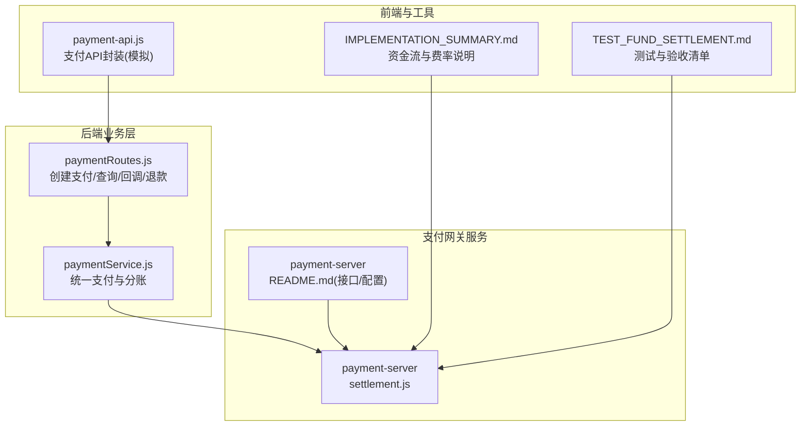
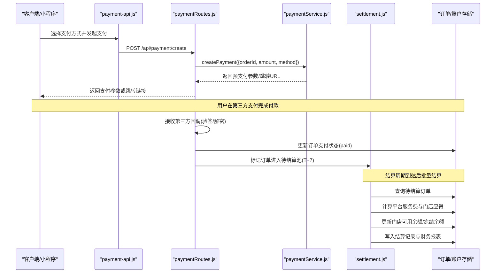
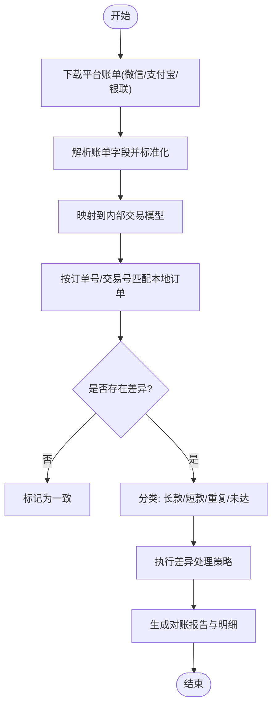
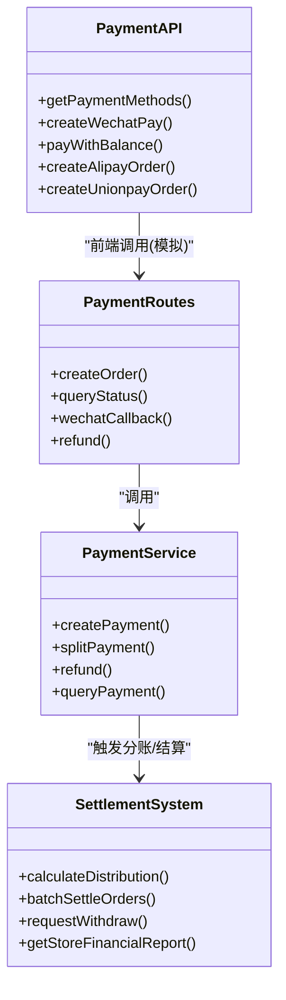

# 对账处理

<cite>
**本文引用的文件**
- [api/payment-server/README.md](file://api/payment-server/README.md)
- [api/payment-server/settlement.js](file://api/payment-server/settlement.js)
- [backend/modules/common/services/paymentService.js](file://backend/modules/common/services/paymentService.js)
- [backend/modules/common/routes/paymentRoutes.js](file://backend/modules/common/routes/paymentRoutes.js)
- [api/payment-api.js](file://api/payment-api.js)
- [IMPLEMENTATION_SUMMARY.md](file://IMPLEMENTATION_SUMMARY.md)
- [TEST_FUND_SETTLEMENT.md](file://TEST_FUND_SETTLEMENT.md)
</cite>

## 目录
1. [引言](#引言)
2. [项目结构](#项目结构)
3. [核心组件](#核心组件)
4. [架构总览](#架构总览)
5. [详细组件分析](#详细组件分析)
6. [依赖关系分析](#依赖关系分析)
7. [性能与可靠性](#性能与可靠性)
8. [故障排查指南](#故障排查指南)
9. [结论](#结论)
10. [附录：对账操作手册（财务与对账专员）](#附录对账操作手册财务与对账专员)

## 引言
本文件面向干洗店管理系统的“对账处理”能力，聚焦自动对账的核心流程、差异处理策略、多平台账单格式映射、结果可视化展示、定时调度与人工干预、以及备份恢复与审计追踪。文档同时为财务人员和对账专员提供可操作的流程说明与排障指引。

## 项目结构
围绕对账相关能力，系统涉及支付网关服务、统一支付服务、路由回调、结算与余额模块，以及前端统计与报表页面。下图给出与对账相关的核心模块与交互关系。

图表来源
- [api/payment-server/settlement.js:1-389](file://api/payment-server/settlement.js#L1-L389)
- [api/payment-server/README.md:148-242](file://api/payment-server/README.md#L148-L242)
- [backend/modules/common/services/paymentService.js:1-185](file://backend/modules/common/services/paymentService.js#L1-L185)
- [backend/modules/common/routes/paymentRoutes.js:1-215](file://backend/modules/common/routes/paymentRoutes.js#L1-L215)
- [api/payment-api.js:1-427](file://api/payment-api.js#L1-L427)
- [IMPLEMENTATION_SUMMARY.md:162-196](file://IMPLEMENTATION_SUMMARY.md#L162-L196)
- [TEST_FUND_SETTLEMENT.md:182-241](file://TEST_FUND_SETTLEMENT.md#L182-L241)

章节来源
- [api/payment-server/README.md:1-120](file://api/payment-server/README.md#L1-L120)
- [IMPLEMENTATION_SUMMARY.md:109-158](file://IMPLEMENTATION_SUMMARY.md#L109-L158)

## 核心组件
- 统一支付服务：对外屏蔽微信/支付宝/银联/余额等渠道差异，提供创建支付、分账计算、退款与查询的统一入口。
- 支付路由与回调：聚合支付入口、状态查询、第三方回调处理与订单状态更新。
- 结算系统：负责平台服务费抽取、门店应得金额计算、T+7结算周期、门店余额与冻结余额管理、提现申请与财务报表生成。
- 前端支付API封装：提供支付方法列表、创建各渠道订单、余额充值与查询等（当前为模拟实现）。

章节来源
- [backend/modules/common/services/paymentService.js:1-185](file://backend/modules/common/services/paymentService.js#L1-L185)
- [backend/modules/common/routes/paymentRoutes.js:1-215](file://backend/modules/common/routes/paymentRoutes.js#L1-L215)
- [api/payment-server/settlement.js:1-389](file://api/payment-server/settlement.js#L1-L389)
- [api/payment-api.js:1-427](file://api/payment-api.js#L1-L427)

## 架构总览
下图展示从用户下单到支付成功、回调落库、进入待结算池、T+7结算至门店可用余额的完整链路，以及对账所需的关键数据节点。

图表来源
- [backend/modules/common/routes/paymentRoutes.js:120-171](file://backend/modules/common/routes/paymentRoutes.js#L120-L171)
- [backend/modules/common/services/paymentService.js:24-47](file://backend/modules/common/services/paymentService.js#L24-L47)
- [api/payment-server/settlement.js:94-174](file://api/payment-server/settlement.js#L94-L174)
- [api/payment-api.js:81-125](file://api/payment-api.js#L81-L125)

## 详细组件分析

### 自动对账核心流程
自动对账以“支付流水 + 本地订单 + 结算记录”三表对齐为基础，结合第三方账单下载与解析，形成差异明细。

说明
- 下载与解析：需对接各平台账单下载接口或文件导出；将不同平台的字段映射为统一的交易模型（订单号、交易号、金额、手续费、时间、状态等）。
- 匹配规则：优先使用外部交易号精确匹配，其次使用订单号+金额+时间窗口模糊匹配。
- 差异分类：
  - 长款：平台有入账而本地无对应订单或金额不一致。
  - 短款：本地已出单但平台未到账。
  - 重复支付：同一订单出现多笔成功入账。
  - 未达：跨日延迟到账导致的暂时性差异。
- 处理策略：自动重试、挂起待审、人工复核、冲正/调账（需审批）、补录本地流水。
- 报告输出：汇总一致率、差异金额、分类占比、趋势图、导出Excel/PDF。

章节来源
- [api/payment-server/README.md:148-242](file://api/payment-server/README.md#L148-L242)
- [IMPLEMENTATION_SUMMARY.md:162-196](file://IMPLEMENTATION_SUMMARY.md#L162-L196)

### 支付平台账单格式与数据映射
- 微信支付：包含商户订单号、微信支付订单号、交易金额、手续费、完成时间、状态等字段。
- 支付宝：包含商家订单号、支付宝交易号、交易金额、手续费、交易时间、交易状态等字段。
- 银联：包含商户参考号、银联交易号、交易金额、手续费、交易时间、交易状态等字段。

映射建议
- 统一字段：order_no、trade_no、amount、fee、paid_at、status、channel。
- 金额单位：统一为元（两位小数），必要时在入库前进行分转元处理。
- 时间与时区：统一为UTC或指定时区，避免跨日差异。
- 幂等键：以 trade_no 作为幂等键，防止重复入账。

章节来源
- [api/payment-server/README.md:69-143](file://api/payment-server/README.md#L69-L143)

### 对账差异处理机制
- 长款处理：
  - 若存在本地订单且金额一致：补录本地流水并标记一致。
  - 若不存在本地订单：创建异常工单，触发风控核查与人工确认。
- 短款处理：
  - 检查是否处于未达期（如跨日延迟），设置观察期后再次核对。
  - 超过观察期仍未到账：发起平台侧查询与客诉跟进。
- 重复支付：
  - 依据幂等键去重，仅保留首笔有效入账，其余标记为重复并生成退款或调账工单。
- 金额不一致：
  - 比较订单实付与平台入账差额，若小于阈值（如0.01元）视为舍入误差，否则走人工审核。

章节来源
- [api/payment-server/settlement.js:23-43](file://api/payment-server/settlement.js#L23-L43)
- [backend/modules/common/services/paymentService.js:96-173](file://backend/modules/common/services/paymentService.js#L96-L173)

### 对账结果可视化与报表
- 对账报告：
  - 概览：对账日期、总笔数、一致率、差异金额、主要差异类型分布。
  - 明细：逐笔差异项，含来源渠道、订单号、交易号、金额、差异原因、处理状态。
- 统计分析：
  - 渠道收入占比、每日趋势、门店维度对比、异常率趋势。
- 导出与归档：
  - 支持CSV/Excel/PDF导出，附带签名与校验和，便于审计留存。

章节来源
- [api/payment-server/README.md:232-242](file://api/payment-server/README.md#L232-L242)
- [TEST_FUND_SETTLEMENT.md:182-241](file://TEST_FUND_SETTLEMENT.md#L182-L241)

### 对账任务调度与历史管理
- 定时任务：
  - 每日凌晨自动拉取前一工作日账单，执行解析、匹配与差异识别。
  - 支持手动触发一次对账，用于补跑或验证。
- 历史管理：
  - 保存每次对账批次信息（批次号、起止时间、渠道、结果摘要）。
  - 支持按日期、渠道、门店筛选查看历史对账结果与差异明细。
- 失败重试与告警：
  - 任务失败自动重试（指数退避），达到上限后发送告警通知。
  - 关键指标（差异率、长款/短款金额）超阈触发预警。

章节来源
- [api/payment-server/README.md:384-408](file://api/payment-server/README.md#L384-L408)
- [TEST_FUND_SETTLEMENT.md:226-241](file://TEST_FUND_SETTLEMENT.md#L226-L241)

### 预警机制与人工干预流程
- 预警规则：
  - 差异率超过阈值（例如1%）。
  - 单笔长款/短款金额超过阈值。
  - 连续N天出现某类差异。
- 人工干预：
  - 对账专员在差异列表中点击“处理”，选择策略（补录、冲正、调账、忽略）。
  - 所有变更需双人复核与留痕，支持回滚。
- 审计追踪：
  - 记录操作人、时间、前后值、原因说明，满足合规要求。

章节来源
- [IMPLEMENTATION_SUMMARY.md:207-218](file://IMPLEMENTATION_SUMMARY.md#L207-L218)

### 备份恢复与审计追踪
- 备份：
  - 对账原始账单、解析中间表、最终对账结果、差异明细与处理日志均需纳入备份范围。
  - 支持定时全量与增量备份，保留策略按合规要求设定。
- 恢复：
  - 支持按批次号或日期范围恢复，确保对账可重现。
- 审计：
  - 关键操作（导入、匹配、差异处理、报表导出）均记录不可篡改日志。

章节来源
- [IMPLEMENTATION_SUMMARY.md:207-218](file://IMPLEMENTATION_SUMMARY.md#L207-L218)

## 依赖关系分析
- 支付路由依赖统一支付服务与第三方服务（微信/支付宝/银联）回调处理。
- 统一支付服务负责分账逻辑与渠道抽象，供路由层调用。
- 结算系统独立于支付通道，基于订单与账户数据进行分账与结算。
- 前端支付API封装目前为模拟实现，后续替换为真实网关调用。

图表来源
- [backend/modules/common/routes/paymentRoutes.js:1-215](file://backend/modules/common/routes/paymentRoutes.js#L1-L215)
- [backend/modules/common/services/paymentService.js:1-185](file://backend/modules/common/services/paymentService.js#L1-L185)
- [api/payment-server/settlement.js:1-389](file://api/payment-server/settlement.js#L1-L389)
- [api/payment-api.js:1-427](file://api/payment-api.js#L1-L427)

章节来源
- [backend/modules/common/routes/paymentRoutes.js:1-215](file://backend/modules/common/routes/paymentRoutes.js#L1-L215)
- [backend/modules/common/services/paymentService.js:1-185](file://backend/modules/common/services/paymentService.js#L1-L185)
- [api/payment-server/settlement.js:1-389](file://api/payment-server/settlement.js#L1-L389)
- [api/payment-api.js:1-427](file://api/payment-api.js#L1-L427)

## 性能与可靠性
- 并发与吞吐：
  - 对账解析采用批处理与并行读取，避免阻塞主线程。
  - 大文件账单分片解析，内存占用可控。
- 幂等与一致性：
  - 以交易号为幂等键，保证重复回调不重复入账。
  - 事务边界覆盖订单状态更新与结算记录写入。
- 容错与重试：
  - 网络异常与第三方限流场景下采用指数退避重试。
  - 失败任务进入死信队列，支持人工介入与重放。
- 监控与告警：
  - 关键指标埋点（成功率、耗时、差异率、错误码分布）。
  - 异常阈值告警推送至企业微信/邮件/短信。

[本节为通用指导，无需具体文件引用]

## 故障排查指南
- 常见问题定位步骤：
  - 核对第三方回调是否到达与验签是否通过。
  - 检查订单状态是否由“待支付”更新为“已支付”。
  - 确认对账批次是否生成、差异明细是否正确分类。
  - 查看结算记录与门店余额变动是否一致。
- 快速自检清单：
  - 回调URL公网可达、证书与密钥正确。
  - 时间同步正常，避免跨日差异误判。
  - 幂等键唯一，避免重复入账。
  - 报表导出文件完整性校验通过。

章节来源
- [api/payment-server/README.md:354-408](file://api/payment-server/README.md#L354-L408)
- [TEST_FUND_SETTLEMENT.md:226-241](file://TEST_FUND_SETTLEMENT.md#L226-L241)

## 结论
通过对账自动化、差异智能分类、可视化报表与完善的人工干预流程，系统能够保障多渠道资金流水与本地订单的一致性，提升财务效率与合规水平。建议在上线阶段强化监控与演练，持续优化差异处理策略与报表体验。

[本节为总结性内容，无需具体文件引用]

## 附录：对账操作手册（财务与对账专员）
- 日常操作
  - 登录对账中心，选择对账日期与渠道，点击“自动对账”。
  - 查看对账概览与差异明细，按差异类型筛选。
  - 对长款/短款/重复支付逐项处理，填写原因并保存。
- 报表与导出
  - 生成日报/周报/月报，支持导出与打印。
  - 导出文件需进行完整性校验并归档。
- 异常处理
  - 发现异常立即暂停自动对账，切换为手工模式。
  - 提交工单并通知技术团队，跟踪处理进度。
- 备份与恢复
  - 定期执行全量备份，保留最近N份副本。
  - 需要恢复时按批次号或日期范围恢复，并复核对账结果。
- 审计与合规
  - 所有操作留痕，支持审计追溯。
  - 敏感数据脱敏展示，权限最小化控制。

章节来源
- [TEST_FUND_SETTLEMENT.md:182-241](file://TEST_FUND_SETTLEMENT.md#L182-L241)
- [IMPLEMENTATION_SUMMARY.md:207-218](file://IMPLEMENTATION_SUMMARY.md#L207-L218)