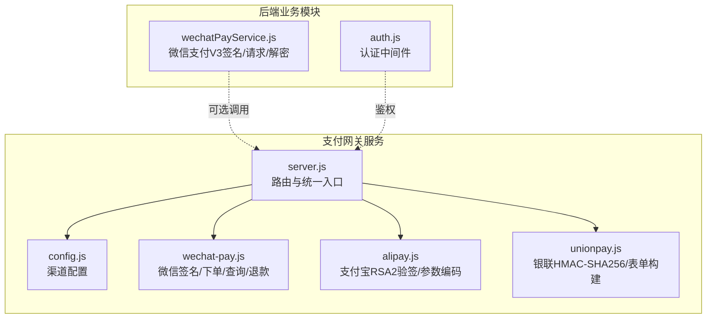
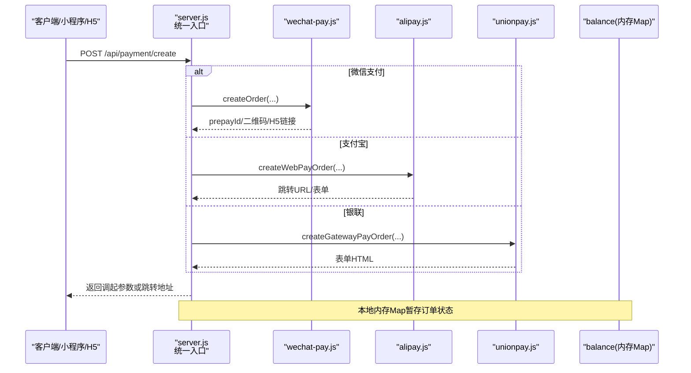
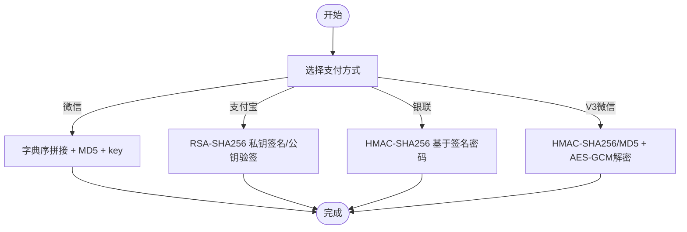
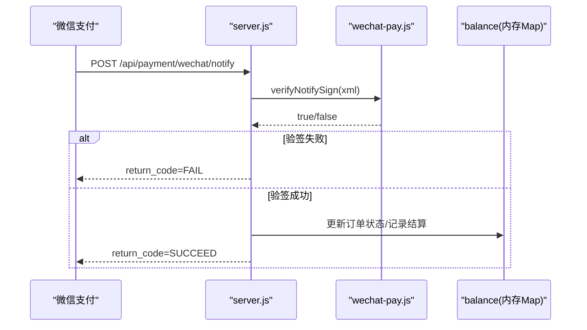
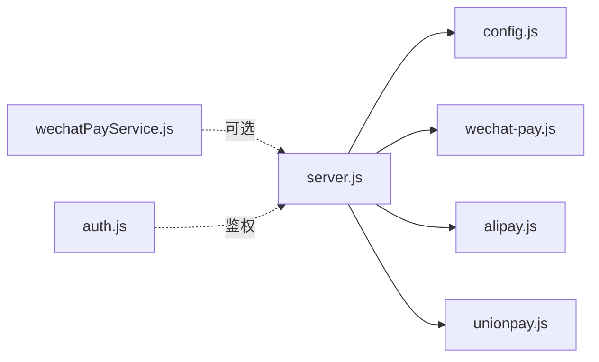

# 支付安全机制

<cite>
**本文引用的文件**   
- [api/payment-server/config.js](file://api/payment-server/config.js)
- [api/payment-server/server.js](file://api/payment-server/server.js)
- [api/payment-server/wechat-pay.js](file://api/payment-server/wechat-pay.js)
- [api/payment-server/alipay.js](file://api/payment-server/alipay.js)
- [api/payment-server/unionpay.js](file://api/payment-server/unionpay.js)
- [backend/modules/common/services/wechatPayService.js](file://backend/modules/common/services/wechatPayService.js)
- [backend/modules/common/middlewares/auth.js](file://backend/modules/common/middlewares/auth.js)
- [api/payment-api.js](file://api/payment-api.js)
- [api/payment-server/README.md](file://api/payment-server/README.md)
- [api/payment-server/QUICK_START.md](file://api/payment-server/QUICK_START.md)
</cite>

## 目录
1. [引言](#引言)
2. [项目结构](#项目结构)
3. [核心组件](#核心组件)
4. [架构总览](#架构总览)
5. [详细组件分析](#详细组件分析)
6. [依赖分析](#依赖分析)
7. [性能考虑](#性能考虑)
8. [故障排查指南](#故障排查指南)
9. [结论](#结论)
10. [附录：配置与安全清单](#附录配置与安全清单)

## 引言
本文件面向安全工程师与运维人员，系统化梳理干洗店管理系统的支付安全机制。内容覆盖签名生成与验证（MD5、SHA256、RSA-SHA256、HMAC-SHA256）、密钥管理、防重放攻击（时间戳、随机数、去重）、敏感信息保护（数据加密、HTTPS）、访问控制（认证、IP白名单、限流建议）、审计日志与合规检查、应急响应与故障排查，并提供可落地的配置指南与加固措施。

## 项目结构
支付相关代码主要分布在两个位置：
- 独立支付网关服务（Node/Express）：负责统一收单、渠道对接、回调处理与结算记录
- 后端业务模块：提供统一的支付服务封装与微信支付V3能力

图示来源
- [api/payment-server/server.js:1-60](file://api/payment-server/server.js#L1-L60)
- [api/payment-server/config.js:1-80](file://api/payment-server/config.js#L1-L80)
- [api/payment-server/wechat-pay.js:1-60](file://api/payment-server/wechat-pay.js#L1-L60)
- [api/payment-server/alipay.js:1-40](file://api/payment-server/alipay.js#L1-L40)
- [api/payment-server/unionpay.js:1-60](file://api/payment-server/unionpay.js#L1-L60)
- [backend/modules/common/services/wechatPayService.js:1-40](file://backend/modules/common/services/wechatPayService.js#L1-L40)
- [backend/modules/common/middlewares/auth.js:1-40](file://backend/modules/common/middlewares/auth.js#L1-L40)

章节来源
- [api/payment-server/server.js:1-60](file://api/payment-server/server.js#L1-L60)
- [api/payment-server/config.js:1-80](file://api/payment-server/config.js#L1-L80)

## 核心组件
- 统一支付入口：聚合多渠道创建订单、查询、关闭与回调处理
- 渠道适配层：分别实现微信、支付宝、银联的签名、参数组装与回调验签
- 配置中心：集中管理各渠道密钥、证书路径、回调URL等
- 认证中间件：对受保护接口进行身份校验与角色控制（可扩展至支付接口）
- 微信支付V3服务：提供V3 API签名、通知验签与AES-GCM解密能力

章节来源
- [api/payment-server/server.js:36-174](file://api/payment-server/server.js#L36-L174)
- [api/payment-server/wechat-pay.js:28-43](file://api/payment-server/wechat-pay.js#L28-L43)
- [api/payment-server/alipay.js:20-37](file://api/payment-server/alipay.js#L20-L37)
- [api/payment-server/unionpay.js:47-72](file://api/payment-server/unionpay.js#L47-L72)
- [backend/modules/common/services/wechatPayService.js:30-38](file://backend/modules/common/services/wechatPayService.js#L30-L38)
- [backend/modules/common/middlewares/auth.js:10-38](file://backend/modules/common/middlewares/auth.js#L10-L38)

## 架构总览
支付网关作为对外统一入口，内部按支付方式分发到对应服务；所有回调均先验签再落库并触发结算记录。

图示来源
- [api/payment-server/server.js:42-174](file://api/payment-server/server.js#L42-L174)
- [api/payment-server/wechat-pay.js:56-127](file://api/payment-server/wechat-pay.js#L56-L127)
- [api/payment-server/alipay.js:53-66](file://api/payment-server/alipay.js#L53-L66)
- [api/payment-server/unionpay.js:78-120](file://api/payment-server/unionpay.js#L78-L120)

## 详细组件分析

### 签名与验签算法
- 微信支付（旧版XML）
  - 签名：字典序拼接 + MD5 + key后缀
  - 回调验签：去除sign后重新计算比对
  - 小程序调起参数：timeStamp/nonceStr/package/signType/paySign
- 支付宝
  - 签名：RSA-SHA256（私钥签名），公钥验签
  - 参数编码：键排序+URL编码+&连接
- 银联
  - 签名：HMAC-SHA256（基于商户签名密码）
  - 回调验签：剔除signature/signMethod后重组内容再验签
- 微信支付V3（后端模块）
  - 签名：HMAC-SHA256（V3）或MD5（兼容）
  - 通知验签：从Header取timestamp/nonce/signature，组合消息体计算
  - 通知解密：AES-256-GCM（使用APIKey派生）

图示来源
- [api/payment-server/wechat-pay.js:28-43](file://api/payment-server/wechat-pay.js#L28-L43)
- [api/payment-server/alipay.js:20-37](file://api/payment-server/alipay.js#L20-L37)
- [api/payment-server/unionpay.js:47-72](file://api/payment-server/unionpay.js#L47-L72)
- [backend/modules/common/services/wechatPayService.js:30-38](file://backend/modules/common/services/wechatPayService.js#L30-L38)
- [backend/modules/common/services/wechatPayService.js:339-355](file://backend/modules/common/services/wechatPayService.js#L339-L355)
- [backend/modules/common/services/wechatPayService.js:360-375](file://backend/modules/common/services/wechatPayService.js#L360-L375)

章节来源
- [api/payment-server/wechat-pay.js:28-43](file://api/payment-server/wechat-pay.js#L28-L43)
- [api/payment-server/alipay.js:20-37](file://api/payment-server/alipay.js#L20-L37)
- [api/payment-server/unionpay.js:47-72](file://api/payment-server/unionpay.js#L47-L72)
- [backend/modules/common/services/wechatPayService.js:30-38](file://backend/modules/common/services/wechatPayService.js#L30-L38)
- [backend/modules/common/services/wechatPayService.js:339-375](file://backend/modules/common/services/wechatPayService.js#L339-L375)

### 密钥与证书管理
- 环境变量注入：各渠道appId、mchId、apiKey、公私钥、证书路径、回调URL等通过环境变量加载
- 证书存放：微信支付证书需放置于certs目录（生产环境）
- 最小权限：仅运行账户具备读取证书/私钥权限

章节来源
- [api/payment-server/config.js:12-62](file://api/payment-server/config.js#L12-L62)
- [api/payment-server/QUICK_START.md:255-282](file://api/payment-server/QUICK_START.md#L255-L282)

### 防重放攻击
- 随机数：各渠道均生成nonceStr用于签名参与与幂等标识
- 时间戳：V3微信通知包含timestamp，可用于时效校验；银联构造请求时携带txnTime
- 请求去重：建议在回调处理前以“商户订单号+nonce/timestamp”为键做短期去重（当前代码未显式实现，建议补充）

章节来源
- [api/payment-server/wechat-pay.js:18-21](file://api/payment-server/wechat-pay.js#L18-L21)
- [api/payment-server/unionpay.js:18-33](file://api/payment-server/unionpay.js#L18-L33)
- [backend/modules/common/services/wechatPayService.js:42-45](file://backend/modules/common/services/wechatPayService.js#L42-L45)
- [backend/modules/common/services/wechatPayService.js:339-355](file://backend/modules/common/services/wechatPayService.js#L339-L355)

### 敏感信息保护
- 传输层安全：生产环境必须启用HTTPS（文档明确要求）
- 数据加密：V3微信通知采用AES-256-GCM解密；其他通道建议使用TLS
- 隐私字段：避免在日志中输出完整卡号、CVN2、手机号等；如需保留应脱敏存储

章节来源
- [api/payment-server/QUICK_START.md:276-282](file://api/payment-server/QUICK_START.md#L276-L282)
- [backend/modules/common/services/wechatPayService.js:360-375](file://backend/modules/common/services/wechatPayService.js#L360-L375)
- [api/payment-server/unionpay.js:442-447](file://api/payment-server/unionpay.js#L442-L447)

### 访问控制与身份认证
- 认证中间件：支持Bearer Token解析与开发模式mock token，可按角色放行
- 建议扩展：对支付回调与资金操作接口强制鉴权，结合IP白名单与速率限制

章节来源
- [backend/modules/common/middlewares/auth.js:10-38](file://backend/modules/common/middlewares/auth.js#L10-L38)
- [backend/modules/common/middlewares/auth.js:188-201](file://backend/modules/common/middlewares/auth.js#L188-L201)

### 回调处理流程（含验签与幂等）

图示来源
- [api/payment-server/server.js:312-350](file://api/payment-server/server.js#L312-L350)
- [api/payment-server/wechat-pay.js:284-290](file://api/payment-server/wechat-pay.js#L284-L290)

章节来源
- [api/payment-server/server.js:312-350](file://api/payment-server/server.js#L312-L350)
- [api/payment-server/wechat-pay.js:284-290](file://api/payment-server/wechat-pay.js#L284-L290)

### 前端支付API（预留/模拟）
- 提供微信、支付宝、银联、余额支付的预留接口与模拟实现
- 注意：前端不应保存或传输敏感密钥；实际签名应在服务端完成

章节来源
- [api/payment-api.js:81-125](file://api/payment-api.js#L81-L125)
- [api/payment-api.js:189-224](file://api/payment-api.js#L189-L224)
- [api/payment-api.js:234-268](file://api/payment-api.js#L234-L268)
- [api/payment-api.js:134-179](file://api/payment-api.js#L134-L179)

## 依赖分析
- server.js 依赖各渠道服务与配置，承担路由编排与订单状态维护
- wechat-pay.js/alipay.js/unionpay.js 各自封装签名、参数构建与回调验签
- backend wechatPayService.js 提供V3签名与通知处理能力，可作为替代实现或增强
- auth.js 提供通用鉴权能力，可在支付关键接口复用

图示来源
- [api/payment-server/server.js:1-35](file://api/payment-server/server.js#L1-L35)
- [api/payment-server/config.js:1-20](file://api/payment-server/config.js#L1-L20)
- [api/payment-server/wechat-pay.js:1-14](file://api/payment-server/wechat-pay.js#L1-L14)
- [api/payment-server/alipay.js:1-13](file://api/payment-server/alipay.js#L1-L13)
- [api/payment-server/unionpay.js:1-14](file://api/payment-server/unionpay.js#L1-L14)
- [backend/modules/common/services/wechatPayService.js:1-25](file://backend/modules/common/services/wechatPayService.js#L1-L25)
- [backend/modules/common/middlewares/auth.js:1-20](file://backend/modules/common/middlewares/auth.js#L1-L20)

章节来源
- [api/payment-server/server.js:1-35](file://api/payment-server/server.js#L1-L35)
- [api/payment-server/config.js:1-20](file://api/payment-server/config.js#L1-L20)

## 性能考虑
- 回调处理尽量幂等且快速响应，避免阻塞
- 签名与加解密属于CPU密集操作，建议：
  - 复用实例与对象（当前已单例化）
  - 避免重复排序与字符串拼接
  - 合理设置超时与重试退避
- 内存Map仅适合单机测试，生产需持久化与分布式锁保证一致性

[本节为通用指导，不直接分析具体文件]

## 故障排查指南
- 回调验签失败
  - 核对签名算法与参数顺序是否一致
  - 确认API Key/公私钥/证书路径与环境变量正确
  - 检查回调URL公网可达性与HTTPS配置
- 订单状态不一致
  - 检查本地订单存储是否持久化
  - 增加幂等键（orderId+nonce/timestamp）防止重复处理
- 证书/HTTPS问题
  - 确认证书文件存在且可读
  - 反向代理是否正确转发Host/X-Real-IP
- 日志与监控
  - 记录每次回调的原始报文摘要（脱敏）
  - 统计验签失败率、超时率、异常堆栈

章节来源
- [api/payment-server/README.md:384-465](file://api/payment-server/README.md#L384-L465)
- [api/payment-server/QUICK_START.md:276-282](file://api/payment-server/QUICK_START.md#L276-L282)

## 结论
本系统已实现多支付渠道的签名与验签、基础回调处理与结算记录。为保障生产安全，建议补齐以下能力：
- 统一回调幂等与时间窗口校验
- 全链路HTTPS与证书自动续期
- 严格的IP白名单与请求频率限制
- 敏感字段脱敏与最小化日志
- 将内存订单存储替换为可靠持久化与分布式锁

[本节为总结性内容，不直接分析具体文件]

## 附录：配置与安全清单
- 必要环境变量
  - 微信：appId/appSecret/mchId/apiKey/notifyUrl
  - 支付宝：appId/privateKey/alipayPublicKey/gateway/notifyUrl
  - 银联：merchantId/signCertPath/signCertPwd/notifyUrl/apiUrl
- 生产部署要点
  - 强制HTTPS，配置反向代理与证书
  - 回调URL公网可达，域名与证书一致
  - 证书文件权限最小化
- 安全加固建议
  - 回调接口鉴权（Token/签名双重校验）
  - IP白名单与限流（如Redis计数器）
  - 幂等表/去重缓存（TTL短时效）
  - 敏感数据加密存储与脱敏展示
  - 定期审计与告警（验签失败、金额异常、频繁失败）

章节来源
- [api/payment-server/config.js:12-62](file://api/payment-server/config.js#L12-L62)
- [api/payment-server/QUICK_START.md:255-282](file://api/payment-server/QUICK_START.md#L255-L282)
- [api/payment-server/README.md:384-465](file://api/payment-server/README.md#L384-L465)