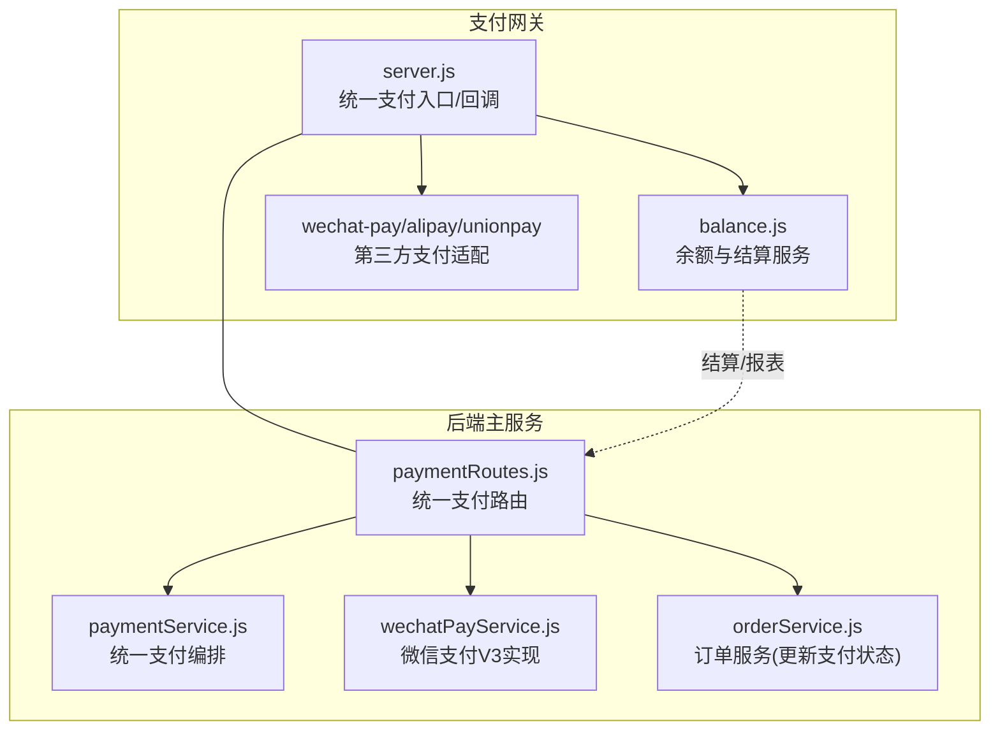
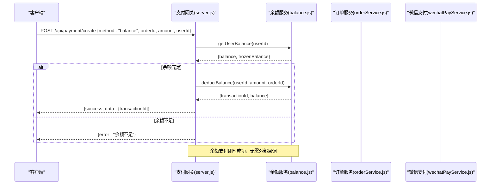
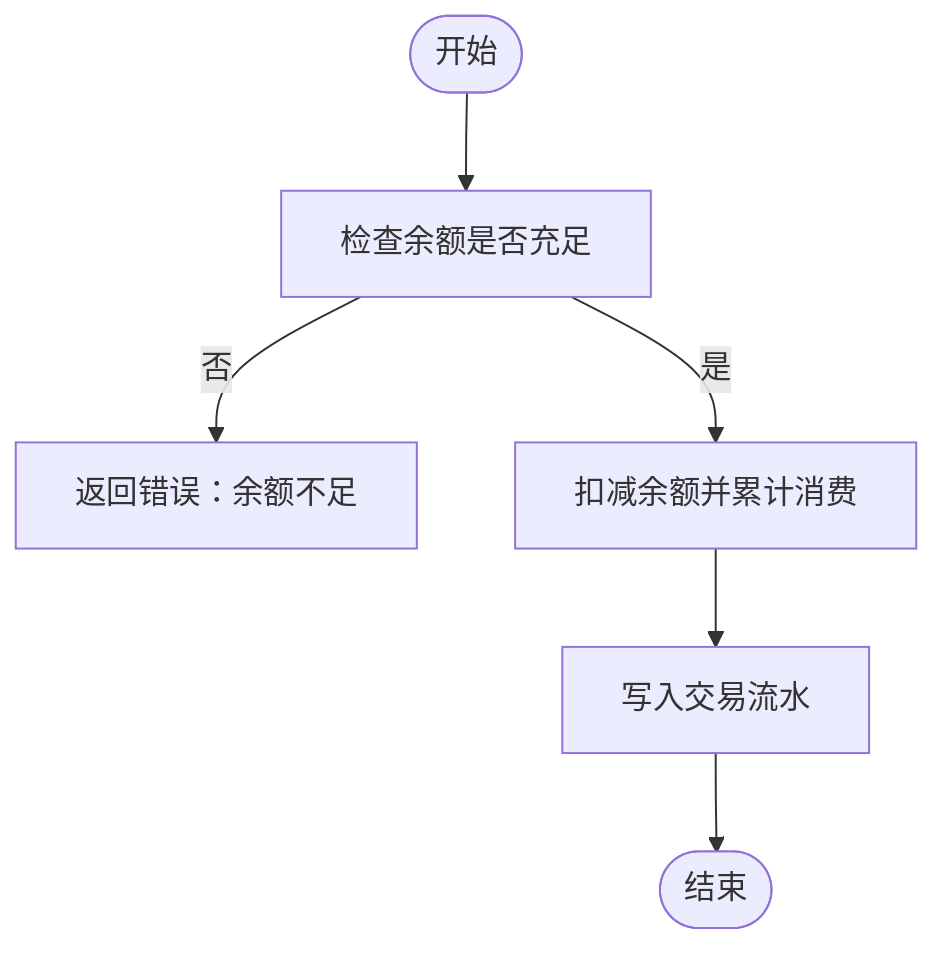
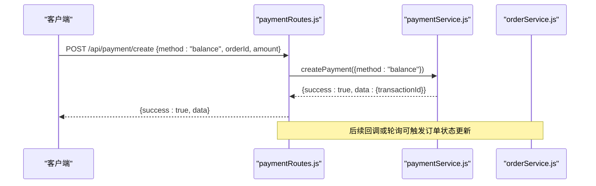
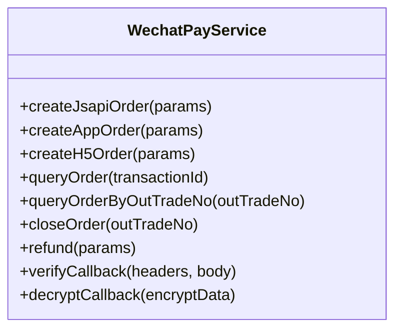
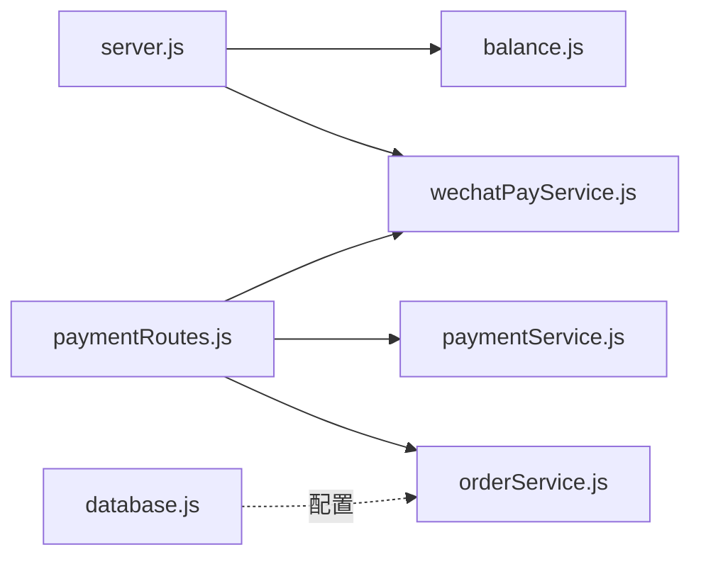

# 余额支付

<cite>
**本文引用的文件**   
- [api/payment-server/server.js](file://api/payment-server/server.js)
- [api/payment-server/balance.js](file://api/payment-server/balance.js)
- [backend/modules/common/routes/paymentRoutes.js](file://backend/modules/common/routes/paymentRoutes.js)
- [backend/modules/common/services/paymentService.js](file://backend/modules/common/services/paymentService.js)
- [backend/modules/common/services/wechatPayService.js](file://backend/modules/common/services/wechatPayService.js)
- [backend/modules/cleaning/services/orderService.js](file://backend/modules/cleaning/services/orderService.js)
- [backend/migrations/001_migrate_to_polymorphic.sql](file://backend/migrations/001_migrate_to_polymorphic.sql)
- [backend/config/database.js](file://backend/config/database.js)
- [api/payment-api.js](file://api/payment-api.js)
- [api/payment-server/test-payment.js](file://api/payment-server/test-payment.js)
</cite>

## 目录
1. [引言](#引言)
2. [项目结构](#项目结构)
3. [核心组件](#核心组件)
4. [架构总览](#架构总览)
5. [详细组件分析](#详细组件分析)
6. [依赖关系分析](#依赖关系分析)
7. [性能与并发控制](#性能与并发控制)
8. [故障排查指南](#故障排查指南)
9. [结论](#结论)
10. [附录：API 接口文档与数据模型](#附录api-接口文档与数据模型)

## 引言
本技术文档聚焦于“账户余额支付系统”，覆盖以下关键主题：
- 内部转账逻辑与事务处理机制（在内存服务中模拟，生产需落库并加锁）
- 用户余额的查询、充值、扣款与冻结解冻操作
- 余额支付与订单系统的集成方式（含状态同步与回滚）
- 余额流水记录、对账报表生成与财务审计能力
- 余额不足处理、重复支付防护与并发控制策略
- 余额管理 API 接口文档、数据模型设计与业务规则
- 测试用例与监控告警配置建议

## 项目结构
围绕余额支付的核心代码分布在两个子系统：
- 支付网关服务器（独立进程）：提供统一支付入口、余额与结算接口、第三方回调处理
- 后端主服务（Express + MongoDB/MySQL）：统一支付路由、微信支付实现、订单服务集成

图表来源
- [api/payment-server/server.js:42-174](file://api/payment-server/server.js#L42-L174)
- [api/payment-server/balance.js:8-524](file://api/payment-server/balance.js#L8-L524)
- [backend/modules/common/routes/paymentRoutes.js:13-97](file://backend/modules/common/routes/paymentRoutes.js#L13-L97)
- [backend/modules/common/services/paymentService.js:24-91](file://backend/modules/common/services/paymentService.js#L24-L91)
- [backend/modules/common/services/wechatPayService.js:101-164](file://backend/modules/common/services/wechatPayService.js#L101-L164)
- [backend/modules/cleaning/services/orderService.js:109-151](file://backend/modules/cleaning/services/orderService.js#L109-L151)

章节来源
- [api/payment-server/server.js:1-624](file://api/payment-server/server.js#L1-L624)
- [backend/modules/common/routes/paymentRoutes.js:1-215](file://backend/modules/common/routes/paymentRoutes.js#L1-L215)

## 核心组件
- 余额与结算服务（BalanceService）
  - 职责：用户余额读写、交易流水、门店待结算与提现、财务报表
  - 关键点：当前为内存存储；提供 addBalance/deductBalance/getUserTransactions/settleToStore/storeWithdraw/generateReport 等
- 统一支付路由（paymentRoutes）
  - 职责：对外暴露 /api/payment/create、/query、/refund 等；按支付方式分发；回调后更新订单支付状态
- 统一支付服务（PaymentService）
  - 职责：创建支付、分账计算（平台抽佣、门店/品牌/用户分润）、退款/查询占位
- 微信支付服务（WechatPayService）
  - 职责：JSAPI/App/H5 下单、签名验签、回调解密、退款、查询
- 订单服务（OrderService）
  - 职责：订单创建与状态机；支付成功后更新 payment.status 与 transactionId/paidAt

章节来源
- [api/payment-server/balance.js:8-524](file://api/payment-server/balance.js#L8-L524)
- [backend/modules/common/routes/paymentRoutes.js:13-97](file://backend/modules/common/routes/paymentRoutes.js#L13-L97)
- [backend/modules/common/services/paymentService.js:96-173](file://backend/modules/common/services/paymentService.js#L96-L173)
- [backend/modules/common/services/wechatPayService.js:339-375](file://backend/modules/common/services/wechatPayService.js#L339-L375)
- [backend/modules/cleaning/services/orderService.js:109-151](file://backend/modules/cleaning/services/orderService.js#L109-L151)

## 架构总览
支付网关作为统一入口，聚合多支付方式；余额支付走本地余额服务；其他支付通过各自适配器完成下单与回调。回调成功后，网关将订单金额计入门店待结算，随后支持结算与提现。后端主服务的支付路由负责调用统一支付服务与微信实现，并在回调时更新订单状态。

图表来源
- [api/payment-server/server.js:106-144](file://api/payment-server/server.js#L106-L144)
- [api/payment-server/balance.js:91-139](file://api/payment-server/balance.js#L91-L139)

## 详细组件分析

### 余额服务（BalanceService）
- 数据结构
  - 用户余额：balance、frozenBalance、totalRecharge、totalConsume、时间戳
  - 交易流水：id、userId、orderId、type、amount、balanceBefore/After、description、paymentMethod、status、createdAt
  - 门店账户：availableBalance、frozenBalance、pendingSettlement、totalAmount、totalWithdraw、lastSettlementAt
  - 结算记录：orderId、storeId、orderAmount、deliveryFee、platformFee、storeSettlementAmount、status、settledAt
- 关键流程
  - 获取余额：若不存在则初始化默认值
  - 扣款：校验余额充足 -> 扣减 -> 累计消费 -> 写入流水
  - 充值：增加余额 -> 累计充值 -> 写入流水
  - 结算：根据订单金额与服务费比例计算平台费与门店应得 -> 更新 pendingSettlement -> 记录结算单
  - 提现：校验可用余额与最小提现额 -> 冻结 -> 异步完成（模拟）-> 更新状态
  - 报表：按日期分组统计订单数、总金额、平台费、门店金额

图表来源
- [api/payment-server/balance.js:91-139](file://api/payment-server/balance.js#L91-L139)

章节来源
- [api/payment-server/balance.js:57-82](file://api/payment-server/balance.js#L57-L82)
- [api/payment-server/balance.js:91-139](file://api/payment-server/balance.js#L91-L139)
- [api/payment-server/balance.js:147-191](file://api/payment-server/balance.js#L147-L191)
- [api/payment-server/balance.js:244-283](file://api/payment-server/balance.js#L244-L283)
- [api/payment-server/balance.js:290-337](file://api/payment-server/balance.js#L290-L337)
- [api/payment-server/balance.js:345-409](file://api/payment-server/balance.js#L345-L409)
- [api/payment-server/balance.js:459-520](file://api/payment-server/balance.js#L459-L520)

### 统一支付路由（paymentRoutes）
- 创建支付：根据 method 分支到各支付实现；余额支付直接成功
- 查询支付：委托微信服务查询
- 微信回调：验签 -> 解密 -> 更新订单支付状态 -> 发送通知
- 退款：调用微信退款 -> 更新订单退款状态

图表来源
- [backend/modules/common/routes/paymentRoutes.js:13-97](file://backend/modules/common/routes/paymentRoutes.js#L13-L97)
- [backend/modules/common/services/paymentService.js:24-47](file://backend/modules/common/services/paymentService.js#L24-L47)

章节来源
- [backend/modules/common/routes/paymentRoutes.js:120-171](file://backend/modules/common/routes/paymentRoutes.js#L120-L171)
- [backend/modules/common/routes/paymentRoutes.js:174-212](file://backend/modules/common/routes/paymentRoutes.js#L174-L212)

### 微信支付服务（WechatPayService）
- 统一下单：JSAPI/App/H5 三种场景，构造参数、签名、返回前端调起参数
- 回调处理：验签、解密、解析结果
- 退款：提交退款申请
- 查询：按交易号或商户订单号查询

图表来源
- [backend/modules/common/services/wechatPayService.js:101-164](file://backend/modules/common/services/wechatPayService.js#L101-L164)
- [backend/modules/common/services/wechatPayService.js:170-222](file://backend/modules/common/services/wechatPayService.js#L170-L222)
- [backend/modules/common/services/wechatPayService.js:228-270](file://backend/modules/common/services/wechatPayService.js#L228-L270)
- [backend/modules/common/services/wechatPayService.js:275-294](file://backend/modules/common/services/wechatPayService.js#L275-L294)
- [backend/modules/common/services/wechatPayService.js:313-334](file://backend/modules/common/services/wechatPayService.js#L313-L334)
- [backend/modules/common/services/wechatPayService.js:339-375](file://backend/modules/common/services/wechatPayService.js#L339-L375)

章节来源
- [backend/modules/common/services/wechatPayService.js:1-396](file://backend/modules/common/services/wechatPayService.js#L1-L396)

### 订单服务（OrderService）
- 订单支付字段：payment.status、payment.method、payment.transactionId、payment.paidAt
- 支付成功后由回调或轮询更新状态

章节来源
- [backend/modules/cleaning/services/orderService.js:109-151](file://backend/modules/cleaning/services/orderService.js#L109-L151)

## 依赖关系分析
- server.js 依赖 balance.js 进行余额与结算处理；同时依赖 wechatPay/alipay/unionpay 适配器
- paymentRoutes.js 依赖 paymentService.js 与 wechatPayService.js，并在回调中调用 orderService.js 更新订单
- database.js 提供 MySQL/MongoDB/Redis 配置，便于扩展持久化与缓存

图表来源
- [api/payment-server/server.js:42-174](file://api/payment-server/server.js#L42-L174)
- [backend/modules/common/routes/paymentRoutes.js:13-97](file://backend/modules/common/routes/paymentRoutes.js#L13-L97)
- [backend/config/database.js:1-65](file://backend/config/database.js#L1-L65)

章节来源
- [api/payment-server/server.js:1-624](file://api/payment-server/server.js#L1-L624)
- [backend/modules/common/routes/paymentRoutes.js:1-215](file://backend/modules/common/routes/paymentRoutes.js#L1-L215)
- [backend/config/database.js:1-65](file://backend/config/database.js#L1-L65)

## 性能与并发控制
- 当前余额服务使用内存 Map/数组，无分布式锁与事务保障，存在并发写冲突风险
- 建议改进
  - 引入数据库行级锁（SELECT ... FOR UPDATE）或 Redis 分布式锁（基于 userId+orderId）
  - 幂等键：以 orderId 作为幂等键，防止重复扣款
  - 原子操作：使用数据库事务保证余额变更与流水写入的一致性
  - 限流与重试：对余额查询/扣款接口做限流，失败重试带退避
  - 指标与告警：QPS、成功率、平均耗时、余额不足率、回调延迟等

[本节为通用指导，不直接分析具体文件]

## 故障排查指南
- 余额不足
  - 现象：创建余额支付返回“余额不足”
  - 定位：查看 balance.js 的余额校验与返回结构
- 重复支付
  - 现象：同一订单多次扣款
  - 定位：检查是否以 orderId 做幂等；建议在余额扣款前插入唯一索引或分布式锁
- 回调未到账
  - 现象：微信回调成功但订单未更新
  - 定位：检查 paymentRoutes 回调验签与解密逻辑，以及 orderService 的状态更新
- 结算异常
  - 现象：门店待结算金额不正确
  - 定位：核对 recordOrderPayment 的分账计算与 storeSettlements 写入

章节来源
- [api/payment-server/balance.js:101-108](file://api/payment-server/balance.js#L101-L108)
- [backend/modules/common/routes/paymentRoutes.js:120-171](file://backend/modules/common/routes/paymentRoutes.js#L120-L171)

## 结论
本系统在开发阶段提供了完整的余额支付闭环：统一入口、余额扣款、交易流水、门店结算与提现、财务报表生成。为保障生产可用性，需补齐持久化、事务、幂等与并发控制，完善监控告警与对账体系。

[本节为总结性内容，不直接分析具体文件]

## 附录：API 接口文档与数据模型

### 余额管理 API（支付网关）
- 获取用户余额
  - GET /api/balance/:userId
- 获取用户交易记录
  - GET /api/balance/:userId/transactions?page=1&limit=20
- 余额充值
  - POST /api/balance/recharge {userId, amount, channel}
- 统一支付入口（含余额）
  - POST /api/payment/create {orderId, amount, subject, paymentMethod, userId, openid, returnUrl, clientIp}
- 查询支付状态
  - GET /api/payment/query/:orderId
- 关闭订单
  - POST /api/payment/close/:orderId
- 门店结算
  - GET /api/settlement/store/:storeId
  - GET /api/settlement/store/:storeId/records?status=&startDate=&endDate=
  - POST /api/settlement/store/:storeId/settle {settlementCycle}
  - POST /api/settlement/store/:storeId/withdraw {amount, bankAccount}
  - POST /api/settlement/report {startDate, endDate, storeId, type}

章节来源
- [api/payment-server/server.js:466-578](file://api/payment-server/server.js#L466-L578)
- [api/payment-server/server.js:42-174](file://api/payment-server/server.js#L42-L174)

### 后端统一支付路由（可选对接）
- 创建支付
  - POST /api/payment/create {orderId, orderType, amount, method, openid}
- 查询支付
  - GET /api/payment/query/:orderId
- 退款
  - POST /api/payment/refund {orderId, transactionId, amount, reason}

章节来源
- [backend/modules/common/routes/paymentRoutes.js:13-97](file://backend/modules/common/routes/paymentRoutes.js#L13-L97)
- [backend/modules/common/routes/paymentRoutes.js:100-118](file://backend/modules/common/routes/paymentRoutes.js#L100-L118)
- [backend/modules/common/routes/paymentRoutes.js:174-212](file://backend/modules/common/routes/paymentRoutes.js#L174-L212)

### 数据模型设计（MySQL 迁移脚本）
- 订单表新增多态字段与 JSON 列（向后兼容）
- 分账记录表 payment_splits
- 信用记录表 credit_records
- 门店表 stores（含 settlement_json）
- 配送单表 delivery_orders
- 消息模板表 message_templates

章节来源
- [backend/migrations/001_migrate_to_polymorphic.sql:195-222](file://backend/migrations/001_migrate_to_polymorphic.sql#L195-L222)
- [backend/migrations/001_migrate_to_polymorphic.sql:224-243](file://backend/migrations/001_migrate_to_polymorphic.sql#L224-L243)
- [backend/migrations/001_migrate_to_polymorphic.sql:245-265](file://backend/migrations/001_migrate_to_polymorphic.sql#L245-L265)
- [backend/migrations/001_migrate_to_polymorphic.sql:267-278](file://backend/migrations/001_migrate_to_polymorphic.sql#L267-L278)

### 业务规则说明
- 余额不足：返回错误码与可用余额、所需金额
- 重复支付防护：以 orderId 为幂等键，建议配合唯一索引/分布式锁
- 结算周期：T+7（可配置），平台服务费按比例抽取
- 提现规则：最低 100 元，手续费千分之六，异步完成（模拟）

章节来源
- [api/payment-server/balance.js:101-108](file://api/payment-server/balance.js#L101-L108)
- [api/payment-server/balance.js:244-283](file://api/payment-server/balance.js#L244-L283)
- [api/payment-server/balance.js:345-409](file://api/payment-server/balance.js#L345-L409)

### 测试用例与运行
- 健康检查、查看测试数据、余额充值、微信支付、余额支付、支付宝、银联、门店结算查询、提现、批量支付
- 运行方式：启动支付网关后执行 test-payment.js

章节来源
- [api/payment-server/test-payment.js:99-120](file://api/payment-server/test-payment.js#L99-L120)
- [api/payment-server/test-payment.js:158-188](file://api/payment-server/test-payment.js#L158-L188)
- [api/payment-server/test-payment.js:241-282](file://api/payment-server/test-payment.js#L241-L282)
- [api/payment-server/test-payment.js:358-381](file://api/payment-server/test-payment.js#L358-L381)
- [api/payment-server/test-payment.js:469-543](file://api/payment-server/test-payment.js#L469-L543)

### 前端余额支付（示例）
- 获取余额、余额支付、充值等接口封装（前端侧）

章节来源
- [api/payment-api.js:134-179](file://api/payment-api.js#L134-L179)
- [api/payment-api.js:348-379](file://api/payment-api.js#L348-L379)
- [api/payment-api.js:388-422](file://api/payment-api.js#L388-L422)