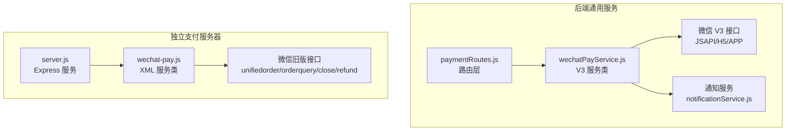
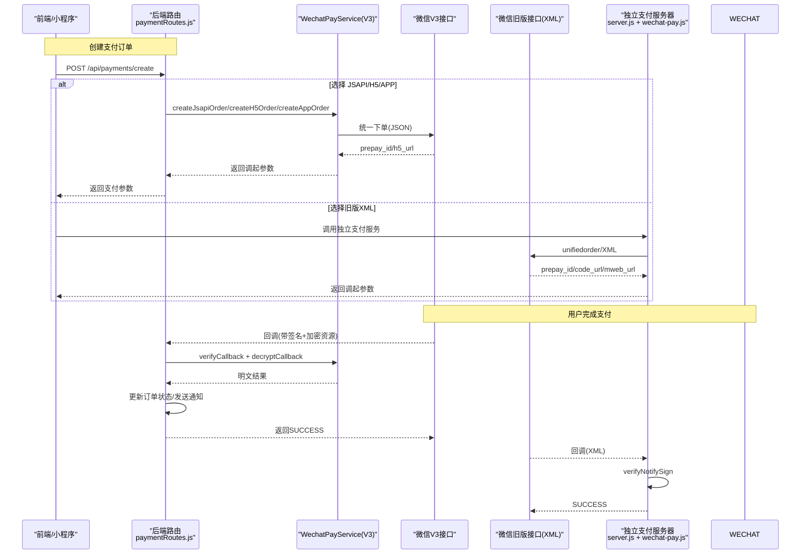
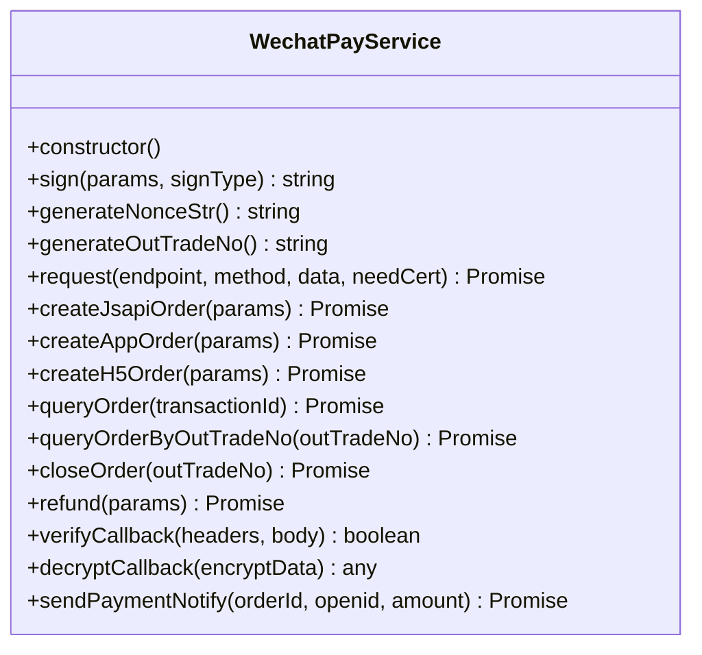
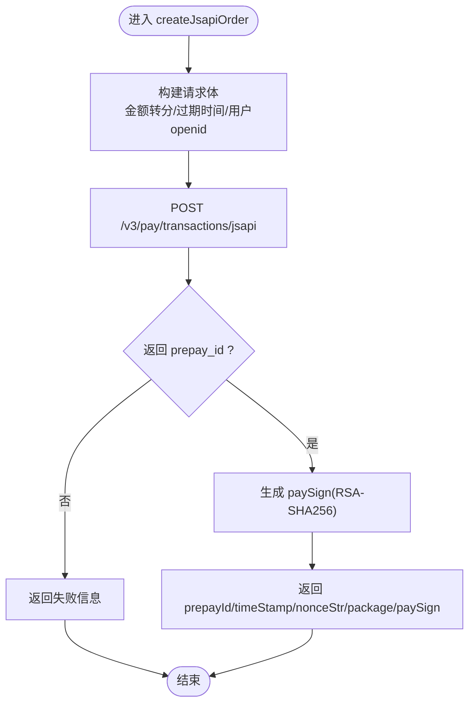
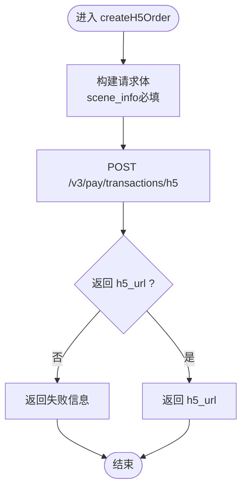
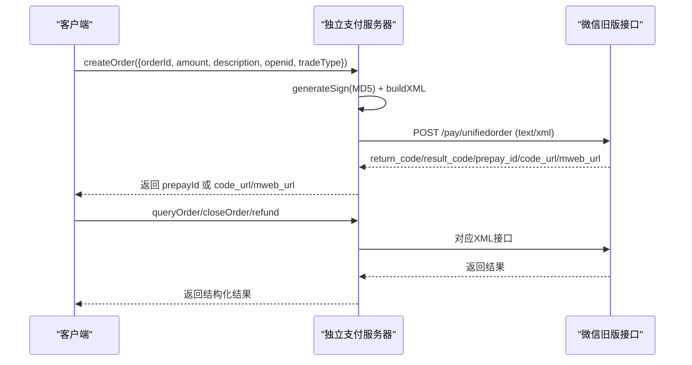
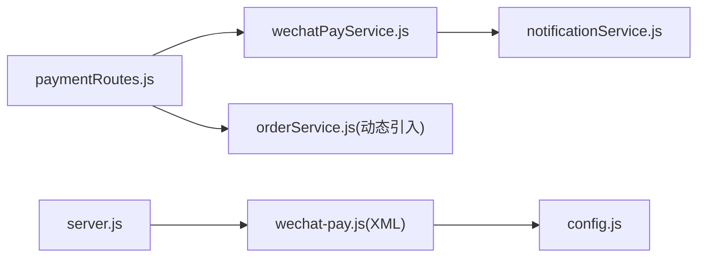

# 微信支付集成

<cite>
**本文引用的文件列表**
- [backend/modules/common/services/wechatPayService.js](file://backend/modules/common/services/wechatPayService.js)
- [backend/modules/common/routes/paymentRoutes.js](file://backend/modules/common/routes/paymentRoutes.js)
- [api/payment-server/wechat-pay.js](file://api/payment-server/wechat-pay.js)
- [api/payment-server/config.js](file://api/payment-server/config.js)
- [api/payment-server/server.js](file://api/payment-server/server.js)
- [backend/modules/common/services/notificationService.js](file://backend/modules/common/services/notificationService.js)
</cite>

## 目录
1. [简介](#简介)
2. [项目结构](#项目结构)
3. [核心组件](#核心组件)
4. [架构总览](#架构总览)
5. [详细组件分析](#详细组件分析)
6. [依赖关系分析](#依赖关系分析)
7. [性能与可靠性](#性能与可靠性)
8. [故障排查指南](#故障排查指南)
9. [结论](#结论)
10. [附录：配置与示例](#附录：配置与示例)

## 简介
本技术文档围绕微信支付集成的实现，重点解析 WechatPayService 类的架构设计与业务流程，覆盖 JSAPI 支付、NATIVE 扫码支付、H5 支付的完整链路；详细说明统一下单参数构建、XML/JSON 格式转换与签名机制（含 MD5 与 V3 RSA-SHA256）；解释小程序调起支付参数生成流程（prepay_id 获取与 paySign 计算）；并给出订单查询、关闭、退款、回调通知验签与解密、错误处理与异常恢复方案。文末提供配置项说明与调试建议，帮助快速落地与排障。

## 项目结构
本项目包含两套微信支付实现：
- 后端通用服务（V3 API）：位于 backend/modules/common/services/wechatPayService.js，面向小程序/公众号/H5/APP 等场景，使用 JSON 请求体与 V3 签名体系。
- 独立支付服务器（兼容旧版 XML）：位于 api/payment-server/wechat-pay.js，基于 XML 的统一下单与回调，适用于历史系统或特定渠道。

图示来源
- [backend/modules/common/routes/paymentRoutes.js:1-215](file://backend/modules/common/routes/paymentRoutes.js#L1-L215)
- [backend/modules/common/services/wechatPayService.js:1-396](file://backend/modules/common/services/wechatPayService.js#L1-L396)
- [api/payment-server/server.js:309-354](file://api/payment-server/server.js#L309-L354)
- [api/payment-server/wechat-pay.js:1-314](file://api/payment-server/wechat-pay.js#L1-L314)

章节来源
- [backend/modules/common/routes/paymentRoutes.js:1-215](file://backend/modules/common/routes/paymentRoutes.js#L1-L215)
- [api/payment-server/config.js:1-80](file://api/payment-server/config.js#L1-L80)

## 核心组件
- WechatPayService（V3）：封装 JSAPI/H5/APP 下单、订单查询/关闭、退款、回调验签与解密、发送支付成功通知等能力。
- paymentRoutes：统一支付入口，按支付方式分发到具体服务，并处理回调与退款。
- 独立支付服务器 wechat-pay.js：基于 XML 的统一下单、查询、关闭、退款与回调验签，以及小程序调起参数生成。
- notificationService：支付成功后触发订阅消息/短信/推送等多渠道通知。

章节来源
- [backend/modules/common/services/wechatPayService.js:1-396](file://backend/modules/common/services/wechatPayService.js#L1-L396)
- [backend/modules/common/routes/paymentRoutes.js:1-215](file://backend/modules/common/routes/paymentRoutes.js#L1-L215)
- [api/payment-server/wechat-pay.js:1-314](file://api/payment-server/wechat-pay.js#L1-L314)
- [backend/modules/common/services/notificationService.js:1-281](file://backend/modules/common/services/notificationService.js#L1-L281)

## 架构总览
下图展示从前端发起支付到微信侧回调的端到端流程，涵盖 V3 与 XML 两条路径。

图示来源
- [backend/modules/common/routes/paymentRoutes.js:120-171](file://backend/modules/common/routes/paymentRoutes.js#L120-L171)
- [backend/modules/common/services/wechatPayService.js:97-164](file://backend/modules/common/services/wechatPayService.js#L97-L164)
- [api/payment-server/server.js:309-354](file://api/payment-server/server.js#L309-L354)
- [api/payment-server/wechat-pay.js:56-127](file://api/payment-server/wechat-pay.js#L56-L127)

## 详细组件分析

### WechatPayService（V3）架构与实现
- 职责边界
  - 统一下单：JSAPI（小程序/公众号）、H5、APP
  - 订单管理：查询（交易号/商户单号）、关闭
  - 资金操作：申请退款（需证书）
  - 安全：回调签名验证、资源解密
  - 业务联动：支付成功通知
- 关键设计点
  - 金额单位：元转分（total_fee = Math.round(amount * 100)）
  - 签名算法：V3 使用 RSA-SHA256 私钥签名；回调验签使用 HMAC-SHA256
  - 证书：退款等敏感接口需要双向证书（代码中预留证书读取逻辑）
  - 超时控制：下单时设置 time_expire（默认30分钟）

图示来源
- [backend/modules/common/services/wechatPayService.js:21-396](file://backend/modules/common/services/wechatPayService.js#L21-L396)

#### JSAPI 支付（小程序/公众号）
- 流程要点
  - 构造 JSON 请求体：appid、mchid、description、out_trade_no、time_expire、amount.total、payer.openid、notify_url
  - 调用 v3/pay/transactions/jsapi
  - 返回 prepay_id 后，服务端用私钥对 appId、timeStamp、nonceStr、package 进行 RSA-SHA256 签名，得到 paySign
  - 将 prepayId、timeStamp、nonceStr、package、paySign 返回给前端用于调起支付
- 复杂度与风险
  - 时间戳与随机串一致性要求严格
  - 私钥保管与权限隔离至关重要

图示来源
- [backend/modules/common/services/wechatPayService.js:97-164](file://backend/modules/common/services/wechatPayService.js#L97-L164)

章节来源
- [backend/modules/common/services/wechatPayService.js:97-164](file://backend/modules/common/services/wechatPayService.js#L97-L164)

#### H5 支付
- 流程要点
  - 构造 JSON 请求体，包含 scene_info（设备类型、客户端IP、场景类型 MWeb）
  - 调用 v3/pay/transactions/h5
  - 返回 h5_url，前端直接跳转至该链接完成支付
- 注意
  - 需在微信商户平台配置 H5 域名白名单

图示来源
- [backend/modules/common/services/wechatPayService.js:224-270](file://backend/modules/common/services/wechatPayService.js#L224-L270)

章节来源
- [backend/modules/common/services/wechatPayService.js:224-270](file://backend/modules/common/services/wechatPayService.js#L224-L270)

#### APP 支付
- 流程要点
  - 构造 JSON 请求体，调用 v3/pay/transactions/app
  - 返回 prepay_id 后，服务端生成 paySign 并返回给 APP 调起支付
- 注意
  - APP 端需遵循微信开放平台 APP 接入规范

章节来源
- [backend/modules/common/services/wechatPayService.js:166-222](file://backend/modules/common/services/wechatPayService.js#L166-L222)

#### 订单查询、关闭与退款
- 查询
  - 支持按交易号或商户订单号查询
- 关闭
  - 针对未支付订单，调用关闭接口
- 退款
  - 需要证书（代码中预留证书读取），提交退款金额、原因等

章节来源
- [backend/modules/common/services/wechatPayService.js:272-334](file://backend/modules/common/services/wechatPayService.js#L272-L334)

#### 回调通知验签与解密
- 验签
  - 从请求头提取 wechatpay-signature、wechatpay-timestamp、wechatpay-nonce
  - 拼接 timestamp\nnonce\nbody\n，使用 HMAC-SHA256 与 APIKey 计算签名并比对
- 解密
  - 使用 APIKey 作为密钥，AES-GCM 解密 resource.ciphertext，得到明文通知
- 幂等与重试
  - 回调可能重复到达，需根据 out_trade_no 做幂等处理（建议在业务层增加去重表或状态机）

章节来源
- [backend/modules/common/services/wechatPayService.js:336-375](file://backend/modules/common/services/wechatPayService.js#L336-L375)
- [backend/modules/common/routes/paymentRoutes.js:120-171](file://backend/modules/common/routes/paymentRoutes.js#L120-L171)

#### 支付成功通知
- 通过 notificationService 发送多渠道通知（微信订阅消息、短信、推送等）
- 当前为占位实现，可按需对接第三方服务

章节来源
- [backend/modules/common/services/wechatPayService.js:377-392](file://backend/modules/common/services/wechatPayService.js#L377-L392)
- [backend/modules/common/services/notificationService.js:1-281](file://backend/modules/common/services/notificationService.js#L1-L281)

### 独立支付服务器（XML 版本）
- 适用场景
  - 兼容旧版 XML 接口，如 unifiedorder/orderquery/close/refund
- 关键能力
  - 统一下单：构建 XML，MD5 签名，post 到微信旧版接口
  - 查询/关闭/退款：同样基于 XML 与 MD5 签名
  - 回调验签：去除 sign 字段后排序拼接，MD5 校验
  - 小程序调起参数：generateAppPayParams 生成 timeStamp、nonceStr、package、paySign（MD5）

图示来源
- [api/payment-server/wechat-pay.js:56-127](file://api/payment-server/wechat-pay.js#L56-L127)
- [api/payment-server/wechat-pay.js:132-184](file://api/payment-server/wechat-pay.js#L132-L184)
- [api/payment-server/wechat-pay.js:189-225](file://api/payment-server/wechat-pay.js#L189-L225)
- [api/payment-server/wechat-pay.js:230-280](file://api/payment-server/wechat-pay.js#L230-L280)

章节来源
- [api/payment-server/wechat-pay.js:1-314](file://api/payment-server/wechat-pay.js#L1-L314)
- [api/payment-server/server.js:309-354](file://api/payment-server/server.js#L309-L354)

### 路由与控制器（paymentRoutes）
- 统一入口
  - POST /api/payments/create：根据 method 分发到 wechat_jsapi/wechat_app/wechat_h5/balance
  - GET /api/payments/query/:orderId：查询支付状态
  - POST /api/payments/wechat/callback：接收微信 V3 回调，验签、解密、落库、通知
  - POST /api/payments/refund：申请退款
- 错误处理
  - 捕获异常并返回统一错误码与消息
  - 对外响应保持幂等与可重试

章节来源
- [backend/modules/common/routes/paymentRoutes.js:1-215](file://backend/modules/common/routes/paymentRoutes.js#L1-L215)

## 依赖关系分析
- 模块耦合
  - paymentRoutes 依赖 wechatPayService 与 orderService（动态引入）
  - wechatPayService 依赖 crypto、https、fs、path 及 notificationService
  - 独立支付服务器依赖 axios、xml2js、config
- 外部依赖
  - 微信 V3 接口（HTTPS）
  - 微信旧版接口（HTTPS，XML）
  - 可选：证书文件（退款等）

图示来源
- [backend/modules/common/routes/paymentRoutes.js:1-215](file://backend/modules/common/routes/paymentRoutes.js#L1-L215)
- [backend/modules/common/services/wechatPayService.js:1-396](file://backend/modules/common/services/wechatPayService.js#L1-L396)
- [api/payment-server/server.js:309-354](file://api/payment-server/server.js#L309-L354)
- [api/payment-server/wechat-pay.js:1-314](file://api/payment-server/wechat-pay.js#L1-L314)
- [api/payment-server/config.js:1-80](file://api/payment-server/config.js#L1-L80)

章节来源
- [backend/modules/common/routes/paymentRoutes.js:1-215](file://backend/modules/common/routes/paymentRoutes.js#L1-L215)
- [api/payment-server/config.js:1-80](file://api/payment-server/config.js#L1-L80)

## 性能与可靠性
- 网络与并发
  - 使用原生 https 或 axios 发起 HTTPS 请求，建议在生产环境启用连接池与超时控制
- 幂等性
  - 回调可能重复，务必在业务层基于 out_trade_no 做幂等处理（例如记录已处理订单号集合或数据库唯一约束）
- 重试策略
  - 对网络抖动导致的临时失败，采用指数退避重试；对业务错误（如参数非法）立即失败
- 证书与密钥
  - 私钥与 APIKey 必须通过环境变量注入，禁止硬编码；证书文件权限最小化
- 日志与监控
  - 关键节点输出结构化日志（订单号、状态、耗时），便于追踪与告警

[本节为通用指导，不直接分析具体文件]

## 故障排查指南
- 统一下单失败
  - 检查 appid/mchid/apiKey/serialNo/privateKey 配置是否正确
  - 确认 notify_url 公网可达且端口正确
  - 核对金额单位为分、时间戳与随机串格式
- 回调验签失败
  - 确认请求头 wechatpay-signature/timestamp/nonce 齐全
  - 确保 body 原始字符串参与验签（不要二次序列化）
  - 检查 APIKey 是否与商户平台一致
- 解密失败
  - 确认 AES-GCM 初始化向量与密钥长度符合 V3 规范
  - 检查 ciphertext 是否为 hex 编码
- 退款失败
  - 确认证书路径与权限正确
  - 检查 transaction_id/out_refund_no 是否合法
- 常见错误码定位
  - 参考各方法 catch 分支返回的错误信息与日志

章节来源
- [backend/modules/common/services/wechatPayService.js:158-163](file://backend/modules/common/services/wechatPayService.js#L158-L163)
- [backend/modules/common/services/wechatPayService.js:216-221](file://backend/modules/common/services/wechatPayService.js#L216-L221)
- [backend/modules/common/services/wechatPayService.js:264-269](file://backend/modules/common/services/wechatPayService.js#L264-L269)
- [backend/modules/common/services/wechatPayService.js:329-333](file://backend/modules/common/services/wechatPayService.js#L329-L333)
- [backend/modules/common/services/wechatPayService.js:370-374](file://backend/modules/common/services/wechatPayService.js#L370-L374)

## 结论
本项目提供了两套微信支付实现：V3 JSON 版本适合新业务与小程序/公众号/H5/APP 多端；XML 版本兼容历史系统与部分渠道。WechatPayService 以清晰的方法划分与统一的错误处理，配合 paymentRoutes 的统一入口，形成可扩展的支付基础设施。生产部署需重点关注密钥与证书管理、回调幂等、超时与重试策略，以及完善的日志与监控。

[本节为总结，不直接分析具体文件]

## 附录：配置与示例

### 配置参数说明（V3）
- 环境变量
  - WX_APP_ID：应用 ID
  - WX_MCH_ID：商户号
  - WX_API_KEY：API 密钥（用于回调验签）
  - WX_SERIAL_NO：证书序列号（若使用证书验签）
  - WX_PRIVATE_KEY：商户私钥（用于生成 paySign）
  - WX_CALLBACK_URL：回调地址（公网可达）
- 其他
  - certPath：证书路径（退款等敏感接口需要）

章节来源
- [backend/modules/common/services/wechatPayService.js:11-19](file://backend/modules/common/services/wechatPayService.js#L11-L19)

### 配置参数说明（XML 版本）
- 环境变量
  - WECHAT_MINIAPP_APPID/SECRET/MCH_ID/API_KEY/NOTIFY_URL
  - WECHAT_H5_APPID/SECRET/MCH_ID/API_KEY/NOTIFY_URL
  - WECHAT_API_URL：微信 API 基础地址
- 说明
  - miniapp 与 h5 分别维护不同 appId/notifyUrl，便于区分渠道

章节来源
- [api/payment-server/config.js:12-33](file://api/payment-server/config.js#L12-L33)

### 小程序调起支付参数生成（XML 版本）
- 步骤
  - 先调用统一下单获取 prepay_id
  - 调用 generateAppPayParams(prepay_id) 生成 timeStamp、nonceStr、package、paySign（MD5）
  - 前端使用这些参数调起 wx.requestPayment

章节来源
- [api/payment-server/wechat-pay.js:295-310](file://api/payment-server/wechat-pay.js#L295-L310)

### 回调通知处理（V3）
- 步骤
  - 读取请求头 with signature/timestamp/nonce
  - verifyCallback 验签
  - decryptCallback 解密 resource.ciphertext
  - 根据 out_trade_no 更新订单状态并发送通知
  - 返回 SUCCESS

章节来源
- [backend/modules/common/routes/paymentRoutes.js:120-171](file://backend/modules/common/routes/paymentRoutes.js#L120-L171)
- [backend/modules/common/services/wechatPayService.js:336-375](file://backend/modules/common/services/wechatPayService.js#L336-L375)

### 回调通知处理（XML 版本）
- 步骤
  - 解析 XML 请求体
  - verifyNotifySign 验签
  - 更新本地订单状态并返回 SUCCESS

章节来源
- [api/payment-server/server.js:309-354](file://api/payment-server/server.js#L309-L354)
- [api/payment-server/wechat-pay.js:285-290](file://api/payment-server/wechat-pay.js#L285-L290)

### 调试清单
- 前置检查
  - 确认域名/IP 在白名单（H5/JSAPI）
  - 确认回调地址公网可达且无反向代理篡改请求体
- 抓包与日志
  - 抓取微信请求与响应报文，核对签名与字段
  - 打印统一下单请求体与返回体，关注 err_code/err_code_des
- 单元测试
  - 对 sign/verifyCallback/decryptCallback 编写用例，覆盖边界值与异常路径

[本节为通用指导，不直接分析具体文件]