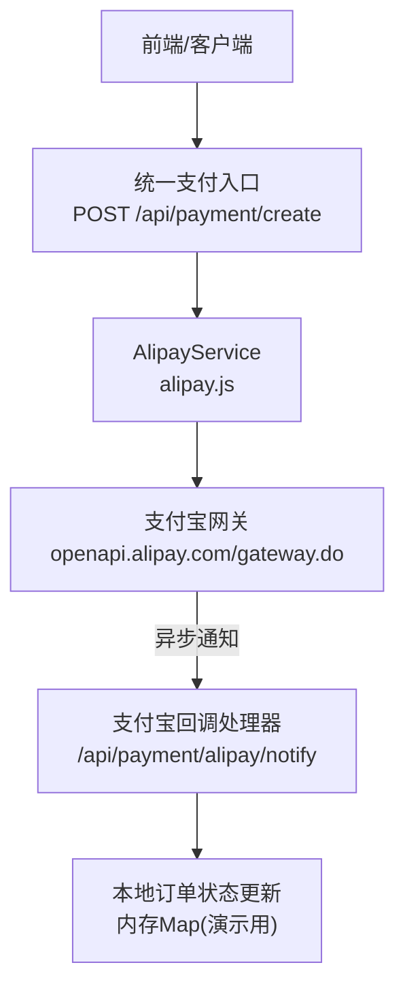
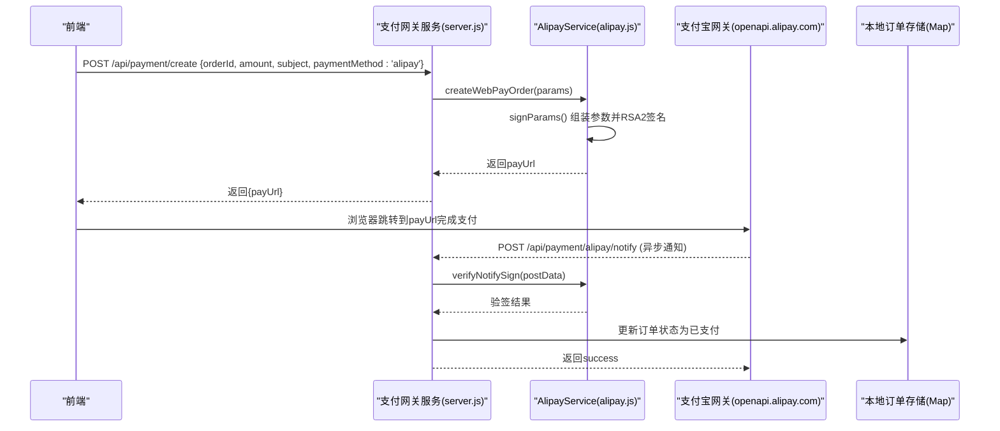
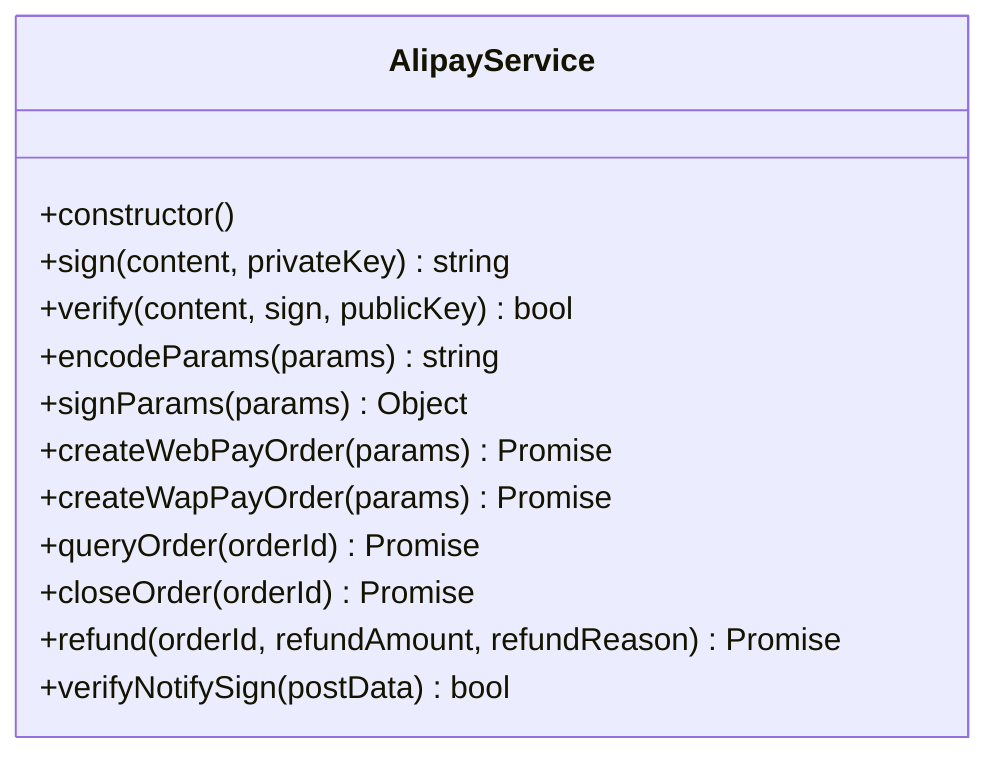
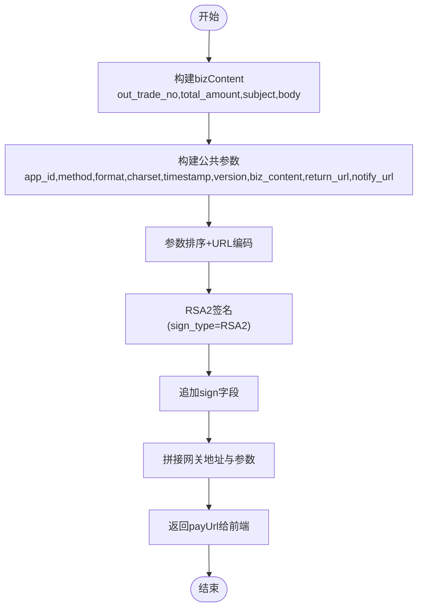
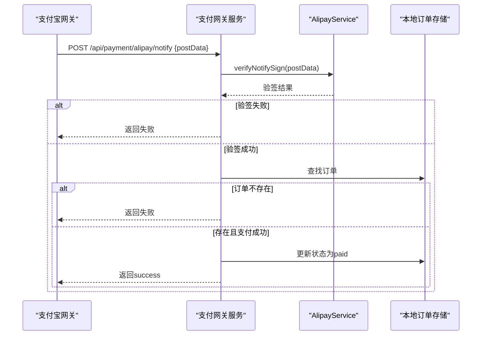
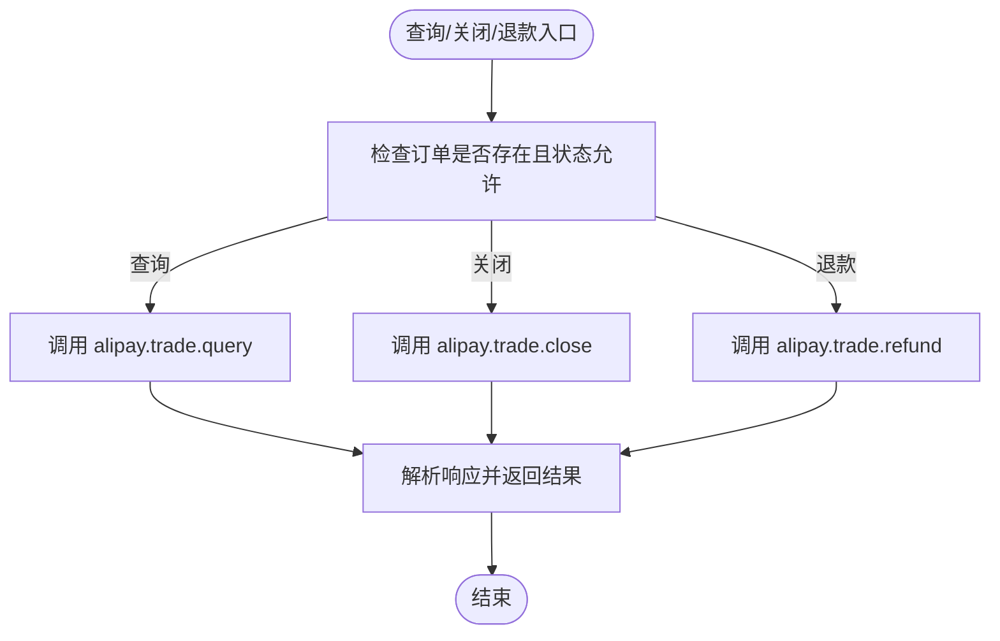
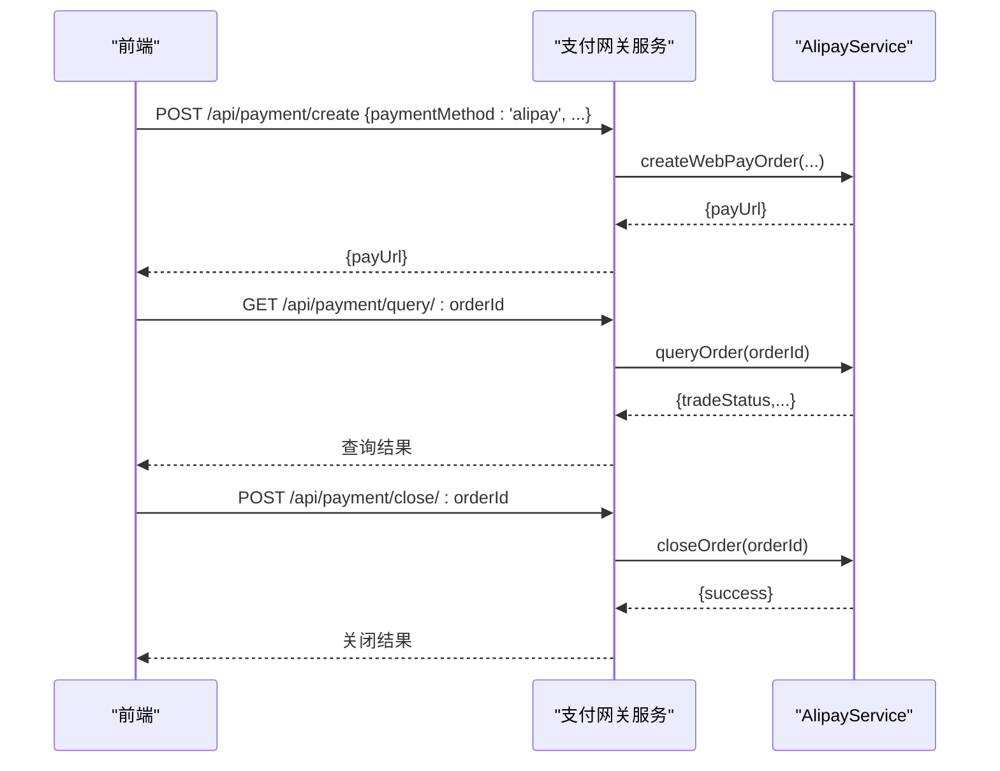
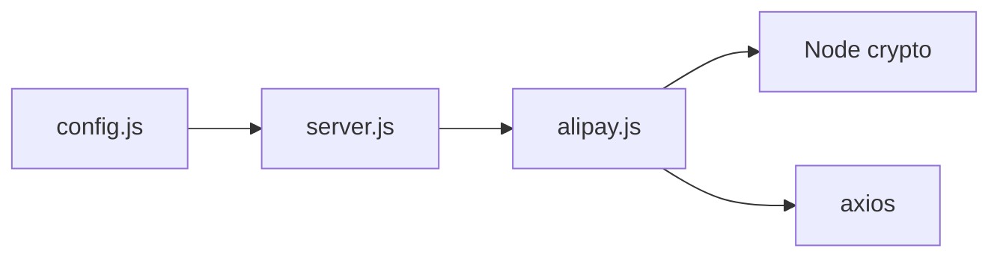

# 支付宝集成

<cite>
**本文引用的文件**   
- [alipay.js](file://api/payment-server/alipay.js)
- [config.js](file://api/payment-server/config.js)
- [server.js](file://api/payment-server/server.js)
- [QUICK_START.md](file://api/payment-server/QUICK_START.md)
- [test-config.js](file://api/payment-server/test-config.js)
- [PAYMENT_SYSTEM.md](file://PAYMENT_SYSTEM.md)
</cite>

## 目录
1. [简介](#简介)
2. [项目结构](#项目结构)
3. [核心组件](#核心组件)
4. [架构总览](#架构总览)
5. [详细组件分析](#详细组件分析)
6. [依赖关系分析](#依赖关系分析)
7. [性能与安全建议](#性能与安全建议)
8. [故障排查与错误码](#故障排查与错误码)
9. [结论](#结论)
10. [附录：配置与环境](#附录配置与环境)

## 简介
本技术文档聚焦于本项目中支付宝网页支付（电脑网站支付）的集成实现，覆盖以下主题：
- 支付宝SDK初始化与参数配置
- RSA签名算法与验签流程
- 网页支付页面生成逻辑与跳转
- 支付结果异步通知处理与订单状态同步
- 退款、交易查询与订单关闭接口调用
- 沙箱环境与生产环境差异
- 集成示例路径、错误码对照与排障指南
- 安全最佳实践与性能优化建议

## 项目结构
与支付宝集成相关的核心代码位于支付网关服务中，主要包含：
- 支付宝服务封装类：负责签名、请求构造、回调验签及业务接口调用
- 统一支付路由与服务入口：聚合多种支付方式并对外暴露统一API
- 配置文件：集中管理各支付渠道的配置项（含环境变量注入）
- 测试配置：提供无需真实密钥的模拟模式

图表来源
- [server.js:42-174](file://api/payment-server/server.js#L42-L174)
- [alipay.js:68-103](file://api/payment-server/alipay.js#L68-L103)
- [server.js:366-402](file://api/payment-server/server.js#L366-L402)

章节来源
- [server.js:1-120](file://api/payment-server/server.js#L1-L120)
- [config.js:35-47](file://api/payment-server/config.js#L35-L47)

## 核心组件
- AlipayService：封装支付宝网页支付、手机网站支付、交易查询、订单关闭、退款、回调验签等能力。使用RSA-SHA256进行签名与验签，按支付宝规范拼接参数并发起HTTP请求。
- 统一支付路由：对外提供统一的创建支付、查询、关闭等接口，内部根据支付方式分发到对应服务实现。
- 配置中心：通过环境变量注入支付宝AppID、私钥、公钥、网关地址与回调地址等关键信息。

章节来源
- [alipay.js:9-62](file://api/payment-server/alipay.js#L9-L62)
- [server.js:85-94](file://api/payment-server/server.js#L85-L94)
- [config.js:35-47](file://api/payment-server/config.js#L35-L47)

## 架构总览
下图展示了从前端发起支付到支付宝网关、再到异步通知与本地状态更新的完整链路。

图表来源
- [server.js:42-94](file://api/payment-server/server.js#L42-L94)
- [alipay.js:68-103](file://api/payment-server/alipay.js#L68-L103)
- [server.js:366-402](file://api/payment-server/server.js#L366-L402)

## 详细组件分析

### AlipayService 类设计
该类实现了支付宝网页支付的核心能力，包括：
- RSA2签名与验签
- 参数URL编码与排序
- 网页支付与手机网站支付下单
- 交易查询、订单关闭、退款
- 回调验签

图表来源
- [alipay.js:9-62](file://api/payment-server/alipay.js#L9-L62)
- [alipay.js:68-103](file://api/payment-server/alipay.js#L68-L103)
- [alipay.js:109-142](file://api/payment-server/alipay.js#L109-L142)
- [alipay.js:147-199](file://api/payment-server/alipay.js#L147-L199)
- [alipay.js:204-244](file://api/payment-server/alipay.js#L204-L244)
- [alipay.js:249-298](file://api/payment-server/alipay.js#L249-L298)
- [alipay.js:303-307](file://api/payment-server/alipay.js#L303-L307)

章节来源
- [alipay.js:1-336](file://api/payment-server/alipay.js#L1-L336)

### 网页支付下单流程
- 输入参数：订单号、金额、标题、可选描述、可选returnUrl
- 业务内容bizContent：out_trade_no、product_code=FAST_INSTANT_TRADE_PAY、total_amount、subject、body
- 公共参数：app_id、method=alipay.trade.page.pay、format、charset、timestamp、version、biz_content、return_url、notify_url
- 签名：对排序后的参数串进行RSA2签名，附加sign_type=RSA2
- 输出：拼接网关地址与参数得到payUrl，前端跳转至该链接完成支付

图表来源
- [alipay.js:68-103](file://api/payment-server/alipay.js#L68-L103)

章节来源
- [alipay.js:68-103](file://api/payment-server/alipay.js#L68-L103)

### 支付结果异步通知处理
- 回调入口：POST /api/payment/alipay/notify
- 验签：去除sign后对剩余参数排序编码，使用支付宝公钥验证签名
- 幂等与状态更新：校验订单是否存在；若trade_status为TRADE_SUCCESS或TRADE_FINISHED，则更新本地订单状态为已支付，并记录交易流水
- 响应：返回success以确认接收

图表来源
- [server.js:366-402](file://api/payment-server/server.js#L366-L402)
- [alipay.js:303-307](file://api/payment-server/alipay.js#L303-L307)

章节来源
- [server.js:366-402](file://api/payment-server/server.js#L366-L402)

### 交易查询、订单关闭与退款
- 交易查询：调用alipay.trade.query，返回交易状态、交易号、实付金额等
- 订单关闭：调用alipay.trade.close，用于未支付订单在超时或取消时关闭
- 退款：调用alipay.trade.refund，支持部分或全额退款，返回退款流水信息

图表来源
- [alipay.js:147-199](file://api/payment-server/alipay.js#L147-L199)
- [alipay.js:204-244](file://api/payment-server/alipay.js#L204-L244)
- [alipay.js:249-298](file://api/payment-server/alipay.js#L249-L298)

章节来源
- [alipay.js:147-199](file://api/payment-server/alipay.js#L147-L199)
- [alipay.js:204-244](file://api/payment-server/alipay.js#L204-L244)
- [alipay.js:249-298](file://api/payment-server/alipay.js#L249-L298)

### 统一支付路由与状态同步
- 统一入口：POST /api/payment/create，根据paymentMethod分发到具体服务
- 支付宝分支：调用AlipayService.createWebPayOrder，返回payUrl
- 查询接口：GET /api/payment/query/:orderId，内部调用AlipayService.queryOrder
- 关闭接口：POST /api/payment/close/:orderId，内部调用AlipayService.closeOrder

图表来源
- [server.js:42-94](file://api/payment-server/server.js#L42-L94)
- [server.js:180-240](file://api/payment-server/server.js#L180-L240)
- [server.js:246-304](file://api/payment-server/server.js#L246-L304)
- [alipay.js:68-103](file://api/payment-server/alipay.js#L68-L103)
- [alipay.js:147-199](file://api/payment-server/alipay.js#L147-L199)
- [alipay.js:204-244](file://api/payment-server/alipay.js#L204-L244)

章节来源
- [server.js:42-94](file://api/payment-server/server.js#L42-L94)
- [server.js:180-240](file://api/payment-server/server.js#L180-L240)
- [server.js:246-304](file://api/payment-server/server.js#L246-L304)

## 依赖关系分析
- server.js依赖alipay.js提供的服务方法，并通过config.js读取支付宝相关配置
- alipay.js依赖Node内置crypto模块进行RSA2签名与验签，使用axios发起HTTP请求
- config.js通过环境变量注入支付宝AppID、私钥、公钥、网关与回调地址

图表来源
- [config.js:35-47](file://api/payment-server/config.js#L35-L47)
- [server.js:1-20](file://api/payment-server/server.js#L1-L20)
- [alipay.js:1-13](file://api/payment-server/alipay.js#L1-L13)

章节来源
- [config.js:35-47](file://api/payment-server/config.js#L35-L47)
- [server.js:1-20](file://api/payment-server/server.js#L1-L20)
- [alipay.js:1-13](file://api/payment-server/alipay.js#L1-L13)

## 性能与安全建议
- 性能
  - 减少不必要的重复查询：优先依赖异步通知更新状态，必要时再轮询查询
  - 合理设置超时与重试：对支付宝网关请求设置合理的超时时间，避免阻塞主线程
  - 连接复用：保持axios实例的连接池配置，提升并发处理能力
- 安全
  - 严格验签：所有回调必须使用支付宝公钥验签，禁止仅依赖前端返回的状态
  - 幂等处理：同一订单可能收到多次通知，需基于订单号去重
  - 最小权限：仅开放必要的回调与查询接口，限制IP白名单
  - HTTPS强制：生产环境必须启用HTTPS，确保回调与查询通道安全
  - 密钥管理：私钥与公钥通过环境变量注入，避免硬编码与日志泄露

[本节为通用建议，不直接分析具体文件]

## 故障排查与错误码
- 常见问题
  - 回调验签失败：检查是否使用正确的支付宝公钥、参数排序与编码是否正确
  - 订单不存在：确认notify_url中的订单号与本地订单一致
  - 支付成功但状态未更新：检查回调处理逻辑与数据库写入是否成功
- 常见错误码参考
  - 10000：接口调用成功（查询、关闭、退款均使用该码表示成功）
  - 其他非10000：根据sub_msg/msg获取具体错误信息

章节来源
- [alipay.js:170-192](file://api/payment-server/alipay.js#L170-L192)
- [alipay.js:228-237](file://api/payment-server/alipay.js#L228-L237)
- [alipay.js:275-291](file://api/payment-server/alipay.js#L275-L291)

## 结论
本项目通过AlipayService封装了支付宝网页支付的关键能力，结合统一支付路由提供了清晰的集成点。配合严格的验签与幂等处理，能够保障支付流程的安全与稳定。在生产部署中，应重点关注HTTPS、回调可达性与密钥安全管理。

[本节为总结性内容，不直接分析具体文件]

## 附录：配置与环境

### 支付宝配置项
- appId：应用ID
- privateKey：RSA2私钥（用于签名）
- alipayPublicKey：支付宝公钥（用于验签）
- gateway：网关地址（默认https://openapi.alipay.com/gateway.do）
- notifyUrl：异步通知地址

章节来源
- [config.js:35-47](file://api/payment-server/config.js#L35-L47)

### 沙箱与生产差异
- 沙箱环境
  - 可使用测试配置，无需真实密钥，便于联调
  - 网关地址仍指向正式网关，但使用测试账号与证书
- 生产环境
  - 必须使用真实商户配置与证书
  - 回调地址需公网可访问且启用HTTPS
  - 建议在Nginx层做反向代理与SSL终止

章节来源
- [test-config.js:35-44](file://api/payment-server/test-config.js#L35-L44)
- [QUICK_START.md:276-311](file://api/payment-server/QUICK_START.md#L276-L311)
- [PAYMENT_SYSTEM.md:286-329](file://PAYMENT_SYSTEM.md#L286-L329)

### 集成示例路径
- 统一支付入口（支付宝）：POST /api/payment/create，paymentMethod='alipay'
- 支付宝回调：POST /api/payment/alipay/notify
- 支付宝返回页：GET /payment/alipay/return
- 交易查询：GET /api/payment/query/:orderId
- 订单关闭：POST /api/payment/close/:orderId
- 退款：调用AlipayService.refund(orderId, refundAmount, refundReason)

章节来源
- [server.js:85-94](file://api/payment-server/server.js#L85-L94)
- [server.js:366-402](file://api/payment-server/server.js#L366-L402)
- [server.js:407-410](file://api/payment-server/server.js#L407-L410)
- [server.js:180-240](file://api/payment-server/server.js#L180-L240)
- [server.js:246-304](file://api/payment-server/server.js#L246-L304)
- [alipay.js:249-298](file://api/payment-server/alipay.js#L249-L298)