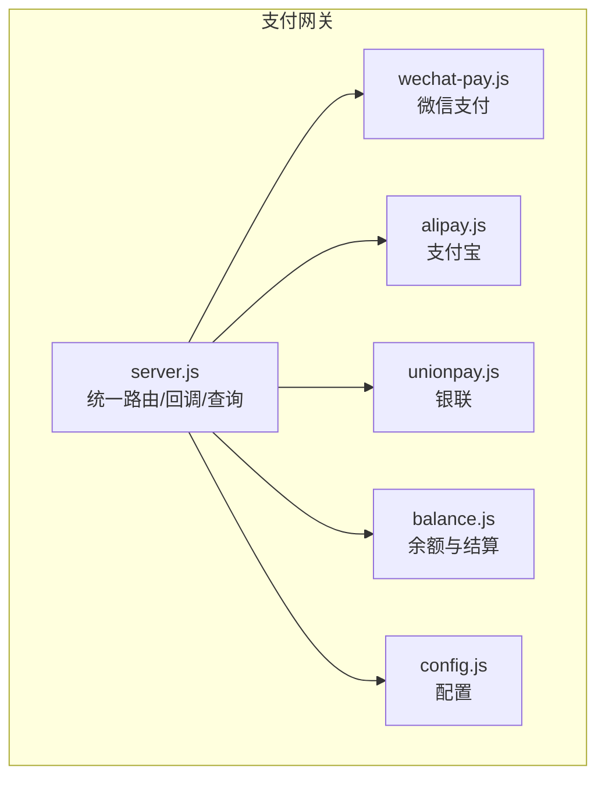
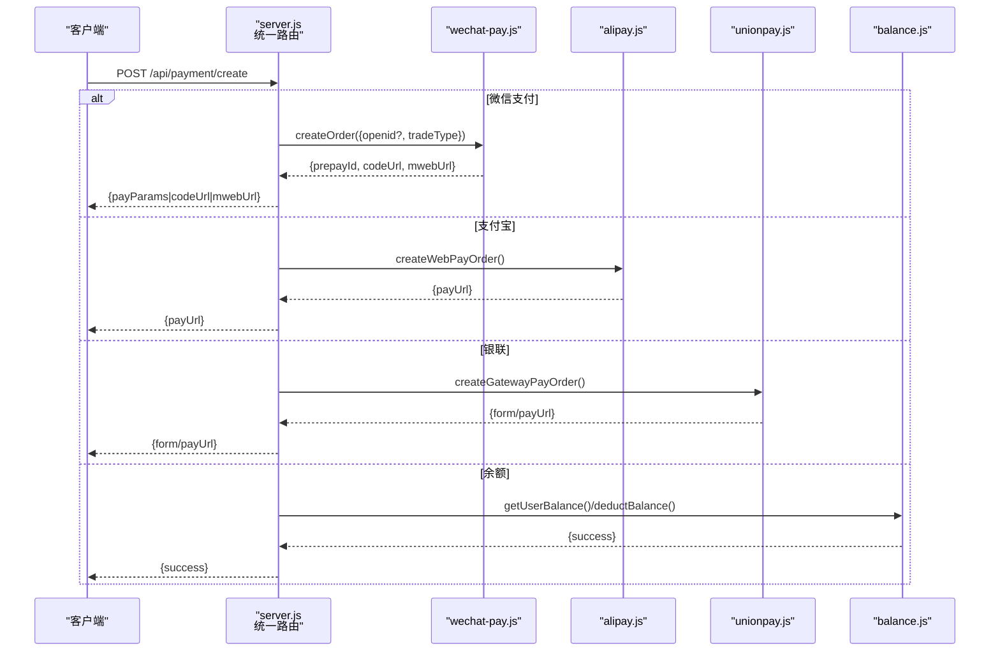
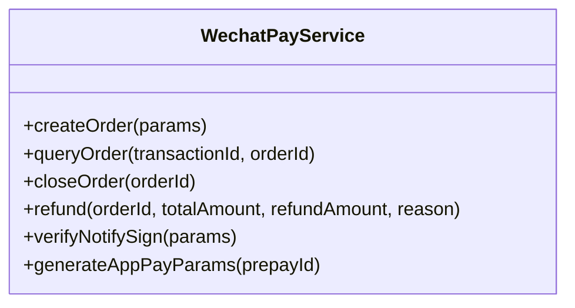
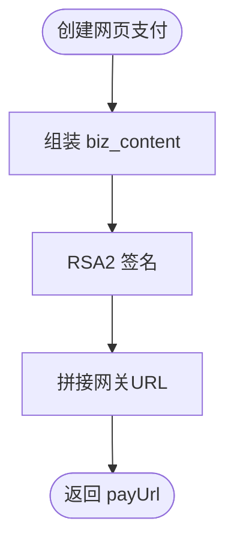
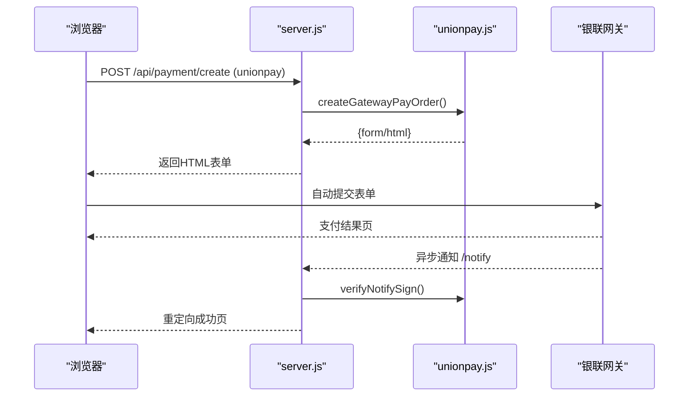
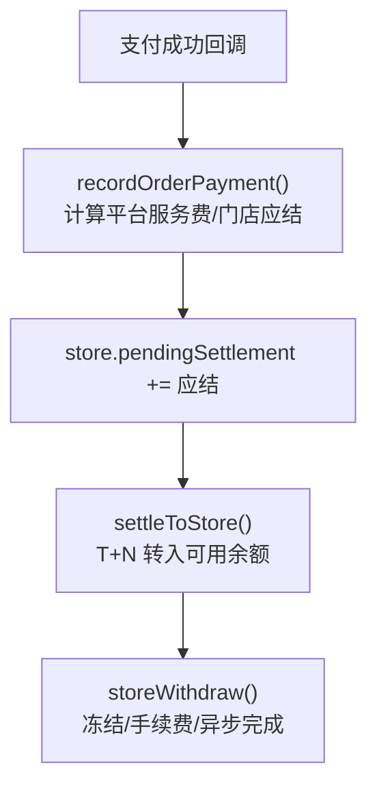
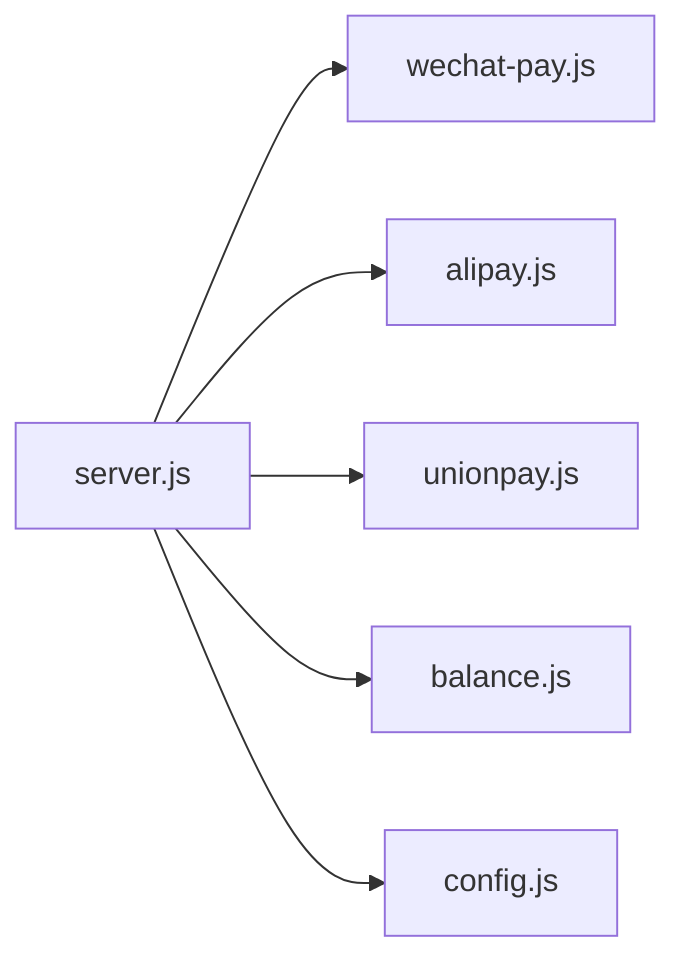

# 支付渠道集成

<cite>
**本文引用的文件**
- [server.js](file://api/payment-server/server.js)
- [wechat-pay.js](file://api/payment-server/wechat-pay.js)
- [alipay.js](file://api/payment-server/alipay.js)
- [unionpay.js](file://api/payment-server/unionpay.js)
- [balance.js](file://api/payment-server/balance.js)
- [config.js](file://api/payment-server/config.js)
- [paymentService.js](file://backend/modules/common/services/paymentService.js)
- [wechatPayService.js](file://backend/modules/common/services/wechatPayService.js)
- [README.md](file://api/payment-server/README.md)
- [PAYMENT_SYSTEM.md](file://PAYMENT_SYSTEM.md)
</cite>

## 目录
1. [引言](#引言)
2. [项目结构](#项目结构)
3. [核心组件](#核心组件)
4. [架构总览](#架构总览)
5. [详细组件分析](#详细组件分析)
6. [依赖关系分析](#依赖关系分析)
7. [性能与可靠性](#性能与可靠性)
8. [故障排查指南](#故障排查指南)
9. [结论](#结论)
10. [附录：扩展开发指南与最佳实践](#附录扩展开发指南与最佳实践)

## 引言
本文件面向干洗店管理系统的支付渠道集成，聚焦统一支付网关的设计与实现。文档覆盖多渠道抽象接口、微信支付（JSAPI/NATIVE/H5）、支付宝网页支付、银联网关支付、账户余额支付的完整流程；并给出配置方法、错误处理与异常恢复策略，以及新增支付渠道的扩展指南与最佳实践。

## 项目结构
支付网关位于 api/payment-server 下，采用“路由层 + 渠道服务 + 资金结算”的分层组织方式：
- server.js：统一支付入口、回调路由、订单状态查询与关闭、健康检查等
- wechat-pay.js：微信支付下单、查询、关闭、退款、签名与小程序调起参数生成
- alipay.js：支付宝网页/手机网站支付、查询、关闭、退款、签名与验签
- unionpay.js：银联网关/手机网页/银行卡直连、查询、撤销、退款、签名与表单构建
- balance.js：用户余额、门店结算、提现、报表等
- config.js：各渠道配置项与环境变量映射

图表来源
- [server.js:1-120](file://api/payment-server/server.js#L1-L120)
- [wechat-pay.js:1-120](file://api/payment-server/wechat-pay.js#L1-L120)
- [alipay.js:1-120](file://api/payment-server/alipay.js#L1-L120)
- [unionpay.js:1-120](file://api/payment-server/unionpay.js#L1-L120)
- [balance.js:1-120](file://api/payment-server/balance.js#L1-L120)
- [config.js:1-80](file://api/payment-server/config.js#L1-L80)

章节来源
- [server.js:1-120](file://api/payment-server/server.js#L1-L120)
- [config.js:1-80](file://api/payment-server/config.js#L1-L80)

## 核心组件
- 统一支付入口：POST /api/payment/create，根据 paymentMethod 分发到对应渠道
- 统一查询：GET /api/payment/query/:orderId，按渠道拉取或返回本地结果
- 统一关闭：POST /api/payment/close/:orderId，按渠道执行关闭逻辑
- 渠道服务：微信、支付宝、银联各自封装签名、请求、解析、状态转换
- 余额与结算：用户余额扣减、充值、交易流水；门店待结算、结算、提现、报表

章节来源
- [server.js:36-174](file://api/payment-server/server.js#L36-L174)
- [server.js:176-304](file://api/payment-server/server.js#L176-L304)
- [balance.js:8-120](file://api/payment-server/balance.js#L8-L120)

## 架构总览
统一网关通过路由层将业务订单与第三方渠道解耦，内部以类实例化方式提供一致的 createOrder/queryOrder/closeOrder/refund 能力，并通过回调与轮询保证最终一致性。

图表来源
- [server.js:42-174](file://api/payment-server/server.js#L42-L174)
- [wechat-pay.js:56-127](file://api/payment-server/wechat-pay.js#L56-L127)
- [alipay.js:68-104](file://api/payment-server/alipay.js#L68-L104)
- [unionpay.js:78-123](file://api/payment-server/unionpay.js#L78-L123)
- [balance.js:91-139](file://api/payment-server/balance.js#L91-L139)

## 详细组件分析

### 统一支付网关（server.js）
- 统一创建：根据 paymentMethod 选择渠道，记录内存订单，必要时附加前端调起参数
- 统一查询：按渠道调用 queryOrder，更新本地订单状态
- 统一关闭：按渠道执行 closeOrder
- 回调处理：分别处理微信、支付宝、银联回调，校验签名后更新订单并记录结算

章节来源
- [server.js:42-174](file://api/payment-server/server.js#L42-L174)
- [server.js:176-304](file://api/payment-server/server.js#L176-L304)
- [server.js:306-458](file://api/payment-server/server.js#L306-L458)

### 微信支付（wechat-pay.js）
- 统一下单：支持 JSAPI（小程序/公众号）、NATIVE（扫码）、H5（MWEB），自动拼接 openid 与 trade_type
- 小程序调起：generateAppPayParams 生成 timeStamp、nonceStr、package、signType、paySign
- 查询/关闭/退款：标准 XML 请求与响应解析
- 回调验签：verifyNotifySign 对返回字段排序后 MD5 验签

图表来源
- [wechat-pay.js:10-314](file://api/payment-server/wechat-pay.js#L10-L314)

章节来源
- [wechat-pay.js:56-127](file://api/payment-server/wechat-pay.js#L56-L127)
- [wechat-pay.js:132-184](file://api/payment-server/wechat-pay.js#L132-L184)
- [wechat-pay.js:189-225](file://api/payment-server/wechat-pay.js#L189-L225)
- [wechat-pay.js:230-280](file://api/payment-server/wechat-pay.js#L230-L280)
- [wechat-pay.js:285-310](file://api/payment-server/wechat-pay.js#L285-L310)

### 支付宝（alipay.js）
- 网页支付：createWebPayOrder 生成 RSA2 签名与跳转链接
- 查询/关闭/退款：使用 alipay.trade.query/close/refund 接口
- 回调验签：verifyNotifySign 使用支付宝公钥验证 RSA2 签名

图表来源
- [alipay.js:68-104](file://api/payment-server/alipay.js#L68-L104)
- [alipay.js:147-199](file://api/payment-server/alipay.js#L147-L199)
- [alipay.js:204-244](file://api/payment-server/alipay.js#L204-L244)
- [alipay.js:249-298](file://api/payment-server/alipay.js#L249-L298)
- [alipay.js:303-307](file://api/payment-server/alipay.js#L303-L307)

章节来源
- [alipay.js:68-104](file://api/payment-server/alipay.js#L68-L104)
- [alipay.js:147-199](file://api/payment-server/alipay.js#L147-L199)
- [alipay.js:204-244](file://api/payment-server/alipay.js#L204-L244)
- [alipay.js:249-298](file://api/payment-server/alipay.js#L249-L298)
- [alipay.js:303-307](file://api/payment-server/alipay.js#L303-L307)

### 银联（unionpay.js）
- 网关支付：createGatewayPayOrder 生成表单 HTML，前端自动提交至银联网关
- 手机网页：txnSubType=02，channelType=08
- 银行卡直连：createCardPayOrder 需要卡号、CVN2、有效期等敏感信息加密
- 查询/撤销/退款：backTrans.do 与 queryTrans.do 接口
- 签名：SHA256 基于 signCertPwd 计算，回调 verifyNotifySign 验签

图表来源
- [server.js:96-104](file://api/payment-server/server.js#L96-L104)
- [unionpay.js:78-123](file://api/payment-server/unionpay.js#L78-L123)
- [unionpay.js:406-413](file://api/payment-server/unionpay.js#L406-L413)
- [server.js:417-451](file://api/payment-server/server.js#L417-L451)

章节来源
- [unionpay.js:78-123](file://api/payment-server/unionpay.js#L78-L123)
- [unionpay.js:128-161](file://api/payment-server/unionpay.js#L128-L161)
- [unionpay.js:166-232](file://api/payment-server/unionpay.js#L166-L232)
- [unionpay.js:237-287](file://api/payment-server/unionpay.js#L237-L287)
- [unionpay.js:292-343](file://api/payment-server/unionpay.js#L292-L343)
- [unionpay.js:348-401](file://api/payment-server/unionpay.js#L348-L401)
- [unionpay.js:467-472](file://api/payment-server/unionpay.js#L467-L472)

### 账户余额与结算（balance.js）
- 用户余额：获取、扣减、充值、交易流水分页
- 门店结算：订单完成后记录待结算金额，T+N 结算到可用余额
- 提现：冻结余额、手续费、异步完成模拟
- 报表：按日期聚合统计

图表来源
- [balance.js:244-283](file://api/payment-server/balance.js#L244-L283)
- [balance.js:290-337](file://api/payment-server/balance.js#L290-L337)
- [balance.js:345-409](file://api/payment-server/balance.js#L345-L409)

章节来源
- [balance.js:57-82](file://api/payment-server/balance.js#L57-L82)
- [balance.js:91-139](file://api/payment-server/balance.js#L91-L139)
- [balance.js:147-191](file://api/payment-server/balance.js#L147-L191)
- [balance.js:199-218](file://api/payment-server/balance.js#L199-L218)
- [balance.js:244-283](file://api/payment-server/balance.js#L244-L283)
- [balance.js:290-337](file://api/payment-server/balance.js#L290-L337)
- [balance.js:345-409](file://api/payment-server/balance.js#L345-L409)

### 后端统一支付服务（可选对接）
后端模块提供统一的 PaymentService 抽象，便于上层业务以 method 分派到不同渠道。当前为占位实现，可替换为真实网关调用。

章节来源
- [paymentService.js:1-185](file://backend/modules/common/services/paymentService.js#L1-L185)

### 微信支付V3服务（可选升级路径）
wechatPayService.js 实现了 V3 API 的 JSAPI/APP/H5 下单、查询、关闭、退款、回调验签与解密，可作为现有 V2 实现的演进目标。

章节来源
- [wechatPayService.js:1-396](file://backend/modules/common/services/wechatPayService.js#L1-L396)

## 依赖关系分析
- server.js 依赖四个渠道服务与配置中心
- 各渠道服务独立封装签名、网络请求、XML/JSON 解析
- balance.js 被回调处理器用于记录结算与后续结算/提现

图表来源
- [server.js:1-35](file://api/payment-server/server.js#L1-L35)
- [config.js:1-80](file://api/payment-server/config.js#L1-L80)

章节来源
- [server.js:1-35](file://api/payment-server/server.js#L1-L35)
- [config.js:1-80](file://api/payment-server/config.js#L1-L80)

## 性能与可靠性
- 幂等性：回调处理需基于 out_trade_no 去重，避免重复入账
- 重试与补偿：对查询接口增加指数退避重试；对未收到回调的订单定时轮询
- 超时控制：对外部网关请求设置合理超时与熔断降级
- 并发安全：余额扣减与结算需加锁或使用事务，防止超扣
- 日志与追踪：全链路记录关键事件与耗时，便于定位问题

[本节为通用建议，不直接分析具体文件]

## 故障排查指南
- 签名失败
  - 微信：确认 apiKey 与排序规则一致，注意大小写与空值过滤
  - 支付宝：确认私钥/公钥匹配且算法为 RSA2
  - 银联：确认 signCertPwd 与签名内容拼接顺序
- 回调未到达
  - 确认回调 URL 公网可达且端口开放
  - 检查防火墙与反向代理转发
- 余额不足
  - 余额支付前需先查询可用余额，提示用户充值
- 订单状态不一致
  - 优先以渠道侧为准，服务端做幂等落库与状态同步

章节来源
- [server.js:306-458](file://api/payment-server/server.js#L306-L458)
- [wechat-pay.js:285-310](file://api/payment-server/wechat-pay.js#L285-L310)
- [alipay.js:303-307](file://api/payment-server/alipay.js#L303-L307)
- [unionpay.js:467-472](file://api/payment-server/unionpay.js#L467-L472)

## 结论
本系统通过统一网关将多支付渠道标准化，提供一致的创建、查询、关闭与回调处理能力；结合余额与结算体系，形成从支付到分账再到提现的完整闭环。建议在后续迭代中引入持久化存储、分布式锁、幂等表与监控告警，进一步提升稳定性与可观测性。

[本节为总结，不直接分析具体文件]

## 附录：扩展开发指南与最佳实践

### 新增支付渠道步骤
1. 在 server.js 的统一入口添加新的 paymentMethod 分支，调用新渠道服务
2. 新建渠道服务文件，实现：
   - createOrder：生成订单并返回前端所需参数或跳转链接
   - queryOrder：按商户订单号或渠道交易号查询
   - closeOrder：关闭订单
   - refund：申请退款
   - verifyNotifySign：回调验签
3. 在 config.js 中添加该渠道的配置项与环境变量映射
4. 在 server.js 的回调路由中注册新渠道的 notify 接口，完成验签与状态更新
5. 补充单元测试与端到端测试用例

章节来源
- [server.js:42-174](file://api/payment-server/server.js#L42-L174)
- [config.js:1-80](file://api/payment-server/config.js#L1-L80)

### 配置方法与环境变量
- 微信支付：appId、mchId、apiKey、notifyUrl、apiBaseUrl
- 支付宝：appId、privateKey、alipayPublicKey、gateway、notifyUrl
- 银联：merchantId、signCertPath、signCertPwd、notifyUrl、apiUrl
- 服务器：port、host

章节来源
- [config.js:1-80](file://api/payment-server/config.js#L1-L80)

### 错误处理与异常恢复
- 外部调用异常：捕获并返回结构化错误，包含错误码与消息
- 回调幂等：基于 out_trade_no 判断是否已处理，避免重复入账
- 状态回滚：余额扣减失败时回滚交易流水
- 补偿任务：定时扫描 pending 订单，主动查询渠道状态并修正

章节来源
- [server.js:167-174](file://api/payment-server/server.js#L167-L174)
- [server.js:306-458](file://api/payment-server/server.js#L306-L458)

### 参考文档与快速开始
- 支付网关使用说明与部署指引
- 支付与结算系统总体说明

章节来源
- [README.md:1-481](file://api/payment-server/README.md#L1-L481)
- [PAYMENT_SYSTEM.md:1-383](file://PAYMENT_SYSTEM.md#L1-L383)