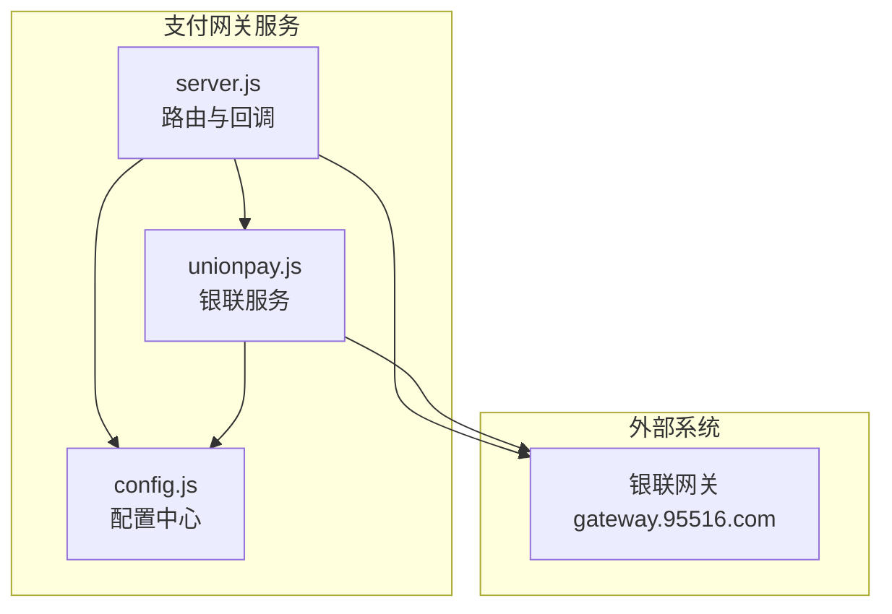
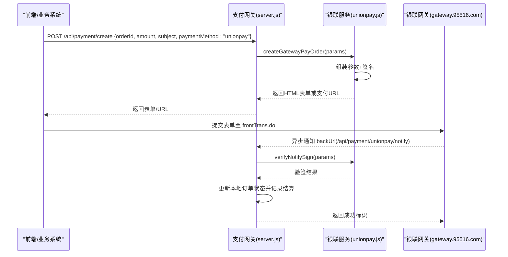
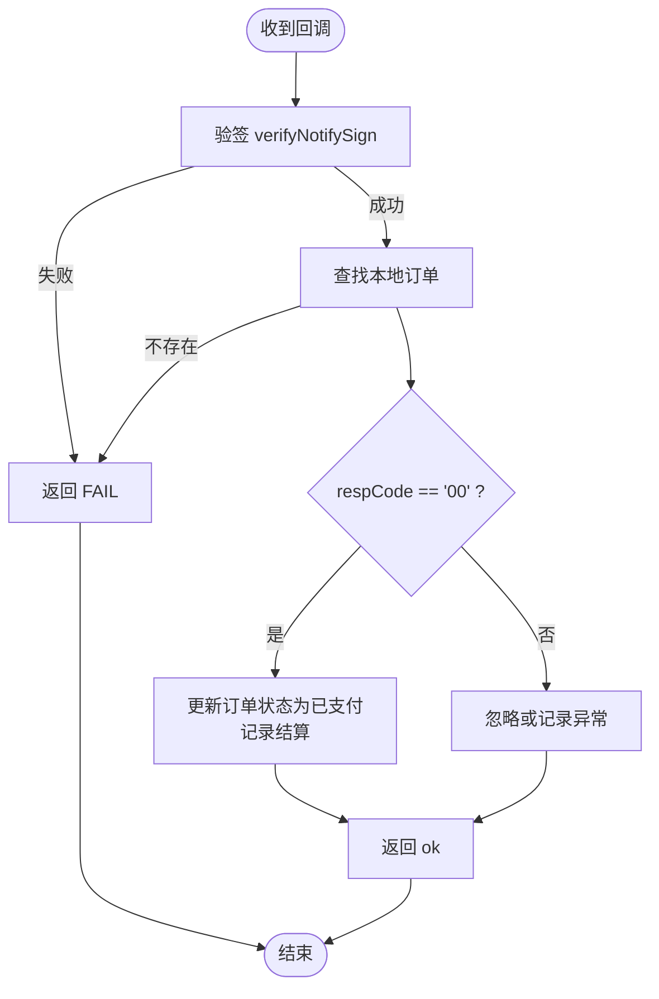
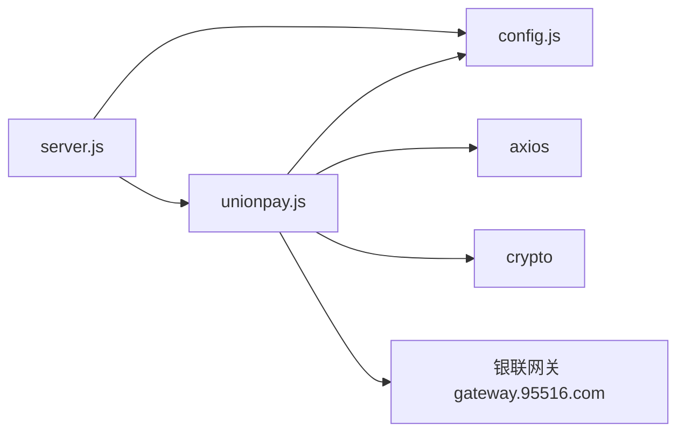

# 银联支付集成

<cite>
**本文引用的文件列表**
- [unionpay.js](file://api/payment-server/unionpay.js)
- [config.js](file://api/payment-server/config.js)
- [server.js](file://api/payment-server/server.js)
- [README.md](file://api/payment-server/README.md)
- [test-config.js](file://api/payment-server/test-config.js)
- [test-server.js](file://api/payment-server/test-server.js)
</cite>

## 目录
1. [简介](#简介)
2. [项目结构](#项目结构)
3. [核心组件](#核心组件)
4. [架构总览](#架构总览)
5. [详细组件分析](#详细组件分析)
6. [依赖关系分析](#依赖关系分析)
7. [性能与可靠性](#性能与可靠性)
8. [故障排查指南](#故障排查指南)
9. [结论](#结论)
10. [附录：接口示例与报文规范](#附录接口示例与报文规范)

## 简介
本文件面向在系统中接入“银联网关支付”的开发者，围绕以下目标展开：
- 认证流程与安全机制（签名、验签、回调校验）
- HTTPS 双向 SSL 证书配置说明与现状评估
- 报文的构建、加密/解密与数字签名验证
- 支付请求构建、响应解析与交易状态同步逻辑
- 退款申请、交易查询与撤销操作的实现方法
- 测试环境与生产环境的差异与注意事项
- 完整的接口调用示例、报文格式规范与错误处理方案
- 安全加固措施与合规性要求建议

## 项目结构
支付网关服务位于 api/payment-server 目录，其中与银联相关的核心文件如下：
- unionpay.js：银联支付服务实现（创建订单、查询、撤销、退款、签名与验签、表单构建等）
- config.js：统一配置文件（包含银联商户号、证书路径、回调地址、API 地址等）
- server.js：Express 主服务（路由聚合、统一支付入口、回调处理、健康检查等）
- README.md：支付系统使用说明（含证书放置位置、回调 URL 等）
- test-config.js / test-server.js：测试环境配置与模拟服务器（用于本地联调）

图表来源
- [server.js:1-120](file://api/payment-server/server.js#L1-L120)
- [unionpay.js:1-120](file://api/payment-server/unionpay.js#L1-L120)
- [config.js:49-62](file://api/payment-server/config.js#L49-L62)

章节来源
- [server.js:1-120](file://api/payment-server/server.js#L1-L120)
- [unionpay.js:1-120](file://api/payment-server/unionpay.js#L1-L120)
- [config.js:49-62](file://api/payment-server/config.js#L49-L62)

## 核心组件
- UnionpayService（类）
  - 负责：生成随机串、时间戳、日期；SHA256 签名与验签；构建表单与表单数据；解析银联响应；构造各类交易请求（网关支付、手机网页支付、银行卡支付、查询、撤销、退款）；客户信息加密占位；状态码转换；回调签名校验。
- 路由层（server.js）
  - 提供统一支付入口 /api/payment/create，按支付方式分发到对应服务；提供银联回调 /api/payment/unionpay/notify 与返回页面 /payment/unionpay/return；维护内存订单表以演示状态同步。
- 配置层（config.js）
  - 集中管理银联相关配置项：merchantId、signCertPath、signCertPwd、notifyUrl、apiUrl。

章节来源
- [unionpay.js:10-120](file://api/payment-server/unionpay.js#L10-L120)
- [server.js:96-104](file://api/payment-server/server.js#L96-L104)
- [config.js:49-62](file://api/payment-server/config.js#L49-L62)

## 架构总览
下图展示从前端发起支付到银联网关、再到回调落库的完整链路。

图表来源
- [server.js:96-104](file://api/payment-server/server.js#L96-L104)
- [server.js:416-451](file://api/payment-server/server.js#L416-L451)
- [unionpay.js:78-123](file://api/payment-server/unionpay.js#L78-L123)
- [unionpay.js:467-472](file://api/payment-server/unionpay.js#L467-L472)
- [config.js:58-62](file://api/payment-server/config.js#L58-L62)

## 详细组件分析

### 1) 认证流程与安全机制
- 签名算法
  - 使用 SHA256 HMAC 对排序拼接后的字段进行签名，结果为 Base64。
  - 签名内容通过将所有非空字段按 key 升序拼接为 key=value&key=value... 的形式。
- 验签流程
  - 回调验签时，移除 signature 和 signMethod 后，用相同规则计算签名并与传入 signature 比对。
- 证书与密钥
  - 配置项包含 signCertPath 与 signCertPwd，但当前实现未实际加载 PFX/CER 证书，也未做双向 TLS 客户端证书校验。
  - 文档中提示需将 acp_sign.pfx 与 acp_verify.cer 放入 certs 目录，但代码未读取这些文件。

章节来源
- [unionpay.js:47-72](file://api/payment-server/unionpay.js#L47-L72)
- [unionpay.js:56-60](file://api/payment-server/unionpay.js#L56-L60)
- [unionpay.js:467-472](file://api/payment-server/unionpay.js#L467-L472)
- [config.js:54-57](file://api/payment-server/config.js#L54-L57)
- [README.md:282-290](file://api/payment-server/README.md#L282-L290)

### 2) HTTPS 双向 SSL 证书配置
- 现状
  - 当前通过 axios 发起 HTTP(S) 请求，未显式配置客户端证书（mTLS）。
  - 配置项 signCertPath/signCertPwd 仅作为字符串保存，未在请求阶段使用。
- 建议
  - 若银联侧要求 mTLS，应在 axios 请求前加载 PFX 证书与密码，并在每个出站请求中注入 clientCert 选项。
  - 同时应加载银联公钥证书用于服务端验签（当前仅使用对称密钥进行 HMAC 验签，不符合常见公钥验签模式）。

章节来源
- [config.js:54-57](file://api/payment-server/config.js#L54-L57)
- [README.md:282-290](file://api/payment-server/README.md#L282-L290)

### 3) 报文加密、解密与数字签名
- 签名
  - 所有请求均先构造参数对象，再调用 getSignContent 拼接，最后用 signCertPwd 进行 HMAC-SHA256 签名。
- 加密
  - 银行卡支付场景中的 customerInfo 采用占位实现（Base64），注释指出“实际需要从银联获取公钥”，当前未实现真实 RSA 公钥加密。
- 解密
  - 未实现银联返回密文的解密逻辑（当前响应为明文键值对）。

章节来源
- [unionpay.js:65-72](file://api/payment-server/unionpay.js#L65-L72)
- [unionpay.js:47-51](file://api/payment-server/unionpay.js#L47-L51)
- [unionpay.js:442-447](file://api/payment-server/unionpay.js#L442-L447)

### 4) 支付请求构建与响应解析
- 网关支付（PC/H5 跳转）
  - 构造 frontTrans.do 所需参数，生成 HTML 表单自动提交，或直接返回 payUrl。
- 手机网页支付
  - 与网关支付类似，区别在于 txnSubType/channelType 等字段。
- 银行卡支付（直连扣款）
  - 直接 POST backTrans.do，返回成功后封装 orderId/txnNo/amount。
- 响应解析
  - parseResponse 将 & 分隔的键值对解析为对象，供后续判断 respCode 等。

章节来源
- [unionpay.js:78-123](file://api/payment-server/unionpay.js#L78-L123)
- [unionpay.js:128-161](file://api/payment-server/unionpay.js#L128-L161)
- [unionpay.js:166-232](file://api/payment-server/unionpay.js#L166-L232)
- [unionpay.js:429-437](file://api/payment-server/unionpay.js#L429-L437)

### 5) 交易状态同步逻辑
- 统一查询接口
  - /api/payment/query/:orderId 根据支付方式路由到具体服务；对于银联，调用 queryOrder 并映射状态。
- 回调处理
  - /api/payment/unionpay/notify 接收银联异步通知，先验签，再根据 respCode 更新本地订单状态并记录结算。

图表来源
- [server.js:416-451](file://api/payment-server/server.js#L416-L451)
- [unionpay.js:467-472](file://api/payment-server/unionpay.js#L467-L472)

章节来源
- [server.js:180-240](file://api/payment-server/server.js#L180-L240)
- [server.js:416-451](file://api/payment-server/server.js#L416-L451)
- [unionpay.js:237-287](file://api/payment-server/unionpay.js#L237-L287)

### 6) 退款、查询与撤销
- 查询订单
  - 调用 queryTrans.do，返回 origRespCode 等字段，内部转换为 success/failed/processing。
- 撤销交易
  - 调用 backTrans.do，txnType=31，成功后返回金额等信息。
- 退款
  - 调用 backTrans.do，txnType=04，需提供原交易时间与订单号，成功后返回退款金额。

章节来源
- [unionpay.js:237-287](file://api/payment-server/unionpay.js#L237-L287)
- [unionpay.js:292-343](file://api/payment-server/unionpay.js#L292-L343)
- [unionpay.js:348-401](file://api/payment-server/unionpay.js#L348-L401)

### 7) 测试环境与生产环境差异
- API 地址
  - 默认 apiUrl 指向 gateway.95516.com（生产域名）。
- 测试模式
  - test-config.js 与 test-server.js 提供测试端口与 mock 支付链接，便于本地联调。
- 证书与密钥
  - 生产环境需准备真实商户号、证书与密码；测试环境可使用占位值。

章节来源
- [config.js:60-62](file://api/payment-server/config.js#L60-L62)
- [test-config.js:46-53](file://api/payment-server/test-config.js#L46-L53)
- [test-server.js:129-135](file://api/payment-server/test-server.js#L129-L135)

## 依赖关系分析
- server.js 依赖 unionpay.js 与 config.js
- unionpay.js 依赖 crypto、axios 与 config.js
- 对外依赖：银联网关 https://gateway.95516.com

图表来源
- [server.js:1-20](file://api/payment-server/server.js#L1-L20)
- [unionpay.js:6-14](file://api/payment-server/unionpay.js#L6-L14)
- [config.js:49-62](file://api/payment-server/config.js#L49-L62)

章节来源
- [server.js:1-20](file://api/payment-server/server.js#L1-L20)
- [unionpay.js:6-14](file://api/payment-server/unionpay.js#L6-L14)
- [config.js:49-62](file://api/payment-server/config.js#L49-L62)

## 性能与可靠性
- 并发与超时
  - 当前未设置 axios 超时与重试策略，建议在网关层增加合理超时与幂等保护。
- 状态一致性
  - 回调处理仅更新内存 Map，重启会丢失状态；生产环境应持久化订单与幂等去重。
- 日志与监控
  - 建议对关键步骤（签名、网络请求、回调处理）输出结构化日志，并接入告警。

[本节为通用建议，不直接分析具体文件]

## 故障排查指南
- 常见问题
  - 回调验签失败：检查是否移除了 signature 与 signMethod 后再验签；确认 signCertPwd 是否正确。
  - 订单不存在：检查回调中的 orderId 是否与创建订单一致。
  - 证书未生效：确认 signCertPath/signCertPwd 是否被正确读取与使用（当前未启用证书加载）。
- 定位手段
  - 查看 server.js 中回调处理分支的日志输出。
  - 核对 config.js 中 notifyUrl 与公网可达性。

章节来源
- [server.js:416-451](file://api/payment-server/server.js#L416-L451)
- [config.js:58-62](file://api/payment-server/config.js#L58-L62)

## 结论
当前实现提供了银联网关支付的完整业务流程骨架：订单创建、表单提交、回调验签与状态同步、以及查询/撤销/退款能力。但在安全层面仍存在改进空间，尤其是：
- 未实现真正的双向 TLS 与公钥验签
- 银行卡敏感信息加密仍为占位实现
- 回调与订单状态未持久化与幂等保护
建议在生产上线前补齐上述安全与可靠性措施，并按附录完善接口与报文规范。

[本节为总结，不直接分析具体文件]

## 附录：接口示例与报文规范

### 1) 统一支付接口
- 接口
  - POST /api/payment/create
- 请求体关键字段
  - orderId、amount、subject、paymentMethod="unionpay"、returnUrl（可选）
- 响应
  - 返回 HTML 表单或 payUrl，由前端自动提交至银联网关

章节来源
- [server.js:96-104](file://api/payment-server/server.js#L96-L104)
- [unionpay.js:78-123](file://api/payment-server/unionpay.js#L78-L123)

### 2) 银联回调接口
- 接口
  - POST /api/payment/unionpay/notify
- 请求体
  - 包含 signature、signMethod 及交易字段（如 orderId、txnAmt、respCode 等）
- 处理逻辑
  - 验签 → 查单 → 更新状态 → 记录结算 → 返回 ok/FAIL

章节来源
- [server.js:416-451](file://api/payment-server/server.js#L416-L451)
- [unionpay.js:467-472](file://api/payment-server/unionpay.js#L467-L472)

### 3) 查询接口
- 接口
  - GET /api/payment/query/:orderId
- 行为
  - 针对 unionpay 调用 queryOrder，并将 respCode 映射为 success/failed/processing

章节来源
- [server.js:180-240](file://api/payment-server/server.js#L180-L240)
- [unionpay.js:237-287](file://api/payment-server/unionpay.js#L237-L287)

### 4) 关闭/撤销/退款
- 关闭订单
  - POST /api/payment/close/:orderId（unionpay 分支返回成功占位）
- 撤销
  - 调用 backTrans.do，txnType=31
- 退款
  - 调用 backTrans.do，txnType=04，需携带原交易时间与订单号

章节来源
- [server.js:246-304](file://api/payment-server/server.js#L246-L304)
- [unionpay.js:292-401](file://api/payment-server/unionpay.js#L292-L401)

### 5) 报文字段与签名要点
- 必填字段（示例）
  - version、encoding、certId、txnType、txnSubType、bizType、backUrl、frontUrl、signMethod、channelType、accessType、merId、orderId、txnTime、txnAmt、currencyCode、reqReserved
- 签名
  - 对所有非空字段按 key 升序拼接为 key=value&...，再用 signCertPwd 进行 HMAC-SHA256 签名，结果 Base64 填入 signature
- 响应解析
  - 将 & 分隔的键值对解析为对象，依据 respCode/origRespCode 判断结果

章节来源
- [unionpay.js:65-72](file://api/payment-server/unionpay.js#L65-L72)
- [unionpay.js:429-437](file://api/payment-server/unionpay.js#L429-L437)

### 6) 证书与环境配置
- 证书放置
  - 参考 README 指引，将 acp_sign.pfx 与 acp_verify.cer 放入 certs 目录
- 环境变量
  - UNIONPAY_MERCHANT_ID、UNIONPAY_SIGN_CERT_PATH、UNIONPAY_SIGN_CERT_PWD、UNIONPAY_NOTIFY_URL、UNIONPAY_API_URL
- 测试环境
  - 使用 test-config.js 与 test-server.js 提供的测试端口与 mock 链接

章节来源
- [README.md:282-290](file://api/payment-server/README.md#L282-L290)
- [config.js:50-62](file://api/payment-server/config.js#L50-L62)
- [test-config.js:46-53](file://api/payment-server/test-config.js#L46-L53)
- [test-server.js:129-135](file://api/payment-server/test-server.js#L129-L135)