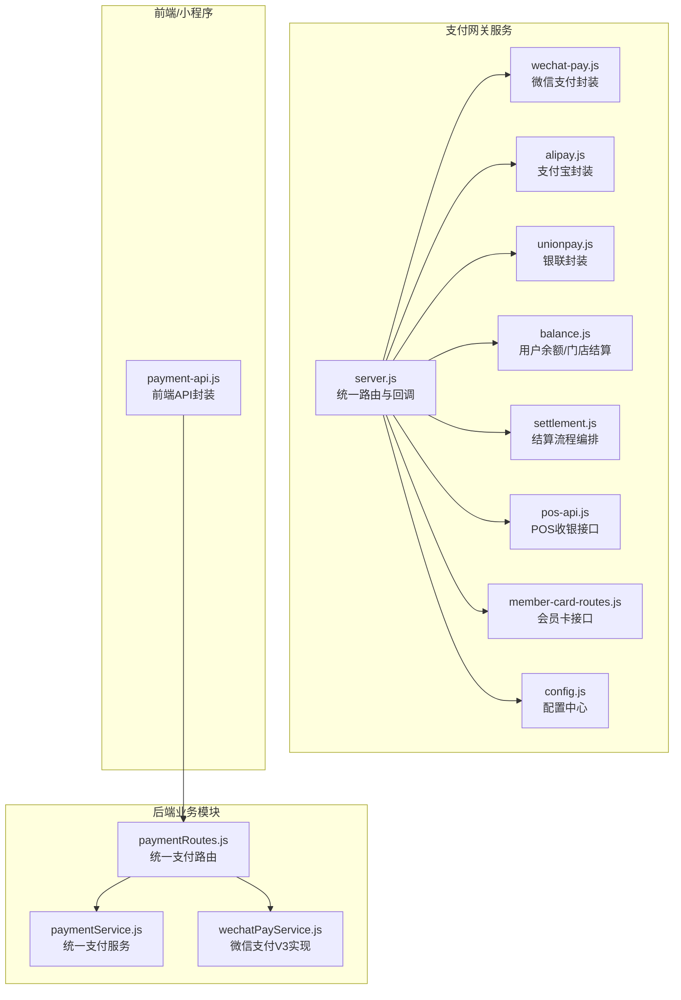
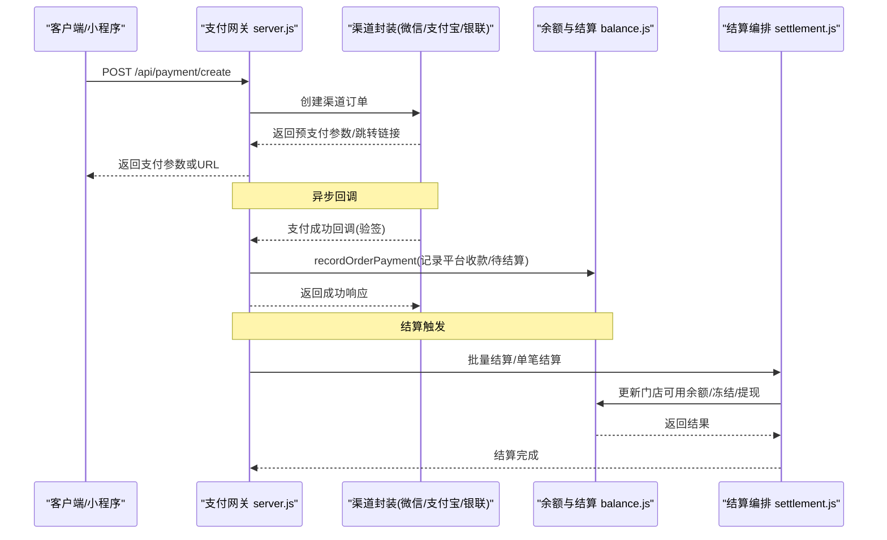
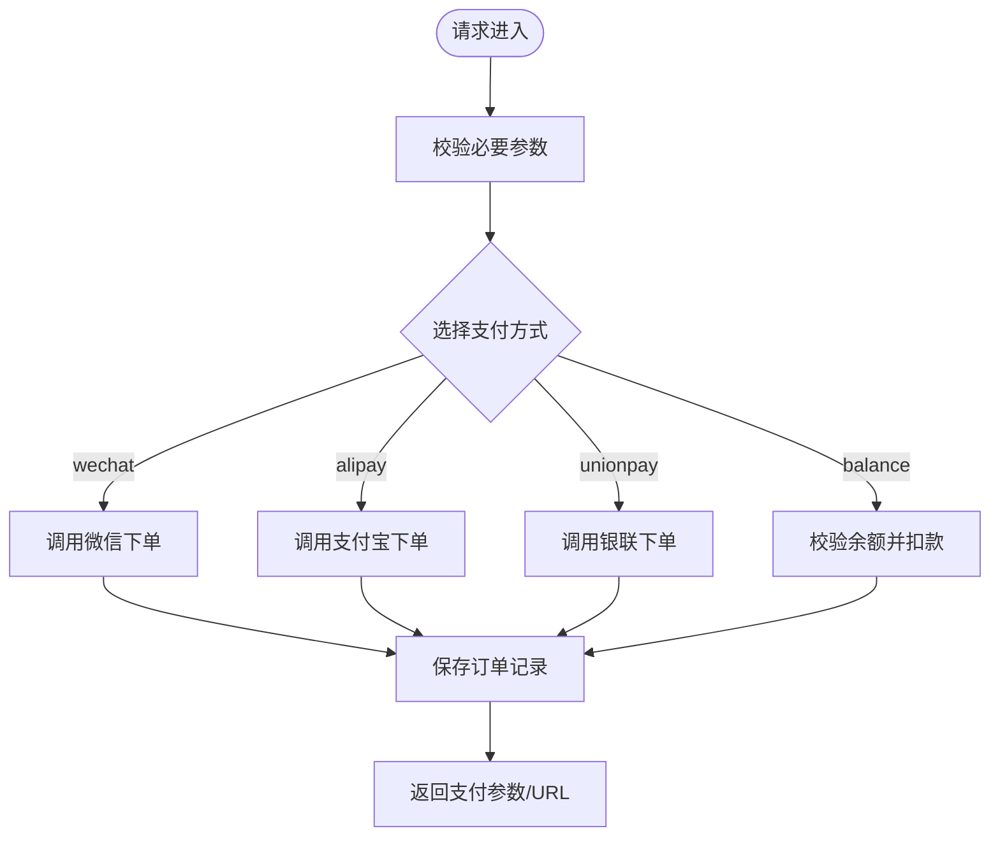
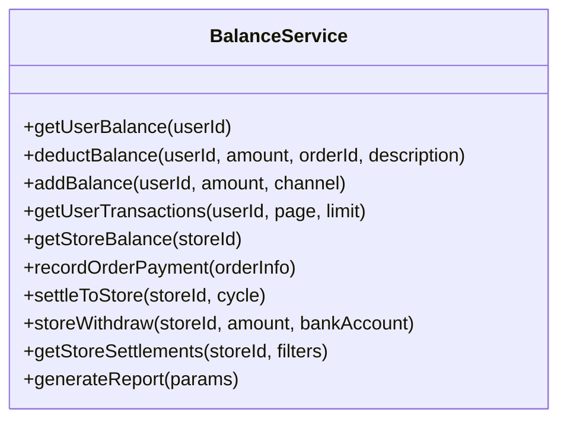
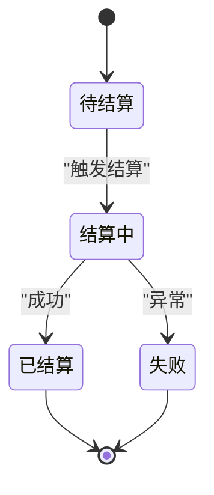
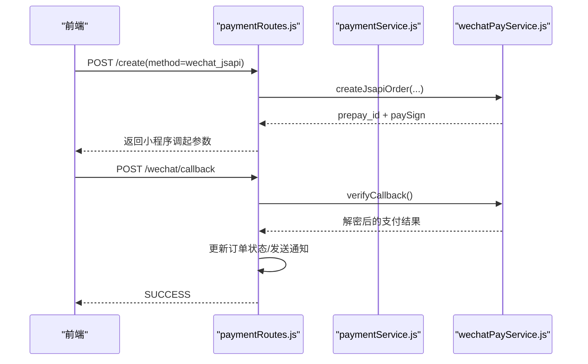
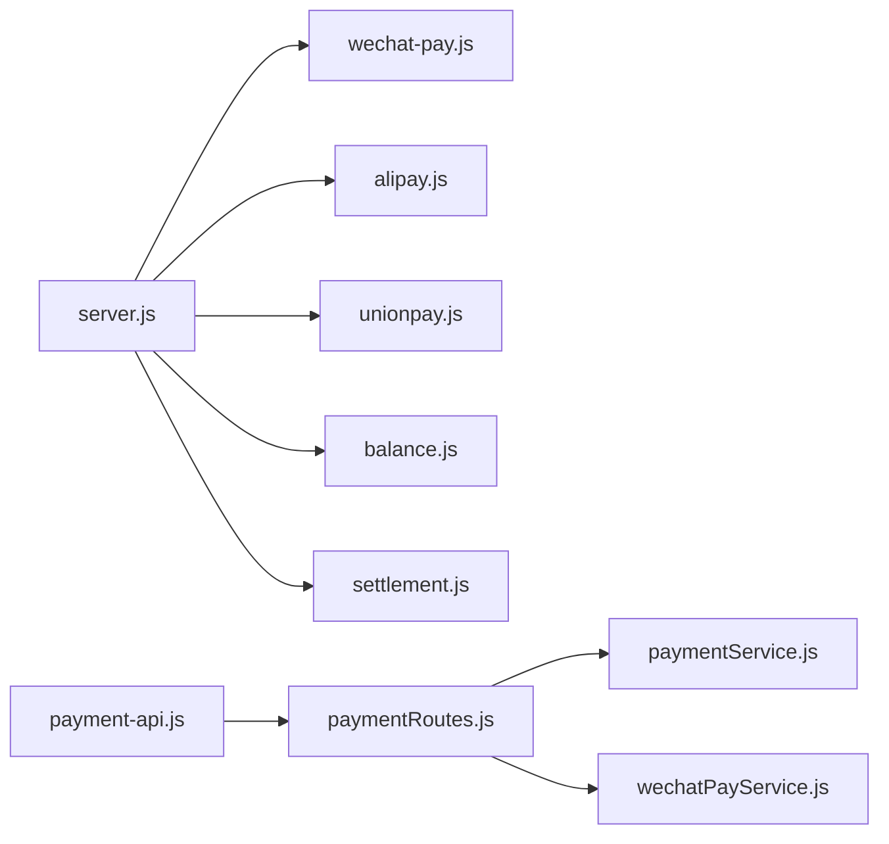

# 支付结算系统

<cite>
**本文引用的文件**   
- [api/payment-server/README.md](file://api/payment-server/README.md)
- [api/payment-server/server.js](file://api/payment-server/server.js)
- [api/payment-server/config.js](file://api/payment-server/config.js)
- [api/payment-server/wechat-pay.js](file://api/payment-server/wechat-pay.js)
- [api/payment-server/alipay.js](file://api/payment-server/alipay.js)
- [api/payment-server/unionpay.js](file://api/payment-server/unionpay.js)
- [api/payment-server/balance.js](file://api/payment-server/balance.js)
- [api/payment-server/settlement.js](file://api/payment-server/settlement.js)
- [backend/modules/common/services/paymentService.js](file://backend/modules/common/services/paymentService.js)
- [backend/modules/common/routes/paymentRoutes.js](file://backend/modules/common/routes/paymentRoutes.js)
- [backend/modules/common/services/wechatPayService.js](file://backend/modules/common/services/wechatPayService.js)
- [api/payment-api.js](file://api/payment-api.js)
- [api/payment-server/pos-api.js](file://api/payment-server/pos-api.js)
- [api/payment-server/member-card-routes.js](file://api/payment-server/member-card-routes.js)
</cite>

## 目录
1. [引言](#引言)
2. [项目结构](#项目结构)
3. [核心组件](#核心组件)
4. [架构总览](#架构总览)
5. [详细组件分析](#详细组件分析)
6. [依赖关系分析](#依赖关系分析)
7. [性能与可靠性](#性能与可靠性)
8. [故障排查指南](#故障排查指南)
9. [结论](#结论)
10. [附录](#附录)

## 引言
本文件面向支付系统开发者与财务人员，系统化阐述干洗店管理系统中的支付结算体系。内容覆盖统一支付架构、多渠道接入（微信、支付宝、银联、余额）、分账与结算算法、支付生命周期状态管理、安全机制（签名验证、防重放、敏感信息保护）、回调处理、对账与报表生成，以及监控告警、故障转移与灾备恢复策略。

## 项目结构
支付结算相关代码主要分布在两个位置：
- 独立支付网关服务（Node/Express）：提供统一支付入口、渠道封装、余额与结算接口、POS与会员卡扩展能力
- 后端业务模块：统一支付路由与服务类，对接微信支付V3等能力

图表来源
- [api/payment-server/server.js:1-624](file://api/payment-server/server.js#L1-L624)
- [api/payment-server/config.js:1-80](file://api/payment-server/config.js#L1-L80)
- [api/payment-server/wechat-pay.js:1-314](file://api/payment-server/wechat-pay.js#L1-L314)
- [api/payment-server/alipay.js:1-336](file://api/payment-server/alipay.js#L1-L336)
- [api/payment-server/unionpay.js:1-501](file://api/payment-server/unionpay.js#L1-L501)
- [api/payment-server/balance.js:1-524](file://api/payment-server/balance.js#L1-L524)
- [api/payment-server/settlement.js:1-389](file://api/payment-server/settlement.js#L1-L389)
- [api/payment-server/pos-api.js:1-556](file://api/payment-server/pos-api.js#L1-L556)
- [api/payment-server/member-card-routes.js:1-281](file://api/payment-server/member-card-routes.js#L1-L281)
- [backend/modules/common/routes/paymentRoutes.js:1-215](file://backend/modules/common/routes/paymentRoutes.js#L1-L215)
- [backend/modules/common/services/paymentService.js:1-185](file://backend/modules/common/services/paymentService.js#L1-L185)
- [backend/modules/common/services/wechatPayService.js:1-396](file://backend/modules/common/services/wechatPayService.js#L1-L396)
- [api/payment-api.js:1-427](file://api/payment-api.js#L1-L427)

章节来源
- [api/payment-server/README.md:1-481](file://api/payment-server/README.md#L1-L481)

## 核心组件
- 统一支付网关（server.js）
  - 统一创建订单、查询、关闭、各渠道回调、余额与结算接口、健康检查
- 渠道封装
  - 微信支付（wechat-pay.js）：统一下单、查询、关闭、退款、签名与小程序参数生成
  - 支付宝（alipay.js）：网页/手机网站支付、查询、关闭、退款、RSA2验签
  - 银联（unionpay.js）：网关支付、查询、撤销、退款、表单构建与签名
- 账户与结算（balance.js、settlement.js）
  - 用户余额充值/扣减、交易流水
  - 平台服务费计算、门店待结算/可用余额、提现、财务报表
- 后端统一支付路由与服务（paymentRoutes.js、paymentService.js、wechatPayService.js）
  - 统一路由分发、微信支付V3下单/查询/退款、回调验签解密、通知发送
- 扩展能力
  - POS收银（pos-api.js）：扫码/现金/会员卡支付、小票、结算同步
  - 会员卡（member-card-routes.js）：开卡、充值、消费、密码与安全控制
- 前端API封装（payment-api.js）
  - 支付方式列表、模拟下单与余额操作，便于前端快速集成

章节来源
- [api/payment-server/server.js:1-624](file://api/payment-server/server.js#L1-L624)
- [api/payment-server/wechat-pay.js:1-314](file://api/payment-server/wechat-pay.js#L1-L314)
- [api/payment-server/alipay.js:1-336](file://api/payment-server/alipay.js#L1-L336)
- [api/payment-server/unionpay.js:1-501](file://api/payment-server/unionpay.js#L1-L501)
- [api/payment-server/balance.js:1-524](file://api/payment-server/balance.js#L1-L524)
- [api/payment-server/settlement.js:1-389](file://api/payment-server/settlement.js#L1-L389)
- [backend/modules/common/routes/paymentRoutes.js:1-215](file://backend/modules/common/routes/paymentRoutes.js#L1-L215)
- [backend/modules/common/services/paymentService.js:1-185](file://backend/modules/common/services/paymentService.js#L1-L185)
- [backend/modules/common/services/wechatPayService.js:1-396](file://backend/modules/common/services/wechatPayService.js#L1-L396)
- [api/payment-server/pos-api.js:1-556](file://api/payment-server/pos-api.js#L1-L556)
- [api/payment-server/member-card-routes.js:1-281](file://api/payment-server/member-card-routes.js#L1-L281)
- [api/payment-api.js:1-427](file://api/payment-api.js#L1-L427)

## 架构总览
支付网关作为“统一收单+结算”的中枢，屏蔽多渠道差异，对外暴露统一接口；内部按渠道拆分实现，并联动余额与结算子系统完成资金流转与报表输出。

图表来源
- [api/payment-server/server.js:1-624](file://api/payment-server/server.js#L1-L624)
- [api/payment-server/wechat-pay.js:1-314](file://api/payment-server/wechat-pay.js#L1-L314)
- [api/payment-server/alipay.js:1-336](file://api/payment-server/alipay.js#L1-L336)
- [api/payment-server/unionpay.js:1-501](file://api/payment-server/unionpay.js#L1-L501)
- [api/payment-server/balance.js:1-524](file://api/payment-server/balance.js#L1-L524)
- [api/payment-server/settlement.js:1-389](file://api/payment-server/settlement.js#L1-L389)

## 详细组件分析

### 统一支付网关（server.js）
- 统一入口
  - 创建订单：根据 paymentMethod 路由到对应渠道；余额支付直接校验并扣减
  - 查询订单：按渠道调用查询接口，并更新本地订单状态
  - 关闭订单：按渠道发起关闭
- 回调处理
  - 微信/支付宝/银联各自验签后，更新订单状态并记录到结算系统
- 余额与结算
  - 提供用户余额查询、充值、门店结算信息查询、结算、提现、报表生成等接口
- 健康检查
  - 返回服务与各渠道开关状态

图表来源
- [api/payment-server/server.js:1-624](file://api/payment-server/server.js#L1-L624)

章节来源
- [api/payment-server/server.js:1-624](file://api/payment-server/server.js#L1-L624)

### 微信支付封装（wechat-pay.js）
- 功能
  - 统一下单（JSAPI/NATIVE/H5/APP），金额单位分，支持openid
  - 订单查询、关闭、退款
  - 回调签名验证、小程序调起参数生成
- 安全
  - MD5签名、XML解析、随机串生成
- 错误处理
  - 标准化返回 success/error/code/message

章节来源
- [api/payment-server/wechat-pay.js:1-314](file://api/payment-server/wechat-pay.js#L1-L314)

### 支付宝封装（alipay.js）
- 功能
  - 电脑网站/手机网站支付，返回支付URL
  - 交易查询、关闭、退款
  - RSA2签名与验签
- 注意
  - 时间格式化扩展用于构造请求参数

章节来源
- [api/payment-server/alipay.js:1-336](file://api/payment-server/alipay.js#L1-L336)

### 银联封装（unionpay.js）
- 功能
  - 网关支付（PC/移动端），返回自动提交表单
  - 银行卡直连支付（需加密客户信息）
  - 查询、撤销、退款
  - SHA256签名与回调验签
- 数据格式
  - 表单键值拼接、HTML表单构建、响应解析

章节来源
- [api/payment-server/unionpay.js:1-501](file://api/payment-server/unionpay.js#L1-L501)

### 余额与结算（balance.js）
- 用户余额
  - 获取余额、扣减、充值、交易流水分页
- 门店结算
  - 订单完成后记录平台收款与待结算金额
  - 定期结算将待结算转入可用余额
  - 提现申请（冻结可用余额，异步完成）
  - 结算记录查询与统计
  - 财务报表生成（日维度聚合）

图表来源
- [api/payment-server/balance.js:1-524](file://api/payment-server/balance.js#L1-L524)

章节来源
- [api/payment-server/balance.js:1-524](file://api/payment-server/balance.js#L1-L524)

### 结算编排（settlement.js）
- 职责
  - 计算分账（平台服务费比例、门店应得）
  - 单笔/批量结算
  - 门店提现申请与冻结
  - 财务报告汇总
- 状态机
  - pending → processing → completed/failed

图表来源
- [api/payment-server/settlement.js:1-389](file://api/payment-server/settlement.js#L1-L389)

章节来源
- [api/payment-server/settlement.js:1-389](file://api/payment-server/settlement.js#L1-L389)

### 后端统一支付路由与服务（paymentRoutes.js、paymentService.js、wechatPayService.js）
- paymentRoutes.js
  - 统一创建支付（区分微信JSAPI/APP/H5、余额）
  - 查询支付状态
  - 微信支付回调（验签、解密、更新订单、发送通知）
  - 申请退款
- paymentService.js
  - 统一创建支付分发
  - 分账处理（干洗、回收、租赁、押金）
- wechatPayService.js
  - 微信支付V3下单（JSAPI/APP/H5）
  - 查询、关闭、退款
  - 回调验签与解密、模板消息通知

图表来源
- [backend/modules/common/routes/paymentRoutes.js:1-215](file://backend/modules/common/routes/paymentRoutes.js#L1-L215)
- [backend/modules/common/services/paymentService.js:1-185](file://backend/modules/common/services/paymentService.js#L1-L185)
- [backend/modules/common/services/wechatPayService.js:1-396](file://backend/modules/common/services/wechatPayService.js#L1-L396)

章节来源
- [backend/modules/common/routes/paymentRoutes.js:1-215](file://backend/modules/common/routes/paymentRoutes.js#L1-L215)
- [backend/modules/common/services/paymentService.js:1-185](file://backend/modules/common/services/paymentService.js#L1-L185)
- [backend/modules/common/services/wechatPayService.js:1-396](file://backend/modules/common/services/wechatPayService.js#L1-L396)

### POS收银与会员卡（pos-api.js、member-card-routes.js）
- POS收银
  - 创建订单（生成二维码）、扫码/现金/会员卡支付
  - 查询订单、打印小票、同步结算中心
- 会员卡
  - 开卡、充值、消费、密码校验、挂失/解挂、门店可用卡查询

章节来源
- [api/payment-server/pos-api.js:1-556](file://api/payment-server/pos-api.js#L1-L556)
- [api/payment-server/member-card-routes.js:1-281](file://api/payment-server/member-card-routes.js#L1-L281)

### 前端API封装（payment-api.js）
- 支付方式列表与描述
- 模拟下单与余额操作（便于前端联调）

章节来源
- [api/payment-api.js:1-427](file://api/payment-api.js#L1-L427)

## 依赖关系分析
- 网关层依赖渠道封装与余额/结算模块
- 后端路由依赖统一支付服务与微信支付V3实现
- 前端通过统一API封装与后端/网关交互

图表来源
- [api/payment-server/server.js:1-624](file://api/payment-server/server.js#L1-L624)
- [backend/modules/common/routes/paymentRoutes.js:1-215](file://backend/modules/common/routes/paymentRoutes.js#L1-L215)
- [backend/modules/common/services/paymentService.js:1-185](file://backend/modules/common/services/paymentService.js#L1-L185)
- [backend/modules/common/services/wechatPayService.js:1-396](file://backend/modules/common/services/wechatPayService.js#L1-L396)
- [api/payment-api.js:1-427](file://api/payment-api.js#L1-L427)

章节来源
- [api/payment-server/server.js:1-624](file://api/payment-server/server.js#L1-L624)
- [backend/modules/common/routes/paymentRoutes.js:1-215](file://backend/modules/common/routes/paymentRoutes.js#L1-L215)

## 性能与可靠性
- 幂等与重试
  - 回调处理需保证幂等（重复回调不重复入账）
  - 查询接口建议带退避重试，避免瞬时抖动
- 超时与兜底
  - 统一设置HTTP超时与重试次数
  - 对第三方不可用场景进行降级（如仅余额支付可用）
- 并发与锁
  - 余额扣减与结算更新需加分布式锁或数据库行级锁，防止超扣
- 可观测性
  - 关键路径埋点（创建、回调、结算、提现）
  - 指标上报（成功率、耗时、错误码分布）
- 高可用
  - 多实例部署+负载均衡
  - 配置中心化管理密钥与证书
  - 灰度发布与快速回滚

[本节为通用指导，无需源码引用]

## 故障排查指南
- 常见错误定位
  - 签名验证失败：核对密钥、参数排序、编码与时间戳
  - 回调未收到：确认公网可达、回调URL白名单、防火墙与反向代理转发
  - 余额不足：检查用户余额与冻结金额
  - 结算失败：检查结算周期、门店可用余额与提现限额
- 日志与追踪
  - 统一日志格式包含时间、动作、订单号、渠道、金额、状态
  - 使用唯一traceId贯穿创建、回调、结算链路
- 对账与修复
  - 定时拉取渠道账单，与本地流水比对
  - 差异订单走补偿流程（补单/冲正）

章节来源
- [api/payment-server/README.md:384-410](file://api/payment-server/README.md#L384-L410)
- [api/payment-server/server.js:306-451](file://api/payment-server/server.js#L306-L451)

## 结论
本支付结算系统以统一网关为核心，屏蔽多渠道差异，结合余额与结算子系统形成完整的资金闭环。通过严格的签名验签、幂等与重试、完善的对账与报表能力，满足开发与财务在技术落地与业务合规上的双重需求。后续可在分布式锁、可观测性与自动化对账方面持续增强。

[本节为总结，无需源码引用]

## 附录

### 统一支付接口一览（示例）
- 创建支付：POST /api/payment/create
- 查询支付：GET /api/payment/query/:orderId
- 关闭订单：POST /api/payment/close/:orderId
- 余额查询：GET /api/balance/:userId
- 余额充值：POST /api/balance/recharge
- 门店结算：GET/POST /api/settlement/store/:storeId
- 财务报表：POST /api/settlement/report

章节来源
- [api/payment-server/server.js:42-578](file://api/payment-server/server.js#L42-L578)
- [api/payment-server/README.md:184-242](file://api/payment-server/README.md#L184-L242)

### 分账与结算算法说明
- 平台服务费：基于订单金额（扣除配送费后）按比例抽取
- 门店收益：订单金额减去平台服务费
- 结算周期：T+N（默认7天）
- 提现规则：最低/最高限额、手续费、冻结与到账

章节来源
- [api/payment-server/balance.js:244-337](file://api/payment-server/balance.js#L244-L337)
- [api/payment-server/settlement.js:28-92](file://api/payment-server/settlement.js#L28-L92)
- [api/payment-server/README.md:144-182](file://api/payment-server/README.md#L144-L182)

### 安全机制要点
- 签名与验签
  - 微信MD5/RSA、支付宝RSA2、银联SHA256
- 防重放
  - 回调幂等、nonce与时间戳校验
- 敏感信息保护
  - 证书与私钥集中管理、最小权限访问、传输加密

章节来源
- [api/payment-server/wechat-pay.js:284-310](file://api/payment-server/wechat-pay.js#L284-L310)
- [api/payment-server/alipay.js:303-307](file://api/payment-server/alipay.js#L303-L307)
- [api/payment-server/unionpay.js:467-472](file://api/payment-server/unionpay.js#L467-L472)
- [backend/modules/common/services/wechatPayService.js:339-375](file://backend/modules/common/services/wechatPayService.js#L339-L375)