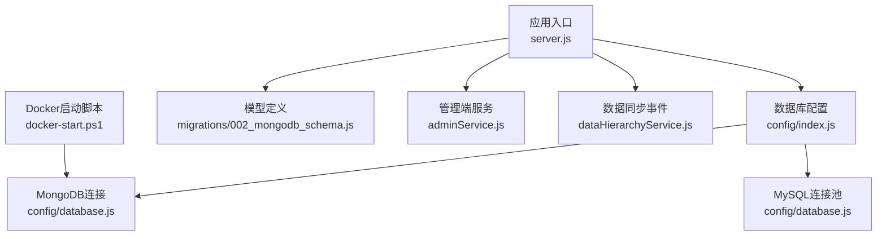
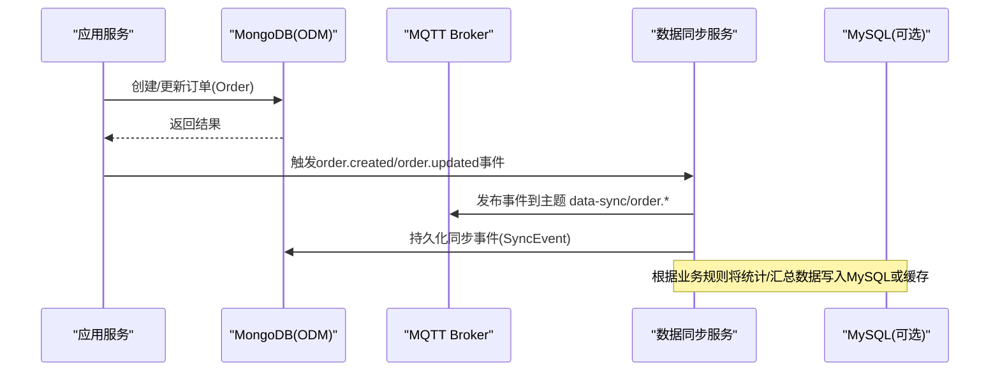
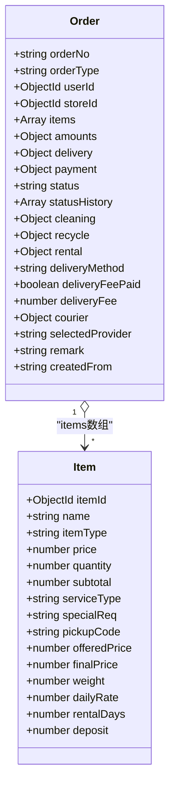
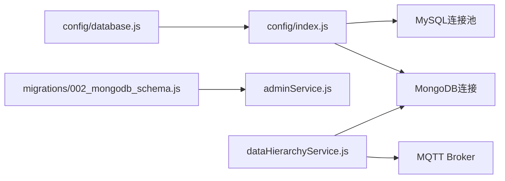
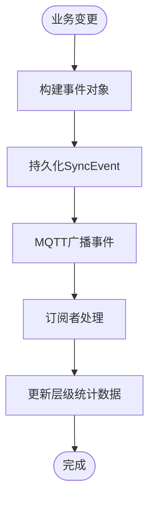

# MongoDB数据库设计

<cite>
**本文引用的文件列表**
- [backend/migrations/002_mongodb_schema.js](file://backend/migrations/002_mongodb_schema.js)
- [backend/modules/admin/services/adminService.js](file://backend/modules/admin/services/adminService.js)
- [backend/config/database.js](file://backend/config/database.js)
- [backend/config/index.js](file://backend/config/index.js)
- [backend/scripts/initDatabase.js](file://backend/scripts/initDatabase.js)
- [backend/docker-start.ps1](file://backend/docker-start.ps1)
- [backend/scripts/testConnection.js](file://backend/scripts/testConnection.js)
- [backend/modules/common/services/dataHierarchyService.js](file://backend/modules/common/services/dataHierarchyService.js)
</cite>

## 目录
1. [引言](#引言)
2. [项目结构](#项目结构)
3. [核心组件](#核心组件)
4. [架构总览](#架构总览)
5. [详细组件分析](#详细组件分析)
6. [依赖关系分析](#依赖关系分析)
7. [性能与索引优化](#性能与索引优化)
8. [聚合查询与报表模式](#聚合查询与报表模式)
9. [MySQL与MongoDB数据同步机制](#mysql与mongodb数据同步机制)
10. [副本集、备份与容量规划](#副本集备份与容量规划)
11. [Mongoose模型定义与查询最佳实践](#mongoose模型定义与查询最佳实践)
12. [故障排查指南](#故障排查指南)
13. [结论](#结论)

## 引言
本文件面向后端开发者，系统化梳理本项目中MongoDB的文档型数据设计与使用策略。重点覆盖订单详情、实时状态、设备绑定等场景的集合结构设计；阐述订单items数组的动态扩展、statusHistory状态追踪的设计；给出聚合查询、索引优化与分片策略建议；说明与MySQL的数据同步机制与一致性保证；并提供Mongoose模型定义示例与查询模式最佳实践；最后包含副本集配置、备份策略与容量规划建议，形成完整的MongoDB层面设计参考。

## 项目结构
与MongoDB相关的关键代码集中在以下位置：
- 模型与迁移：backend/migrations/002_mongodb_schema.js
- 管理端服务（含内联模型与索引）：backend/modules/admin/services/adminService.js
- 数据库连接与配置：backend/config/database.js、backend/config/index.js
- 初始化脚本与测试：backend/scripts/initDatabase.js、backend/scripts/testConnection.js
- Docker启动脚本：backend/docker-start.ps1
- 数据同步事件：backend/modules/common/services/dataHierarchyService.js

图表来源
- [backend/config/index.js:1-166](file://backend/config/index.js#L1-L166)
- [backend/config/database.js:1-65](file://backend/config/database.js#L1-L65)
- [backend/migrations/002_mongodb_schema.js:1-607](file://backend/migrations/002_mongodb_schema.js#L1-L607)
- [backend/modules/admin/services/adminService.js:1-800](file://backend/modules/admin/services/adminService.js#L1-L800)
- [backend/modules/common/services/dataHierarchyService.js:173-268](file://backend/modules/common/services/dataHierarchyService.js#L173-L268)
- [backend/docker-start.ps1:1-7](file://backend/docker-start.ps1#L1-L7)

章节来源
- [backend/config/index.js:1-166](file://backend/config/index.js#L1-L166)
- [backend/config/database.js:1-65](file://backend/config/database.js#L1-L65)
- [backend/migrations/002_mongodb_schema.js:1-607](file://backend/migrations/002_mongodb_schema.js#L1-L607)
- [backend/modules/admin/services/adminService.js:1-800](file://backend/modules/admin/services/adminService.js#L1-L800)
- [backend/modules/common/services/dataHierarchyService.js:173-268](file://backend/modules/common/services/dataHierarchyService.js#L173-L268)
- [backend/docker-start.ps1:1-7](file://backend/docker-start.ps1#L1-L7)

## 核心组件
- 用户模型（User）：支持多角色、地址、会员与信用体系、资产与余额等字段，具备常用索引。
- 门店模型（Store）：包含地理位置、营业时间、服务项、结算信息等，提供地理与状态索引。
- 物品模型（Item）：采用多态设计，通过itemType区分干洗、回收、租赁等业务域，并维护状态历史。
- 订单模型（Order）：多品类订单统一建模，包含items数组、金额明细、配送与支付信息、状态机与业务特定字段。
- 配送单模型（DeliveryOrder）：记录跑腿配送过程与轨迹。
- 消息模板（MessageTemplate）与信用记录（CreditRecord）：支撑通知与风控。

章节来源
- [backend/migrations/002_mongodb_schema.js:56-134](file://backend/migrations/002_mongodb_schema.js#L56-L134)
- [backend/migrations/002_mongodb_schema.js:142-206](file://backend/migrations/002_mongodb_schema.js#L142-L206)
- [backend/migrations/002_mongodb_schema.js:216-308](file://backend/migrations/002_mongodb_schema.js#L216-L308)
- [backend/migrations/002_mongodb_schema.js:313-483](file://backend/migrations/002_mongodb_schema.js#L313-L483)
- [backend/migrations/002_mongodb_schema.js:499-549](file://backend/migrations/002_mongodb_schema.js#L499-L549)
- [backend/migrations/002_mongodb_schema.js:557-569](file://backend/migrations/002_mongodb_schema.js#L557-L569)
- [backend/migrations/002_mongodb_schema.js:575-584](file://backend/migrations/002_mongodb_schema.js#L575-L584)

## 架构总览
系统以Node.js为后端，使用Mongoose作为MongoDB ODM，同时兼容MySQL。MongoDB用于存储灵活结构的业务文档（如订单、物品、配送单），MySQL用于强一致性的财务或主数据（视部署类型而定）。数据同步通过MQTT广播与本地事件队列实现层级数据的更新与扩散。

图表来源
- [backend/modules/common/services/dataHierarchyService.js:173-268](file://backend/modules/common/services/dataHierarchyService.js#L173-L268)
- [backend/config/index.js:1-166](file://backend/config/index.js#L1-L166)
- [backend/config/database.js:1-65](file://backend/config/database.js#L1-L65)

## 详细组件分析

### 订单集合（orders）文档模型
- 多态标识：orderType用于区分干洗、回收、租赁等订单类型，便于统一查询与路由。
- 关联关系：userId、storeId、recyclerId、deliveryOrderId等引用其他实体。
- items数组：动态扩展，每个元素包含通用字段（name、price、quantity、subtotal）与按业务域扩展的字段（serviceType、stains、dailyRate等）。
- 金额明细：amounts子文档集中存放小计、折扣、配送费、押金、服务费与总计，避免跨文档计算不一致。
- 配送信息：delivery子文档支持自提与配送两种模式，包含取送地址、预估与实际时间。
- 支付信息：payment子文档记录支付方式、交易号、支付时间与分账明细（splits）。
- 状态机：status枚举覆盖从待处理到完成/取消/退款的全生命周期，并支持租赁专用状态。
- 状态历史：statusHistory数组记录每次状态变更的时间、操作者与备注，满足审计与追溯需求。
- 业务特定：cleaning/recycle/rental子文档分别承载各业务域的专属字段。
- 索引策略：针对userId+createdAt、storeId+createdAt、orderType+status、payment.status建立复合索引，提升常见查询性能。
- 订单号生成：pre('save')钩子在保存前自动生成唯一订单号。

图表来源
- [backend/migrations/002_mongodb_schema.js:313-483](file://backend/migrations/002_mongodb_schema.js#L313-L483)

章节来源
- [backend/migrations/002_mongodb_schema.js:313-483](file://backend/migrations/002_mongodb_schema.js#L313-L483)

### 配送单集合（delivery_orders）
- 关联订单：orderId引用Order。
- 配送方式与服务商：type、courierType、provider、providerOrderId。
- 取送地址：pickupAddress与deliveryAddress均包含联系人、电话、经纬度。
- 费用与距离：fee、distance。
- 骑手信息：name、phone、avatar、经纬度、预计到达时间。
- 状态与轨迹：status枚举与track数组记录轨迹点。
- 送达时间：deliveredAt。

章节来源
- [backend/migrations/002_mongodb_schema.js:499-549](file://backend/migrations/002_mongodb_schema.js#L499-L549)

### 物品集合（items）
- 多态设计：itemType与ownerType标识物品归属与类型。
- 属性扩展：attributes包含品牌、类别、材质、颜色、尺寸、价格、重量、成色、图片与标签。
- 状态与历史：status与statusHistory记录流转与审计。
- 业务域字段：cleaning、recycle、rental分别承载业务特定信息。
- 索引：itemType+ownerId、itemType+status复合索引提升筛选效率。

章节来源
- [backend/migrations/002_mongodb_schema.js:216-308](file://backend/migrations/002_mongodb_schema.js#L216-L308)

### 用户与门店集合（users、stores）
- 用户：手机号唯一、openId稀疏索引、roles索引、地址数组、会员与信用、资产与余额、关联门店。
- 门店：名称与编码唯一、所有者与员工、地理位置、营业时间、服务项、配送设置、统计与结算、状态。

章节来源
- [backend/migrations/002_mongodb_schema.js:56-134](file://backend/migrations/002_mongodb_schema.js#L56-L134)
- [backend/migrations/002_mongodb_schema.js:142-206](file://backend/migrations/002_mongodb_schema.js#L142-L206)

### 管理端内联模型与索引（adminService）
- 内联定义了简化版Order、Store、Chain模型，便于管理端快速访问。
- 索引策略：userId+createdAt、storeId+createdAt、status、createdAt等，确保管理端报表与列表查询高效。

章节来源
- [backend/modules/admin/services/adminService.js:47-93](file://backend/modules/admin/services/adminService.js#L47-L93)
- [backend/modules/admin/services/adminService.js:96-126](file://backend/modules/admin/services/adminService.js#L96-L126)

## 依赖关系分析
- 连接层：config/index.js负责选择MongoDB或MySQL，initMongoDB()建立Mongoose连接，initMySQL()创建连接池。
- 配置层：config/database.js提供URI、选项、连接池大小、超时等参数。
- 模型层：migrations/002_mongodb_schema.js集中定义所有Mongoose Schema与索引。
- 服务层：adminService.js在管理端使用内联Schema进行CRUD与聚合统计。
- 同步层：dataHierarchyService.js基于MQTT广播事件，并将事件落库以便追踪。

图表来源
- [backend/config/index.js:1-166](file://backend/config/index.js#L1-L166)
- [backend/config/database.js:1-65](file://backend/config/database.js#L1-L65)
- [backend/migrations/002_mongodb_schema.js:1-607](file://backend/migrations/002_mongodb_schema.js#L1-L607)
- [backend/modules/admin/services/adminService.js:1-800](file://backend/modules/admin/services/adminService.js#L1-L800)
- [backend/modules/common/services/dataHierarchyService.js:173-268](file://backend/modules/common/services/dataHierarchyService.js#L173-L268)

章节来源
- [backend/config/index.js:1-166](file://backend/config/index.js#L1-L166)
- [backend/config/database.js:1-65](file://backend/config/database.js#L1-L65)
- [backend/migrations/002_mongodb_schema.js:1-607](file://backend/migrations/002_mongodb_schema.js#L1-L607)
- [backend/modules/admin/services/adminService.js:1-800](file://backend/modules/admin/services/adminService.js#L1-L800)
- [backend/modules/common/services/dataHierarchyService.js:173-268](file://backend/modules/common/services/dataHierarchyService.js#L173-L268)

## 性能与索引优化
- 订单查询优化：
  - 用户维度：{userId: 1, createdAt: -1}复合索引，支持按用户分页查看最近订单。
  - 门店维度：{storeId: 1, createdAt: -1}复合索引，支持门店运营看板。
  - 类型与状态：{orderType: 1, status: 1}复合索引，支持按业务域与状态筛选。
  - 支付状态：{payment.status: 1}索引，支持对未支付/已退款订单的快速过滤。
- 物品查询优化：
  - {itemType: 1, ownerId: 1}与{itemType: 1, status: 1}复合索引，支持按类型与所有者或状态筛选。
- 配送单优化：
  - {provider: 1, status: 1}复合索引，支持按服务商与状态检索。
- 初始化脚本中的索引清单：
  - orders集合：orderId唯一、userId、storeId、orderType、status、createdAt等索引。
  - items集合：itemId唯一、ownerId、itemType、ownerType等索引。
  - credits集合：userId唯一、createdAt倒序索引。

章节来源
- [backend/migrations/002_mongodb_schema.js:478-483](file://backend/migrations/002_mongodb_schema.js#L478-L483)
- [backend/migrations/002_mongodb_schema.js:305-308](file://backend/migrations/002_mongodb_schema.js#L305-L308)
- [backend/migrations/002_mongodb_schema.js:551](file://backend/migrations/002_mongodb_schema.js#L551)
- [backend/scripts/initDatabase.js:72-90](file://backend/scripts/initDatabase.js#L72-L90)

## 聚合查询与报表模式
- 仪表盘统计：
  - 用户总数、日活、月活、新增用户数通过countDocuments与聚合$group组合实现。
  - 订单金额统计：$sum与$avg计算总金额、今日金额与平均客单价。
  - 订单状态分布：$group按status计数。
  - 近7天趋势：$match时间范围后$group按日期字符串分组，输出每日订单量与金额。
- 数组展开分析：
  - 使用$unwind展开items数组，再按商品维度聚合数量与收入，支持TopN排行。
- 性能建议：
  - 尽早$match减少后续阶段数据量。
  - 对$match字段建立索引。
  - 使用$limit限制结果集。
  - 避免超大$group导致内存溢出。
  - 使用$project仅返回必要字段。

章节来源
- [backend/modules/admin/services/adminService.js:174-322](file://backend/modules/admin/services/adminService.js#L174-L322)

## MySQL与MongoDB数据同步机制
- 事件驱动：当用户、订单、门店发生创建或更新时，dataHierarchyService.triggerSync会构造事件对象，并通过MQTT广播至对应主题（如data-sync/order.created）。
- 事件落库：broadcastEvent内部调用logSyncEvent，将事件持久化为SyncEvent文档，便于追踪与重试。
- 层级同步：syncDataHierarchy根据eventType分发到具体同步逻辑，例如order.created/updatd会同步到门店与连锁层级，store变更会同步到连锁层级。
- 一致性保证：
  - 最终一致性：通过事件广播与异步处理，确保下游层级数据最终一致。
  - 幂等性：事件携带唯一eventId，消费端可去重处理。
  - 可观测性：SyncEvent记录状态与时间戳，便于监控与排障。

图表来源
- [backend/modules/common/services/dataHierarchyService.js:173-268](file://backend/modules/common/services/dataHierarchyService.js#L173-L268)

章节来源
- [backend/modules/common/services/dataHierarchyService.js:173-268](file://backend/modules/common/services/dataHierarchyService.js#L173-L268)

## 副本集、备份与容量规划
- 副本集配置建议：
  - 生产环境至少三节点副本集（1主2从），启用仲裁节点以提升可用性。
  - 开启WiredTiger存储引擎默认参数，合理设置journal与writeConcern。
  - 使用MONGODB_URI指向副本集连接串，并在options中配置maxPoolSize与超时参数。
- 备份策略：
  - 定期全量备份（mongodump）与增量备份（oplog快照）。
  - 恢复流程：发现可恢复时间点→列出集合→提交恢复任务→跟踪进度。
  - 注意：恢复会创建新集合名，不会覆盖原集合。
- 容量规划：
  - 估算订单文档大小（含items数组与statusHistory增长），结合日均新增量与保留周期评估磁盘空间。
  - 关注索引体积与热点集合的IOPS，必要时拆分历史数据至归档集合。
  - 监控内存使用与游标数量，避免长时间运行的聚合占用过多资源。

章节来源
- [backend/config/database.js:37-48](file://backend/config/database.js#L37-L48)
- [.codebuddy/rules/tcb/rules/cloudbase-cli/references/nosql.md:145-186](file://.codebuddy/rules/tcb/rules/cloudbase-cli/references/nosql.md#L145-L186)

## Mongoose模型定义与查询最佳实践
- 模型定义要点：
  - 使用enum约束状态与类型，降低脏数据风险。
  - 利用timestamps自动维护createdAt与updatedAt。
  - 在高频查询字段上建立合适索引，优先复合索引匹配排序顺序。
  - 使用pre('save')钩子生成业务ID（如订单号）。
- 查询模式建议：
  - 分页查询：使用skip与limit，并结合createdAt倒序索引。
  - 条件过滤：尽量精确匹配，避免全文正则扫描。
  - 投影字段：只返回必要字段，减少网络传输与序列化开销。
  - 数组操作：谨慎使用$push/$addToSet，避免无限增长的数组导致文档过大。
  - 事务：涉及多集合写操作时使用MongoDB事务，确保原子性与一致性。

章节来源
- [backend/migrations/002_mongodb_schema.js:484-493](file://backend/migrations/002_mongodb_schema.js#L484-L493)
- [backend/migrations/002_mongodb_schema.js:478-483](file://backend/migrations/002_mongodb_schema.js#L478-L483)

## 故障排查指南
- 连接问题：
  - 检查环境变量DB_TYPE与MONGODB_URI是否正确。
  - 确认MongoDB服务已启动且端口可达。
  - 使用testConnection脚本验证连接与服务器信息。
- 初始化问题：
  - 运行initDatabase脚本，确认集合与索引是否按预期创建。
- 权限与认证：
  - 若启用认证，确保URI中包含用户名密码与鉴权库。
- 性能问题：
  - 使用explain分析慢查询，检查是否命中索引。
  - 监控聚合管道阶段，避免大组与无界游标。

章节来源
- [backend/scripts/testConnection.js:1-49](file://backend/scripts/testConnection.js#L1-L49)
- [backend/scripts/initDatabase.js:1-96](file://backend/scripts/initDatabase.js#L1-L96)
- [backend/docker-start.ps1:1-7](file://backend/docker-start.ps1#L1-L7)

## 结论
本项目采用MongoDB作为主要文档数据库，围绕订单、物品、配送单等核心实体构建了灵活的文档模型与完善的索引策略。通过事件驱动的同步机制，实现了与MySQL或其他层级数据的一致性。在生产环境中，建议完善副本集与备份策略，结合聚合查询与索引优化，保障高并发与可扩展性。以上设计为后端开发者提供了清晰的MongoDB层面参考，有助于快速迭代与稳定运维。