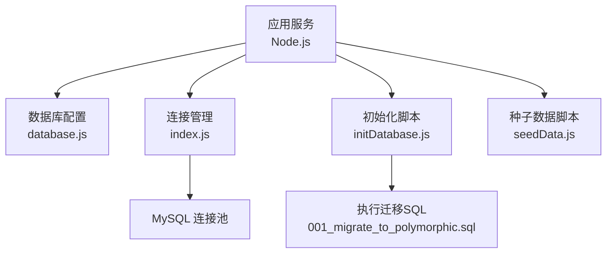
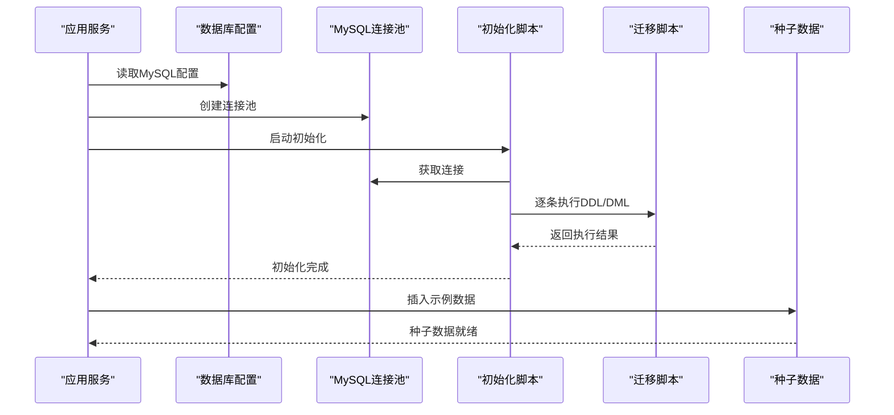
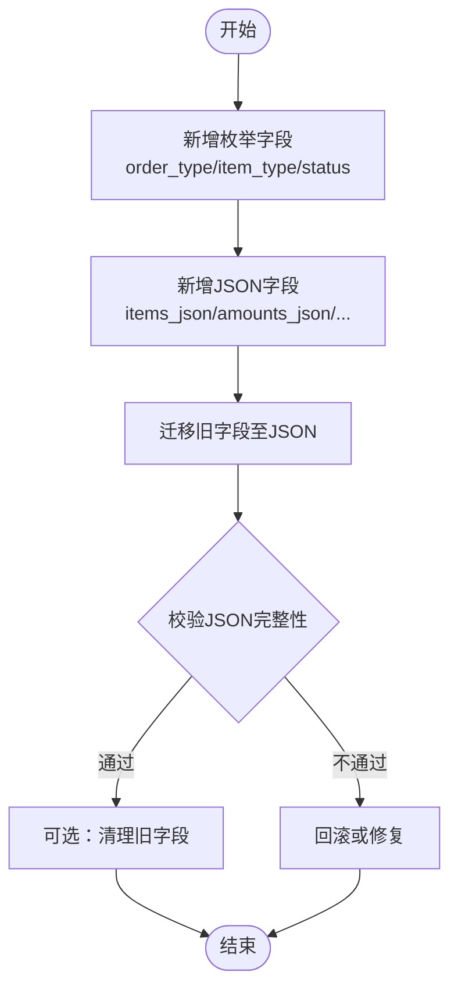
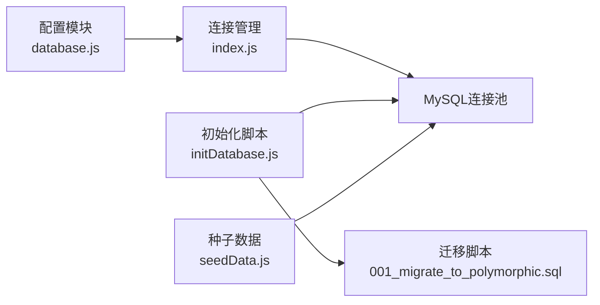
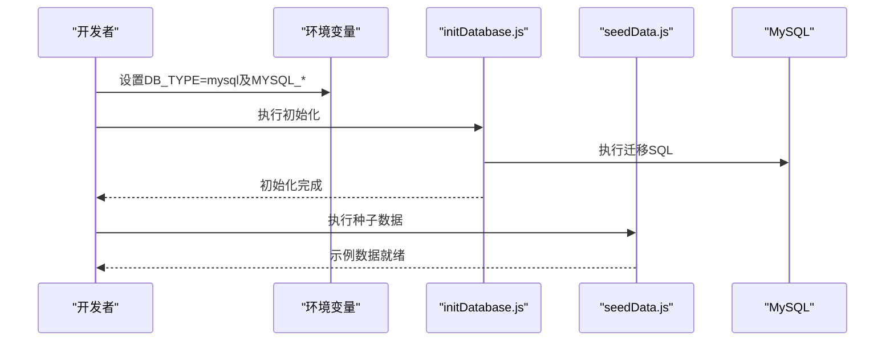

# MySQL数据库设计

<cite>
**本文引用的文件**   
- [backend/config/database.js](file://backend/config/database.js)
- [backend/config/index.js](file://backend/config/index.js)
- [backend/migrations/001_migrate_to_polymorphic.sql](file://backend/migrations/001_migrate_to_polymorphic.sql)
- [backend/scripts/initDatabase.js](file://backend/scripts/initDatabase.js)
- [backend/scripts/seedData.js](file://backend/scripts/seedData.js)
</cite>

## 目录
1. [引言](#引言)
2. [项目结构](#项目结构)
3. [核心组件](#核心组件)
4. [架构总览](#架构总览)
5. [详细组件分析](#详细组件分析)
6. [依赖关系分析](#依赖关系分析)
7. [性能与连接池配置](#性能与连接池配置)
8. [故障恢复与运维建议](#故障恢复与运维建议)
9. [结论](#结论)
10. [附录：DDL与初始化流程](#附录ddL与初始化流程)

## 引言
本文件面向数据库管理员与后端工程师，系统化梳理干洗系统中MySQL层面的数据模型、索引策略、多态扩展方案、连接池与事务机制，以及完整的DDL脚本与初始化流程。文档聚焦以下目标：
- 说明MySQL在系统中的使用场景（用户管理、门店信息、订单与支付记录等）
- 描述核心表结构与字段定义（users、stores、orders、payments、items 等）
- 解释外键关系、索引设计与查询优化策略
- 阐述多态数据模型在MySQL中的实现方式（枚举+JSON）
- 提供完整DDL脚本说明与数据初始化流程
- 给出连接池配置、性能调优参数与故障恢复机制

## 项目结构
与MySQL相关的关键位置如下：
- 数据库配置与连接池：backend/config/database.js、backend/config/index.js
- 迁移与DDL脚本：backend/migrations/001_migrate_to_polymorphic.sql
- 初始化与种子数据：backend/scripts/initDatabase.js、backend/scripts/seedData.js

图表来源
- [backend/config/database.js:1-65](file://backend/config/database.js#L1-L65)
- [backend/config/index.js:55-88](file://backend/config/index.js#L55-L88)
- [backend/scripts/initDatabase.js:96-144](file://backend/scripts/initDatabase.js#L96-L144)
- [backend/migrations/001_migrate_to_polymorphic.sql:1-310](file://backend/migrations/001_migrate_to_polymorphic.sql#L1-L310)

章节来源
- [backend/config/database.js:1-65](file://backend/config/database.js#L1-L65)
- [backend/config/index.js:55-88](file://backend/config/index.js#L55-L88)
- [backend/scripts/initDatabase.js:96-144](file://backend/scripts/initDatabase.js#L96-L144)
- [backend/migrations/001_migrate_to_polymorphic.sql:1-310](file://backend/migrations/001_migrate_to_polymorphic.sql#L1-L310)

## 核心组件
本节从业务视角梳理MySQL承载的核心实体与用途：
- 用户（users）：统一身份与角色、信用、资产、地址、会员信息等
- 门店（stores）：门店基础信息、经营属性、位置、服务、结算统计等
- 订单（orders）：清洗/回收/租赁/押金等多类型订单，包含物品明细、金额、支付、配送等
- 物品（items）：多态物品（干洗/回收/租赁），含属性与业务扩展数据
- 支付与分账（payments/payment_splits）：支付流水与分账明细
- 状态历史（order_status_history/item_status_history）：审计与可追溯性
- 配送单（delivery_orders）：取送货任务与轨迹
- 消息模板（message_templates）：多渠道通知模板

章节来源
- [backend/migrations/001_migrate_to_polymorphic.sql:169-278](file://backend/migrations/001_migrate_to_polymorphic.sql#L169-L278)
- [backend/migrations/001_migrate_to_polymorphic.sql:224-243](file://backend/migrations/001_migrate_to_polymorphic.sql#L224-L243)
- [backend/scripts/seedData.js:310-371](file://backend/scripts/seedData.js#L310-L371)

## 架构总览
下图展示MySQL在整体系统中的位置与交互：应用通过连接池访问MySQL；初始化阶段加载并执行迁移脚本；种子数据用于快速搭建测试环境。

图表来源
- [backend/config/index.js:55-88](file://backend/config/index.js#L55-L88)
- [backend/scripts/initDatabase.js:96-144](file://backend/scripts/initDatabase.js#L96-L144)
- [backend/migrations/001_migrate_to_polymorphic.sql:1-310](file://backend/migrations/001_migrate_to_polymorphic.sql#L1-L310)
- [backend/scripts/seedData.js:293-371](file://backend/scripts/seedData.js#L293-L371)

## 详细组件分析

### 用户表（users）
- 职责：存储用户主数据、角色、信用、资产、地址、会员等级等
- 多态与扩展：通过JSON字段承载灵活扩展（如roles_json、credit_json、assets_json、addresses_json、member_json）
- 关键索引：按phone、status、created_at等常用查询维度建立索引
- 典型查询：按手机号登录、按角色筛选、按会员等级统计

章节来源
- [backend/migrations/001_migrate_to_polymorphic.sql:60-79](file://backend/migrations/001_migrate_to_polymorphic.sql#L60-L79)
- [backend/scripts/seedData.js:329-344](file://backend/scripts/seedData.js#L329-L344)

### 门店表（stores）
- 职责：门店基础信息与经营属性，支持连锁/加盟/联营等业务形态
- 多态与扩展：staff_ids_json、business_json、location_json、hours_json、services_json、delivery_json、stats_json、settlement_json
- 关键索引：owner_id、status
- 典型查询：按所有者查询门店、按状态筛选、按评分/订单量统计

章节来源
- [backend/migrations/001_migrate_to_polymorphic.sql:224-243](file://backend/migrations/001_migrate_to_polymorphic.sql#L224-L243)
- [backend/scripts/seedData.js:312-324](file://backend/scripts/seedData.js#L312-L324)

### 订单表（orders）
- 职责：统一承载清洗、回收、租赁、押金等多类型订单
- 多态与扩展：
  - order_type：枚举区分订单类型
  - items_json：订单物品明细（兼容旧items表聚合迁移）
  - amounts_json：金额汇总（subtotal/discount/deliveryFee/total）
  - payment_json：支付信息（status/method/transactionId）
  - delivery_json：配送信息
- 关键索引：user_id、store_id、order_type、status、created_at
- 典型查询：按用户/门店分页、按状态/类型筛选、时间范围统计

章节来源
- [backend/migrations/001_migrate_to_polymorphic.sql:10-29](file://backend/migrations/001_migrate_to_polymorphic.sql#L10-L29)
- [backend/migrations/001_migrate_to_polymorphic.sql:85-115](file://backend/migrations/001_migrate_to_polymorphic.sql#L85-L115)
- [backend/scripts/seedData.js:349-364](file://backend/scripts/seedData.js#L349-L364)

### 物品表（items）
- 职责：多态物品主数据，支持干洗/回收/租赁等不同业务域
- 多态与扩展：
  - item_type：枚举区分物品类型
  - owner_type/owner_id：归属主体（用户/门店/品牌/回收商）
  - attributes_json/cleaning_data_json/recycle_data_json/rental_data_json：各业务域扩展
- 关键索引：item_id、owner_id、item_type、owner_type
- 典型查询：按类型/归属查询、按业务域检索

章节来源
- [backend/migrations/001_migrate_to_polymorphic.sql:31-58](file://backend/migrations/001_migrate_to_polymorphic.sql#L31-L58)
- [backend/migrations/001_migrate_to_polymorphic.sql:121-135](file://backend/migrations/001_migrate_to_polymorphic.sql#L121-L135)

### 支付与分账（payments / payment_splits）
- payments：支付流水（由订单payment_json承载，必要时可扩展独立表）
- payment_splits：分账明细（order_id、type、account_id、amount、settled等）
- 关键索引：order_id、account_id
- 典型查询：按订单/账户分账统计、未结算分账查询

章节来源
- [backend/migrations/001_migrate_to_polymorphic.sql:195-208](file://backend/migrations/001_migrate_to_polymorphic.sql#L195-L208)

### 状态历史（order_status_history / item_status_history）
- 职责：记录订单/物品的状态变更轨迹，便于审计与排障
- 关键索引：order_id/item_id、created_at
- 典型查询：按实体ID拉取状态流、按时间窗口回溯

章节来源
- [backend/migrations/001_migrate_to_polymorphic.sql:169-193](file://backend/migrations/001_migrate_to_polymorphic.sql#L169-L193)

### 配送单（delivery_orders）
- 职责：取送货任务、承运商、轨迹、费用与距离
- 关键索引：order_id、status
- 典型查询：按订单查配送、按状态筛选待处理任务

章节来源
- [backend/migrations/001_migrate_to_polymorphic.sql:245-265](file://backend/migrations/001_migrate_to_polymorphic.sql#L245-L265)

### 消息模板（message_templates）
- 职责：多渠道通知模板（微信/短信/Push等）
- 关键约束：type+event唯一
- 典型查询：按事件类型获取模板内容

章节来源
- [backend/migrations/001_migrate_to_polymorphic.sql:267-278](file://backend/migrations/001_migrate_to_polymorphic.sql#L267-L278)

### 多态数据模型在MySQL中的实现
- 使用ENUM限定核心分类（如order_type、item_type、status等），保证取值规范
- 使用JSON承载复杂/易变结构（如items_json、amounts_json、attributes_json等），兼顾灵活性与可读性
- 通过迁移脚本将旧字段数据聚合/映射到JSON，确保平滑演进

图表来源
- [backend/migrations/001_migrate_to_polymorphic.sql:10-79](file://backend/migrations/001_migrate_to_polymorphic.sql#L10-L79)
- [backend/migrations/001_migrate_to_polymorphic.sql:85-163](file://backend/migrations/001_migrate_to_polymorphic.sql#L85-L163)

## 依赖关系分析
- 应用层通过配置模块选择MySQL/MongoDB，MySQL路径下使用mysql2/promise创建连接池
- 初始化脚本负责读取并顺序执行迁移SQL，忽略“已存在”错误以保证幂等
- 种子数据脚本根据当前DB_TYPE分支执行MySQL或MongoDB的示例数据插入

图表来源
- [backend/config/database.js:1-65](file://backend/config/database.js#L1-L65)
- [backend/config/index.js:55-88](file://backend/config/index.js#L55-L88)
- [backend/scripts/initDatabase.js:96-144](file://backend/scripts/initDatabase.js#L96-L144)
- [backend/scripts/seedData.js:293-371](file://backend/scripts/seedData.js#L293-L371)

章节来源
- [backend/config/index.js:55-88](file://backend/config/index.js#L55-L88)
- [backend/scripts/initDatabase.js:96-144](file://backend/scripts/initDatabase.js#L96-L144)
- [backend/scripts/seedData.js:293-371](file://backend/scripts/seedData.js#L293-L371)

## 性能与连接池配置
- 连接池参数
  - min/max：控制最小/最大连接数，建议根据并发与CPU核数评估
  - acquireTimeout/idleTimeout：获取连接超时与空闲回收时间
  - timezone：统一时区为+08:00，避免跨时区问题
  - SSL：生产环境可启用SSL加密传输
- 事务封装
  - 提供统一的transaction方法，自动begin/commit/rollback，简化业务一致性保障
- 索引建议
  - 高频过滤字段（user_id、store_id、order_type、status、created_at）建立B-Tree索引
  - JSON字段如需频繁条件查询，考虑生成列+索引或冗余规范化字段
- 查询优化
  - 分页查询使用LIMIT/OFFSET或基于游标的翻页
  - 大对象（JSON）按需投影，避免全表扫描大字段
  - 对金额类字段使用DECIMAL，避免浮点误差

章节来源
- [backend/config/database.js:18-34](file://backend/config/database.js#L18-L34)
- [backend/config/index.js:65-88](file://backend/config/index.js#L65-L88)
- [backend/config/index.js:140-155](file://backend/config/index.js#L140-L155)

## 故障恢复与运维建议
- 幂等初始化
  - 迁移脚本使用IF NOT EXISTS与IGNORE已存在错误，支持重复执行
- 事务与回滚
  - 关键写入（订单创建、支付落库、分账记录）应包裹在事务中，异常时自动回滚
- 备份与恢复
  - 定期逻辑备份（mysqldump）与增量binlog归档；演练恢复流程
- 监控与告警
  - 监控连接池使用率、慢查询、锁等待、磁盘空间
- 灰度与回滚
  - 新增字段优先采用向后兼容（保留旧字段+新增JSON），确认稳定后再清理旧字段

章节来源
- [backend/scripts/initDatabase.js:120-137](file://backend/scripts/initDatabase.js#L120-L137)
- [backend/config/index.js:140-155](file://backend/config/index.js#L140-L155)
- [backend/migrations/001_migrate_to_polymorphic.sql:296-310](file://backend/migrations/001_migrate_to_polymorphic.sql#L296-L310)

## 结论
本设计以“枚举+JSON”的多态模式为核心，结合完善的索引与事务封装，满足干洗系统用户、门店、订单、支付、配送、消息等核心业务的灵活扩展与高性能查询需求。配合幂等的迁移与种子数据脚本，可实现快速部署与稳定演进。

## 附录：DDL与初始化流程

### 关键表清单与用途
- users：用户主数据与扩展
- stores：门店主数据与扩展
- orders：多类型订单主数据与扩展
- items：多态物品主数据与扩展
- payment_splits：分账明细
- order_status_history / item_status_history：状态历史
- delivery_orders：配送单
- message_templates：消息模板

章节来源
- [backend/migrations/001_migrate_to_polymorphic.sql:169-278](file://backend/migrations/001_migrate_to_polymorphic.sql#L169-L278)
- [backend/migrations/001_migrate_to_polymorphic.sql:224-243](file://backend/migrations/001_migrate_to_polymorphic.sql#L224-L243)

### 初始化步骤
1. 设置环境变量（DB_TYPE=mysql、MYSQL_*）
2. 运行初始化脚本，自动执行迁移SQL
3. 运行种子数据脚本，插入示例用户/门店/订单
4. 验证连接与基本查询

图表来源
- [backend/scripts/initDatabase.js:96-144](file://backend/scripts/initDatabase.js#L96-L144)
- [backend/scripts/seedData.js:293-371](file://backend/scripts/seedData.js#L293-L371)

### 连接池与事务要点
- 连接池：min/max/acquireTimeout/idleTimeout/timezone/ssl
- 事务：统一封装，自动提交/回滚，异常抛出上层处理

章节来源
- [backend/config/database.js:18-34](file://backend/config/database.js#L18-L34)
- [backend/config/index.js:65-88](file://backend/config/index.js#L65-L88)
- [backend/config/index.js:140-155](file://backend/config/index.js#L140-L155)