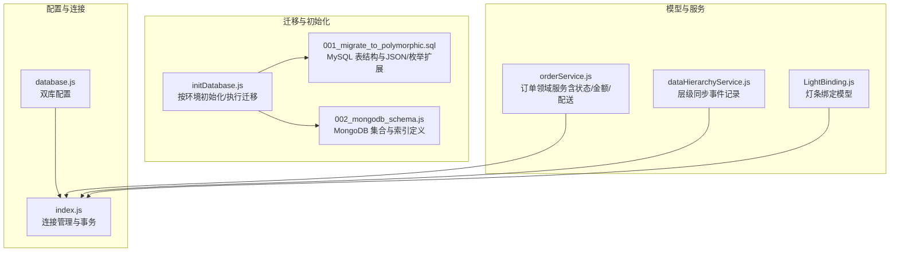
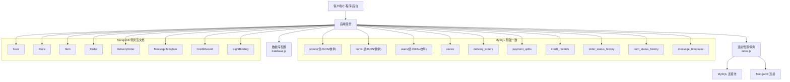
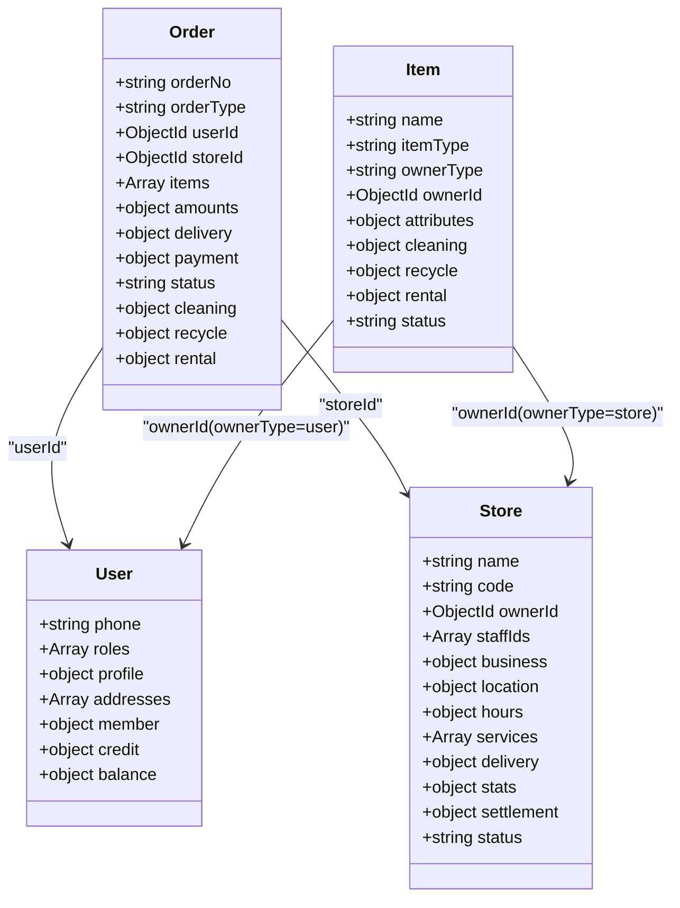
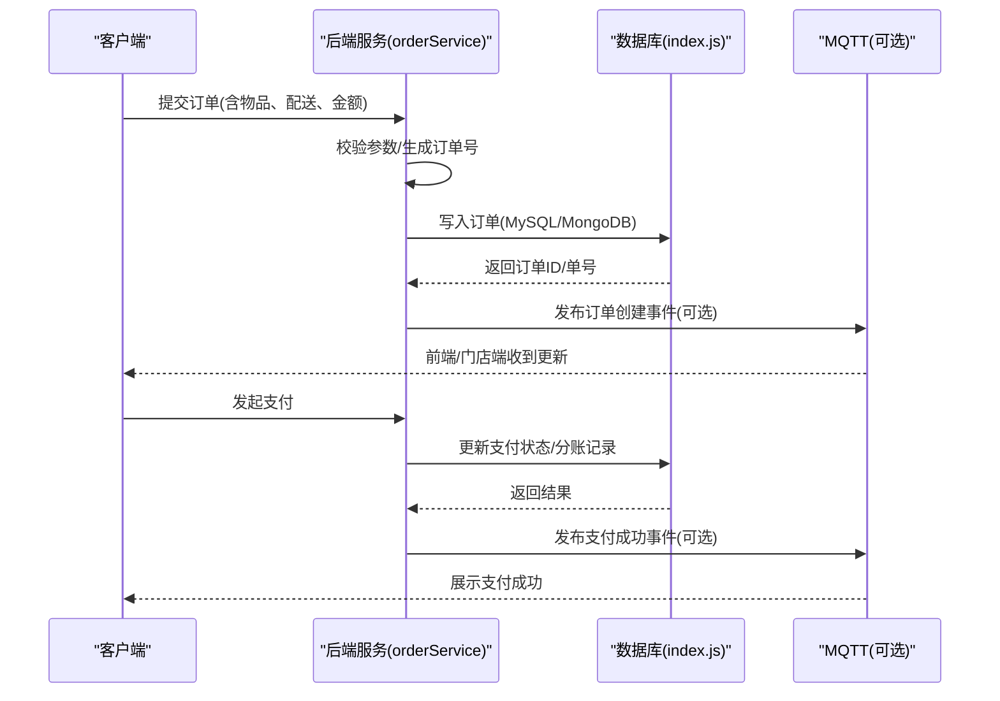
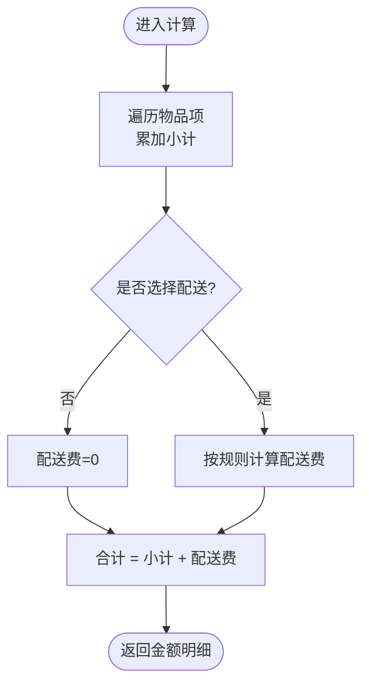
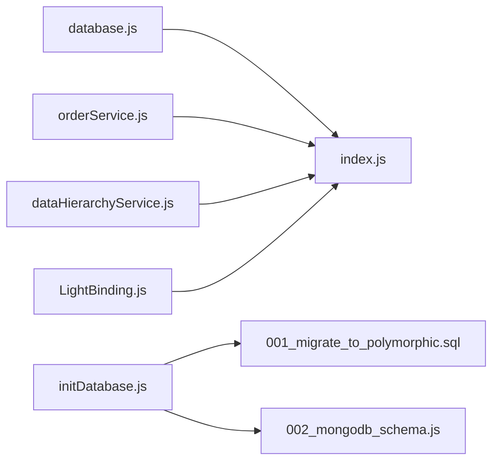

# 数据库设计

<cite>
**本文引用的文件列表**
- [backend/config/database.js](file://backend/config/database.js)
- [backend/config/index.js](file://backend/config/index.js)
- [backend/migrations/001_migrate_to_polymorphic.sql](file://backend/migrations/001_migrate_to_polymorphic.sql)
- [backend/migrations/002_mongodb_schema.js](file://backend/migrations/002_mongodb_schema.js)
- [backend/scripts/initDatabase.js](file://backend/scripts/initDatabase.js)
- [backend/models/LightBinding.js](file://backend/models/LightBinding.js)
- [backend/modules/cleaning/services/orderService.js](file://backend/modules/cleaning/services/orderService.js)
- [backend/modules/common/services/dataHierarchyService.js](file://backend/modules/common/services/dataHierarchyService.js)
- [js/cross-sync-client.js](file://js/cross-sync-client.js)
</cite>

## 目录
1. [引言](#引言)
2. [项目结构](#项目结构)
3. [核心组件](#核心组件)
4. [架构总览](#架构总览)
5. [详细组件分析](#详细组件分析)
6. [依赖关系分析](#依赖关系分析)
7. [性能与索引优化](#性能与索引优化)
8. [数据一致性与事务](#数据一致性与事务)
9. [迁移与版本管理](#迁移与版本管理)
10. [运维：备份、监控与容量规划](#运维备份监控与容量规划)
11. [故障排查指南](#故障排查指南)
12. [结论](#结论)

## 引言
本设计文档面向数据库管理员与后端开发者，系统性阐述干洗店管理系统的双数据库架构（MySQL + MongoDB）设计理念与实现策略。系统采用 MySQL 承载强一致性的关系型数据（订单、门店、支付分账、配送单等），MongoDB 承载灵活多态的文档模型（用户、物品、订单、配送单、消息模板、信用等）。通过枚举与 JSON 字段实现业务实体的可扩展性，配合完善的索引策略、查询调优与一致性机制，满足高并发、多品类扩展与快速迭代的需求。

## 项目结构
与数据库设计直接相关的代码与脚本主要位于 backend 目录下，包括配置、迁移、初始化脚本以及部分服务层对数据模型的引用。

图表来源
- [backend/config/database.js:1-65](file://backend/config/database.js#L1-L65)
- [backend/config/index.js:1-167](file://backend/config/index.js#L1-L167)
- [backend/migrations/001_migrate_to_polymorphic.sql:1-310](file://backend/migrations/001_migrate_to_polymorphic.sql#L1-L310)
- [backend/migrations/002_mongodb_schema.js:1-607](file://backend/migrations/002_mongodb_schema.js#L1-L607)
- [backend/scripts/initDatabase.js:1-148](file://backend/scripts/initDatabase.js#L1-L148)
- [backend/models/LightBinding.js:1-124](file://backend/models/LightBinding.js#L1-L124)
- [backend/modules/cleaning/services/orderService.js:78-195](file://backend/modules/cleaning/services/orderService.js#L78-L195)
- [backend/modules/common/services/dataHierarchyService.js:173-222](file://backend/modules/common/services/dataHierarchyService.js#L173-L222)

章节来源
- [backend/config/database.js:1-65](file://backend/config/database.js#L1-L65)
- [backend/config/index.js:1-167](file://backend/config/index.js#L1-L167)
- [backend/migrations/001_migrate_to_polymorphic.sql:1-310](file://backend/migrations/001_migrate_to_polymorphic.sql#L1-L310)
- [backend/migrations/002_mongodb_schema.js:1-607](file://backend/migrations/002_mongodb_schema.js#L1-L607)
- [backend/scripts/initDatabase.js:1-148](file://backend/scripts/initDatabase.js#L1-L148)

## 核心组件
- 双库配置与连接管理
  - 支持通过环境变量切换 DB_TYPE，分别初始化 MySQL 连接池与 MongoDB 连接；提供统一的事务封装与便捷查询方法。
- MySQL 迁移脚本
  - 为 orders/items/users 等核心表新增枚举与 JSON 字段，完成历史数据迁移，并创建新表（订单/物品状态历史、分账、信用、门店、配送单、消息模板等）。
- MongoDB 模型定义
  - 以 Mongoose Schema 定义 User、Store、Item、Order、DeliveryOrder、MessageTemplate、CreditRecord 等集合，包含枚举约束、复合索引与预保存钩子。
- 初始化脚本
  - 根据 DB_TYPE 自动选择初始化路径：MongoDB 输出集合清单与索引计划；MySQL 读取并顺序执行 SQL 迁移脚本。
- 领域服务与模型
  - orderService 中定义了订单状态机、配送方式、费用计算等逻辑；LightBinding 用于取件灯条绑定的持久化。

章节来源
- [backend/config/index.js:1-167](file://backend/config/index.js#L1-L167)
- [backend/migrations/001_migrate_to_polymorphic.sql:1-310](file://backend/migrations/001_migrate_to_polymorphic.sql#L1-L310)
- [backend/migrations/002_mongodb_schema.js:1-607](file://backend/migrations/002_mongodb_schema.js#L1-L607)
- [backend/scripts/initDatabase.js:1-148](file://backend/scripts/initDatabase.js#L1-L148)
- [backend/modules/cleaning/services/orderService.js:78-195](file://backend/modules/cleaning/services/orderService.js#L78-L195)
- [backend/models/LightBinding.js:1-124](file://backend/models/LightBinding.js#L1-L124)

## 架构总览
双数据库架构将“强一致的关系型数据”与“灵活的文档数据”解耦，兼顾交易安全与扩展性。

图表来源
- [backend/config/database.js:1-65](file://backend/config/database.js#L1-L65)
- [backend/config/index.js:1-167](file://backend/config/index.js#L1-L167)
- [backend/migrations/001_migrate_to_polymorphic.sql:1-310](file://backend/migrations/001_migrate_to_polymorphic.sql#L1-L310)
- [backend/migrations/002_mongodb_schema.js:1-607](file://backend/migrations/002_mongodb_schema.js#L1-L607)

## 详细组件分析

### 双数据库架构与选型理由
- MySQL 用于关系型数据
  - 优势：ACID 事务、外键约束、复杂关联查询、报表统计稳定可靠。
  - 适用场景：订单主记录、支付分账、配送单、门店信息、状态历史等需要强一致的数据。
- MongoDB 用于文档存储
  - 优势：Schema-less 灵活性、嵌套对象友好、水平扩展能力强、适合快速迭代与多品类扩展。
  - 适用场景：用户画像、物品多态属性、订单多态明细、配送轨迹、消息模板、信用日志等。

章节来源
- [backend/config/database.js:1-65](file://backend/config/database.js#L1-L65)
- [backend/config/index.js:1-167](file://backend/config/index.js#L1-L167)

### 多态数据模型设计（枚举 + JSON）
- 订单多态
  - MySQL：在 orders 表增加 order_type 枚举与 items_json、amounts_json、payment_json、delivery_json 等 JSON 字段，兼容旧列并逐步迁移。
  - MongoDB：Order 文档使用 orderType 枚举，并在 items、amounts、delivery、payment、cleaning/recycle/rental 等业务域内嵌结构化字段。
- 物品多态
  - MySQL：items 表新增 item_type、owner_type、owner_id、attributes_json、cleaning_data_json、recycle_data_json、rental_data_json。
  - MongoDB：Item 文档使用 itemType/ownerType/ownerId 标识，并通过 cleaning/recycle/rental 等子文档承载不同品类的专属属性。
- 用户多态
  - MySQL：users 表新增 roles_json、credit_json、assets_json、addresses_json、member_json 等。
  - MongoDB：User 文档内置 roles、profile、addresses、member、credit、balance 等丰富结构。

图表来源
- [backend/migrations/002_mongodb_schema.js:56-607](file://backend/migrations/002_mongodb_schema.js#L56-L607)
- [backend/migrations/001_migrate_to_polymorphic.sql:10-79](file://backend/migrations/001_migrate_to_polymorphic.sql#L10-L79)

章节来源
- [backend/migrations/001_migrate_to_polymorphic.sql:10-79](file://backend/migrations/001_migrate_to_polymorphic.sql#L10-L79)
- [backend/migrations/002_mongodb_schema.js:56-607](file://backend/migrations/002_mongodb_schema.js#L56-L607)

### 核心数据表/集合结构说明
- MySQL 侧
  - orders：订单主记录，新增 order_type 及多个 JSON 字段，保留向后兼容；新增 order_status_history 记录状态变更。
  - items：物品主记录，新增 item_type、owner_type、owner_id 与多类 JSON 字段。
  - users：用户主记录，新增 roles_json、credit_json、assets_json、addresses_json、member_json。
  - stores：门店信息，含位置、营业时间、服务、配送、结算等 JSON 聚合字段。
  - delivery_orders：配送单，含取/送地址、承运商、轨迹、费用、状态等。
  - payment_splits：分账记录，支持多账户分润与结算状态。
  - credit_records：信用变更记录。
  - message_templates：消息模板，支持多渠道推送。
- MongoDB 侧
  - User/Store/Item/Order/DeliveryOrder/MessageTemplate/CreditRecord 均提供完整 Schema 定义与索引。
  - LightBinding：订单-灯条绑定记录，支持取件、紧急查找、批量提醒等场景。

章节来源
- [backend/migrations/001_migrate_to_polymorphic.sql:169-310](file://backend/migrations/001_migrate_to_polymorphic.sql#L169-L310)
- [backend/migrations/002_mongodb_schema.js:142-607](file://backend/migrations/002_mongodb_schema.js#L142-L607)
- [backend/models/LightBinding.js:1-124](file://backend/models/LightBinding.js#L1-L124)

### 关键流程时序（示例：下单与支付）

图表来源
- [backend/modules/cleaning/services/orderService.js:177-195](file://backend/modules/cleaning/services/orderService.js#L177-L195)
- [backend/config/index.js:138-155](file://backend/config/index.js#L138-L155)
- [backend/modules/common/services/dataHierarchyService.js:173-222](file://backend/modules/common/services/dataHierarchyService.js#L173-L222)

章节来源
- [backend/modules/cleaning/services/orderService.js:177-195](file://backend/modules/cleaning/services/orderService.js#L177-L195)
- [backend/config/index.js:138-155](file://backend/config/index.js#L138-L155)
- [backend/modules/common/services/dataHierarchyService.js:173-222](file://backend/modules/common/services/dataHierarchyService.js#L173-L222)

### 复杂逻辑流程图（示例：金额与配送费计算）

图表来源
- [backend/modules/cleaning/services/pricingService.js:139-143](file://backend/modules/cleaning/services/pricingService.js#L139-L143)

章节来源
- [backend/modules/cleaning/services/pricingService.js:139-143](file://backend/modules/cleaning/services/pricingService.js#L139-L143)

## 依赖关系分析
- 配置层
  - database.js 提供 MySQL/MongoDB/Redis 配置常量；index.js 负责连接生命周期与事务封装。
- 迁移与初始化
  - initDatabase.js 根据 DB_TYPE 调用对应初始化逻辑；MySQL 路径会读取并执行 SQL 迁移脚本。
- 模型与服务
  - orderService 使用连接管理进行读写；dataHierarchyService 记录同步事件；LightBinding 独立模型用于灯条绑定。

图表来源
- [backend/config/database.js:1-65](file://backend/config/database.js#L1-L65)
- [backend/config/index.js:1-167](file://backend/config/index.js#L1-L167)
- [backend/scripts/initDatabase.js:1-148](file://backend/scripts/initDatabase.js#L1-L148)
- [backend/modules/cleaning/services/orderService.js:177-195](file://backend/modules/cleaning/services/orderService.js#L177-L195)
- [backend/modules/common/services/dataHierarchyService.js:173-222](file://backend/modules/common/services/dataHierarchyService.js#L173-L222)
- [backend/models/LightBinding.js:1-124](file://backend/models/LightBinding.js#L1-L124)

章节来源
- [backend/config/database.js:1-65](file://backend/config/database.js#L1-L65)
- [backend/config/index.js:1-167](file://backend/config/index.js#L1-L167)
- [backend/scripts/initDatabase.js:1-148](file://backend/scripts/initDatabase.js#L1-L148)

## 性能与索引优化
- MySQL 索引建议
  - orders：order_no、user_id、store_id、status、created_at 建立合适索引；JSON 字段查询尽量结合生成列或冗余字段提升性能。
  - items：item_type、owner_type、owner_id、status 建立索引；清洗/回收/租赁相关 JSON 字段按需建函数索引或冗余列。
  - stores：owner_id、status、location 经纬度可考虑空间索引。
  - delivery_orders：order_id、status、provider 建立索引。
  - payment_splits：order_id、account_id 建立索引。
  - credit_records：user_id、created_at 建立索引。
- MongoDB 索引
  - User：phone、openId、roles、createdAt 等常用查询字段。
  - Store：ownerId、status、location 坐标。
  - Item：itemType、ownerType、ownerId、status 复合索引。
  - Order：userId、storeId、orderType、status、payment.status、createdAt 等。
  - DeliveryOrder：orderId、provider、status。
  - CreditRecord：userId、createdAt。
  - LightBinding：storeId+status、activatedAt、orderId+itemIndex+status 复合索引。

章节来源
- [backend/migrations/001_migrate_to_polymorphic.sql:169-310](file://backend/migrations/001_migrate_to_polymorphic.sql#L169-L310)
- [backend/migrations/002_mongodb_schema.js:136-607](file://backend/migrations/002_mongodb_schema.js#L136-L607)
- [backend/models/LightBinding.js:84-88](file://backend/models/LightBinding.js#L84-L88)

## 数据一致性与事务
- MySQL 事务
  - 通过 index.js 提供的 transaction 封装，确保订单、支付、分账等关键操作的原子性。
- 跨库一致性
  - 建议采用最终一致性方案：先写 MySQL（强一致），再通过事件（如 MQTT）异步同步到 MongoDB 或其他系统；必要时引入补偿任务与幂等处理。
- 状态追踪
  - 使用 order_status_history/item_status_history 记录状态变迁，便于审计与回溯。

章节来源
- [backend/config/index.js:138-155](file://backend/config/index.js#L138-L155)
- [backend/migrations/001_migrate_to_polymorphic.sql:169-193](file://backend/migrations/001_migrate_to_polymorphic.sql#L169-L193)

## 迁移与版本管理
- 迁移脚本
  - 001_migrate_to_polymorphic.sql：为现有表添加多态字段与 JSON 字段，迁移历史数据，并创建新表与初始消息模板。
  - 002_mongodb_schema.js：定义 MongoDB 集合 Schema、索引与预保存钩子。
- 初始化流程
  - initDatabase.js 根据 DB_TYPE 选择路径：MongoDB 打印集合与索引计划；MySQL 读取并顺序执行 SQL 语句。
- 版本管理策略
  - 迁移脚本命名遵循“序号_描述”规范，保证可重复执行与幂等性；生产环境建议在低峰期执行，并配合回滚预案。

章节来源
- [backend/migrations/001_migrate_to_polymorphic.sql:1-310](file://backend/migrations/001_migrate_to_polymorphic.sql#L1-L310)
- [backend/migrations/002_mongodb_schema.js:1-607](file://backend/migrations/002_mongodb_schema.js#L1-L607)
- [backend/scripts/initDatabase.js:1-148](file://backend/scripts/initDatabase.js#L1-L148)

## 运维：备份、监控与容量规划
- 备份与恢复
  - MySQL：定期全量+增量备份，重点保护 orders、payment_splits、delivery_orders、stores 等核心表；恢复前需验证迁移脚本兼容性。
  - MongoDB：定期快照/导出，关注大集合（Order、Item）与高频写入集合（CreditRecord、LightBinding）。
- 监控与告警
  - 连接池健康：MySQL 连接数、等待时间；MongoDB 连接状态与慢查询。
  - 业务指标：订单创建/支付成功率、配送单状态分布、分账结算延迟。
  - 跨端同步：MQTT 在线客户端数量、操作事件积压情况。
- 容量规划
  - 预估日增订单量与附件大小，评估 JSON 字段膨胀风险；对热点表（orders、delivery_orders）进行分区或归档策略。
  - 针对地理位置查询（门店附近推荐）启用空间索引与缓存。

[本节为通用运维建议，不直接分析具体文件]

## 故障排查指南
- 连接问题
  - 检查 DB_TYPE 与环境变量；确认 MySQL 端口/SSL 与 MongoDB URI 正确。
- 迁移失败
  - 核对 SQL 语法与权限；确认已存在表/字段的幂等处理；查看 initDatabase.js 的执行日志。
- 查询缓慢
  - 分析 MySQL EXPLAIN 与 MongoDB explain；确认缺失索引或 JSON 字段未命中索引。
- 跨端不同步
  - 检查 MQTT 连通性与心跳；查看 crossSyncService 的操作记录与最近事件。

章节来源
- [backend/config/database.js:1-65](file://backend/config/database.js#L1-L65)
- [backend/config/index.js:1-167](file://backend/config/index.js#L1-L167)
- [backend/scripts/initDatabase.js:1-148](file://backend/scripts/initDatabase.js#L1-L148)
- [js/cross-sync-client.js:1-42](file://js/cross-sync-client.js#L1-L42)

## 结论
本设计通过 MySQL 与 MongoDB 的双库协同，既保证了交易与财务数据的强一致，又利用文档数据库的灵活性支撑多品类与快速演进的业务形态。借助枚举与 JSON 的多态建模、完善的索引与事务封装、以及清晰的迁移与初始化流程，系统在可维护性、可扩展性与性能之间取得良好平衡。后续可在跨库一致性、监控告警与容量治理方面持续完善，进一步提升稳定性与可观测性。