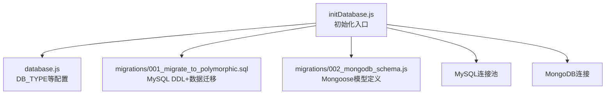
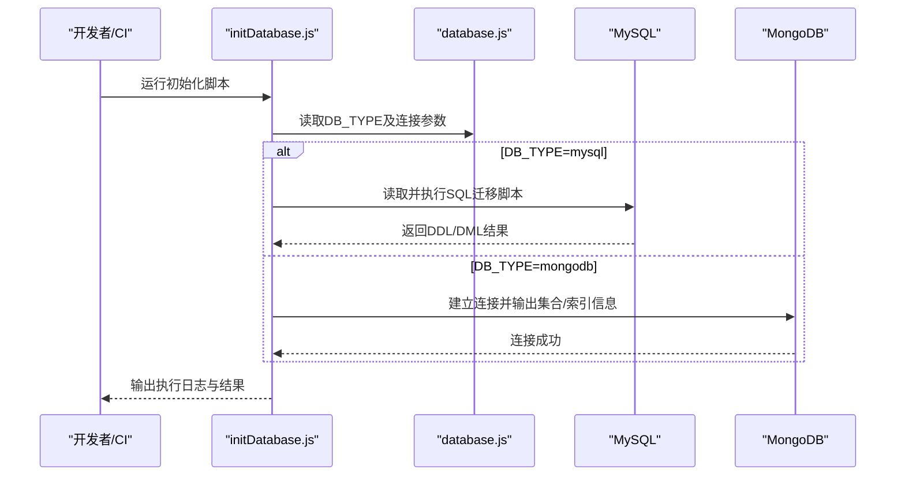
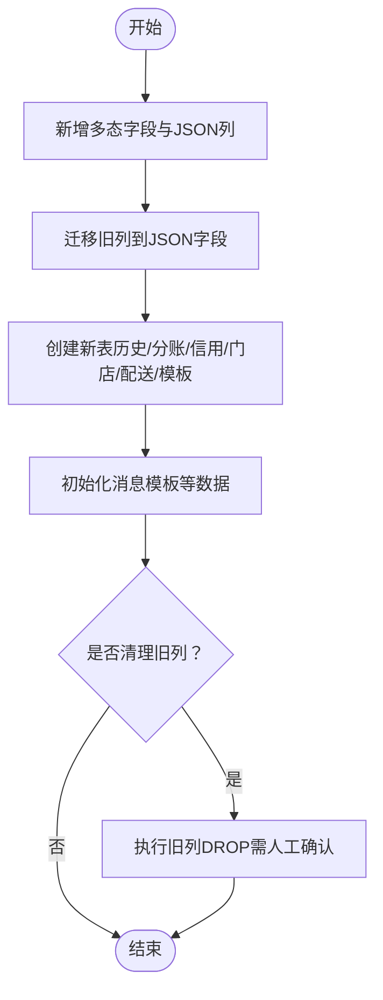
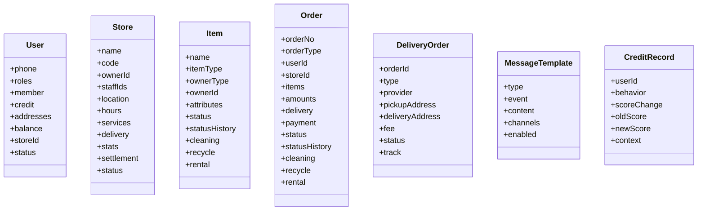
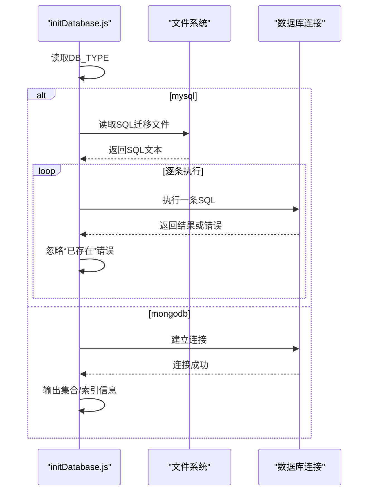
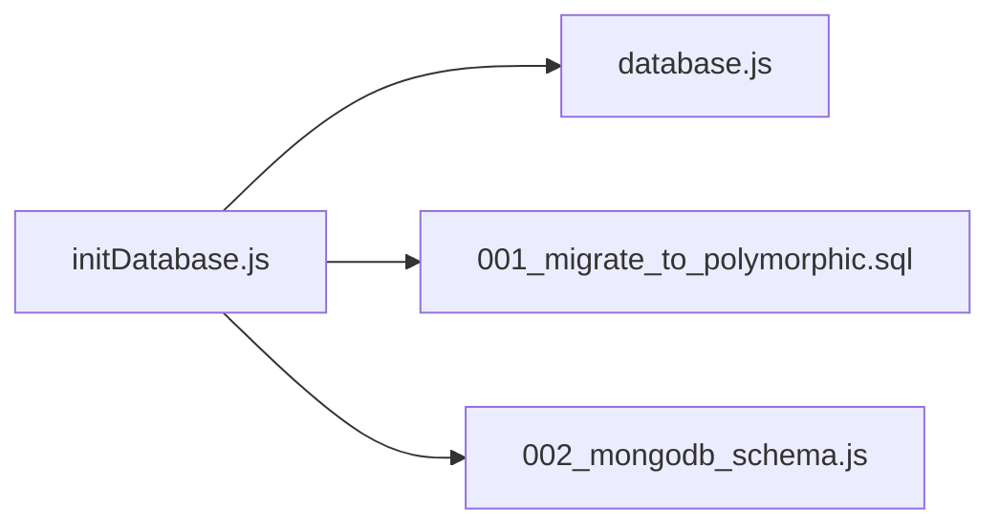

# 数据库迁移策略

<cite>
**本文引用的文件**   
- [backend/migrations/001_migrate_to_polymorphic.sql](file://backend/migrations/001_migrate_to_polymorphic.sql)
- [backend/migrations/002_mongodb_schema.js](file://backend/migrations/002_mongodb_schema.js)
- [backend/scripts/initDatabase.js](file://backend/scripts/initDatabase.js)
- [backend/config/database.js](file://backend/config/database.js)
</cite>

## 目录
1. [简介](#简介)
2. [项目结构](#项目结构)
3. [核心组件](#核心组件)
4. [架构总览](#架构总览)
5. [详细组件分析](#详细组件分析)
6. [依赖关系分析](#依赖关系分析)
7. [性能与容量规划](#性能与容量规划)
8. [故障排查指南](#故障排查指南)
9. [结论](#结论)
10. [附录](#附录)

## 简介
本文件面向运维人员与DBA，系统化阐述仓库中的数据库迁移策略与落地实践。内容覆盖：
- 版本控制下的数据库变更管理机制（SQL迁移脚本与JavaScript模型定义）
- 命名规范、执行顺序与回滚策略
- 多态数据模型从传统表结构到灵活JSON字段的演进路径
- 迁移工具使用方法（环境切换、批量执行、错误处理）
- 数据完整性检查、增量更新与零停机部署建议
- 迁移测试、监控告警与生产发布流程

## 项目结构
与数据库迁移相关的核心位置如下：
- SQL迁移脚本：backend/migrations/001_migrate_to_polymorphic.sql
- MongoDB模型定义（用于集合结构与索引的约定式创建）：backend/migrations/002_mongodb_schema.js
- 初始化入口脚本（按环境变量选择MySQL或MongoDB并执行迁移/初始化）：backend/scripts/initDatabase.js
- 数据库配置与环境变量来源：backend/config/database.js

图示来源
- [backend/scripts/initDatabase.js:1-148](file://backend/scripts/initDatabase.js#L1-L148)
- [backend/config/database.js:1-65](file://backend/config/database.js#L1-L65)
- [backend/migrations/001_migrate_to_polymorphic.sql:1-310](file://backend/migrations/001_migrate_to_polymorphic.sql#L1-L310)
- [backend/migrations/002_mongodb_schema.js:1-607](file://backend/migrations/002_mongodb_schema.js#L1-L607)

章节来源
- [backend/scripts/initDatabase.js:1-148](file://backend/scripts/initDatabase.js#L1-L148)
- [backend/config/database.js:1-65](file://backend/config/database.js#L1-L65)

## 核心组件
- MySQL迁移脚本（001_migrate_to_polymorphic.sql）
  - 通过ALTER TABLE为orders/items/users新增多态标识与JSON字段，保持向后兼容
  - 将旧列数据迁移至JSON字段（items_json、amounts_json、payment_json、attributes_json等）
  - 新建辅助表（订单/物品状态历史、分账记录、信用记录、门店、配送单、消息模板等）
  - 提供可选的旧字段清理注释段，便于确认迁移成功后再执行
- MongoDB模型定义（002_mongodb_schema.js）
  - 使用Mongoose定义User/Store/Item/Order/DeliveryOrder/MessageTemplate/CreditRecord等模型
  - 明确枚举、索引与时间戳，支撑多品类与多态业务
- 初始化脚本（initDatabase.js）
  - 根据DB_TYPE选择MySQL或MongoDB
  - MySQL：读取并逐条执行SQL迁移脚本；忽略“已存在”错误以支持幂等
  - MongoDB：打印集合清单与索引说明（实际索引由驱动在首次写入时创建）
- 数据库配置（database.js）
  - DB_TYPE决定后端使用的数据库类型
  - 提供MySQL/MongoDB/Redis的连接参数与时区等选项

章节来源
- [backend/migrations/001_migrate_to_polymorphic.sql:1-310](file://backend/migrations/001_migrate_to_polymorphic.sql#L1-L310)
- [backend/migrations/002_mongodb_schema.js:1-607](file://backend/migrations/002_mongodb_schema.js#L1-L607)
- [backend/scripts/initDatabase.js:1-148](file://backend/scripts/initDatabase.js#L1-L148)
- [backend/config/database.js:1-65](file://backend/config/database.js#L1-L65)

## 架构总览
下图展示迁移执行的总体流程：初始化脚本读取配置，按数据库类型分别执行SQL迁移或加载MongoDB模型。

图示来源
- [backend/scripts/initDatabase.js:1-148](file://backend/scripts/initDatabase.js#L1-L148)
- [backend/config/database.js:1-65](file://backend/config/database.js#L1-L65)

## 详细组件分析

### 组件一：MySQL迁移脚本（001_migrate_to_polymorphic.sql）
- 设计目标
  - 渐进式演进：先加字段与JSON列，再做数据迁移，最后可清理旧列
  - 多态建模：引入order_type/item_type/owner_type等标识，配合JSON承载扩展属性
- 关键步骤
  - 新增多态字段与JSON列（保持向后兼容）
  - 数据迁移：将旧列聚合/映射到新JSON字段
  - 创建新表：状态历史、分账、信用、门店、配送单、消息模板等
  - 初始化数据：插入默认消息模板
  - 可选清理：注释掉旧列DROP语句，待验证后手动执行
- 命名与顺序
  - 文件名采用数字前缀排序（001_...），确保执行顺序稳定
- 回滚策略
  - 当前脚本未包含显式回滚逻辑；建议在上线前对大表UPDATE进行分批与事务控制，必要时结合备份恢复
- 幂等性
  - 多处使用IF NOT EXISTS与条件判断，避免重复执行报错

图示来源
- [backend/migrations/001_migrate_to_polymorphic.sql:1-310](file://backend/migrations/001_migrate_to_polymorphic.sql#L1-L310)

章节来源
- [backend/migrations/001_migrate_to_polymorphic.sql:1-310](file://backend/migrations/001_migrate_to_polymorphic.sql#L1-L310)

### 组件二：MongoDB模型定义（002_mongodb_schema.js）
- 设计要点
  - 使用Mongoose Schema定义用户、门店、物品、订单、配送单、消息模板、信用记录等
  - 通过枚举约束与索引提升查询性能与一致性
  - 订单与物品均体现多态（orderType/itemType），并按业务域组织子文档
- 导出接口
  - 导出各模型供应用层使用

图示来源
- [backend/migrations/002_mongodb_schema.js:1-607](file://backend/migrations/002_mongodb_schema.js#L1-L607)

章节来源
- [backend/migrations/002_mongodb_schema.js:1-607](file://backend/migrations/002_mongodb_schema.js#L1-L607)

### 组件三：初始化脚本（initDatabase.js）
- 功能概述
  - 根据DB_TYPE选择MySQL或MongoDB
  - MySQL：读取SQL文件，按分号拆分并逐条执行，捕获并忽略“已存在”错误，保证幂等
  - MongoDB：输出集合与索引信息，提示索引将在首次写入时自动创建
- 执行顺序
  - 仅发现并执行单一SQL文件（001_migrate_to_polymorphic.sql）
  - 若缺失则提示手动执行
- 错误处理
  - 捕获异常并输出警告，不中断整体流程（除致命错误外）

图示来源
- [backend/scripts/initDatabase.js:1-148](file://backend/scripts/initDatabase.js#L1-L148)

章节来源
- [backend/scripts/initDatabase.js:1-148](file://backend/scripts/initDatabase.js#L1-L148)

### 组件四：数据库配置（database.js）
- 作用
  - 集中管理DB_TYPE、MySQL/MongoDB/Redis连接参数与时区等
- 关键点
  - DB_TYPE决定初始化脚本分支
  - MySQL连接池大小、SSL、时区等可按环境调整

章节来源
- [backend/config/database.js:1-65](file://backend/config/database.js#L1-L65)

## 依赖关系分析
- initDatabase.js依赖database.js获取连接参数与DB_TYPE
- initDatabase.js在MySQL分支下依赖SQL迁移脚本
- initDatabase.js在MongoDB分支下依赖模型定义文件（导入导出模型）

图示来源
- [backend/scripts/initDatabase.js:1-148](file://backend/scripts/initDatabase.js#L1-L148)
- [backend/config/database.js:1-65](file://backend/config/database.js#L1-L65)
- [backend/migrations/001_migrate_to_polymorphic.sql:1-310](file://backend/migrations/001_migrate_to_polymorphic.sql#L1-L310)
- [backend/migrations/002_mongodb_schema.js:1-607](file://backend/migrations/002_mongodb_schema.js#L1-L607)

章节来源
- [backend/scripts/initDatabase.js:1-148](file://backend/scripts/initDatabase.js#L1-L148)
- [backend/config/database.js:1-65](file://backend/config/database.js#L1-L65)

## 性能与容量规划
- 大表UPDATE风险
  - 全表扫描与锁竞争可能引发延迟，建议分批提交与限流
- JSON字段查询优化
  - 针对高频查询键建立虚拟列或冗余索引，避免全表解析JSON
- 索引策略
  - MySQL：为常用过滤/排序列添加索引
  - MongoDB：利用Schema中定义的复合索引与地理空间索引
- 连接池与超时
  - 根据并发规模调整MySQL连接池与MongoDB maxPoolSize、超时参数

[本节为通用指导，无需特定文件引用]

## 故障排查指南
- 常见现象与定位
  - 初始化失败：查看initDatabase.js输出的错误日志，确认DB_TYPE与连接参数
  - SQL执行异常：关注“⚠️ SQL 执行警告”，核对字段/表是否存在、权限是否足够
  - 幂等问题：部分DDL已存在会触发错误，当前实现忽略“already exists”，如仍失败请检查具体错误信息
- 回退建议
  - 在执行前完成备份；如需回退，优先使用备份快照或时间点恢复
- 验证手段
  - 执行前后对比关键表行数、JSON字段非空率、索引命中情况

章节来源
- [backend/scripts/initDatabase.js:96-144](file://backend/scripts/initDatabase.js#L96-L144)

## 结论
本项目采用“渐进式+幂等”的迁移策略：通过SQL脚本在现有表上增加多态标识与JSON字段，逐步过渡到更灵活的模型；同时以Mongoose模型定义MongoDB侧的结构与索引。初始化脚本按环境变量选择数据库类型并执行相应迁移。为保障稳定性，建议在生产环境引入完整的迁移编排、事务控制、备份与回滚机制，并结合监控与灰度发布降低风险。

[本节为总结性内容，无需特定文件引用]

## 附录

### 命名规范与执行顺序
- 命名规范
  - 使用“序号_描述”形式，例如：001_migrate_to_polymorphic.sql
- 执行顺序
  - 按文件名字典序执行，确保依赖关系正确
- 幂等性
  - 使用IF NOT EXISTS、条件判断与忽略“已存在”错误，使脚本可重复执行

章节来源
- [backend/migrations/001_migrate_to_polymorphic.sql:1-310](file://backend/migrations/001_migrate_to_polymorphic.sql#L1-L310)
- [backend/scripts/initDatabase.js:100-141](file://backend/scripts/initDatabase.js#L100-L141)

### 回滚策略
- 当前状态
  - 脚本未内置反向操作；建议结合备份恢复
- 推荐做法
  - 变更前创建快照或逻辑备份
  - 对大表变更采用分批提交与窗口期控制
  - 准备最小化回滚SQL（删除新增列/表、还原数据）

章节来源
- [backend/migrations/001_migrate_to_polymorphic.sql:296-310](file://backend/migrations/001_migrate_to_polymorphic.sql#L296-L310)
- [backend/scripts/initDatabase.js:120-137](file://backend/scripts/initDatabase.js#L120-L137)

### 多态数据模型演进路径
- 阶段一：保留旧列，新增多态标识与JSON字段（向后兼容）
- 阶段二：数据迁移，将旧列值填充至JSON字段
- 阶段三：创建新表（历史、分账、信用、门店、配送、模板等）
- 阶段四：可选清理旧列（需人工确认）

章节来源
- [backend/migrations/001_migrate_to_polymorphic.sql:6-164](file://backend/migrations/001_migrate_to_polymorphic.sql#L6-L164)
- [backend/migrations/001_migrate_to_polymorphic.sql:165-295](file://backend/migrations/001_migrate_to_polymorphic.sql#L165-L295)
- [backend/migrations/001_migrate_to_polymorphic.sql:296-310](file://backend/migrations/001_migrate_to_polymorphic.sql#L296-L310)

### 迁移工具使用方法
- 环境切换
  - 设置DB_TYPE为mysql或mongodb，影响初始化脚本分支
- 批量执行
  - 运行初始化脚本，自动读取并执行SQL迁移文件
- 错误处理
  - 捕获并忽略“已存在”错误，其他错误输出警告并继续

章节来源
- [backend/config/database.js:6-8](file://backend/config/database.js#L6-L8)
- [backend/scripts/initDatabase.js:18-27](file://backend/scripts/initDatabase.js#L18-L27)
- [backend/scripts/initDatabase.js:100-141](file://backend/scripts/initDatabase.js#L100-L141)

### 数据完整性检查与增量更新
- 完整性检查
  - 校验JSON字段非空率、枚举值范围、关联ID有效性
- 增量更新
  - 新增迁移文件编号递增，保持幂等与顺序
  - 对大表变更分批提交，避免长时间锁表

章节来源
- [backend/migrations/001_migrate_to_polymorphic.sql:82-164](file://backend/migrations/001_migrate_to_polymorphic.sql#L82-L164)

### 零停机部署策略
- 双写与灰度
  - 新旧结构并存期间，逐步切读/写流量
- 只读迁移
  - 先做只读校验（统计行数、抽样比对），再执行写操作
- 快速回退
  - 基于快照/时间点恢复，缩短RTO

[本节为通用指导，无需特定文件引用]

### 迁移测试、监控告警与生产发布流程
- 测试
  - 在预发环境完整执行迁移脚本，验证数据一致性与查询性能
- 监控
  - 关注慢查询、锁等待、行级锁冲突与JSON解析开销
- 发布
  - 变更前备份，变更后验证关键指标，必要时灰度放量

[本节为通用指导，无需特定文件引用]