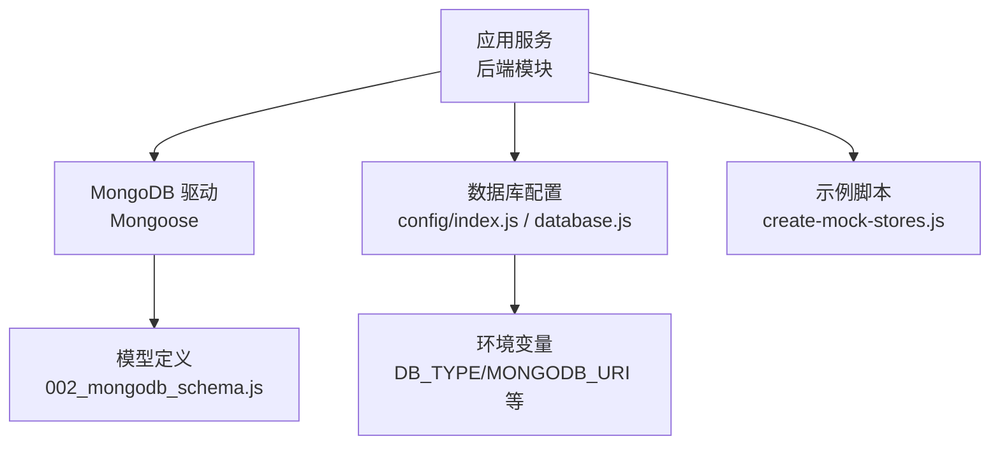
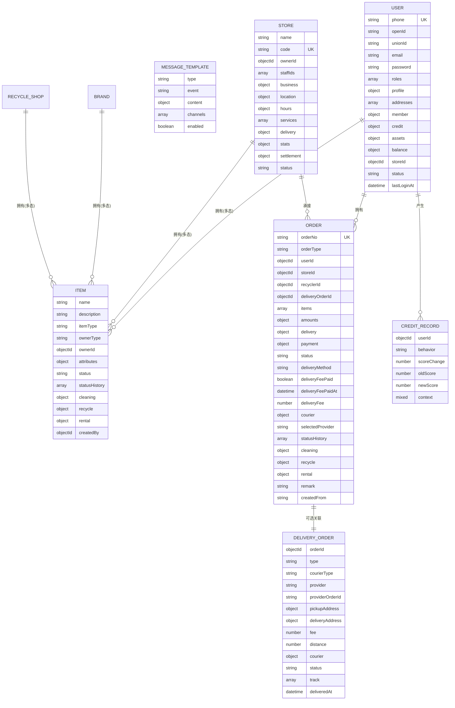
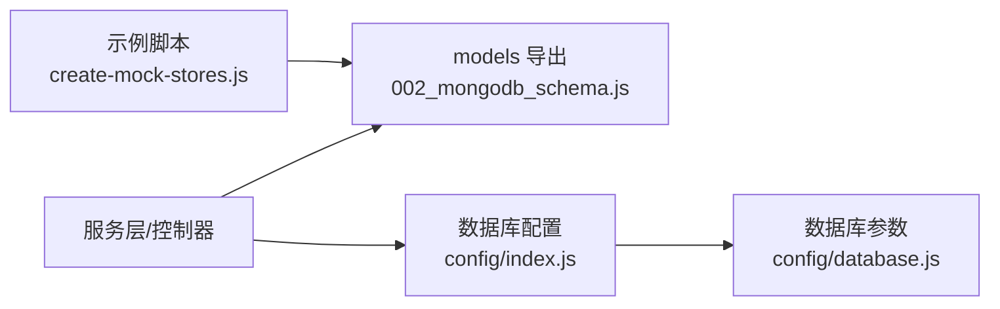

# 核心数据模型

<cite>
**本文引用的文件**   
- [backend/migrations/002_mongodb_schema.js](file://backend/migrations/002_mongodb_schema.js)
- [backend/config/index.js](file://backend/config/index.js)
- [backend/config/database.js](file://backend/config/database.js)
- [backend/create-mock-stores.js](file://backend/create-mock-stores.js)
</cite>

## 目录
1. [引言](#引言)
2. [项目结构](#项目结构)
3. [核心组件](#核心组件)
4. [架构总览](#架构总览)
5. [详细组件分析](#详细组件分析)
6. [依赖关系分析](#依赖关系分析)
7. [性能考量](#性能考量)
8. [故障排查指南](#故障排查指南)
9. [结论](#结论)
10. [附录](#附录)

## 引言
本文件聚焦于干洗系统后端的核心数据模型，围绕用户、门店、物品（多品类）、订单（多品类）、配送单等关键实体进行系统化说明。文档涵盖字段定义、数据类型与业务含义、关联关系与引用策略、索引与约束、验证规则与默认值、实例化与常用查询示例、生命周期管理（含软删除建议）以及审计日志记录实践，旨在为开发者提供完整的数据建模参考与最佳实践指南。

## 项目结构
与核心数据模型直接相关的代码主要位于后端模块：
- 模型定义与导出：backend/migrations/002_mongodb_schema.js
- 数据库连接与配置：backend/config/index.js、backend/config/database.js
- 测试/样例脚本（包含独立 Store Schema 的演示）：backend/create-mock-stores.js

图表来源
- [backend/migrations/002_mongodb_schema.js:1-607](file://backend/migrations/002_mongodb_schema.js#L1-L607)
- [backend/config/index.js:1-166](file://backend/config/index.js#L1-L166)
- [backend/config/database.js:1-64](file://backend/config/database.js#L1-L64)
- [backend/create-mock-stores.js:1-163](file://backend/create-mock-stores.js#L1-L163)

章节来源
- [backend/migrations/002_mongodb_schema.js:1-607](file://backend/migrations/002_mongodb_schema.js#L1-L607)
- [backend/config/index.js:1-166](file://backend/config/index.js#L1-L166)
- [backend/config/database.js:1-64](file://backend/config/database.js#L1-L64)
- [backend/create-mock-stores.js:1-163](file://backend/create-mock-stores.js#L1-L163)

## 核心组件
本节概述核心模型及其职责边界：
- User 用户模型：身份、角色、资料、地址、会员与信用、资产与余额、状态与登录时间等
- Store 门店模型：基本信息、位置、营业时间、服务项、配送策略、统计与结算、状态
- Item 物品模型（多态）：通用属性 + 按 itemType 区分的业务字段（清洗/回收/租赁等）
- Order 订单模型（多态）：订单号、类型、关联、物品明细、金额明细、收货信息、支付信息、状态机、业务特定字段
- DeliveryOrder 配送单模型：取送地址、服务商、费用、轨迹、状态
- 辅助模型：MessageTemplate 消息模板、CreditRecord 信用记录

章节来源
- [backend/migrations/002_mongodb_schema.js:56-134](file://backend/migrations/002_mongodb_schema.js#L56-L134)
- [backend/migrations/002_mongodb_schema.js:142-206](file://backend/migrations/002_mongodb_schema.js#L142-L206)
- [backend/migrations/002_mongodb_schema.js:216-303](file://backend/migrations/002_mongodb_schema.js#L216-L303)
- [backend/migrations/002_mongodb_schema.js:313-476](file://backend/migrations/002_mongodb_schema.js#L313-L476)
- [backend/migrations/002_mongodb_schema.js:499-549](file://backend/migrations/002_mongodb_schema.js#L499-L549)
- [backend/migrations/002_mongodb_schema.js:557-567](file://backend/migrations/002_mongodb_schema.js#L557-L567)
- [backend/migrations/002_mongodb_schema.js:575-582](file://backend/migrations/002_mongodb_schema.js#L575-L582)

## 架构总览
下图展示核心实体间的关联关系与引用策略（基于 Mongoose ref）：

图表来源
- [backend/migrations/002_mongodb_schema.js:56-134](file://backend/migrations/002_mongodb_schema.js#L56-L134)
- [backend/migrations/002_mongodb_schema.js:142-206](file://backend/migrations/002_mongodb_schema.js#L142-L206)
- [backend/migrations/002_mongodb_schema.js:216-303](file://backend/migrations/002_mongodb_schema.js#L216-L303)
- [backend/migrations/002_mongodb_schema.js:313-476](file://backend/migrations/002_mongodb_schema.js#L313-L476)
- [backend/migrations/002_mongodb_schema.js:499-549](file://backend/migrations/002_mongodb_schema.js#L499-L549)
- [backend/migrations/002_mongodb_schema.js:557-567](file://backend/migrations/002_mongodb_schema.js#L557-L567)
- [backend/migrations/002_mongodb_schema.js:575-582](file://backend/migrations/002_mongodb_schema.js#L575-L582)

## 详细组件分析

### 用户模型（User）
- 标识与认证
  - phone：必填、唯一、带索引；openId/unionId/email/password 用于多渠道登录与鉴权
- 角色与权限
  - roles：枚举数组，默认 customer；支持 customer/store_staff/store_owner/recycler/appraiser/brand_admin/chain_admin/admin
- 个人资料与地址
  - profile：name/avatar/gender/birthday
  - addresses：数组，支持省市区、经纬度、标签（home/work/other）、是否默认
- 会员与信用
  - member：level/points/totalSpent/memberSince
  - credit：履约分、完成/取消订单数、逾期归还/投诉计数、押金余额、授信额度、黑名单标记及原因/时间
- 资产与余额
  - assets：itemIds 引用 Item；totalValue 汇总
  - balance：available/frozen
- 关联与状态
  - storeId：ref Store
  - status：active/inactive/banned；lastLoginAt

索引与约束
- phone 唯一索引；roles 索引；status 枚举校验；各子对象字段具备合理默认值与范围约束（如 credit.fulfillmentScore 0-100）

示例用法（路径）
- 创建用户：[backend/migrations/002_mongodb_schema.js:56-134](file://backend/migrations/002_mongodb_schema.js#L56-L134)
- 查询用户地址列表：[backend/migrations/002_mongodb_schema.js:80-92](file://backend/migrations/002_mongodb_schema.js#L80-L92)
- 更新会员积分：[backend/migrations/002_mongodb_schema.js:95-100](file://backend/migrations/002_mongodb_schema.js#L95-L100)

章节来源
- [backend/migrations/002_mongodb_schema.js:56-134](file://backend/migrations/002_mongodb_schema.js#L56-L134)

### 门店模型（Store）
- 基础信息
  - name/code（唯一）/ownerId（ref User）/staffIds（ref User[]）
- 经营与位置
  - business：licenseNo/contactPhone/description
  - location：province/city/district/address/latitude/longitude
- 营业与服务
  - hours：周一至周日开放时段与节假日
  - services：id/name/price/enabled
- 配送与统计
  - delivery：enabled/freeThreshold/fee/providers
  - stats：totalOrders/monthlyOrders/rating/ratingCount
- 结算与状态
  - settlement：balance/frozenBalance/pendingSettlement
  - status：pending/active/suspended/closed

索引与约束
- ownerId/location 地理索引/status 索引；services 内嵌价格与启用开关

示例用法（路径）
- 创建门店：[backend/migrations/002_mongodb_schema.js:142-206](file://backend/migrations/002_mongodb_schema.js#L142-L206)
- 查询附近门店（地理位置）：[backend/migrations/002_mongodb_schema.js:209-210](file://backend/migrations/002_mongodb_schema.js#L209-L210)

章节来源
- [backend/migrations/002_mongodb_schema.js:142-206](file://backend/migrations/002_mongodb_schema.js#L142-L206)

### 物品模型（Item，多态）
- 通用字段
  - name/description
  - itemType：dry_cleaning/recycle/rental/pet_grooming/electronics_repair/luxury_care/shoe_care/rental_leisure
  - ownerType：user/store/brand/recycle_shop
  - ownerId：ref 对应主体
  - attributes：brand/category/material/color/size/retailPrice/originalCost/weight/condition/images/tags
  - status：pending/in_progress/ready/delivering/delivered/cancelled
  - statusHistory：状态变更审计（status/time/actorId/actorType/note）
- 业务扩展字段（按 itemType 使用）
  - cleaning：serviceType/stains/specialReq/estimatedDays
  - recycle：estimatedPrice/finalPrice/weight/category/recyclable/certified/certificationNo
  - rental：deposit/dailyRate/weeklyRate/monthlyRate/minRentalDays/availableFrom/availableTo/brandId/brandName/authenticity

索引与约束
- itemType+ownerId 复合索引；itemType+status 复合索引；status 索引

示例用法（路径）
- 新增清洗类物品：[backend/migrations/002_mongodb_schema.js:272-277](file://backend/migrations/002_mongodb_schema.js#L272-L277)
- 新增租赁类物品：[backend/migrations/002_mongodb_schema.js:289-300](file://backend/migrations/002_mongodb_schema.js#L289-L300)

章节来源
- [backend/migrations/002_mongodb_schema.js:216-303](file://backend/migrations/002_mongodb_schema.js#L216-L303)

### 订单模型（Order，多态）
- 标识与类型
  - orderNo：全局唯一（保存前自动生成）
  - orderType：cleaning/recycle/rental/deposit/pet_grooming/electronics_repair/luxury_care/shoe_care/rental_leisure
- 关联
  - userId（ref User，必填，索引）/storeId（ref Store）/recyclerId（ref User）/deliveryOrderId（ref DeliveryOrder）
- 物品明细
  - items：itemId/name/itemType/price/quantity/subtotal；按业务扩展 serviceType/specialReq/pickupCode/offeredPrice/finalPrice/weight/dailyRate/rentalDays/deposit
- 金额明细
  - amounts：subtotal/discount/couponId/deliveryFee/deposit/serviceFee/total
- 收货与配送
  - delivery：type/pickupAddress/deliveryAddress/estimatedTime/actualTime
  - deliveryMethod：courier/store_pickup
  - deliveryFeePaid/deliveryFeePaidAt/deliveryFee
  - courier：provider/fee/paidAt/status
  - selectedProvider：前端显示用
- 支付信息
  - payment.status/method/transactionId/paidAt/splits（分账明细：type/accountId/accountName/amount/settled/settledAt）
- 状态机
  - status：覆盖下单、支付、取送、处理、完成、取消、退款、自提扫描、出库等；statusHistory 记录审计
- 业务特定
  - cleaning：returnDate/storeReceivedAt/storeCompletedAt/qualityCheckPassed
  - recycle：assessorId/assessedAt/userConfirmed/userConfirmedAt/collectedAt/settlementStatus
  - rental：startDate/dueDate/actualReturnDate/overdueDays/overdueFee/depositStatus/damagePenalty
- 其他
  - remark/createdFrom

索引与约束
- userId+createdAt 倒序索引；storeId+createdAt 倒序索引；orderType+status 复合索引；payment.status 索引
- 生成订单号逻辑在 pre('save') 钩子中实现

示例用法（路径）
- 创建订单并生成订单号：[backend/migrations/002_mongodb_schema.js:485-493](file://backend/migrations/002_mongodb_schema.js#L485-L493)
- 查询某用户最近订单：[backend/migrations/002_mongodb_schema.js:479](file://backend/migrations/002_mongodb_schema.js#L479-L479)
- 查询待支付订单：[backend/migrations/002_mongodb_schema.js:482](file://backend/migrations/002_mongodb_schema.js#L482-L482)

章节来源
- [backend/migrations/002_mongodb_schema.js:313-476](file://backend/migrations/002_mongodb_schema.js#L313-L476)

### 配送单模型（DeliveryOrder）
- 关联与类型
  - orderId（ref Order，必填，索引）/type：none/pickup/delivery/courierType：solo/shared/provider/providerOrderId
- 地址
  - pickupAddress/deliveryAddress：contactName/contactPhone/address/latitude/longitude
- 费用与距离
  - fee/distance
- 骑手信息
  - courier：name/phone/avatar/latitude/longitude/estimatedArrival
- 状态与轨迹
  - status：pending/assigned/picking/delivering/delivered/cancelled/failed
  - track：status/time/latitude/longitude/description
  - deliveredAt

索引与约束
- provider+status 复合索引；status 索引

示例用法（路径）
- 创建配送单：[backend/migrations/002_mongodb_schema.js:499-549](file://backend/migrations/002_mongodb_schema.js#L499-L549)
- 查询某服务商待派单：[backend/migrations/002_mongodb_schema.js:551](file://backend/migrations/002_mongodb_schema.js#L551-L551)

章节来源
- [backend/migrations/002_mongodb_schema.js:499-549](file://backend/migrations/002_mongodb_schema.js#L499-L549)

### 辅助模型
- MessageTemplate 消息模板
  - type/event/content(channels/data)/enabled；type+event 唯一索引
- CreditRecord 信用记录
  - userId/behavior/scoreChange/oldScore/newScore/context；userId+createdAt 倒序索引

示例用法（路径）
- 消息模板：[backend/migrations/002_mongodb_schema.js:557-567](file://backend/migrations/002_mongodb_schema.js#L557-L567)
- 信用记录：[backend/migrations/002_mongodb_schema.js:575-582](file://backend/migrations/002_mongodb_schema.js#L575-L582)

章节来源
- [backend/migrations/002_mongodb_schema.js:557-567](file://backend/migrations/002_mongodb_schema.js#L557-L567)
- [backend/migrations/002_mongodb_schema.js:575-582](file://backend/migrations/002_mongodb_schema.js#L575-L582)

## 依赖关系分析
- 模型导出与使用
  - 所有模型通过 mongoose.model 注册并在模块末尾统一导出，供服务层按需引入
- 数据库连接
  - config/index.js 负责根据 DB_TYPE 初始化 MongoDB 或 MySQL；getMongoose() 暴露 Mongoose 实例
  - config/database.js 提供环境变量驱动的 URI、池大小、超时等参数
- 示例脚本
  - create-mock-stores.js 定义了独立的 Store Schema 用于快速造数（注意与主模型 Store 存在差异，仅用于演示）

图表来源
- [backend/migrations/002_mongodb_schema.js:590-606](file://backend/migrations/002_mongodb_schema.js#L590-L606)
- [backend/config/index.js:1-166](file://backend/config/index.js#L1-L166)
- [backend/config/database.js:1-64](file://backend/config/database.js#L1-L64)
- [backend/create-mock-stores.js:1-163](file://backend/create-mock-stores.js#L1-L163)

章节来源
- [backend/migrations/002_mongodb_schema.js:590-606](file://backend/migrations/002_mongodb_schema.js#L590-L606)
- [backend/config/index.js:1-166](file://backend/config/index.js#L1-L166)
- [backend/config/database.js:1-64](file://backend/config/database.js#L1-L64)
- [backend/create-mock-stores.js:1-163](file://backend/create-mock-stores.js#L1-L163)

## 性能考量
- 索引设计
  - 高频查询字段均建立索引：User.phone、User.roles、Store.ownerId/地理索引、Item.itemType+ownerId/status、Order.userId+createdAt、Order.storeId+createdAt、Order.orderType+status、Order.payment.status、DeliveryOrder.provider+status
- 预计算与缓存
  - Store.stats 与 Order.amounts 采用冗余字段减少聚合开销；可结合 Redis 缓存热点数据（配置已预留 TTL）
- 写入优化
  - 订单号生成在 pre('save') 中执行，避免额外请求；批量插入时注意控制事务粒度
- 分页与投影
  - 列表接口建议使用分页与只返回必要字段，降低网络与序列化成本

[本节为通用指导，不直接分析具体文件]

## 故障排查指南
- 连接问题
  - 检查环境变量 DB_TYPE、MONGODB_URI、MYSQL_* 是否正确；确认 initDatabase() 调用成功
- 唯一性冲突
  - User.phone、Store.code、Order.orderNo 唯一约束可能导致重复写入错误；需在上层保证幂等或重试策略
- 状态不一致
  - Order.statusHistory/DeliveryOrder.track 应作为审计依据；若出现状态漂移，优先核对历史轨迹与事件源
- 支付分账异常
  - Order.payment.splits 中的 settled 标志应与结算系统对账；必要时回滚未结算分账

章节来源
- [backend/config/index.js:19-53](file://backend/config/index.js#L19-L53)
- [backend/config/database.js:6-48](file://backend/config/database.js#L6-L48)
- [backend/migrations/002_mongodb_schema.js:485-493](file://backend/migrations/002_mongodb_schema.js#L485-L493)

## 结论
本数据模型以“多态 + 内嵌 + 外键引用”的组合方式，兼顾了灵活性与一致性。通过合理的索引设计与审计字段，既满足复杂业务的演进需求，又保障了查询性能与可追溯性。建议在后续迭代中持续完善软删除策略与更细粒度的权限控制，并结合事件溯源机制增强系统的可观测性与容错能力。

[本节为总结性内容，不直接分析具体文件]

## 附录

### 字段与约束速查表（节选）
- User
  - phone：String，required，unique，index
  - roles：String[]，enum，default ['customer']
  - status：String，enum，default 'active'
- Store
  - code：String，unique
  - ownerId：ObjectId，ref User，required
  - status：String，enum，default 'pending'
- Item
  - itemType：String，enum，required，index
  - ownerType：String，enum，required
  - ownerId：ObjectId，required，index
  - status：String，enum，default 'pending'，index
- Order
  - orderNo：String，required，unique（pre-save 生成）
  - orderType：String，enum，required，index
  - userId：ObjectId，ref User，required，index
  - status：String，enum，default 'pending'，index
  - payment.status：String，enum，default 'pending'
- DeliveryOrder
  - orderId：ObjectId，ref Order，required，index
  - type：String，enum，required
  - status：String，enum，default 'pending'，index

章节来源
- [backend/migrations/002_mongodb_schema.js:56-134](file://backend/migrations/002_mongodb_schema.js#L56-L134)
- [backend/migrations/002_mongodb_schema.js:142-206](file://backend/migrations/002_mongodb_schema.js#L142-L206)
- [backend/migrations/002_mongodb_schema.js:216-303](file://backend/migrations/002_mongodb_schema.js#L216-L303)
- [backend/migrations/002_mongodb_schema.js:313-476](file://backend/migrations/002_mongodb_schema.js#L313-L476)
- [backend/migrations/002_mongodb_schema.js:499-549](file://backend/migrations/002_mongodb_schema.js#L499-L549)

### 常见操作示例（路径指引）
- 实例化与保存
  - 用户：[backend/migrations/002_mongodb_schema.js:56-134](file://backend/migrations/002_mongodb_schema.js#L56-L134)
  - 门店：[backend/migrations/002_mongodb_schema.js:142-206](file://backend/migrations/002_mongodb_schema.js#L142-L206)
  - 物品：[backend/migrations/002_mongodb_schema.js:216-303](file://backend/migrations/002_mongodb_schema.js#L216-L303)
  - 订单：[backend/migrations/002_mongodb_schema.js:313-476](file://backend/migrations/002_mongodb_schema.js#L313-L476)
  - 配送单：[backend/migrations/002_mongodb_schema.js:499-549](file://backend/migrations/002_mongodb_schema.js#L499-L549)
- 常用查询
  - 用户地址列表：[backend/migrations/002_mongodb_schema.js:80-92](file://backend/migrations/002_mongodb_schema.js#L80-L92)
  - 附近门店（地理）：[backend/migrations/002_mongodb_schema.js:209-210](file://backend/migrations/002_mongodb_schema.js#L209-L210)
  - 用户订单列表（按时间倒序）：[backend/migrations/002_mongodb_schema.js:479](file://backend/migrations/002_mongodb_schema.js#L479-L479)
  - 待支付订单：[backend/migrations/002_mongodb_schema.js:482](file://backend/migrations/002_mongodb_schema.js#L482-L482)
  - 服务商待派单：[backend/migrations/002_mongodb_schema.js:551](file://backend/migrations/002_mongodb_schema.js#L551-L551)

### 数据生命周期与软删除建议
- 现状
  - 当前模型未内置软删除字段；状态机通过 status/statusHistory 表达生命周期
- 建议
  - 为高价值实体（User/Store/Order/Item）增加 isDeleted 与 deletedAt 字段，配合索引与查询中间件实现软删除
  - 对审计敏感字段（如 Order.payment.splits、DeliveryOrder.track）保留不可变历史，确保可追溯

[本节为概念性建议，不直接分析具体文件]

### 审计日志记录
- 内置审计
  - Item.statusHistory、Order.statusHistory、DeliveryOrder.track 提供状态与轨迹审计
- 建议扩展
  - 为金额相关变更（Order.amounts、Payment.splits）增加变更日志集合，记录旧值/新值/操作人/时间戳

章节来源
- [backend/migrations/002_mongodb_schema.js:263-269](file://backend/migrations/002_mongodb_schema.js#L263-L269)
- [backend/migrations/002_mongodb_schema.js:439-445](file://backend/migrations/002_mongodb_schema.js#L439-L445)
- [backend/migrations/002_mongodb_schema.js:540-546](file://backend/migrations/002_mongodb_schema.js#L540-L546)