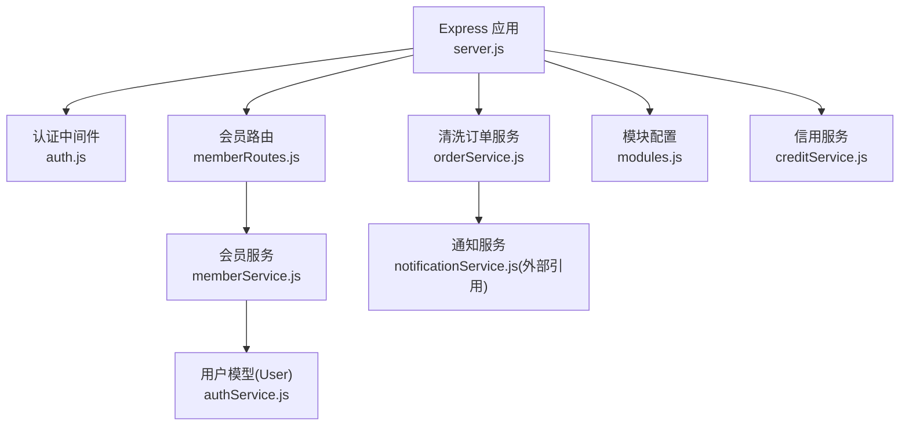
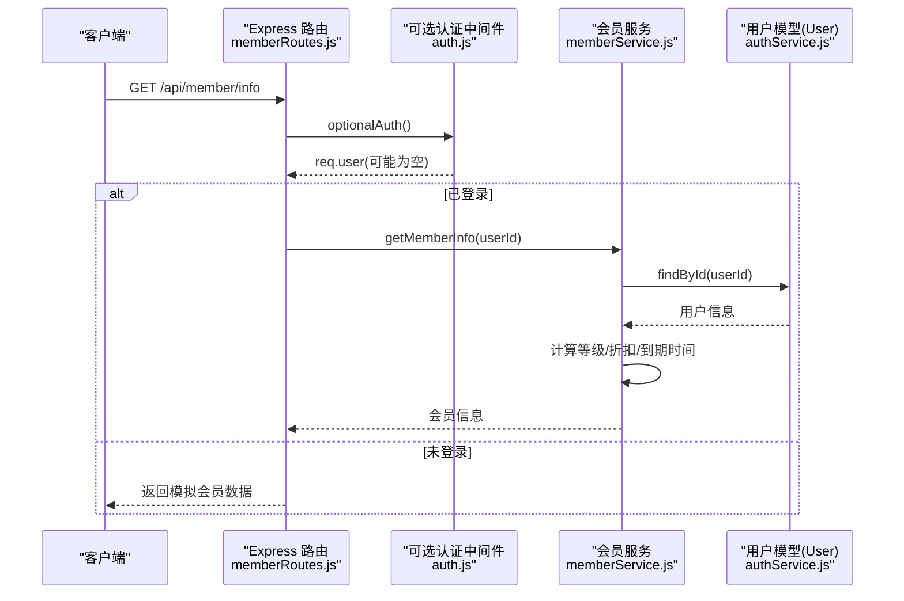
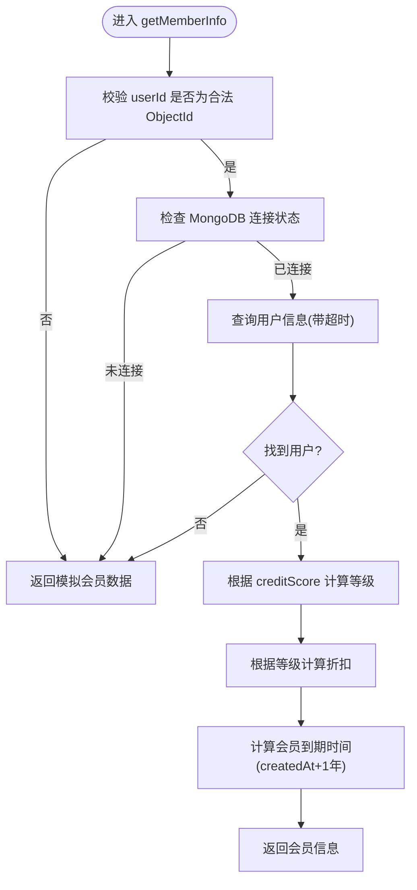
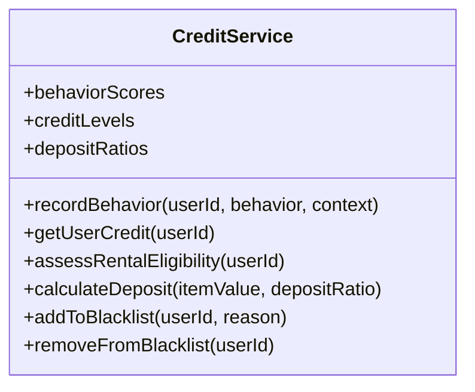
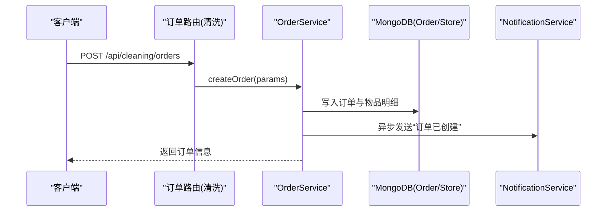
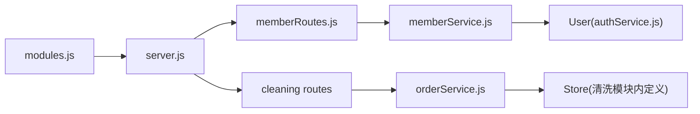

# 会员管理系统

<cite>
**本文引用的文件**   
- [backend/modules/member/services/memberService.js](file://backend/modules/member/services/memberService.js)
- [backend/modules/member/routes/memberRoutes.js](file://backend/modules/member/routes/memberRoutes.js)
- [backend/modules/common/services/creditService.js](file://backend/modules/common/services/creditService.js)
- [backend/modules/cleaning/services/orderService.js](file://backend/modules/cleaning/services/orderService.js)
- [backend/modules/common/middlewares/auth.js](file://backend/modules/common/middlewares/auth.js)
- [backend/modules/common/services/authService.js](file://backend/modules/common/services/authService.js)
- [backend/server.js](file://backend/server.js)
- [backend/config/modules.js](file://backend/config/modules.js)
</cite>

## 目录
1. [简介](#简介)
2. [项目结构](#项目结构)
3. [核心组件](#核心组件)
4. [架构总览](#架构总览)
5. [详细组件分析](#详细组件分析)
6. [依赖关系分析](#依赖关系分析)
7. [性能与扩展性](#性能与扩展性)
8. [故障排查指南](#故障排查指南)
9. [结论](#结论)
10. [附录：API 接口规范](#附录api-接口规范)

## 简介
本文件面向干洗店“会员管理系统”的设计与实现，覆盖会员等级、积分体系、信用评估、订单关联、营销工具与数据分析等关键能力。文档以代码为依据，提供架构图、流程图与接口说明，帮助开发者快速理解并扩展系统。

## 项目结构
后端采用模块化架构，会员相关能力主要分布在以下位置：
- 会员服务：查询会员信息、计算等级与折扣
- 认证服务：用户注册、登录、微信登录、跨平台身份合并
- 信用服务：行为记录、信用等级划分、押金比例与风控规则
- 订单服务：订单创建、支付、状态流转、取件码生成
- 路由与中间件：统一入口、可选认证、角色校验
- 模块配置：功能开关（会员、积分、优惠券、信用）

图表来源
- [backend/server.js:120-152](file://backend/server.js#L120-L152)
- [backend/modules/member/routes/memberRoutes.js:1-48](file://backend/modules/member/routes/memberRoutes.js#L1-L48)
- [backend/modules/member/services/memberService.js:1-134](file://backend/modules/member/services/memberService.js#L1-L134)
- [backend/modules/common/middlewares/auth.js:1-207](file://backend/modules/common/middlewares/auth.js#L1-L207)
- [backend/modules/cleaning/services/orderService.js:1-800](file://backend/modules/cleaning/services/orderService.js#L1-L800)
- [backend/config/modules.js:100-135](file://backend/config/modules.js#L100-L135)
- [backend/modules/common/services/creditService.js:1-183](file://backend/modules/common/services/creditService.js#L1-L183)

章节来源
- [backend/server.js:120-152](file://backend/server.js#L120-L152)
- [backend/config/modules.js:100-135](file://backend/config/modules.js#L100-L135)

## 核心组件
- 会员服务
  - 根据用户ID获取会员信息，包含等级、积分、折扣、到期时间等
  - 非ObjectId或数据库不可用时返回模拟数据兜底
  - 基于积分自动计算等级与对应折扣
- 认证服务
  - 支持手机号+密码、微信登录、开发模式Mock
  - 跨平台身份合并：小程序填写手机号时自动绑定已有C端账户
- 信用服务
  - 行为积分映射（正向/负向），分数范围0-100
  - 信用等级划分与押金比例策略
  - 黑名单与逾期率、取消率等风控规则
- 订单服务
  - 订单创建、支付、取消、收件、处理、完成等全流程
  - 取件码生成、配送方式标准化、门店信息填充
- 模块配置
  - 会员、积分、优惠券、信用等功能开关与默认值

章节来源
- [backend/modules/member/services/memberService.js:1-134](file://backend/modules/member/services/memberService.js#L1-L134)
- [backend/modules/common/services/authService.js:1-496](file://backend/modules/common/services/authService.js#L1-L496)
- [backend/modules/common/services/creditService.js:1-183](file://backend/modules/common/services/creditService.js#L1-L183)
- [backend/modules/cleaning/services/orderService.js:1-800](file://backend/modules/cleaning/services/orderService.js#L1-L800)
- [backend/config/modules.js:100-135](file://backend/config/modules.js#L100-L135)

## 架构总览
会员体系围绕“用户-会员-信用-订单”展开，通过认证中间件保障安全访问，会员服务读取用户模型并计算等级与折扣，信用服务为租赁等业务提供风控基础，订单服务贯穿消费闭环并为积分与活跃度统计提供数据源。

图表来源
- [backend/modules/member/routes/memberRoutes.js:1-48](file://backend/modules/member/routes/memberRoutes.js#L1-L48)
- [backend/modules/common/middlewares/auth.js:140-183](file://backend/modules/common/middlewares/auth.js#L140-L183)
- [backend/modules/member/services/memberService.js:16-94](file://backend/modules/member/services/memberService.js#L16-L94)
- [backend/modules/common/services/authService.js:210-217](file://backend/modules/common/services/authService.js#L210-L217)

## 详细组件分析

### 会员信息服务
- 职责
  - 根据userId查询用户基本信息
  - 基于积分计算会员等级与折扣
  - 计算会员有效期（从创建时间起算一年）
  - 异常与超时保护，返回模拟数据兜底
- 关键点
  - ObjectId校验：非合法ID直接走模拟数据路径
  - MongoDB连接检查：未连接则返回模拟数据
  - 查询超时：使用Promise.race设置5秒超时
  - 等级与折扣映射：按积分阈值确定等级与折扣文案

图表来源
- [backend/modules/member/services/memberService.js:16-94](file://backend/modules/member/services/memberService.js#L16-L94)
- [backend/modules/member/services/memberService.js:99-117](file://backend/modules/member/services/memberService.js#L99-L117)

章节来源
- [backend/modules/member/services/memberService.js:1-134](file://backend/modules/member/services/memberService.js#L1-L134)

### 认证与可选认证中间件
- 职责
  - 解析Authorization头中的token
  - 开发模式兼容：dev-admin、dev-chain、mock_token
  - 可选认证：允许匿名访问，但尽量挂载用户上下文
- 关键点
  - 失败时返回needLogin标识
  - 成功时将用户信息挂载到req.user，供后续业务使用

章节来源
- [backend/modules/common/middlewares/auth.js:1-207](file://backend/modules/common/middlewares/auth.js#L1-L207)

### 用户认证服务
- 职责
  - 用户注册、登录、微信登录
  - 跨平台身份合并：小程序手机号与C端账户合并
  - 用户信息查询与更新
- 关键点
  - 微信登录优先按openid匹配，不存在则自动注册
  - 手机号合并时迁移订单userId，保证数据一致性
  - sanitizeUser移除敏感字段

章节来源
- [backend/modules/common/services/authService.js:1-496](file://backend/modules/common/services/authService.js#L1-L496)

### 信用服务体系
- 职责
  - 行为积分映射：正向/负向事件影响分数
  - 信用等级划分：poor/fair/good/excellent/outstanding
  - 租赁资格评估：黑名单、逾期次数、取消率、最低分
  - 押金比例策略：依据信用等级动态调整
- 关键点
  - 分数范围限制在0-100
  - 历史变更记录便于审计与分析
  - 预留数据库读写方法，当前为骨架实现

图表来源
- [backend/modules/common/services/creditService.js:1-183](file://backend/modules/common/services/creditService.js#L1-L183)

章节来源
- [backend/modules/common/services/creditService.js:1-183](file://backend/modules/common/services/creditService.js#L1-L183)

### 订单服务与会员关联
- 职责
  - 订单创建、支付、取消、收件、处理、完成等全生命周期管理
  - 取件码生成、配送方式标准化、门店信息填充
  - 状态历史追踪与通知发送
- 与会员的关联点
  - 订单归属userId，用于消费统计与活跃度分析
  - 支付成功后可触发积分增加（建议扩展）
  - 订单状态变更可用于信用评分（如取消、不取件等）

图表来源
- [backend/modules/cleaning/services/orderService.js:177-291](file://backend/modules/cleaning/services/orderService.js#L177-L291)
- [backend/modules/cleaning/services/orderService.js:295-389](file://backend/modules/cleaning/services/orderService.js#L295-L389)

章节来源
- [backend/modules/cleaning/services/orderService.js:1-800](file://backend/modules/cleaning/services/orderService.js#L1-L800)

### 会员等级与积分设计
- 等级划分
  - 普通会员：积分 < 2000
  - 白银会员：2000 ≤ 积分 < 5000
  - 黄金会员：5000 ≤ 积分 < 10000
  - 铂金会员：积分 ≥ 10000
- 折扣映射
  - 普通会员：9.5折
  - 白银会员：9.0折
  - 黄金会员：8.5折
  - 铂金会员：7.5折
- 有效期
  - 自用户创建时间起算一年

章节来源
- [backend/modules/member/services/memberService.js:99-117](file://backend/modules/member/services/memberService.js#L99-L117)
- [backend/modules/member/services/memberService.js:66-84](file://backend/modules/member/services/memberService.js#L66-L84)

### 信用评估与风险控制
- 行为积分
  - 正向：完成订单、准时付款、提交评价、账号绑定、身份认证等
  - 负向：取消订单、多次不取件、延迟付款、租赁逾期/损坏、欺诈举报、辱骂员工、虚假评价等
- 等级与押金比例
  - 极好/优秀/良好/一般/较差，对应不同押金比例
  - 较差用户禁止租赁
- 风控规则
  - 黑名单判定
  - 逾期次数上限
  - 订单取消率阈值

章节来源
- [backend/modules/common/services/creditService.js:1-183](file://backend/modules/common/services/creditService.js#L1-L183)

### 会员与订单的关联关系
- 关联键
  - 订单.userId 指向用户主键，用于消费统计与活跃度分析
- 个性化服务
  - 基于会员等级与折扣进行价格优惠
  - 结合信用评估提供差异化押金策略（租赁场景）
- 数据一致性
  - 跨平台身份合并后，订单userId迁移至目标账户，确保统计准确

章节来源
- [backend/modules/cleaning/services/orderService.js:33-151](file://backend/modules/cleaning/services/orderService.js#L33-L151)
- [backend/modules/common/services/authService.js:236-310](file://backend/modules/common/services/authService.js#L236-L310)

## 依赖关系分析
- 路由层
  - /api/member 由 memberRoutes 暴露，内部调用 memberService
  - /api/cleaning 由 cleaning 模块路由暴露，内部调用 orderService
- 中间件
  - optionalAuth 为可选认证，避免强制登录
- 服务层
  - memberService 依赖 User 模型（由 authService 注册）
  - orderService 依赖 Store 模型与通知服务
- 配置
  - modules.js 控制会员、积分、优惠券、信用等功能开关

图表来源
- [backend/server.js:120-152](file://backend/server.js#L120-L152)
- [backend/modules/member/routes/memberRoutes.js:1-48](file://backend/modules/member/routes/memberRoutes.js#L1-L48)
- [backend/modules/member/services/memberService.js:1-134](file://backend/modules/member/services/memberService.js#L1-L134)
- [backend/modules/cleaning/services/orderService.js:1-800](file://backend/modules/cleaning/services/orderService.js#L1-L800)
- [backend/config/modules.js:100-135](file://backend/config/modules.js#L100-L135)

章节来源
- [backend/server.js:120-152](file://backend/server.js#L120-L152)
- [backend/config/modules.js:100-135](file://backend/config/modules.js#L100-L135)

## 性能与扩展性
- 查询优化
  - 会员信息查询使用select指定字段，减少传输体积
  - 订单列表查询使用索引字段（userId、storeId、status）
- 容错与降级
  - 会员信息在非ObjectId或未连接DB时返回模拟数据，提升可用性
  - 查询设置超时，避免长尾请求阻塞
- 扩展建议
  - 将等级与折扣配置外置到配置文件，便于运营调整
  - 引入缓存层（Redis）存储热门会员信息与折扣映射
  - 积分与信用评分持久化到数据库，完善历史记录与审计

[本节为通用指导，无需特定文件来源]

## 故障排查指南
- 常见问题
  - 会员信息返回模拟数据：检查userId格式与MongoDB连接状态
  - 认证失败：确认Authorization头格式与token有效性
  - 订单权限错误：核对userId与角色权限
- 定位步骤
  - 查看路由日志与服务层console输出
  - 检查数据库连接与索引是否生效
  - 验证模块配置中会员与信用功能是否启用

章节来源
- [backend/modules/member/services/memberService.js:22-94](file://backend/modules/member/services/memberService.js#L22-L94)
- [backend/modules/common/middlewares/auth.js:10-137](file://backend/modules/common/middlewares/auth.js#L10-L137)
- [backend/modules/cleaning/services/orderService.js:395-470](file://backend/modules/cleaning/services/orderService.js#L395-L470)

## 结论
本会员管理系统以轻量服务为核心，围绕用户、会员、信用与订单构建完整闭环。当前实现提供了会员信息查询、等级与折扣计算、信用评估框架与订单流程，具备较好的可扩展性与容错能力。后续建议完善积分发放与扣减、信用评分持久化、营销活动引擎与数据分析报表，进一步提升运营效率与用户体验。

[本节为总结，无需特定文件来源]

## 附录：API 接口规范

### 会员信息
- 接口
  - GET /api/member/info
- 描述
  - 获取当前用户会员信息（积分/余额/等级/折扣等）
  - 可选认证：有token返回真实数据，无token返回模拟数据
- 请求头
  - Authorization: Bearer <token>（可选）
- 响应体
  - success: boolean
  - member: Object
    - name: string（等级名称）
    - level: string（等级key）
    - points: number（积分）
    - balance: number（余额，独立系统管理）
    - discount: string（折扣文案）
    - expireDate: string（到期日期）
    - phone/avatar/nickname: string
- 示例
  - 成功：{ success: true, member: {...} }
  - 失败：{ success: false, error: "..." }

章节来源
- [backend/modules/member/routes/memberRoutes.js:1-48](file://backend/modules/member/routes/memberRoutes.js#L1-L48)
- [backend/modules/member/services/memberService.js:16-94](file://backend/modules/member/services/memberService.js#L16-L94)

### 认证相关（补充）
- 接口
  - POST /api/auth/login
  - POST /api/auth/register
  - POST /api/auth/wechat-login
- 描述
  - 手机号+密码登录、注册、微信登录
- 注意
  - 微信登录支持跨平台身份合并与openid迁移

章节来源
- [backend/modules/common/services/authService.js:67-198](file://backend/modules/common/services/authService.js#L67-L198)

### 订单相关（补充）
- 接口
  - POST /api/cleaning/orders
  - GET /api/cleaning/orders/:orderId
  - POST /api/cleaning/orders/:orderId/pay
  - POST /api/cleaning/orders/:orderId/cancel
- 描述
  - 创建订单、查询详情、支付、取消
- 注意
  - 支持通过 _id 或 orderNo 查询
  - 支付成功后会发布事件并发送通知

章节来源
- [backend/modules/cleaning/services/orderService.js:177-291](file://backend/modules/cleaning/services/orderService.js#L177-L291)
- [backend/modules/cleaning/services/orderService.js:519-564](file://backend/modules/cleaning/services/orderService.js#L519-L564)
- [backend/modules/cleaning/services/orderService.js:569-616](file://backend/modules/cleaning/services/orderService.js#L569-L616)

### 营销工具（概念说明）
- 优惠券与促销活动
  - 前端页面提供促销配置界面（折扣/满减/条件）
  - 建议在订单计算阶段集成促销规则与会员折扣叠加策略
- 建议实现
  - 促销规则引擎：支持优先级、互斥、叠加
  - 优惠券发放与核销：与用户账户绑定，记录使用历史
  - 活动效果分析：曝光、领取、核销、ROI

[本节为概念说明，无需特定文件来源]

### 数据分析（概念说明）
- 消费统计
  - 基于订单表聚合：金额、频次、品类偏好、复购率
- 活跃度分析
  - 登录频次、下单间隔、最近活跃时间
- 报表生成
  - 日/周/月维度汇总，导出CSV/Excel
  - 可视化看板：趋势图、占比图、TopN排行

[本节为概念说明，无需特定文件来源]