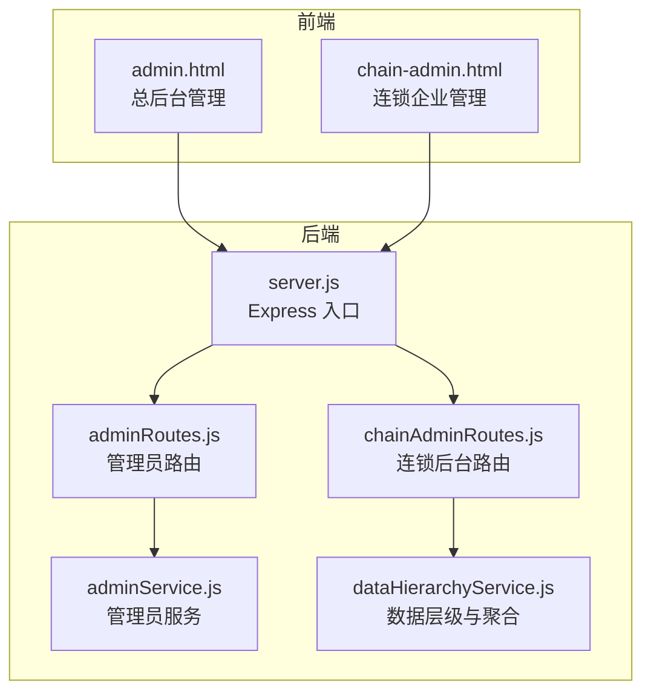
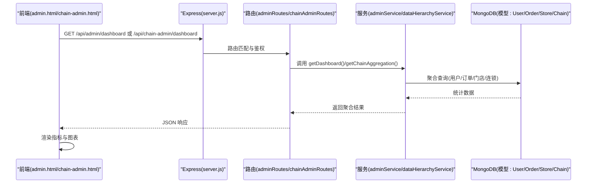
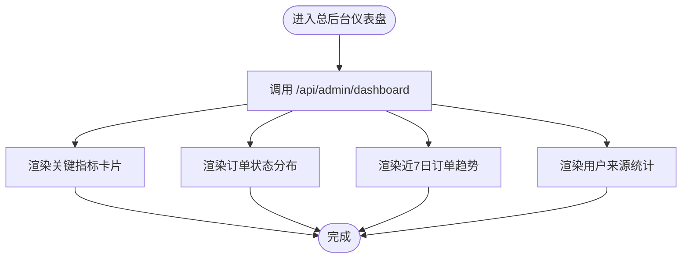
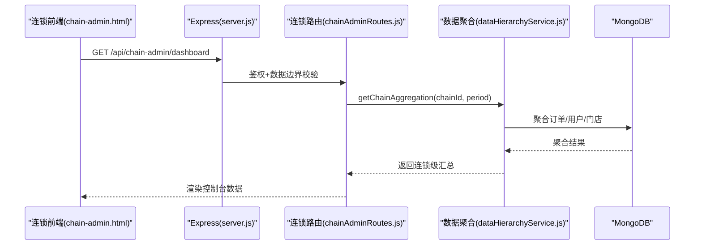
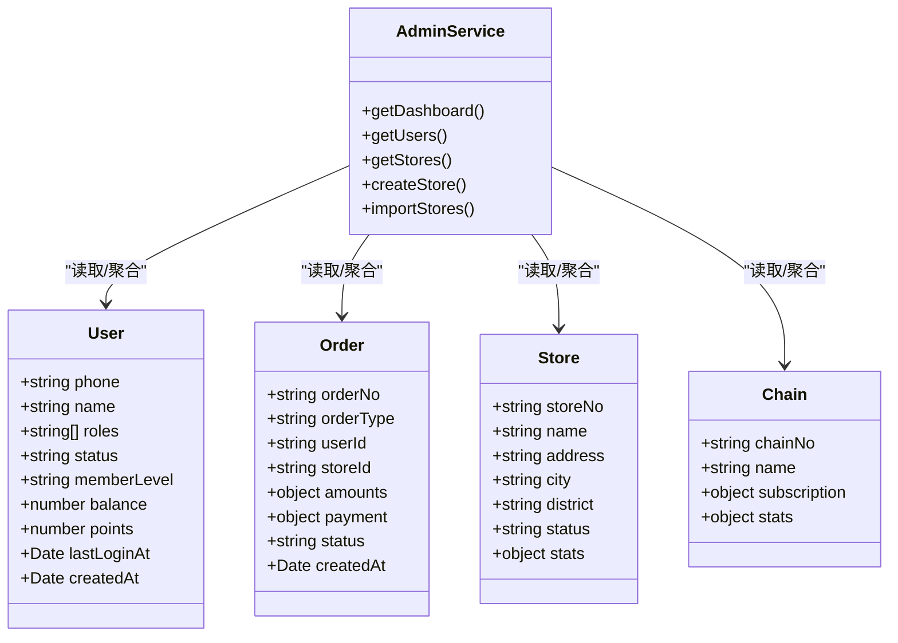
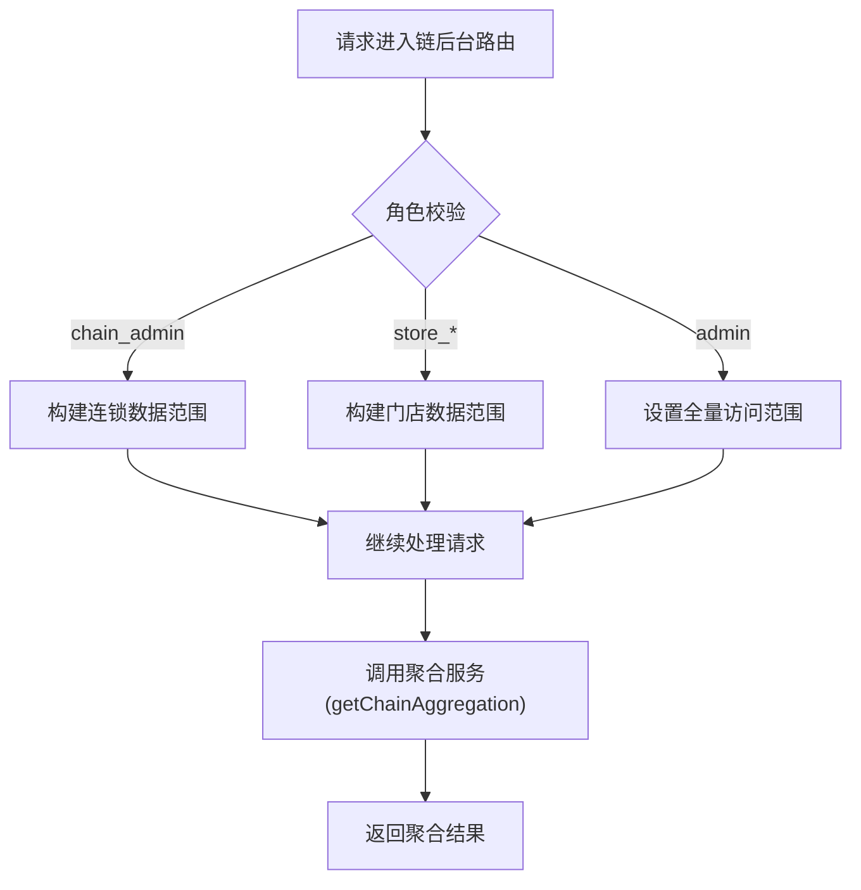
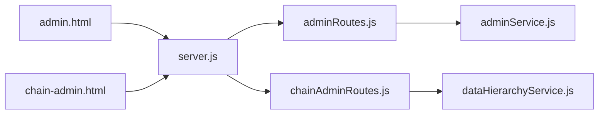

# 仪表盘与数据分析

<cite>
**本文引用的文件**   
- [admin.html](file://admin.html)
- [chain-admin.html](file://chain-admin.html)
- [server.js](file://backend/server.js)
- [adminRoutes.js](file://backend/modules/admin/routes/adminRoutes.js)
- [adminService.js](file://backend/modules/admin/services/adminService.js)
- [chainAdminRoutes.js](file://backend/modules/admin/routes/chainAdminRoutes.js)
- [dataHierarchyService.js](file://backend/modules/common/services/dataHierarchyService.js)
</cite>

## 目录
1. [引言](#引言)
2. [项目结构](#项目结构)
3. [核心组件](#核心组件)
4. [架构总览](#架构总览)
5. [详细组件分析](#详细组件分析)
6. [依赖关系分析](#依赖关系分析)
7. [性能考量](#性能考量)
8. [故障排查指南](#故障排查指南)
9. [结论](#结论)
10. [附录](#附录)

## 引言
本文件面向干洗店后台管理系统的“仪表盘与数据分析”能力，覆盖以下目标：
- 系统仪表盘设计：关键指标展示、实时数据监控、可视化图表等
- 用户数据分析：增长趋势、活跃度统计、来源分析、行为画像
- 订单统计分析：订单量趋势、状态分布、平均客单价、复购率
- 财务数据报表：收入统计、成本分析、利润计算、支付方式分布
- 门店绩效对比：多门店业绩排名、服务质量评估
- 数据导出与自定义报表生成器使用方法

## 项目结构
与仪表盘与数据分析相关的前后端关键位置如下：
- 前端页面
  - 总后台管理端（单店/平台视角）：admin.html
  - 连锁企业管理端（连锁视角）：chain-admin.html
- 后端服务
  - 统一入口与路由挂载：backend/server.js
  - 管理员模块路由与服务：backend/modules/admin/routes/adminRoutes.js、backend/modules/admin/services/adminService.js
  - 连锁后台路由：backend/modules/admin/routes/chainAdminRoutes.js
  - 数据层级权限与聚合服务：backend/modules/common/services/dataHierarchyService.js

图示来源
- [admin.html](file://admin.html)
- [chain-admin.html](file://chain-admin.html)
- [server.js](file://backend/server.js)
- [adminRoutes.js](file://backend/modules/admin/routes/adminRoutes.js)
- [adminService.js](file://backend/modules/admin/services/adminService.js)
- [chainAdminRoutes.js](file://backend/modules/admin/routes/chainAdminRoutes.js)
- [dataHierarchyService.js](file://backend/modules/common/services/dataHierarchyService.js)

章节来源
- [server.js](file://backend/server.js)
- [adminRoutes.js](file://backend/modules/admin/routes/adminRoutes.js)
- [chainAdminRoutes.js](file://backend/modules/admin/routes/chainAdminRoutes.js)
- [adminService.js](file://backend/modules/admin/services/adminService.js)
- [dataHierarchyService.js](file://backend/modules/common/services/dataHierarchyService.js)

## 核心组件
- 总后台仪表盘（admin.html）
  - 关键指标卡片：消费者用户、日活/月活、今日新增、活跃门店、总订单、今日订单、总营收
  - 可视化图表：订单状态分布、近7日订单趋势、用户来源统计
  - 业务模块快捷入口
- 连锁管理控制台（chain-admin.html）
  - 关键指标卡片：门店总数、活跃门店、今日订单、今日营收、日新增用户
  - 可视化图表：近7天订单趋势、门店营收排行
  - 资金管理与结算中心概览
- 后端接口
  - 管理员仪表盘：GET /api/admin/dashboard
  - 连锁仪表盘：GET /api/chain-admin/dashboard
  - 数据聚合与权限控制：dataHierarchyService.js

章节来源
- [admin.html](file://admin.html)
- [chain-admin.html](file://chain-admin.html)
- [adminRoutes.js](file://backend/modules/admin/routes/adminRoutes.js)
- [chainAdminRoutes.js](file://backend/modules/admin/routes/chainAdminRoutes.js)
- [adminService.js](file://backend/modules/admin/services/adminService.js)
- [dataHierarchyService.js](file://backend/modules/common/services/dataHierarchyService.js)

## 架构总览
从请求到响应的整体流程：
- 前端页面发起 HTTP 请求至 Express 入口
- 路由层根据路径分发到管理员或连锁后台路由
- 路由调用服务层进行数据查询与聚合
- 服务层通过 Mongoose 访问数据库模型并返回结构化数据
- 前端将数据渲染为指标卡片与图表

图示来源
- [server.js](file://backend/server.js)
- [adminRoutes.js](file://backend/modules/admin/routes/adminRoutes.js)
- [chainAdminRoutes.js](file://backend/modules/admin/routes/chainAdminRoutes.js)
- [adminService.js](file://backend/modules/admin/services/adminService.js)
- [dataHierarchyService.js](file://backend/modules/common/services/dataHierarchyService.js)

## 详细组件分析

### 总后台仪表盘（admin.html）
- 关键指标
  - 消费者用户、日活用户、月活用户、今日新增用户
  - 活跃门店、总订单数、今日订单、总营收
- 可视化图表
  - 订单状态分布（柱状/条形）
  - 近7日订单趋势（柱状图）
  - 用户来源统计（按来源维度汇总）
- 数据来源
  - 通过 GET /api/admin/dashboard 获取
  - 服务层使用 MongoDB 聚合计算用户、订单、门店等指标

图示来源
- [admin.html](file://admin.html)
- [adminRoutes.js](file://backend/modules/admin/routes/adminRoutes.js)
- [adminService.js](file://backend/modules/admin/services/adminService.js)

章节来源
- [admin.html](file://admin.html)
- [adminRoutes.js](file://backend/modules/admin/routes/adminRoutes.js)
- [adminService.js](file://backend/modules/admin/services/adminService.js)

### 连锁管理控制台（chain-admin.html）
- 关键指标
  - 门店总数、活跃门店、今日订单、今日营收、日新增用户
  - 近30天订单、近30天营收、待处理订单、已完成订单
- 可视化图表
  - 近7天订单趋势（柱状图）
  - 门店营收排行（Top N）
- 数据来源
  - 通过 GET /api/chain-admin/dashboard 获取
  - 服务层基于 dataHierarchyService 的聚合能力，限定在连锁数据边界内

图示来源
- [chain-admin.html](file://chain-admin.html)
- [chainAdminRoutes.js](file://backend/modules/admin/routes/chainAdminRoutes.js)
- [dataHierarchyService.js](file://backend/modules/common/services/dataHierarchyService.js)

章节来源
- [chain-admin.html](file://chain-admin.html)
- [chainAdminRoutes.js](file://backend/modules/admin/routes/chainAdminRoutes.js)
- [dataHierarchyService.js](file://backend/modules/common/services/dataHierarchyService.js)

### 管理员服务与数据模型（adminService.js）
- 数据模型
  - User：角色、手机号、注册时间、最后登录时间、会员等级、余额、积分等
  - Order：订单号、类型、用户、门店、商品明细、金额、支付信息、状态、时间戳
  - Store：门店编号、名称、地址、城市/区县、营业时间、服务、状态、统计字段
  - Chain：连锁编号、名称、订阅套餐、统计字段（含累计/月度/日新增用户、今日订单/收入等）
- 仪表盘聚合逻辑
  - 用户统计：总用户、日活、月活、新增用户（按注册/登录时间）
  - 订单统计：总金额、今日金额、平均客单价、状态分布、近7日趋势
  - 用户来源：按 registrationSource 分组统计总量与周期增量

图示来源
- [adminService.js](file://backend/modules/admin/services/adminService.js)

章节来源
- [adminService.js](file://backend/modules/admin/services/adminService.js)

### 数据层级权限与聚合（dataHierarchyService.js）
- 数据层级中间件
  - admin：全量访问
  - chain_admin：仅能访问其连锁下的门店与订单
  - store_owner/store_staff：仅能访问其门店数据
- 数据聚合服务
  - getChainAggregation：按周期聚合订单、用户、门店，输出连锁级汇总与趋势
  - getDateRange：支持 day/week/month/year 周期

图示来源
- [dataHierarchyService.js](file://backend/modules/common/services/dataHierarchyService.js)
- [chainAdminRoutes.js](file://backend/modules/admin/routes/chainAdminRoutes.js)

章节来源
- [dataHierarchyService.js](file://backend/modules/common/services/dataHierarchyService.js)
- [chainAdminRoutes.js](file://backend/modules/admin/routes/chainAdminRoutes.js)

### 用户数据分析
- 增长趋势
  - 日新增、周新增、月新增用户（基于 User.createdAt）
- 活跃度统计
  - 日活（lastLoginAt 当日）、月活（30天内登录）
- 用户来源分析
  - 按 registrationSource 分组统计总量与周期增量
- 用户行为画像（建议扩展）
  - 可结合订单频次、最近下单时间、消费总额、品类偏好等维度进行画像

章节来源
- [adminService.js](file://backend/modules/admin/services/adminService.js)
- [admin.html](file://admin.html)

### 订单统计分析
- 订单量趋势
  - 近7日订单数量与金额趋势（按日期分组）
- 订单状态分布
  - 各状态计数用于看板与筛选
- 平均客单价
  - 基于订单金额平均值计算
- 复购率（建议扩展）
  - 可按用户维度统计重复下单比例（需额外聚合逻辑）

章节来源
- [adminService.js](file://backend/modules/admin/services/adminService.js)
- [admin.html](file://admin.html)

### 财务数据报表
- 收入统计
  - 总营收、今日营收、近30天营收（连锁控制台）
- 成本分析与利润计算（建议扩展）
  - 可接入支付手续费、平台服务费、退款等成本项，计算净利润
- 支付方式分布（建议扩展）
  - 基于订单 payment.method 维度统计占比

章节来源
- [chain-admin.html](file://chain-admin.html)
- [chainAdminRoutes.js](file://backend/modules/admin/routes/chainAdminRoutes.js)

### 门店绩效对比分析
- 多门店业绩排名
  - 连锁控制台提供门店营收排行（Top N）
- 服务质量评估（建议扩展）
  - 可引入评分、投诉率、取货时效等指标

章节来源
- [chain-admin.html](file://chain-admin.html)
- [chainAdminRoutes.js](file://backend/modules/admin/routes/chainAdminRoutes.js)

### 数据导出与自定义报表生成器
- 数据导出（建议实现）
  - 在前端增加“导出Excel/CSV”按钮，调用后端导出接口或前端本地生成
- 自定义报表生成器（建议实现）
  - 提供筛选条件（时间范围、门店、状态、支付方式等）
  - 动态选择指标与维度，生成报表并支持下载

[本节为通用功能建议，不直接分析具体文件]

## 依赖关系分析
- 前端依赖
  - admin.html 与 chain-admin.html 均通过 HTTP 调用后端接口
- 后端依赖
  - server.js 挂载管理员与连锁后台路由
  - adminRoutes.js 与 chainAdminRoutes.js 分别调用 adminService.js 与 dataHierarchyService.js
  - dataHierarchyService.js 提供数据层级权限与聚合能力

图示来源
- [server.js](file://backend/server.js)
- [adminRoutes.js](file://backend/modules/admin/routes/adminRoutes.js)
- [chainAdminRoutes.js](file://backend/modules/admin/routes/chainAdminRoutes.js)
- [adminService.js](file://backend/modules/admin/services/adminService.js)
- [dataHierarchyService.js](file://backend/modules/common/services/dataHierarchyService.js)

章节来源
- [server.js](file://backend/server.js)
- [adminRoutes.js](file://backend/modules/admin/routes/adminRoutes.js)
- [chainAdminRoutes.js](file://backend/modules/admin/routes/chainAdminRoutes.js)
- [adminService.js](file://backend/modules/admin/services/adminService.js)
- [dataHierarchyService.js](file://backend/modules/common/services/dataHierarchyService.js)

## 性能考量
- 聚合查询优化
  - 使用 MongoDB 聚合管道减少多次往返
  - 合理建立索引（如 createdAt、status、userId、storeId、registrationSource）
- 分页与限流
  - 列表类接口采用分页；对高频查询增加缓存策略（如 Redis）
- 前端渲染优化
  - 图表数据按需加载与增量更新
  - 避免一次性渲染过多 DOM 节点

[本节提供通用指导，不直接分析具体文件]

## 故障排查指南
- 常见问题
  - 端口占用导致服务启动失败：检查端口占用并关闭冲突进程
  - 数据库连接异常：确认数据库配置与网络连通性
  - 权限不足：确认用户角色与数据边界（chain_admin 仅能访问自身连锁）
- 日志定位
  - 查看后端控制台日志，关注错误堆栈与提示
  - 前端浏览器控制台查看网络请求与响应

章节来源
- [server.js](file://backend/server.js)

## 结论
本系统已具备较完整的仪表盘与数据分析能力：
- 总后台提供用户、订单、营收等核心指标的可视化
- 连锁管理控制台聚焦连锁维度的聚合与门店排行
- 数据层级权限确保数据安全隔离
- 后续可扩展复购率、成本利润、支付方式分布、数据导出与自定义报表等功能

[本节为总结性内容，不直接分析具体文件]

## 附录
- 常用接口路径
  - 管理员仪表盘：GET /api/admin/dashboard
  - 连锁仪表盘：GET /api/chain-admin/dashboard
  - 连锁订单列表：GET /api/chain-admin/orders
  - 连锁门店列表：GET /api/chain-admin/stores
  - 连锁资金概览：GET /api/chain-admin/finance/overview
  - 连锁资金流水：GET /api/chain-admin/finance/records
  - 连锁门店资金统计：GET /api/chain-admin/finance/stores
  - 连锁资金趋势：GET /api/chain-admin/finance/trend

章节来源
- [adminRoutes.js](file://backend/modules/admin/routes/adminRoutes.js)
- [chainAdminRoutes.js](file://backend/modules/admin/routes/chainAdminRoutes.js)