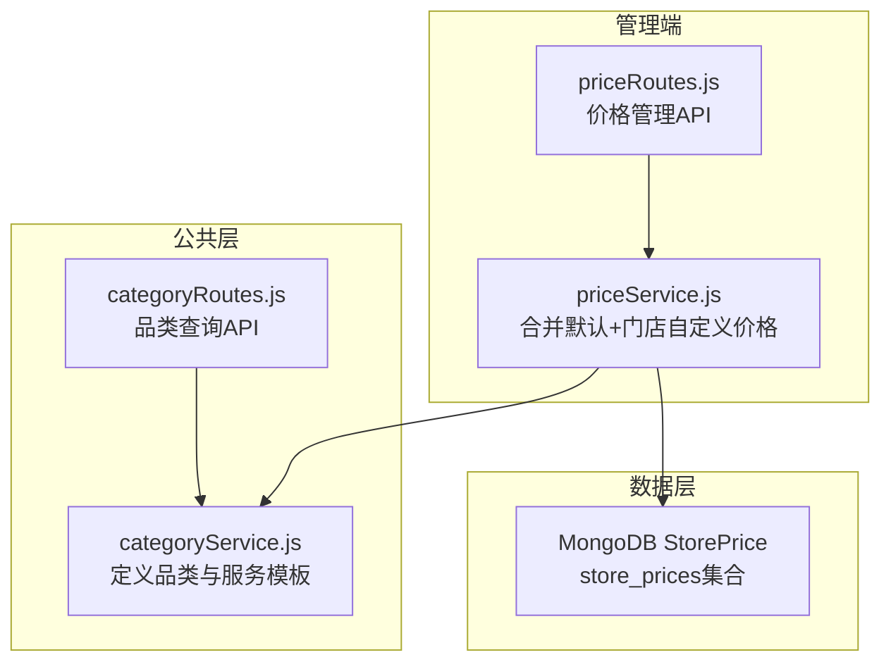
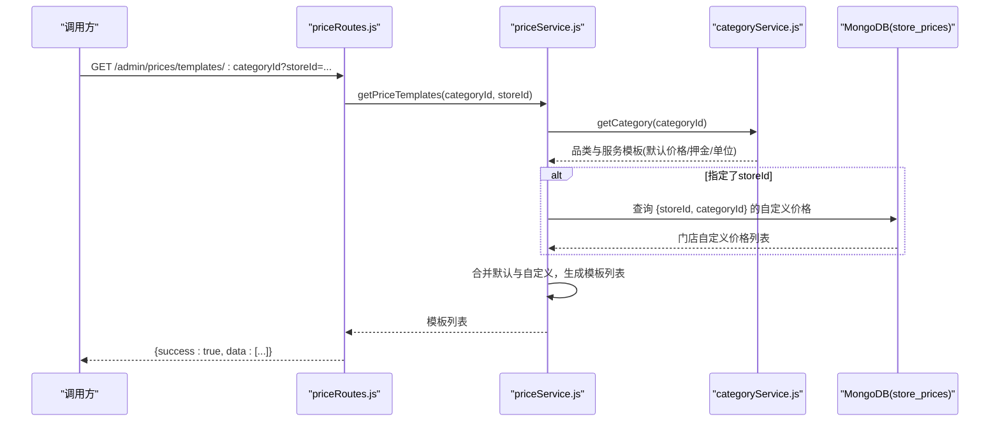
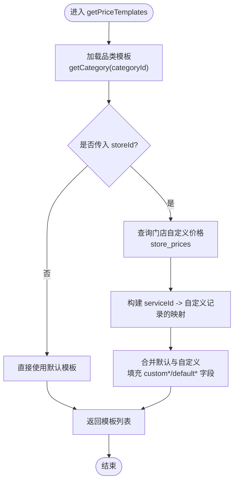
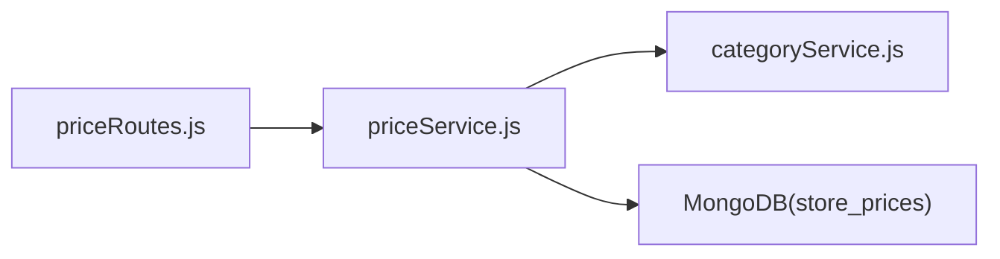

# 价格模板管理

<cite>
**本文引用的文件**   
- [backend/modules/admin/services/priceService.js](file://backend/modules/admin/services/priceService.js)
- [backend/modules/admin/routes/priceRoutes.js](file://backend/modules/admin/routes/priceRoutes.js)
- [backend/modules/common/services/categoryService.js](file://backend/modules/common/services/categoryService.js)
- [backend/modules/common/routes/categoryRoutes.js](file://backend/modules/common/routes/categoryRoutes.js)
- [backend/data/store-configs/ST001.json](file://backend/data/store-configs/ST001.json)
- [backend/data/store-configs/ST002.json](file://backend/data/store-configs/ST002.json)
</cite>

## 目录
1. [简介](#简介)
2. [项目结构](#项目结构)
3. [核心组件](#核心组件)
4. [架构总览](#架构总览)
5. [详细组件分析](#详细组件分析)
6. [依赖关系分析](#依赖关系分析)
7. [性能与扩展性](#性能与扩展性)
8. [故障排查指南](#故障排查指南)
9. [结论](#结论)
10. [附录：API 接口文档](#附录api-接口文档)

## 简介
本系统提供“干洗店价格模板管理”能力，围绕“品类-服务-门店”的三层模型，实现：
- 以品类为维度定义基础服务项（名称、图标、描述、默认价格、押金、单位等）
- 通过模板机制展示每个服务的默认配置
- 支持门店在模板基础上进行价格覆盖（自定义价格、押金、单位）
- 提供获取模板列表、查看详情、设置/批量设置、恢复默认等管理能力
- 支持按门店ID查询该门店对某品类的自定义价格覆盖情况

## 项目结构
与价格模板相关的后端模块主要位于 admin 与 common 两个子系统中：
- 公共品类服务：定义所有品类与服务模板（默认价格、押金、单位等）
- 价格管理服务：基于品类模板，结合门店自定义价格，生成最终可见的价格模板列表
- 价格管理路由：对外暴露 REST API，供商家端或后台使用

图表来源
- [backend/modules/common/services/categoryService.js:1-289](file://backend/modules/common/services/categoryService.js#L1-L289)
- [backend/modules/common/routes/categoryRoutes.js:1-59](file://backend/modules/common/routes/categoryRoutes.js#L1-L59)
- [backend/modules/admin/services/priceService.js:1-130](file://backend/modules/admin/services/priceService.js#L1-L130)
- [backend/modules/admin/routes/priceRoutes.js:1-79](file://backend/modules/admin/routes/priceRoutes.js#L1-L79)

章节来源
- [backend/modules/common/services/categoryService.js:1-289](file://backend/modules/common/services/categoryService.js#L1-L289)
- [backend/modules/common/routes/categoryRoutes.js:1-59](file://backend/modules/common/routes/categoryRoutes.js#L1-L59)
- [backend/modules/admin/services/priceService.js:1-130](file://backend/modules/admin/services/priceService.js#L1-L130)
- [backend/modules/admin/routes/priceRoutes.js:1-79](file://backend/modules/admin/routes/priceRoutes.js#L1-L79)

## 核心组件
- 品类与服务模板（categoryService）
  - 集中维护各品类及其服务项的定义，包含默认价格、押金、单位等字段
  - 提供按品类查询服务列表、状态流、卡片信息等能力
- 价格模板服务（priceService）
  - 读取品类模板作为“默认值”
  - 读取门店自定义价格（MongoDB store_prices），若存在则覆盖默认值
  - 输出统一的模板列表，标注是否被门店自定义覆盖
- 价格管理路由（priceRoutes）
  - 暴露获取模板、设置/批量设置、查询门店已设价格、恢复默认等接口

章节来源
- [backend/modules/common/services/categoryService.js:15-214](file://backend/modules/common/services/categoryService.js#L15-L214)
- [backend/modules/admin/services/priceService.js:16-27](file://backend/modules/admin/services/priceService.js#L16-L27)
- [backend/modules/admin/services/priceService.js:37-64](file://backend/modules/admin/services/priceService.js#L37-L64)
- [backend/modules/admin/routes/priceRoutes.js:13-23](file://backend/modules/admin/routes/priceRoutes.js#L13-L23)

## 架构总览
价格模板的整体流程如下：
- 前端/调用方请求品类下的服务模板列表
- 路由层将请求转发至价格服务
- 价格服务从品类服务获取默认模板，再查询门店自定义价格并合并
- 返回给调用方的结果中，既包含默认值，也包含门店覆盖值及覆盖标记

图表来源
- [backend/modules/admin/routes/priceRoutes.js:14-23](file://backend/modules/admin/routes/priceRoutes.js#L14-L23)
- [backend/modules/admin/services/priceService.js:37-64](file://backend/modules/admin/services/priceService.js#L37-L64)
- [backend/modules/common/services/categoryService.js:238-245](file://backend/modules/common/services/categoryService.js#L238-L245)

## 详细组件分析

### 品类与服务模板（categoryService）
- 职责
  - 维护多品类（如衣物干洗、鞋类洗护、奢侈品护理、宠物清洗、电子产品维修、服饰租赁等）
  - 每个品类包含服务项数组，每项包含 id、name、icon、desc、price、unit、deposit 等
  - 提供 getServices/getCategory 等方法用于查询
- 数据结构要点
  - services[].id：服务唯一标识
  - services[].price：默认价格
  - services[].deposit：默认押金（可选）
  - services[].unit：计量单位（如“件/双/天”）
- 复杂度
  - 查询时间复杂度 O(n)，n 为服务数量；空间复杂度 O(1)（仅返回引用）

章节来源
- [backend/modules/common/services/categoryService.js:15-214](file://backend/modules/common/services/categoryService.js#L15-L214)
- [backend/modules/common/services/categoryService.js:258-261](file://backend/modules/common/services/categoryService.js#L258-L261)

### 价格模板服务（priceService）
- 职责
  - 根据 categoryId 获取品类模板
  - 若传入 storeId，则查询该门店在该品类下是否有自定义价格记录
  - 合并默认与自定义，输出统一模板列表，并标注 isCustomized
- 存储模型（StorePrice）
  - 字段：storeId、categoryId、serviceId、price、deposit、unit、updatedAt
  - 索引：{storeId, categoryId, serviceId} 唯一索引，避免重复覆盖
- 关键方法
  - getPriceTemplates(categoryId, storeId)：返回模板列表（含默认与覆盖）
  - setServicePrice(...)：单条设置门店自定义价格（upsert）
  - batchSetPrices(...)：批量设置
  - getStorePrices(storeId, categoryId?)：查询门店已设置的自定义价格
  - resetPrice(storeId, categoryId, serviceId)：删除自定义记录，恢复默认
- 复杂度
  - 查询模板：O(m + n)，m 为自定义记录数，n 为服务数
  - 更新/插入：单次 O(logN)（索引命中）

图表来源
- [backend/modules/admin/services/priceService.js:37-64](file://backend/modules/admin/services/priceService.js#L37-L64)
- [backend/modules/admin/services/priceService.js:69-88](file://backend/modules/admin/services/priceService.js#L69-L88)

章节来源
- [backend/modules/admin/services/priceService.js:16-27](file://backend/modules/admin/services/priceService.js#L16-L27)
- [backend/modules/admin/services/priceService.js:37-64](file://backend/modules/admin/services/priceService.js#L37-L64)
- [backend/modules/admin/services/priceService.js:69-88](file://backend/modules/admin/services/priceService.js#L69-L88)
- [backend/modules/admin/services/priceService.js:93-106](file://backend/modules/admin/services/priceService.js#L93-L106)
- [backend/modules/admin/services/priceService.js:111-122](file://backend/modules/admin/services/priceService.js#L111-L122)

### 价格管理路由（priceRoutes）
- 职责
  - 暴露以下接口：
    - 获取品类服务模板（含门店覆盖）
    - 设置/修改单条服务价格
    - 批量设置某品类下所有服务价格
    - 获取门店所有已设价格
    - 删除门店自定义价格（恢复默认）
- 错误处理
  - 参数校验失败返回 400
  - 业务异常返回 500 并附带错误信息

章节来源
- [backend/modules/admin/routes/priceRoutes.js:13-23](file://backend/modules/admin/routes/priceRoutes.js#L13-L23)
- [backend/modules/admin/routes/priceRoutes.js:25-39](file://backend/modules/admin/routes/priceRoutes.js#L25-L39)
- [backend/modules/admin/routes/priceRoutes.js:41-53](file://backend/modules/admin/routes/priceRoutes.js#L41-L53)
- [backend/modules/admin/routes/priceRoutes.js:55-65](file://backend/modules/admin/routes/priceRoutes.js#L55-L65)
- [backend/modules/admin/routes/priceRoutes.js:67-76](file://backend/modules/admin/routes/priceRoutes.js#L67-L76)

### 模板继承与覆盖机制
- 默认模板来源：categoryService 中的 services 定义
- 覆盖规则：
  - 若门店针对某服务设置了自定义 price/deposit/unit，则以自定义为准
  - 未设置则回退到默认值
- 覆盖标记：
  - 模板结果中包含 isCustomized 字段，便于前端高亮显示已被覆盖的服务
- 恢复默认：
  - 删除对应 store_prices 记录即可恢复默认

章节来源
- [backend/modules/admin/services/priceService.js:37-64](file://backend/modules/admin/services/priceService.js#L37-L64)
- [backend/modules/admin/services/priceService.js:117-122](file://backend/modules/admin/services/priceService.js#L117-L122)

### 实际代码示例（路径指引）
- 获取某品类下的服务模板（含当前门店自定义价格）
  - 参考：[获取模板路由:13-23](file://backend/modules/admin/routes/priceRoutes.js#L13-L23)、[模板合并逻辑:37-64](file://backend/modules/admin/services/priceService.js#L37-L64)
- 设置单条服务价格（覆盖默认）
  - 参考：[设置价格路由:25-39](file://backend/modules/admin/routes/priceRoutes.js#L25-L39)、[设置价格服务:69-88](file://backend/modules/admin/services/priceService.js#L69-L88)
- 批量设置某品类下所有服务价格
  - 参考：[批量设置路由:41-53](file://backend/modules/admin/routes/priceRoutes.js#L41-L53)、[批量设置服务:93-106](file://backend/modules/admin/services/priceService.js#L93-L106)
- 查询门店已设置的所有价格
  - 参考：[查询门店价格路由:55-65](file://backend/modules/admin/routes/priceRoutes.js#L55-L65)、[查询服务:111-115](file://backend/modules/admin/services/priceService.js#L111-L115)
- 删除门店自定义价格（恢复默认）
  - 参考：[恢复默认路由:67-76](file://backend/modules/admin/routes/priceRoutes.js#L67-L76)、[删除服务:117-122](file://backend/modules/admin/services/priceService.js#L117-L122)

## 依赖关系分析
- 模块耦合
  - priceRoutes 依赖 priceService
  - priceService 依赖 categoryService 与 MongoDB（StorePrice）
- 外部依赖
  - MongoDB 集合：store_prices（由 Mongoose Schema 定义）
- 潜在循环依赖
  - 未发现循环依赖（单向依赖清晰）

图表来源
- [backend/modules/admin/routes/priceRoutes.js:1-8](file://backend/modules/admin/routes/priceRoutes.js#L1-L8)
- [backend/modules/admin/services/priceService.js:10-11](file://backend/modules/admin/services/priceService.js#L10-L11)
- [backend/modules/admin/services/priceService.js:16-27](file://backend/modules/admin/services/priceService.js#L16-L27)

章节来源
- [backend/modules/admin/routes/priceRoutes.js:1-8](file://backend/modules/admin/routes/priceRoutes.js#L1-L8)
- [backend/modules/admin/services/priceService.js:10-27](file://backend/modules/admin/services/priceService.js#L10-L27)

## 性能与扩展性
- 查询优化
  - 通过 {storeId, categoryId, serviceId} 唯一索引提升查询与写入性能
  - 模板合并采用内存映射，避免多次数据库访问
- 可扩展点
  - 新增品类或服务项只需在 categoryService 中维护
  - 如需引入折扣策略或促销叠加，可在 priceService 合并阶段扩展计算逻辑
- 注意事项
  - 大批量设置建议走批量接口，减少网络往返
  - 对于高频读场景，可考虑缓存品类模板与门店覆盖映射

## 故障排查指南
- 常见错误
  - 参数缺失：缺少 storeId/categoryId/serviceId/price 等，会返回 400
  - 品类不存在或未启用：返回 500 并携带错误信息
- 定位步骤
  - 检查请求参数是否完整
  - 确认品类是否存在且已启用（categoryService.getCategory）
  - 检查 MongoDB 连接与 store_prices 集合是否正常
  - 核对唯一索引冲突（同一门店+品类+服务重复写入）

章节来源
- [backend/modules/admin/routes/priceRoutes.js:25-39](file://backend/modules/admin/routes/priceRoutes.js#L25-L39)
- [backend/modules/admin/routes/priceRoutes.js:41-53](file://backend/modules/admin/routes/priceRoutes.js#L41-L53)
- [backend/modules/admin/services/priceService.js:37-40](file://backend/modules/admin/services/priceService.js#L37-L40)

## 结论
本方案通过“品类模板 + 门店覆盖”的机制，实现了灵活而可控的价格管理体系。默认模板保证一致性，门店覆盖满足差异化定价需求，配合完善的 API 与清晰的错误处理，便于快速集成与运维。

## 附录：API 接口文档

### 获取品类服务模板（含门店覆盖）
- 方法：GET
- 路径：/admin/prices/templates/:categoryId
- 查询参数：
  - storeId：可选，门店ID。传入后返回该门店的覆盖情况
- 响应体：
  - success：布尔
  - data：数组，元素包含：
    - serviceId、name、icon、desc
    - defaultPrice、defaultDeposit、defaultUnit
    - customPrice、customDeposit、customUnit
    - isCustomized

章节来源
- [backend/modules/admin/routes/priceRoutes.js:13-23](file://backend/modules/admin/routes/priceRoutes.js#L13-L23)
- [backend/modules/admin/services/priceService.js:37-64](file://backend/modules/admin/services/priceService.js#L37-L64)

### 设置/修改单条服务价格
- 方法：PUT
- 路径：/admin/prices/set
- 请求体：
  - storeId：必填
  - categoryId：必填
  - serviceId：必填
  - price：必填
  - deposit：可选
  - unit：可选
- 响应体：
  - success：布尔
  - data：更新的 StorePrice 记录

章节来源
- [backend/modules/admin/routes/priceRoutes.js:25-39](file://backend/modules/admin/routes/priceRoutes.js#L25-L39)
- [backend/modules/admin/services/priceService.js:69-88](file://backend/modules/admin/services/priceService.js#L69-L88)

### 批量设置某品类下所有服务价格
- 方法：PUT
- 路径：/admin/prices/batch
- 请求体：
  - storeId：必填
  - categoryId：必填
  - services：数组，元素包含 serviceId、price、deposit、unit
- 响应体：
  - success：布尔
  - data：更新后的记录数组

章节来源
- [backend/modules/admin/routes/priceRoutes.js:41-53](file://backend/modules/admin/routes/priceRoutes.js#L41-L53)
- [backend/modules/admin/services/priceService.js:93-106](file://backend/modules/admin/services/priceService.js#L93-L106)

### 获取门店所有已设价格
- 方法：GET
- 路径：/admin/prices/store/:storeId
- 查询参数：
  - categoryId：可选，按品类过滤
- 响应体：
  - success：布尔
  - data：StorePrice 记录数组

章节来源
- [backend/modules/admin/routes/priceRoutes.js:55-65](file://backend/modules/admin/routes/priceRoutes.js#L55-L65)
- [backend/modules/admin/services/priceService.js:111-115](file://backend/modules/admin/services/priceService.js#L111-L115)

### 删除门店自定义价格（恢复默认）
- 方法：DELETE
- 路径：/admin/prices/reset
- 请求体：
  - storeId：必填
  - categoryId：必填
  - serviceId：必填
- 响应体：
  - success：布尔
  - message：提示信息

章节来源
- [backend/modules/admin/routes/priceRoutes.js:67-76](file://backend/modules/admin/routes/priceRoutes.js#L67-L76)
- [backend/modules/admin/services/priceService.js:117-122](file://backend/modules/admin/services/priceService.js#L117-L122)

### 相关数据模型与示例
- StorePrice 模型字段
  - storeId、categoryId、serviceId、price、deposit、unit、updatedAt
  - 唯一索引：{storeId, categoryId, serviceId}
- 门店配置文件示例（用于对比不同门店的定价差异）
  - ST001.json、ST002.json

章节来源
- [backend/modules/admin/services/priceService.js:16-27](file://backend/modules/admin/services/priceService.js#L16-L27)
- [backend/data/store-configs/ST001.json:1-142](file://backend/data/store-configs/ST001.json#L1-L142)
- [backend/data/store-configs/ST002.json:1-135](file://backend/data/store-configs/ST002.json#L1-L135)