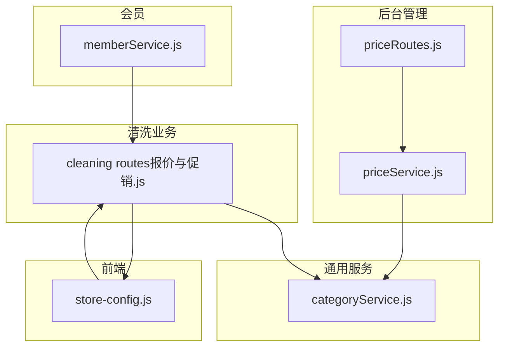
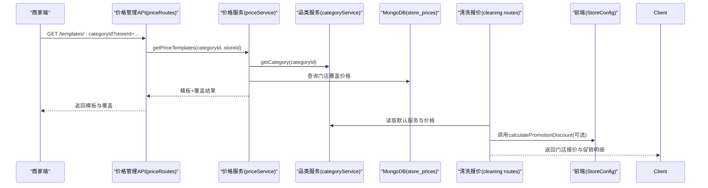
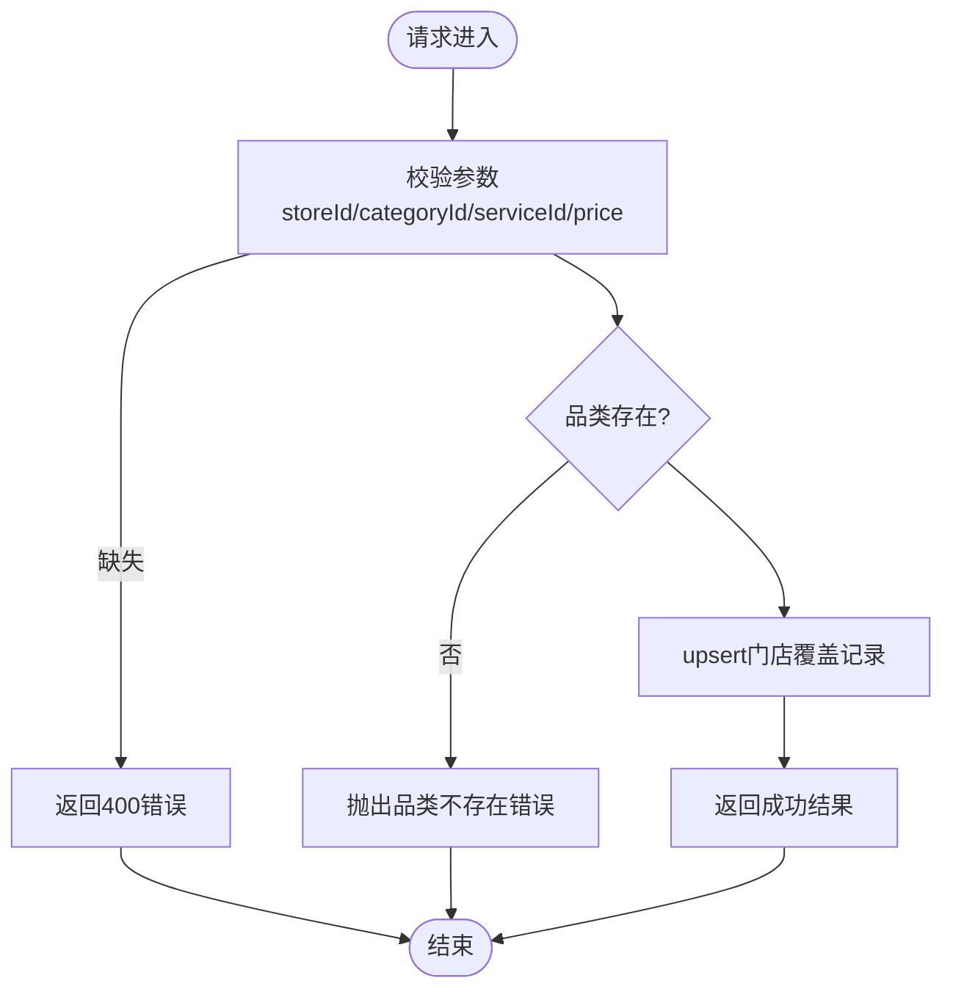
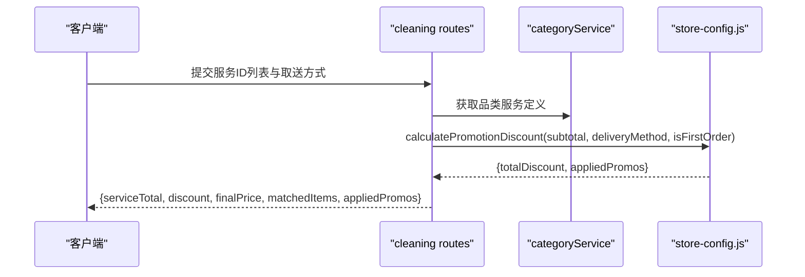
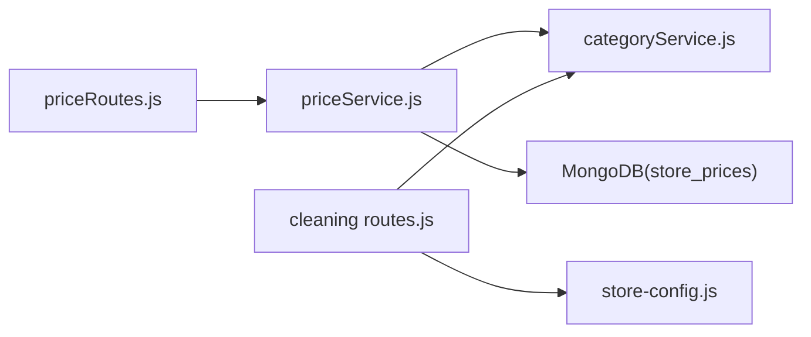

# 价格策略管理

<cite>
**本文引用的文件列表**
- [priceRoutes.js](file://backend/modules/admin/routes/priceRoutes.js)
- [priceService.js](file://backend/modules/admin/services/priceService.js)
- [categoryService.js](file://backend/modules/common/services/categoryService.js)
- [cleaning routes（报价与促销）.js](file://backend/modules/cleaning/routes.js)
- [store-config.js](file://js/store-config.js)
- [memberService.js](file://backend/modules/member/services/memberService.js)
</cite>

## 目录
1. [引言](#引言)
2. [项目结构](#项目结构)
3. [核心组件](#核心组件)
4. [架构总览](#架构总览)
5. [详细组件分析](#详细组件分析)
6. [依赖关系分析](#依赖关系分析)
7. [性能考量](#性能考量)
8. [故障排查指南](#故障排查指南)
9. [结论](#结论)
10. [附录：API 接口与使用示例](#附录api-接口与使用示例)

## 引言
本文件面向干洗店“价格策略管理系统”的文档，聚焦以下目标：
- 动态定价机制：基础价格、门店覆盖价、促销折扣等
- 会员折扣体系：等级与折扣映射、积分抵扣、优惠券叠加（现状与扩展建议）
- 价格版本管理与历史追踪：现状评估与演进建议
- 生效时间控制与区域差异化：现状评估与演进建议
- 测试与模拟：前端 StoreConfig 提供的计算能力与后端一致性校验
- API 接口文档与扩展开发指南：基于现有代码的可落地方案

## 项目结构
围绕价格策略的核心模块分布如下：
- 后台管理端价格配置 API：admin 模块下的 priceRoutes 与 priceService
- 品类与服务默认价格定义：common 模块下的 categoryService
- 订单报价与促销计算：cleaning 模块下的 routes（含门店报价与促销函数）
- 前端店面配置与促销计算：js/store-config.js（StoreConfig）
- 会员信息与等级折扣：member 模块下的 memberService

图表来源
- [priceRoutes.js:1-78](file://backend/modules/admin/routes/priceRoutes.js#L1-L78)
- [priceService.js:1-131](file://backend/modules/admin/services/priceService.js#L1-L131)
- [categoryService.js:1-289](file://backend/modules/common/services/categoryService.js#L1-L289)
- [cleaning routes（报价与促销）.js:727-858](file://backend/modules/cleaning/routes.js#L727-L858)
- [store-config.js:1-183](file://js/store-config.js#L1-L183)
- [memberService.js:1-134](file://backend/modules/member/services/memberService.js#L1-L134)

章节来源
- [priceRoutes.js:1-78](file://backend/modules/admin/routes/priceRoutes.js#L1-L78)
- [priceService.js:1-131](file://backend/modules/admin/services/priceService.js#L1-L131)
- [categoryService.js:1-289](file://backend/modules/common/services/categoryService.js#L1-L289)
- [cleaning routes（报价与促销）.js:727-858](file://backend/modules/cleaning/routes.js#L727-L858)
- [store-config.js:1-183](file://js/store-config.js#L1-L183)
- [memberService.js:1-134](file://backend/modules/member/services/memberService.js#L1-L134)

## 核心组件
- 门店价格模板与覆盖
  - 通过 admin 价格 API 获取某品类的服务模板，并合并门店自定义价格；若无门店覆盖则回退到系统默认价格。
  - 支持单条设置、批量设置、查询门店已设价格、恢复默认。
- 品类与服务默认价格
  - 在 common 的品类服务中集中维护各品类服务项及默认价格、单位、押金等元数据。
- 订单报价与促销计算
  - 后端 cleaning routes 提供按门店的服务匹配与促销折扣计算，返回最终应付金额与适用促销明细。
  - 前端 StoreConfig 提供一致的促销计算逻辑，用于 C 端预览与下单前试算。
- 会员等级与折扣
  - 根据用户积分自动判定会员等级，并给出对应折扣文案（如“8.5折”）。当前未直接参与价格计算引擎，但可作为扩展点接入。

章节来源
- [priceRoutes.js:1-78](file://backend/modules/admin/routes/priceRoutes.js#L1-L78)
- [priceService.js:1-131](file://backend/modules/admin/services/priceService.js#L1-L131)
- [categoryService.js:1-289](file://backend/modules/common/services/categoryService.js#L1-L289)
- [cleaning routes（报价与促销）.js:727-858](file://backend/modules/cleaning/routes.js#L727-L858)
- [store-config.js:1-183](file://js/store-config.js#L1-L183)
- [memberService.js:1-134](file://backend/modules/member/services/memberService.js#L1-L134)

## 架构总览
价格策略从“默认价格 + 门店覆盖 + 促销规则 + 会员权益”四个维度组合形成最终价格。

图表来源
- [priceRoutes.js:13-23](file://backend/modules/admin/routes/priceRoutes.js#L13-L23)
- [priceService.js:37-64](file://backend/modules/admin/services/priceService.js#L37-L64)
- [categoryService.js:239-245](file://backend/modules/common/services/categoryService.js#L239-L245)
- [cleaning routes（报价与促销）.js:727-858](file://backend/modules/cleaning/routes.js#L727-L858)
- [store-config.js:133-162](file://js/store-config.js#L133-L162)

## 详细组件分析

### 组件A：门店价格模板与覆盖（Admin 价格管理）
- 职责
  - 提供品类服务模板（含默认价格），并按门店维度合并覆盖价。
  - 提供单条/批量设置、查询、恢复默认的价格管理能力。
- 关键流程
  - 获取模板：先取品类定义，再查门店覆盖，最后合并输出。
  - 设置价格：upsert 更新门店覆盖记录，包含价格、押金、单位等。
  - 批量设置：循环调用单条设置。
  - 查询/恢复：按门店或品类过滤，删除覆盖即恢复默认。
- 数据结构要点
  - 门店覆盖集合包含：storeId、categoryId、serviceId、price、deposit、unit、updatedAt，并对三字段建立唯一索引。
- 复杂度与优化
  - 单次查询为 O(n) 遍历构建覆盖映射；批量设置顺序执行，可考虑批处理优化。
- 错误处理
  - 品类不存在或未启用时抛出异常；参数缺失返回 400。

图表来源
- [priceRoutes.js:25-39](file://backend/modules/admin/routes/priceRoutes.js#L25-L39)
- [priceService.js:69-88](file://backend/modules/admin/services/priceService.js#L69-L88)
- [priceService.js:93-106](file://backend/modules/admin/services/priceService.js#L93-L106)
- [priceService.js:111-122](file://backend/modules/admin/services/priceService.js#L111-L122)

章节来源
- [priceRoutes.js:1-78](file://backend/modules/admin/routes/priceRoutes.js#L1-L78)
- [priceService.js:1-131](file://backend/modules/admin/services/priceService.js#L1-L131)

### 组件B：品类与服务默认价格（Category Service）
- 职责
  - 集中维护多品类及其服务项的默认价格、单位、押金、状态流等元数据。
- 关键点
  - 每个服务项包含 id、name、desc、price、unit 等字段，作为系统默认价格的权威来源。
  - 提供按品类查询服务列表、状态流等工具方法。
- 与价格覆盖的关系
  - 当门店无覆盖时，直接使用此处默认价格；有覆盖时以覆盖为准。

章节来源
- [categoryService.js:15-45](file://backend/modules/common/services/categoryService.js#L15-L45)
- [categoryService.js:239-261](file://backend/modules/common/services/categoryService.js#L239-L261)

### 组件C：订单报价与促销计算（Cleaning Routes）
- 职责
  - 根据用户选择的服务，匹配门店可用服务与价格，计算服务总价，应用促销规则，得到最终应付金额。
- 促销规则
  - 支持“折扣型”和“满减型”两种促销类型，条件包括自取、首单、无条件等。
  - 后端与前端 StoreConfig 的计算逻辑保持一致，便于前后端统一展示与试算。
- 数据源
  - 服务价格优先来自门店配置（services 列表），若未配置则回退到品类默认价格。
- 输出
  - 返回 serviceTotal、discount、finalPrice、matchedItems、appliedPromos 等明细。

图表来源
- [cleaning routes（报价与促销）.js:727-858](file://backend/modules/cleaning/routes.js#L727-L858)
- [store-config.js:133-162](file://js/store-config.js#L133-L162)

章节来源
- [cleaning routes（报价与促销）.js:727-858](file://backend/modules/cleaning/routes.js#L727-L858)
- [store-config.js:1-183](file://js/store-config.js#L1-L183)

### 组件D：会员等级与折扣（Member Service）
- 职责
  - 根据用户积分计算会员等级，并返回对应折扣文案。
- 等级与折扣映射
  - 铂金会员、黄金会员、白银会员、普通会员分别对应不同折扣文案。
- 与价格引擎的关系
  - 当前仅返回折扣文案，未直接参与价格计算；可在后续扩展中接入实际折扣系数。

章节来源
- [memberService.js:99-117](file://backend/modules/member/services/memberService.js#L99-L117)

## 依赖关系分析
- 耦合关系
  - priceRoutes 依赖 priceService；priceService 依赖 categoryService 与 MongoDB。
  - cleaning routes 依赖 categoryService 与 store-config.js 的促销计算。
  - 前端 StoreConfig 暴露 getPublicServices 与 calculatePromotionDiscount，供 C 端与后端一致计算。
- 外部依赖
  - MongoDB（store_prices 集合）
  - Express（路由层）
- 潜在循环依赖
  - 未发现明显循环依赖。

图表来源
- [priceRoutes.js:1-78](file://backend/modules/admin/routes/priceRoutes.js#L1-L78)
- [priceService.js:1-131](file://backend/modules/admin/services/priceService.js#L1-L131)
- [categoryService.js:1-289](file://backend/modules/common/services/categoryService.js#L1-L289)
- [cleaning routes（报价与促销）.js:727-858](file://backend/modules/cleaning/routes.js#L727-L858)
- [store-config.js:1-183](file://js/store-config.js#L1-L183)

章节来源
- [priceRoutes.js:1-78](file://backend/modules/admin/routes/priceRoutes.js#L1-L78)
- [priceService.js:1-131](file://backend/modules/admin/services/priceService.js#L1-L131)
- [categoryService.js:1-289](file://backend/modules/common/services/categoryService.js#L1-L289)
- [cleaning routes（报价与促销）.js:727-858](file://backend/modules/cleaning/routes.js#L727-L858)
- [store-config.js:1-183](file://js/store-config.js#L1-L183)

## 性能考量
- 数据库索引
  - store_prices 对 (storeId, categoryId, serviceId) 建立唯一索引，提升查询与写入效率。
- 计算复杂度
  - 模板合并为 O(n)，批量设置为 O(k) 顺序 upsert；在高并发场景下可考虑批处理与事务。
- 缓存建议
  - 可将门店服务价格与促销规则进行短期缓存，减少频繁 IO。
- 一致性
  - 前后端促销计算逻辑保持一致，避免展示与结算不一致。

[本节为通用指导，不直接分析具体文件]

## 故障排查指南
- 常见错误
  - 缺少必要参数：检查必填字段是否齐全。
  - 品类不存在或未启用：确认品类 ID 正确且模块已启用。
  - 数据库连接失败：会员服务与价格服务均具备兜底逻辑，但生产环境需确保连接正常。
- 定位步骤
  - 查看路由层日志与响应体中的 error 字段。
  - 核对门店配置与服务名称是否匹配。
  - 对比前后端促销计算结果，确保规则一致。

章节来源
- [priceRoutes.js:25-39](file://backend/modules/admin/routes/priceRoutes.js#L25-L39)
- [priceService.js:37-40](file://backend/modules/admin/services/priceService.js#L37-L40)
- [memberService.js:22-44](file://backend/modules/member/services/memberService.js#L22-L44)

## 结论
- 当前系统实现了“默认价格 + 门店覆盖 + 促销规则”的动态定价闭环，并提供前后端一致的促销计算能力。
- 会员折扣体系已具备等级与折扣文案，尚未直接参与价格计算，可作为下一步扩展点。
- 价格版本管理、历史追踪、生效时间控制、区域差异化定价等功能尚未实现，建议在后续迭代中引入版本化与调度机制。

[本节为总结性内容，不直接分析具体文件]

## 附录：API 接口与使用示例

### 价格管理 API（Admin）
- 获取品类服务模板（含门店覆盖）
  - 方法：GET
  - 路径：/api/admin/prices/templates/:categoryId
  - 查询参数：storeId
  - 说明：返回该品类下所有服务的默认价格与门店覆盖价格。
- 设置单条服务价格
  - 方法：PUT
  - 路径：/api/admin/prices/set
  - 请求体：{ storeId, categoryId, serviceId, price, deposit?, unit? }
  - 说明：upsert 门店覆盖记录。
- 批量设置价格
  - 方法：PUT
  - 路径：/api/admin/prices/batch
  - 请求体：{ storeId, categoryId, services: [{ serviceId, price, deposit?, unit? }] }
  - 说明：批量 upsert 门店覆盖记录。
- 查询门店已设价格
  - 方法：GET
  - 路径：/api/admin/prices/store/:storeId
  - 查询参数：categoryId（可选）
  - 说明：返回门店覆盖价格清单。
- 恢复默认价格
  - 方法：DELETE
  - 路径：/api/admin/prices/reset
  - 请求体：{ storeId, categoryId, serviceId }
  - 说明：删除门店覆盖记录，回退到系统默认价格。

章节来源
- [priceRoutes.js:13-76](file://backend/modules/admin/routes/priceRoutes.js#L13-L76)

### 促销计算（前后端一致）
- 前端 StoreConfig
  - 方法：calculatePromotionDiscount(storeId, subtotal, deliveryMethod, isFirstOrder)
  - 返回：{ totalDiscount, appliedPromos }
  - 说明：支持折扣型与满减型促销，条件包括自取、首单、无条件。
- 后端 cleaning routes
  - 内部函数：calculatePromotionDiscount(promotions, subtotal, deliveryMethod, isFirstOrder)
  - 说明：与前端逻辑保持一致，用于门店报价阶段统一计算。

章节来源
- [store-config.js:133-162](file://js/store-config.js#L133-L162)
- [cleaning routes（报价与促销）.js:751-758](file://backend/modules/cleaning/routes.js#L751-L758)

### 会员折扣（现状与扩展）
- 现状
  - 根据积分计算等级，返回折扣文案（如“8.5折”）。
- 扩展建议
  - 将折扣文案转换为数值系数，并在价格计算引擎中应用。
  - 支持与促销叠加策略（例如：会员折扣与满减互斥或叠加）。

章节来源
- [memberService.js:99-117](file://backend/modules/member/services/memberService.js#L99-L117)

### 价格版本管理与历史追踪（规划）
- 现状
  - 门店覆盖记录包含 updatedAt，但未保留历史快照与回滚能力。
- 建议设计
  - 新增价格版本集合，记录每次变更的版本号、生效时间、操作人、变更前后的价格快照。
  - 支持按版本号回滚至指定版本。
  - 支持定时生效（cron 或任务队列）与区域差异化（region 维度）。

[本节为规划与建议，不直接分析具体文件]

### 价格生效时间控制与区域差异化（规划）
- 生效时间控制
  - 在服务模板与门店覆盖中增加 startTime/endTime，计算时判断当前时间是否在生效窗口内。
- 区域差异化
  - 在门店覆盖或促销规则中增加 region 字段，按区域维度匹配价格与优惠。

[本节为规划与建议，不直接分析具体文件]

### 价格计算引擎扩展开发指南
- 扩展点
  - 在 cleaning routes 的报价流程中插入“会员折扣”、“优惠券”、“时段加价/折扣”等插件式计算步骤。
  - 保持前后端一致的促销计算接口，确保 C 端预览与后端结算一致。
- 最佳实践
  - 将每条优惠/折扣抽象为独立规则对象，包含优先级、作用范围、叠加策略。
  - 对复杂规则进行单元测试与回归测试，保证稳定性。

[本节为通用指导，不直接分析具体文件]