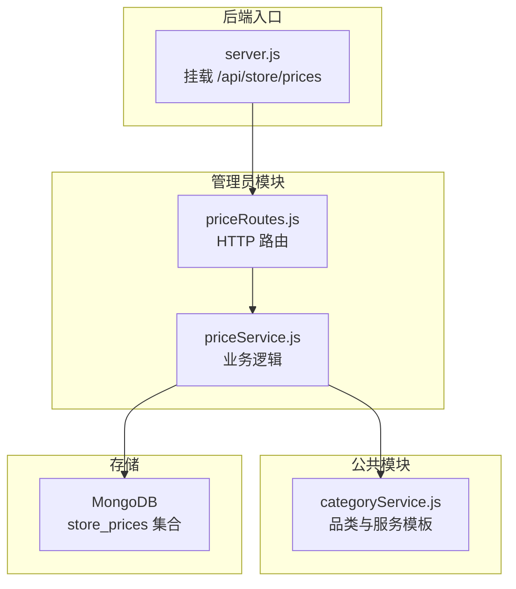
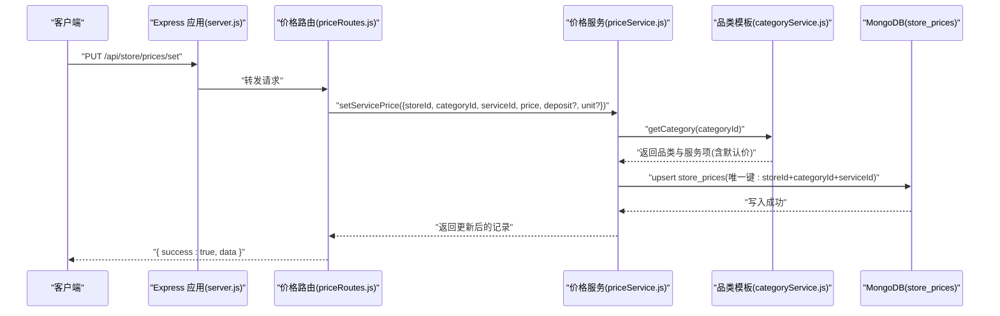
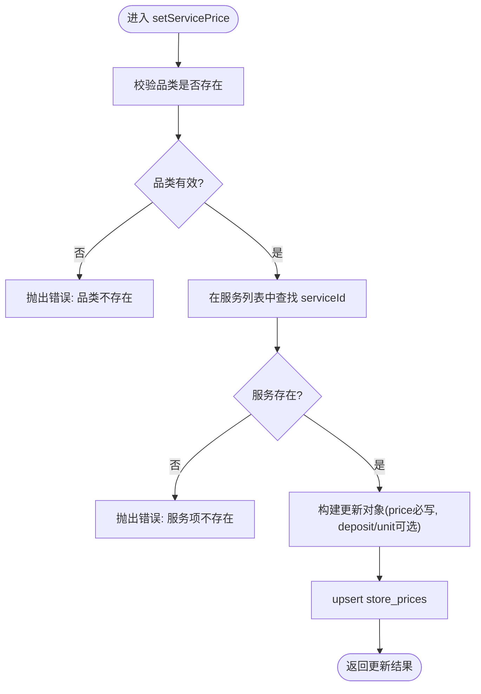
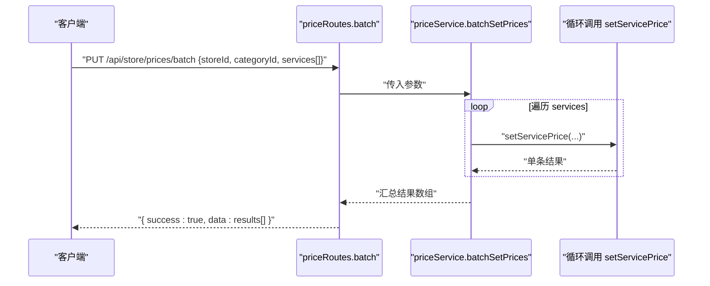
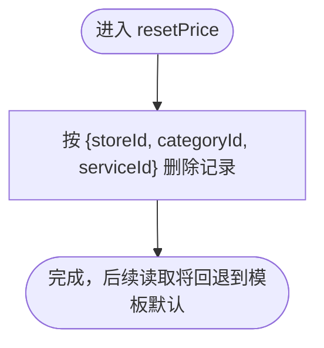
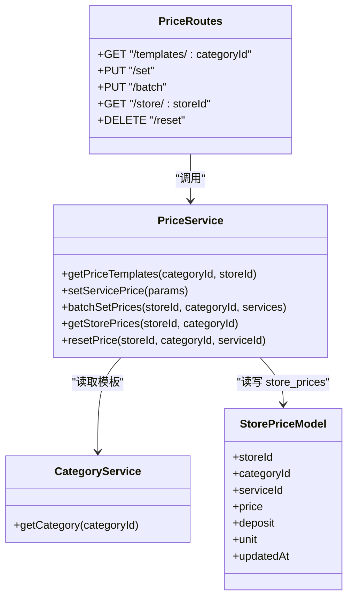

# 服务定价管理

<cite>
**本文引用的文件**   
- [priceRoutes.js](file://backend/modules/admin/routes/priceRoutes.js)
- [priceService.js](file://backend/modules/admin/services/priceService.js)
- [categoryService.js](file://backend/modules/common/services/categoryService.js)
- [server.js](file://backend/server.js)
</cite>

## 目录
1. [简介](#简介)
2. [项目结构](#项目结构)
3. [核心组件](#核心组件)
4. [架构总览](#架构总览)
5. [详细组件分析](#详细组件分析)
6. [依赖关系分析](#依赖关系分析)
7. [性能与扩展性](#性能与扩展性)
8. [故障排查指南](#故障排查指南)
9. [结论](#结论)
10. [附录：API 接口文档](#附录api-接口文档)

## 简介
本文件面向干洗店服务定价管理系统，聚焦“单个服务价格设置与修改”“批量价格设置”“价格重置（恢复默认）”三大能力，并给出完整的定价管理 API 说明、参数校验规则、错误处理机制以及最佳实践建议。系统采用“模板默认价 + 门店自定义覆盖”的双层价格体系：品类与服务项的默认价格由系统配置提供；门店可在其范围内对特定服务进行价格、押金、单位等字段的个性化覆盖。

## 项目结构
定价管理相关代码位于后端模块中，路由层暴露 HTTP 接口，服务层实现业务逻辑，数据持久化到 MongoDB。

图表来源
- [server.js:134-136](file://backend/server.js#L134-L136)
- [priceRoutes.js:1-79](file://backend/modules/admin/routes/priceRoutes.js#L1-L79)
- [priceService.js:1-131](file://backend/modules/admin/services/priceService.js#L1-L131)
- [categoryService.js:1-289](file://backend/modules/common/services/categoryService.js#L1-L289)

章节来源
- [server.js:134-136](file://backend/server.js#L134-L136)
- [priceRoutes.js:1-79](file://backend/modules/admin/routes/priceRoutes.js#L1-L79)
- [priceService.js:1-131](file://backend/modules/admin/services/priceService.js#L1-L131)
- [categoryService.js:1-289](file://backend/modules/common/services/categoryService.js#L1-L289)

## 核心组件
- 路由层（priceRoutes.js）
  - 负责解析请求参数、基础校验、调用服务层并返回统一 JSON 响应。
- 服务层（priceService.js）
  - 定义 StorePrice 模型与索引策略。
  - 实现获取模板、设置单条价格、批量设置、查询门店已设价格、删除自定义价格（恢复默认）。
- 品类模板（categoryService.js）
  - 维护各品类的服务项及其默认 price/deposit/unit 等字段，作为默认价格来源。
- 应用入口（server.js）
  - 将价格管理路由挂载到 /api/store/prices 前缀下。

章节来源
- [priceRoutes.js:1-79](file://backend/modules/admin/routes/priceRoutes.js#L1-L79)
- [priceService.js:1-131](file://backend/modules/admin/services/priceService.js#L1-L131)
- [categoryService.js:1-289](file://backend/modules/common/services/categoryService.js#L1-L289)
- [server.js:134-136](file://backend/server.js#L134-L136)

## 架构总览
下图展示了从客户端发起请求到最终落库的完整链路，以及“模板默认价 + 门店自定义覆盖”的数据合并策略。

图表来源
- [server.js:134-136](file://backend/server.js#L134-L136)
- [priceRoutes.js:26-39](file://backend/modules/admin/routes/priceRoutes.js#L26-L39)
- [priceService.js:69-88](file://backend/modules/admin/services/priceService.js#L69-L88)
- [categoryService.js:239-245](file://backend/modules/common/services/categoryService.js#L239-L245)

## 详细组件分析

### 数据模型与索引
- 集合名：store_prices
- 字段
  - storeId: 字符串，必填
  - categoryId: 字符串，必填
  - serviceId: 字符串，必填
  - price: 数字，必填
  - deposit: 数字，可选（默认 null）
  - unit: 字符串，可选（默认 null）
  - updatedAt: 时间戳，自动更新
- 唯一索引：{ storeId, categoryId, serviceId } 唯一，确保同一门店同一品类同一服务仅一条覆盖记录

章节来源
- [priceService.js:16-27](file://backend/modules/admin/services/priceService.js#L16-L27)

### 价格模板与覆盖策略
- 模板默认值来源：categoryService 中每个服务的 price/deposit/unit 等字段。
- 覆盖优先级：若存在门店自定义记录，则使用自定义值；否则回退到模板默认值。
- 模板列表接口会同时返回 default* 与 custom* 字段，便于前端展示差异。

章节来源
- [priceService.js:37-64](file://backend/modules/admin/services/priceService.js#L37-L64)
- [categoryService.js:15-214](file://backend/modules/common/services/categoryService.js#L15-L214)

### 单个服务价格设置与修改
- 功能要点
  - 校验品类与服务是否存在于模板中。
  - 支持选择性更新 deposit、unit；price 为必填。
  - 使用 upsert 保证幂等写入。
- 关键流程
  - 路由层接收参数并做基础非空校验。
  - 服务层校验品类与服务项有效性。
  - 构造更新对象并执行 findOneAndUpdate(upsert)。

图表来源
- [priceService.js:69-88](file://backend/modules/admin/services/priceService.js#L69-L88)

章节来源
- [priceRoutes.js:26-39](file://backend/modules/admin/routes/priceRoutes.js#L26-L39)
- [priceService.js:69-88](file://backend/modules/admin/services/priceService.js#L69-L88)

### 批量价格设置
- 功能要点
  - 一次性更新某品类下多个服务的价格。
  - 内部循环调用单条设置逻辑，逐条 upsert。
- 输入要求
  - services 为数组，每项包含 serviceId、price，可选 deposit、unit。
- 输出
  - 返回每条记录的更新结果数组。

图表来源
- [priceRoutes.js:42-53](file://backend/modules/admin/routes/priceRoutes.js#L42-L53)
- [priceService.js:93-106](file://backend/modules/admin/services/priceService.js#L93-L106)

章节来源
- [priceRoutes.js:42-53](file://backend/modules/admin/routes/priceRoutes.js#L42-L53)
- [priceService.js:93-106](file://backend/modules/admin/services/priceService.js#L93-L106)

### 价格重置（恢复默认）
- 功能要点
  - 删除该门店在该品类下的该服务自定义记录，从而回退到模板默认值。
- 语义
  - 并非“计算默认值”，而是“移除覆盖”。

图表来源
- [priceService.js:120-122](file://backend/modules/admin/services/priceService.js#L120-L122)
- [priceRoutes.js:68-76](file://backend/modules/admin/routes/priceRoutes.js#L68-L76)

章节来源
- [priceService.js:120-122](file://backend/modules/admin/services/priceService.js#L120-L122)
- [priceRoutes.js:68-76](file://backend/modules/admin/routes/priceRoutes.js#L68-L76)

### 获取模板与门店已设价格
- 获取模板（含当前门店自定义覆盖）
  - 返回每个服务的 default* 与 custom* 字段，以及 isCustomized 标记。
- 获取门店已设价格
  - 可按 categoryId 过滤，返回所有覆盖记录。

章节来源
- [priceService.js:37-64](file://backend/modules/admin/services/priceService.js#L37-L64)
- [priceService.js:111-115](file://backend/modules/admin/services/priceService.js#L111-L115)
- [priceRoutes.js:14-23](file://backend/modules/admin/routes/priceRoutes.js#L14-L23)
- [priceRoutes.js:56-65](file://backend/modules/admin/routes/priceRoutes.js#L56-L65)

## 依赖关系分析
- 路由层依赖服务层，服务层依赖品类模板与数据库。
- 路由层不直接访问数据库，保持职责单一。
- 品类模板通过 categoryService 集中管理，避免硬编码散落。

图表来源
- [priceRoutes.js:1-79](file://backend/modules/admin/routes/priceRoutes.js#L1-L79)
- [priceService.js:1-131](file://backend/modules/admin/services/priceService.js#L1-L131)
- [categoryService.js:239-245](file://backend/modules/common/services/categoryService.js#L239-L245)

章节来源
- [priceRoutes.js:1-79](file://backend/modules/admin/routes/priceRoutes.js#L1-L79)
- [priceService.js:1-131](file://backend/modules/admin/services/priceService.js#L1-L131)
- [categoryService.js:239-245](file://backend/modules/common/services/categoryService.js#L239-L245)

## 性能与扩展性
- 写入路径
  - 单条设置使用 upsert，具备幂等性，适合重试场景。
  - 批量设置为串行循环调用单条设置，简单可靠；当批量规模较大时，可考虑在 Service 层改为批量 upsert 以提升吞吐。
- 查询路径
  - 模板合并逻辑先查门店覆盖再与模板合并，建议在高频读场景引入缓存（如 Redis），以减轻模板与数据库压力。
- 索引优化
  - 已有 {storeId, categoryId, serviceId} 唯一索引，满足定位覆盖记录的高效查询。
  - 如需按 storeId 或 categoryId 聚合统计，可评估增加辅助索引。

[本节为通用指导，不涉及具体文件分析]

## 故障排查指南
- 常见错误
  - 缺少必要参数：路由层会对必填字段进行基础校验，缺失将返回 400。
  - 品类或服务不存在：服务层在设置时会校验模板，不存在将抛出错误。
  - 重复覆盖：由于唯一索引约束，重复写入不会报错，但会覆盖旧值。
- 定位步骤
  - 检查请求体是否包含 storeId、categoryId、serviceId、price。
  - 确认 categoryId 对应的服务项 id 是否存在于模板。
  - 查看 store_prices 集合中是否存在对应记录。
- 日志与调试
  - 服务端统一捕获异常并以 { success: false, error } 形式返回，便于前端提示。

章节来源
- [priceRoutes.js:26-39](file://backend/modules/admin/routes/priceRoutes.js#L26-L39)
- [priceRoutes.js:42-53](file://backend/modules/admin/routes/priceRoutes.js#L42-L53)
- [priceService.js:69-88](file://backend/modules/admin/services/priceService.js#L69-L88)

## 结论
本定价管理体系以“模板默认 + 门店覆盖”为核心，通过简洁的 REST 接口提供单条设置、批量设置与重置能力。配合明确的参数校验与统一的错误返回格式，既保证了易用性，也具备良好的可扩展性与可维护性。

[本节为总结性内容，不涉及具体文件分析]

## 附录：API 接口文档

### 基础信息
- 基础路径：/api/store/prices
- 认证：当前路由未内置鉴权中间件，请结合上层网关或中间件控制访问权限。
- 响应格式：统一 { success, data?, message?, error? }

章节来源
- [server.js:134-136](file://backend/server.js#L134-L136)
- [priceRoutes.js:14-23](file://backend/modules/admin/routes/priceRoutes.js#L14-L23)

### 接口清单

1) 获取品类服务模板（含门店自定义覆盖）
- 方法：GET
- 路径：/api/store/prices/templates/:categoryId
- 查询参数
  - storeId: 字符串，可选；用于合并门店覆盖
- 成功响应
  - data: 数组，每项包含 serviceId、name、icon、desc、defaultPrice、defaultDeposit、defaultUnit、customPrice、customDeposit、customUnit、isCustomized
- 失败响应
  - 400/500：{ success: false, error }

章节来源
- [priceRoutes.js:14-23](file://backend/modules/admin/routes/priceRoutes.js#L14-L23)
- [priceService.js:37-64](file://backend/modules/admin/services/priceService.js#L37-L64)

2) 设置/修改单条服务价格
- 方法：PUT
- 路径：/api/store/prices/set
- 请求体
  - storeId: 字符串，必填
  - categoryId: 字符串，必填
  - serviceId: 字符串，必填
  - price: 数字，必填
  - deposit: 数字，可选
  - unit: 字符串，可选
- 成功响应
  - data: 更新后的 store_prices 记录
- 失败响应
  - 400：缺少必要参数
  - 500：服务层错误（如品类或服务不存在）

章节来源
- [priceRoutes.js:26-39](file://backend/modules/admin/routes/priceRoutes.js#L26-L39)
- [priceService.js:69-88](file://backend/modules/admin/services/priceService.js#L69-L88)

3) 批量设置某品类下多个服务价格
- 方法：PUT
- 路径：/api/store/prices/batch
- 请求体
  - storeId: 字符串，必填
  - categoryId: 字符串，必填
  - services: 数组，必填；每项包含 serviceId、price，可选 deposit、unit
- 成功响应
  - data: 数组，每项为单条设置的结果
- 失败响应
  - 400：缺少必要参数或 services 非数组
  - 500：服务层错误

章节来源
- [priceRoutes.js:42-53](file://backend/modules/admin/routes/priceRoutes.js#L42-L53)
- [priceService.js:93-106](file://backend/modules/admin/services/priceService.js#L93-L106)

4) 获取门店已设置的价格
- 方法：GET
- 路径：/api/store/prices/store/:storeId
- 查询参数
  - categoryId: 字符串，可选；按品类过滤
- 成功响应
  - data: 数组，元素为 store_prices 记录
- 失败响应
  - 500：服务层错误

章节来源
- [priceRoutes.js:56-65](file://backend/modules/admin/routes/priceRoutes.js#L56-L65)
- [priceService.js:111-115](file://backend/modules/admin/services/priceService.js#L111-L115)

5) 删除门店自定义价格（恢复默认）
- 方法：DELETE
- 路径：/api/store/prices/reset
- 请求体
  - storeId: 字符串，必填
  - categoryId: 字符串，必填
  - serviceId: 字符串，必填
- 成功响应
  - message: 操作成功提示
- 失败响应
  - 500：服务层错误

章节来源
- [priceRoutes.js:68-76](file://backend/modules/admin/routes/priceRoutes.js#L68-L76)
- [priceService.js:120-122](file://backend/modules/admin/services/priceService.js#L120-L122)

### 字段含义与验证规则
- price
  - 含义：服务单价
  - 必填：是（单条设置）
  - 类型：数字
- deposit
  - 含义：押金（适用于租赁类服务等需要押金的场景）
  - 必填：否
  - 类型：数字，可为 null
- unit
  - 含义：计价单位（如“件”“双”“/天”等）
  - 必填：否
  - 类型：字符串，可为 null
- 模板默认值
  - 来自 categoryService 中对应服务的 price/deposit/unit 等字段
- 覆盖规则
  - 若存在 store_prices 记录，则以覆盖为准；否则回退到模板默认值

章节来源
- [priceService.js:16-27](file://backend/modules/admin/services/priceService.js#L16-L27)
- [categoryService.js:15-214](file://backend/modules/common/services/categoryService.js#L15-L214)

### 使用示例与最佳实践
- 示例一：设置单条价格
  - 请求：PUT /api/store/prices/set
  - 请求体：{ storeId, categoryId, serviceId, price, deposit?, unit? }
  - 说明：首次写入即创建覆盖记录；再次调用为更新覆盖。
- 示例二：批量设置
  - 请求：PUT /api/store/prices/batch
  - 请求体：{ storeId, categoryId, services: [{ serviceId, price, ... }] }
  - 说明：适合开业初始化或调价活动时的全量更新。
- 示例三：恢复默认
  - 请求：DELETE /api/store/prices/reset
  - 请求体：{ storeId, categoryId, serviceId }
  - 说明：删除覆盖后，后续读取将回退到模板默认值。
- 最佳实践
  - 前端展示：优先显示 custom* 字段，若无则显示 default* 字段，并用 isCustomized 标识差异。
  - 幂等写入：利用 upsert 特性，允许安全重试。
  - 批量操作：大批量更新建议分批次提交，避免单次请求过大。
  - 权限控制：在网关或中间件层限制仅授权角色可调用。

[本节为通用指导，不涉及具体文件分析]