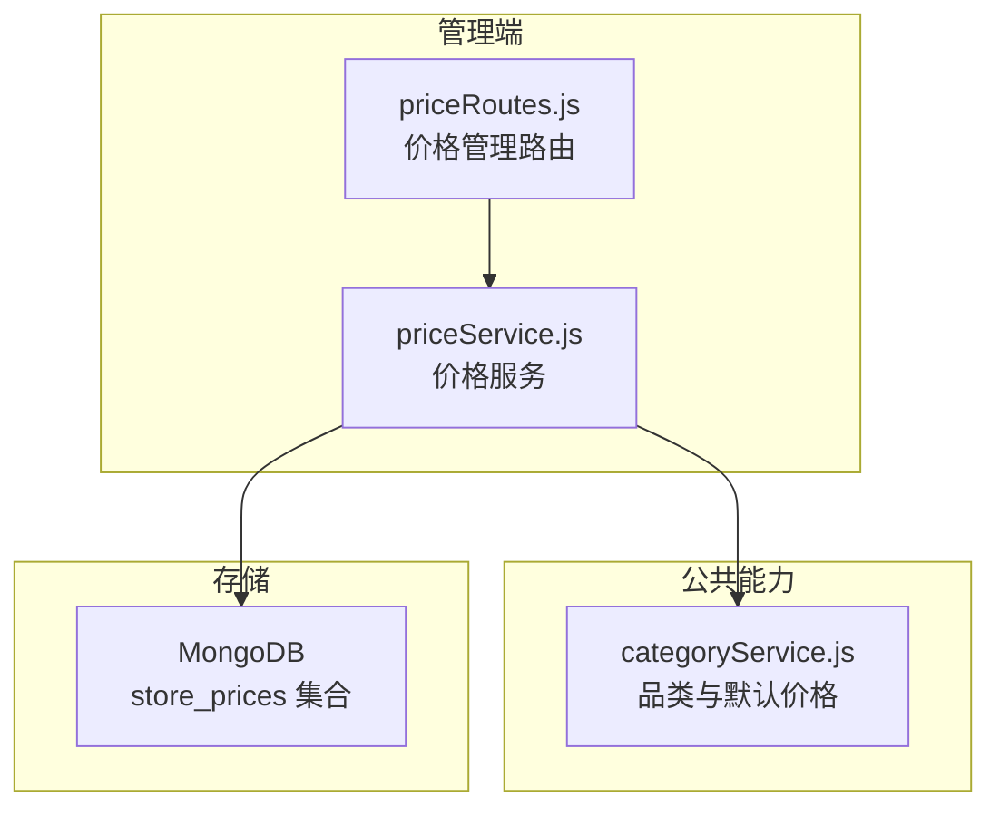
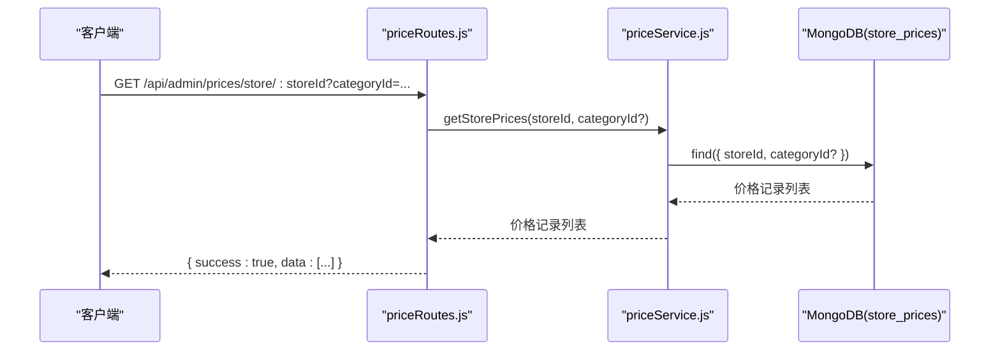
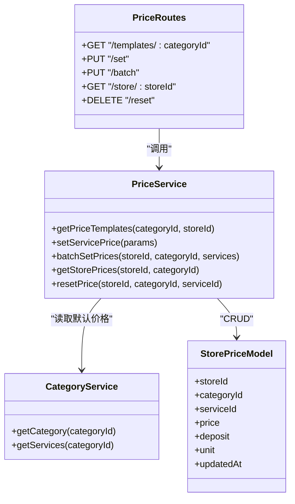

# 门店价格查询

<cite>
**本文引用的文件**   
- [backend/modules/admin/routes/priceRoutes.js](file://backend/modules/admin/routes/priceRoutes.js)
- [backend/modules/admin/services/priceService.js](file://backend/modules/admin/services/priceService.js)
- [backend/modules/common/services/categoryService.js](file://backend/modules/common/services/categoryService.js)
</cite>

## 目录
1. [简介](#简介)
2. [项目结构](#项目结构)
3. [核心组件](#核心组件)
4. [架构总览](#架构总览)
5. [详细组件分析](#详细组件分析)
6. [依赖关系分析](#依赖关系分析)
7. [性能与缓存策略](#性能与缓存策略)
8. [故障排查指南](#故障排查指南)
9. [结论](#结论)

## 简介
本文件面向干洗店“门店价格查询”能力，说明如何获取门店所有已设置的价格信息，并支持按门店ID和品类ID进行筛选。文档涵盖：
- 价格数据返回格式（服务ID、当前价格、是否自定义等）
- 价格优先级机制（自定义价格优先于模板价格）
- 价格查询API接口完整说明（参数、响应、错误码）
- 价格数据同步机制与缓存策略建议
- 性能优化建议

## 项目结构
与“门店价格查询”直接相关的后端模块位于 admin 子模块中，包含路由层与服务层；品类定义与默认价格来源于 common 的 categoryService。

图表来源
- [backend/modules/admin/routes/priceRoutes.js:1-79](file://backend/modules/admin/routes/priceRoutes.js#L1-L79)
- [backend/modules/admin/services/priceService.js:1-131](file://backend/modules/admin/services/priceService.js#L1-L131)
- [backend/modules/common/services/categoryService.js:1-289](file://backend/modules/common/services/categoryService.js#L1-L289)

章节来源
- [backend/modules/admin/routes/priceRoutes.js:1-79](file://backend/modules/admin/routes/priceRoutes.js#L1-L79)
- [backend/modules/admin/services/priceService.js:1-131](file://backend/modules/admin/services/priceService.js#L1-L131)
- [backend/modules/common/services/categoryService.js:1-289](file://backend/modules/common/services/categoryService.js#L1-L289)

## 核心组件
- 路由层 priceRoutes.js
  - 提供价格模板查询、单条/批量设置、获取门店已设价格、恢复默认等接口
- 服务层 priceService.js
  - 实现价格模板合并逻辑、自定义价格增删改查、基于 MongoDB 的持久化
- 品类服务 categoryService.js
  - 维护品类与默认价格（模板），供价格服务读取默认值

章节来源
- [backend/modules/admin/routes/priceRoutes.js:1-79](file://backend/modules/admin/routes/priceRoutes.js#L1-L79)
- [backend/modules/admin/services/priceService.js:1-131](file://backend/modules/admin/services/priceService.js#L1-L131)
- [backend/modules/common/services/categoryService.js:1-289](file://backend/modules/common/services/categoryService.js#L1-L289)

## 架构总览
下图展示了“获取门店所有已设置价格”的调用链路：客户端请求进入路由层，路由转发至服务层，服务层根据可选的 categoryId 过滤后从 MongoDB 读取 store_prices 集合，并以统一 JSON 格式返回。

图表来源
- [backend/modules/admin/routes/priceRoutes.js:55-65](file://backend/modules/admin/routes/priceRoutes.js#L55-L65)
- [backend/modules/admin/services/priceService.js:108-115](file://backend/modules/admin/services/priceService.js#L108-L115)

## 详细组件分析

### 接口：获取门店所有已设置价格
- 路径与方法
  - GET /api/admin/prices/store/:storeId
- 查询参数
  - storeId（路径参数，必填）
  - categoryId（查询参数，可选）
- 功能说明
  - 返回该门店在指定品类下（如未传则全部品类）的所有已设置价格记录
- 响应结构
  - 成功
    - success: true
    - data: 数组，元素为一条已设置的价格记录，字段包括：
      - storeId: 门店ID
      - categoryId: 品类ID
      - serviceId: 服务ID
      - price: 价格（数值）
      - deposit: 押金（可为空）
      - unit: 单位（可为空）
      - updatedAt: 更新时间
  - 失败
    - success: false
    - error: 错误信息
- 错误码
  - 500：服务端异常（例如数据库不可用或内部错误）
- 使用示例（示意）
  - 获取某门店全部已设置价格：GET /api/admin/prices/store/ST001
  - 仅获取某门店某品类的已设置价格：GET /api/admin/prices/store/ST001?categoryId=cleaning

章节来源
- [backend/modules/admin/routes/priceRoutes.js:55-65](file://backend/modules/admin/routes/priceRoutes.js#L55-L65)
- [backend/modules/admin/services/priceService.js:108-115](file://backend/modules/admin/services/priceService.js#L108-L115)

### 接口：获取品类服务模板（含门店自定义价格）
- 路径与方法
  - GET /api/admin/prices/templates/:categoryId
- 查询参数
  - storeId（查询参数，可选）
- 功能说明
  - 返回该品类下的服务模板列表，并在每条服务上标注系统默认价格与门店自定义价格，便于前端展示“最终显示价格”
- 返回字段说明（每条服务项）
  - serviceId: 服务ID
  - name: 服务名称
  - icon: 图标标识
  - desc: 描述
  - defaultPrice: 系统默认价格
  - defaultDeposit: 系统默认押金
  - defaultUnit: 系统默认单位
  - customPrice: 门店自定义价格（若存在）
  - customDeposit: 门店自定义押金（若存在）
  - customUnit: 门店自定义单位（若存在）
  - isCustomized: 是否已自定义（布尔）
- 价格优先级机制
  - 最终显示价格 = 若 isCustomized 为真则取 customPrice，否则取 defaultPrice
  - 同理，deposit 与 unit 也遵循相同覆盖规则
- 错误处理
  - 当品类不存在或未启用时，抛出错误，由路由层以 500 状态码返回错误消息

章节来源
- [backend/modules/admin/routes/priceRoutes.js:13-23](file://backend/modules/admin/routes/priceRoutes.js#L13-L23)
- [backend/modules/admin/services/priceService.js:33-64](file://backend/modules/admin/services/priceService.js#L33-L64)
- [backend/modules/common/services/categoryService.js:239-245](file://backend/modules/common/services/categoryService.js#L239-L245)

### 接口：设置/修改单条服务价格
- 路径与方法
  - PUT /api/admin/prices/set
- 请求体字段
  - storeId: 门店ID（必填）
  - categoryId: 品类ID（必填）
  - serviceId: 服务ID（必填）
  - price: 价格（必填）
  - deposit: 押金（可选）
  - unit: 单位（可选）
- 行为
  - 若该门店-品类-服务组合已有记录则更新，否则新增（upsert）
- 响应
  - success: true/false
  - data: 更新后的记录对象（包含 updatedAt 等）
  - error: 失败原因

章节来源
- [backend/modules/admin/routes/priceRoutes.js:25-39](file://backend/modules/admin/routes/priceRoutes.js#L25-L39)
- [backend/modules/admin/services/priceService.js:66-88](file://backend/modules/admin/services/priceService.js#L66-L88)

### 接口：批量设置某品类下所有服务价格
- 路径与方法
  - PUT /api/admin/prices/batch
- 请求体字段
  - storeId: 门店ID（必填）
  - categoryId: 品类ID（必填）
  - services: 数组，每项包含 serviceId、price、deposit、unit
- 行为
  - 对每个服务项执行一次 setServicePrice 操作
- 响应
  - success: true/false
  - data: 各条记录的更新结果数组
  - error: 失败原因

章节来源
- [backend/modules/admin/routes/priceRoutes.js:41-53](file://backend/modules/admin/routes/priceRoutes.js#L41-L53)
- [backend/modules/admin/services/priceService.js:90-106](file://backend/modules/admin/services/priceService.js#L90-L106)

### 接口：删除门店自定义价格（恢复默认）
- 路径与方法
  - DELETE /api/admin/prices/reset
- 请求体字段
  - storeId: 门店ID（必填）
  - categoryId: 品类ID（必填）
  - serviceId: 服务ID（必填）
- 行为
  - 删除该门店-品类-服务的自定义价格记录，使其回退到模板默认价格
- 响应
  - success: true
  - message: 提示语

章节来源
- [backend/modules/admin/routes/priceRoutes.js:67-76](file://backend/modules/admin/routes/priceRoutes.js#L67-L76)
- [backend/modules/admin/services/priceService.js:117-122](file://backend/modules/admin/services/priceService.js#L117-L122)

### 数据模型与索引
- 集合名
  - store_prices
- 字段
  - storeId: 字符串，必填
  - categoryId: 字符串，必填
  - serviceId: 字符串，必填
  - price: 数值，必填
  - deposit: 数值，可空
  - unit: 字符串，可空
  - updatedAt: 时间戳，默认当前时间
- 唯一索引
  - (storeId, categoryId, serviceId) 唯一，避免重复覆盖

章节来源
- [backend/modules/admin/services/priceService.js:16-27](file://backend/modules/admin/services/priceService.js#L16-L27)

### 价格模板与默认价格来源
- 默认价格来源于 categoryService 中各品类的 services 列表，其中包含 id、name、icon、desc、price、unit、deposit 等
- 价格模板接口会将“系统默认 + 门店自定义”合并输出，isCustomized 用于指示是否存在门店覆盖

章节来源
- [backend/modules/common/services/categoryService.js:15-214](file://backend/modules/common/services/categoryService.js#L15-L214)
- [backend/modules/admin/services/priceService.js:37-64](file://backend/modules/admin/services/priceService.js#L37-L64)

## 依赖关系分析
- priceRoutes.js 依赖 priceService.js
- priceService.js 依赖 categoryService.js（读取默认价格）与 MongoDB（读写 store_prices）
- categoryService.js 不依赖其他业务服务，仅提供品类与默认价格

图表来源
- [backend/modules/admin/routes/priceRoutes.js:1-79](file://backend/modules/admin/routes/priceRoutes.js#L1-L79)
- [backend/modules/admin/services/priceService.js:1-131](file://backend/modules/admin/services/priceService.js#L1-L131)
- [backend/modules/common/services/categoryService.js:1-289](file://backend/modules/common/services/categoryService.js#L1-L289)

## 性能与缓存策略
- 当前实现
  - 查询“门店已设置价格”直接访问 MongoDB，无应用级缓存
  - 模板合并接口会先读 categoryService（内存常量），再读 store_prices（MongoDB）
- 建议优化
  - 应用内缓存
    - 针对“门店已设置价格”接口，可按 storeId 维度建立本地缓存（如内存 Map 或 Redis），设置合理过期时间（例如 1~5 分钟），降低热点门店的数据库压力
    - 针对“模板合并”接口，可对 store_prices 结果做短期缓存，减少频繁合并计算
  - 数据库层面
    - 确保 (storeId, categoryId, serviceId) 唯一索引已生效（已实现）
    - 高频查询可增加 (storeId, categoryId) 复合索引以提升按门店+品类过滤的性能
  - 批量写入优化
    - 对于大批量设置价格，可在服务层使用 MongoDB 的 bulkWrite 替代逐条 upsert，减少往返开销
  - 限流与幂等
    - 对写接口增加速率限制与幂等键，防止重复提交导致抖动
  - 监控与告警
    - 对慢查询与异常率进行埋点，结合日志定位瓶颈

[本节为通用性能建议，不直接分析具体代码文件]

## 故障排查指南
- 常见错误
  - 缺少必要参数：当设置价格接口缺少 storeId、categoryId、serviceId 或 price 时，将返回 400 及错误提示
  - 品类不存在或未启用：模板接口校验品类有效性，不合法将抛出错误并由路由层返回 500
  - 数据库异常：任何数据库连接或查询失败都会触发 500 错误
- 排查步骤
  - 检查请求参数是否完整且类型正确
  - 确认 categoryId 对应的品类是否启用
  - 查看后端日志中的错误堆栈，定位是参数校验、品类校验还是数据库问题
  - 验证 store_prices 集合是否存在对应记录（可通过管理端重置接口恢复默认）

章节来源
- [backend/modules/admin/routes/priceRoutes.js:25-39](file://backend/modules/admin/routes/priceRoutes.js#L25-L39)
- [backend/modules/admin/routes/priceRoutes.js:13-23](file://backend/modules/admin/routes/priceRoutes.js#L13-L23)
- [backend/modules/admin/services/priceService.js:37-40](file://backend/modules/admin/services/priceService.js#L37-L40)

## 结论
- “门店价格查询”通过 REST 接口暴露，支持按门店ID与品类ID筛选，返回门店已设置的价格明细
- 价格优先级明确：自定义价格优先于模板价格，模板价格作为兜底
- 数据模型清晰，具备唯一索引保障一致性
- 建议在现有基础上引入应用级缓存与批量写入优化，进一步提升高并发场景下的稳定性与性能