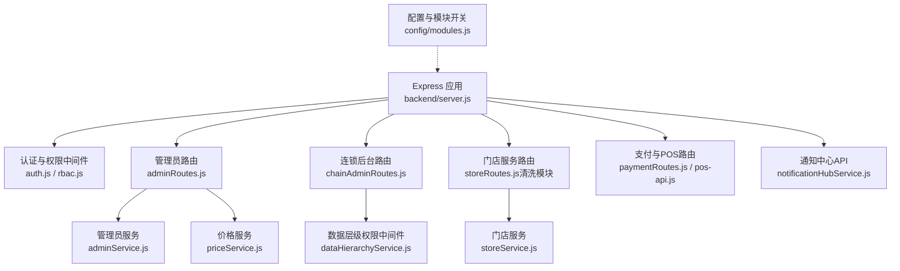
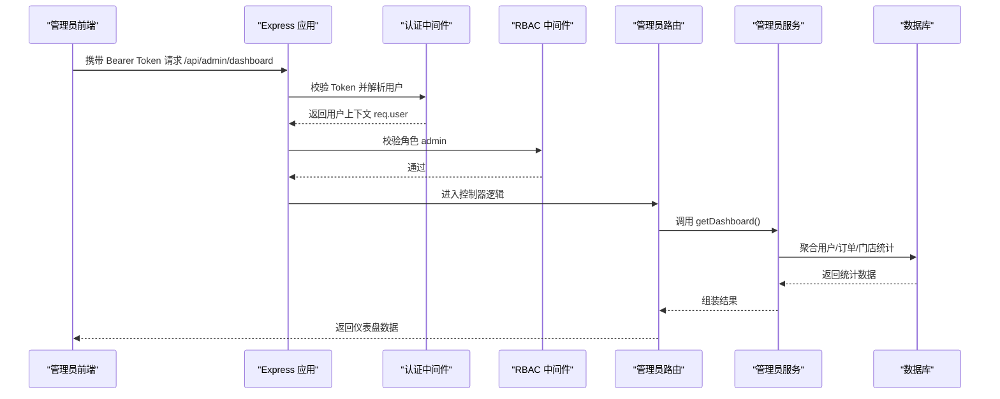
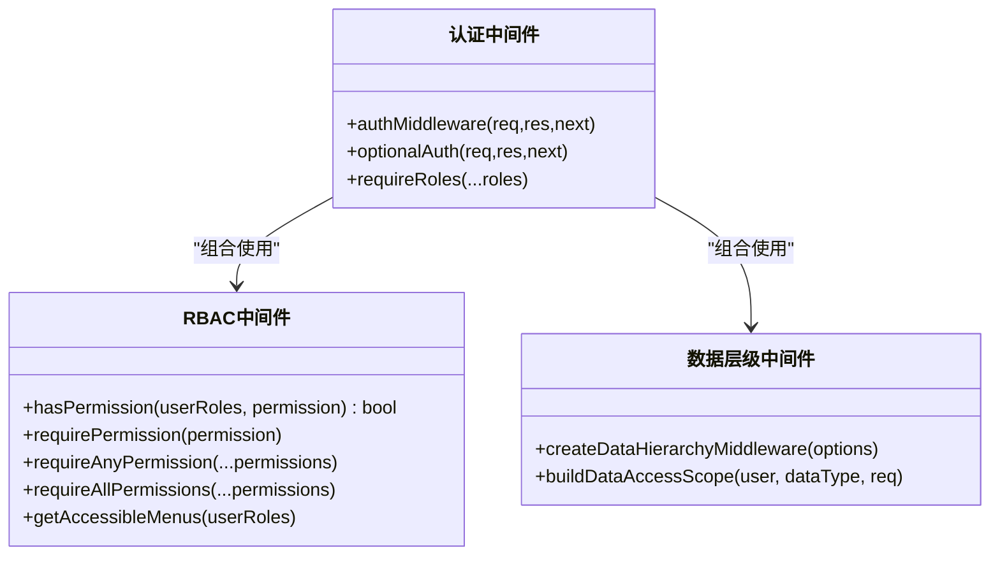
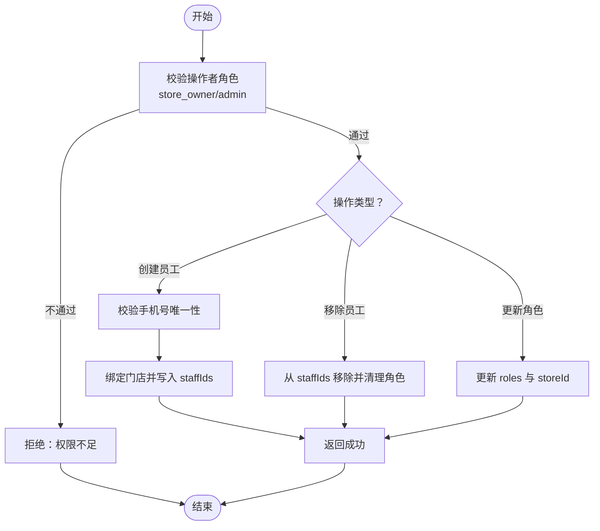
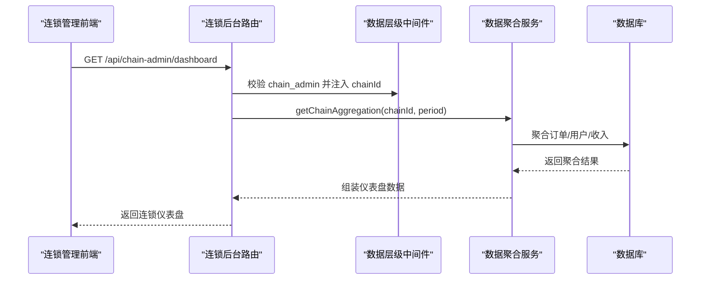
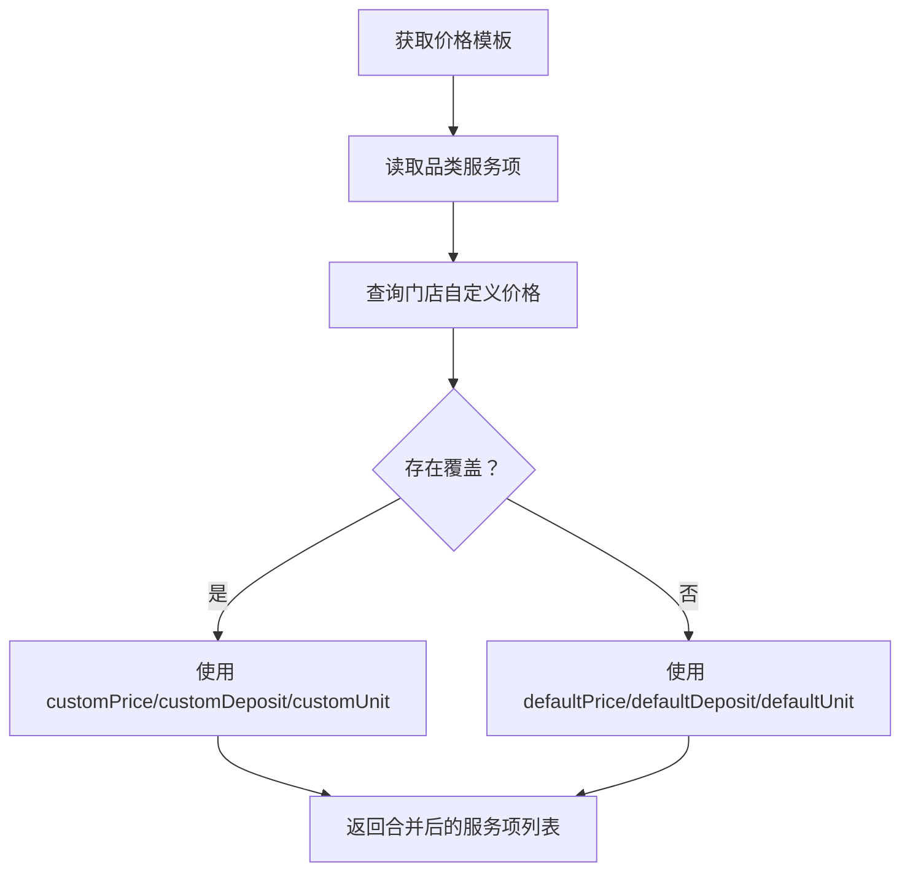
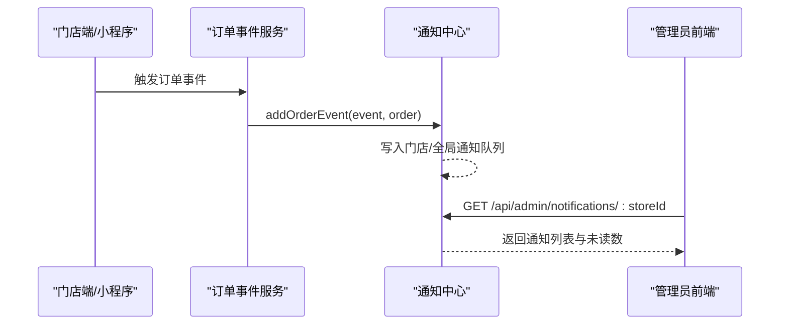
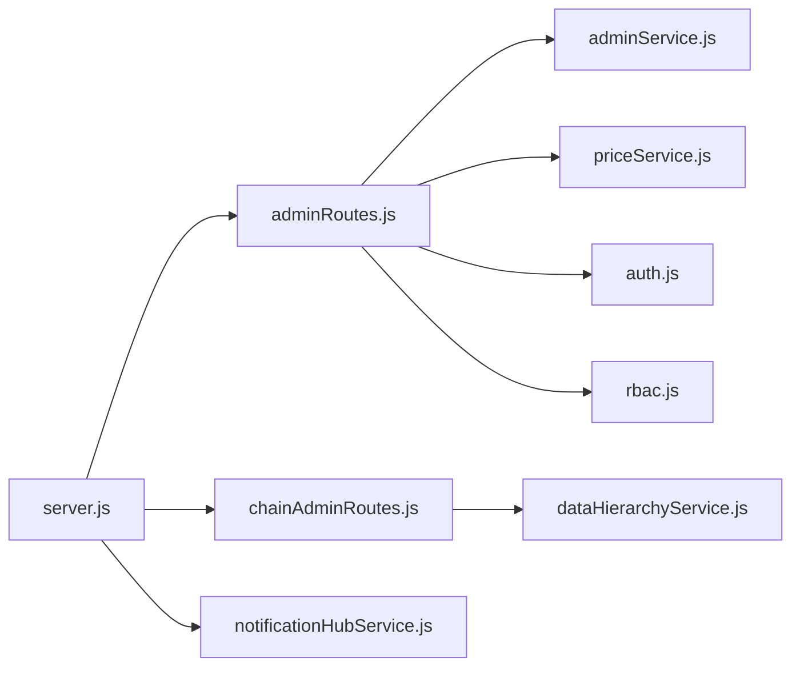

# 后台管理系统

<cite>
**本文引用的文件**   
- [backend/server.js](file://backend/server.js)
- [backend/modules/admin/routes/adminRoutes.js](file://backend/modules/admin/routes/adminRoutes.js)
- [backend/modules/admin/services/adminService.js](file://backend/modules/admin/services/adminService.js)
- [backend/modules/common/middlewares/auth.js](file://backend/modules/common/middlewares/auth.js)
- [backend/modules/common/middlewares/rbac.js](file://backend/modules/common/middlewares/rbac.js)
- [backend/modules/common/models/index.js](file://backend/modules/common/models/index.js)
- [backend/modules/admin/routes/chainAdminRoutes.js](file://backend/modules/admin/routes/chainAdminRoutes.js)
- [backend/modules/common/services/dataHierarchyService.js](file://backend/modules/common/services/dataHierarchyService.js)
- [backend/modules/cleaning/services/storeService.js](file://backend/modules/cleaning/services/storeService.js)
- [backend/modules/admin/services/priceService.js](file://backend/modules/admin/services/priceService.js)
- [backend/config/modules.js](file://backend/config/modules.js)
- [backend/services/notificationHubService.js](file://backend/services/notificationHubService.js)
- [admin.html](file://admin.html)
- [chain-admin.html](file://chain-admin.html)
</cite>

## 目录
1. [引言](#引言)
2. [项目结构](#项目结构)
3. [核心组件](#核心组件)
4. [架构总览](#架构总览)
5. [详细组件分析](#详细组件分析)
6. [依赖关系分析](#依赖关系分析)
7. [性能与可扩展性](#性能与可扩展性)
8. [故障排查指南](#故障排查指南)
9. [结论](#结论)
10. [附录：API 接口清单](#附录api-接口清单)

## 引言
本文件面向干洗店后台管理系统的产品、研发与运维人员，系统性阐述管理员角色设计与权限控制机制、门店管理服务、连锁管理平台、价格策略管理、后台管理 API 以及前端管理界面模块。文档同时提供系统监控与日志管理能力说明，帮助管理员高效运营多门店体系并快速定位问题。

## 项目结构
后端采用模块化路由与服务分层设计，统一入口在 Express 应用中挂载各业务模块路由；认证与权限通过中间件实现；数据模型集中在公共模型定义中；连锁平台与门店管理分别由独立路由与服务支撑；价格策略以“系统默认 + 门店覆盖”的方式管理；通知中心为后台实时事件提供聚合能力。

图示来源
- [backend/server.js:96-152](file://backend/server.js#L96-L152)
- [backend/modules/common/middlewares/auth.js:1-207](file://backend/modules/common/middlewares/auth.js#L1-L207)
- [backend/modules/common/middlewares/rbac.js:1-172](file://backend/modules/common/middlewares/rbac.js#L1-L172)
- [backend/modules/admin/routes/adminRoutes.js:1-1206](file://backend/modules/admin/routes/adminRoutes.js#L1-L1206)
- [backend/modules/admin/routes/chainAdminRoutes.js:1-1059](file://backend/modules/admin/routes/chainAdminRoutes.js#L1-L1059)
- [backend/modules/cleaning/services/storeService.js:1-376](file://backend/modules/cleaning/services/storeService.js#L1-L376)
- [backend/modules/admin/services/priceService.js:1-131](file://backend/modules/admin/services/priceService.js#L1-L131)
- [backend/config/modules.js:1-203](file://backend/config/modules.js#L1-L203)
- [backend/services/notificationHubService.js:1-264](file://backend/services/notificationHubService.js#L1-L264)

章节来源
- [backend/server.js:1-702](file://backend/server.js#L1-L702)
- [backend/config/modules.js:1-203](file://backend/config/modules.js#L1-L203)

## 核心组件
- 认证与授权
  - 基于 Token 的认证中间件，支持开发模式下的便捷登录标识；按角色进行访问控制。
  - RBAC 权限中间件，提供细粒度权限检查与菜单可见性计算。
- 管理员服务
  - 仪表盘统计、用户/门店/订单管理、模块与系统设置、灯条与配送等扩展能力。
- 连锁后台
  - 基于数据层级权限中间件，确保连锁管理员仅能访问其所属连锁的数据，并提供聚合报表。
- 门店服务
  - 门店信息管理、员工账号创建/移除/角色调整、服务项管理等。
- 价格策略
  - 系统默认价格模板 + 门店自定义覆盖，支持批量设置与恢复默认。
- 通知中心
  - 统一收集订单与灯条事件，供后台轮询或实时展示。

章节来源
- [backend/modules/common/middlewares/auth.js:1-207](file://backend/modules/common/middlewares/auth.js#L1-L207)
- [backend/modules/common/middlewares/rbac.js:1-172](file://backend/modules/common/middlewares/rbac.js#L1-L172)
- [backend/modules/admin/services/adminService.js:1-800](file://backend/modules/admin/services/adminService.js#L1-L800)
- [backend/modules/admin/routes/chainAdminRoutes.js:1-800](file://backend/modules/admin/routes/chainAdminRoutes.js#L1-L800)
- [backend/modules/cleaning/services/storeService.js:1-376](file://backend/modules/cleaning/services/storeService.js#L1-L376)
- [backend/modules/admin/services/priceService.js:1-131](file://backend/modules/admin/services/priceService.js#L1-L131)
- [backend/services/notificationHubService.js:1-264](file://backend/services/notificationHubService.js#L1-L264)

## 架构总览
整体采用“统一入口 + 模块化路由 + 服务层 + 数据模型”的分层架构。认证与权限作为横切关注点，贯穿所有受保护路由；连锁平台通过数据层级中间件保证数据边界；通知中心与跨端同步服务增强后台可观测性与协同效率。

图示来源
- [backend/server.js:96-152](file://backend/server.js#L96-L152)
- [backend/modules/common/middlewares/auth.js:1-207](file://backend/modules/common/middlewares/auth.js#L1-L207)
- [backend/modules/common/middlewares/rbac.js:1-172](file://backend/modules/common/middlewares/rbac.js#L1-L172)
- [backend/modules/admin/routes/adminRoutes.js:1-1206](file://backend/modules/admin/routes/adminRoutes.js#L1-L1206)
- [backend/modules/admin/services/adminService.js:1-800](file://backend/modules/admin/services/adminService.js#L1-L800)

## 详细组件分析

### 角色与权限控制
- 角色体系
  - 超级管理员（admin）：拥有全部权限，可访问所有数据与功能。
  - 连锁管理员（chain_admin）：仅能访问其所属连锁的企业信息、门店、订单与资金汇总。
  - 门店老板（store_owner）：管理本店信息与员工、结算等。
  - 门店员工（store_staff）：执行门店日常操作，查看本店数据。
  - 普通客户（customer）：C端用户，仅能访问自身数据。
- 权限验证流程
  - 认证中间件从请求头解析 Token，注入 req.user。
  - 角色中间件 requireRoles 校验是否具备所需角色。
  - RBAC 中间件提供细粒度权限检查（如 order.view.all）。
- 数据边界
  - 数据层级中间件根据角色自动构建访问范围（链级、店级、个人），防止越权访问。

图示来源
- [backend/modules/common/middlewares/auth.js:1-207](file://backend/modules/common/middlewares/auth.js#L1-L207)
- [backend/modules/common/middlewares/rbac.js:1-172](file://backend/modules/common/middlewares/rbac.js#L1-L172)
- [backend/modules/common/services/dataHierarchyService.js:1-648](file://backend/modules/common/services/dataHierarchyService.js#L1-L648)

章节来源
- [backend/modules/common/middlewares/auth.js:1-207](file://backend/modules/common/middlewares/auth.js#L1-L207)
- [backend/modules/common/middlewares/rbac.js:1-172](file://backend/modules/common/middlewares/rbac.js#L1-L172)
- [backend/modules/common/models/index.js:735-777](file://backend/modules/common/models/index.js#L735-L777)
- [backend/modules/common/services/dataHierarchyService.js:1-648](file://backend/modules/common/services/dataHierarchyService.js#L1-L648)

### 门店管理服务
- 门店信息管理
  - 列表查询、详情获取、状态更新、创建与批量导入。
  - 支持地理位置搜索、分页与关键词检索。
- 员工账号管理
  - 创建员工账户（注册新用户并绑定门店）、移除员工、更新员工角色。
  - 权限校验：仅门店老板或管理员可操作。
- 营业数据统计
  - 门店维度订单量、收入、用户数等指标聚合。
  - 与连锁后台联动，支持跨层级汇总。

图示来源
- [backend/modules/cleaning/services/storeService.js:175-341](file://backend/modules/cleaning/services/storeService.js#L175-L341)
- [backend/modules/admin/routes/adminRoutes.js:134-238](file://backend/modules/admin/routes/adminRoutes.js#L134-L238)

章节来源
- [backend/modules/cleaning/services/storeService.js:1-376](file://backend/modules/cleaning/services/storeService.js#L1-L376)
- [backend/modules/admin/routes/adminRoutes.js:96-238](file://backend/modules/admin/routes/adminRoutes.js#L96-L238)

### 连锁管理平台
- 数据边界
  - 连锁管理员只能访问其 chainId 关联的门店与订单数据。
- 核心能力
  - 连锁信息概览、仪表盘、订单/门店/用户列表与详情、资金概览与流水、趋势分析。
- 数据聚合
  - 基于时间窗口聚合订单、用户与收入趋势，并按门店分组统计。

图示来源
- [backend/modules/admin/routes/chainAdminRoutes.js:76-133](file://backend/modules/admin/routes/chainAdminRoutes.js#L76-L133)
- [backend/modules/common/services/dataHierarchyService.js:449-602](file://backend/modules/common/services/dataHierarchyService.js#L449-L602)

章节来源
- [backend/modules/admin/routes/chainAdminRoutes.js:1-800](file://backend/modules/admin/routes/chainAdminRoutes.js#L1-L800)
- [backend/modules/common/services/dataHierarchyService.js:1-648](file://backend/modules/common/services/dataHierarchyService.js#L1-L648)

### 价格策略管理系统
- 定价模型
  - 系统默认价格模板（品类服务项）+ 门店自定义覆盖。
- 核心能力
  - 获取价格模板（合并默认与门店覆盖）、单条/批量设置价格、删除覆盖恢复默认。
- 存储与索引
  - 使用集合 store_prices，按 storeId、categoryId、serviceId 建立唯一索引，避免重复覆盖。

图示来源
- [backend/modules/admin/services/priceService.js:37-64](file://backend/modules/admin/services/priceService.js#L37-L64)

章节来源
- [backend/modules/admin/services/priceService.js:1-131](file://backend/modules/admin/services/priceService.js#L1-L131)

### 后台管理 API 接口（精选）
以下列出关键接口路径与作用，具体参数与响应以服务端实现为准。

- 认证与系统
  - POST /api/auth/* 登录与令牌相关
  - GET /api/system/modules 获取系统模块状态
  - GET /api/health 健康检查
- 管理员后台
  - GET /api/admin/dashboard 仪表盘
  - GET /api/admin/users 用户列表
  - PUT /api/admin/users/:id/status 更新用户状态
  - GET /api/admin/stores 门店列表
  - POST /api/admin/stores 创建门店
  - POST /api/admin/stores/import 批量导入门店
  - GET /api/admin/orders 订单列表
  - GET /api/admin/modules 模块配置
  - PUT /api/admin/modules/:name 更新模块配置
  - GET /api/admin/settings 系统设置
- 连锁后台
  - GET /api/chain-admin/info 连锁信息
  - GET /api/chain-admin/dashboard 连锁仪表盘
  - GET /api/chain-admin/orders 连锁订单列表
  - GET /api/chain-admin/stores 连锁门店列表
  - GET /api/chain-admin/users 连锁用户列表
  - GET /api/chain-admin/finance/overview 资金概览
  - GET /api/chain-admin/finance/records 资金流水
  - GET /api/chain-admin/finance/trend 资金趋势
- 门店与公共
  - GET /api/stores/* 门店相关
  - GET /api/store/* 门店端公共接口
  - GET /api/store/order-light/* 订单-灯条绑定
  - GET /api/store/pickup/* C端取件
- 支付与POS
  - POST /api/payment/create 统一支付创建
  - GET /api/payment/query/:orderId 支付查询
  - POST /api/payment/callback 支付回调
  - GET /api/balance/:userId 余额查询
  - POST /api/balance/recharge 余额充值
  - /api/pos/* POS 接口
  - /api/member-card/* 会员卡接口
- 通知与消息
  - GET /api/admin/notifications/:storeId 门店通知
  - GET /api/admin/notifications 全量通知
  - POST /api/admin/notifications/:storeId/mark-read 标记已读
  - GET /api/messages/threads 消息线程
  - GET /api/messages 消息列表
  - POST /api/messages 发送消息
  - POST /api/messages/read 标记已读
- 跨端同步
  - GET /api/sync/status 同步状态
  - POST /api/sync/register 客户端注册
  - POST /api/sync/heartbeat 心跳
  - POST /api/sync/unregister 注销
  - GET /api/sync/operations 操作历史
  - POST /api/sync/notify-operation 通知操作

章节来源
- [backend/server.js:59-152](file://backend/server.js#L59-L152)
- [backend/modules/admin/routes/adminRoutes.js:20-500](file://backend/modules/admin/routes/adminRoutes.js#L20-L500)
- [backend/modules/admin/routes/chainAdminRoutes.js:25-800](file://backend/modules/admin/routes/chainAdminRoutes.js#L25-L800)

### 管理界面功能模块
- 总后台（admin.html）
  - 总仪表盘、业务管理（订单/客户/物品/会员）、门店管理（列表/区域汇总/智能灯条）、入驻申请审批、连锁企业管理、系统设置等。
- 连锁管理端（chain-admin.html）
  - 连锁信息、仪表盘、门店与订单管理、资金与结算概览、趋势分析等。

章节来源
- [admin.html:1-200](file://admin.html#L1-L200)
- [chain-admin.html:1-200](file://chain-admin.html#L1-L200)

### 系统监控与日志管理
- 通知中心
  - 统一收集订单与灯条事件，支持按门店或全局查询、未读数统计、标记已读与过期清理。
- 跨端同步
  - 提供在线状态、心跳、操作记录与广播，便于前后端协同与排障。
- 健康检查
  - 提供 /api/health 用于外部探针与健康告警。

图示来源
- [backend/services/notificationHubService.js:88-127](file://backend/services/notificationHubService.js#L88-L127)
- [backend/server.js:161-207](file://backend/server.js#L161-L207)

章节来源
- [backend/services/notificationHubService.js:1-264](file://backend/services/notificationHubService.js#L1-L264)
- [backend/server.js:214-298](file://backend/server.js#L214-L298)

## 依赖关系分析
- 模块耦合
  - server.js 作为入口，集中挂载各模块路由；adminRoutes 与 chainAdminRoutes 强依赖 auth 与 RBAC 中间件；chainAdminRoutes 依赖数据层级中间件保障数据边界。
- 外部依赖
  - 支付子系统（微信支付、支付宝、银联、余额）集成于统一支付接口；MQTT 用于灯条与实时事件（可选）。
- 潜在循环依赖
  - 当前路由与服务分离清晰，未见直接循环引用；注意在新增模块时保持“路由 -> 服务 -> 模型”的单向依赖。

图示来源
- [backend/server.js:96-152](file://backend/server.js#L96-L152)
- [backend/modules/admin/routes/adminRoutes.js:1-1206](file://backend/modules/admin/routes/adminRoutes.js#L1-L1206)
- [backend/modules/admin/routes/chainAdminRoutes.js:1-1059](file://backend/modules/admin/routes/chainAdminRoutes.js#L1-L1059)
- [backend/modules/admin/services/adminService.js:1-800](file://backend/modules/admin/services/adminService.js#L1-L800)
- [backend/modules/common/services/dataHierarchyService.js:1-648](file://backend/modules/common/services/dataHierarchyService.js#L1-L648)
- [backend/modules/admin/services/priceService.js:1-131](file://backend/modules/admin/services/priceService.js#L1-L131)
- [backend/services/notificationHubService.js:1-264](file://backend/services/notificationHubService.js#L1-L264)
- [backend/modules/common/middlewares/auth.js:1-207](file://backend/modules/common/middlewares/auth.js#L1-L207)
- [backend/modules/common/middlewares/rbac.js:1-172](file://backend/modules/common/middlewares/rbac.js#L1-L172)

章节来源
- [backend/server.js:1-702](file://backend/server.js#L1-L702)

## 性能与可扩展性
- 查询优化
  - 使用 MongoDB 聚合管道进行多维度统计（订单趋势、用户增长、收入汇总），减少多次往返。
  - 合理索引：用户 phone/roles、订单 userId/storeId/status/createdAt、门店 ownerId/chainId/status 等。
- 并发与吞吐
  - 路由与服务解耦，便于水平扩展；对热点接口（仪表盘、订单列表）建议引入缓存层（如 Redis）。
- 可扩展性
  - 模块开关配置支持动态启用/禁用业务模块；RBAC 与数据层级中间件使新角色与数据域易于接入。

[本节为通用指导，无需特定文件来源]

## 故障排查指南
- 认证失败
  - 检查 Authorization 头是否为 Bearer Token；确认 Token 未过期；开发环境可使用 dev-admin-/dev-chain- 前缀快速调试。
- 权限不足
  - 确认用户 roles 包含所需角色；检查 RBAC 权限表与菜单可见性配置。
- 数据越权
  - 连锁管理员需绑定 chainId；门店员工需绑定 storeId；数据层级中间件会据此限制查询范围。
- 通知缺失
  - 确认事件源是否正确调用通知中心；检查 TTL 与 since 过滤条件；查看内存队列容量上限。
- 端口冲突或服务异常
  - 启动阶段捕获 EADDRINUSE 错误；全局未捕获异常处理器会记录堆栈并优雅退出。

章节来源
- [backend/modules/common/middlewares/auth.js:1-207](file://backend/modules/common/middlewares/auth.js#L1-L207)
- [backend/modules/common/middlewares/rbac.js:1-172](file://backend/modules/common/middlewares/rbac.js#L1-L172)
- [backend/modules/common/services/dataHierarchyService.js:1-648](file://backend/modules/common/services/dataHierarchyService.js#L1-L648)
- [backend/services/notificationHubService.js:1-264](file://backend/services/notificationHubService.js#L1-L264)
- [backend/server.js:602-702](file://backend/server.js#L602-L702)

## 结论
本后台管理系统以清晰的模块化架构与完善的权限控制为基础，提供了覆盖超级管理员、连锁管理员、门店管理者与员工的完整能力矩阵。通过数据层级中间件与 RBAC 的组合，既保证了数据安全边界，又具备良好的扩展性。配合通知中心与跨端同步能力，提升了运营效率与可观测性。建议在后续迭代中持续完善缓存与审计日志，进一步提升性能与合规性。

[本节为总结，无需特定文件来源]

## 附录：API 接口清单
- 认证与系统
  - POST /api/auth/*
  - GET /api/system/modules
  - GET /api/system/modules/:name
  - GET /api/health
- 管理员后台
  - GET /api/admin/dashboard
  - GET /api/admin/users
  - GET /api/admin/users/:id
  - PUT /api/admin/users/:id/status
  - GET /api/admin/stores
  - POST /api/admin/stores
  - POST /api/admin/stores/import
  - PUT /api/admin/stores/:id
  - GET /api/admin/stores/:id
  - GET /api/admin/orders
  - GET /api/admin/orders/:id
  - GET /api/admin/modules
  - PUT /api/admin/modules/:name
  - GET /api/admin/settings
  - PUT /api/admin/settings
- 连锁后台
  - GET /api/chain-admin/info
  - GET /api/chain-admin/dashboard
  - GET /api/chain-admin/orders
  - GET /api/chain-admin/orders/:id
  - GET /api/chain-admin/stores
  - GET /api/chain-admin/stores/:id
  - GET /api/chain-admin/users
  - GET /api/chain-admin/users/:id
  - GET /api/chain-admin/finance/overview
  - GET /api/chain-admin/finance/records
  - GET /api/chain-admin/finance/stores
  - GET /api/chain-admin/finance/trend
- 门店与公共
  - GET /api/stores/*
  - GET /api/store/*
  - GET /api/store/order-light/*
  - GET /api/store/pickup/*
- 支付与POS
  - POST /api/payment/create
  - GET /api/payment/query/:orderId
  - POST /api/payment/callback
  - GET /api/balance/:userId
  - POST /api/balance/recharge
  - /api/pos/*
  - /api/member-card/*
- 通知与消息
  - GET /api/admin/notifications/:storeId
  - GET /api/admin/notifications
  - POST /api/admin/notifications/:storeId/mark-read
  - GET /api/messages/threads
  - GET /api/messages
  - POST /api/messages
  - POST /api/messages/read
- 跨端同步
  - GET /api/sync/status
  - POST /api/sync/register
  - POST /api/sync/heartbeat
  - POST /api/sync/unregister
  - GET /api/sync/operations
  - POST /api/sync/notify-operation

章节来源
- [backend/server.js:59-152](file://backend/server.js#L59-L152)
- [backend/modules/admin/routes/adminRoutes.js:20-500](file://backend/modules/admin/routes/adminRoutes.js#L20-L500)
- [backend/modules/admin/routes/chainAdminRoutes.js:25-800](file://backend/modules/admin/routes/chainAdminRoutes.js#L25-L800)