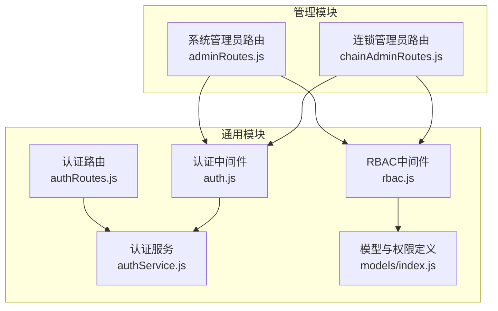
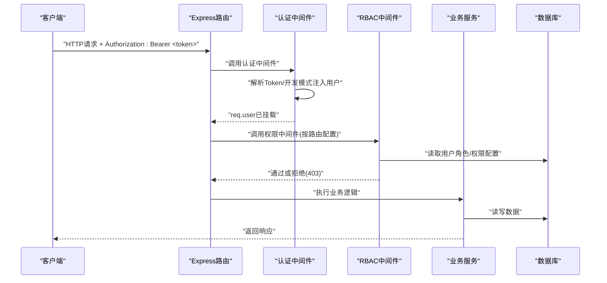
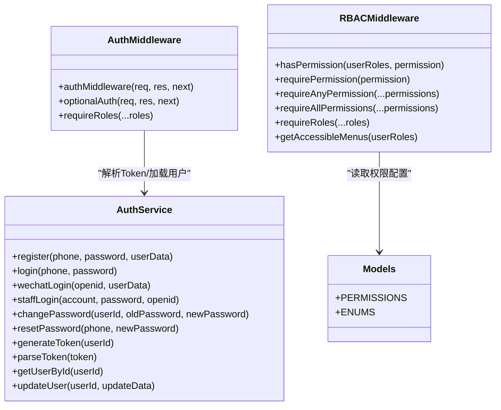

# 管理员认证与权限控制

<cite>
**本文引用的文件**   
- [backend/modules/common/middlewares/auth.js](file://backend/modules/common/middlewares/auth.js)
- [backend/modules/common/middlewares/rbac.js](file://backend/modules/common/middlewares/rbac.js)
- [backend/modules/common/services/authService.js](file://backend/modules/common/services/authService.js)
- [backend/modules/common/routes/authRoutes.js](file://backend/modules/common/routes/authRoutes.js)
- [backend/modules/common/models/index.js](file://backend/modules/common/models/index.js)
- [backend/modules/admin/routes/adminRoutes.js](file://backend/modules/admin/routes/adminRoutes.js)
- [backend/modules/admin/routes/chainAdminRoutes.js](file://backend/modules/admin/routes/chainAdminRoutes.js)
</cite>

## 目录
1. [简介](#简介)
2. [项目结构](#项目结构)
3. [核心组件](#核心组件)
4. [架构总览](#架构总览)
5. [详细组件分析](#详细组件分析)
6. [依赖关系分析](#依赖关系分析)
7. [性能与安全考量](#性能与安全考量)
8. [故障排查指南](#故障排查指南)
9. [结论](#结论)
10. [附录：接口清单与配置示例](#附录接口清单与配置示例)

## 简介
本文件围绕干洗店后台管理系统的“认证与权限控制”进行系统化说明，覆盖多角色权限体系（超级管理员、连锁管理员、门店管理员、普通员工等）、JWT令牌验证流程、会话管理与安全策略、基于RBAC的中间件实现（路由级与API级权限检查），并提供登录、登出、密码重置等认证接口的完整文档。同时给出权限配置示例与自定义权限规则的实现方法，以及安全最佳实践和常见安全问题防护措施。

## 项目结构
认证与权限相关代码主要位于后端通用模块与管理模块中：
- 通用认证服务与中间件：authService、auth中间件、RBAC中间件
- 认证路由：提供注册、登录、微信登录、员工登录、密码重置、个人资料更新等接口
- RBAC权限定义：集中维护PERMISSIONS映射
- 管理端路由：系统管理员与连锁管理员的路由组，使用角色守卫和数据层级中间件

图表来源
- [backend/modules/common/services/authService.js:1-120](file://backend/modules/common/services/authService.js#L1-L120)
- [backend/modules/common/middlewares/auth.js:1-120](file://backend/modules/common/middlewares/auth.js#L1-L120)
- [backend/modules/common/middlewares/rbac.js:1-120](file://backend/modules/common/middlewares/rbac.js#L1-L120)
- [backend/modules/common/routes/authRoutes.js:1-120](file://backend/modules/common/routes/authRoutes.js#L1-L120)
- [backend/modules/common/models/index.js:730-795](file://backend/modules/common/models/index.js#L730-L795)
- [backend/modules/admin/routes/adminRoutes.js:1-40](file://backend/modules/admin/routes/adminRoutes.js#L1-L40)
- [backend/modules/admin/routes/chainAdminRoutes.js:1-40](file://backend/modules/admin/routes/chainAdminRoutes.js#L1-L40)

章节来源
- [backend/modules/common/services/authService.js:1-120](file://backend/modules/common/services/authService.js#L1-L120)
- [backend/modules/common/middlewares/auth.js:1-120](file://backend/modules/common/middlewares/auth.js#L1-L120)
- [backend/modules/common/middlewares/rbac.js:1-120](file://backend/modules/common/middlewares/rbac.js#L1-L120)
- [backend/modules/common/routes/authRoutes.js:1-120](file://backend/modules/common/routes/authRoutes.js#L1-L120)
- [backend/modules/common/models/index.js:730-795](file://backend/modules/common/models/index.js#L730-L795)
- [backend/modules/admin/routes/adminRoutes.js:1-40](file://backend/modules/admin/routes/adminRoutes.js#L1-L40)
- [backend/modules/admin/routes/chainAdminRoutes.js:1-40](file://backend/modules/admin/routes/chainAdminRoutes.js#L1-L40)

## 核心组件
- 认证服务（AuthService）
  - 负责用户注册、登录、微信登录、员工登录、密码修改与重置、验证码发送与校验、Token生成与解析、用户信息清洗等。
- 认证中间件（authMiddleware）
  - 从请求头提取Bearer Token，支持开发模式下的特殊Token快速注入用户上下文；解析Token并加载用户信息到req.user。
- RBAC中间件（requirePermission/requireRoles等）
  - 基于角色与权限配置进行访问控制，支持单权限、任意权限、全部权限、角色白名单等多种组合。
- 认证路由（authRoutes）
  - 暴露公开与受保护接口，包括注册、登录、微信登录、员工登录、忘记密码、个人资料更新、退出登录等。
- 权限定义（PERMISSIONS）
  - 集中定义各业务操作对应的允许角色集合，支持通配符“*”表示所有人。
- 管理端路由（adminRoutes、chainAdminRoutes）
  - 通过角色守卫与数据层级中间件，限制系统管理员与连锁管理员的数据访问范围。

章节来源
- [backend/modules/common/services/authService.js:63-125](file://backend/modules/common/services/authService.js#L63-L125)
- [backend/modules/common/middlewares/auth.js:10-138](file://backend/modules/common/middlewares/auth.js#L10-L138)
- [backend/modules/common/middlewares/rbac.js:15-92](file://backend/modules/common/middlewares/rbac.js#L15-L92)
- [backend/modules/common/routes/authRoutes.js:49-142](file://backend/modules/common/routes/authRoutes.js#L49-L142)
- [backend/modules/common/models/index.js:734-777](file://backend/modules/common/models/index.js#L734-L777)
- [backend/modules/admin/routes/adminRoutes.js:12-14](file://backend/modules/admin/routes/adminRoutes.js#L12-L14)
- [backend/modules/admin/routes/chainAdminRoutes.js:13-15](file://backend/modules/admin/routes/chainAdminRoutes.js#L13-L15)

## 架构总览
下图展示了认证与权限控制的端到端流程：客户端发起请求携带Authorization头，认证中间件解析并挂载用户上下文，RBAC中间件依据角色与权限配置进行校验，最终进入控制器处理业务逻辑。

图表来源
- [backend/modules/common/middlewares/auth.js:10-138](file://backend/modules/common/middlewares/auth.js#L10-L138)
- [backend/modules/common/middlewares/rbac.js:34-92](file://backend/modules/common/middlewares/rbac.js#L34-L92)
- [backend/modules/common/services/authService.js:469-494](file://backend/modules/common/services/authService.js#L469-L494)

## 详细组件分析

### 认证服务（AuthService）
- 功能要点
  - 用户注册与登录：手机号+密码，校验状态与密码，更新登录信息，生成Token。
  - 微信登录：支持网页端与小程序，自动注册新用户或合并旧用户，返回openid与token。
  - 员工登录：支持手机号或工号查找门店员工/连锁管理员，绑定openid，返回权限与菜单。
  - 密码修改与重置：支持原密码校验与短信验证码重置。
  - Token生成与解析：Base64编码的用户ID+时间戳+UUID，用于无状态鉴权。
  - 用户信息清洗：移除敏感字段，确保跨平台识别字段openid存在。
- 数据结构与复杂度
  - 用户模型包含基础信息、角色数组、门店关联、链式企业标识、信用评分等。
  - 登录与注册为O(1)哈希比较与一次数据库查询；微信登录可能涉及迁移与合并，额外聚合查询。
- 错误处理
  - 统一抛出错误消息，路由层捕获并返回标准错误格式。
- 优化建议
  - 将Token升级为标准JWT（HS256/RS256），增加过期时间与刷新机制。
  - 引入Redis缓存用户会话与验证码，提升并发与安全性。

章节来源
- [backend/modules/common/services/authService.js:67-125](file://backend/modules/common/services/authService.js#L67-L125)
- [backend/modules/common/services/authService.js:130-198](file://backend/modules/common/services/authService.js#L130-L198)
- [backend/modules/common/services/authService.js:315-344](file://backend/modules/common/services/authService.js#L315-L344)
- [backend/modules/common/services/authService.js:469-494](file://backend/modules/common/services/authService.js#L469-L494)

### 认证中间件（authMiddleware）
- 功能要点
  - 从Authorization头提取Bearer Token。
  - 开发模式下支持特殊前缀Token快速注入用户上下文（如dev-admin-、dev-chain-、mock_token_）。
  - 解析Token后加载用户信息到req.user，供后续中间件与控制器使用。
  - 可选认证中间件optionalAuth：不强制登录，若存在有效Token则挂载用户。
- 错误处理
  - 未携带或无效Token返回401，提示需要登录。
- 安全策略
  - 生产环境禁用开发模式快捷注入，避免绕过真实认证。
  - 建议对Token进行签名校验与过期检查。

章节来源
- [backend/modules/common/middlewares/auth.js:10-138](file://backend/modules/common/middlewares/auth.js#L10-L138)
- [backend/modules/common/middlewares/auth.js:143-185](file://backend/modules/common/middlewares/auth.js#L143-L185)

### RBAC中间件（基于角色的访问控制）
- 功能要点
  - hasPermission：根据用户角色与PERMISSIONS配置判断是否拥有指定权限，admin拥有所有权限，*表示所有人。
  - requirePermission：要求单一权限。
  - requireAnyPermission：满足任一权限即可。
  - requireAllPermissions：需满足全部权限。
  - requireRoles：基于角色白名单的访问控制。
  - getAccessibleMenus：根据用户角色过滤可访问菜单。
- 权限配置
  - PERMISSIONS集中定义在models/index.js中，涵盖用户、订单、物品、回收、租赁、门店、结算、模块管理等。
- 扩展性
  - 新增权限只需在PERMISSIONS中添加映射，并在路由处添加相应中间件。

章节来源
- [backend/modules/common/middlewares/rbac.js:15-92](file://backend/modules/common/middlewares/rbac.js#L15-L92)
- [backend/modules/common/models/index.js:734-777](file://backend/modules/common/models/index.js#L734-L777)

### 认证路由（authRoutes）
- 公开接口
  - POST /api/auth/send-code：发送验证码（模拟实现，开发环境返回验证码）。
  - POST /api/auth/verify-code：验证验证码。
  - POST /api/auth/register：用户注册。
  - POST /api/auth/login：用户登录。
  - POST /api/auth/wechat：微信登录（直接传入openid）。
  - GET /api/auth/wechat/authorize：生成微信授权URL（网页端）。
  - GET /api/auth/wechat/callback：微信授权回调，换取openid并登录。
  - POST /api/auth/staff-login：门店员工/连锁管理员登录。
  - POST /api/auth/dev-staff-login：开发模式快速商家登录。
  - POST /api/auth/wxmini-login：微信小程序登录（code换openid）。
  - POST /api/auth/forgot-password：忘记密码（验证码+新密码）。
- 受保护接口
  - GET /api/auth/profile：获取当前用户信息。
  - PUT /api/auth/profile：更新用户信息（支持跨平台账户合并）。
  - POST /api/auth/change-password：修改密码。
  - POST /api/auth/logout：退出登录。
- 错误处理
  - 参数不完整、验证码错误、账号不存在、密码错误等均返回400/401标准错误。

章节来源
- [backend/modules/common/routes/authRoutes.js:17-142](file://backend/modules/common/routes/authRoutes.js#L17-L142)
- [backend/modules/common/routes/authRoutes.js:267-379](file://backend/modules/common/routes/authRoutes.js#L267-L379)
- [backend/modules/common/routes/authRoutes.js:444-490](file://backend/modules/common/routes/authRoutes.js#L444-L490)
- [backend/modules/common/routes/authRoutes.js:496-508](file://backend/modules/common/routes/authRoutes.js#L496-L508)
- [backend/modules/common/routes/authRoutes.js:521-583](file://backend/modules/common/routes/authRoutes.js#L521-L583)

### 管理端路由（adminRoutes、chainAdminRoutes）
- 系统管理员（admin）
  - 路由组全局启用authMiddleware与requireRoles('admin')。
  - 提供仪表盘、用户管理、门店管理、订单管理、模块管理、系统设置、智能灯条、配送管理、会员管理、资金与结算等接口。
- 连锁管理员（chain_admin）
  - 路由组全局启用authMiddleware与requireRoles('chain_admin')。
  - 结合数据层级中间件createDataHierarchyMiddleware，确保仅能访问自身连锁的数据（门店、订单、用户、资金等）。
- 权限控制
  - 部分接口同时允许admin与chain_admin访问，例如结算中心概览与列表。

章节来源
- [backend/modules/admin/routes/adminRoutes.js:12-14](file://backend/modules/admin/routes/adminRoutes.js#L12-L14)
- [backend/modules/admin/routes/chainAdminRoutes.js:13-15](file://backend/modules/admin/routes/chainAdminRoutes.js#L13-L15)
- [backend/modules/admin/routes/adminRoutes.js:1117-1144](file://backend/modules/admin/routes/adminRoutes.js#L1117-L1144)

## 依赖关系分析
- 中间件与服务依赖
  - authMiddleware依赖authService进行Token解析与用户加载。
  - RBAC中间件依赖models/index.js中的PERMISSIONS配置。
- 路由与中间件组合
  - adminRoutes与chainAdminRoutes通过requireRoles限定角色范围。
  - chainAdminRoutes进一步使用数据层级中间件进行数据边界控制。
- 外部依赖
  - mongoose用于数据库交互，bcryptjs用于密码哈希，uuid用于生成唯一标识。

图表来源
- [backend/modules/common/services/authService.js:63-125](file://backend/modules/common/services/authService.js#L63-L125)
- [backend/modules/common/middlewares/auth.js:10-138](file://backend/modules/common/middlewares/auth.js#L10-L138)
- [backend/modules/common/middlewares/rbac.js:15-92](file://backend/modules/common/middlewares/rbac.js#L15-L92)
- [backend/modules/common/models/index.js:734-777](file://backend/modules/common/models/index.js#L734-L777)

章节来源
- [backend/modules/common/services/authService.js:63-125](file://backend/modules/common/services/authService.js#L63-L125)
- [backend/modules/common/middlewares/auth.js:10-138](file://backend/modules/common/middlewares/auth.js#L10-L138)
- [backend/modules/common/middlewares/rbac.js:15-92](file://backend/modules/common/middlewares/rbac.js#L15-L92)
- [backend/modules/common/models/index.js:734-777](file://backend/modules/common/models/index.js#L734-L777)

## 性能与安全考量
- 性能
  - 认证中间件每次请求均需解析Token并查询用户信息，建议引入Redis缓存用户会话与权限配置，减少数据库压力。
  - 验证码存储使用内存对象，生产环境应替换为Redis并设置TTL。
- 安全
  - 当前Token为Base64编码，无签名与过期校验，易被伪造与重放攻击。建议采用标准JWT并配置短期有效期与刷新令牌。
  - 密码使用bcrypt哈希，符合安全规范。
  - 开发模式快捷登录在生产环境必须禁用。
  - 建议增加速率限制、IP白名单、审计日志与异常告警。

[本节为通用指导，无需特定文件引用]

## 故障排查指南
- 常见问题
  - 401未登录：检查Authorization头是否正确携带Bearer Token。
  - 403权限不足：确认用户角色与路由所需权限匹配。
  - 微信登录失败：检查AppID与Secret配置，确认回调域名已备案且正确。
  - 员工登录失败：确认账号（手机号/工号）与密码正确，且用户状态为active。
- 定位步骤
  - 查看服务端日志输出，关注认证与权限中间件的错误信息。
  - 使用开发模式快捷登录验证路由与权限配置是否正确。
  - 核对PERMISSIONS配置与路由中间件组合是否符合预期。

章节来源
- [backend/modules/common/middlewares/auth.js:10-138](file://backend/modules/common/middlewares/auth.js#L10-L138)
- [backend/modules/common/middlewares/rbac.js:34-92](file://backend/modules/common/middlewares/rbac.js#L34-L92)
- [backend/modules/common/routes/authRoutes.js:127-142](file://backend/modules/common/routes/authRoutes.js#L127-L142)
- [backend/modules/common/routes/authRoutes.js:267-379](file://backend/modules/common/routes/authRoutes.js#L267-L379)

## 结论
本系统实现了较为完善的认证与权限控制体系，涵盖多角色权限、RBAC中间件、微信登录与员工登录、密码管理等功能。建议在后续迭代中引入标准JWT、会话缓存、速率限制与审计日志，进一步提升安全性与性能。

[本节为总结，无需特定文件引用]

## 附录：接口清单与配置示例

### 认证接口清单
- 公开接口
  - POST /api/auth/send-code
  - POST /api/auth/verify-code
  - POST /api/auth/register
  - POST /api/auth/login
  - POST /api/auth/wechat
  - GET /api/auth/wechat/authorize
  - GET /api/auth/wechat/callback
  - POST /api/auth/staff-login
  - POST /api/auth/dev-staff-login
  - POST /api/auth/wxmini-login
  - POST /api/auth/forgot-password
- 受保护接口
  - GET /api/auth/profile
  - PUT /api/auth/profile
  - POST /api/auth/change-password
  - POST /api/auth/logout

章节来源
- [backend/modules/common/routes/authRoutes.js:17-142](file://backend/modules/common/routes/authRoutes.js#L17-L142)
- [backend/modules/common/routes/authRoutes.js:267-379](file://backend/modules/common/routes/authRoutes.js#L267-L379)
- [backend/modules/common/routes/authRoutes.js:444-490](file://backend/modules/common/routes/authRoutes.js#L444-L490)
- [backend/modules/common/routes/authRoutes.js:496-508](file://backend/modules/common/routes/authRoutes.js#L496-L508)
- [backend/modules/common/routes/authRoutes.js:521-583](file://backend/modules/common/routes/authRoutes.js#L521-L583)

### 权限配置示例（PERMISSIONS）
- 用户管理
  - user.view: ['admin']
  - user.edit: ['admin']
  - user.blacklist: ['admin']
- 订单管理
  - order.create: ['customer', 'store_staff', 'store_owner']
  - order.view.own: ['*']
  - order.view.store: ['store_staff', 'store_owner']
  - order.view.all: ['admin']
  - order.process: ['store_staff', 'store_owner']
  - order.cancel: ['customer', 'admin']
  - order.refund: ['store_owner', 'admin']
- 物品与回收
  - item.create: ['customer', 'store_staff']
  - item.view.own: ['*']
  - item.assess: ['appraiser', 'admin']
  - recycle.view: ['customer', 'recycler', 'admin']
  - recycle.assess: ['recycler', 'appraiser']
  - recycle.confirm: ['recycler', 'admin']
- 租赁与门店
  - rental.view: ['customer', 'brand_admin']
  - rental.manage: ['brand_admin', 'admin']
  - rental.deposit: ['customer']
  - store.view: ['store_staff', 'store_owner', 'admin']
  - store.manage: ['store_owner', 'admin']
  - store.config: ['store_owner']
- 结算与模块
  - settlement.view: ['store_owner', 'brand_admin', 'admin']
  - settlement.withdraw: ['store_owner', 'brand_admin']
  - module.manage: ['admin']

章节来源
- [backend/modules/common/models/index.js:734-777](file://backend/modules/common/models/index.js#L734-L777)

### 自定义权限规则实现方法
- 在models/index.js中新增权限映射键值对，定义允许的角色集合。
- 在目标路由上添加RBAC中间件，如requirePermission('your.permission.key')。
- 如需组合权限，可使用requireAnyPermission或requireAllPermissions。
- 对于菜单展示，可通过getAccessibleMenus根据用户角色动态过滤。

章节来源
- [backend/modules/common/middlewares/rbac.js:34-92](file://backend/modules/common/middlewares/rbac.js#L34-L92)
- [backend/modules/common/models/index.js:734-777](file://backend/modules/common/models/index.js#L734-L777)