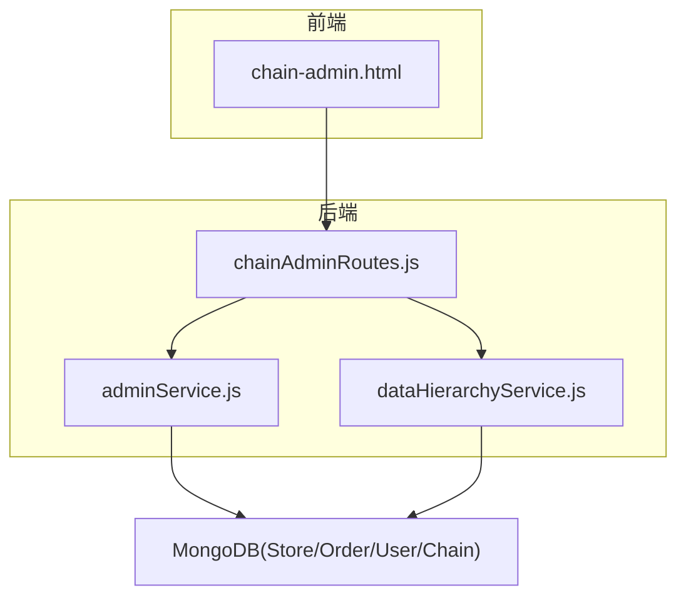
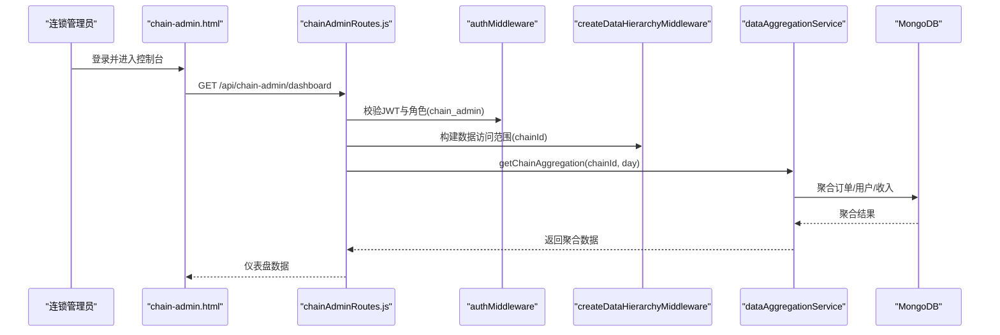
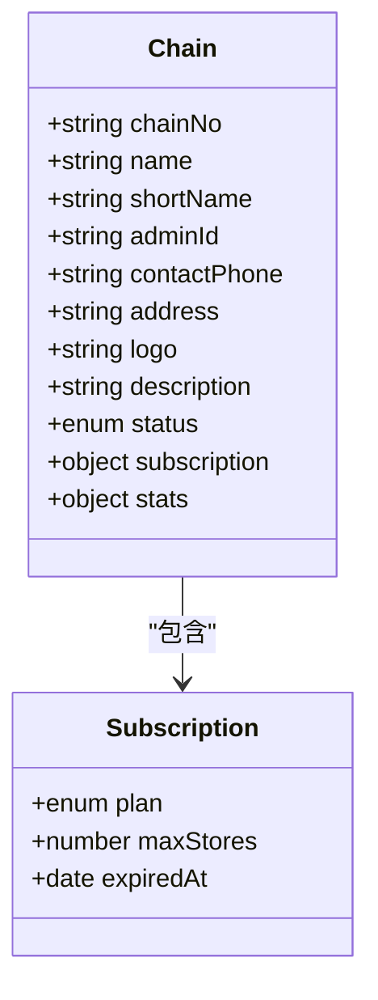
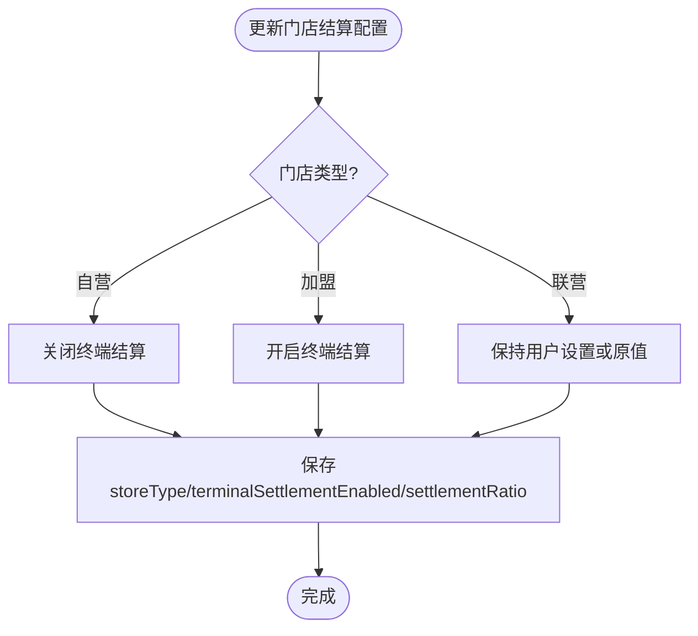
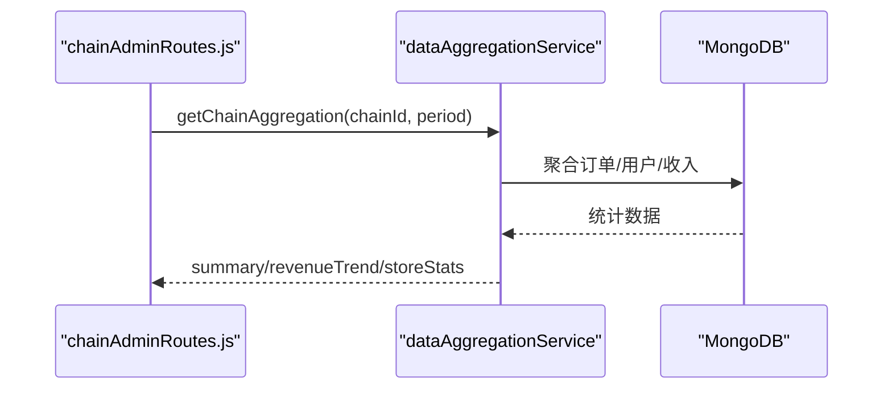
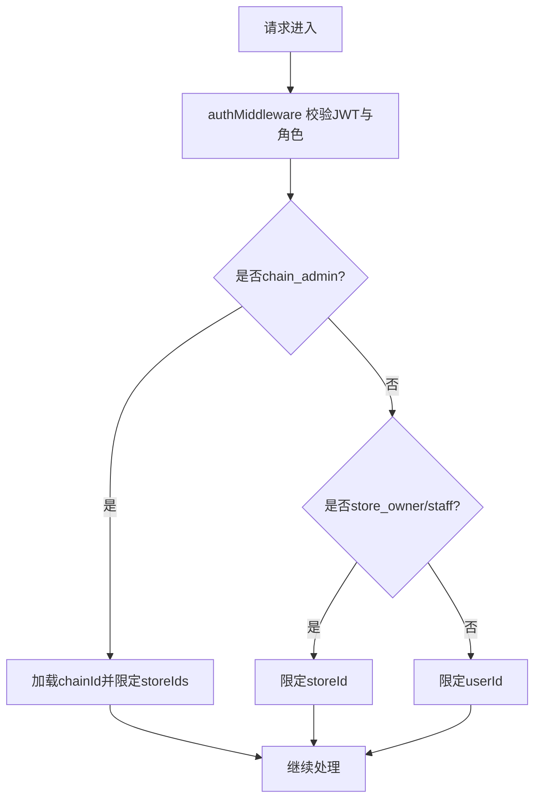
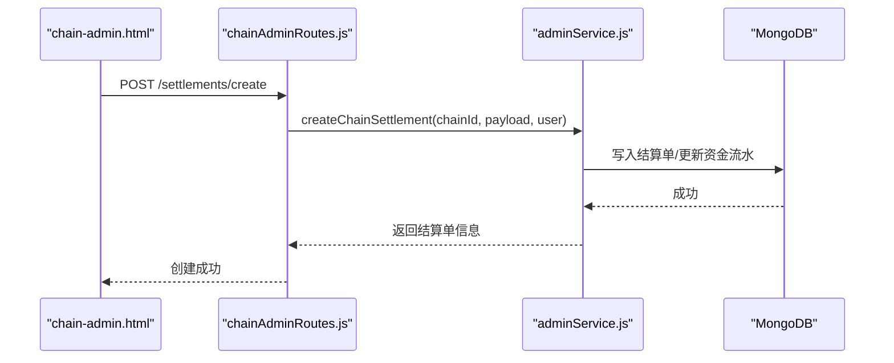
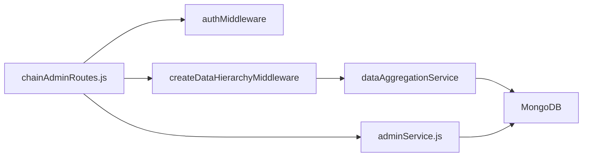

# 连锁管理平台

<cite>
**本文引用的文件列表**
- [CHAIN_ADMIN_PLATFORM.md](file://CHAIN_ADMIN_PLATFORM.md)
- [chain-admin.html](file://chain-admin.html)
- [backend/modules/admin/routes/chainAdminRoutes.js](file://backend/modules/admin/routes/chainAdminRoutes.js)
- [backend/modules/common/services/dataHierarchyService.js](file://backend/modules/common/services/dataHierarchyService.js)
- [backend/modules/admin/services/adminService.js](file://backend/modules/admin/services/adminService.js)
- [test-chain-admin-api.js](file://test-chain-admin-api.js)
</cite>

## 目录
1. [简介](#简介)
2. [项目结构](#项目结构)
3. [核心组件](#核心组件)
4. [架构总览](#架构总览)
5. [详细组件分析](#详细组件分析)
6. [依赖关系分析](#依赖关系分析)
7. [性能考量](#性能考量)
8. [故障排查指南](#故障排查指南)
9. [结论](#结论)
10. [附录](#附录)

## 简介
本文件面向干洗店连锁管理平台的开发者与运营人员，系统化阐述连锁品牌管理体系、多门店统一管理机制、连锁级别数据汇总与分析、权限控制与安全隔离，以及高级功能（营销活动、统一价格策略、跨门店会员权益）与扩展定制指南。平台以“连锁企业”为数据边界，提供从注册入驻、品牌信息管理、订阅套餐到结算中心、资金流水、订单与用户聚合等完整能力，并通过数据层级中间件确保不同连锁品牌之间的数据隔离与安全访问。

## 项目结构
- 前端：连锁管理后台页面 chain-admin.html，包含控制台、门店管理、订单管理、员工管理、数据分析、资金管理、结算中心与企业设置等模块。
- 后端：Express 路由链 admin/routes/chainAdminRoutes.js，承载连锁管理员 API；通用服务 common/services/dataHierarchyService.js 提供数据层级权限与聚合能力；业务逻辑 admin/services/adminService.js 封装模型与统计方法。
- 测试：命令行脚本 test-chain-admin-api.js 用于快速验证关键接口。

图表来源
- [chain-admin.html](file://chain-admin.html)
- [backend/modules/admin/routes/chainAdminRoutes.js](file://backend/modules/admin/routes/chainAdminRoutes.js)
- [backend/modules/common/services/dataHierarchyService.js](file://backend/modules/common/services/dataHierarchyService.js)
- [backend/modules/admin/services/adminService.js](file://backend/modules/admin/services/adminService.js)

章节来源
- [CHAIN_ADMIN_PLATFORM.md:1-230](file://CHAIN_ADMIN_PLATFORM.md#L1-L230)
- [chain-admin.html:1-800](file://chain-admin.html#L1-L800)
- [backend/modules/admin/routes/chainAdminRoutes.js:1-1059](file://backend/modules/admin/routes/chainAdminRoutes.js#L1-L1059)
- [backend/modules/common/services/dataHierarchyService.js:1-648](file://backend/modules/common/services/dataHierarchyService.js#L1-L648)
- [backend/modules/admin/services/adminService.js:1-1200](file://backend/modules/admin/services/adminService.js#L1-L1200)

## 核心组件
- 连锁信息与服务
  - 获取连锁企业信息、仪表盘聚合数据、订单/门店/用户分页查询、资金概览与趋势、结算概览与单列、门店结算权限管理等。
- 数据层级权限
  - 基于角色的数据访问范围构建：超级管理员全量、连锁管理员仅其连锁下门店数据、门店角色仅本店数据、普通用户仅本人数据。
- 数据同步与聚合
  - 事件驱动的数据同步（MQTT可选），自动更新门店与连锁层级的统计指标；按周期聚合收入趋势、订单与用户增长。
- 结算与资金
  - 支持日结/周结/月结/自定义周期，门店类型（自营/加盟/联营）影响终端结算开关与默认比例，批量配置与状态流转。

章节来源
- [backend/modules/admin/routes/chainAdminRoutes.js:25-133](file://backend/modules/admin/routes/chainAdminRoutes.js#L25-L133)
- [backend/modules/common/services/dataHierarchyService.js:15-133](file://backend/modules/common/services/dataHierarchyService.js#L15-L133)
- [backend/modules/common/services/dataHierarchyService.js:449-635](file://backend/modules/common/services/dataHierarchyService.js#L449-L635)
- [backend/modules/admin/services/adminService.js:129-169](file://backend/modules/admin/services/adminService.js#L129-L169)

## 架构总览
连锁管理平台采用前后端分离的 RESTful 架构，通过 JWT 鉴权与数据层级中间件实现强隔离的多租户式数据访问。核心链路如下：

图表来源
- [backend/modules/admin/routes/chainAdminRoutes.js:76-133](file://backend/modules/admin/routes/chainAdminRoutes.js#L76-L133)
- [backend/modules/common/services/dataHierarchyService.js:15-92](file://backend/modules/common/services/dataHierarchyService.js#L15-L92)
- [backend/modules/common/services/dataHierarchyService.js:449-602](file://backend/modules/common/services/dataHierarchyService.js#L449-L602)

## 详细组件分析

### 连锁品牌管理体系
- 品牌注册与信息管理
  - 超级管理员可创建连锁企业并选择订阅套餐（基础版/专业版/企业版），设定最大门店数与到期时间。
  - 连锁管理员登录后通过专属接口获取本企业信息与套餐详情。
- 订阅套餐管理
  - 套餐字段包含 plan、maxStores、expiredAt 等，用于限制门店规模与有效期。
  - 前端企业设置页展示当前套餐，升级需联系平台管理员。

图表来源
- [backend/modules/admin/services/adminService.js:129-169](file://backend/modules/admin/services/adminService.js#L129-L169)
- [chain-admin.html:426-449](file://chain-admin.html#L426-L449)

章节来源
- [backend/modules/admin/services/adminService.js:129-169](file://backend/modules/admin/services/adminService.js#L129-L169)
- [chain-admin.html:426-449](file://chain-admin.html#L426-L449)

### 多门店统一管理机制
- 门店分组与区域划分
  - 门店模型包含 city、district、lat/lng 等字段，便于按城市/区县进行分组与地图展示。
  - 连锁管理员只能查看自己连锁下的门店列表与详情。
- 品牌标准配置
  - 门店 storeType（自营/加盟/联营）决定终端结算权限与默认结算比例，支持批量更新。
  - 门店状态 active/disabled 由连锁管理员控制。

图表来源
- [backend/modules/admin/services/adminService.js:2890-2989](file://backend/modules/admin/services/adminService.js#L2890-L2989)

章节来源
- [backend/modules/admin/routes/chainAdminRoutes.js:295-399](file://backend/modules/admin/routes/chainAdminRoutes.js#L295-L399)
- [backend/modules/admin/routes/chainAdminRoutes.js:997-1057](file://backend/modules/admin/routes/chainAdminRoutes.js#L997-L1057)
- [backend/modules/admin/services/adminService.js:2890-2989](file://backend/modules/admin/services/adminService.js#L2890-L2989)

### 连锁级别数据汇总与分析
- 跨门店订单统计
  - 通过 dataAggregationService.getChainAggregation 聚合指定周期内的订单总数、完成数、平均客单价与收入趋势。
- 收入汇总
  - 按天聚合 completed 订单金额，形成 revenueTrend 序列供前端可视化。
- 用户增长趋势
  - 聚合新增用户与累计用户，支持今日/周/月维度。

图表来源
- [backend/modules/admin/routes/chainAdminRoutes.js:76-133](file://backend/modules/admin/routes/chainAdminRoutes.js#L76-L133)
- [backend/modules/common/services/dataHierarchyService.js:449-602](file://backend/modules/common/services/dataHierarchyService.js#L449-L602)

章节来源
- [backend/modules/common/services/dataHierarchyService.js:449-602](file://backend/modules/common/services/dataHierarchyService.js#L449-L602)

### 连锁管理员权限控制与数据隔离
- 角色与数据边界
  - 超级管理员：全量访问。
  - 连锁管理员：仅能访问其 chainId 关联的门店及订单/用户数据。
  - 门店角色：仅本店数据。
  - 普通用户：仅本人数据。
- 中间件机制
  - createDataHierarchyMiddleware 根据 user.roles 与请求上下文构建 req.dataAccessScope，并在各路由中强制使用。

图表来源
- [backend/modules/common/services/dataHierarchyService.js:15-92](file://backend/modules/common/services/dataHierarchyService.js#L15-L92)

章节来源
- [backend/modules/common/services/dataHierarchyService.js:15-92](file://backend/modules/common/services/dataHierarchyService.js#L15-L92)
- [backend/modules/admin/routes/chainAdminRoutes.js:14-16](file://backend/modules/admin/routes/chainAdminRoutes.js#L14-L16)

### 结算中心与资金管理
- 结算概览与单列
  - 提供待处理/已完成/总金额等概览指标，支持按状态筛选与分页。
- 结算单创建
  - 支持日结/周结/月结/自定义周期，可选择全部门店或指定门店，设置结算比例。
- 门店结算权限管理
  - 支持按门店类型过滤、搜索、分页，并可批量更新 storeType、terminalSettlementEnabled、settlementRatio。
- 资金流水与趋势
  - 资金概览、流水记录、门店资金统计与趋势图。

图表来源
- [backend/modules/admin/routes/chainAdminRoutes.js:847-867](file://backend/modules/admin/routes/chainAdminRoutes.js#L847-L867)
- [backend/modules/admin/services/adminService.js:2890-2989](file://backend/modules/admin/services/adminService.js#L2890-L2989)

章节来源
- [backend/modules/admin/routes/chainAdminRoutes.js:800-991](file://backend/modules/admin/routes/chainAdminRoutes.js#L800-L991)
- [backend/modules/admin/services/adminService.js:2890-2989](file://backend/modules/admin/services/adminService.js#L2890-L2989)

### 高级功能与扩展性
- 统一价格策略配置
  - 系统默认价格与门店自定义价格并存，优先取门店覆盖价，便于连锁品牌在统一策略基础上允许门店微调。
- 跨门店会员权益
  - 用户模型支持 memberLevel、balance、points 等字段，结合门店归属可实现跨门店权益识别与消费统计。
- 营销活动管理
  - 可在品类或服务维度配置活动规则，结合门店价格模板与结算比例，实现差异化营销。
- 扩展与定制开发指南
  - 新增连锁级报表：复用 dataAggregationService 的聚合模式，增加新的统计维度与缓存策略。
  - 接入第三方渠道：参考 services/deliveryProviders 插件化设计，新增 Provider 类并注册。
  - 权限扩展：在 createDataHierarchyMiddleware 中扩展 allowedRoles 与 scope 构建逻辑。

章节来源
- [backend/modules/admin/services/priceService.js:1-41](file://backend/modules/admin/services/priceService.js#L1-L41)
- [backend/modules/admin/services/adminService.js:18-44](file://backend/modules/admin/services/adminService.js#L18-L44)

## 依赖关系分析
- 路由层依赖
  - chainAdminRoutes.js 依赖 auth 中间件、数据层级中间件与 adminService。
- 服务层依赖
  - adminService.js 定义 User/Order/Store/Chain 模型与方法，被路由调用。
- 公共能力
  - dataHierarchyService.js 提供权限与聚合能力，被路由广泛使用。

图表来源
- [backend/modules/admin/routes/chainAdminRoutes.js:1-16](file://backend/modules/admin/routes/chainAdminRoutes.js#L1-L16)
- [backend/modules/common/services/dataHierarchyService.js:637-648](file://backend/modules/common/services/dataHierarchyService.js#L637-L648)
- [backend/modules/admin/services/adminService.js:1-16](file://backend/modules/admin/services/adminService.js#L1-L16)

章节来源
- [backend/modules/admin/routes/chainAdminRoutes.js:1-16](file://backend/modules/admin/routes/chainAdminRoutes.js#L1-L16)
- [backend/modules/common/services/dataHierarchyService.js:637-648](file://backend/modules/common/services/dataHierarchyService.js#L637-L648)
- [backend/modules/admin/services/adminService.js:1-16](file://backend/modules/admin/services/adminService.js#L1-L16)

## 性能考量
- 聚合查询优化
  - 使用 MongoDB 聚合管道按 storeId 集合与时间窗口进行 $match/$group，减少应用层循环计算。
- 并发与并行
  - 使用 Promise.all 并行执行订单、用户、收入等多路聚合，降低整体响应时延。
- 索引建议
  - Order.storeId、Order.createdAt、Order.status、User.storeId、Store.chainId 等字段建立合适索引以提升查询效率。
- 分页与限流
  - 列表接口统一 page/pageSize 参数，避免一次性拉取大量数据。

[本节为通用性能建议，不直接分析具体文件]

## 故障排查指南
- 常见错误码与定位
  - 401：未登录或 token 失效，检查认证流程与存储。
  - 403：权限不足，确认用户角色与 chainId/storeId 绑定。
  - 404：资源不存在，核对 ID 与归属关系。
- 调试方法
  - 使用 test-chain-admin-api.js 快速验证登录、连锁信息、结算概览、门店列表与结算权限接口。
  - 前端打开浏览器开发者工具，查看网络请求与响应体。
  - 后端日志输出包含 [连锁后台]/[数据聚合]/[数据同步] 等前缀，便于定位问题。

章节来源
- [test-chain-admin-api.js:1-102](file://test-chain-admin-api.js#L1-L102)
- [backend/modules/admin/routes/chainAdminRoutes.js:125-133](file://backend/modules/admin/routes/chainAdminRoutes.js#L125-L133)
- [backend/modules/common/services/dataHierarchyService.js:84-92](file://backend/modules/common/services/dataHierarchyService.js#L84-L92)

## 结论
连锁管理平台围绕“连锁企业”这一数据边界，构建了完整的品牌管理、门店治理、结算与资金体系，并通过数据层级中间件与聚合服务实现了安全隔离与高效分析。平台具备良好的扩展性与定制化空间，适合在多品牌、多门店场景下持续演进。

[本节为总结性内容，不直接分析具体文件]

## 附录

### API 清单（节选）
- 认证
  - POST /api/auth/staff-login
- 连锁信息
  - GET /api/chain-admin/info
  - GET /api/chain-admin/dashboard
- 门店管理
  - GET /api/chain-admin/stores
  - GET /api/chain-admin/stores/:id
  - PUT /api/chain-admin/stores/:id/status
- 订单管理
  - GET /api/chain-admin/orders
  - GET /api/chain-admin/orders/:id
- 用户管理
  - GET /api/chain-admin/users
  - GET /api/chain-admin/users/:id
- 资金管理
  - GET /api/chain-admin/finance/overview
  - GET /api/chain-admin/finance/records
  - GET /api/chain-admin/finance/stores
  - GET /api/chain-admin/finance/trend
- 结算中心
  - GET /api/chain-admin/settlement/overview
  - GET /api/chain-admin/settlements
  - POST /api/chain-admin/settlements/create
  - GET /api/chain-admin/settlement/stores
  - PUT /api/chain-admin/settlement/stores/:storeId
  - POST /api/chain-admin/settlement/stores/batch-update

章节来源
- [CHAIN_ADMIN_PLATFORM.md:68-102](file://CHAIN_ADMIN_PLATFORM.md#L68-L102)
- [backend/modules/admin/routes/chainAdminRoutes.js:25-133](file://backend/modules/admin/routes/chainAdminRoutes.js#L25-L133)
- [backend/modules/admin/routes/chainAdminRoutes.js:800-991](file://backend/modules/admin/routes/chainAdminRoutes.js#L800-L991)