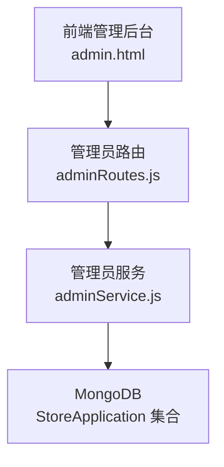
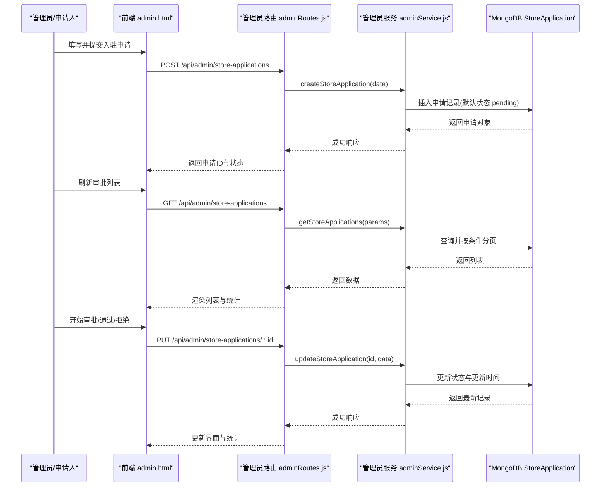
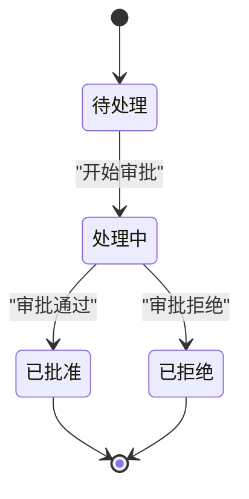
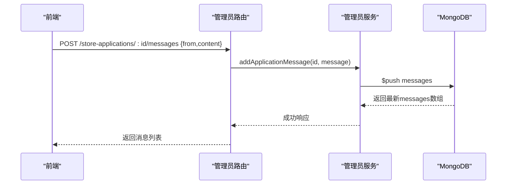
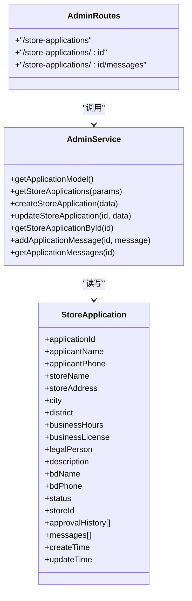

# 门店入驻申请流程

<cite>
**本文引用的文件**   
- [admin.html](file://admin.html)
- [adminRoutes.js](file://backend/modules/admin/routes/adminRoutes.js)
- [adminService.js](file://backend/modules/admin/services/adminService.js)
</cite>

## 目录
1. [引言](#引言)
2. [项目结构](#项目结构)
3. [核心组件](#核心组件)
4. [架构总览](#架构总览)
5. [详细组件分析](#详细组件分析)
6. [依赖关系分析](#依赖关系分析)
7. [性能与扩展性考虑](#性能与扩展性考虑)
8. [故障排查指南](#故障排查指南)
9. [结论](#结论)

## 引言
本文件面向“门店入驻申请”的完整业务流程，覆盖从申请人提交申请、信息校验、资质审核、状态流转、审核历史、沟通消息到审批结果通知的全生命周期。文档同时给出前后端交互时序、数据模型与关键实现位置，便于开发与运维人员快速定位与优化。

## 项目结构
围绕门店入驻申请的相关代码主要分布在以下位置：
- 前端管理后台页面：包含申请表单、审批列表、筛选与操作入口
- 后端管理员路由：提供申请创建、查询、更新、消息收发等接口
- 后端管理员服务：定义申请数据模型、CRUD 逻辑、分页与过滤

图表来源
- [admin.html](file://admin.html)
- [adminRoutes.js](file://backend/modules/admin/routes/adminRoutes.js)
- [adminService.js](file://backend/modules/admin/services/adminService.js)

章节来源
- [admin.html](file://admin.html)
- [adminRoutes.js](file://backend/modules/admin/routes/adminRoutes.js)
- [adminService.js](file://backend/modules/admin/services/adminService.js)

## 核心组件
- 申请表单与提交（前端）
  - 负责收集申请人姓名、联系电话、门店名称、地址、城市/区域、营业时间、营业执照号、法人代表、描述、BD信息等字段，并调用后端接口创建申请。
  - 参考路径：[admin.html:1250-1429](file://admin.html#L1250-L1429)、[admin.html:4125-4150](file://admin.html#L4125-L4150)
- 审批管理与状态流转（前端）
  - 提供待处理、处理中、已批准、已拒绝等状态的展示与操作；支持按状态、门店名、日期筛选；支持开始审批、通过、拒绝等操作，并记录审核历史。
  - 参考路径：[admin.html:1431-1553](file://admin.html#L1431-L1553)、[admin.html:4445-4564](file://admin.html#L4445-L4564)
- 申请数据模型与服务（后端）
  - 定义 StoreApplication 模型，包含申请编号、申请人信息、门店信息、资质信息、BD信息、状态、审核历史、沟通消息、时间戳等字段，并提供列表、详情、创建、更新、消息收发等方法。
  - 参考路径：[adminService.js:634-677](file://backend/modules/admin/services/adminService.js#L634-L677)、[adminService.js:679-820](file://backend/modules/admin/services/adminService.js#L679-L820)
- 管理员路由（后端）
  - 暴露申请相关 REST 接口：获取列表、创建申请、更新申请、获取详情、发送/获取沟通消息等，统一鉴权与错误处理。
  - 参考路径：[adminRoutes.js:240-333](file://backend/modules/admin/routes/adminRoutes.js#L240-L333)

章节来源
- [admin.html:1250-1429](file://admin.html#L1250-L1429)
- [admin.html:1431-1553](file://admin.html#L1431-L1553)
- [admin.html:4125-4150](file://admin.html#L4125-L4150)
- [admin.html:4445-4564](file://admin.html#L4445-L4564)
- [adminService.js:634-677](file://backend/modules/admin/services/adminService.js#L634-L677)
- [adminService.js:679-820](file://backend/modules/admin/services/adminService.js#L679-L820)
- [adminRoutes.js:240-333](file://backend/modules/admin/routes/adminRoutes.js#L240-L333)

## 架构总览
下图展示了从前端表单提交到后端持久化、再到审批操作的端到端流程。

图表来源
- [admin.html:4125-4150](file://admin.html#L4125-L4150)
- [adminRoutes.js:240-333](file://backend/modules/admin/routes/adminRoutes.js#L240-L333)
- [adminService.js:679-761](file://backend/modules/admin/services/adminService.js#L679-L761)

## 详细组件分析

### 申请信息验证机制
- 必填字段校验（前端）
  - 申请人姓名、联系电话、门店名称、门店地址、所在城市为必填项，使用 HTML required 属性进行基础校验。
  - BD姓名与BD电话在表单中标注为必填，用于后续沟通与责任归属。
  - 参考路径：[admin.html:1273-1404](file://admin.html#L1273-L1404)
- 格式与业务规则（建议与现状）
  - 当前前端未对手机号、邮箱等进行正则校验，建议在提交前增加格式校验与去重检查。
  - 营业时间采用时间控件，建议在后端增加范围校验（如 open < close）。
  - 资质信息（营业执照号、法人代表）目前为可选文本，建议在后端增加唯一性与合法性校验。
  - 参考路径：[adminService.js:634-677](file://backend/modules/admin/services/adminService.js#L634-L677)

章节来源
- [admin.html:1273-1404](file://admin.html#L1273-L1404)
- [adminService.js:634-677](file://backend/modules/admin/services/adminService.js#L634-L677)

### 资质审核流程
- 资质字段
  - 支持录入营业执照号与法人代表信息，作为资质审核依据。
  - 参考路径：[admin.html:1344-1375](file://admin.html#L1344-L1375)、[adminService.js:648-649](file://backend/modules/admin/services/adminService.js#L648-L649)
- 审核动作
  - 管理员可执行“开始审批”“审批通过”“审批拒绝”，并在审批历史中记录操作人、时间与备注。
  - 参考路径：[admin.html:4445-4564](file://admin.html#L4445-L4564)

章节来源
- [admin.html:1344-1375](file://admin.html#L1344-L1375)
- [admin.html:4445-4564](file://admin.html#L4445-L4564)
- [adminService.js:659-664](file://backend/modules/admin/services/adminService.js#L659-L664)

### 申请状态跟踪与流转
- 状态枚举
  - 待处理(pending)、处理中(process ing)、已批准(approved)、已拒绝(rejected)。
  - 参考路径：[adminService.js:653-657](file://backend/modules/admin/services/adminService.js#L653-L657)
- 流转逻辑
  - 提交后默认 pending；管理员点击“开始审批”进入 processing；随后可转为 approved 或 rejected。
  - 参考路径：[admin.html:4445-4564](file://admin.html#L4445-L4564)

图表来源
- [adminService.js:653-657](file://backend/modules/admin/services/adminService.js#L653-L657)
- [admin.html:4445-4564](file://admin.html#L4445-L4564)

### 审核历史记录
- 每次状态变更都会追加一条历史记录，包含动作、时间、操作人与备注。
- 参考路径：[adminService.js:659-664](file://backend/modules/admin/services/adminService.js#L659-L664)、[admin.html:4445-4564](file://admin.html#L4445-L4564)

章节来源
- [adminService.js:659-664](file://backend/modules/admin/services/adminService.js#L659-L664)
- [admin.html:4445-4564](file://admin.html#L4445-L4564)

### 申请沟通消息系统
- 功能说明
  - 支持在单个申请下维护沟通消息，记录消息来源（管理员/BD/系统）、内容与时间。
  - 提供添加消息与获取消息的接口。
- 接口与实现
  - 添加消息：POST /api/admin/store-applications/:id/messages
  - 获取消息：GET /api/admin/store-applications/:id/messages
  - 参考路径：[adminRoutes.js:305-333](file://backend/modules/admin/routes/adminRoutes.js#L305-L333)、[adminService.js:780-820](file://backend/modules/admin/services/adminService.js#L780-L820)

图表来源
- [adminRoutes.js:305-333](file://backend/modules/admin/routes/adminRoutes.js#L305-L333)
- [adminService.js:780-820](file://backend/modules/admin/services/adminService.js#L780-L820)

### 批量审核与结果通知
- 批量审核
  - 当前实现以单条申请更新为主，未提供专门的批量审核接口。可在现有更新接口基础上扩展批量更新能力。
- 结果通知
  - 当前未集成站内信或短信/邮件推送；可通过消息中心或外部通知服务扩展。
  - 若需即时通知，可结合系统已有的 MQTT/通知中心能力进行增强。

章节来源
- [adminRoutes.js:240-333](file://backend/modules/admin/routes/adminRoutes.js#L240-L333)
- [adminService.js:679-820](file://backend/modules/admin/services/adminService.js#L679-L820)

## 依赖关系分析
- 前端依赖
  - admin.html 通过 fetch 调用管理员路由提供的 REST 接口，完成申请的创建、查询、更新与消息收发。
- 后端依赖
  - adminRoutes.js 引入 auth 中间件与角色校验，确保仅管理员可访问申请相关接口。
  - adminService.js 基于 Mongoose 定义 StoreApplication 模型，提供 CRUD 与消息方法。
- 数据库依赖
  - MongoDB 中的 StoreApplication 集合承载申请数据，包含索引 status 与 createTime 以提升查询效率。

图表来源
- [adminRoutes.js:240-333](file://backend/modules/admin/routes/adminRoutes.js#L240-L333)
- [adminService.js:634-820](file://backend/modules/admin/services/adminService.js#L634-L820)

章节来源
- [adminRoutes.js:240-333](file://backend/modules/admin/routes/adminRoutes.js#L240-L333)
- [adminService.js:634-820](file://backend/modules/admin/services/adminService.js#L634-L820)

## 性能与扩展性考虑
- 查询性能
  - 列表查询支持按状态与关键词过滤，并使用分页与排序；建议在高频搜索字段上建立复合索引（如 applicationId、storeName、applicantName）。
- 并发与一致性
  - 更新申请状态时建议增加乐观锁或版本号字段，避免并发覆盖。
- 可扩展点
  - 批量审核：新增批量更新接口，支持传入多个申请ID与目标状态。
  - 通知机制：对接站内信、短信、邮件或企业微信/钉钉机器人，实现审批结果自动通知。
  - 文件上传：将营业执照与法人证件图片上传至对象存储，并在申请记录中保存文件URL。

[本节为通用指导，不直接分析具体文件]

## 故障排查指南
- 常见错误
  - 参数缺失：前端必填字段为空导致提交失败，检查表单 required 与提示。
  - 权限不足：非管理员访问申请接口被拦截，确认登录态与角色。
  - 网络异常：fetch 请求失败时回退到本地存储，检查后端服务是否启动与端口可达。
- 日志与定位
  - 后端在服务层打印了创建、更新、消息操作的日志，便于定位问题。
  - 参考路径：[adminService.js:730-736](file://backend/modules/admin/services/adminService.js#L730-L736)、[adminService.js:754-760](file://backend/modules/admin/services/adminService.js#L754-L760)、[adminService.js:800-802](file://backend/modules/admin/services/adminService.js#L800-L802)

章节来源
- [adminService.js:730-736](file://backend/modules/admin/services/adminService.js#L730-L736)
- [adminService.js:754-760](file://backend/modules/admin/services/adminService.js#L754-L760)
- [adminService.js:800-802](file://backend/modules/admin/services/adminService.js#L800-L802)

## 结论
本流程实现了门店入驻申请从提交、校验、审核到结果通知的闭环。当前版本已具备完整的申请数据模型、前后端接口与基本状态流转，支持审核历史与沟通消息。后续可重点完善批量审核、结果通知与资质文件上传能力，进一步提升用户体验与运营效率。